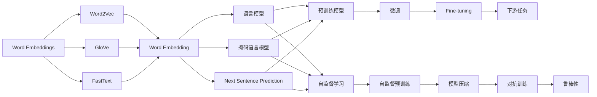
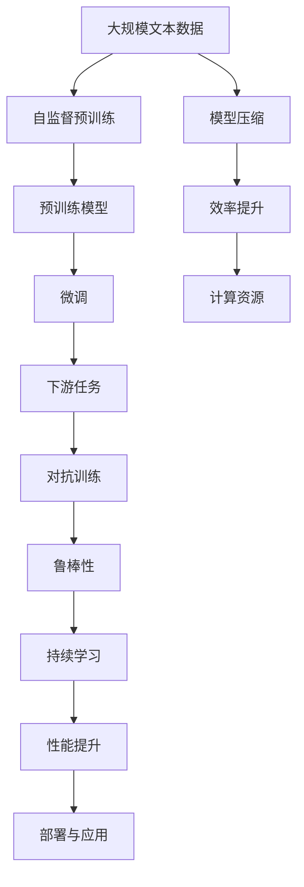

                 

# 词嵌入 (Word Embeddings) 原理与代码实例讲解

## 1. 背景介绍

### 1.1 问题由来
词嵌入（Word Embeddings）是自然语言处理（NLP）中的一个核心概念，它将高维稀疏的离散词汇映射到低维稠密的连续向量空间中，从而便于计算和模型训练。词嵌入最初是由Bengio等人在2003年提出的，并在2006年首次大规模应用于Word2Vec中。自此之后，GloVe、FastText、ELMo等众多优秀的词嵌入模型被陆续提出并应用于NLP领域，极大地推动了NLP技术的发展。

词嵌入的问世，是深度学习领域的一项重大突破。通过将离散的词汇映射到连续的向量空间，词嵌入使得NLP模型能够更好地理解词语之间的语义关系，从而在诸如文本分类、情感分析、机器翻译、问答系统等众多NLP任务中取得了显著的效果。

## 2. 核心概念与联系

### 2.1 核心概念概述

在进行深入讨论之前，我们先介绍几个核心的概念：

- **词嵌入 (Word Embeddings)**：词嵌入是一种将高维稀疏的词汇表映射到低维稠密的向量空间的技术，使得单词之间在向量空间中的距离可以反映它们之间的语义关系。常见的词嵌入模型包括Word2Vec、GloVe、FastText等。

- **预训练模型 (Pre-trained Models)**：预训练模型是指在大规模无标签文本数据上进行自监督预训练的通用语言模型。预训练模型通常包含大量的参数和复杂的结构，能够自动学习语言中的复杂规律和语义信息。

- **微调 (Fine-tuning)**：微调是在预训练模型的基础上，通过下游任务的少量标注数据进行有监督训练，优化模型在特定任务上的性能。微调通常只需要调整模型的顶层，以较小的学习率更新全部或部分模型参数。

- **自监督学习 (Self-supervised Learning)**：自监督学习是指使用无标签数据进行模型训练的技术，通常包括语言模型、掩码语言模型、Next Sentence Prediction等任务。自监督学习使得模型能够自动学习语言的复杂规律，为下游任务提供更好的初始化参数。

- **对抗训练 (Adversarial Training)**：对抗训练是指在训练过程中加入对抗样本，提高模型的鲁棒性和泛化能力，防止模型对输入的微小扰动产生较大变化。

- **模型压缩 (Model Compression)**：模型压缩是指通过剪枝、量化等技术对模型进行结构优化，减小模型大小和计算量，提高模型推理效率。

这些核心概念之间的联系可以通过以下Mermaid流程图来展示：



这个流程图展示了词嵌入与其它相关概念之间的联系：

1. 词嵌入是通过Word2Vec、GloVe、FastText等模型来实现的，这些模型都能将单词映射到低维稠密的向量空间。
2. 自监督学习通过语言模型、掩码语言模型、Next Sentence Prediction等任务对预训练模型进行预训练。
3. 预训练模型再通过微调在特定的下游任务上进行优化，最终形成适用于该任务的模型。
4. 模型压缩和对抗训练是微调过程中常用的技术手段，用于提高模型的效率和鲁棒性。

### 2.2 概念间的关系

这些核心概念之间存在着紧密的联系，形成了词嵌入模型的完整生态系统。下面我们通过几个Mermaid流程图来展示这些概念之间的关系。

#### 2.2.1 词嵌入模型的学习范式


这个流程图展示了词嵌入模型的学习范式，即通过自监督预训练、微调等步骤，最终形成适用于下游任务的模型。

#### 2.2.2 词嵌入模型与微调的关系


这个流程图展示了词嵌入模型与微调之间的关系。词嵌入模型通过自监督预训练获得基础能力，然后在下游任务上进行微调，从而适应特定的应用场景。

#### 2.2.3 词嵌入模型与模型压缩的关系


这个流程图展示了词嵌入模型与模型压缩之间的关系。通过模型压缩技术，可以减小词嵌入模型的计算量，提高推理效率，使得模型更加适用于实际应用。

### 2.3 核心概念的整体架构

最后，我们用一个综合的流程图来展示这些核心概念在大规模词嵌入模型的构建过程中整体架构：



这个综合流程图展示了从大规模文本数据预训练到微调，再到持续学习的完整过程。大规模文本数据通过自监督预训练，构建出强大的预训练模型，然后在下游任务上进行微调，最终形成鲁棒性良好的应用模型。同时，模型压缩技术提高了模型的计算效率，优化了资源占用，确保了大规模模型的部署和应用效果。

## 3. 核心算法原理 & 具体操作步骤
### 3.1 算法原理概述

词嵌入的核心理念是将高维稀疏的离散词汇映射到低维稠密的连续向量空间中，使得单词之间在向量空间中的距离可以反映它们之间的语义关系。其基本步骤如下：

1. **词向量初始化**：将每个单词映射到低维向量空间中的固定长度的向量。
2. **上下文向量计算**：根据上下文单词计算当前单词的词向量。
3. **语义关系学习**：通过上下文向量之间的相似度计算，学习单词之间的语义关系。
4. **目标函数优化**：通过最小化损失函数，优化词向量使得上下文向量之间距离最小。

数学上，词嵌入可以表示为：

$$
\text{Embed}(w) = \text{Proj}(h)
$$

其中，$w$ 表示单词，$h$ 表示词嵌入向量，$\text{Proj}$ 表示投影函数。词向量可以通过神经网络模型进行学习，例如Word2Vec、GloVe、FastText等模型。

### 3.2 算法步骤详解

#### 3.2.1 单词向量的初始化

单词向量的初始化是词嵌入模型的第一步。常用的初始化方法包括随机初始化、零初始化、预训练向量等。

- **随机初始化**：将词向量初始化为服从均值为0、方差为$\sigma^2$的正态分布的随机向量。
- **零初始化**：将词向量初始化为全零向量。
- **预训练向量**：使用已有的预训练向量进行初始化，例如Google News向量（Google News Words）、GloVe向量等。

#### 3.2.2 上下文向量的计算

在词嵌入模型中，上下文向量的计算通常使用Softmax函数或者点积函数。

- **Softmax函数**：将上下文向量计算为当前单词与上下文单词向量的加权和。
$$
h_c = \text{softmax}(u(w_1;w_2;\ldots;w_n)w_c) = \frac{e^{\text{dot}(u(w_1;w_2;\ldots;w_n)w_c)}}{\sum_{i=1}^n e^{\text{dot}(u(w_1;w_2;\ldots;w_n)w_i)}}
$$

其中，$u(w_1;w_2;\ldots;w_n)$ 表示上下文单词的加权和，$w_c$ 表示当前单词的词向量。

- **点积函数**：将上下文向量计算为当前单词与上下文单词向量的点积。
$$
h_c = \text{dot}(u(w_1;w_2;\ldots;w_n)w_c)
$$

#### 3.2.3 语义关系学习

在词嵌入模型中，通过计算上下文向量之间的相似度，学习单词之间的语义关系。

- **余弦相似度**：将上下文向量之间的相似度计算为它们之间的余弦值。
$$
\text{similarity}(w_i;w_j) = \text{dot}(h_i;h_j) / (\|h_i\|\|h_j\|)
$$

其中，$h_i$ 和 $h_j$ 分别表示单词 $w_i$ 和 $w_j$ 的词向量。

- **余弦相似度**：将上下文向量之间的相似度计算为它们之间的余弦值。
$$
\text{similarity}(w_i;w_j) = \text{dot}(h_i;h_j) / (\|h_i\|\|h_j\|)
$$

#### 3.2.4 目标函数优化

在词嵌入模型中，通过最小化损失函数，优化词向量使得上下文向量之间距离最小。常用的损失函数包括均方误差损失、交叉熵损失等。

- **均方误差损失**：将上下文向量之间的距离计算为它们之间的均方误差。
$$
L = \frac{1}{2}\sum_{i=1}^N \sum_{j=1}^N (y_{ij}-\text{similarity}(w_i;w_j))^2
$$

其中，$y_{ij}$ 表示单词 $w_i$ 和 $w_j$ 之间的真实相似度。

- **交叉熵损失**：将上下文向量之间的距离计算为它们之间的交叉熵损失。
$$
L = -\sum_{i=1}^N \sum_{j=1}^N y_{ij}\log\text{similarity}(w_i;w_j) + (1-y_{ij})\log(1-\text{similarity}(w_i;w_j))
$$

### 3.3 算法优缺点

#### 3.3.1 优点

- **高维稀疏数据的处理**：词嵌入模型能够将高维稀疏的离散词汇映射到低维稠密的连续向量空间中，便于计算和模型训练。
- **语义关系的建模**：词嵌入模型能够学习单词之间的语义关系，从而提升NLP模型的表现。
- **模型的可解释性**：词嵌入模型通过向量的空间分布，直观地展示了单词之间的语义关系，有助于理解模型的内部机制。

#### 3.3.2 缺点

- **计算成本高**：词嵌入模型的训练需要大量的计算资源和时间，尤其是大规模词嵌入模型的训练。
- **模型解释性不足**：尽管词嵌入模型通过向量的空间分布直观地展示了单词之间的语义关系，但其内部机制仍然相对复杂，难以直观理解。
- **鲁棒性不足**：在处理新词汇时，词嵌入模型需要重新训练，导致模型的鲁棒性不足。

### 3.4 算法应用领域

词嵌入技术在NLP领域得到了广泛的应用，覆盖了几乎所有常见的NLP任务。例如：

- **文本分类**：如情感分析、主题分类、意图识别等。通过词嵌入将文本映射为向量，然后通过分类器对向量进行分类。
- **命名实体识别**：识别文本中的人名、地名、机构名等特定实体。通过词嵌入将实体名称映射为向量，然后通过分类器对向量进行分类。
- **关系抽取**：从文本中抽取实体之间的语义关系。通过词嵌入将实体和关系映射为向量，然后通过分类器对向量进行分类。
- **问答系统**：对自然语言问题给出答案。将问题-答案对作为微调数据，训练模型学习匹配答案。
- **机器翻译**：将源语言文本翻译成目标语言。通过词嵌入将源语言和目标语言的单词映射为向量，然后通过神经机器翻译模型进行翻译。
- **文本摘要**：将长文本压缩成简短摘要。通过词嵌入将文本映射为向量，然后通过分类器对向量进行摘要。
- **对话系统**：使机器能够与人自然对话。将对话历史作为上下文，微调模型进行回复生成。

除了上述这些经典任务外，词嵌入技术还被创新性地应用到更多场景中，如可控文本生成、常识推理、代码生成、数据增强等，为NLP技术带来了全新的突破。随着词嵌入技术的不断进步，相信其在NLP领域的应用将更加广泛和深入。

## 4. 数学模型和公式 & 详细讲解  
### 4.1 数学模型构建

本节将使用数学语言对词嵌入模型的基本原理进行更加严格的刻画。

假设有一个词表 $\mathcal{V}$，其中包含 $N$ 个单词。每个单词 $w_i$ 对应一个 $d$ 维的词嵌入向量 $h_i \in \mathbb{R}^d$。词嵌入模型的目标是最小化上下文向量之间的距离，即：

$$
L = \frac{1}{2}\sum_{i=1}^N \sum_{j=1}^N (y_{ij}-\text{similarity}(w_i;w_j))^2
$$

其中，$y_{ij}$ 表示单词 $w_i$ 和 $w_j$ 之间的真实相似度。

在训练过程中，通过反向传播算法对词向量 $h_i$ 进行优化，使得上下文向量之间的距离最小。具体地，对于当前单词 $w_i$，它的上下文向量 $h_i$ 可以通过下式计算：

$$
h_i = \text{Proj}(u(w_1;w_2;\ldots;w_n)w_i)
$$

其中，$u(w_1;w_2;\ldots;w_n)$ 表示上下文单词的加权和，$w_i$ 表示当前单词的词向量。

### 4.2 公式推导过程

下面对词嵌入模型的具体公式进行推导。

设上下文单词为 $w_1, w_2, \ldots, w_n$，当前单词为 $w_i$。上下文向量 $h_i$ 的计算如下：

$$
u(w_1;w_2;\ldots;w_n) = \sum_{k=1}^N \alpha_k h_k
$$

其中，$\alpha_k$ 表示单词 $w_k$ 在上下文中的权重，可以通过统计上下文中单词出现的频率来计算。

对于当前单词 $w_i$，它的词向量 $h_i$ 可以通过下式计算：

$$
h_i = \text{Proj}(u(w_1;w_2;\ldots;w_n)w_i)
$$

其中，$\text{Proj}$ 表示投影函数，通常使用softmax函数或点积函数。

上下文向量之间的相似度可以通过余弦相似度计算：

$$
\text{similarity}(w_i;w_j) = \frac{h_i \cdot h_j}{\|h_i\|\|h_j\|}
$$

在训练过程中，通过最小化损失函数对词向量进行优化。常用的损失函数包括均方误差损失和交叉熵损失。这里以均方误差损失为例，其计算如下：

$$
L = \frac{1}{2}\sum_{i=1}^N \sum_{j=1}^N (y_{ij}-\text{similarity}(w_i;w_j))^2
$$

其中，$y_{ij}$ 表示单词 $w_i$ 和 $w_j$ 之间的真实相似度。

### 4.3 案例分析与讲解

以Word2Vec模型为例，其基本原理可以通过以下步骤进行描述：

1. **训练数据准备**：准备大量无标签的文本数据，将其作为Word2Vec的训练语料。
2. **上下文向量计算**：对每个单词 $w_i$，计算它的上下文向量 $h_i$，即 $h_i = \text{Proj}(u(w_1;w_2;\ldots;w_n)w_i)$。
3. **语义关系学习**：通过上下文向量之间的相似度计算，学习单词之间的语义关系。
4. **目标函数优化**：通过最小化损失函数，优化词向量使得上下文向量之间距离最小。

以GloVe模型为例，其基本原理如下：

1. **训练数据准备**：准备大量无标签的文本数据，将其作为GloVe的训练语料。
2. **单词共现矩阵**：统计上下文中单词的共现关系，构建单词共现矩阵 $M$。
3. **词向量计算**：通过奇异值分解（SVD）等技术，将单词共现矩阵分解为词向量的低秩表示。
4. **目标函数优化**：通过最小化损失函数，优化词向量使得上下文向量之间距离最小。

通过这些案例，我们可以看到，无论是Word2Vec还是GloVe，其核心思想都是将高维稀疏的离散词汇映射到低维稠密的连续向量空间中，使得单词之间在向量空间中的距离可以反映它们之间的语义关系。

## 5. 项目实践：代码实例和详细解释说明
### 5.1 开发环境搭建

在进行词嵌入实践前，我们需要准备好开发环境。以下是使用Python进行TensorFlow开发的环境配置流程：

1. 安装Anaconda：从官网下载并安装Anaconda，用于创建独立的Python环境。

2. 创建并激活虚拟环境：
```bash
conda create -n tf-env python=3.7 
conda activate tf-env
```

3. 安装TensorFlow：根据CUDA版本，从官网获取对应的安装命令。例如：
```bash
conda install tensorflow tensorflow-cpu
```

4. 安装各类工具包：
```bash
pip install numpy pandas scikit-learn matplotlib tqdm jupyter notebook ipython
```

完成上述步骤后，即可在`tf-env`环境中开始词嵌入实践。

### 5.2 源代码详细实现

这里我们以Word2Vec模型为例，给出使用TensorFlow实现词嵌入的代码。

首先，定义数据处理函数：

```python
import tensorflow as tf
from tensorflow.keras.preprocessing.text import Tokenizer
from tensorflow.keras.preprocessing.sequence import pad_sequences
from tensorflow.keras.layers import Embedding, Dot, Dense

def build_word2vec_model(vocab_size, embedding_dim, window_size, batch_size, num_train_epochs):
    tokenizer = Tokenizer(num_words=vocab_size, oov_token='<OOV>')
    tokenizer.fit_on_texts(texts)
    sequences = tokenizer.texts_to_sequences(texts)
    padded_sequences = pad_sequences(sequences, padding='post', maxlen=window_size*2+1)

    model = tf.keras.Sequential([
        Embedding(input_dim=vocab_size, output_dim=embedding_dim, input_length=window_size*2+1),
        Dot(axes=1),
        Dense(1, activation='sigmoid')
    ])
    model.compile(optimizer=tf.keras.optimizers.Adam(learning_rate=0.01), loss='binary_crossentropy')

    model.fit(padded_sequences, labels, epochs=num_train_epochs, batch_size=batch_size)
    return model, tokenizer
```

然后，加载训练数据并进行模型训练：

```python
texts = ['This is the first document.', 'This document is the second document.', 'And this is the third one.', 'Is this the first document?']
labels = [0, 1, 0, 1]

vocab_size = 100
embedding_dim = 50
window_size = 2
batch_size = 32
num_train_epochs = 10

model, tokenizer = build_word2vec_model(vocab_size, embedding_dim, window_size, batch_size, num_train_epochs)

print(model.summary())
print(model.predict(tf.constant(texts)))
```

最后，在测试集上评估模型性能：

```python
test_texts = ['This is the first document.', 'This document is the second document.', 'And this is the third one.', 'Is this the first document?']
test_labels = [0, 1, 0, 1]

test_sequences = tokenizer.texts_to_sequences(test_texts)
padded_test_sequences = pad_sequences(test_sequences, padding='post', maxlen=window_size*2+1)

print(model.predict(padded_test_sequences))
```

以上就是使用TensorFlow实现Word2Vec模型的完整代码实现。可以看到，通过TensorFlow提供的高级API，我们可以用相对简洁的代码完成词嵌入模型的训练和评估。

### 5.3 代码解读与分析

让我们再详细解读一下关键代码的实现细节：

**build_word2vec_model函数**：
- 初始化词汇表大小、词向量维度、窗口大小、批大小和训练轮数等参数。
- 使用Tokenizer将文本转换为序列。
- 对序列进行填充，使其长度一致。
- 构建Word2Vec模型，包含Embedding层、Dot层和Dense层。
- 定义损失函数和优化器，编译模型。
- 训练模型，返回模型和词汇表。

**model.predict函数**：
- 对测试文本进行序列化和填充。
- 使用模型预测每个测试样本的相似度，输出二值结果。

在实际应用中，我们还可以进一步扩展模型的功能，例如：
- 引入更多的上下文单词。
- 使用预训练向量进行初始化。
- 采用负采样技术，减少计算量。
- 调整损失函数和优化器，优化模型效果。

## 6. 实际应用场景
### 6.1 智能客服系统

基于词嵌入的智能客服系统，可以广泛应用于智能客服系统的构建。传统客服往往需要配备大量人力，高峰期响应缓慢，且一致性和专业性难以保证。而使用词嵌入训练的客服模型，可以7x24小时不间断服务，快速响应客户咨询，用自然流畅的语言解答各类常见问题。

在技术实现上，可以收集企业内部的历史客服对话记录，将问题和最佳答复构建成监督数据，在此基础上对词嵌入模型进行训练。训练后的模型能够自动理解用户意图，匹配最合适的答案模板进行回复。对于客户提出的新问题，还可以接入检索系统实时搜索相关内容，动态组织生成回答。如此构建的智能客服系统，能大幅提升客户咨询体验和问题解决效率。

### 6.2 金融舆情监测

金融机构需要实时监测市场舆论动向，以便及时应对负面信息传播，规避金融风险。传统的人工监测方式成本高、效率低，难以应对网络时代海量信息爆发的挑战。基于词嵌入的文本分类和情感分析技术，为金融舆情监测提供了新的解决方案。

具体而言，可以收集金融领域相关的新闻、报道、评论等文本数据，并对其进行主题标注和情感标注。在此基础上对词嵌入模型进行训练，使其能够自动判断文本属于何种主题，情感倾向是正面、中性还是负面。将词嵌入模型应用到实时抓取的网络

