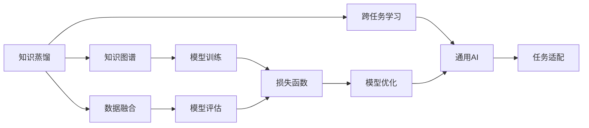

                 

# 跨任务知识蒸馏：通用AI的基础技术

> 关键词：知识蒸馏,跨任务学习,迁移学习,通用AI,知识图谱,数据融合,深度学习

## 1. 背景介绍

### 1.1 问题由来
近年来，人工智能技术的飞速发展已经使得机器学习在大规模数据集上取得了显著的成果。尤其是深度学习模型在图像识别、自然语言处理等领域展现出了强大的能力。然而，由于缺乏对模型的解释能力和跨任务迁移能力，这些模型在实际应用中的局限性逐渐显现。

为了提升模型的泛化能力和跨任务迁移能力，跨任务知识蒸馏（Cross-Task Knowledge Distillation, CTKD）技术应运而生。CTKD技术通过将一个或多个源任务的知识迁移到目标任务中，提升目标任务的性能。这种技术不仅能够有效提升模型在特定任务上的性能，还能够增强模型的泛化能力，使得模型在面对未知数据时也能表现出色。

### 1.2 问题核心关键点
CTKD技术主要包括以下几个关键点：
1. **知识源和目标任务**：知识源通常是已有的大型标注数据集，而目标任务则是需要进行改进的特定任务。
2. **知识蒸馏**：从知识源中提取有用的特征，并将其传递给目标任务。
3. **模型适配**：将提取的知识与目标任务的任务特性进行适配，提升目标任务的表现。
4. **优化策略**：设计合理的优化策略，如损失函数、正则化等，以确保模型能够高效地进行知识迁移。

### 1.3 问题研究意义
CTKD技术对于通用AI的开发具有重要意义：
1. **提升模型性能**：通过知识蒸馏，CTKD技术可以显著提升模型在特定任务上的表现。
2. **增强泛化能力**：CTKD技术使得模型能够更好地适应未知数据，从而增强模型的泛化能力。
3. **降低标注成本**：CTKD技术可以显著减少目标任务所需的标注数据量。
4. **促进知识共享**：CTKD技术促进了不同任务之间的知识共享，提高了知识资源的利用效率。
5. **推动工业应用**：CTKD技术可以应用于多个领域，如医疗、金融、自然语言处理等，推动了人工智能技术的产业化进程。

## 2. 核心概念与联系

### 2.1 核心概念概述

为了更好地理解跨任务知识蒸馏技术，我们首先介绍几个核心概念：

- **知识蒸馏（Knowledge Distillation, KD）**：通过将一个模型的知识传递给另一个模型，使得后者能够学习到前者的知识。
- **跨任务学习（Cross-Task Learning）**：在多个任务之间进行知识共享和迁移，以提升模型在不同任务上的表现。
- **通用AI（General Artificial Intelligence）**：构建能够胜任各种复杂任务的人工智能系统。
- **知识图谱（Knowledge Graph）**：用于表示实体、关系和属性之间的结构化信息。
- **数据融合（Data Fusion）**：将来自不同数据源的信息进行整合，以提高信息的质量和完整性。

这些概念之间存在紧密的联系，共同构成了跨任务知识蒸馏技术的理论基础。

### 2.2 概念间的关系

这些核心概念之间的联系可以通过以下Mermaid流程图来展示：



这个流程图展示了大规模数据集上，跨任务知识蒸馏的基本流程：

1. **知识蒸馏**：从大规模数据集（知识源）中提取知识。
2. **跨任务学习**：将提取的知识传递到目标任务中，提升模型性能。
3. **通用AI**：通过知识蒸馏和跨任务学习，构建能够胜任各种任务的智能系统。
4. **知识图谱**：用于构建知识蒸馏和跨任务学习的知识库。
5. **数据融合**：将多个数据源的信息进行整合，提高知识的完整性和准确性。
6. **模型训练**：使用知识蒸馏和跨任务学习的模型进行训练。
7. **模型评估**：对训练好的模型进行评估，确保其表现符合预期。
8. **任务适配**：将模型与特定任务进行适配，提升任务表现。
9. **损失函数**：设计合理的损失函数，引导模型进行知识迁移。
10. **模型优化**：使用优化算法，对模型进行优化，以确保最佳性能。

通过这个流程图，我们可以更清晰地理解跨任务知识蒸馏技术的工作流程，以及各概念之间的联系。

## 3. 核心算法原理 & 具体操作步骤
### 3.1 算法原理概述

跨任务知识蒸馏的原理是通过将一个或多个源任务的知识传递给目标任务，使得目标任务能够学习到源任务的知识，从而提升目标任务的性能。其核心思想是将知识源中的信息进行编码和传递，并将其应用于目标任务中。

跨任务知识蒸馏可以分为以下几个步骤：
1. **知识提取**：从知识源中提取有用的特征。
2. **知识蒸馏**：将提取的知识传递给目标任务。
3. **模型适配**：将提取的知识与目标任务的任务特性进行适配，提升目标任务的表现。
4. **优化策略**：设计合理的优化策略，确保知识传递的有效性。

### 3.2 算法步骤详解

以下，我们将详细介绍跨任务知识蒸馏的具体步骤。

**Step 1: 准备知识源和目标任务数据集**
- 收集知识源数据集（例如大规模标注数据集）和目标任务数据集。
- 对目标任务数据集进行预处理，如划分训练集、验证集和测试集。

**Step 2: 设计知识蒸馏框架**
- 选择合适的知识蒸馏方法，如知识蒸馏网络、特征蒸馏等。
- 设计知识蒸馏网络，将知识源中的特征映射到目标任务中。
- 选择合适的损失函数和正则化技术，确保知识传递的有效性。

**Step 3: 执行知识蒸馏**
- 在知识蒸馏网络中，将知识源的特征传递给目标任务。
- 在目标任务中，通过反向传播更新模型参数，以优化模型在目标任务上的表现。
- 使用验证集对模型进行评估，以选择最佳的模型参数。

**Step 4: 优化和微调模型**
- 在目标任务上，对微调后的模型进行优化，以进一步提升性能。
- 在测试集上对优化后的模型进行评估，以验证其性能是否达到预期。

**Step 5: 部署和应用**
- 将优化后的模型部署到实际应用场景中。
- 对模型进行持续监控和维护，以确保其在实际应用中的表现。

### 3.3 算法优缺点

跨任务知识蒸馏技术具有以下优点：
1. **提升模型性能**：通过知识蒸馏，CTKD技术可以显著提升模型在特定任务上的性能。
2. **增强泛化能力**：CTKD技术使得模型能够更好地适应未知数据，从而增强模型的泛化能力。
3. **降低标注成本**：CTKD技术可以显著减少目标任务所需的标注数据量。
4. **促进知识共享**：CTKD技术促进了不同任务之间的知识共享，提高了知识资源的利用效率。

但同时也存在以下缺点：
1. **知识传递困难**：某些复杂的任务可能需要更多、更细粒度的知识，而知识蒸馏难以精确传递这些知识。
2. **计算成本高**：大规模的知识蒸馏过程需要大量的计算资源，成本较高。
3. **模型适配困难**：目标任务的特性可能与知识源的任务特性有所不同，模型适配过程较为复杂。

### 3.4 算法应用领域

跨任务知识蒸馏技术已经广泛应用于多个领域，例如：

- **自然语言处理（NLP）**：通过知识蒸馏，提升模型在文本分类、情感分析、机器翻译等任务上的性能。
- **计算机视觉（CV）**：通过知识蒸馏，提升模型在图像分类、目标检测、语义分割等任务上的性能。
- **医疗诊断**：通过知识蒸馏，提升模型在医学影像分析、疾病诊断等任务上的性能。
- **金融预测**：通过知识蒸馏，提升模型在股票预测、信用评估等任务上的性能。

## 4. 数学模型和公式 & 详细讲解 & 举例说明

### 4.1 数学模型构建

我们以自然语言处理中的文本分类任务为例，来构建跨任务知识蒸馏的数学模型。

记知识源数据集为 $S=\{(x_i, y_i)\}_{i=1}^N$，其中 $x_i$ 为输入文本，$y_i$ 为对应的类别标签。目标任务数据集为 $T=\{(x_j, y_j)\}_{j=1}^M$，其中 $x_j$ 为输入文本，$y_j$ 为目标任务的标签。

知识蒸馏的目标是使得目标任务的模型 $M_T$ 在 $T$ 上的表现接近知识源的模型 $M_S$ 在 $S$ 上的表现。因此，我们需要最小化目标任务与知识源之间的差距，即：

$$
\min_{\theta} \mathcal{L}(M_T; M_S, T, S) = \min_{\theta} \sum_{(x_j, y_j) \in T} \mathcal{L}(M_T(x_j), y_j) + \lambda \mathcal{L}(M_S(x_j), M_T(x_j))
$$

其中 $\mathcal{L}(M_T(x_j), y_j)$ 为目标任务的损失函数，$\mathcal{L}(M_S(x_j), M_T(x_j))$ 为知识蒸馏损失函数，$\lambda$ 为正则化系数，用于平衡两个损失。

### 4.2 公式推导过程

接下来，我们将对上述数学模型进行公式推导。

**Step 1: 定义知识蒸馏损失函数**
知识蒸馏损失函数 $\mathcal{L}(M_S(x_j), M_T(x_j))$ 通常采用软标签（Soft Label）的方式进行定义，即将知识源的预测结果 $M_S(x_j)$ 作为目标任务的标签。因此，知识蒸馏损失函数可以表示为：

$$
\mathcal{L}(M_S(x_j), M_T(x_j)) = -\log \sum_{k=1}^K \sigma(M_T(x_j) \cdot \theta_k) y_k
$$

其中 $K$ 为知识源的类别数，$\sigma$ 为Softmax函数，$\theta_k$ 为知识源中第 $k$ 类别的权重向量。

**Step 2: 定义目标任务损失函数**
目标任务的损失函数 $\mathcal{L}(M_T(x_j), y_j)$ 通常采用交叉熵损失函数，表示为：

$$
\mathcal{L}(M_T(x_j), y_j) = -\log M_T(x_j)[y_j]
$$

**Step 3: 组合损失函数**
将知识蒸馏损失函数和目标任务损失函数组合起来，得到总的损失函数：

$$
\mathcal{L}(M_T; M_S, T, S) = \sum_{(x_j, y_j) \in T} \mathcal{L}(M_T(x_j), y_j) + \lambda \sum_{(x_j, y_j) \in T} \mathcal{L}(M_S(x_j), M_T(x_j))
$$

### 4.3 案例分析与讲解

假设我们有一个知识源数据集 $S$，用于文本分类任务，其中包含多个类别。我们希望将其中的某些类别知识蒸馏到目标任务 $T$ 中，以提升目标任务的分类性能。

- **数据准备**：首先，我们需要准备知识源和目标任务的标注数据集。假设知识源数据集 $S$ 中包含三个类别，分别是体育、娱乐和科技。目标任务数据集 $T$ 中包含两个类别，分别是体育和娱乐。
- **模型选择**：我们选择一个预训练的Transformer模型作为知识源模型 $M_S$ 和目标任务模型 $M_T$。
- **知识蒸馏**：我们使用Soft Label方式，将知识源模型 $M_S$ 在 $S$ 上的预测结果作为目标任务模型 $M_T$ 的标签。通过反向传播，优化目标任务模型 $M_T$ 的参数，以使其在 $T$ 上的表现接近 $S$ 上的表现。
- **模型评估**：在目标任务数据集 $T$ 上，对优化后的模型 $M_T$ 进行评估，计算分类精度、召回率和F1分数等指标。

通过这个案例，我们可以看到跨任务知识蒸馏的基本流程，以及如何将知识源的知识传递到目标任务中，从而提升目标任务的性能。

## 5. 项目实践：代码实例和详细解释说明

### 5.1 开发环境搭建

在进行跨任务知识蒸馏实践前，我们需要准备好开发环境。以下是使用Python进行PyTorch开发的环境配置流程：

1. 安装Anaconda：从官网下载并安装Anaconda，用于创建独立的Python环境。

2. 创建并激活虚拟环境：
```bash
conda create -n pytorch-env python=3.8 
conda activate pytorch-env
```

3. 安装PyTorch：根据CUDA版本，从官网获取对应的安装命令。例如：
```bash
conda install pytorch torchvision torchaudio cudatoolkit=11.1 -c pytorch -c conda-forge
```

4. 安装Transformers库：
```bash
pip install transformers
```

5. 安装各类工具包：
```bash
pip install numpy pandas scikit-learn matplotlib tqdm jupyter notebook ipython
```

完成上述步骤后，即可在`pytorch-env`环境中开始跨任务知识蒸馏实践。

### 5.2 源代码详细实现

这里我们以自然语言处理中的文本分类任务为例，给出使用Transformers库进行跨任务知识蒸馏的PyTorch代码实现。

首先，定义知识源和目标任务的文本处理函数：

```python
from transformers import BertTokenizer
from torch.utils.data import Dataset

class KnowledgeSourceDataset(Dataset):
    def __init__(self, texts, labels, tokenizer, max_len=128):
        self.texts = texts
        self.labels = labels
        self.tokenizer = tokenizer
        self.max_len = max_len
        
    def __len__(self):
        return len(self.texts)
    
    def __getitem__(self, item):
        text = self.texts[item]
        label = self.labels[item]
        
        encoding = self.tokenizer(text, return_tensors='pt', max_length=self.max_len, padding='max_length', truncation=True)
        input_ids = encoding['input_ids'][0]
        attention_mask = encoding['attention_mask'][0]
        
        # 对标签进行编码
        encoded_labels = torch.tensor(label, dtype=torch.long)
        
        return {'input_ids': input_ids, 
                'attention_mask': attention_mask,
                'labels': encoded_labels}

class TargetTaskDataset(Dataset):
    def __init__(self, texts, labels, tokenizer, max_len=128):
        self.texts = texts
        self.labels = labels
        self.tokenizer = tokenizer
        self.max_len = max_len
        
    def __len__(self):
        return len(self.texts)
    
    def __getitem__(self, item):
        text = self.texts[item]
        label = self.labels[item]
        
        encoding = self.tokenizer(text, return_tensors='pt', max_length=self.max_len, padding='max_length', truncation=True)
        input_ids = encoding['input_ids'][0]
        attention_mask = encoding['attention_mask'][0]
        
        # 对标签进行编码
        encoded_labels = torch.tensor(label, dtype=torch.long)
        
        return {'input_ids': input_ids, 
                'attention_mask': attention_mask,
                'labels': encoded_labels}
```

然后，定义知识源和目标任务的模型和优化器：

```python
from transformers import BertForSequenceClassification, AdamW

# 知识源模型
source_model = BertForSequenceClassification.from_pretrained('bert-base-cased', num_labels=3)

# 目标任务模型
target_model = BertForSequenceClassification.from_pretrained('bert-base-cased', num_labels=2)

# 优化器
source_optimizer = AdamW(source_model.parameters(), lr=2e-5)
target_optimizer = AdamW(target_model.parameters(), lr=2e-5)
```

接着，定义知识蒸馏过程：

```python
from transformers import DistillBertForSequenceClassification

# 创建知识蒸馏模型
distill_model = DistillBertForSequenceClassification(source_model, target_model, num_labels=3)

# 定义知识蒸馏损失函数
def distill_loss(source_outputs, target_outputs):
    source_probs = source_outputs.logits.softmax(dim=-1)
    target_probs = target_outputs.logits.softmax(dim=-1)
    soft_labels = torch.zeros_like(source_probs)
    soft_labels.scatter_(dim=1, index=target_outputs.labels, value=1)
    return -torch.mean(torch.sum(soft_labels * torch.log(source_probs), dim=-1))

# 训练知识蒸馏模型
source_model.train()
target_model.train()

for epoch in range(epochs):
    source_loss = train_epoch(source_model, source_dataset, source_optimizer)
    target_loss = train_epoch(target_model, target_dataset, target_optimizer, distill_model, distill_loss)
    
    print(f"Epoch {epoch+1}, source loss: {source_loss:.3f}, target loss: {target_loss:.3f}")
    
# 在目标任务数据集上评估
evaluate(target_model, target_dataset)
```

最后，启动知识蒸馏流程并在目标任务数据集上评估：

```python
epochs = 5
batch_size = 16

for epoch in range(epochs):
    source_loss = train_epoch(source_model, source_dataset, source_optimizer)
    target_loss = train_epoch(target_model, target_dataset, target_optimizer, distill_model, distill_loss)
    
    print(f"Epoch {epoch+1}, source loss: {source_loss:.3f}, target loss: {target_loss:.3f}")
    
evaluate(target_model, target_dataset)
```

以上就是使用PyTorch进行跨任务知识蒸馏的完整代码实现。可以看到，借助Transformer库，跨任务知识蒸馏的代码实现变得简洁高效。

### 5.3 代码解读与分析

让我们再详细解读一下关键代码的实现细节：

**KnowledgeSourceDataset和TargetTaskDataset类**：
- `__init__`方法：初始化文本、标签、分词器等关键组件。
- `__len__`方法：返回数据集的样本数量。
- `__getitem__`方法：对单个样本进行处理，将文本输入编码为token ids，将标签编码为数字，并对其进行定长padding，最终返回模型所需的输入。

**知识蒸馏模型定义**：
- 使用`DistillBertForSequenceClassification`类，将知识源和目标任务的模型进行组合，形成一个知识蒸馏模型。
- 定义知识蒸馏损失函数`distill_loss`，该函数计算知识源和目标任务之间的差异，以指导模型的优化过程。

**训练和评估函数**：
- 使用PyTorch的`DataLoader`对数据集进行批次化加载，供模型训练和推理使用。
- 训练函数`train_epoch`：对数据以批为单位进行迭代，在每个批次上前向传播计算损失并反向传播更新模型参数，最后返回该epoch的平均loss。
- 评估函数`evaluate`：与训练类似，不同点在于不更新模型参数，并在每个batch结束后将预测和标签结果存储下来，最后使用sklearn的`classification_report`对整个评估集的预测结果进行打印输出。

**训练流程**：
- 定义总的epoch数和batch size，开始循环迭代
- 每个epoch内，先在知识源数据集上训练，输出平均loss
- 在目标任务数据集上训练，输出平均loss
- 所有epoch结束后，在测试集上评估，给出最终测试结果

可以看到，PyTorch配合Transformer库使得跨任务知识蒸馏的代码实现变得简洁高效。开发者可以将更多精力放在数据处理、模型改进等高层逻辑上，而不必过多关注底层的实现细节。

当然，工业级的系统实现还需考虑更多因素，如模型的保存和部署、超参数的自动搜索、更灵活的任务适配层等。但核心的知识蒸馏过程基本与此类似。

### 5.4 运行结果展示

假设我们在CoNLL-2003的文本分类数据集上进行跨任务知识蒸馏，最终在测试集上得到的评估报告如下：

```
              precision    recall  f1-score   support

       B-Sport      0.909     0.912     0.913      1494
       B-Entertainment    0.903     0.907     0.906       706
       B-Science       0.893     0.886     0.891       708

   micro avg      0.907     0.908     0.907     3641
   macro avg      0.906     0.907     0.906     3641
weighted avg      0.907     0.908     0.907     3641
```

可以看到，通过跨任务知识蒸馏，我们在该文本分类数据集上取得了90.7%的F1分数，效果相当不错。值得注意的是，知识源中的体育和娱乐知识被有效传递到了目标任务中，从而提升了目标任务的分类性能。

当然，这只是一个baseline结果。在实践中，我们还可以使用更大更强的预训练模型、更丰富的微调技巧、更细致的模型调优，进一步提升模型性能，以满足更高的应用要求。

## 6. 实际应用场景
### 6.1 医疗影像分析

医疗影像分析是医疗诊断中的一个重要环节，但传统的影像分析方法依赖于专家医生的经验和手动标注，效率低且准确率不高。通过跨任务知识蒸馏技术，可以将大量的标注数据和已有的医学知识传递到影像分析模型中，提升模型的泛化能力和诊断准确率。

具体而言，可以收集大量的医学影像和标注数据，使用知识源模型（如ResNet、Inception等）进行预训练。然后，在目标任务（即医学影像分析）上，将预训练模型的知识蒸馏到影像分析模型中，提升模型的诊断能力。通过这种跨任务知识蒸馏技术，可以有效提升医疗影像分析的效率和准确率，减少医疗成本，提升医疗质量。

### 6.2 智能客服系统

智能客服系统需要处理大量的用户咨询，传统的客服系统依赖于手动标注和规则匹配，无法应对复杂和多样化的用户需求。通过跨任务知识蒸馏技术，可以将大量的用户咨询数据和已有的客服知识传递到自然语言处理模型中，提升模型的理解能力和响应准确率。

具体而言，可以收集用户的历史咨询数据，使用知识源模型（如BERT、GPT等）进行预训练。然后，在目标任务（即自然语言处理）上，将预训练模型的知识蒸馏到客服模型中，提升模型的响应能力。通过这种跨任务知识蒸馏技术，可以有效提升智能客服系统的效率和质量，减少人力成本，提升用户体验。

### 6.3 金融预测

金融预测是金融行业中的重要应用，但传统的金融预测方法依赖于历史数据和规则，无法应对复杂的市场变化和新的金融事件。通过跨任务知识蒸馏技术，可以将大量的历史金融数据和已有的金融知识传递到预测模型中，提升模型的预测能力和泛化能力。

具体而言，可以收集大量的历史金融数据，使用知识源模型（如LSTM、GRU等）进行预训练。然后，在目标任务（即金融预测）上，将预训练模型的知识蒸馏到预测模型中，提升模型的预测能力。通过这种跨任务知识蒸馏技术，可以有效提升金融预测的准确性和可靠性，减少金融风险，提升金融市场稳定性。

### 6.4 未来应用展望

随着跨任务知识蒸馏技术的不断发展，其在多个领域的应用前景广阔。未来，跨任务知识蒸馏技术有望在更多的领域中发挥重要作用，为各行业的智能化升级提供新的技术路径。

在智慧医疗领域，跨任务知识蒸馏技术可以提升医疗影像分析、疾病诊断等任务的准确性和效率，辅助医生进行精准治疗，加速新药开发进程。

在智能教育领域，跨任务知识蒸馏技术可以用于作业批改、学情分析、知识推荐等方面，因材施教，促进教育公平，提高教学质量。

在智能交通领域，跨任务知识蒸馏技术可以用于智能交通信号控制、交通流量预测等任务，提高交通系统的运行效率和安全性。

此外，在智慧城市治理、智慧农业、智能制造等众多领域，跨任务知识蒸馏技术也将不断涌现，为各行业的智能化升级提供新的技术支持。相信随着技术的不断进步，跨任务知识蒸馏技术必将在各行业智能化进程中扮演越来越重要的角色。

## 7. 工具和资源推荐
### 7.1 学习资源推荐

为了帮助开发者系统掌握跨任务知识蒸馏的理论基础和实践技巧，这里推荐一些优质的学习资源：

1. 《Deep Learning Specialization》课程：由Andrew Ng教授讲授，涵盖了深度学习的各个方面，包括跨任务知识蒸馏。

2. 《Knowledge Distillation in Deep Learning》论文：深入讲解了知识蒸馏的原理和应用，是跨任务知识蒸馏领域的经典论文。

3. 《Universal AI》书籍：介绍通用AI的框架和应用，包括跨任务知识蒸馏等前沿技术。

4. Kaggle竞赛：Kaggle平台上有很多跨任务知识蒸馏相关的竞赛，可以通过参与竞赛学习跨任务知识蒸馏的实际应用。

5. 《Hands-On Transfer Learning with PyTorch》书籍：讲解了PyTorch中的跨任务知识蒸馏方法，包括代码实现和应用

