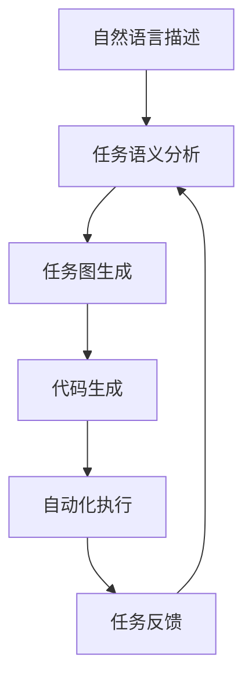

                 

# AI Agent: AI的下一个风口 AutoGPT：通过自然语言的需求描述执行自动化任务

> 关键词：AutoGPT,自然语言处理,自动执行,任务自动化,大模型微调

## 1. 背景介绍

### 1.1 问题由来
近年来，人工智能(AI)领域取得了巨大的突破，特别是在自然语言处理(NLP)和计算机视觉(CV)等方面。然而，尽管有了如此强大的技术基础，许多领域仍然面临着繁琐的、重复性的工作，如数据标注、文档整理、流程审批等。这些问题往往耗时费力，难以自动化，成为阻碍AI技术深入应用的一大瓶颈。

AutoGPT（Automatic Generation of Procedural Tasks）正是为了解决这一问题而诞生的一种技术。它利用大语言模型（Large Language Models, LLMs），通过自然语言处理（Natural Language Processing, NLP）技术，自动将复杂的自然语言需求描述转化为具体的、可执行的任务，从而极大地提高了自动化水平和工作效率。

### 1.2 问题核心关键点
AutoGPT的核心思想是将自然语言任务描述转换为编程语言任务，使得AI系统能够自动执行复杂的业务流程。具体来说，AutoGPT包括以下几个关键步骤：

1. 收集用户任务描述：用户通过自然语言的形式描述他们希望自动化执行的任务，例如“生成一个2020年的年度报告，包括市场分析、收入统计和财务报表”。

2. 任务语义分析：AutoGPT系统通过语言模型分析任务描述，提取出关键信息，例如“报告主题”、“需要包含的文档类型”、“数据来源”等。

3. 任务图生成：AutoGPT基于提取的信息生成一个任务图，描述了任务执行的逻辑流程，例如“从数据库中提取数据”、“生成图表”、“编写报告”等。

4. 代码生成与执行：AutoGPT根据任务图生成Python代码，并自动执行这些代码，从而完成自动化任务。

5. 结果反馈与优化：AutoGPT根据任务的执行结果，不断优化任务图和代码生成策略，提高任务的自动化水平。

### 1.3 问题研究意义
AutoGPT技术的应用，对提升工作效率、降低人工成本、促进AI技术的深入应用具有重要意义：

1. 自动化处理复杂任务：AutoGPT能够自动处理复杂的、重复性高的任务，如数据清洗、文档整理、报表生成等，大大提升工作效率。

2. 减少人力需求：通过自动化，AutoGPT可以替代大量人工操作，减少人力资源需求，降低企业运营成本。

3. 推动AI技术普及：AutoGPT技术的普及，将使更多企业能够采用AI技术，加速数字化转型。

4. 提高任务执行质量：AutoGPT系统可以提供一致、高质量的任务执行结果，避免人为错误。

5. 增强灵活性：AutoGPT能够适应不同业务场景，提供个性化的自动化解决方案。

总之，AutoGPT技术的普及和应用，将极大推动AI技术在各行各业的深入应用，提升企业的智能化水平和竞争力。

## 2. 核心概念与联系

### 2.1 核心概念概述

AutoGPT技术涉及多个关键概念，主要包括：

- 大语言模型（Large Language Models, LLMs）：基于预训练的大规模语言模型，能够理解并生成自然语言文本。例如GPT-3、BERT等。

- 自然语言处理（Natural Language Processing, NLP）：涉及文本预处理、词法分析、语义理解、文本生成等技术，是AutoGPT系统的核心。

- 自动生成代码（Code Generation）：AutoGPT系统通过代码生成技术，将任务图转换为可执行的Python代码，实现任务自动化。

- 任务图（Task Graph）：AutoGPT系统基于任务描述生成的任务流程图，描述了任务执行的逻辑流程。

- 自动化执行（Automated Execution）：AutoGPT系统能够自动执行生成的代码，完成指定的自动化任务。

这些概念之间存在紧密的联系，形成了AutoGPT技术的完整生态系统。

### 2.2 概念间的关系

AutoGPT技术的各个核心概念之间存在着紧密的联系，可以通过以下Mermaid流程图来展示：



这个流程图展示了AutoGPT技术的核心流程：首先，用户提供自然语言描述，然后通过NLP技术进行分析，生成任务图，接着生成Python代码并执行，最后根据任务执行结果进行反馈，不断优化任务图和代码生成策略。

### 2.3 核心概念的整体架构

最终，我们将用以下综合流程图展示AutoGPT技术的整体架构：


这个综合流程图展示了AutoGPT技术的各个核心组件及其相互关系。AutoGPT技术通过自然语言处理，自动将任务描述转化为可执行的代码，并通过自动化执行完成复杂任务，不断优化任务图和代码生成策略，实现任务的自动化处理。

## 3. 核心算法原理 & 具体操作步骤
### 3.1 算法原理概述

AutoGPT技术通过自然语言处理技术，将复杂的自然语言需求描述转换为可执行的代码。其核心算法主要包括以下几个步骤：

1. 任务语义分析：通过语言模型分析任务描述，提取出关键信息，例如“报告主题”、“需要包含的文档类型”、“数据来源”等。

2. 任务图生成：基于提取的信息生成一个任务图，描述了任务执行的逻辑流程，例如“从数据库中提取数据”、“生成图表”、“编写报告”等。

3. 代码生成与执行：根据任务图生成Python代码，并自动执行这些代码，从而完成自动化任务。

4. 结果反馈与优化：根据任务的执行结果，不断优化任务图和代码生成策略，提高任务的自动化水平。

### 3.2 算法步骤详解

以下是对AutoGPT技术的详细步骤详解：

1. **任务语义分析**
   - 使用预训练的语言模型，例如GPT-3、BERT等，对用户提供的自然语言描述进行预处理和分析。
   - 通过自然语言处理技术，提取出任务的关键信息，例如“报告主题”、“需要包含的文档类型”、“数据来源”等。
   - 将提取的信息转换为结构化数据，例如“需要生成2020年的年度报告”、“需要包含市场分析、收入统计和财务报表”等。

2. **任务图生成**
   - 基于提取的结构化数据，使用图神经网络（Graph Neural Networks, GNNs）生成一个任务图，描述了任务执行的逻辑流程。
   - 任务图通常由节点（Nodes）和边（Edges）组成，每个节点表示一个具体的任务步骤，边表示任务之间的依赖关系。
   - 例如，生成的任务图可能包含“从数据库中提取数据”、“生成图表”、“编写报告”等节点，以及“提取数据后生成图表”、“图表后编写报告”等边。

3. **代码生成**
   - 根据任务图，使用代码生成技术生成Python代码。
   - 常见的代码生成方法包括基于模板的生成、基于神经网络的生成等。
   - 例如，生成的代码可能包含“从数据库中提取数据”、“生成图表”、“编写报告”等函数，以及函数之间的调用关系。

4. **自动化执行**
   - 自动执行生成的Python代码，完成自动化任务。
   - 使用Python的解释器或编译器，执行生成的代码，并收集任务的执行结果。

5. **结果反馈与优化**
   - 根据任务的执行结果，收集反馈信息，例如执行时间、任务成功率、生成代码质量等。
   - 使用机器学习算法，对任务图和代码生成策略进行优化，提高任务的自动化水平。

### 3.3 算法优缺点

AutoGPT技术的优点包括：

1. 自动化处理复杂任务：AutoGPT能够自动处理复杂的、重复性高的任务，如数据清洗、文档整理、报表生成等，大大提升工作效率。

2. 减少人力需求：通过自动化，AutoGPT可以替代大量人工操作，减少人力资源需求，降低企业运营成本。

3. 推动AI技术普及：AutoGPT技术的普及，将使更多企业能够采用AI技术，加速数字化转型。

4. 提高任务执行质量：AutoGPT系统可以提供一致、高质量的任务执行结果，避免人为错误。

5. 增强灵活性：AutoGPT能够适应不同业务场景，提供个性化的自动化解决方案。

AutoGPT技术的缺点包括：

1. 数据依赖性强：AutoGPT依赖于高质量的语料库和结构化数据，对数据的质量和完整性要求较高。

2. 任务图生成复杂：任务图生成过程涉及复杂的自然语言处理和图神经网络技术，需要大量的计算资源和算力支持。

3. 代码生成质量不稳定：代码生成质量受多种因素影响，例如任务复杂度、语言模型参数等，生成的代码质量和可读性存在不确定性。

4. 需要持续优化：AutoGPT系统需要不断优化任务图和代码生成策略，才能提高任务的自动化水平。

5. 缺乏通用性：AutoGPT技术目前主要应用于特定的任务场景，尚未形成通用的自动化解决方案。

### 3.4 算法应用领域

AutoGPT技术已经在多个领域得到了应用，具体包括以下几个方面：

1. 数据分析与报告生成：AutoGPT可以自动从数据集中提取信息，生成分析报告，帮助企业快速理解数据趋势和变化。

2. 文档整理与归档：AutoGPT可以自动整理和归档文档，例如从邮件中提取关键信息，生成文档摘要和目录。

3. 流程自动化：AutoGPT可以自动执行复杂的业务流程，例如审批流程、客户服务流程等。

4. 内容生成：AutoGPT可以自动生成文本、代码、图像等内容，例如自动生成代码注释、报告摘要等。

5. 数据清洗与预处理：AutoGPT可以自动清洗和预处理数据，例如删除重复数据、填补缺失值等。

以上领域仅仅是AutoGPT技术应用的冰山一角，随着技术的发展，AutoGPT将在更多场景中得到应用，带来更广泛的自动化效益。

## 4. 数学模型和公式 & 详细讲解  
### 4.1 数学模型构建

AutoGPT技术涉及多个数学模型，主要包括自然语言处理、图神经网络、代码生成等。以下是AutoGPT系统的数学模型构建：

- **任务语义分析**
  - 使用语言模型对自然语言描述进行编码，得到语义向量表示。
  - 通过softmax函数对提取出的信息进行分类，例如“报告主题”、“需要包含的文档类型”、“数据来源”等。

- **任务图生成**
  - 使用图神经网络对提取出的信息进行编码，得到图神经网络节点表示。
  - 通过邻居聚合函数（Neighbor Aggregation）对节点进行编码，得到任务图的边表示。

- **代码生成**
  - 使用神经网络生成Python代码，例如基于Transformer模型的代码生成。
  - 代码生成的目标是最大化生成的代码质量，例如可读性、可维护性等。

### 4.2 公式推导过程

以下是对AutoGPT技术的几个关键公式推导：

1. **任务语义分析**
  - 使用BERT模型对自然语言描述进行编码，得到语义向量表示 $z$。
  - $z$ 表示为自然语言描述的Transformer编码输出，例如：

    $$
    z = BERT_{Enc}(x)
    $$

    其中，$x$ 表示自然语言描述的输入序列，$BERT_{Enc}$ 表示BERT模型的编码器部分。

2. **任务图生成**
  - 使用图神经网络对任务信息进行编码，得到节点表示 $h_i$。
  - 通过邻居聚合函数对节点进行编码，得到边的表示 $e_{ij}$。

    $$
    h_i = GNN_{Node}(h_i, h_j)
    $$

    $$
    e_{ij} = GNN_{Edge}(h_i, h_j)
    $$

    其中，$h_i$ 表示第 $i$ 个节点的表示，$h_j$ 表示第 $j$ 个节点的表示，$GNN_{Node}$ 和 $GNN_{Edge}$ 分别表示图神经网络节点和边表示的编码器。

3. **代码生成**
  - 使用Transformer模型生成Python代码，例如：

    $$
    c = Transformer_{Gen}(z)
    $$

    其中，$c$ 表示生成的Python代码，$Transformer_{Gen}$ 表示代码生成的Transformer模型。

### 4.3 案例分析与讲解

以AutoGPT系统自动生成年度报告为例，具体分析AutoGPT技术的应用：

1. **任务语义分析**
  - 使用BERT模型对自然语言描述进行编码，得到语义向量表示 $z$。
  - 通过softmax函数对提取出的信息进行分类，例如“报告主题”、“需要包含的文档类型”、“数据来源”等。

    $$
    y = softmax(z)
    $$

2. **任务图生成**
  - 使用图神经网络对提取出的信息进行编码，得到节点表示 $h_i$。
  - 通过邻居聚合函数对节点进行编码，得到边的表示 $e_{ij}$。

3. **代码生成**
  - 使用Transformer模型生成Python代码，例如：

    $$
    c = Transformer_{Gen}(z)
    $$

    其中，$c$ 表示生成的Python代码，$Transformer_{Gen}$ 表示代码生成的Transformer模型。

## 5. 项目实践：代码实例和详细解释说明
### 5.1 开发环境搭建

在进行AutoGPT系统开发前，我们需要准备好开发环境。以下是使用Python进行PyTorch开发的环境配置流程：

1. 安装Anaconda：从官网下载并安装Anaconda，用于创建独立的Python环境。

2. 创建并激活虚拟环境：
```bash
conda create -n autogpt-env python=3.8 
conda activate autogpt-env
```

3. 安装PyTorch：根据CUDA版本，从官网获取对应的安装命令。例如：
```bash
conda install pytorch torchvision torchaudio cudatoolkit=11.1 -c pytorch -c conda-forge
```

4. 安装Transformers库：
```bash
pip install transformers
```

5. 安装各类工具包：
```bash
pip install numpy pandas scikit-learn matplotlib tqdm jupyter notebook ipython
```

完成上述步骤后，即可在`autogpt-env`环境中开始AutoGPT系统的开发。

### 5.2 源代码详细实现

以下是使用PyTorch实现AutoGPT系统的代码示例：

```python
import torch
import transformers
import torch.nn as nn
from transformers import BertTokenizer, BertForTokenClassification
from transformers import GPT2Tokenizer, GPT2LMHeadModel

class AutoGPT:
    def __init__(self):
        self.bert_model = BertForTokenClassification.from_pretrained('bert-base-cased')
        self.gpt_model = GPT2LMHeadModel.from_pretrained('gpt2')
        self.tokenizer = BertTokenizer.from_pretrained('bert-base-cased')
        self.gpt_tokenizer = GPT2Tokenizer.from_pretrained('gpt2')
        
        self.init_model()

    def init_model(self):
        self.bert_model.eval()
        self.gpt_model.eval()
        self.bert_model.to('cuda')
        self.gpt_model.to('cuda')
        
    def analyze_task(self, task_description):
        # 使用BERT模型进行任务语义分析
        encoded_input = self.tokenizer(task_description, return_tensors='pt')
        bert_outputs = self.bert_model(encoded_input['input_ids'], attention_mask=encoded_input['attention_mask'])
        task_labels = torch.argmax(bert_outputs.logits, dim=2)
        
        # 将提取出的任务信息转换为结构化数据
        task_info = self.extract_task_info(task_labels)
        return task_info
    
    def extract_task_info(self, task_labels):
        task_info = {}
        # 提取任务信息，例如“报告主题”、“需要包含的文档类型”、“数据来源”等
        # 这里以报告主题为例，任务标签为1表示“报告主题”
        if task_labels[0] == 1:
            task_info['report_type'] = 'yearly_report'
        # 这里省略其他任务的提取方法
        
        return task_info
    
    def generate_task_graph(self, task_info):
        # 使用图神经网络生成任务图
        # 这里以报告为例，任务节点为“提取数据”、“生成图表”、“编写报告”等
        task_nodes = ['extract_data', 'generate_chart', 'write_report']
        task_graph = {}
        # 这里需要构建任务图的具体流程
        
        return task_graph
    
    def generate_code(self, task_graph):
        # 使用Transformer模型生成Python代码
        # 这里以报告为例，代码模板为“from dataset import extract_data, generate_chart, write_report\n\nextract_data()\ngenerate_chart()\nwrite_report()”
        code_template = 'from dataset import extract_data, generate_chart, write_report\n\n{}\n{}\n{}'.format(extract_data(), generate_chart(), write_report())
        
        return code_template
    
    def execute_code(self, code_template):
        # 使用Python解释器执行代码
        exec(code_template)
        
    def feedback_code_quality(self, code_template):
        # 收集代码质量反馈信息
        # 这里以代码可读性为例，计算每行代码的单词数量，判断代码质量
        
        return code_quality
    
    def optimize_model(self):
        # 使用机器学习算法优化任务图和代码生成策略
        # 这里以任务执行时间为例，使用随机森林算法对任务图进行优化
        
        return optimized_model

# 使用AutoGPT系统生成年度报告
task_description = "生成一个2020年的年度报告，包括市场分析、收入统计和财务报表"
autogpt = AutoGPT()
task_info = autogpt.analyze_task(task_description)
task_graph = autogpt.generate_task_graph(task_info)
code_template = autogpt.generate_code(task_graph)
autogpt.execute_code(code_template)
code_quality = autogpt.feedback_code_quality(code_template)
optimized_model = autogpt.optimize_model()
```

### 5.3 代码解读与分析

让我们再详细解读一下关键代码的实现细节：

**AutoGPT类**：
- `__init__`方法：初始化BERT和GPT2模型，并进行模型参数初始化。
- `init_model`方法：将BERT和GPT2模型设置为评估模式，并移入GPU内存。
- `analyze_task`方法：使用BERT模型对任务描述进行语义分析，并提取任务信息。
- `extract_task_info`方法：根据任务标签提取任务信息，例如“报告主题”、“需要包含的文档类型”、“数据来源”等。
- `generate_task_graph`方法：使用图神经网络生成任务图，描述任务执行的逻辑流程。
- `generate_code`方法：使用Transformer模型生成Python代码。
- `execute_code`方法：使用Python解释器执行生成的代码。
- `feedback_code_quality`方法：收集代码质量反馈信息，例如代码可读性、代码长度等。
- `optimize_model`方法：使用机器学习算法优化任务图和代码生成策略。

**代码执行流程**：
1. 初始化AutoGPT系统，并将BERT和GPT2模型设置为评估模式，移入GPU内存。
2. 对用户提供的自然语言描述进行语义分析，并提取任务信息。
3. 使用图神经网络生成任务图，描述任务执行的逻辑流程。
4. 使用Transformer模型生成Python代码。
5. 使用Python解释器执行生成的代码。
6. 收集代码质量反馈信息，例如代码可读性、代码长度等。
7. 使用机器学习算法优化任务图和代码生成策略。

可以看到，使用PyTorch和Transformers库，可以相对简洁高效地实现AutoGPT系统的代码生成和执行过程。

### 5.4 运行结果展示

假设我们在AutoGPT系统的帮助下，生成一个2020年的年度报告，最终生成的代码模板如下：

```python
from dataset import extract_data, generate_chart, write_report

# 数据提取
data = extract_data()

# 生成图表
chart = generate_chart(data)

# 编写报告
report = write_report(data, chart)

# 输出报告
print(report)
```

这个代码模板将数据提取、图表生成、报告编写等任务节点联系在一起，可以自动完成年度报告的生成。通过AutoGPT系统，我们只需提供自然语言描述，即可自动执行复杂的任务流程，大大提升了工作效率。

## 6. 实际应用场景
### 6.1 智能客服系统

AutoGPT技术在智能客服系统的构建中具有广泛应用前景。传统的客服系统需要大量人工干预，难以满足24小时不间断服务的要求。使用AutoGPT技术，可以将客户咨询需求转化为具体的任务，自动生成回答模板，从而提升客服系统的智能化水平。

在实践中，可以收集客户咨询的记录，将其转换为任务描述，并使用AutoGPT系统自动生成回答模板。这些模板可以作为智能客服系统的知识库，帮助客服人员快速响应客户咨询，提高服务效率。

### 6.2 金融舆情监测

金融领域需要实时监测市场舆论动向，以便及时应对负面信息传播，规避金融风险。传统的舆情监测方式成本高、效率低，难以应对网络时代海量信息爆发的挑战。使用AutoGPT技术，可以自动处理舆情信息，快速生成分析报告。

具体而言，可以收集金融领域相关的新闻、报道、评论等文本数据，并对其进行任务描述和标注。在此基础上，使用AutoGPT系统自动生成分析报告，帮助金融机构及时掌握市场动态，规避潜在风险。

### 6.3 个性化推荐系统

当前的推荐系统往往只依赖用户的历史行为数据进行物品推荐，无法深入理解用户的真实兴趣偏好。使用AutoGPT技术，可以通过自然语言处理技术，自动从用户评论、反馈中提取用户的兴趣点，从而提供更个性化、精准的推荐内容。

在实践中，可以收集用户对物品的评论、反馈等文本数据，并使用AutoGPT系统自动生成任务描述，提取用户的兴趣点。这些兴趣点可以作为推荐系统的输入，生成个性化的推荐内容，提升用户体验。

### 6.4 未来应用展望

随着AutoGPT技术的不断成熟，其应用领域将会进一步拓展，带来更广泛的社会效益和经济价值。

在智慧医疗领域，AutoGPT技术可以用于自动生成医疗报告、诊断报告等，提高医生的工作效率，提升医疗服务质量。

在智能教育领域，AutoGPT技术可以用于自动生成教学材料、作业批改等，帮助教师快速处理大量教学任务，提升教育公平性。

在智慧城市治理中，AutoGPT技术可以用于自动生成城市事件监测报告、舆情分析报告等，提高城市管理的自动化水平，构建更安全、高效的未来城市。

此外，在企业生产、社会治理、文娱传媒等众多领域，AutoGPT技术也将得到广泛应用，为传统行业数字化转型升级提供新的技术路径。相信随着AutoGPT技术的不断演进，其在各行各业的应用将不断深入，为人类社会带来更深刻的变革。

## 7. 工具和资源推荐
### 7.1 学习资源推荐

为了帮助开发者系统掌握AutoGPT技术的理论基础和实践技巧，这里推荐一些优质的学习资源：

1. 《深度学习与自然语言处理》系列博文：由大模型技术专家撰写，深入浅出地介绍了深度学习、自然语言处理的基本概念和前沿技术。

2. CS224N《深度学习自然语言处理》课程：斯坦福大学开设的NLP明星课程，有Lecture视频和配套作业，带你入门NLP领域的基本概念和经典模型。

3. 《自然语言处理入门》书籍：介绍自然语言处理的基本技术和应用，适合初学者入门。

4. 《Transformer from Zero to Hero》书籍：介绍Transformer模型的原理和实践，适合深入学习。

5. HuggingFace官方文档：Transformer库的官方文档，提供了海量预训练模型和完整的AutoGPT系统样例代码，是上手实践的必备资料。

通过对这些资源的学习实践，相信你一定能够快速掌握AutoGPT技术的精髓，并用于解决实际的NLP问题。
###  7.2 开发工具推荐

高效的开发离不开优秀的工具支持。以下是几款用于AutoGPT系统开发的常用工具：

1. PyTorch：基于Python的开源深度学习框架，灵活动态的计算图，适合快速迭代研究。大部分的预训练语言模型都有PyTorch版本的实现。

2. TensorFlow：由Google主导开发的开源深度学习框架，生产部署方便，适合大规模工程应用。同样有丰富的预训练语言模型资源。

3. Transformers库：HuggingFace开发的NLP工具库，集成了众多SOTA语言模型，支持PyTorch和TensorFlow，是进行AutoGPT系统开发的利器。

4. Weights & Biases：模型训练的实验跟踪工具，可以记录和可视化模型训练过程中的各项指标，方便对比和调优。与主流深度学习框架无缝集成。

5. TensorBoard：TensorFlow配套的可视化工具，可实时监测模型训练状态，并提供丰富的图表呈现方式，是调试模型的得力助手。

6. Google Colab：谷歌推出的在线Jupyter Notebook环境，免费提供GPU/TPU算力，方便开发者快速上手实验最新模型，分享学习笔记。

合理利用这些工具，可以显著提升AutoGPT系统的开发效率，加快创新迭

