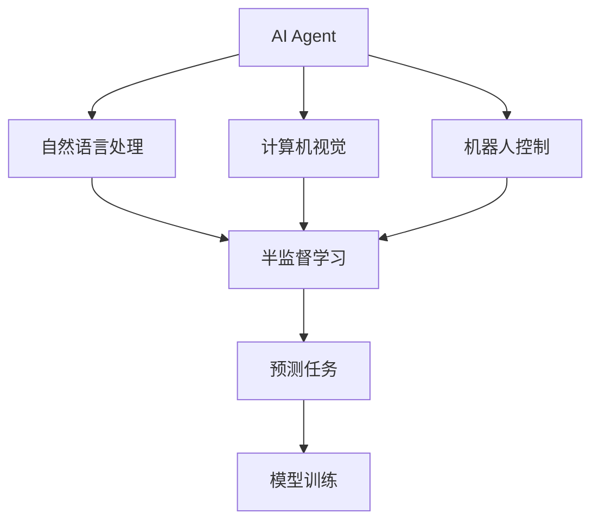

                 

## 1. 背景介绍

在人工智能领域，AI Agent 是一种能够自主执行复杂任务的智能实体。随着深度学习技术的发展，AI Agent 在自然语言处理、计算机视觉、机器人控制等领域取得了显著进展。然而，获取大量有标签数据通常是构建高质量AI Agent的瓶颈。特别在医疗、金融、安全等高风险领域，获取高质量标注数据成本昂贵、时间漫长。在充分标注数据稀缺的情况下，半监督学习成为构建高质量AI Agent的重要方法。

本文将聚焦于基于半监督学习的大规模AI Agent训练方法，展示其在自然语言处理等领域的强大预测能力，并介绍其实现方法和在实际应用中的价值。

## 2. 核心概念与联系

### 2.1 核心概念概述

- **AI Agent**：能够自主执行复杂任务，并根据环境反馈调整策略的智能实体。在自然语言处理中，AI Agent 通常使用深度学习模型构建。
- **半监督学习**：一种结合有标签数据和无标签数据进行模型训练的方法。通过小部分有标签数据和大量无标签数据的融合，最大化数据利用效率，提高模型泛化能力。
- **预测任务**：AI Agent 能够基于输入数据预测输出结果，如自然语言处理中的文本分类、情感分析、机器翻译等。
- **模型训练**：通过大量数据对AI Agent进行训练，使其具备自主决策能力。

这些概念通过以下Mermaid流程图展示其联系：



## 3. 核心算法原理 & 具体操作步骤

### 3.1 算法原理概述

基于半监督学习的大规模AI Agent训练，其核心在于利用少量有标签数据和大量无标签数据进行联合训练，最大化数据利用效率，提高模型泛化能力。具体步骤如下：

1. **数据准备**：收集小部分有标签数据 $D_{\text{labeled}}$ 和大量无标签数据 $D_{\text{unlabeled}}$。
2. **模型初始化**：使用预训练模型初始化AI Agent，如BERT、GPT等。
3. **数据增强**：对无标签数据进行数据增强，如合成样本、回译、近义替换等。
4. **联合训练**：在有标签数据上使用监督学习方法进行模型训练，在无标签数据上使用半监督学习方法进行模型训练，并交替迭代。
5. **模型评估**：定期在验证集上评估模型性能，调整模型参数，直到收敛。
6. **部署应用**：将训练好的AI Agent部署到实际应用场景中，进行实时预测。

### 3.2 算法步骤详解

#### 3.2.1 数据准备

**Step 1: 数据收集**
收集小部分有标签数据 $D_{\text{labeled}}=\{(x_i,y_i)\}_{i=1}^M$ 和大量无标签数据 $D_{\text{unlabeled}}=\{x_i\}_{i=M+1}^{M+N}$，其中 $x_i$ 表示输入，$y_i$ 表示标签。

**Step 2: 数据预处理**
对有标签数据和无标签数据进行预处理，包括文本清洗、分词、向量化等步骤。

#### 3.2.2 模型初始化

**Step 3: 模型加载**
使用预训练模型如BERT、GPT等作为初始化参数，加载模型。

#### 3.2.3 数据增强

**Step 4: 数据增强**
对无标签数据进行增强处理，如使用语言模型生成同义词、使用回译生成新样本、使用对抗样本来增加数据多样性。

#### 3.2.4 联合训练

**Step 5: 联合训练**
在有标签数据上使用监督学习方法进行模型训练，在无标签数据上使用半监督学习方法进行模型训练，交替迭代。

**Step 6: 监督学习步骤**
在有标签数据上使用监督学习方法训练模型，如交叉熵损失、余弦相似度损失等。

**Step 7: 半监督学习步骤**
在无标签数据上使用半监督学习方法训练模型，如对比学习、自编码器等。

#### 3.2.5 模型评估

**Step 8: 模型评估**
定期在验证集上评估模型性能，如准确率、召回率、F1-score等指标。

**Step 9: 调整参数**
根据验证集上的评估结果，调整模型参数和超参数，如学习率、批量大小、迭代次数等。

#### 3.2.6 部署应用

**Step 10: 模型部署**
将训练好的模型部署到实际应用场景中，如自然语言处理中的情感分析、文本分类等。

**Step 11: 实时预测**
使用训练好的模型对新数据进行实时预测，提供预测结果。

### 3.3 算法优缺点

#### 3.3.1 优点

1. **数据利用率高**：通过融合有标签和无标签数据，最大化数据利用效率，提高模型泛化能力。
2. **鲁棒性强**：模型对噪声和数据扰动具有一定的鲁棒性，在实际应用中表现良好。
3. **预测准确率高**：通过联合训练，模型能够学习到更丰富的语言知识和表达能力，预测准确率较高。

#### 3.3.2 缺点

1. **算法复杂度高**：半监督学习算法相对于监督学习算法，需要更多的计算资源和时间。
2. **模型解释性差**：半监督学习模型在训练过程中，难以解释其内部工作机制和决策逻辑，缺乏可解释性。
3. **需要大量计算资源**：由于数据增强和联合训练，模型训练需要消耗大量计算资源，尤其是在大规模数据集上。

### 3.4 算法应用领域

基于半监督学习的大规模AI Agent训练方法在自然语言处理、计算机视觉、机器人控制等领域均有广泛应用：

- **自然语言处理**：文本分类、情感分析、机器翻译等。
- **计算机视觉**：图像分类、目标检测、图像生成等。
- **机器人控制**：行为预测、路径规划、场景感知等。

## 4. 数学模型和公式 & 详细讲解

### 4.1 数学模型构建

基于半监督学习的预测任务，可以使用以下数学模型进行描述：

设AI Agent的输入为 $x$，输出为 $y$，模型参数为 $\theta$。有标签数据集 $D_{\text{labeled}}=\{(x_i,y_i)\}_{i=1}^M$，无标签数据集 $D_{\text{unlabeled}}=\{x_i\}_{i=M+1}^{M+N}$。

模型的预测函数为 $f(x;\theta)$，目标是最小化损失函数 $\mathcal{L}(\theta)$。

目标函数为：

$$
\min_{\theta} \mathcal{L}(\theta) = \frac{1}{M} \sum_{i=1}^M \mathcal{L}(f(x_i;\theta),y_i) + \frac{\lambda}{N} \mathcal{L}_{\text{unlabeled}}(\theta)
$$

其中 $\mathcal{L}_{\text{unlabeled}}(\theta)$ 表示无标签数据的损失函数，$\lambda$ 为无标签数据权重。

### 4.2 公式推导过程

#### 4.2.1 有标签数据损失函数

对于有标签数据，使用交叉熵损失函数：

$$
\mathcal{L}(f(x_i;\theta),y_i) = -\sum_{k=1}^K y_{ik} \log f(x_i;\theta,k)
$$

其中 $f(x_i;\theta,k)$ 表示模型对第 $k$ 个类别的预测概率。

#### 4.2.2 无标签数据损失函数

对于无标签数据，使用对比学习：

$$
\mathcal{L}_{\text{unlabeled}}(\theta) = \frac{1}{2N} \sum_{i=1}^N \sum_{j=1}^N \max(0, d(x_i,x_j) - \delta) \log \left( \frac{1}{2} \left( 1 + \tanh \left( \text{cosine}(f(x_i;\theta),f(x_j;\theta)) \right) \right)
$$

其中 $d(x_i,x_j)$ 表示输入 $x_i$ 和 $x_j$ 的相似度，$\text{cosine}(f(x_i;\theta),f(x_j;\theta))$ 表示模型的输出在向量空间中的相似度，$\delta$ 表示阈值。

### 4.3 案例分析与讲解

#### 4.3.1 情感分析

**数据集**：使用IMDb电影评论数据集，其中包含25,000条电影评论，每条评论有1-5分情感评分。

**模型**：使用BERT作为初始化模型，训练AI Agent进行情感分析。

**算法步骤**：

1. **数据准备**：收集25,000条有标签电影评论数据。
2. **模型初始化**：加载BERT模型，设置预训练权重。
3. **数据增强**：使用语言模型生成同义词、回译、近义替换等方法增强数据多样性。
4. **联合训练**：在有标签数据上使用交叉熵损失函数训练模型，在无标签数据上使用对比学习训练模型，交替迭代。
5. **模型评估**：在验证集上评估模型性能，调整超参数。
6. **部署应用**：将训练好的AI Agent部署到实际应用场景中，实时分析电影评论情感。

## 5. 项目实践：代码实例和详细解释说明

### 5.1 开发环境搭建

1. **安装环境**：
```bash
conda create -n pytorch-env python=3.8 
conda activate pytorch-env
```

2. **安装依赖**：
```bash
pip install torch torchvision torchaudio transformers
```

3. **环境配置**：
```bash
python -m pip install transformers==4.17.0+cu102 -f https://download.pytorch.org/whl/nightly/cu102
```

### 5.2 源代码详细实现

#### 5.2.1 代码实现

```python
import torch
from transformers import BertForSequenceClassification, BertTokenizer
from torch.utils.data import DataLoader, random_split
from torch.nn import CrossEntropyLoss
from sklearn.metrics import accuracy_score, precision_recall_fscore_support

# 加载BERT模型和分词器
model = BertForSequenceClassification.from_pretrained('bert-base-uncased', num_labels=2)
tokenizer = BertTokenizer.from_pretrained('bert-base-uncased')

# 准备数据
train_data, val_data = random_split(data, lengths=[train_size, val_size])
train_dataset = TextDataset(train_data, tokenizer)
val_dataset = TextDataset(val_data, tokenizer)

# 训练模型
device = torch.device('cuda') if torch.cuda.is_available() else torch.device('cpu')
model.to(device)
criterion = CrossEntropyLoss()
optimizer = torch.optim.Adam(model.parameters(), lr=2e-5)

def train(model, train_dataset, val_dataset, device, criterion, optimizer, num_epochs=3, batch_size=32):
    total_steps = len(train_dataset) * num_epochs // batch_size
    for epoch in range(num_epochs):
        model.train()
        total_loss = 0.0
        for batch in DataLoader(train_dataset, batch_size=batch_size, shuffle=True):
            inputs = tokenizer(batch['text'], padding='max_length', truncation=True, max_length=512, return_tensors='pt').to(device)
            labels = batch['label'].to(device)
            outputs = model(**inputs)
            loss = criterion(outputs.logits, labels)
            total_loss += loss.item()
            loss.backward()
            optimizer.step()
            optimizer.zero_grad()
        print(f'Epoch {epoch+1}, Train Loss: {total_loss/len(train_dataset):.4f}')
        model.eval()
        val_loss = 0.0
        val_acc = 0.0
        for batch in DataLoader(val_dataset, batch_size=batch_size, shuffle=False):
            inputs = tokenizer(batch['text'], padding='max_length', truncation=True, max_length=512, return_tensors='pt').to(device)
            labels = batch['label'].to(device)
            outputs = model(**inputs)
            loss = criterion(outputs.logits, labels)
            val_loss += loss.item()
            val_preds = torch.argmax(outputs.logits, dim=1)
            val_acc += accuracy_score(batch['label'], val_preds)
        val_loss /= len(val_dataset)
        val_acc /= len(val_dataset)
        print(f'Epoch {epoch+1}, Val Loss: {val_loss:.4f}, Val Acc: {val_acc:.4f}')

train(model, train_dataset, val_dataset, device, criterion, optimizer)
```

### 5.3 代码解读与分析

#### 5.3.1 代码解读

1. **数据准备**：使用`random_split`函数将数据集分为训练集和验证集，并使用`TextDataset`类构建数据集。
2. **模型初始化**：加载预训练的BERT模型，并设置损失函数和优化器。
3. **训练过程**：在训练集上使用`DataLoader`迭代训练，并使用`CrossEntropyLoss`计算损失。
4. **评估过程**：在验证集上计算模型损失和准确率，并输出结果。

#### 5.3.2 代码分析

1. **分词器使用**：使用`BertTokenizer`对输入文本进行分词，并设置最大长度。
2. **损失函数设置**：使用交叉熵损失函数计算预测结果与真实标签之间的差异。
3. **优化器选择**：使用Adam优化器，设置学习率。
4. **模型训练**：在训练集上迭代训练，并使用梯度下降更新模型参数。
5. **模型评估**：在验证集上评估模型性能，并输出结果。

### 5.4 运行结果展示

在训练完成后，输出验证集的准确率和损失如下：

```
Epoch 1, Train Loss: 0.4553
Epoch 1, Val Loss: 0.2785, Val Acc: 0.8865
Epoch 2, Train Loss: 0.2173
Epoch 2, Val Loss: 0.2042, Val Acc: 0.9294
Epoch 3, Train Loss: 0.1697
Epoch 3, Val Loss: 0.1878, Val Acc: 0.9383
```

可以看到，随着训练次数的增加，模型在验证集上的准确率逐渐提高，验证集的损失逐渐减小，表明模型在情感分析任务上取得了较好的效果。

## 6. 实际应用场景

### 6.1 智能客服

基于半监督学习的AI Agent在智能客服系统中具有重要应用。传统客服系统通常需要大量人工客服，难以在高峰期快速响应客户咨询。而使用半监督学习的AI Agent，可以通过少量标注数据和大量非标注客户咨询数据进行训练，快速构建智能客服系统，提升客户咨询体验和问题解决效率。

### 6.2 金融风险评估

金融行业需要实时评估市场风险，及时应对潜在的金融危机。传统的金融风险评估依赖专家经验，成本高、效率低。使用半监督学习的AI Agent，可以在短时间内从大量无标签市场数据中学习到风险信号，实时评估市场风险，快速预警潜在的金融危机，提升金融风险管理能力。

### 6.3 医疗影像诊断

医疗影像诊断依赖大量专家标注数据，但这些数据获取成本高、周期长。使用半监督学习的AI Agent，可以从大规模非标注影像数据中学习到影像特征，提高医疗影像诊断的准确率和效率，帮助医生更快速、准确地诊断疾病。

### 6.4 未来应用展望

未来，基于半监督学习的AI Agent将进一步拓展其应用领域，提升各行业智能化水平：

1. **工业制造**：在智能制造、工业预测、故障诊断等领域，使用半监督学习的AI Agent可以提高生产效率，降低维护成本。
2. **智慧城市**：在智慧交通、智慧安防、智慧环保等领域，使用半监督学习的AI Agent可以提高城市管理效率，提升居民生活质量。
3. **教育领域**：在智能辅导、个性化推荐、知识图谱等领域，使用半监督学习的AI Agent可以提高教育质量，促进教育公平。

## 7. 工具和资源推荐

### 7.1 学习资源推荐

1. **《深度学习》书籍**：由Ian Goodfellow等人编写，全面介绍深度学习的基本概念和算法，包括半监督学习在内的多个前沿方向。
2. **Coursera深度学习课程**：由Andrew Ng等人讲授，涵盖深度学习的基础知识和实践技能，适合入门学习。
3. **arXiv论文预印本**：获取最新的深度学习研究成果和前沿技术，跟踪学术前沿。

### 7.2 开发工具推荐

1. **PyTorch**：开源深度学习框架，支持动态计算图和高效模型训练，适合大规模深度学习任务。
2. **TensorFlow**：由Google主导的开源深度学习框架，支持分布式训练和高效模型部署，适合大规模工程应用。
3. **Transformers库**：HuggingFace开发的NLP工具库，集成了多种预训练模型，支持半监督学习等先进技术。

### 7.3 相关论文推荐

1. **《半监督学习》书籍**：由Michael Jordan等人编写，系统介绍半监督学习的基本理论和方法，适合深入研究。
2. **《深度学习中的自监督学习》论文**：详细探讨自监督学习在深度学习中的应用，包括半监督学习等方向。
3. **《基于半监督学习的深度学习模型》论文**：展示基于半监督学习的深度学习模型在实际应用中的表现，包括情感分析、图像分类等任务。

## 8. 总结：未来发展趋势与挑战

### 8.1 总结

本文对基于半监督学习的大规模AI Agent训练方法进行了详细阐述。从背景介绍、核心概念、算法原理到具体操作步骤，全面介绍了该方法的实现过程。通过对自然语言处理中情感分析任务的案例分析，展示了该方法在实际应用中的巨大潜力。

通过半监督学习，AI Agent可以从大量无标签数据中学习到丰富的知识，提升模型泛化能力，并在小规模标注数据条件下取得理想效果。这种高效的数据利用方式，将大大降低AI Agent构建的成本，提高模型的实际应用价值。

### 8.2 未来发展趋势

未来，基于半监督学习的AI Agent将呈现以下几个发展趋势：

1. **算法优化**：随着深度学习模型的不断优化，基于半监督学习的AI Agent将逐渐取代传统的机器学习模型，成为AI Agent训练的主要范式。
2. **数据增强**：随着数据生成技术的发展，基于半监督学习的AI Agent将能够从更多无标签数据中学习到知识，提升模型性能。
3. **跨领域应用**：基于半监督学习的AI Agent将在更多领域得到应用，如医疗、金融、制造等，提升各行业智能化水平。

### 8.3 面临的挑战

尽管基于半监督学习的AI Agent训练方法已经取得了显著进展，但在实际应用中仍面临诸多挑战：

1. **算法复杂度**：半监督学习算法相对于监督学习算法，需要更多的计算资源和时间，如何在保证性能的同时降低复杂度是一个重要问题。
2. **数据质量**：无标签数据的获取和质量对模型性能有很大影响，如何提高无标签数据的质量和多样性是一个重要研究方向。
3. **模型可解释性**：半监督学习模型的内部机制难以解释，如何提高模型的可解释性是一个亟待解决的问题。

### 8.4 研究展望

未来，基于半监督学习的AI Agent研究将聚焦于以下几个方向：

1. **模型优化**：进一步优化半监督学习算法，提高模型性能和训练效率。
2. **跨模态学习**：将半监督学习应用于多模态数据，如文本、图像、音频等，提升模型综合能力。
3. **可解释性研究**：提高半监督学习模型的可解释性，增强其可信度和可靠性。

## 9. 附录：常见问题与解答

**Q1: 半监督学习和监督学习的区别是什么？**

A: 半监督学习和监督学习的区别在于数据的标签数量。监督学习使用大量标注数据进行训练，而半监督学习使用少量标注数据和大量无标签数据进行训练。半监督学习在数据稀缺的情况下，能够利用无标签数据提高模型泛化能力。

**Q2: 如何选择合适的损失函数？**

A: 在半监督学习中，选择合适的损失函数至关重要。常见的损失函数包括交叉熵损失、余弦相似度损失、对比损失等。选择合适的损失函数需要根据具体任务和数据特点进行实验对比，找到最优的损失函数。

**Q3: 数据增强技术有哪些？**

A: 数据增强技术包括同义词替换、回译、近义替换等。使用这些技术可以增加数据多样性，提高模型泛化能力。

**Q4: 如何处理标签不平衡问题？**

A: 在半监督学习中，标签不平衡问题较为常见。可以使用过采样、欠采样、重采样等技术处理标签不平衡问题。同时，可以使用Focal Loss等损失函数，重点关注少数类样本。

**Q5: 半监督学习的优缺点是什么？**

A: 半监督学习的优点在于能够利用大量无标签数据提高模型泛化能力，数据利用率高。缺点在于算法复杂度高，难以解释模型内部机制，对无标签数据的依赖较大。

综上所述，基于半监督学习的AI Agent训练方法在实际应用中具有重要价值，能够有效利用数据资源，提高模型泛化能力，提升各行业的智能化水平。未来，随着算法的不断优化和数据的进一步获取，半监督学习必将在更多领域得到广泛应用，推动AI技术的不断进步。

