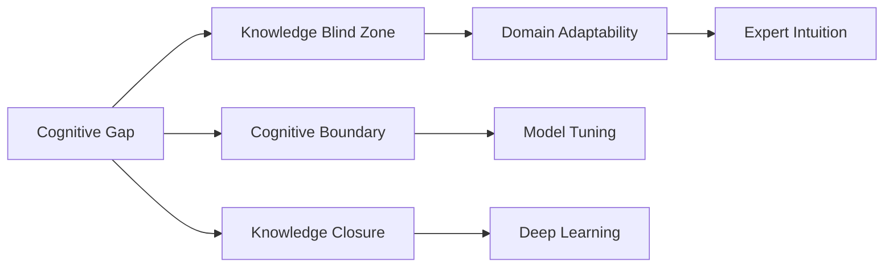
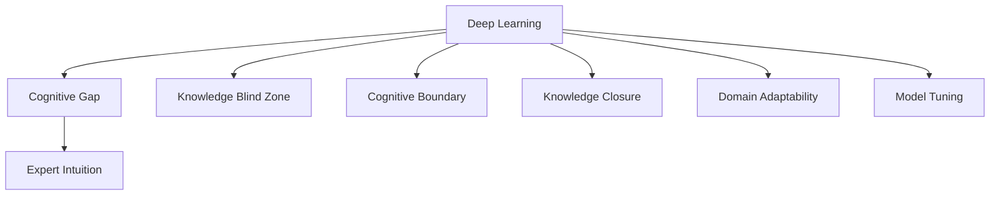
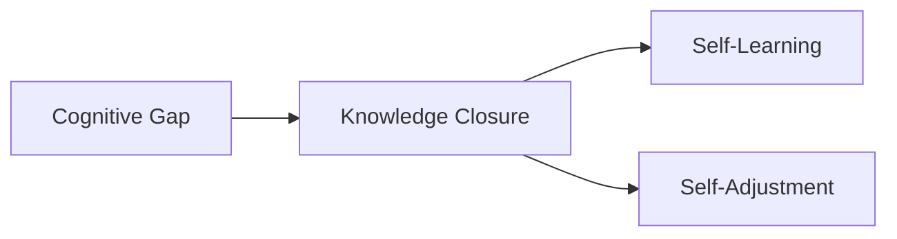
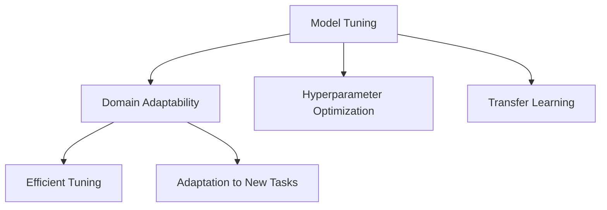
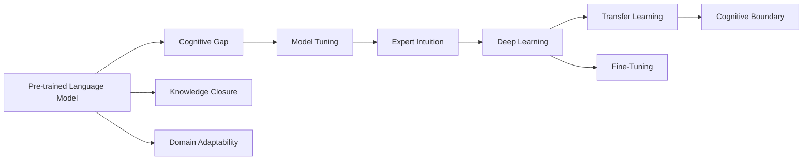

                 

# 认知差：我懂的东西，你不懂

> 关键词：认知差,知识盲区,认知边界,知识闭环,领域适应性,模型调优,深度学习,人工直觉

## 1. 背景介绍

### 1.1 问题由来

在人工智能飞速发展的今天，深度学习技术取得了令人瞩目的成果，尤其是在图像识别、自然语言处理等领域。然而，这些技术的背后，往往隐藏着人类难以触及的“认知差”——即我们虽然能够设计出强大的模型，却往往无法真正理解和解释其内部工作机制和决策逻辑。

这种“认知差”不仅存在于普通用户和开发者之间，也存在于研究者和实际应用场景之间。在技术落地和实际应用中，“认知差”成为了限制深度学习技术发展和普及的重要因素。如何缩小这种认知差，提升模型的可解释性和易用性，成为了当前人工智能研究的热点问题。

### 1.2 问题核心关键点

“认知差”的本质，是人类认知边界和模型内部知识结构之间的差异。在实际应用中，这种差异常常表现为以下几点：

- **知识盲区**：模型在特定领域内缺乏先验知识，无法充分发挥其在复杂场景下的能力。
- **认知边界**：人类对某些复杂问题的理解存在局限，而模型则能够跨越边界，发现隐含的规律和模式。
- **知识闭环**：模型能够自我学习、自我调整，但这种闭环过程在人类理解下仍然存在许多未解之谜。
- **领域适应性**：模型在不同领域内的表现差异显著，如何在不同领域间进行知识迁移和适应，是一大挑战。
- **模型调优**：在实际应用中，模型往往需要进行大量调优才能达到理想效果，但这种调优过程背后的原理和参数调整方法，常常超越了一般开发者的理解范围。
- **深度学习**：深度学习模型复杂度高，训练过程涉及大量的参数和超参数调整，其决策过程往往难以解释。
- **人工直觉**：在许多情况下，模型的决策和输出依赖于特定的领域经验和直觉，而这种直觉的背后，又是一系列复杂的计算和推理过程。

### 1.3 问题研究意义

研究“认知差”问题，对于提升深度学习技术的普及和应用具有重要意义：

- 提升模型可解释性：帮助开发者更好地理解模型的内部机制和决策逻辑，从而提高模型的可信度和可靠性。
- 加速技术落地：通过缩小“认知差”，加速深度学习技术的工程化和产业化进程。
- 降低学习门槛：使更多从业者能够理解和使用深度学习技术，促进技术普及和创新。
- 增强决策支持：通过提升模型的领域适应性和人工直觉，为人类决策提供更可靠的数据支持。

## 2. 核心概念与联系

### 2.1 核心概念概述

为更好地理解“认知差”问题，本节将介绍几个密切相关的核心概念：

- **认知差**：指人类认知边界与模型内部知识结构之间的差异，表现为模型在某些复杂任务上表现出超越人类直觉和理解的能力。
- **知识盲区**：模型在某些特定领域内缺乏先验知识，导致在解决复杂问题时表现不佳。
- **认知边界**：人类对某些复杂问题的理解存在局限，而模型能够跨越边界，发现隐含的规律和模式。
- **知识闭环**：模型能够自我学习、自我调整，但这种闭环过程在人类理解下仍然存在许多未解之谜。
- **领域适应性**：模型在不同领域内的表现差异显著，如何在不同领域间进行知识迁移和适应，是一大挑战。
- **模型调优**：在实际应用中，模型往往需要进行大量调优才能达到理想效果，但这种调优过程背后的原理和参数调整方法，常常超越了一般开发者的理解范围。
- **深度学习**：深度学习模型复杂度高，训练过程涉及大量的参数和超参数调整，其决策过程往往难以解释。
- **人工直觉**：在许多情况下，模型的决策和输出依赖于特定的领域经验和直觉，而这种直觉的背后，又是一系列复杂的计算和推理过程。

这些核心概念之间的逻辑关系可以通过以下Mermaid流程图来展示：



这个流程图展示了“认知差”问题的核心概念及其之间的关系：

1. **认知差**通过“知识盲区”、“认知边界”、“知识闭环”、“领域适应性”、“模型调优”、“深度学习”、“人工直觉”等概念进行进一步细化。
2. **认知差**与这些概念之间存在着紧密的联系，共同构成了深度学习技术的研究和应用框架。

### 2.2 概念间的关系

这些核心概念之间存在着紧密的联系，形成了认知差问题的完整生态系统。下面我们通过几个Mermaid流程图来展示这些概念之间的关系。

#### 2.2.1 深度学习与认知差的关系



这个流程图展示了深度学习模型与认知差问题之间的关系。深度学习模型的高复杂度、高精度和大规模参数量，使其在许多领域表现出色，但同时也带来了认知差问题。

#### 2.2.2 认知差与知识闭环的关系



这个流程图展示了认知差问题与知识闭环的关系。认知差问题来源于模型在知识闭环中的自我学习和自我调整过程，这一过程常常超出人类的理解和控制范围。

#### 2.2.3 模型调优与领域适应性的关系



这个流程图展示了模型调优与领域适应性的关系。在实际应用中，模型调优是提升领域适应性的重要手段，通过优化超参数、应用迁移学习等方法，使模型能够更好地适应不同领域和场景。

### 2.3 核心概念的整体架构

最后，我们用一个综合的流程图来展示这些核心概念在大语言模型微调过程中的整体架构：



这个综合流程图展示了从预训练模型到微调，再到认知差问题的整体架构。大语言模型首先在大规模文本数据上进行预训练，然后通过微调使模型适应特定任务，在微调过程中产生认知差问题，最后通过领域适应性和专家直觉，提升模型的泛化能力和应用效果。

## 3. 核心算法原理 & 具体操作步骤
### 3.1 算法原理概述

“认知差”问题的本质，是人类认知边界与模型内部知识结构之间的差异。在深度学习模型中，这种差异通常表现为以下几个方面：

1. **知识盲区**：模型在特定领域内缺乏先验知识，导致在解决复杂问题时表现不佳。
2. **认知边界**：人类对某些复杂问题的理解存在局限，而模型能够跨越边界，发现隐含的规律和模式。
3. **知识闭环**：模型能够自我学习、自我调整，但这种闭环过程在人类理解下仍然存在许多未解之谜。
4. **领域适应性**：模型在不同领域内的表现差异显著，如何在不同领域间进行知识迁移和适应，是一大挑战。
5. **模型调优**：在实际应用中，模型往往需要进行大量调优才能达到理想效果，但这种调优过程背后的原理和参数调整方法，常常超越了一般开发者的理解范围。
6. **深度学习**：深度学习模型复杂度高，训练过程涉及大量的参数和超参数调整，其决策过程往往难以解释。
7. **人工直觉**：在许多情况下，模型的决策和输出依赖于特定的领域经验和直觉，而这种直觉的背后，又是一系列复杂的计算和推理过程。

针对以上问题，“认知差”问题的解决需要从以下几个方面进行：

1. **缩小知识盲区**：通过增加领域特定的知识，提升模型在特定领域的表现。
2. **跨越认知边界**：通过引入先验知识、设计更好的模型架构等方法，提升模型的泛化能力。
3. **解析知识闭环**：通过模型诊断、可解释性技术等手段，解析模型内部机制，提升可解释性。
4. **增强领域适应性**：通过迁移学习、模型融合等方法，提升模型在不同领域间的表现。
5. **优化模型调优**：通过自动化调参、模型压缩等方法，提升模型调优效率，降低调优门槛。
6. **增强深度学习**：通过引入外部知识、改进模型架构等方法，提升模型的深度学习和推理能力。
7. **提升人工直觉**：通过专家系统的集成、知识的重用等方法，提升模型的领域经验和直觉。

### 3.2 算法步骤详解

针对“认知差”问题，解决步骤如下：

**Step 1: 数据准备和预处理**

- **收集标注数据**：收集目标领域内的大量标注数据，用于训练和微调模型。
- **数据清洗和标注**：对数据进行清洗和标注，去除噪声和错误标注，保证数据质量。
- **数据增强**：通过回译、近义替换等方式扩充训练集，提升模型泛化能力。

**Step 2: 模型选择和设计**

- **选择合适的模型架构**：根据任务需求，选择适合的模型架构，如卷积神经网络(CNN)、循环神经网络(RNN)、Transformer等。
- **引入先验知识**：通过领域专家的经验，引入先验知识，如知识图谱、逻辑规则等。
- **设计任务适配层**：根据任务类型，设计合适的输出层和损失函数，如分类任务、回归任务等。

**Step 3: 模型训练和微调**

- **选择合适的优化器**：如AdamW、SGD等，设置学习率、批大小、迭代轮数等。
- **应用正则化技术**：如L2正则、Dropout、Early Stopping等，防止模型过度适应小规模训练集。
- **保留预训练的部分层**：如Transformer的底层，只微调顶层，减少需优化的参数。
- **数据增强**：通过对训练样本改写、回译等方式丰富训练集多样性。
- **对抗训练**：加入对抗样本，提高模型鲁棒性。
- **Prompt Learning**：通过在输入文本中添加提示模板(Prompt Template)，引导模型按期望方式输出，减少微调参数。

**Step 4: 模型评估和优化**

- **在验证集上评估模型性能**：周期性在验证集上评估模型性能，根据性能指标决定是否触发Early Stopping。
- **优化模型参数**：根据评估结果，优化模型参数，提升模型性能。
- **应用迁移学习**：通过在大规模通用数据上预训练模型，在特定领域上微调，提升模型的泛化能力。
- **融合外部知识**：通过知识图谱、逻辑规则等外部知识，提升模型的领域适应性。

**Step 5: 部署和应用**

- **集成到实际应用系统中**：将微调后的模型集成到实际应用系统中，进行实时推理预测。
- **持续收集数据和反馈**：持续收集新的数据和用户反馈，定期重新微调模型，以适应数据分布的变化。

以上是解决“认知差”问题的一般流程。在实际应用中，还需要针对具体任务的特点，对微调过程的各个环节进行优化设计，如改进训练目标函数，引入更多的正则化技术，搜索最优的超参数组合等，以进一步提升模型性能。

### 3.3 算法优缺点

**优点**：
- **提升模型泛化能力**：通过引入先验知识和迁移学习，使模型能够更好地适应特定领域，提升泛化能力。
- **降低标注成本**：在已有通用语料的基础上进行微调，显著降低标注数据的获取和准备成本。
- **提高模型效果**：通过优化模型参数和应用正则化技术，提升模型在特定任务上的性能。

**缺点**：
- **依赖标注数据**：微调的效果很大程度上取决于标注数据的质量和数量，获取高质量标注数据的成本较高。
- **迁移能力有限**：当目标任务与预训练数据的分布差异较大时，微调的性能提升有限。
- **负面效果传递**：预训练模型的固有偏见、有害信息等，可能通过微调传递到下游任务，造成负面影响。
- **可解释性不足**：微调模型的决策过程通常缺乏可解释性，难以对其推理逻辑进行分析和调试。

尽管存在这些局限性，但就目前而言，“认知差”问题的解决，仍需依靠传统的监督学习和微调方法，以最大化利用深度学习模型的能力。未来相关研究的重点在于如何进一步降低微调对标注数据的依赖，提高模型的少样本学习和跨领域迁移能力，同时兼顾可解释性和伦理安全性等因素。

### 3.4 算法应用领域

解决“认知差”问题的算法，在NLP领域已经得到了广泛的应用，覆盖了几乎所有常见任务，例如：

- **文本分类**：如情感分析、主题分类、意图识别等。通过微调使模型学习文本-标签映射。
- **命名实体识别**：识别文本中的人名、地名、机构名等特定实体。通过微调使模型掌握实体边界和类型。
- **关系抽取**：从文本中抽取实体之间的语义关系。通过微调使模型学习实体-关系三元组。
- **问答系统**：对自然语言问题给出答案。将问题-答案对作为微调数据，训练模型学习匹配答案。
- **机器翻译**：将源语言文本翻译成目标语言。通过微调使模型学习语言-语言映射。
- **文本摘要**：将长文本压缩成简短摘要。将文章-摘要对作为微调数据，使模型学习抓取要点。
- **对话系统**：使机器能够与人自然对话。将多轮对话历史作为上下文，微调模型进行回复生成。

除了上述这些经典任务外，“认知差”问题解决的方法也被创新性地应用到更多场景中，如可控文本生成、常识推理、代码生成、数据增强等，为NLP技术带来了全新的突破。随着预训练模型和微调方法的不断进步，相信NLP技术将在更广阔的应用领域大放异彩。

## 4. 数学模型和公式 & 详细讲解  
### 4.1 数学模型构建

解决“认知差”问题，需要对模型的内部机制和决策逻辑进行深入理解。这里我们使用数学语言对模型的训练过程进行更加严格的刻画。

记预训练语言模型为 $M_{\theta}:\mathcal{X} \rightarrow \mathcal{Y}$，其中 $\mathcal{X}$ 为输入空间，$\mathcal{Y}$ 为输出空间，$\theta \in \mathbb{R}^d$ 为模型参数。假设微调任务的训练集为 $D=\{(x_i,y_i)\}_{i=1}^N, x_i \in \mathcal{X}, y_i \in \mathcal{Y}$。

定义模型 $M_{\theta}$ 在数据样本 $(x,y)$ 上的损失函数为 $\ell(M_{\theta}(x),y)$，则在数据集 $D$ 上的经验风险为：

$$
\mathcal{L}(\theta) = \frac{1}{N} \sum_{i=1}^N \ell(M_{\theta}(x_i),y_i)
$$

微调的优化目标是最小化经验风险，即找到最优参数：

$$
\theta^* = \mathop{\arg\min}_{\theta} \mathcal{L}(\theta)
$$

在实践中，我们通常使用基于梯度的优化算法（如SGD、Adam等）来近似求解上述最优化问题。设 $\eta$ 为学习率，$\lambda$ 为正则化系数，则参数的更新公式为：

$$
\theta \leftarrow \theta - \eta \nabla_{\theta}\mathcal{L}(\theta) - \eta\lambda\theta
$$

其中 $\nabla_{\theta}\mathcal{L}(\theta)$ 为损失函数对参数 $\theta$ 的梯度，可通过反向传播算法高效计算。

### 4.2 公式推导过程

以下我们以二分类任务为例，推导交叉熵损失函数及其梯度的计算公式。

假设模型 $M_{\theta}$ 在输入 $x$ 上的输出为 $\hat{y}=M_{\theta}(x) \in [0,1]$，表示样本属于正类的概率。真实标签 $y \in \{0,1\}$。则二分类交叉熵损失函数定义为：

$$
\ell(M_{\theta}(x),y) = -[y\log \hat{y} + (1-y)\log (1-\hat{y})]
$$

将其代入经验风险公式，得：

$$
\mathcal{L}(\theta) = -\frac{1}{N}\sum_{i=1}^N [y_i\log M_{\theta}(x_i)+(1-y_i)\log(1-M_{\theta}(x_i))]
$$

根据链式法则，损失函数对参数 $\theta_k$ 的梯度为：

$$
\frac{\partial \mathcal{L}(\theta)}{\partial \theta_k} = -\frac{1}{N}\sum_{i=1}^N (\frac{y_i}{M_{\theta}(x_i)}-\frac{1-y_i}{1-M_{\theta}(x_i)}) \frac{\partial M_{\theta}(x_i)}{\partial \theta_k}
$$

其中 $\frac{\partial M_{\theta}(x_i)}{\partial \theta_k}$ 可进一步递归展开，利用自动微分技术完成计算。

在得到损失函数的梯度后，即可带入参数更新公式，完成模型的迭代优化。重复上述过程直至收敛，最终得到适应下游任务的最优模型参数 $\theta^*$。

## 5. 项目实践：代码实例和详细解释说明
### 5.1 开发环境搭建

在进行微调实践前，我们需要准备好开发环境。以下是使用Python进行PyTorch开发的环境配置流程：

1. 安装Anaconda：从官网下载并安装Anaconda，用于创建独立的Python环境。

2. 创建并激活虚拟环境：
```bash
conda create -n pytorch-env python=3.8 
conda activate pytorch-env
```

3. 安装PyTorch：根据CUDA版本，从官网获取对应的安装命令。例如：
```bash
conda install pytorch torchvision torchaudio cudatoolkit=11.1 -c pytorch -c conda-forge
```

4. 安装Transformers库：
```bash
pip install transformers
```

5. 安装各类工具包：
```bash
pip install numpy pandas scikit-learn matplotlib tqdm jupyter notebook ipython
```

完成上述步骤后，即可在`pytorch-env`环境中开始微调实践。

### 5.2 源代码详细实现

这里我们以命名实体识别(NER)任务为例，给出使用Transformers库对BERT模型进行微调的PyTorch代码实现。

首先，定义NER任务的数据处理函数：

```python
from transformers import BertTokenizer
from torch.utils.data import Dataset
import torch

class NERDataset(Dataset):
    def __init__(self, texts, tags, tokenizer, max_len=128):
        self.texts = texts
        self.tags = tags
        self.tokenizer = tokenizer
        self.max_len = max_len
        
    def __len__(self):
        return len(self.texts)
    
    def __getitem__(self, item):
        text = self.texts[item]
        tags = self.tags[item]
        
        encoding = self.tokenizer(text, return_tensors='pt', max_length=self.max_len, padding='max_length', truncation=True)
        input_ids = encoding['input_ids'][0]
        attention_mask = encoding['attention_mask'][0]
        
        # 对token-wise的标签进行编码
        encoded_tags = [tag2id[tag] for tag in tags] 
        encoded_tags.extend([tag2id['O']] * (self.max_len - len(encoded_tags)))
        labels = torch.tensor(encoded_tags, dtype=torch.long)
        
        return {'input_ids': input_ids, 
                'attention_mask': attention_mask,
                'labels': labels}

# 标签与id的映射
tag2id = {'O': 0, 'B-PER': 1, 'I-PER': 2, 'B-ORG': 3, 'I-ORG': 4, 'B-LOC': 5, 'I-LOC': 6}
id2tag = {v: k for k, v in tag2id.items()}

# 创建dataset
tokenizer = BertTokenizer.from_pretrained('bert-base-cased')

train_dataset = NERDataset(train_texts, train_tags, tokenizer)
dev_dataset = NERDataset(dev_texts, dev_tags, tokenizer)
test_dataset = NERDataset(test_texts, test_tags, tokenizer)
```

然后，定义模型和优化器：

```python
from transformers import BertForTokenClassification, AdamW

model = BertForTokenClassification.from_pretrained('bert-base-cased', num_labels=len(tag2id))

optimizer = AdamW(model.parameters(), lr=2e-5)
```

接着，定义训练和评估函数：

```python
from torch.utils.data import DataLoader
from tqdm import tqdm
from sklearn.metrics import classification_report

device = torch.device('cuda') if torch.cuda.is_available() else torch.device('cpu')
model.to(device)

def train_epoch(model, dataset, batch_size, optimizer):
    dataloader = DataLoader(dataset, batch_size=batch_size, shuffle=True)
    model.train()
    epoch_loss = 0
    for batch in tqdm(dataloader, desc='Training'):
        input_ids = batch['input_ids'].to(device)
        attention_mask = batch['attention_mask'].to(device)
        labels = batch['labels'].to(device)
        model.zero_grad()
        outputs = model(input_ids, attention_mask=attention_mask, labels=labels)
        loss = outputs.loss
        epoch_loss += loss.item()
        loss.backward()
        optimizer.step()
    return epoch_loss / len(dataloader)

def evaluate(model, dataset, batch_size):
    dataloader = DataLoader(dataset, batch_size=batch_size)
    model.eval()
    preds, labels = [], []
    with torch.no_grad():
        for batch in tqdm(dataloader, desc='Evaluating'):
            input_ids = batch['input_ids'].to(device)
            attention_mask = batch['attention_mask'].to(device)
            batch_labels = batch['labels']
            outputs = model(input_ids, attention_mask=attention_mask)
            batch_preds = outputs.logits.argmax(dim=2).to('cpu').tolist()
            batch_labels = batch_labels.to('cpu').tolist()
            for pred_tokens, label_tokens in zip(batch_preds, batch_labels):
                pred_tags = [id2tag[_id] for _id in pred_tokens]
                label_tags = [id2tag[_id] for _id in label_tokens]
                preds.append(pred_tags[:len(label_tokens)])
                labels.append(label_tags)
                
    print(classification_report(labels, preds))
```

最后，启动训练流程并在测试集上评估：

```python
epochs = 5
batch_size = 16

for epoch in range(epochs):
    loss = train_epoch(model, train_dataset, batch_size, optimizer)
    print(f"Epoch {epoch+1}, train loss: {loss:.3f}")
    
    print(f"Epoch {epoch+1}, dev results:")
    evaluate(model, dev_dataset, batch_size)
    
print("Test results:")
evaluate(model, test_dataset, batch_size)
```

以上就是使用PyTorch对BERT进行命名实体识别任务微调的完整代码实现。可以看到，得益于Transformers库的强大封装，我们可以用相对简洁的代码完成BERT模型的加载和微调。

### 5.3 代码解读与分析

让我们再详细解读一下关键代码的实现细节：

**NERDataset类**：
- `__init__`方法：初始化文本、标签、分词器等关键组件。
- `__len__`方法：返回数据集的样本数量。
- `__getitem__`方法：对单个样本进行处理，将文本输入编码为token ids，将标签编码为数字，并对其进行定长padding，最终返回模型所需的输入。

**tag2id和id2tag字典**：
- 定义了标签与数字id之间的映射关系，用于将token-wise的预测结果解码回真实的标签。

**训练和评估函数**：
- 使用PyTorch的DataLoader对数据集进行批次化加载，供模型训练和推理使用。
- 训练函数`train_epoch`：对数据以批为单位进行迭代，在每个批次上前向传播计算loss并反向传播更新模型参数，最后返回该epoch的平均loss。
- 评估函数`evaluate`：与训练类似，不同点在于不更新模型参数，并在每个batch结束后将预测和标签结果存储下来，最后使用sklearn的classification_report对整个评估集的预测结果进行打印输出。

**训练流程**：
- 定义总的epoch数和batch size，开始循环迭代
-

