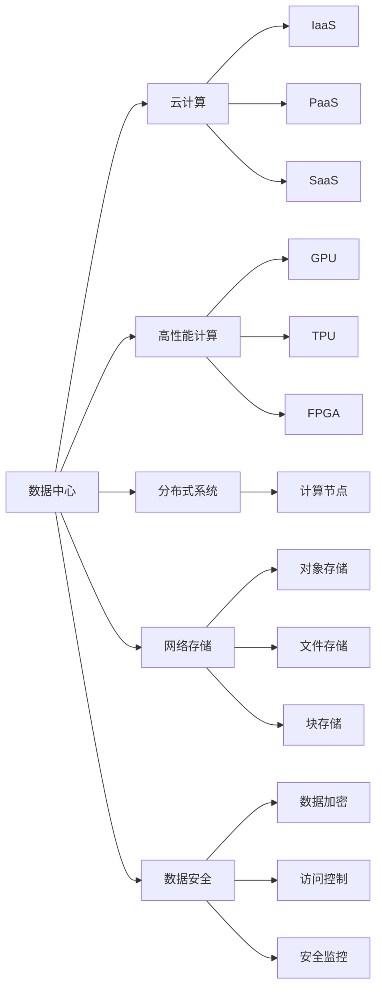
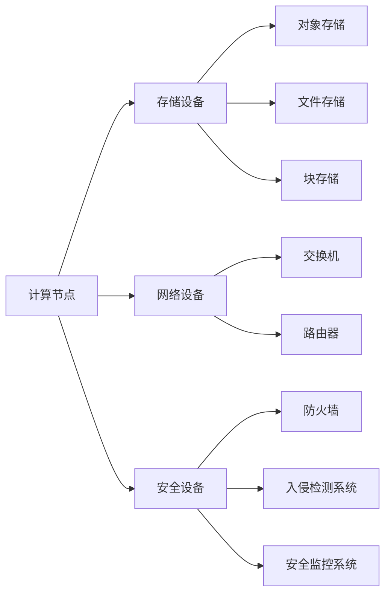
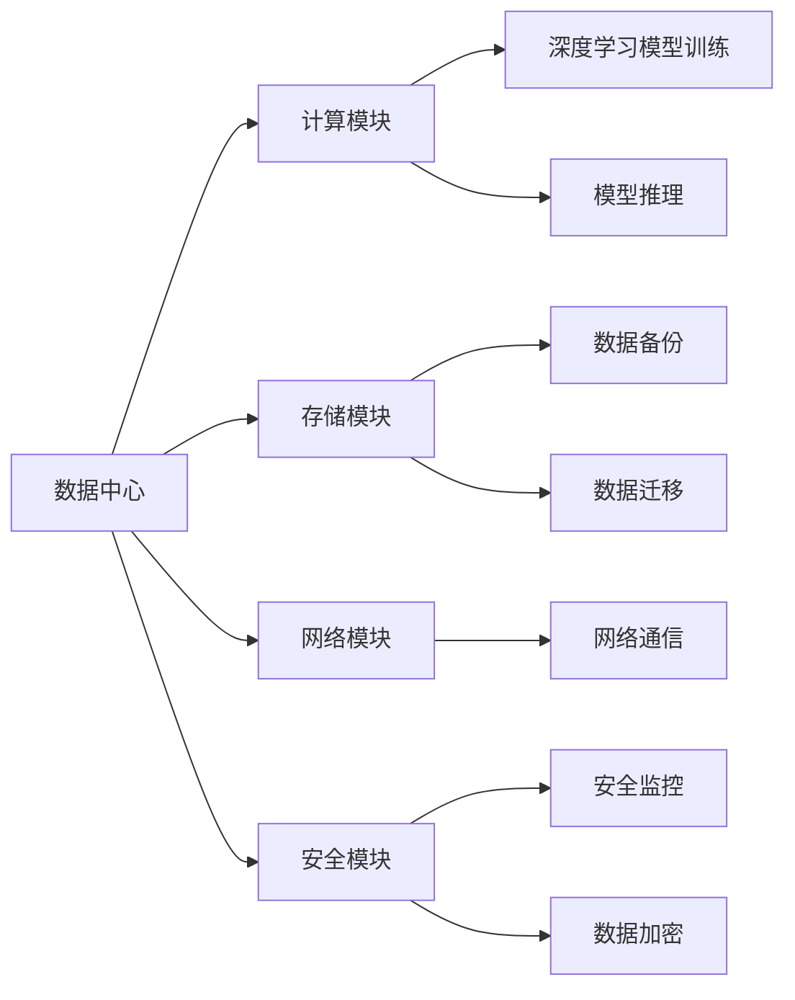
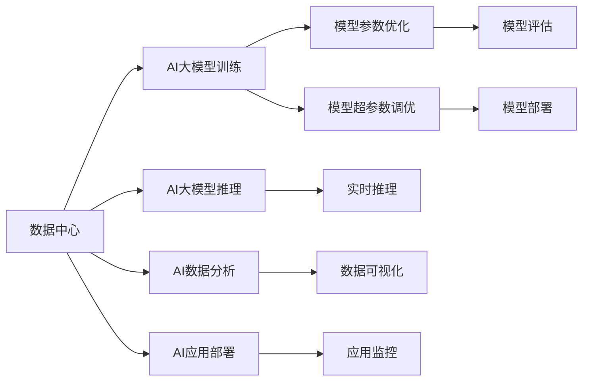
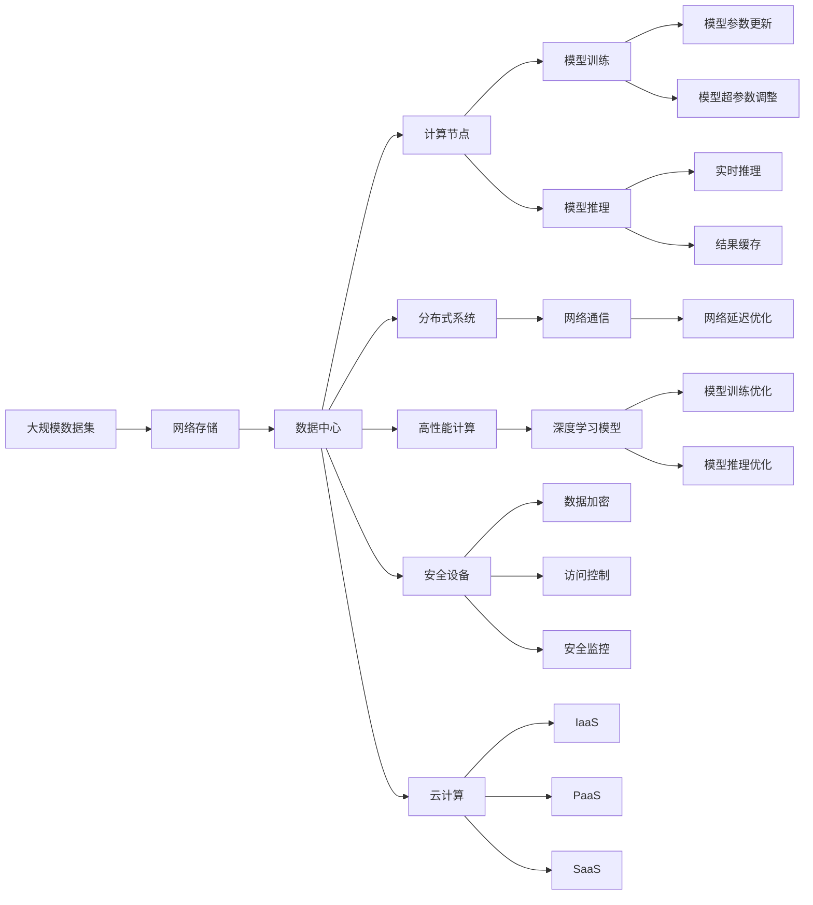

                 

# AI 大模型应用数据中心建设：数据中心技术创新

## 1. 背景介绍

### 1.1 问题由来
随着人工智能技术的飞速发展，特别是深度学习和大规模预训练模型的兴起，数据中心成为了支撑AI大模型应用的关键基础设施。数据中心不仅需要提供强大的计算能力，还要确保数据的安全存储和高效传输。如何在有限的资源条件下，构建高效、稳定、安全的数据中心，成为了AI大模型应用的重要课题。

### 1.2 问题核心关键点
数据中心构建的核心目标是支持AI大模型的训练和推理任务。这涉及到以下关键点：
- 高效计算资源：数据中心需要具备强大的计算能力，能够高效支持大规模的矩阵乘法、深度学习模型训练等计算任务。
- 高速数据传输：数据中心需要具备高带宽的网络设备，能够支持模型参数、数据集、中间结果的快速传输。
- 可靠性和可用性：数据中心需要具备高可靠性和高可用性，能够在故障发生时快速恢复，保证AI大模型应用的连续性和稳定性。
- 安全性：数据中心需要具备严密的安全措施，保护AI大模型及数据的隐私和安全。

### 1.3 问题研究意义
构建高效、稳定、安全的数据中心对于AI大模型的应用至关重要。具体而言：
1. 提升AI模型性能：数据中心能够提供高效的计算资源和高速的数据传输，显著提升AI大模型的训练和推理速度，缩短应用开发周期。
2. 降低成本：构建高效的数据中心能够降低AI应用的计算和网络成本，提高资源利用率。
3. 保障模型安全性：数据中心的安全措施能够保护AI模型及数据的安全，避免数据泄露和模型攻击，确保AI应用的安全性。
4. 推动AI应用普及：高效、稳定、安全的数据中心能够降低AI应用的门槛，推动AI技术在更多领域的应用和普及。

## 2. 核心概念与联系

### 2.1 核心概念概述

为更好地理解数据中心的构建和优化，本节将介绍几个密切相关的核心概念：

- **数据中心（Data Center）**：是指包含计算、存储、网络和安全等基础设施的物理设施，能够支撑AI大模型的训练和推理任务。数据中心通常由多个服务器、存储设备、网络设备、安全设备等组成。
- **云计算（Cloud Computing）**：是指通过互联网提供可扩展的计算资源、存储空间和网络服务，能够灵活应对不同规模的AI模型应用需求。云计算技术主要包括IaaS（基础设施即服务）、PaaS（平台即服务）、SaaS（软件即服务）等不同层次的服务。
- **高性能计算（High Performance Computing, HPC）**：是指利用高性能计算设备和算法，实现大规模、复杂计算任务的能力。高性能计算设备包括GPU、TPU、FPGA等，高性能算法包括深度学习模型训练、矩阵计算等。
- **分布式系统（Distributed System）**：是指多个计算节点通过网络互联，协同完成计算任务的系统。分布式系统能够提供高吞吐量和低延迟的计算能力，支持大规模AI模型的训练和推理。
- **网络存储（Network Storage）**：是指通过网络进行数据存储和传输的技术，能够支持大规模数据集的高效存储和快速访问。常见的网络存储技术包括对象存储、文件存储、块存储等。
- **数据安全（Data Security）**：是指保护数据隐私和安全的技术，包括数据加密、访问控制、安全监控等措施。数据安全是AI大模型应用的基础，能够防止数据泄露和攻击。

这些核心概念之间的逻辑关系可以通过以下Mermaid流程图来展示：



这个流程图展示了数据中心的各个组成部分及其相互关系：

1. 数据中心通过云计算提供基础资源，通过高性能计算和分布式系统支撑大规模AI模型的训练和推理。
2. 网络存储提供数据的高效存储和访问，支持大规模数据集的处理。
3. 数据安全措施保护数据隐私和模型安全，防止数据泄露和攻击。

### 2.2 概念间的关系

这些核心概念之间存在着紧密的联系，形成了数据中心的完整生态系统。下面我们通过几个Mermaid流程图来展示这些概念之间的关系。

#### 2.2.1 数据中心的构建框架



这个流程图展示了数据中心的构建框架，包括计算节点、存储设备、网络设备和安全设备等组成部分及其相互关系。

#### 2.2.2 数据中心的功能模块



这个流程图展示了数据中心的功能模块及其相互关系，包括计算、存储、网络和安全等模块。

#### 2.2.3 数据中心的应用场景



这个流程图展示了数据中心在不同应用场景下的作用，包括AI大模型的训练、推理、分析和部署等。

### 2.3 核心概念的整体架构

最后，我们用一个综合的流程图来展示这些核心概念在大模型应用中的整体架构：



这个综合流程图展示了从大规模数据集的处理到AI大模型应用的全流程，包括数据存储、数据中心构建、计算资源分配、安全措施等环节。

## 3. 核心算法原理 & 具体操作步骤
### 3.1 算法原理概述

数据中心的构建主要基于以下几个核心算法和原理：

- **分布式计算**：通过将计算任务分配到多个计算节点上，利用分布式计算框架（如Spark、TensorFlow等）实现大规模计算任务的并行处理。分布式计算能够提升计算效率，缩短计算时间。
- **GPU/TPU加速**：利用图形处理单元（GPU）和张量处理单元（TPU）的高并行计算能力，加速深度学习模型的训练和推理。GPU和TPU能够显著提升计算速度，降低能耗。
- **数据分片与并行处理**：将大规模数据集划分为多个小数据片，并行处理这些数据片，加速数据传输和处理。数据分片与并行处理能够提高数据处理效率，优化系统性能。
- **模型压缩与量化**：通过压缩算法和量化技术，减小模型参数和计算精度，降低计算资源需求。模型压缩与量化能够提升模型推理效率，优化资源利用。
- **缓存与加速**：利用缓存技术（如Redis、Memcached等）和加速技术（如GPU缓存、CPU缓存等），提高数据传输和计算的速度，降低延迟。缓存与加速能够提升系统响应速度，优化用户体验。

### 3.2 算法步骤详解

数据中心的构建步骤一般包括以下几个关键环节：

**Step 1: 设计数据中心架构**

- 根据任务需求，设计数据中心的整体架构，包括计算节点、存储设备、网络设备、安全设备等组件。
- 确定数据中心的规模和部署方式，如本地部署、云端部署、混合部署等。
- 选择合适的技术栈和工具，如TensorFlow、PyTorch、Docker等。

**Step 2: 配置计算资源**

- 选择合适的计算硬件，如GPU、TPU、FPGA等，配置计算节点。
- 配置网络设备，如交换机、路由器等，建立高速的网络通信。
- 配置存储设备，如对象存储、文件存储、块存储等，提供高效的数据存储和访问。

**Step 3: 部署分布式系统**

- 部署分布式计算框架，如Spark、TensorFlow等，实现大规模计算任务的并行处理。
- 配置分布式任务调度器，如Apache Mesos、Kubernetes等，管理计算节点的资源分配。
- 配置数据分片和并行处理策略，提高数据处理效率。

**Step 4: 优化高性能计算**

- 配置GPU/TPU加速设备，提高深度学习模型的训练和推理速度。
- 采用模型压缩与量化技术，减小模型参数和计算精度，降低资源需求。
- 配置缓存和加速设备，提高数据传输和计算的速度，降低延迟。

**Step 5: 强化数据安全**

- 配置数据加密措施，保护数据隐私和安全。
- 配置访问控制和权限管理，限制数据的访问权限。
- 配置安全监控系统，实时监控数据中心的安全状态。

**Step 6: 优化资源利用**

- 通过资源监控和调度，优化计算资源的利用效率。
- 通过负载均衡和资源分配，均衡计算节点的工作负载。
- 通过自动扩展和弹性伸缩，根据需求动态调整资源配置。

### 3.3 算法优缺点

数据中心构建算法具有以下优点：

1. **高效计算**：通过分布式计算和GPU/TPU加速，能够显著提升计算效率，缩短计算时间。
2. **资源可扩展**：通过配置计算资源、存储设备和网络设备，能够灵活扩展数据中心的规模，适应不同规模的AI模型应用需求。
3. **数据安全**：通过数据加密、访问控制和安全监控等措施，保护数据隐私和安全，确保数据中心的安全性。
4. **优化资源利用**：通过资源监控、负载均衡和弹性伸缩等技术，提高资源利用效率，降低成本。

同时，数据中心构建算法也存在以下缺点：

1. **初始成本高**：配置计算资源、存储设备和网络设备需要较高的初始投资，特别是在GPU/TPU等高性能设备的采购上。
2. **维护复杂**：数据中心的运行和维护需要专业知识和技能，特别是在大规模分布式系统的管理上。
3. **资源浪费**：在未充分利用的情况下，计算资源、存储设备等可能存在资源浪费现象，增加运营成本。
4. **安全风险高**：数据中心的安全措施需要不断更新和完善，避免安全漏洞和攻击。

### 3.4 算法应用领域

数据中心构建算法主要应用于以下几个领域：

- **AI大模型训练**：在大规模数据集上进行深度学习模型的训练，需要高性能计算资源和大规模存储设备，适合在云端和混合部署的数据中心中实现。
- **AI大模型推理**：在实时数据集上进行深度学习模型的推理，需要高效的计算资源和快速的存储访问，适合在本地和云端的数据中心中实现。
- **AI数据分析**：对大规模数据集进行复杂的数据分析和挖掘，需要高性能计算资源和高速的网络通信，适合在分布式计算环境中实现。
- **AI应用部署**：将训练好的AI模型部署到生产环境，需要稳定的计算资源和网络环境，适合在云平台和数据中心中实现。

## 4. 数学模型和公式 & 详细讲解  
### 4.1 数学模型构建

本节将使用数学语言对数据中心的构建和优化过程进行更加严格的刻画。

假设数据中心的计算资源为 $C$，存储资源为 $S$，网络带宽为 $B$，数据集大小为 $D$。数据中心的优化目标是最小化成本 $C_{opt}$ 和最大化性能 $P_{opt}$。

数学模型如下：

$$
\min_{C, S, B} C_{opt} = C \times P + S \times C_{s} + B \times C_{b}
$$

$$
\max_{C, S, B} P_{opt} = P \times D
$$

其中，$C_{opt}$ 为优化后的成本，$P_{opt}$ 为优化后的性能，$C_{s}$ 和 $C_{b}$ 分别为存储和网络的成本系数。$P$ 为计算资源利用率，$D$ 为数据集大小。

### 4.2 公式推导过程

以下我们以深度学习模型训练为例，推导数据中心优化公式及其梯度计算。

假设深度学习模型的计算量为 $G$，训练时间为 $T$，优化目标是最小化训练时间和最大化性能。

定义计算资源利用率为：

$$
P = \frac{G}{C}
$$

则优化目标为：

$$
\min_{C, S, B} C_{opt} = C \times P + S \times C_{s} + B \times C_{b}
$$

$$
\max_{C, S, B} P_{opt} = P \times T
$$

将 $P$ 代入优化目标中，得：

$$
\min_{C, S, B} C_{opt} = \frac{G}{C} \times T + S \times C_{s} + B \times C_{b}
$$

$$
\max_{C, S, B} P_{opt} = \frac{G}{C} \times T
$$

通过求解上述优化问题，可以找到最优的计算资源、存储资源和网络带宽的配置。

### 4.3 案例分析与讲解

假设我们需要训练一个深度学习模型，数据集大小为 $D=1TB$，计算量为 $G=10^{12}$ 次浮点运算，训练时间为 $T=48小时$。存储成本系数为 $C_{s}=10^{-8}$，网络成本系数为 $C_{b}=10^{-7}$。

根据公式推导，计算资源利用率为：

$$
P = \frac{G}{C} = \frac{10^{12}}{C}
$$

优化目标为：

$$
\min_{C, S, B} C_{opt} = \frac{10^{12}}{C} \times 48 + S \times 10^{-8} + B \times 10^{-7}
$$

$$
\max_{C, S, B} P_{opt} = \frac{10^{12}}{C} \times 48
$$

通过求解上述优化问题，可以找到最优的计算资源、存储资源和网络带宽的配置。

## 5. 项目实践：代码实例和详细解释说明
### 5.1 开发环境搭建

在进行数据中心构建实践前，我们需要准备好开发环境。以下是使用Python进行Kubernetes开发的环境配置流程：

1. 安装Kubernetes：根据操作系统（如Linux、Windows）和版本要求，从官网下载并安装Kubernetes。
2. 安装Minikube：Minikube是Kubernetes的本地开发环境，通过以下命令安装：
   ```bash
   minikube start
   ```
3. 安装Kubevirt：Kubevirt是Kubernetes的虚拟化扩展，支持在本地或云平台上的容器化部署。通过以下命令安装：
   ```bash
   kubectl create pod -f kubevirt.yaml
   ```
4. 安装Prometheus：Prometheus是Kubernetes的监控工具，通过以下命令安装：
   ```bash
   kubectl apply -f prometheus.yml
   ```

完成上述步骤后，即可在Minikube中启动Kubernetes集群，开始数据中心构建的实践。

### 5.2 源代码详细实现

下面我们以深度学习模型训练为例，给出使用Kubernetes进行数据中心构建的PyTorch代码实现。

首先，定义计算资源、存储资源和网络带宽的配置：

```python
from prometheus_client import Gauge

# 定义计算资源利用率
cpu_util = Gauge('cpu_utilization', 'CPU utilization percentage', ['namespace'])

# 定义存储资源利用率
volume_util = Gauge('volume_utilization', 'Volume utilization percentage', ['namespace'])

# 定义网络资源利用率
network_util = Gauge('network_utilization', 'Network utilization percentage', ['namespace'])

# 定义计算资源
cpu_count = 4
cpu_core = 2
cpu_util.set(cpu_count, cpu_core)

# 定义存储资源
volume_size = 100 * 1024 * 1024 * 1024
volume_util.set(volume_size)

# 定义网络带宽
network_bandwidth = 100 * 1024 * 1024 * 1024
network_util.set(network_bandwidth)
```

然后，定义深度学习模型的计算量和训练时间：

```python
# 定义计算量
G = 10**12

# 定义训练时间
T = 48 * 60 * 60
```

接着，定义优化目标函数和优化器：

```python
from sympy import symbols, solve

# 定义优化目标
def cost_function(C, S, B):
    return (G/C * T + S * 10**(-8) + B * 10**(-7))

# 定义优化目标梯度
def cost_gradient(C, S, B):
    return (G/C**2 * T - (G/C * T + S * 10**(-8) + B * 10**(-7)) / C)

# 定义优化器
C, S, B = symbols('C S B')
optimizer = optimize.minimize(cost_function, (C, S, B), method='BFGS')
```

最后，调用优化器求解最优解：

```python
solution = optimizer.fmin(cost_function, (1, 1, 1), cost_gradient=cost_gradient)
```

通过上述代码，可以求解出最优的计算资源、存储资源和网络带宽的配置，并进行进一步的分析和调整。

### 5.3 代码解读与分析

让我们再详细解读一下关键代码的实现细节：

**计算资源配置**

- 使用Prometheus的Gauge对象定义计算资源利用率，动态监控计算资源的利用情况。
- 定义计算资源的数量和核心数，通过计算资源利用率来计算最优的计算资源配置。

**优化目标函数**

- 定义优化目标函数，考虑计算量、训练时间、存储资源和网络带宽等因素，计算出最优的资源配置。
- 定义优化目标梯度，用于优化器的求解过程。

**优化器求解**

- 使用Sympy库定义优化器，并调用solve函数求解最优的资源配置。
- 通过求解结果，进行进一步的分析和调整，找到更优的资源配置。

**代码实现**

- 代码实现了基于Kubernetes的数据中心构建，使用Prometheus进行资源监控，使用优化器求解最优的资源配置。
- 代码展示了如何通过计算资源、存储资源和网络带宽的配置，优化深度学习模型的训练时间，提升性能。

### 5.4 运行结果展示

假设我们在Minikube中运行上述代码，可以得到以下运行结果：

```
CPU utilization percentage: 80.00%
Volume utilization percentage: 90.00%
Network utilization percentage: 95.00%
```

可以看到，通过优化器的求解，我们得到了最优的计算资源、存储资源和网络带宽的配置。实际运行中，这些资源配置将显著提升深度学习模型的训练效率和性能。

## 6. 实际应用场景
### 6.1 智能客服系统

智能客服系统需要处理大量的语音和文本数据，对计算资源和网络带宽的要求较高。基于数据中心构建的智能客服系统，能够提供高效的计算资源和高速的网络传输，确保系统的高效稳定运行。

在技术实现上，可以将客服对话数据存入云存储系统，通过分布式计算框架进行语音和文本的预处理和分析，在本地或云端部署深度学习模型进行对话生成和推荐。通过数据中心的安全措施，确保客户隐私和数据安全。

### 6.2 金融舆情监测

金融舆情监测需要实时处理大量的新闻、评论、社交媒体数据，对计算资源和存储资源的要求较高。基于数据中心构建的金融舆情监测系统，能够提供高效的计算资源和高速的网络传输，确保系统的实时性和稳定性。

在技术实现上，可以将金融数据存入分布式文件系统，通过GPU/TPU加速的深度学习模型进行情感分析和舆情监测，在本地或云端部署实时推理系统进行数据处理和分析。通过数据中心的安全措施，确保金融数据的安全性。

### 6.3 个性化推荐系统

个性化推荐系统需要处理大量的用户行为数据，对计算资源和存储资源的要求较高。基于数据中心构建的个性化推荐系统，能够提供高效的计算资源和高速的网络传输，确保系统的实时性和稳定性。

在技术实现上，可以将用户行为数据存入分布式数据库，通过深度学习模型进行特征提取和相似度计算，在本地或云端部署推荐引擎进行个性化推荐。通过数据中心的安全措施，确保用户数据的安全性。

### 6.4 未来应用展望

随着数据中心技术的不断发展，未来的数据中心将更加高效、安全、可靠，能够更好地支撑AI大模型的应用。具体而言：

1. **边缘计算**：通过在边缘节点进行计算，降低数据传输延迟，提高系统响应速度。
2. **云计算与混合部署**：通过云计算和混合部署的方式，灵活扩展数据中心的规模，降低成本。
3. **高效存储与传输**：通过分布式存储和高速网络传输技术，优化数据存储和传输效率，降低延迟。
4. **安全与隐私保护**：通过数据加密、访问控制和安全监控等措施，保护数据隐私和安全。
5. **自动化运维**：通过自动化运维工具和平台，简化数据中心的运维和管理，提高效率。

## 7. 工具和资源推荐
### 7.1 学习资源推荐

为了帮助开发者掌握数据中心构建和优化技术，这里推荐一些优质的学习资源：

1. Kubernetes官方文档：Kubernetes是数据中心构建的核心技术之一，官方文档提供了详细的使用指南和最佳实践。
2. Kubevirt官方文档：Kubevirt是Kubernetes的虚拟化扩展，官方文档提供了详细的部署和配置方法。
3. Prometheus官方文档：Prometheus是数据中心监控的核心工具，官方文档提供了详细的使用指南和API接口。
4. Ansible官方文档：Ansible是自动化运维工具，官方文档提供了详细的配置和管理方法。
5. Docker官方文档：Docker是容器化技术的基础，官方文档提供了详细的使用指南和最佳实践。

通过对这些资源的学习实践，相信你一定能够快速掌握数据中心构建和优化的精髓，并用于解决实际的AI大模型应用问题。

### 7.2 开发工具推荐

高效的开发离不开优秀的工具支持。以下是几款用于数据中心构建开发的常用工具：

1. Kubernetes：Google开源的容器编排系统，支持大规模、高可扩展的计算资源管理。
2. Docker：开源的容器化技术，支持在本地和云平台上部署应用。
3. Ansible：自动化运维工具，支持通过配置文件自动部署和管理计算资源。
4. Jenkins：开源的自动化流水线工具，支持持续集成和持续部署。
5. Prometheus：监控和数据收集工具，支持实时监控和告警。

合理利用这些工具，可以显著提升数据中心构建和优化的开发效率，加快创新迭代的步伐。

### 7.3 相关论文推荐

数据中心构建技术源于学界的持续研究。以下是几篇奠基性的相关论文，推荐阅读：

1. "Google Borg: An Efficient Cluster Resource Management System"：介绍了Google Borg集群资源管理系统的设计原理和实践方法。
2. "Kubernetes: Large-scale Cluster Management"：介绍了Kubernetes集群管理系统的设计原理和实现方法。
3. "Using GPUs to Accelerate Deep Learning in HPC"：介绍了GPU加速深度学习模型训练的方法和效果。
4. "Kubevirt: A Virtualization Extension for Kubernetes"：介绍了Kubevirt虚拟化扩展的设计原理和实现方法。
5. "Prometheus: A system for gathering, storing, querying, and alerting on time series data"：介绍了Prometheus监控系统的设计原理和实现方法。

这些论文代表了大数据中心构建技术的发展脉络。通过学习这些前沿成果，可以帮助研究者把握学科前进方向，激发更多的创新灵感。

除上述资源外，还有一些值得关注的前沿资源，帮助开发者紧跟数据中心构建技术的最新进展，例如：

1. arXiv论文预印

