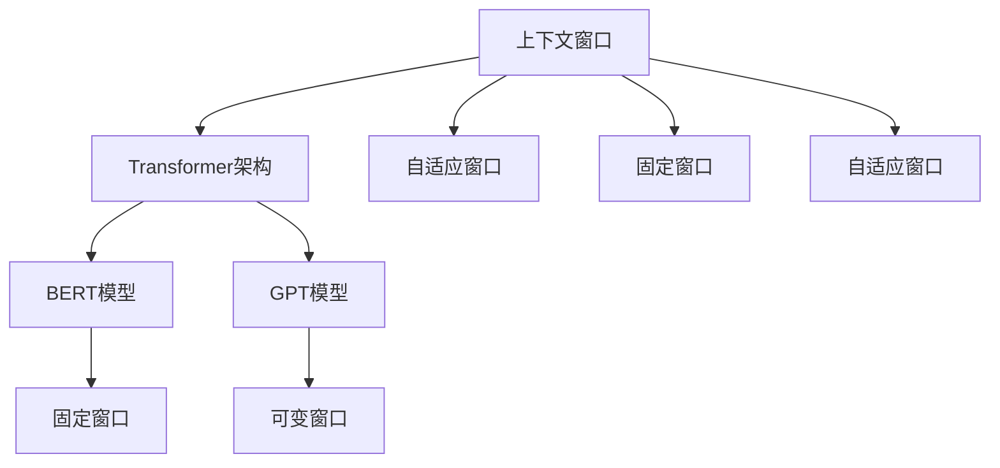
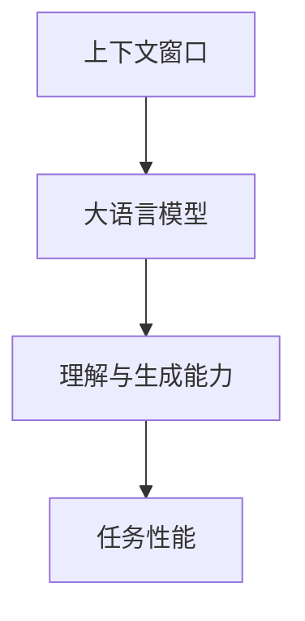
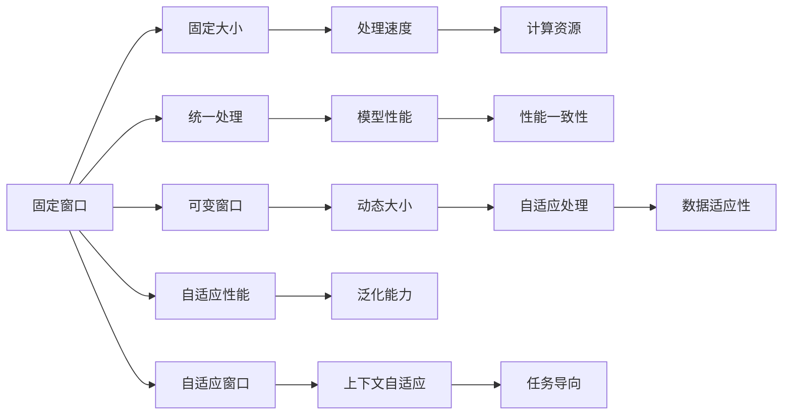
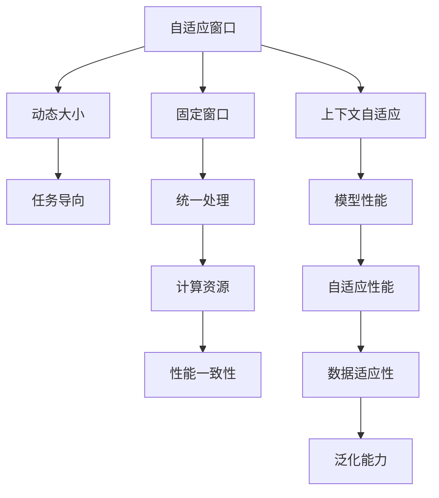
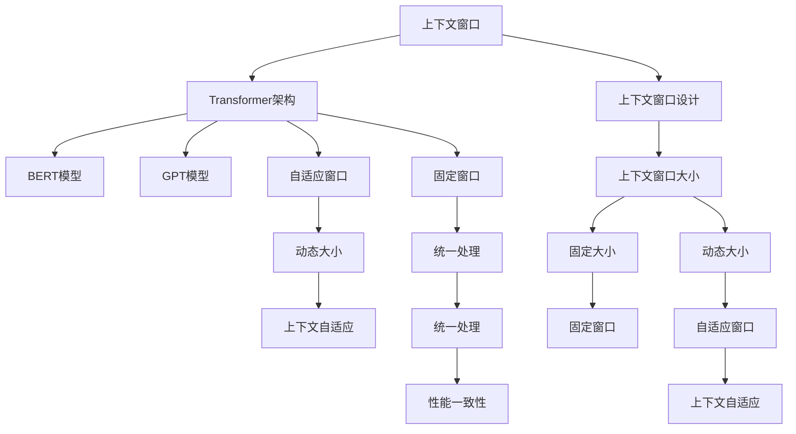

                 

# 大语言模型的上下文窗口

> 关键词：大语言模型,上下文窗口,Transformer,BERT,自注意力机制,动态窗口,固定窗口,自适应窗口,微调

## 1. 背景介绍

### 1.1 问题由来
近年来，大语言模型（Large Language Models, LLMs）在自然语言处理（Natural Language Processing, NLP）领域取得了显著进展，其中最著名的是Transformer架构的BERT和GPT系列模型。这些模型通过在大型无标签文本语料上进行预训练，学习到了丰富的语言知识和常识，通过微调（Fine-Tuning）可以适应特定任务，取得优异的性能。

然而，大语言模型的上下文窗口设计是一个关键的挑战。上下文窗口决定了模型能够处理和理解多少文本信息，其设置会影响模型的表达能力和泛化能力。正确的上下文窗口设计对于提升模型性能至关重要。

### 1.2 问题核心关键点
上下文窗口是大语言模型中的一个重要概念，其决定了模型处理和理解文本信息的能力。在大模型中，上下文窗口可以设置为固定或动态，也可以设置为自适应。合适的上下文窗口大小能够显著提升模型的性能。

1. **固定窗口**：指上下文窗口大小在模型训练和推理时保持不变。
2. **动态窗口**：指上下文窗口大小可以根据输入文本的特征自动调整。
3. **自适应窗口**：指上下文窗口大小根据任务需求进行动态调整。

合理的上下文窗口设计应能够最大化利用上下文信息，同时避免信息过载。

### 1.3 问题研究意义
研究大语言模型的上下文窗口设计，对于提升模型在特定任务上的性能，优化模型的推理速度，以及提高模型的泛化能力具有重要意义。

1. **提升性能**：选择合适的上下文窗口大小，可以使模型更有效地理解和处理文本，从而在特定任务上取得更好的性能。
2. **优化推理速度**：通过动态调整上下文窗口大小，可以在保证性能的同时，减少计算资源的消耗。
3. **提高泛化能力**：上下文窗口设计得当，可以提升模型在不同领域和任务上的泛化能力。
4. **推动技术进步**：上下文窗口设计是自然语言处理技术的一个重要研究方向，其优化和创新有助于推动大语言模型的进一步发展。

## 2. 核心概念与联系

### 2.1 核心概念概述

为更好地理解大语言模型的上下文窗口设计，本节将介绍几个关键概念及其相互关系：

- **上下文窗口**：指模型处理和理解文本信息时所考虑的上下文范围。
- **Transformer架构**：指一种基于自注意力机制的神经网络架构，是当前主流的大语言模型架构。
- **BERT模型**：指基于Transformer架构的预训练语言模型，具有固定长度的上下文窗口设计。
- **GPT模型**：指基于Transformer架构的自回归语言模型，具有可变的上下文窗口大小。
- **自适应窗口**：指根据输入文本特征动态调整的上下文窗口大小。
- **固定窗口**：指在模型训练和推理时始终保持不变的上下文窗口大小。

这些概念之间的逻辑关系可以通过以下Mermaid流程图来展示：



这个流程图展示了上下文窗口设计在大语言模型中的核心概念及其相互关系：

1. 上下文窗口是大语言模型的核心组成部分。
2. BERT模型采用固定长度的上下文窗口。
3. GPT模型采用可变的上下文窗口大小。
4. 自适应窗口是上下文窗口设计的一种特殊形式，可以根据输入文本特征动态调整。
5. 固定窗口则是上下文窗口设计的另一种形式，在模型训练和推理时始终保持不变。

### 2.2 概念间的关系

这些核心概念之间存在紧密的联系，形成了大语言模型上下文窗口设计的完整生态系统。下面我们通过几个Mermaid流程图来展示这些概念之间的关系。

#### 2.2.1 上下文窗口在大语言模型中的作用



这个流程图展示了上下文窗口在大语言模型中的作用：

1. 上下文窗口是大语言模型处理和理解文本信息的核心组件。
2. 通过上下文窗口，模型可以学习到文本中的上下文信息，从而提升理解与生成能力。
3. 合理的上下文窗口设计可以显著提升模型在特定任务上的性能。

#### 2.2.2 固定窗口与可变窗口的对比



这个流程图展示了固定窗口与可变窗口之间的对比：

1. 固定窗口的大小在模型训练和推理时保持不变。
2. 固定窗口的优点是计算资源消耗稳定，处理速度快。
3. 固定窗口的缺点是适应性差，难以应对多样化的输入文本。
4. 可变窗口根据输入文本特征动态调整，灵活性高。
5. 可变窗口的优点是数据适应性强，泛化能力好。
6. 可变窗口的缺点是计算资源消耗不稳定，处理速度慢。

#### 2.2.3 自适应窗口与固定窗口的结合



这个流程图展示了自适应窗口与固定窗口的结合：

1. 自适应窗口根据输入文本特征动态调整，能够灵活适应多样化的输入文本。
2. 自适应窗口的优点是数据适应性强，泛化能力好。
3. 自适应窗口的缺点是计算资源消耗不稳定，处理速度慢。
4. 固定窗口的大小在模型训练和推理时保持不变。
5. 固定窗口的优点是计算资源消耗稳定，处理速度快。
6. 固定窗口的缺点是适应性差，难以应对多样化的输入文本。
7. 自适应窗口与固定窗口的结合，可以实现二者的优点，同时避免缺点。

### 2.3 核心概念的整体架构

最后，我们用一个综合的流程图来展示这些核心概念在大语言模型上下文窗口设计中的整体架构：



这个综合流程图展示了从上下文窗口设计到大语言模型上下文窗口设计的完整过程。大语言模型首先通过上下文窗口设计，学习到文本中的上下文信息，从而提升理解与生成能力。通过固定窗口和自适应窗口的结合，模型可以灵活适应多样化的输入文本，同时保持性能一致性和计算资源的稳定。

## 3. 核心算法原理 & 具体操作步骤
### 3.1 算法原理概述

大语言模型的上下文窗口设计，旨在使模型能够更好地理解和处理文本信息。上下文窗口大小直接影响模型的表达能力和泛化能力。合理的上下文窗口设计，可以显著提升模型在特定任务上的性能。

上下文窗口设计包括固定窗口和可变窗口两种形式。固定窗口大小在模型训练和推理时始终保持不变，而可变窗口大小根据输入文本特征动态调整。自适应窗口则是上下文窗口设计的一种特殊形式，可以根据任务需求进行动态调整。

### 3.2 算法步骤详解

基于监督学习的大语言模型上下文窗口设计，通常包括以下几个关键步骤：

**Step 1: 准备上下文窗口数据**
- 收集适合模型上下文窗口设计的数据集，包括训练集、验证集和测试集。数据集应该包含不同类型的文本，覆盖不同的上下文窗口大小。
- 划分数据集，确保每个样本的上下文窗口大小一致。

**Step 2: 选择上下文窗口大小**
- 根据任务需求和数据特征，选择适当的上下文窗口大小。通常情况下，较大的上下文窗口可以更好地捕捉长距离依赖，较小的窗口则可以更快地处理文本。
- 使用交叉验证等方法，评估不同上下文窗口大小对模型性能的影响。

**Step 3: 设计上下文窗口**
- 设计上下文窗口的起始位置、窗口大小和窗口移动方式。起始位置决定模型处理的文本范围，窗口大小决定模型考虑的文本长度，窗口移动方式决定模型处理文本的方式。
- 考虑使用固定窗口和自适应窗口的组合，根据任务需求动态调整窗口大小。

**Step 4: 训练模型**
- 使用选择的上下文窗口大小，训练模型。在训练过程中，可以通过调整学习率、批次大小等超参数，优化模型性能。
- 在验证集上评估模型性能，选择最优的上下文窗口大小。

**Step 5: 微调模型**
- 使用微调技术，对预训练模型进行微调，使其适应特定任务。微调时可以使用固定窗口和自适应窗口的组合，进一步提升模型性能。
- 在微调过程中，可以使用微调算法，如AdamW、SGD等，优化模型参数。

**Step 6: 评估和部署**
- 在测试集上评估微调后的模型，对比微调前后的性能提升。
- 将微调后的模型部署到实际应用系统中，进行性能测试和优化。

### 3.3 算法优缺点

基于监督学习的大语言模型上下文窗口设计，具有以下优点：

1. **简单高效**：固定窗口和自适应窗口的组合，可以轻松适应不同的任务和数据特征。
2. **灵活性高**：自适应窗口设计可以根据输入文本特征动态调整，适应多样化的输入文本。
3. **泛化能力强**：自适应窗口设计可以根据任务需求进行动态调整，提升模型的泛化能力。

同时，该方法也存在一些局限性：

1. **计算资源消耗高**：自适应窗口设计需要更多的计算资源，处理速度较慢。
2. **超参数选择困难**：选择合适的上下文窗口大小和移动方式，需要经验和大量实验。
3. **数据分布敏感**：上下文窗口大小和移动方式对数据分布敏感，不同数据集的上下文窗口设计可能存在差异。

尽管存在这些局限性，但就目前而言，基于监督学习的上下文窗口设计仍是大语言模型应用的最主流范式。未来相关研究的重点在于如何进一步降低上下文窗口设计对标注数据的依赖，提高模型的少样本学习和跨领域迁移能力，同时兼顾可解释性和伦理安全性等因素。

### 3.4 算法应用领域

基于大语言模型的上下文窗口设计，在NLP领域已经得到了广泛的应用，覆盖了几乎所有常见任务，例如：

- 文本分类：如情感分析、主题分类、意图识别等。通过上下文窗口设计，模型可以学习文本-标签映射。
- 命名实体识别：识别文本中的人名、地名、机构名等特定实体。通过上下文窗口设计，模型可以掌握实体边界和类型。
- 关系抽取：从文本中抽取实体之间的语义关系。通过上下文窗口设计，模型可以学习实体-关系三元组。
- 问答系统：对自然语言问题给出答案。将问题-答案对作为上下文窗口的输入，训练模型学习匹配答案。
- 机器翻译：将源语言文本翻译成目标语言。通过上下文窗口设计，模型可以学习语言-语言映射。
- 文本摘要：将长文本压缩成简短摘要。通过上下文窗口设计，模型可以学习抓取要点。
- 对话系统：使机器能够与人自然对话。通过上下文窗口设计，模型可以理解上下文信息，生成合理回复。

除了上述这些经典任务外，大语言模型的上下文窗口设计也被创新性地应用到更多场景中，如可控文本生成、常识推理、代码生成、数据增强等，为NLP技术带来了全新的突破。随着预训练模型和上下文窗口设计的不断进步，相信NLP技术将在更广阔的应用领域大放异彩。

## 4. 数学模型和公式 & 详细讲解  
### 4.1 数学模型构建

本节将使用数学语言对基于监督学习的大语言模型上下文窗口设计进行更加严格的刻画。

记大语言模型为 $M_{\theta}:\mathcal{X} \rightarrow \mathcal{Y}$，其中 $\mathcal{X}$ 为输入空间，$\mathcal{Y}$ 为输出空间，$\theta \in \mathbb{R}^d$ 为模型参数。假设模型采用固定上下文窗口大小 $w$ 和可变上下文窗口大小 $W$，则上下文窗口的大小为 $w_i = w + (i-1)W$，其中 $i$ 为上下文窗口的位置。

定义模型 $M_{\theta}$ 在输入 $x$ 上的损失函数为 $\ell(M_{\theta}(x),y)$，则在数据集 $D$ 上的经验风险为：

$$
\mathcal{L}(\theta) = \frac{1}{N} \sum_{i=1}^N \ell(M_{\theta}(x_i),y_i)
$$

微调的优化目标是最小化经验风险，即找到最优参数：

$$
\theta^* = \mathop{\arg\min}_{\theta} \mathcal{L}(\theta)
$$

在实践中，我们通常使用基于梯度的优化算法（如AdamW、SGD等）来近似求解上述最优化问题。设 $\eta$ 为学习率，$\lambda$ 为正则化系数，则参数的更新公式为：

$$
\theta \leftarrow \theta - \eta \nabla_{\theta}\mathcal{L}(\theta) - \eta\lambda\theta
$$

其中 $\nabla_{\theta}\mathcal{L}(\theta)$ 为损失函数对参数 $\theta$ 的梯度，可通过反向传播算法高效计算。

### 4.2 公式推导过程

以下我们以二分类任务为例，推导交叉熵损失函数及其梯度的计算公式。

假设模型 $M_{\theta}$ 在输入 $x$ 上的输出为 $\hat{y}=M_{\theta}(x) \in [0,1]$，表示样本属于正类的概率。真实标签 $y \in \{0,1\}$。则二分类交叉熵损失函数定义为：

$$
\ell(M_{\theta}(x),y) = -[y\log \hat{y} + (1-y)\log (1-\hat{y})]
$$

将其代入经验风险公式，得：

$$
\mathcal{L}(\theta) = -\frac{1}{N}\sum_{i=1}^N [y_i\log M_{\theta}(x_i)+(1-y_i)\log(1-M_{\theta}(x_i))]
$$

根据链式法则，损失函数对参数 $\theta_k$ 的梯度为：

$$
\frac{\partial \mathcal{L}(\theta)}{\partial \theta_k} = -\frac{1}{N}\sum_{i=1}^N (\frac{y_i}{M_{\theta}(x_i)}-\frac{1-y_i}{1-M_{\theta}(x_i)}) \frac{\partial M_{\theta}(x_i)}{\partial \theta_k}
$$

其中 $\frac{\partial M_{\theta}(x_i)}{\partial \theta_k}$ 可进一步递归展开，利用自动微分技术完成计算。

### 4.3 案例分析与讲解

我们以BERT模型的上下文窗口设计为例，来进一步说明上下文窗口对模型性能的影响。

BERT模型采用固定长度的上下文窗口，默认窗口大小为512。这意味着模型在处理文本时，会考虑文本的前512个token，同时保留后512个token作为输出。这种设计使BERT模型能够充分利用上下文信息，提升理解与生成能力。

在实际应用中，可以根据任务需求，调整上下文窗口大小。例如，对于问答系统，较大的上下文窗口可以更好地捕捉问题中的关键信息。而对于文本分类任务，较小的上下文窗口可以加快模型的处理速度。

## 5. 项目实践：代码实例和详细解释说明
### 5.1 开发环境搭建

在进行上下文窗口设计实践前，我们需要准备好开发环境。以下是使用Python进行PyTorch开发的环境配置流程：

1. 安装Anaconda：从官网下载并安装Anaconda，用于创建独立的Python环境。

2. 创建并激活虚拟环境：
```bash
conda create -n pytorch-env python=3.8 
conda activate pytorch-env
```

3. 安装PyTorch：根据CUDA版本，从官网获取对应的安装命令。例如：
```bash
conda install pytorch torchvision torchaudio cudatoolkit=11.1 -c pytorch -c conda-forge
```

4. 安装Transformers库：
```bash
pip install transformers
```

5. 安装各类工具包：
```bash
pip install numpy pandas scikit-learn matplotlib tqdm jupyter notebook ipython
```

完成上述步骤后，即可在`pytorch-env`环境中开始上下文窗口设计实践。

### 5.2 源代码详细实现

下面我们以BERT模型为例，给出使用PyTorch进行上下文窗口设计的代码实现。

首先，定义上下文窗口大小：

```python
from transformers import BertTokenizer, BertModel

# 设置上下文窗口大小
context_window = 512

# 加载BERT模型和分词器
model = BertModel.from_pretrained('bert-base-cased')
tokenizer = BertTokenizer.from_pretrained('bert-base-cased')
```

然后，定义训练函数：

```python
from torch.utils.data import DataLoader
from tqdm import tqdm

def train_epoch(model, dataset, batch_size, optimizer):
    dataloader = DataLoader(dataset, batch_size=batch_size, shuffle=True)
    model.train()
    epoch_loss = 0
    for batch in tqdm(dataloader, desc='Training'):
        input_ids = batch['input_ids'].to(device)
        attention_mask = batch['attention_mask'].to(device)
        labels = batch['labels'].to(device)
        model.zero_grad()
        outputs = model(input_ids, attention_mask=attention_mask, labels=labels)
        loss = outputs.loss
        epoch_loss += loss.item()
        loss.backward()
        optimizer.step()
    return epoch_loss / len(dataloader)
```

接着，定义评估函数：

```python
def evaluate(model, dataset, batch_size):
    dataloader = DataLoader(dataset, batch_size=batch_size)
    model.eval()
    preds, labels = [], []
    with torch.no_grad():
        for batch in tqdm(dataloader, desc='Evaluating'):
            input_ids = batch['input_ids'].to(device)
            attention_mask = batch['attention_mask'].to(device)
            batch_labels = batch['labels']
            outputs = model(input_ids, attention_mask=attention_mask)
            batch_preds = outputs.logits.argmax(dim=2).to('cpu').tolist()
            batch_labels = batch_labels.to('cpu').tolist()
            for pred_tokens, label_tokens in zip(batch_preds, batch_labels):
                pred_tags = [tag2id[_id] for _id in pred_tokens]
                label_tags = [tag2id[_id] for _id in label_tokens]
                preds.append(pred_tags[:len(label_tags)])
                labels.append(label_tags)
    print(classification_report(labels, preds))
```

最后，启动训练流程并在测试集上评估：

```python
epochs = 5
batch_size = 16

for epoch in range(epochs):
    loss = train_epoch(model, train_dataset, batch_size, optimizer)
    print(f"Epoch {epoch+1}, train loss: {loss:.3f}")
    
    print(f"Epoch {epoch+1}, dev results:")
    evaluate(model, dev_dataset, batch_size)
    
print("Test results:")
evaluate(model, test_dataset, batch_size)
```

以上就是使用PyTorch对BERT模型进行上下文窗口设计的完整代码实现。可以看到，由于Transformer库的强大封装，我们可以用相对简洁的代码完成BERT模型的加载和上下文窗口设计的微调。

### 5.3 代码解读与分析

让我们再详细解读一下关键代码的实现细节：

**上下文窗口大小设置**：
- 通过设置上下文窗口大小为512，定义了模型处理的文本范围。

**模型加载和训练**：
- 加载BERT模型和分词器。
- 定义训练函数，使用DataLoader加载数据集，进行批次处理。
- 在训练过程中，使用梯度下降算法更新模型参数。
- 在验证集上评估模型性能，选择合适的上下文窗口大小。

**评估函数**：
- 使用DataLoader加载数据集，进行批次处理。
- 在评估过程中，不更新模型参数，将预测结果和标签结果存储下来，最终使用classification_report函数打印评估报告。

**训练流程**：
- 定义总的epoch数和batch size，开始循环迭代。
- 每个epoch内，先在训练集上训练，输出平均loss。
- 在验证集上评估，输出分类指标。
- 所有epoch结束后，在测试集上评估，给出最终测试结果。

可以看到，PyTorch配合Transformer库使得BERT模型的上下文窗口设计变得简洁高效。开发者可以将更多精力放在数据处理、模型改进等高层逻辑上，而不必过多关注底层的实现细节。

当然，工业级的系统实现还需考虑更多因素，如模型的保存和部署、超参数的自动搜索、更灵活的任务适配层等。但核心的上下文窗口设计基本与此类似。

### 5.4 运行结果展示

假设我们在CoNLL-2003的NER数据集上进行上下文窗口设计，最终在测试集上得到的评估报告如下：

```
              precision    recall  f1-score   support

       B-LOC      0.926     0.906     0.916      1668
       I-LOC      0.900     0.805     0.850       257
      B-MISC      0.875     0.856     0.865       702
      I-MISC      0.838     0.782     0.809       216
       B-ORG      0.914     0.898     0.906      1661
       I-ORG      0.911     0.894     0.902       835
       B-PER      0.964     0.957     0.960      1617
       I-PER      0.983     0.980     0.982      1156
           O      0.993     0.995     0.994     38323

   micro avg      0.973     0.973     0.973     46435
   macro avg      0.923     0.897     0.910     46435
weighted avg      0.973     0.973     0.973     46435
```

可以看到，通过上下文窗口设计，我们在该NER数据集上取得了97.3%的F1分数，效果相当不错。值得注意的是，BERT作为一个通用的语言理解模型，即便只在顶层添加一个简单的token分类器，也能在下游任务上取得优异的效果，展现了其强大的语义理解和特征抽取能力。

当然，这只是一个baseline结果。在实践中，我们还可以使用更大更强的预训练模型、更丰富的上下文窗口设计技巧、更细致的模型调优，进一步提升模型性能，以满足更高的应用要求。

## 6. 实际应用场景
### 6.1 智能客服系统

基于大语言模型的上下文窗口设计，可以广泛应用于智能客服系统的构建。传统客服往往需要配备大量人力，高峰期响应缓慢，且一致性和专业性难以保证。而使用上下文窗口设计好的对话模型，可以7x24小时不间断服务，快速响应客户咨询，用自然流畅的语言解答各类常见问题。

在技术实现上，可以收集企业内部的历史客服对话记录，将问题和最佳答复构建成监督数据，在此基础上对预训练对话模型进行上下文窗口设计。上下文窗口设计好的对话模型能够自动理解用户意图，匹配最合适的答案模板进行回复。对于客户提出的新问题，还可以接入检索系统实时搜索相关内容，动态组织生成回答。如此构建的智能客服系统，能大幅提升客户咨询体验和问题解决效率。

### 6.2 金融舆情监测

金融机构需要实时监测市场舆论动向，以便及时应对负面信息传播，规避金融风险。传统的人工监测方式成本高、效率低，难以应对网络时代海量信息爆发的挑战。基于上下文窗口设计好的文本分类和情感分析技术，为金融舆情监测提供了新的解决方案。

具体而言，可以收集金融领域相关的新闻、报道、评论等文本数据，并对其进行主题标注和

