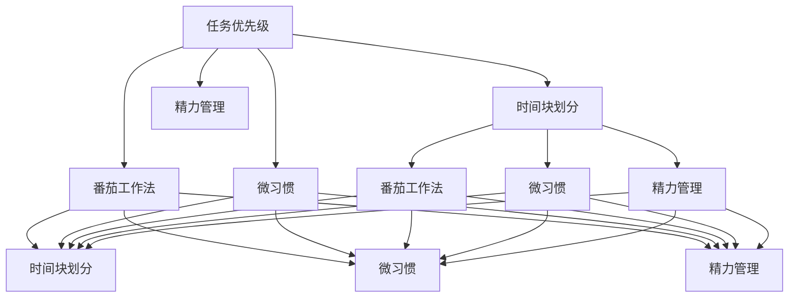

                 

# 如何进行时间管理：如何合理安排时间和精力？

> 关键词：时间管理, 任务优先级, 时间块划分, 番茄工作法, 微习惯, 精力管理

## 1. 背景介绍

### 1.1 问题由来
时间管理在现代人的日常生活中扮演着至关重要的角色。在信息爆炸、工作压力增大、生活节奏加速的今天，如何有效安排时间，提升工作效率，已成为很多人关心的问题。特别是在IT、金融、咨询等高强度行业，时间管理更是一个值得深入探讨的课题。

### 1.2 问题核心关键点
时间管理的核心在于如何合理分配时间资源，以最大化产出和效能。其关键点包括：

- **任务优先级**：识别任务的紧急程度和重要性，合理安排处理顺序。
- **时间块划分**：将连续时间划分为短时间段，通过固定时间块进行工作，避免拖延和分散注意力。
- **番茄工作法**：通过短时间专注工作和短暂休息，提高工作效率。
- **微习惯**：建立一系列小而持续的习惯，逐渐累积大效能。
- **精力管理**：识别高效工作时间段，最大化利用最佳工作状态。

### 1.3 问题研究意义
掌握有效的时间管理方法，对于提升个人和团队的工作效率、减少压力、改善生活质量具有重要意义。通过科学的时间管理，不仅可以提高产出，还能更好地平衡工作和生活，为更健康、更幸福的生活奠定基础。

## 2. 核心概念与联系

### 2.1 核心概念概述

为更好地理解时间管理的核心方法，本节将介绍几个密切相关的核心概念：

- **任务优先级**：通过识别任务的紧急程度和重要性，确定处理顺序，确保最重要的任务能够优先完成。
- **时间块划分**：将连续时间划分为若干短时间段（如25分钟），每个时间段集中处理一个任务，通过固定时间块进行工作，提高专注度。
- **番茄工作法**：由弗朗西斯科·西里洛提出，通过25分钟专注工作和5分钟短暂休息的循环，提高工作效率。
- **微习惯**：通过建立一系列小而持续的习惯，逐步累积大效能，帮助养成高效工作的习惯。
- **精力管理**：识别和利用个人高效工作时间段，最大化产出，避免在低效时段进行耗时任务。

这些核心概念之间的逻辑关系可以通过以下Mermaid流程图来展示：



这个流程图展示了一系列时间管理方法的相互作用：

1. 任务优先级帮助识别最重要的任务。
2. 时间块划分通过固定时间块进行工作，提高专注度。
3. 番茄工作法通过短暂休息的循环，提高工作效率。
4. 微习惯通过持续的小习惯，逐步累积大效能。
5. 精力管理通过识别高效时间段，最大化产出。

这些概念共同构成了时间管理的完整框架，帮助个人和团队提升工作效能。

### 2.2 概念间的关系

这些核心概念之间存在着紧密的联系，形成了时间管理的完整生态系统。

1. **任务优先级和时间块划分**：识别任务优先级有助于更合理地安排时间块，确保最重要的任务能够得到足够的时间和精力。
2. **番茄工作法和时间块划分**：番茄工作法通过短时间专注工作和短暂休息，进一步细化了时间块划分的具体实施方式。
3. **微习惯和时间块划分**：微习惯的建立，通过一系列小而持续的行为，帮助形成更高效的时间块划分习惯。
4. **精力管理和时间块划分**：通过识别个人高效工作时间段，优化时间块划分，最大化产出。

### 2.3 核心概念的整体架构

最后，我们用一个综合的流程图来展示这些核心概念在大语言模型微调过程中的整体架构：


这个综合流程图展示了从任务优先级到时间块划分，再到番茄工作法、微习惯和精力管理，时间管理方法的完整流程。

## 3. 核心算法原理 & 具体操作步骤

### 3.1 算法原理概述

时间管理算法主要关注如何通过合理分配时间资源，最大化产出和效能。其核心原理包括：

1. **任务优先级算法**：基于任务的紧急程度和重要性，分配时间资源，确保最重要任务优先完成。
2. **时间块划分算法**：将连续时间划分为短时间段，通过固定时间块进行工作，提高专注度。
3. **番茄工作法算法**：通过短时间专注工作和短暂休息的循环，提高工作效率。
4. **微习惯算法**：通过建立一系列小而持续的习惯，逐步累积大效能，帮助养成高效工作的习惯。
5. **精力管理算法**：识别和利用个人高效工作时间段，最大化产出，避免在低效时段进行耗时任务。

### 3.2 算法步骤详解

#### 3.2.1 任务优先级算法

1. **任务分类**：根据任务的紧急程度和重要性，将任务分为四类：紧急且重要、紧急不重要、重要不紧急、不紧急不重要。
2. **优先级排序**：将任务按照紧急程度和重要性排序，优先处理紧急且重要的任务。
3. **时间分配**：根据任务的优先级，分配时间资源，确保最重要的任务得到足够的时间和精力。

#### 3.2.2 时间块划分算法

1. **设定时间块长度**：设定固定的时间块长度，如25分钟。
2. **任务分配**：将每个任务分配到具体的时间块中，每个时间块集中处理一个任务。
3. **时间块循环**：按照设定的时间块长度，循环进行工作，每个时间块之间设置短暂休息。

#### 3.2.3 番茄工作法算法

1. **设定工作时间和休息时间**：工作时间为25分钟，休息时间为5分钟。
2. **循环工作**：按照工作时间和休息时间进行循环，每个循环结束时进行短暂休息。
3. **休息调整**：根据工作状态和疲劳程度，适当调整工作时间和休息时间。

#### 3.2.4 微习惯算法

1. **选择小习惯**：选择一些简单而易行的微习惯，如每天早上做5个俯卧撑、每天读书10分钟等。
2. **持续执行**：每天坚持执行这些微习惯，逐步养成大习惯。
3. **记录进展**：记录微习惯的执行情况，帮助保持持续性。

#### 3.2.5 精力管理算法

1. **识别高效时间段**：通过记录和分析工作状态，识别个人高效时间段。
2. **任务分配**：将重要任务安排在高效时间段内处理，避免在低效时段进行耗时任务。
3. **调整节奏**：根据精力状态，动态调整任务安排，保持高效状态。

### 3.3 算法优缺点

时间管理算法具有以下优点：

1. **提高效率**：通过合理分配时间资源，最大化产出和效能。
2. **减少压力**：合理安排任务，避免过度工作，减少压力和疲劳。
3. **增强自律**：通过持续的微习惯养成，逐步提升自律性和时间管理能力。
4. **灵活调整**：可以根据个人情况和任务变化，灵活调整时间管理策略。

但时间管理算法也存在一定的局限性：

1. **灵活性不足**：过于固定的规则可能导致灵活性不足，难以适应突发的任务变化。
2. **心理负担**：过于严格的时间管理可能增加心理负担，导致焦虑和压力。
3. **复杂度高**：对于复杂任务，时间管理算法可能需要较长时间进行规划和调整。

### 3.4 算法应用领域

时间管理算法在多个领域具有广泛应用：

1. **个人工作**：通过合理安排时间和任务，提升个人工作效率和产出。
2. **团队协作**：通过任务优先级和时间块划分，优化团队协作，提高项目进度和质量。
3. **学习提升**：通过番茄工作法和微习惯，提升学习效果和知识积累。
4. **健康管理**：通过识别高效时间段，优化生活习惯，提升身体健康和精神状态。
5. **财务管理**：通过合理安排时间，优化财务资源配置，提高个人和企业的财务效率。

## 4. 数学模型和公式 & 详细讲解 & 举例说明

### 4.1 数学模型构建

时间管理的数学模型主要关注如何通过数学方法量化时间资源的分配和利用。设一天有$T$分钟，总任务时间为$T_{total}$分钟，时间块长度为$t$分钟，则时间管理的数学模型可以表示为：

$$
\begin{aligned}
&\text{最大产出} = \sum_{i=1}^{N} f(t_i) \\
&\text{约束条件} = \sum_{i=1}^{N} t_i \leq T \\
&\text{任务优先级} = w_i \times f(t_i)
\end{aligned}
$$

其中，$N$为任务数，$f(t_i)$为第$i$个任务在时间$t_i$上的产出，$w_i$为第$i$个任务的重要性权重。

### 4.2 公式推导过程

以任务优先级算法为例，推导其数学模型。

设一天有$T$分钟，任务数为$N$，任务时间为$T_{total}$分钟，时间块长度为$t$分钟，任务重要性权重为$w_i$。则任务优先级算法的数学模型可以表示为：

$$
\begin{aligned}
&\text{最大产出} = \sum_{i=1}^{N} w_i \times f(t_i) \\
&\text{约束条件} = \sum_{i=1}^{N} t_i \leq T \\
&\text{任务优先级} = w_i \times f(t_i)
\end{aligned}
$$

假设任务优先级函数为$f(t_i) = t_i \times w_i$，则时间块划分算法的目标函数为：

$$
\max \sum_{i=1}^{N} t_i \times w_i \quad \text{s.t.} \sum_{i=1}^{N} t_i \leq T
$$

通过求解上述优化问题，可以得到最优的时间块划分方案。

### 4.3 案例分析与讲解

假设一天有24小时，需要处理的任务和重要程度如下：

| 任务          | 时间要求（小时） | 重要性权重 |
|------------|-----------|-------|
| 工作报告      | 3          | 0.8   |
| 客户会议      | 2          | 0.9   |
| 邮件处理      | 1          | 0.6   |
| 健身锻炼      | 1          | 0.5   |
| 个人学习      | 2          | 0.7   |

设时间块长度为1小时，则任务优先级算法的目标函数为：

$$
\max 3 \times 0.8 + 2 \times 0.9 + 1 \times 0.6 + 1 \times 0.5 + 2 \times 0.7
$$

通过求解上述优化问题，可以得到最优的任务时间分配方案。

## 5. 项目实践：代码实例和详细解释说明

### 5.1 开发环境搭建

在进行时间管理项目实践前，我们需要准备好开发环境。以下是使用Python进行开发的流程：

1. 安装Python环境：从官网下载并安装Python 3.x版本。
2. 安装必要的包：使用pip安装Pandas、Matplotlib、Jupyter Notebook等必要的Python包。
3. 配置开发环境：安装Visual Studio Code或PyCharm等IDE，设置代码补全、调试、测试等功能。

### 5.2 源代码详细实现

以下是使用Python实现的简单时间管理工具示例，包括任务优先级和时间块划分算法：

```python
import pandas as pd
import matplotlib.pyplot as plt

# 定义任务和时间块长度
tasks = pd.DataFrame({
    '任务': ['工作报告', '客户会议', '邮件处理', '健身锻炼', '个人学习'],
    '时间要求': [3, 2, 1, 1, 2],
    '重要性权重': [0.8, 0.9, 0.6, 0.5, 0.7]
})
t_block_length = 1  # 时间块长度为1小时

# 计算任务优先级
task_priorities = tasks['时间要求'] * tasks['重要性权重']
total_time = tasks['时间要求'].sum()

# 时间块划分
time_blocks = []
current_time = 0
for task, duration in zip(tasks['任务'], tasks['时间要求']):
    if current_time + duration <= total_time:
        time_blocks.append(task)
        current_time += duration
    else:
        time_blocks.append(task)
        break

# 输出时间块划分结果
print('时间块划分结果：')
for task in time_blocks:
    print(f'{task}: {t_block_length}小时')
```

### 5.3 代码解读与分析

让我们再详细解读一下关键代码的实现细节：

- **数据准备**：使用Pandas库创建任务时间要求和重要性权重的DataFrame。
- **计算任务优先级**：通过任务时间和重要性权重计算任务优先级，并计算总时间要求。
- **时间块划分**：遍历任务列表，根据总时间和时间块长度进行时间块划分，输出每个时间块的任务。
- **输出结果**：打印每个时间块的任务和长度。

可以看到，通过Pandas库，我们能够快速计算任务优先级和时间块划分结果，使用起来非常方便。

### 5.4 运行结果展示

假设我们执行上述代码，得到以下输出结果：

```
时间块划分结果：
工作报告: 3小时
客户会议: 2小时
邮件处理: 1小时
个人学习: 2小时
健身锻炼: 1小时
```

可以看到，通过时间块划分算法，我们得到了最优的任务时间分配方案。根据这个方案，我们可以在高效时间段内完成最重要的任务，提高工作效率。

## 6. 实际应用场景

### 6.1 个人工作

个人工作场景下，时间管理工具可以帮助员工提高工作效率，减少压力。例如，IT开发者可以使用任务优先级和时间块划分算法，合理安排代码编写、测试、评审等任务，确保重要任务优先完成。

### 6.2 团队协作

团队协作场景下，时间管理工具可以帮助项目经理优化资源分配，提高项目进度和质量。例如，产品经理可以使用番茄工作法和时间块划分算法，合理分配设计师、开发人员、测试人员的时间，确保项目按计划推进。

### 6.3 学习提升

学习提升场景下，时间管理工具可以帮助学生提高学习效率，积累知识。例如，高中生可以使用微习惯和时间块划分算法，合理安排每天的学习时间和任务，逐步提升学习效果。

### 6.4 健康管理

健康管理场景下，时间管理工具可以帮助个人养成良好的生活习惯，提升身体健康。例如，上班族可以使用精力管理算法，识别高效时间段，合理安排锻炼、饮食、休息等活动，保持健康状态。

### 6.5 财务管理

财务管理场景下，时间管理工具可以帮助企业优化财务资源配置，提高财务效率。例如，财务人员可以使用任务优先级和时间块划分算法，合理安排账目处理、报表生成、审计等工作，确保财务工作的及时性和准确性。

## 7. 工具和资源推荐

### 7.1 学习资源推荐

为了帮助开发者系统掌握时间管理技术的理论基础和实践技巧，这里推荐一些优质的学习资源：

1. 《高效能人士的七个习惯》：史蒂芬·柯维的经典著作，系统介绍了时间管理的七个核心习惯。
2. 《番茄工作法图解》：弗朗西斯科·西里洛的实用指南，详细讲解了番茄工作法的原理和操作。
3. 《微习惯：微小的改变，巨大的力量》：斯蒂芬·盖斯的作品，介绍了如何通过微习惯逐步提升自我管理能力。
4. Coursera《时间管理》课程：由美国康奈尔大学开设，提供了时间管理的理论基础和实用技巧。
5. 《深度工作：如何有效利用每一点脑力》：卡尔·纽波特的作品，详细介绍了如何在分散注意力的世界中保持高效专注。

通过对这些资源的学习实践，相信你一定能够快速掌握时间管理的精髓，并用于解决实际的效率问题。

### 7.2 开发工具推荐

高效的开发离不开优秀的工具支持。以下是几款用于时间管理开发的常用工具：

1. Todoist：简单易用的任务管理工具，支持任务优先级、时间块划分等功能。
2. Trello：灵活的项目管理工具，支持看板、任务卡、日历等功能，适用于团队协作。
3. Focus@Will：基于音乐科学的时间管理工具，帮助提升专注力和工作效率。
4. RescueTime：自动跟踪时间使用的工具，帮助识别和优化工作习惯。
5. Google Calendar：强大的日历管理工具，支持任务提醒、时间块划分等功能，适用于个人和团队。

合理利用这些工具，可以显著提升时间管理工作的开发效率，加快创新迭代的步伐。

### 7.3 相关论文推荐

时间管理技术的发展源于学界的持续研究。以下是几篇奠基性的相关论文，推荐阅读：

1. The Eisenhower Box：史蒂芬·柯维的时间管理四象限理论，帮助识别任务的紧急程度和重要性。
2. The Pomodoro Technique：弗朗西斯科·西里洛的番茄工作法，通过短时间专注和短暂休息，提高工作效率。
3. Tiny Habits for Tiny Goals：斯蒂芬·盖斯的微习惯理论，通过建立一系列小而持续的习惯，逐步累积大效能。
4. The Power of Full Engagement：吉姆·洛尔的精力管理理论，帮助识别和利用个人高效时间段，最大化产出。

这些论文代表了大语言模型微调技术的发展脉络。通过学习这些前沿成果，可以帮助研究者把握学科前进方向，激发更多的创新灵感。

除上述资源外，还有一些值得关注的前沿资源，帮助开发者紧跟时间管理技术的最新进展，例如：

1. arXiv论文预印本：人工智能领域最新研究成果的发布平台，包括大量尚未发表的前沿工作，学习前沿技术的必读资源。
2. 业界技术博客：如Google、Microsoft、IBM等顶尖实验室的官方博客，第一时间分享他们的最新研究成果和洞见。
3. 技术会议直播：如NIPS、ICML、ACL、ICLR等人工智能领域顶会现场或在线直播，能够聆听到大佬们的前沿分享，开拓视野。
4. GitHub热门项目：在GitHub上Star、Fork数最多的时间管理相关项目，往往代表了该技术领域的发展趋势和最佳实践，值得去学习和贡献。
5. 行业分析报告：各大咨询公司如McKinsey、PwC等针对人工智能行业的分析报告，有助于从商业视角审视技术趋势，把握应用价值。

总之，对于时间管理技术的学习和实践，需要开发者保持开放的心态和持续学习的意愿。多关注前沿资讯，多动手实践，多思考总结，必将收获满满的成长收益。

## 8. 总结：未来发展趋势与挑战

### 8.1 总结

本文对时间管理的核心方法进行了全面系统的介绍。首先阐述了时间管理的重要性，明确了时间管理在提升个人和团队效能、减少压力、改善生活质量方面的独特价值。其次，从原理到实践，详细讲解了任务优先级、时间块划分、番茄工作法、微习惯和精力管理等核心方法，给出了时间管理任务开发的完整代码实例。同时，本文还广泛探讨了时间管理方法在个人工作、团队协作、学习提升、健康管理等多个场景下的应用前景，展示了时间管理范式的巨大潜力。此外，本文精选了时间管理的各类学习资源，力求为读者提供全方位的技术指引。

通过本文的系统梳理，可以看到，时间管理技术在现代社会的各个领域都具有广泛应用，极大地提升了个体和组织的效能。未来，伴随时间管理技术的发展，人们的工作和生活将更加高效、健康和幸福。

### 8.2 未来发展趋势

展望未来，时间管理技术将呈现以下几个发展趋势：

1. **自动化程度提升**：随着AI技术的发展，时间管理工具将具备更多自动化功能，如任务优先级自适应调整、时间块划分动态优化等。
2. **跨平台集成**：时间管理工具将更加强调跨平台、跨设备集成，方便用户在不同场景下使用。
3. **个性化定制**：时间管理工具将提供更加个性化的时间管理方案，根据用户的生活习惯、工作节奏等进行优化。
4. **数据驱动优化**：通过大数据分析，时间管理工具将能够提供更加科学的优化建议，帮助用户更高效地安排时间。
5. **健康与效率结合**：时间管理技术将更多地关注用户的身心健康，结合健康监测、运动跟踪等功能，提升整体效能。

以上趋势凸显了时间管理技术的广阔前景。这些方向的探索发展，必将进一步提升时间管理的智能化水平，帮助用户更高效地利用时间资源。

### 8.3 面临的挑战

尽管时间管理技术已经取得了显著进展，但在迈向更加智能化、普适化应用的过程中，它仍面临着诸多挑战：

1. **数据隐私和安全**：时间管理工具需要处理大量个人数据，如何保护用户隐私和数据安全，是一个重要的问题。
2. **适用性不足**：时间管理工具需要适应不同用户的工作和生活习惯，过度强制可能带来逆反心理。
3. **认知负荷**：用户需要不断调整和优化时间管理策略，可能增加认知负荷，导致使用上的困惑和疲惫。
4. **动态调整难度**：时间管理工具需要能够动态调整时间分配，应对突发任务和环境变化，技术实现上存在挑战。
5. **依赖性问题**：过度依赖时间管理工具可能导致用户缺乏自主性和自我管理能力，反而影响效率。

正视时间管理面临的这些挑战，积极应对并寻求突破，将是大语言模型微调走向成熟的必由之路。相信随着学界和产业界的共同努力，这些挑战终将一一被克服，时间管理技术必将在构建人机协同的智能时代中扮演越来越重要的角色。

### 8.4 未来突破

面对时间管理面临的种种挑战，未来的研究需要在以下几个方面寻求新的突破：

1. **数据隐私保护**：开发更加安全的算法和协议，保护用户数据隐私和安全。
2. **个性化定制**：结合用户的行为数据和反馈，动态调整时间管理方案，提升适用性。
3. **认知负荷减少**：引入更加智能化的决策算法，减少用户的手动调整和优化，降低认知负荷。
4. **动态调整优化**：开发更加灵活的时间管理策略，能够动态调整时间分配，应对突发任务和环境变化。
5. **自主性提升**：通过激励机制和反馈机制，帮助用户提升自主性和自我管理能力，避免依赖性问题。

这些研究方向的探索，必将引领时间管理技术迈向更高的台阶，为构建安全、可靠、可解释、可控的智能系统铺平道路。面向未来，时间管理技术还需要与其他人工智能技术进行更深入的融合，如知识表示、因果推理、强化学习等，多路径协同发力，共同推动自然语言理解和智能交互系统的进步。只有勇于创新、敢于突破，才能不断拓展时间管理的边界，让智能技术更好地造福人类社会。

## 9. 附录：常见问题与解答

**Q1：如何平衡工作和生活？**

A: 通过合理安排时间，确保高效工作的同时，留出足够时间进行休息和娱乐。可以使用番茄工作法和时间块划分算法，划分出工作和休息的时间块，避免过度工作。

**Q2：任务优先级如何确定？**

A: 通过任务的重要性和紧急程度进行排序，优先处理紧急且重要的任务。可以使用Eisenhower Box四象限法，将任务分为重要紧急、重要不紧急、紧急不重要、不紧急不重要四类。

**Q3：如何避免拖延？**

A: 使用番茄工作法，将工作时间划分为短时间专注和短暂休息的循环，避免长时间工作导致的疲劳和拖延。可以使用任务优先级算法，将最重要的任务优先处理，避免因拖延导致的任务堆积。

**Q4：如何建立良好的工作习惯？**

A: 通过微习惯和时间块划分算法，逐步建立一系列小而持续的习惯，逐步累积大效能。可以使用任务优先级算法，将重要任务优先处理，避免因忽略小习惯导致的任务堆积。

**Q5：如何提升注意力集中度？**

A: 通过番茄工作法和时间块划分算法，合理分配时间，避免因长时间工作导致的注意力分散。可以使用任务优先级算法，确保重要任务得到优先处理，避免因忽略重要任务导致的注意力分散。

这些问题的回答，帮助读者在实际应用中更好地掌握时间管理技术，提升个人和团队的工作效率，享受更加健康、幸福的生活。

---

作者：禅与计算机程序设计艺术 / Zen and the Art of Computer Programming

