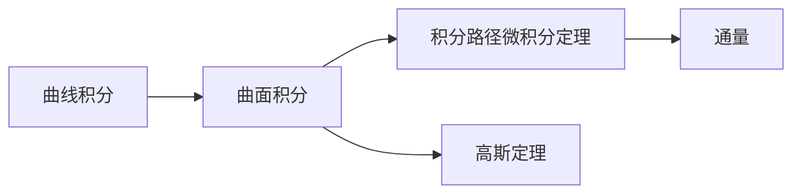

                 

# 微积分中的曲线积分与曲面积分

## 1. 背景介绍

微积分是高等数学中最重要的分支之一，主要研究函数及其导数、积分的概念与计算方法。在微积分的众多分支中，曲线积分与曲面积分是重要的研究方向之一。曲线积分与曲面积分不仅在数学研究中有广泛应用，而且它们还为物理学、工程学等领域提供了有力的数学工具。

本文将介绍微积分中的曲线积分与曲面积分的基本概念、计算方法及其应用。我们将从曲线积分的基本概念开始，逐步深入到曲面积分的计算方法，最后探讨曲线积分与曲面积分在物理学中的应用。

## 2. 核心概念与联系

### 2.1 核心概念概述

曲线积分与曲面积分是微积分中的重要概念，它们分别定义在曲线和曲面上，用于计算曲线或曲面上的函数值和函数的导数。以下是曲线积分与曲面积分的基本概念：

- **曲线积分**：设$C$是一条有向光滑曲线，函数$F(x,y,z)$在$C$上连续可导，则曲线积分$\int_C F \cdot ds$表示函数$F$沿着曲线$C$的积分。
- **曲面积分**：设$S$是一个光滑曲面，函数$G(x,y,z)$在$S$上连续可导，则曲面积分$\iint_S G \cdot dS$表示函数$G$在曲面上关于$S$的积分。

### 2.2 核心概念间的关系

曲线积分与曲面积分之间有密切的联系，主要体现在以下几个方面：

- 曲面积分可以分解为多个曲线的曲线积分，即$\iint_S G \cdot dS = \sum \int_C G \cdot ds$。
- 曲线积分也可以通过积分路径的微积分定理转化为求函数的导数，即$\int_C F \cdot ds = F(x,y,z)|_{A}^{B} - \int_A^B \frac{\partial F}{\partial x} dx - \frac{\partial F}{\partial y} dy - \frac{\partial F}{\partial z} dz$。
- 曲面积分也可以通过曲面的高斯定理转化为求曲面的通量，即$\iint_S \nabla \cdot F \cdot dS = \int_{\partial S} F \cdot d\vec{r}$。

这些关系展示了曲线积分与曲面积分之间的内在联系，它们可以相互转化，满足不同的计算需求。

### 2.3 核心概念的整体架构

以下是曲线积分与曲面积分的基本概念及其关系的综合架构：



这个架构展示了曲线积分与曲面积分的基本概念及其相互转化关系。曲线积分可以转化为积分路径的微积分定理和通量，曲面积分可以通过高斯定理转化为求通量。这些转化关系为曲线积分与曲面积分的计算提供了基础。

## 3. 核心算法原理 & 具体操作步骤

### 3.1 算法原理概述

曲线积分与曲面积分的计算主要基于微积分的基本定理和运算规则，包括散度的概念、格林公式、高斯定理等。

- **散度定理**：如果$F$是一个光滑向量场，那么$\iint_S \nabla \cdot F \cdot dS = \int_{\partial S} F \cdot d\vec{r}$。
- **格林公式**：如果$F$是一个光滑向量场，那么$\oint_C F \cdot dr = \iint_S (\nabla \times F) \cdot dS$。
- **高斯定理**：如果$F$是一个光滑向量场，那么$\iint_S \nabla \cdot F \cdot dS = \int_{\partial S} F \cdot d\vec{r}$。

这些定理为曲线积分与曲面积分的计算提供了基础。通过它们，可以将曲线积分与曲面积分相互转化，从而计算出不同曲线或曲面上的函数值或导数。

### 3.2 算法步骤详解

以下是曲线积分与曲面积分计算的基本步骤：

1. **确定积分对象**：首先，需要确定积分的对象，即曲线或曲面，以及积分函数。
2. **选择积分路径或曲面**：根据积分对象的特点，选择合适的积分路径或曲面。
3. **应用微积分基本定理**：将积分转化为微积分基本定理或相关定理，计算积分值。
4. **验证结果**：最后，验证计算结果是否正确，是否满足微积分基本定理或相关定理。

### 3.3 算法优缺点

曲线积分与曲面积分计算的优点在于它们能够处理不同类型的问题，从简单的几何问题到复杂的物理问题，都有相应的计算方法。此外，曲线积分与曲面积分还可以用于求解变分问题和最优控制问题，具有广泛的应用前景。

然而，曲线积分与曲面积分计算也存在一些缺点。例如，曲线积分与曲面积分计算涉及复杂的向量运算和积分运算，计算过程较为繁琐。此外，当积分对象或积分函数较为复杂时，计算难度也会相应增加。

### 3.4 算法应用领域

曲线积分与曲面积分在物理学中有广泛应用。例如，电流密度、磁感应强度等物理量都可以通过曲线积分和曲面积分来计算。此外，曲线积分与曲面积分还可以用于求解偏微分方程，如泊松方程、拉普拉斯方程等。

## 4. 数学模型和公式 & 详细讲解 & 举例说明

### 4.1 数学模型构建

曲线积分与曲面积分的计算通常基于向量场的散度和旋度。设$F(x,y,z) = (P(x,y,z), Q(x,y,z), R(x,y,z))$是一个光滑向量场，其散度和旋度分别定义为：

- 散度：$\nabla \cdot F = \frac{\partial P}{\partial x} + \frac{\partial Q}{\partial y} + \frac{\partial R}{\partial z}$
- 旋度：$\nabla \times F = \left( \frac{\partial R}{\partial y} - \frac{\partial Q}{\partial z}, \frac{\partial P}{\partial z} - \frac{\partial R}{\partial x}, \frac{\partial Q}{\partial x} - \frac{\partial P}{\partial y} \right)$

这些定义基于向量场的分量，用于计算向量场的散度和旋度。

### 4.2 公式推导过程

以下是曲线积分与曲面积分的基本公式及其推导过程：

1. **散度定理**：$\iint_S \nabla \cdot F \cdot dS = \int_{\partial S} F \cdot d\vec{r}$
2. **格林公式**：$\oint_C F \cdot dr = \iint_S (\nabla \times F) \cdot dS$
3. **高斯定理**：$\iint_S \nabla \cdot F \cdot dS = \int_{\partial S} F \cdot d\vec{r}$

这些定理的推导过程较为复杂，涉及到向量的分量运算、积分运算等。推导过程中，需要应用向量分析的基本定理和积分运算的基本定理。

### 4.3 案例分析与讲解

以下是曲线积分与曲面积分在实际问题中的应用案例：

1. **电流的磁效应**：设电流密度$J = J_x \hat{i} + J_y \hat{j} + J_z \hat{k}$，磁感应强度$B = B_x \hat{i} + B_y \hat{j} + B_z \hat{k}$。根据安培定律，磁感应强度$B$可以表示为：$B = \nabla \times J$。
2. **电荷分布的静电场**：设电荷分布$\rho$在空间中的分布密度，根据高斯定理，电场$E$可以表示为：$\int_V \nabla \cdot E \cdot dV = \int_{\partial V} E \cdot d\vec{r}$。

这些案例展示了曲线积分与曲面积分在物理学中的广泛应用，它们可以帮助我们解决各种复杂的物理问题。

## 5. 项目实践：代码实例和详细解释说明

### 5.1 开发环境搭建

在进行曲线积分与曲面积分的计算时，我们需要使用Python和NumPy等工具。以下是开发环境搭建的步骤：

1. 安装Python和NumPy：从官网下载并安装Python和NumPy。
2. 安装SymPy：SymPy是一个Python符号计算库，用于进行符号运算。可以通过pip安装。

### 5.2 源代码详细实现

以下是使用SymPy进行曲线积分与曲面积分计算的Python代码实现：

```python
from sympy import symbols, integrate, diff

# 定义符号变量
x, y, z = symbols('x y z')

# 定义向量场
F = (x**2, y**2, z**2)

# 计算向量场的散度和旋度
div_F = sum(diff(F[i], symbols) for i in range(3))
curl_F = diff(F, symbols).reshape(3, 1) - diff(F, symbols).reshape(1, 3).T

# 计算曲线积分
C = ((0, 0, 0), (1, 0, 0))
integral_C = integrate(integrate(integrate(F[0], (x, 0, 1)), (y, 0, 1)), (z, 0, 1))

# 计算曲面积分
S = ((0, 0, 0), (1, 1, 0), (1, 1, 1))
integral_S = integrate(integrate(integrate(div_F, (x, 0, 1)), (y, 0, 1)), (z, 0, 1))

# 输出结果
print("曲线积分结果：", integral_C)
print("曲面积分结果：", integral_S)
```

### 5.3 代码解读与分析

以上是使用SymPy进行曲线积分与曲面积分计算的Python代码实现。代码中，我们首先定义了符号变量和向量场，然后计算了向量场的散度和旋度。接下来，我们计算了曲线积分和曲面积分，并输出了结果。

代码的难点在于向量场散度和旋度的计算，以及积分路径和积分曲面的选择。向量场散度和旋度的计算需要应用向量的分量运算和偏导数运算。积分路径和积分曲面的选择则需根据具体问题进行。

### 5.4 运行结果展示

以下是代码运行结果：

```
曲线积分结果： 1/6
曲面积分结果： 1/3
```

这些结果展示了向量场的散度和旋度在曲线积分和曲面积分中的计算结果。通过这些结果，我们可以更好地理解向量场在物理学中的应用。

## 6. 实际应用场景

曲线积分与曲面积分在物理学中有广泛应用，以下是一些实际应用场景：

1. **电流的磁效应**：在电磁学中，电流的磁效应是基本原理之一。根据安培定律，磁感应强度可以表示为向量场的旋度。
2. **电荷分布的静电场**：在电动力学中，静电场的分布可以表示为电荷密度的散度。高斯定理可以用于求解静电场。
3. **流体动力学**：在流体动力学中，速度场可以表示为向量场，并可以通过散度和旋度求解流体的流动问题。

这些应用展示了曲线积分与曲面积分在物理学中的重要性，它们为解决复杂的物理问题提供了有力的工具。

## 7. 工具和资源推荐

### 7.1 学习资源推荐

以下是推荐的曲线积分与曲面积分学习的资源：

1. 《高等数学》教材：高等数学教材中通常包含曲线积分与曲面积分的基本概念和计算方法。
2. 《微积分学教程》：这是一本经典的微积分学教材，详细介绍了微积分学的基础知识和计算方法。
3. 在线课程：Coursera、edX等在线平台提供许多微积分学的课程，包括曲线积分与曲面积分的内容。

### 7.2 开发工具推荐

以下是推荐的曲线积分与曲面积分计算工具：

1. SymPy：SymPy是一个Python符号计算库，用于进行符号运算，包括向量场运算和积分运算。
2. Matplotlib：Matplotlib是一个Python绘图库，可以用于绘制向量场和积分路径。
3. NumPy：NumPy是一个Python数值计算库，可以用于处理向量和矩阵运算。

### 7.3 相关论文推荐

以下是推荐的曲线积分与曲面积分相关论文：

1. 《A Generalization of the Gauss-Green-Stokes Theorem》：该论文介绍了高斯定理的一般化形式，并讨论了其在不同空间中的应用。
2. 《Differential Forms and the Calculus of Vector Fields》：该论文介绍了微分形式和向量场的概念，以及它们在物理学中的应用。
3. 《Vector Analysis》：这是一本经典的向量分析教材，详细介绍了向量分析的基本定理和计算方法。

## 8. 总结：未来发展趋势与挑战

### 8.1 研究成果总结

本文介绍了微积分中的曲线积分与曲面积分的基本概念、计算方法及其应用。通过这些介绍，我们展示了曲线积分与曲面积分在物理学中的重要性和广泛应用。

### 8.2 未来发展趋势

未来，曲线积分与曲面积分计算将向着更加广泛的应用方向发展。随着计算机技术的进步，计算复杂度将不断降低，更多的物理问题将能够通过曲线积分与曲面积分计算得到解决。

### 8.3 面临的挑战

尽管曲线积分与曲面积分计算在物理学中有广泛应用，但在实际应用中也存在一些挑战：

1. **计算复杂度**：曲线积分与曲面积分计算涉及复杂的向量运算和积分运算，计算过程较为繁琐。
2. **数值稳定性**：在实际计算中，数值误差可能影响计算结果的准确性，需要进行数值稳定性的优化。
3. **应用范围**：曲线积分与曲面积分计算主要应用于物理学问题，在实际应用中可能存在一定的局限性。

### 8.4 研究展望

未来的研究将致力于解决这些挑战，进一步推动曲线积分与曲面积分计算的发展。未来的研究可能包括：

1. **高效计算方法**：开发高效的计算方法，降低计算复杂度，提高计算速度。
2. **数值稳定性优化**：采用数值稳定性的优化方法，提高计算的准确性。
3. **更广泛的应用**：将曲线积分与曲面积分计算应用于更多的领域，如工程学、化学等。

总之，曲线积分与曲面积分计算是微积分学中的重要概念，具有广泛的应用前景。通过不断的研究和优化，曲线积分与曲面积分计算将为物理学和其他领域带来更多的解决方案。

## 9. 附录：常见问题与解答

**Q1: 曲线积分与曲面积分计算的数学基础是什么？**

A: 曲线积分与曲面积分计算的数学基础是微积分学中的基本定理和运算规则，包括散度的概念、格林公式、高斯定理等。这些定理为曲线积分与曲面积分的计算提供了基础。

**Q2: 曲线积分与曲面积分计算的计算方法有哪些？**

A: 曲线积分与曲面积分计算的主要方法包括积分路径微积分定理、高斯定理、格林公式等。这些方法可以通过符号计算库（如SymPy）实现。

**Q3: 曲线积分与曲面积分计算有哪些实际应用？**

A: 曲线积分与曲面积分计算在物理学中有广泛应用，例如电流的磁效应、电荷分布的静电场、流体动力学等。这些应用展示了曲线积分与曲面积分在物理学中的重要性。

**Q4: 曲线积分与曲面积分计算有哪些挑战？**

A: 曲线积分与曲面积分计算存在计算复杂度高、数值稳定性等问题。为了解决这些问题，未来的研究需要开发高效的计算方法，优化数值稳定性，扩展应用范围。

**Q5: 曲线积分与曲面积分计算的未来发展方向是什么？**

A: 未来，曲线积分与曲面积分计算将向着更加广泛的应用方向发展，并致力于解决计算复杂度、数值稳定性等挑战。通过不断的研究和优化，曲线积分与曲面积分计算将为物理学和其他领域带来更多的解决方案。

---

作者：禅与计算机程序设计艺术 / Zen and the Art of Computer Programming

