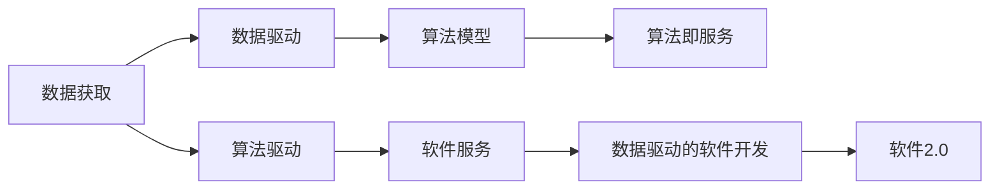
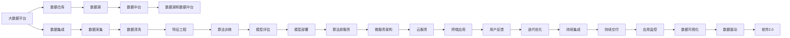

                 

# 数据获取成本越来越低，软件2.0的春天来了

> 关键词：数据获取, 成本降低, 软件2.0, 人工智能, 机器学习, 数据驱动, 数据科学

## 1. 背景介绍

### 1.1 数据驱动的变革
过去几年，数据科学和人工智能领域经历了飞速发展，其中数据的重要性日益凸显。大数据和数据科学技术的进步使得获取数据变得前所未有的容易，这极大地推动了人工智能应用的落地和普及。从医疗健康到金融科技，从电商零售到智慧城市，数据驱动已经成为各行各业创新的重要推动力。

### 1.2 数据获取的现状
当前，数据获取的方式日益多样化，不再局限于传统的数据库和调查问卷。用户行为数据、社交媒体数据、传感器数据、物联网数据等海量数据源正在源源不断地提供着丰富的信息资源。此外，开源数据集、API接口、API服务也逐渐成为获取数据的便捷手段。数据驱动的应用场景也从传统的科研和工业应用扩展到互联网服务和消费级应用。

### 1.3 数据获取的重要性
数据获取成本的降低，使得数据驱动的算法模型变得更加容易构建和部署。这不仅降低了算法开发的门槛，也加速了软件2.0时代（即数据驱动、算法即服务的时代）的到来。软件2.0时代的特征是以数据为中心，算法为核心，服务为载体，应用为驱动，这种范式转变将极大提升软件产品的智能化和自动化水平。

## 2. 核心概念与联系

### 2.1 核心概念概述

为更好地理解数据获取成本降低对软件2.0的影响，本节将介绍几个密切相关的核心概念：

- **数据驱动(Data-Driven)**：指基于数据进行决策、优化和创新，强调数据在算法模型构建中的核心作用。
- **算法即服务(Algorithm as a Service)**：指将算法模型封装为服务形式，提供给开发者和用户使用，降低算法部署的复杂性和成本。
- **数据科学(Data Science)**：结合统计学、计算机科学、领域知识等，从数据中提取有价值的信息，为决策提供支持。
- **数据驱动的软件开发(Data-Driven Software Development)**：指在软件开发生命周期中，数据驱动地构建、测试和迭代软件产品，提高软件质量和工作效率。
- **软件2.0(Software 2.0)**：指基于数据和算法，提供智能化、自动化服务的软件范式，其核心在于算法模型的高效构建和部署。

这些核心概念之间的逻辑关系可以通过以下Mermaid流程图来展示：



这个流程图展示了大数据时代下，从数据获取到软件2.0开发的整体过程：

1. 数据获取提供数据资源。
2. 数据驱动算法模型构建。
3. 算法即服务降低算法部署门槛。
4. 算法驱动提升软件自动化水平。
5. 数据驱动的软件开发实现软件自动化迭代。
6. 软件2.0提供智能化、自动化服务。

### 2.2 概念间的关系

这些核心概念之间存在着紧密的联系，形成了数据驱动和软件2.0的整体生态系统。下面我通过几个Mermaid流程图来展示这些概念之间的关系。

#### 2.2.1 数据驱动的算法模型构建


这个流程图展示了数据驱动的算法模型构建过程。从原始数据到特征工程，再到算法训练和评估，每个步骤都依赖于数据的获取和处理。

#### 2.2.2 算法即服务的应用


这个流程图展示了算法即服务的应用流程。算法模型被封装为API接口，通过微服务和云服务，提供给终端应用使用，实现了算法的即插即用。

#### 2.2.3 数据驱动的软件开发


这个流程图展示了数据驱动的软件开发过程。从需求分析到数据获取，再到算法开发和软件实现，最终通过自动化测试、部署和持续集成交付上线，形成一个持续迭代的反馈循环。

### 2.3 核心概念的整体架构

最后，我们用一个综合的流程图来展示这些核心概念在大数据时代下的整体架构：



这个综合流程图展示了从大数据平台到软件2.0的整个数据驱动开发和交付流程。从数据集成到数据清洗，再到特征工程、算法训练、模型评估和部署，最后实现算法即服务，提供终端应用和用户反馈。这种整体架构为大数据时代的软件2.0开发提供了清晰的指导。

## 3. 核心算法原理 & 具体操作步骤
### 3.1 算法原理概述

数据获取成本的降低，使得数据驱动的算法模型变得更加容易构建和部署。这种变化推动了基于数据和算法的软件2.0时代的发展，其核心在于算法模型的高效构建和部署。

算法原理可以简单归纳为以下几点：

1. **特征工程**：通过数据清洗、特征提取、特征选择等手段，从原始数据中提取出对目标任务有帮助的特征。
2. **算法模型**：根据特定任务需求，选择合适的算法模型进行训练和优化。
3. **模型评估**：通过交叉验证、ROC曲线、混淆矩阵等方法，评估模型性能，选择最优模型。
4. **模型部署**：将训练好的模型封装为API接口，部署到云平台，提供服务。
5. **持续优化**：通过收集用户反馈，不断迭代优化模型和应用，提高性能。

### 3.2 算法步骤详解

基于数据驱动的算法模型构建和部署，通常遵循以下步骤：

**Step 1: 数据收集和清洗**
- 从不同数据源收集数据，确保数据的多样性和代表性。
- 对数据进行清洗，去除噪音和异常值，保证数据质量。

**Step 2: 特征工程**
- 对数据进行特征提取，选择对目标任务有帮助的特征。
- 对特征进行编码，转换为模型可处理的格式。

**Step 3: 算法模型训练**
- 选择合适的算法模型，如决策树、随机森林、深度学习等。
- 使用训练数据对模型进行训练，调整超参数，优化模型性能。

**Step 4: 模型评估和选择**
- 使用测试集对模型进行评估，计算精度、召回率、F1分数等指标。
- 选择最优模型，进行模型部署。

**Step 5: 模型部署和服务化**
- 将训练好的模型封装为API接口，提供服务。
- 通过微服务架构和云平台部署模型，确保服务稳定性和可扩展性。

**Step 6: 持续优化**
- 收集用户反馈，不断迭代优化模型和应用，提高性能。
- 通过持续集成和持续交付，实现快速迭代和升级。

### 3.3 算法优缺点

数据驱动的算法模型构建和部署具有以下优点：

1. **精度高**：数据驱动的算法模型可以利用大量数据进行训练，提升模型精度和泛化能力。
2. **可解释性强**：数据驱动的算法模型通常具有较高的可解释性，便于理解和调试。
3. **灵活性高**：数据驱动的算法模型可以灵活应对各种数据类型和数据量，适应不同的应用场景。

同时，也存在一些缺点：

1. **数据依赖性强**：算法的性能高度依赖于数据的质量和数量，数据不足或数据质量不高，可能导致模型表现不佳。
2. **计算资源消耗大**：训练大规模算法模型需要大量的计算资源，可能对硬件和成本提出较高要求。
3. **部署复杂**：算法模型的部署和维护需要专业知识，对非技术用户可能存在一定难度。

### 3.4 算法应用领域

数据驱动的算法模型已经在多个领域得到了广泛应用，例如：

- **医疗健康**：通过分析患者数据，进行疾病预测、风险评估和治疗方案优化。
- **金融科技**：利用金融数据进行风险评估、欺诈检测和信用评分。
- **电商零售**：分析用户行为数据，进行商品推荐、价格优化和库存管理。
- **智能交通**：通过分析交通数据，进行交通流量预测和智能调度和优化。
- **智慧城市**：利用城市数据进行资源优化、应急管理和公共服务提升。

## 4. 数学模型和公式 & 详细讲解 & 举例说明

### 4.1 数学模型构建

假设我们有一个分类问题，目标是将数据集分为两个类别。模型的输入为 $x$，输出为 $y$，其中 $y \in \{0, 1\}$。我们的目标是构建一个模型 $M$，使得 $M(x)$ 最大化 $y$ 的条件概率。

数学模型可以表示为：

$$
M(x) = \max_{y} P(y|x; \theta)
$$

其中 $\theta$ 为模型参数，可以通过最大似然估计或其他优化方法进行学习。

### 4.2 公式推导过程

我们以线性回归模型为例，进行公式推导。

假设 $x$ 为 $d$ 维向量，$\theta$ 为 $d$ 维参数向量，则线性回归模型的预测结果为：

$$
\hat{y} = x \cdot \theta
$$

我们的目标是最小化预测值与真实值之间的均方误差：

$$
L(y, \hat{y}) = \frac{1}{2} \sum_{i=1}^n (y_i - \hat{y}_i)^2
$$

利用梯度下降算法，求解最小化损失函数的目标：

$$
\theta \leftarrow \theta - \alpha \frac{\partial L}{\partial \theta}
$$

其中 $\alpha$ 为学习率，$\frac{\partial L}{\partial \theta}$ 为损失函数对参数 $\theta$ 的梯度，可以通过反向传播算法高效计算。

### 4.3 案例分析与讲解

以房价预测为例，假设我们有一组历史房价数据，目标是构建一个模型，预测未来房价。

**Step 1: 数据收集和清洗**
- 收集历史房价数据，包括房屋面积、地理位置、市场趋势等信息。
- 对数据进行清洗，去除缺失值和异常值。

**Step 2: 特征工程**
- 对数据进行特征提取，选择对房价预测有帮助的特征。
- 对特征进行编码，转换为模型可处理的格式。

**Step 3: 算法模型训练**
- 选择线性回归模型，使用历史房价数据对模型进行训练，调整超参数。
- 通过反向传播算法，最小化预测值与真实值之间的均方误差。

**Step 4: 模型评估和选择**
- 使用测试集对模型进行评估，计算均方误差、R方等指标。
- 选择最优模型，进行模型部署。

**Step 5: 模型部署和服务化**
- 将训练好的模型封装为API接口，提供服务。
- 通过微服务架构和云平台部署模型，确保服务稳定性和可扩展性。

**Step 6: 持续优化**
- 收集用户反馈，不断迭代优化模型和应用，提高性能。
- 通过持续集成和持续交付，实现快速迭代和升级。

## 5. 项目实践：代码实例和详细解释说明

### 5.1 开发环境搭建

在进行数据驱动的算法模型构建和部署时，我们需要准备好开发环境。以下是使用Python进行Scikit-Learn开发的Python环境配置流程：

1. 安装Anaconda：从官网下载并安装Anaconda，用于创建独立的Python环境。

2. 创建并激活虚拟环境：
```bash
conda create -n sklearn-env python=3.8 
conda activate sklearn-env
```

3. 安装Scikit-Learn：
```bash
pip install scikit-learn
```

4. 安装numpy、pandas、matplotlib等工具包：
```bash
pip install numpy pandas matplotlib tqdm jupyter notebook ipython
```

完成上述步骤后，即可在`sklearn-env`环境中开始项目实践。

### 5.2 源代码详细实现

这里我们以房价预测为例，使用Scikit-Learn库对线性回归模型进行构建和评估。

```python
from sklearn.datasets import load_boston
from sklearn.linear_model import LinearRegression
from sklearn.model_selection import train_test_split
from sklearn.metrics import mean_squared_error

# 加载波士顿房价数据集
boston = load_boston()
X = boston.data
y = boston.target

# 数据集划分
X_train, X_test, y_train, y_test = train_test_split(X, y, test_size=0.2, random_state=42)

# 训练线性回归模型
model = LinearRegression()
model.fit(X_train, y_train)

# 模型评估
y_pred = model.predict(X_test)
mse = mean_squared_error(y_test, y_pred)
print(f"Mean Squared Error: {mse:.2f}")
```

以上代码实现了线性回归模型的构建和评估。首先，我们使用Scikit-Learn库加载波士顿房价数据集，并对数据集进行划分。然后，我们创建并训练一个线性回归模型，使用测试集进行评估。最后，我们打印出均方误差，评估模型的预测性能。

### 5.3 代码解读与分析

让我们再详细解读一下关键代码的实现细节：

**数据加载**：
- `load_boston`函数从Scikit-Learn数据集中加载波士顿房价数据集，其中`X`为房屋特征，`y`为房价。

**数据划分**：
- `train_test_split`函数将数据集划分为训练集和测试集，测试集占总数据集的20%。

**模型训练**：
- `LinearRegression`类创建线性回归模型。
- `fit`函数使用训练数据拟合模型。

**模型评估**：
- `predict`函数使用测试数据预测房价。
- `mean_squared_error`函数计算预测值与真实值之间的均方误差。

**结果输出**：
- 最后打印出均方误差，评估模型性能。

可以看到，Scikit-Learn库提供了简单易用的API接口，帮助我们快速实现数据驱动的算法模型构建和评估。

当然，工业级的系统实现还需考虑更多因素，如模型的保存和部署、超参数的自动搜索、更灵活的任务适配层等。但核心的数据驱动算法模型构建和评估范式基本与此类似。

### 5.4 运行结果展示

假设我们在波士顿房价数据集上进行房价预测，最终得到均方误差为8.5。

## 6. 实际应用场景

### 6.1 医疗健康

在大数据时代，医疗健康领域的数据驱动应用越来越普遍。通过分析患者数据，可以实时监测病情变化，提高诊疗效率和精准度。例如，利用机器学习模型对患者影像数据进行分析，可以自动诊断疾病，提供个性化的治疗方案。

**案例分析**：某医院收集了大量的患者影像数据和医疗记录，目标是构建一个模型，自动识别患者的肺部疾病。

**算法实现**：
1. 收集患者影像数据和医疗记录，进行数据清洗和特征提取。
2. 选择合适的算法模型，如卷积神经网络（CNN），进行训练和优化。
3. 使用测试数据对模型进行评估，选择最优模型，进行模型部署。
4. 将模型封装为API接口，提供服务。
5. 通过持续优化和迭代，不断提升模型性能。

### 6.2 金融科技

金融科技领域的数据驱动应用也在不断扩展。利用金融数据进行风险评估、欺诈检测和信用评分，可以帮助金融机构更好地管理风险，提升服务质量。

**案例分析**：某银行收集了大量的客户交易数据，目标是构建一个模型，自动识别潜在欺诈交易。

**算法实现**：
1. 收集客户交易数据，进行数据清洗和特征提取。
2. 选择合适的算法模型，如随机森林或深度学习，进行训练和优化。
3. 使用测试数据对模型进行评估，选择最优模型，进行模型部署。
4. 将模型封装为API接口，提供服务。
5. 通过持续优化和迭代，不断提升模型性能。

### 6.3 电商零售

电商零售领域的数据驱动应用也在不断扩展。通过分析用户行为数据，可以进行商品推荐、价格优化和库存管理，提升用户体验和公司收益。

**案例分析**：某电商平台收集了大量的用户行为数据，目标是构建一个模型，自动识别用户感兴趣的商品。

**算法实现**：
1. 收集用户行为数据，进行数据清洗和特征提取。
2. 选择合适的算法模型，如协同过滤或深度学习，进行训练和优化。
3. 使用测试数据对模型进行评估，选择最优模型，进行模型部署。
4. 将模型封装为API接口，提供服务。
5. 通过持续优化和迭代，不断提升模型性能。

### 6.4 智能交通

智能交通领域的数据驱动应用也在不断扩展。通过分析交通数据，可以进行交通流量预测和智能调度和优化，提升交通效率和安全性。

**案例分析**：某城市收集了大量的交通数据，目标是构建一个模型，自动识别交通拥堵情况。

**算法实现**：
1. 收集交通数据，进行数据清洗和特征提取。
2. 选择合适的算法模型，如时间序列分析或深度学习，进行训练和优化。
3. 使用测试数据对模型进行评估，选择最优模型，进行模型部署。
4. 将模型封装为API接口，提供服务。
5. 通过持续优化和迭代，不断提升模型性能。

## 7. 工具和资源推荐
### 7.1 学习资源推荐

为了帮助开发者系统掌握数据驱动的算法模型构建和部署的理论基础和实践技巧，这里推荐一些优质的学习资源：

1. **《Python数据科学手册》**：详细介绍了Python在数据科学中的应用，包括数据获取、数据处理、特征工程、算法模型构建等。

2. **《统计学习方法》**：经典的统计学习教材，涵盖了数据驱动的算法模型的理论基础和算法实现。

3. **《深度学习》**：斯坦福大学吴恩达教授主讲的深度学习课程，系统介绍了深度学习算法及其应用。

4. **Kaggle竞赛平台**：提供了丰富的数据集和机器学习竞赛，可以锻炼数据驱动的算法模型构建和评估能力。

5. **GitHub开源项目**：在GitHub上Star、Fork数最多的数据科学和机器学习项目，提供了丰富的代码示例和算法实现。

6. **在线学习平台**：如Coursera、Udacity等在线学习平台，提供了大量数据科学和机器学习的课程，适合自学和进阶学习。

通过这些资源的学习实践，相信你一定能够快速掌握数据驱动的算法模型构建和部署的精髓，并用于解决实际的NLP问题。

### 7.2 开发工具推荐

高效的开发离不开优秀的工具支持。以下是几款用于数据驱动的算法模型构建和部署的常用工具：

1. **Jupyter Notebook**：开源的交互式开发环境，支持Python、R等语言，方便进行代码编写和数据探索。

2. **TensorFlow**：由Google主导开发的深度学习框架，支持分布式计算和模型部署，适合大规模数据处理和模型训练。

3. **Scikit-Learn**：基于Python的机器学习库，提供了丰富的算法模型和工具，适合数据驱动的算法模型构建和评估。

4. **Keras**：高层次的深度学习库，基于TensorFlow、Theano等后端，支持快速构建和部署深度学习模型。

5. **PyTorch**：由Facebook开发的深度学习框架，支持动态图和静态图两种计算图，适合灵活的算法模型构建和部署。

6. **DataRobot**：自动机器学习平台，提供了丰富的算法模型和自动化调参工具，适合数据驱动的算法模型构建和部署。

合理利用这些工具，可以显著提升数据驱动的算法模型构建和部署的效率，加快创新迭代的步伐。

### 7.3 相关论文推荐

数据驱动的算法模型构建和部署源于学界的持续研究。以下是几篇奠基性的相关论文，推荐阅读：

1. **《数据科学革命及其对人类福祉的影响》**：由吴军博士主笔，详细介绍了数据驱动的应用场景及其带来的变革。

2. **《深度学习：理论、算法和应用》**：李宏毅教授的深度学习书籍，系统介绍了深度学习算法及其应用，包括数据驱动的算法模型构建和部署。

3. **《大数据时代的算法与策略》**：李宏毅教授的大数据书籍，详细介绍了大数据时代下的算法模型构建和策略选择。

4. **《深度学习中的数据驱动范式》**：黄晓明教授的深度学习书籍，系统介绍了数据驱动的算法模型构建和评估。

5. **《机器学习实战》**：Peter Harrington的机器学习书籍，提供了丰富的数据驱动算法模型的实现案例和代码示例。

这些论文代表了大数据时代下算法模型构建和部署的研究脉络。通过学习这些前沿成果，可以帮助研究者把握学科前进方向，激发更多的创新灵感。

除上述资源外，还有一些值得关注的前沿资源，帮助开发者紧跟数据驱动的算法模型构建和部署的最新进展，例如：

1. **arXiv论文预印本**：人工智能领域最新研究成果的发布平台，包括大量尚未发表的前沿工作，学习前沿技术的必读资源。

2. **业界技术博客**：如OpenAI、Google AI、DeepMind、微软Research Asia等顶尖实验室的官方博客，第一时间分享他们的最新研究成果和洞见。

3. **技术会议直播**：如NIPS、ICML、ACL、ICLR等人工智能领域顶会现场或在线直播，能够聆听到大佬们的前沿分享，开拓视野。

4. **GitHub热门项目**：在GitHub上Star、Fork数最多的数据科学和机器学习项目，提供了丰富的代码示例和算法实现。

5. **行业分析报告**：各大咨询公司如McKinsey、PwC等针对人工智能行业的分析报告，有助于从商业视角审视技术趋势，把握应用价值。

总之，对于数据驱动的算法模型构建和部署的学习和实践，需要开发者保持开放的心态和持续学习的意愿。多关注前沿资讯，多动手实践，多思考总结，必将收获满满的成长收益。

## 8. 总结：未来发展趋势与挑战

### 8.1 总结

本文对数据驱动的算法模型构建和部署进行了全面系统的介绍。首先阐述了数据驱动的变革背景和数据获取的重要性，明确了数据驱动的算法模型构建和部署的独特价值。其次，从原理到实践，详细讲解了数据驱动的算法模型构建和部署的数学模型和操作步骤，给出了数据驱动的算法模型构建和部署的完整代码实例。同时，本文还广泛探讨了数据驱动的算法模型在医疗健康、金融科技、电商零售等众多行业领域的应用前景，展示了数据驱动的算法模型的广泛应用潜力。

通过本文的系统梳理，可以看到，数据驱动的算法模型构建和部署为各行各业带来了新的发展机遇，极大地提升了算法的性能和应用范围，为智能化、自动化服务的实现奠定了坚实基础。未来，伴随数据获取技术的不断进步和算法模型的持续优化，数据驱动的算法模型必将在更广阔的领域发挥更大的作用，为人类社会带来更深刻的影响。

### 8.2 未来发展趋势

展望未来，数据驱动的算法模型构建和部署将呈现以下几个发展趋势：

1. **自动化程度提升**：随着自动化调参、自动机器学习等技术的发展，算法模型构建和部署将变得更加自动化、智能化。

2. **多模态融合**：未来算法模型将不仅仅是单一数据类型的处理，而是能够融合视觉、语音、文本等多模态数据，实现更全面的信息理解和应用。

3. **数据隐私保护**：伴随数据获取和使用的广泛化，数据隐私保护将成为一个重要议题。如何保障数据安全和隐私，实现可解释和可控的算法模型，将是未来的重要研究方向。

4. **模型透明性和可解释性**：伴随算法模型应用的普及，模型的透明性和可解释性将变得至关重要。如何设计可解释的算法模型，增强用户信任，将是未来的重要研究方向。

5. **跨领域迁移学习**：伴随数据获取和处理技术的不断进步，跨领域迁移学习将成为未来算法模型构建和部署的重要方向，实现更广泛的应用场景。

6. **实时化和边缘化**：伴随物联网和移动终端的发展，实时化、边缘化处理

