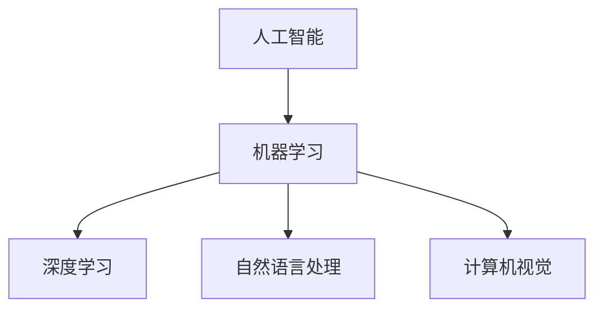

                 

# 创业者在AI浪潮中的机会

在人工智能（AI）日益成为全球技术变革的主导力量的今天，创业者们面临前所未有的机遇与挑战。AI不仅在重塑各行各业的业务模式和运营方式，也为新兴企业提供了进入市场的切入点。本文将深入探讨创业者在AI浪潮中的机会，揭示如何利用AI技术打造创新产品、开拓新市场，并分享实践中的一些关键经验和教训。

## 1. 背景介绍

### 1.1 人工智能技术的迅猛发展

过去几十年来，人工智能技术经历了快速的发展和突破。从最初的专家系统、机器学习到深度学习、自然语言处理、计算机视觉等领域的深度创新，AI技术在算法、模型和应用场景上都有了显著提升。特别是近年来，深度学习、大数据和计算资源的结合，使得AI模型在图像识别、语音识别、自然语言处理等领域实现了近乎人类的表现，甚至在某些领域超越了人类。

### 1.2 创业环境的变化

随着AI技术的普及和应用，创业环境也发生了深刻的变化。传统的创业领域如金融、医疗、零售等行业开始大规模引入AI技术，这为创业者提供了丰富的创业机会。AI技术不仅能够提高产品效率，降低运营成本，还能够挖掘新的商业模式，创造出全新的市场机会。

### 1.3 AI创业的机遇

AI技术的发展为创业者提供了两大核心机遇：

1. **创新产品的开发**：利用AI技术开发创新性产品，解决传统行业中的痛点和问题，提升用户体验。
2. **新市场的开拓**：利用AI技术重新定义市场规则，进入现有市场的新领域，发现新的客户群体。

## 2. 核心概念与联系

### 2.1 核心概念概述

在探讨创业者在AI浪潮中的机会时，我们需要理解几个核心概念：

- **人工智能（AI）**：通过算法和模型，使计算机系统具备类似人类的智能行为。
- **机器学习（ML）**：让计算机通过数据学习和优化算法，以实现特定任务的能力。
- **深度学习（DL）**：一种基于神经网络的机器学习方法，模拟人类大脑的神经网络结构，用于图像、语音、自然语言处理等领域的任务。
- **自然语言处理（NLP）**：使计算机能够理解和处理人类语言的技术。
- **计算机视觉（CV）**：使计算机能够“看”和“理解”图像和视频的技术。

### 2.2 概念间的关系

这些核心概念之间有着密切的联系，通过以下Mermaid流程图来展示：



这个流程图展示了AI技术的核心组成部分及其相互关系：

- 人工智能（AI）是包括机器学习（ML）、深度学习（DL）、自然语言处理（NLP）和计算机视觉（CV）等多个子领域的大概念。
- 机器学习是AI技术的核心，通过数据驱动的算法优化，使计算机具备学习能力。
- 深度学习是机器学习的一种高级形式，通过多层神经网络模拟人类大脑，实现了更复杂的任务处理。
- 自然语言处理和计算机视觉则是机器学习在语言和图像处理领域的两个重要应用。

这些概念共同构成了AI技术的体系，为创业者提供了丰富的技术工具和创新点。

## 3. 核心算法原理 & 具体操作步骤

### 3.1 算法原理概述

创业者在利用AI技术时，通常需要掌握以下核心算法原理：

- **监督学习（Supervised Learning）**：利用有标签的数据训练模型，使模型能够预测新数据的标签。
- **无监督学习（Unsupervised Learning）**：使用无标签的数据训练模型，发现数据中的隐藏结构和规律。
- **强化学习（Reinforcement Learning）**：通过与环境的交互，让模型学习最优决策策略。
- **生成对抗网络（GANs）**：由两个神经网络组成，一个生成器生成样本，一个判别器评估生成样本的真实性，通过对抗训练提升生成质量。

### 3.2 算法步骤详解

创业者在应用AI技术时，一般需要遵循以下步骤：

1. **问题定义**：明确要解决的问题和目标，确定问题的类型和数据需求。
2. **数据收集与处理**：收集相关数据，并进行清洗、标注、预处理等操作，确保数据质量。
3. **模型选择与训练**：选择合适的模型架构和算法，训练模型并优化超参数。
4. **模型评估与优化**：使用测试数据集评估模型性能，根据评估结果进行模型调优。
5. **部署与集成**：将训练好的模型部署到生产环境，与其他系统集成，实现产品化应用。

### 3.3 算法优缺点

- **优点**：
  - **高效率**：AI算法能够处理大规模数据，提高工作效率。
  - **高精度**：在特定任务上，AI算法能够实现比传统方法更高的准确率。
  - **自适应性**：AI算法能够根据数据的变化进行自适应调整，提升应用效果。

- **缺点**：
  - **数据依赖**：AI算法需要大量高质量的数据进行训练，数据获取和标注成本较高。
  - **模型复杂**：AI模型通常较复杂，训练和部署难度较大。
  - **解释性差**：AI模型往往是“黑盒”模型，难以解释其内部决策过程。

### 3.4 算法应用领域

AI技术在多个领域都有广泛的应用，以下是几个典型的应用场景：

- **医疗健康**：AI在医学影像分析、疾病诊断、个性化治疗等领域具有巨大潜力，可以提升医疗服务水平。
- **金融服务**：AI在风险评估、欺诈检测、投资决策等领域能够提供更准确的分析结果。
- **智能制造**：AI在生产流程优化、设备维护、供应链管理等方面可以提高生产效率，降低成本。
- **教育培训**：AI在智能教学、学习分析、个性化推荐等领域能够提升教育质量，优化学习体验。
- **零售电商**：AI在客户行为分析、推荐系统、库存管理等方面能够提高运营效率，增强用户体验。

## 4. 数学模型和公式 & 详细讲解 & 举例说明

### 4.1 数学模型构建

在AI应用中，数学模型起着核心作用。以下是几个典型的数学模型：

- **线性回归模型**：用于预测连续数值，公式为：
  $$
  y = \beta_0 + \beta_1x_1 + \beta_2x_2 + \cdots + \beta_nx_n
  $$
  其中 $y$ 为预测值，$x_1, x_2, \cdots, x_n$ 为输入特征，$\beta_0, \beta_1, \cdots, \beta_n$ 为模型参数。

- **决策树模型**：用于分类问题，通过树形结构将数据划分为多个子集，公式为：
  $$
  T = \{(x_i, y_i) | x_i \in R^n, y_i \in \{1, 2, \cdots, k\}, i \in [1, m]\}
  $$
  其中 $T$ 为决策树，$(x_i, y_i)$ 为训练数据，$m$ 为数据量，$k$ 为分类数。

- **卷积神经网络（CNN）**：用于图像识别任务，公式为：
  $$
  y = W^{(l)} * x^{(l-1)} + b^{(l)}
  $$
  其中 $W^{(l)}$ 为权重矩阵，$x^{(l-1)}$ 为输入，$b^{(l)}$ 为偏置项，$l$ 为层数。

### 4.2 公式推导过程

以下以线性回归模型为例，推导其梯度下降算法的公式：

设损失函数为 $L(\theta)$，其中 $\theta$ 为模型参数。则梯度下降算法的公式为：
$$
\theta_j = \theta_j - \alpha \frac{\partial L(\theta)}{\partial \theta_j}
$$
其中 $\alpha$ 为学习率。

### 4.3 案例分析与讲解

以图像识别为例，利用CNN模型进行图像分类。步骤如下：

1. 收集大量标注图像数据。
2. 将图像数据转化为网络输入形式。
3. 构建多层卷积和池化层，提取图像特征。
4. 通过全连接层将特征映射到输出类别。
5. 使用softmax函数将输出转化为概率分布。
6. 通过交叉熵损失函数计算模型与真实标签的差距。
7. 使用梯度下降算法优化模型参数，最小化损失函数。

## 5. 项目实践：代码实例和详细解释说明

### 5.1 开发环境搭建

在进行AI项目开发前，需要搭建好开发环境。以下是Python环境下常用的开发工具：

- **Python**：AI开发的主流语言，易于使用且生态丰富。
- **Jupyter Notebook**：交互式编程环境，支持代码块、绘图、代码执行等。
- **PyTorch**：深度学习框架，支持动态计算图和GPU加速。
- **TensorFlow**：深度学习框架，支持分布式计算和移动端部署。
- **Keras**：高级深度学习框架，提供了简单易用的API。

### 5.2 源代码详细实现

以下是一个简单的Python代码实例，用于图像分类：

```python
import torch
import torch.nn as nn
import torch.optim as optim
from torchvision import datasets, transforms

# 定义模型
class Net(nn.Module):
    def __init__(self):
        super(Net, self).__init__()
        self.conv1 = nn.Conv2d(3, 6, 5)
        self.pool = nn.MaxPool2d(2, 2)
        self.conv2 = nn.Conv2d(6, 16, 5)
        self.fc1 = nn.Linear(16 * 5 * 5, 120)
        self.fc2 = nn.Linear(120, 84)
        self.fc3 = nn.Linear(84, 10)

    def forward(self, x):
        x = self.pool(F.relu(self.conv1(x)))
        x = self.pool(F.relu(self.conv2(x)))
        x = x.view(-1, 16 * 5 * 5)
        x = F.relu(self.fc1(x))
        x = F.relu(self.fc2(x))
        x = self.fc3(x)
        return x

# 加载数据
train_loader = torch.utils.data.DataLoader(
    datasets.MNIST('data', train=True, download=True,
                   transform=transforms.ToTensor()),
    batch_size=64, shuffle=True)

# 定义模型和优化器
net = Net()
optimizer = optim.SGD(net.parameters(), lr=0.001, momentum=0.9)

# 训练模型
for epoch in range(10):
    running_loss = 0.0
    for i, data in enumerate(train_loader, 0):
        inputs, labels = data
        optimizer.zero_grad()
        outputs = net(inputs)
        loss = nn.CrossEntropyLoss()(outputs, labels)
        loss.backward()
        optimizer.step()
        running_loss += loss.item()
        if i % 2000 == 1999:
            print('[%d, %5d] loss: %.3f' %
                  (epoch + 1, i + 1, running_loss / 2000))
            running_loss = 0.0

print('Finished Training')
```

### 5.3 代码解读与分析

以上代码展示了使用PyTorch进行图像分类的简单实现。具体步骤如下：

1. 定义卷积神经网络模型。
2. 加载训练数据，并进行预处理。
3. 定义优化器和损失函数。
4. 训练模型，每2000个batch输出一次损失函数。

## 6. 实际应用场景

### 6.1 医疗影像分析

在医疗影像分析中，AI可以用于病灶检测、肿瘤分割、手术规划等任务。以肺结节检测为例，AI模型通过学习大量有标注的医学影像数据，能够自动识别影像中的结节区域，辅助医生诊断和治疗。

### 6.2 金融风险评估

在金融领域，AI可以用于信用评估、风险预测、欺诈检测等任务。通过分析历史数据和市场动态，AI模型能够识别出潜在的风险点，提高金融机构的风险控制能力。

### 6.3 智能客服系统

在智能客服系统中，AI可以用于对话生成、情感分析、意图识别等任务。通过学习大量的对话数据，AI模型能够自动生成符合客户需求的回复，提高客服效率和客户满意度。

### 6.4 未来应用展望

未来，AI技术将在更多领域实现落地应用。以下是几个值得关注的方向：

- **自动驾驶**：AI在自动驾驶领域的应用前景广阔，能够提升交通安全和效率。
- **智慧城市**：AI在智慧城市建设中能够优化城市管理，提高市民生活质量。
- **智能家居**：AI在智能家居领域能够提升生活便利性和舒适度。
- **个性化推荐系统**：AI在电商、视频等领域能够提供更精准的推荐服务，提升用户体验。

## 7. 工具和资源推荐

### 7.1 学习资源推荐

以下是一些值得关注的学习资源，帮助创业者掌握AI技术：

- **Coursera**：提供大量AI相关课程，包括深度学习、机器学习、自然语言处理等。
- **Udacity**：提供AI和机器学习的纳米学位课程，覆盖从基础到高级的各个环节。
- **DeepLearning.AI**：由Andrew Ng主持的深度学习课程，提供从基础到高级的深度学习知识。
- **Google AI Blog**：谷歌AI团队定期发布最新研究进展和技术分享。
- **arXiv**：人工智能领域的预印本库，包含最新研究论文和技术进展。

### 7.2 开发工具推荐

以下是一些常用的开发工具，帮助创业者进行AI项目开发：

- **PyTorch**：深度学习框架，支持动态计算图和GPU加速。
- **TensorFlow**：深度学习框架，支持分布式计算和移动端部署。
- **Keras**：高级深度学习框架，提供了简单易用的API。
- **Jupyter Notebook**：交互式编程环境，支持代码块、绘图、代码执行等。
- **Git**：版本控制工具，帮助团队协作和管理代码。

### 7.3 相关论文推荐

以下是几篇值得关注的人工智能论文，帮助创业者了解最新的AI技术：

- **ImageNet Classification with Deep Convolutional Neural Networks**：提出使用卷积神经网络进行图像分类的深度学习算法，是图像识别的里程碑论文。
- **Attention is All You Need**：提出Transformer模型，开启了NLP领域的预训练大模型时代。
- **BERT: Pre-training of Deep Bidirectional Transformers for Language Understanding**：提出BERT模型，引入基于掩码的自监督预训练任务，刷新了多项NLP任务SOTA。
- **AlphaGo Zero**：提出AlphaGo Zero，使用深度强化学习实现了超越人类的围棋水平。
- **GANs**：提出生成对抗网络，通过对抗训练提升生成质量，成为图像生成领域的经典算法。

## 8. 总结：未来发展趋势与挑战

### 8.1 研究成果总结

本文探讨了创业者在AI浪潮中的机会，揭示了AI技术在各个领域的应用前景。通过分析AI算法原理和操作步骤，帮助创业者理解AI技术的核心方法和实践技巧。

### 8.2 未来发展趋势

未来，AI技术将继续快速发展，带来更多创新机会：

- **AI技术融合**：AI与云计算、物联网、大数据等技术的融合，将带来更多应用场景和商业模式。
- **AI伦理和监管**：AI技术的普及将引发伦理和监管问题，需要制定相应的政策和规范。
- **AI创业生态**：AI创业生态将不断壮大，创业者和投资者的互动将更加活跃。

### 8.3 面临的挑战

尽管AI技术发展迅速，但在实际应用中仍面临诸多挑战：

- **数据隐私和安全性**：AI应用需要大量的数据，但数据隐私和安全问题需要引起重视。
- **模型解释性和透明性**：AI模型往往是“黑盒”模型，需要提升其解释性和透明性。
- **计算资源和成本**：AI模型的训练和部署需要大量的计算资源，成本较高。

### 8.4 研究展望

未来的研究将集中在以下几个方向：

- **可解释性AI**：提升AI模型的可解释性，使其更易于理解和调试。
- **联邦学习**：在分布式环境下训练AI模型，避免数据隐私泄露。
- **自适应AI**：开发自适应AI模型，能够根据环境变化动态调整模型参数。
- **通用AI**：开发具备通用认知能力的AI系统，推动AGI（通用人工智能）的发展。

## 9. 附录：常见问题与解答

### Q1：AI技术在创业中的作用是什么？

A：AI技术在创业中的作用包括：

1. **提高效率**：AI能够自动化处理大量数据和任务，提高工作效率。
2. **优化决策**：AI能够提供更准确的数据分析和预测，优化决策过程。
3. **创新产品**：AI技术可以开发出创新的产品和服务，提升用户体验。
4. **开拓市场**：AI能够发现新的市场机会，帮助创业者进入新领域。

### Q2：如何选择合适的AI技术？

A：选择合适的AI技术需要考虑以下几个因素：

1. **任务需求**：根据具体应用场景，选择合适的AI技术和算法。
2. **数据情况**：评估数据量和数据质量，选择合适的模型架构和训练方法。
3. **成本和资源**：考虑计算资源和训练成本，选择合适的工具和框架。
4. **性能要求**：评估模型性能和精度，选择合适的超参数和优化策略。

### Q3：AI创业项目需要注意哪些问题？

A：AI创业项目需要注意以下问题：

1. **数据质量**：确保数据的质量和标注的准确性，避免模型过拟合和泛化能力不足。
2. **算法选择**：选择合适的算法和模型架构，避免模型复杂度过高。
3. **模型训练**：合理设置训练策略和超参数，避免过度训练和欠拟合。
4. **部署和集成**：将训练好的模型部署到实际应用中，与业务系统集成。

### Q4：AI创业项目如何获取数据？

A：AI创业项目获取数据的方法包括：

1. **公开数据集**：利用开源数据集进行模型训练和测试。
2. **爬虫技术**：通过爬虫技术获取互联网上的数据。
3. **合作数据**：与行业合作伙伴获取数据，进行联合开发。
4. **自建数据**：通过实验设计和调查问卷等方式收集数据。

### Q5：AI创业项目如何提升模型效果？

A：提升AI模型效果的方法包括：

1. **数据增强**：通过数据增强技术扩充数据集，提高模型泛化能力。
2. **正则化**：使用L2正则、Dropout等技术，避免模型过拟合。
3. **迁移学习**：利用已有模型进行迁移学习，加速模型训练。
4. **模型融合**：使用模型融合技术，提升模型性能和稳定性。

总之，创业者在AI浪潮中需紧跟技术发展趋势，积极探索AI应用，不断提升模型效果，以实现业务的快速增长和创新。

