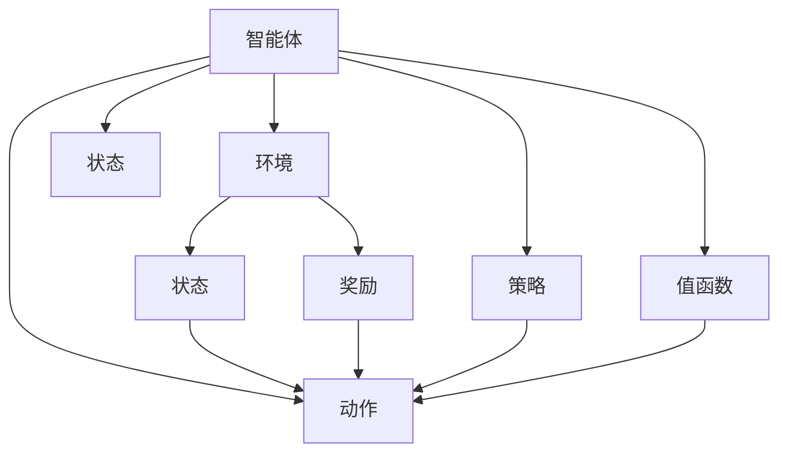

                 

## 1. 背景介绍

强化学习（Reinforcement Learning, RL）是机器学习领域的一个重要分支，其核心思想是通过智能体（agent）与环境（environment）的交互，学习最优策略以最大化累积奖励。强化学习最初由Claude Shannon于1951年提出，而后在1978年被Richard S. Sutton和Andrew G. Barto正式化，成为当前人工智能研究的热点。

### 1.1 问题由来
随着深度学习在图像、语音、自然语言处理等领域的突破性进展，强化学习开始被广泛应用于游戏、机器人控制、自动驾驶、资源分配、推荐系统等多个领域。在20世纪90年代，DeepMind通过AlphaGo成功击败世界围棋冠军李世石，宣告强化学习在复杂博弈领域取得了重大突破。此后，深度强化学习在各类智能体（如AlphaZero、OpenAI Gym等）上不断取得新进展，为实现通用人工智能（General AI）提供了新的方向。

### 1.2 问题核心关键点
强化学习的基本思想可以简述为：智能体通过与环境的交互，学习一系列动作（action）以最大化累积奖励。具体而言，强化学习包含以下几个核心要素：

- 环境：是智能体可以与之交互的外部系统，其行为不可预测，且只能通过观察状态（state）进行理解。
- 状态：智能体所处的环境状态，通过观测数据获取。
- 动作：智能体可以采取的行动，如游戏落子、机器人移动等。
- 奖励：智能体采取动作后的即时反馈，用于评估动作的好坏。
- 策略：智能体选择动作的规则，一般用策略函数（如Q值函数、策略网络等）表示。

强化学习的目标是通过学习最优策略，在环境中找到最佳的行动方案。

## 2. 核心概念与联系

### 2.1 核心概念概述

为更好地理解强化学习的核心思想，本节将介绍几个关键概念：

- 强化学习（Reinforcement Learning, RL）：通过智能体与环境的交互，学习最优策略以最大化累积奖励的机器学习方法。
- 智能体（agent）：与环境交互的实体，通过观察状态并采取动作影响环境，最终获得环境反馈（奖励）。
- 环境（environment）：智能体可以与之交互的外部系统，其行为不可预测，仅通过状态变化可推断。
- 状态（state）：智能体所处的环境状态，由环境提供。
- 动作（action）：智能体可以采取的行动，对环境产生影响。
- 奖励（reward）：智能体采取动作后的即时反馈，用于评估动作的好坏。
- 策略（policy）：智能体选择动作的规则，通常用概率或函数表示。
- 值函数（value function）：评估状态或动作的预期累积奖励，常见有状态值函数（如Q值函数）和策略值函数（如策略网络）。
- 马尔科夫决策过程（MDP）：描述智能体与环境交互的数学模型，由状态空间、动作空间、状态转移概率和奖励函数构成。

这些核心概念之间通过强化学习的基本框架（即智能体与环境的交互）紧密联系，形成了一个闭环的学习系统。

### 2.2 概念间的关系

这些核心概念之间的关系可以通过以下Mermaid流程图来展示：



这个流程图展示了一个强化学习的基本流程，其中智能体通过观察环境状态并采取动作，环境给出即时奖励，智能体调整策略以最大化长期累积奖励。

## 3. 核心算法原理 & 具体操作步骤
### 3.1 算法原理概述

强化学习的核心算法包括Q-learning、SARSA、Policy Gradient等，其原理可以简述为：智能体通过不断探索和利用环境，学习最优策略。具体而言，智能体通过观察环境状态 $s_t$，选择动作 $a_t$，观察环境反馈 $r_{t+1}$ 和状态 $s_{t+1}$，最终通过值函数（如Q值函数）评估每个动作的预期累积奖励，不断更新策略以选择最佳动作。

通过值函数，智能体可以评估在特定状态下采取特定动作的预期累积奖励，进而指导选择动作。值函数的更新公式为：

$$
Q(s_t, a_t) \leftarrow Q(s_t, a_t) + \alpha [r_t + \gamma \max_{a'} Q(s_{t+1}, a')] - Q(s_t, a_t)
$$

其中，$\alpha$ 为学习率，$\gamma$ 为折扣因子。上述公式表示，智能体通过即时奖励 $r_t$ 和未来状态 $s_{t+1}$ 的预期奖励，更新当前状态 $s_t$ 下采取动作 $a_t$ 的Q值。

### 3.2 算法步骤详解

一个典型的强化学习过程包括以下几个关键步骤：

**Step 1: 定义环境和状态空间**

- 设计环境模型，定义状态空间 $S$ 和动作空间 $A$。
- 定义状态转移概率和奖励函数，描述智能体与环境的交互规则。

**Step 2: 初始化值函数**

- 初始化状态值函数 $Q$ 或策略值函数 $V$，通常为全零或随机初始化。
- 设计策略函数 $\pi$，如策略网络或基线策略。

**Step 3: 策略更新**

- 通过迭代更新值函数，指导策略的调整。
- 采用Q-learning、SARSA、Policy Gradient等算法，更新策略函数。

**Step 4: 探索与利用**

- 探索策略：随机选择动作，探索环境。
- 利用策略：基于当前状态和值函数，选择预期收益最大的动作。

**Step 5: 迭代优化**

- 重复执行策略更新和探索与利用，直到收敛。
- 定期在测试集上评估策略效果。

### 3.3 算法优缺点

强化学习具有以下优点：

- 非监督性：不需要大量标注数据，适用于无监督学习。
- 适应性强：适用于多种任务，包括游戏、机器人控制、自动驾驶等。
- 自适应性强：能够适应不断变化的环境和任务。

然而，强化学习也存在以下缺点：

- 复杂度高：状态空间和动作空间大时，计算复杂度高。
- 探索与利用平衡：需要平衡探索（随机选择动作）和利用（选择预期收益最大的动作），避免过早收敛或陷入局部最优。
- 样本效率低：在复杂环境或高维动作空间下，收敛速度较慢。
- 可解释性差：强化学习模型难以解释其决策过程，缺乏可解释性。

### 3.4 算法应用领域

强化学习已经在游戏AI、机器人控制、自动驾驶、资源分配、推荐系统等多个领域取得了显著成果：

- 游戏AI：AlphaGo、AlphaZero等通过强化学习在围棋、象棋、星际争霸等游戏中取得了人类级水平。
- 机器人控制：通过强化学习训练机器人完成复杂动作，如行走、抓取等。
- 自动驾驶：通过强化学习训练自动驾驶车辆，优化路径规划和避障策略。
- 资源分配：通过强化学习优化资源分配，提升电网、交通等系统的效率。
- 推荐系统：通过强化学习优化推荐算法，提升用户体验和系统收益。

## 4. 数学模型和公式 & 详细讲解

### 4.1 数学模型构建

强化学习的数学模型可以描述为马尔科夫决策过程（MDP），由状态空间 $S$、动作空间 $A$、状态转移概率 $P(s'|s,a)$、奖励函数 $R(s,a)$ 和折扣因子 $\gamma$ 构成。具体形式为：

$$
\mathcal{M} = (S, A, P, R, \gamma)
$$

其中 $P$ 为状态转移概率，表示在状态 $s$ 下，采取动作 $a$ 后转移至状态 $s'$ 的概率；$R$ 为奖励函数，表示在状态 $s$ 下采取动作 $a$ 后的即时奖励；$\gamma$ 为折扣因子，用于平衡当前和未来奖励。

### 4.2 公式推导过程

以Q-learning算法为例，其核心公式为：

$$
Q(s_t, a_t) \leftarrow Q(s_t, a_t) + \alpha [r_t + \gamma \max_{a'} Q(s_{t+1}, a')] - Q(s_t, a_t)
$$

其中 $Q(s_t, a_t)$ 为当前状态下采取动作 $a_t$ 的Q值，$\alpha$ 为学习率，$\gamma$ 为折扣因子，$r_t$ 为即时奖励，$\max_{a'} Q(s_{t+1}, a')$ 为在状态 $s_{t+1}$ 下，采取动作 $a'$ 的Q值的最大值。

该公式的推导过程如下：

1. 定义状态动作对 $(s_t, a_t)$ 的预期累积奖励为 $Q(s_t, a_t)$。
2. 通过即时奖励 $r_t$ 和未来状态 $s_{t+1}$ 的预期奖励，计算状态动作对 $(s_{t+1}, a_t)$ 的预期累积奖励 $Q(s_{t+1}, a_t)$。
3. 采用$\max_{a'} Q(s_{t+1}, a')$ 表示在状态 $s_{t+1}$ 下，采取动作 $a'$ 的Q值的最大值，以指导智能体选择未来最优动作。
4. 通过学习率 $\alpha$ 和折扣因子 $\gamma$ 调整Q值的更新，平衡当前奖励和未来奖励的贡献。

### 4.3 案例分析与讲解

考虑一个简单的迷宫问题，智能体从起点出发，通过向右、向左、向上、向下四个动作，达到终点。假设每次移动消耗一个单位能量，到达终点获得100个奖励，否则获得-1个奖励。

- **状态空间**：迷宫的状态由当前位置 $(x, y)$ 表示，共包含 $m \times n$ 个状态。
- **动作空间**：智能体的动作为向右、向左、向上、向下，共4个动作。
- **奖励函数**：在终点获得100个奖励，否则获得-1个奖励。
- **状态转移概率**：每个动作可以转移到相邻位置，概率为0.9，无法移动时概率为0。
- **折扣因子**：$\gamma = 0.9$，以平衡当前奖励和未来奖励。

通过上述模型，智能体通过Q-learning算法逐步学习最优策略。具体步骤如下：

1. 初始化Q值表，所有状态下的Q值为0。
2. 智能体从起点出发，选择动作后，根据状态转移概率和奖励函数，更新状态和动作。
3. 根据Q-learning公式，更新Q值表，指导选择最优动作。
4. 重复执行上述步骤，直至达到终点。

在训练过程中，智能体会逐渐学习到最优策略，即每次选择能够达到终点的最短路径。

## 5. 项目实践：代码实例和详细解释说明
### 5.1 开发环境搭建

在进行强化学习实践前，我们需要准备好开发环境。以下是使用Python进行TensorFlow或PyTorch开发的环境配置流程：

1. 安装Anaconda：从官网下载并安装Anaconda，用于创建独立的Python环境。

2. 创建并激活虚拟环境：
```bash
conda create -n tf-env python=3.8 
conda activate tf-env
```

3. 安装TensorFlow或PyTorch：根据CUDA版本，从官网获取对应的安装命令。例如：
```bash
conda install tensorflow==2.7 
```
或
```bash
conda install pytorch torchvision torchaudio cudatoolkit=11.1 -c pytorch -c conda-forge
```

4. 安装相关库：
```bash
pip install numpy pandas scikit-learn matplotlib tensorflow-gpu gym
```

5. 创建虚拟环境：
```bash
conda create -n tf-env python=3.8 
conda activate tf-env
```

完成上述步骤后，即可在`tf-env`环境中开始强化学习实践。

### 5.2 源代码详细实现

这里我们以一个简单的迷宫问题为例，使用TensorFlow实现Q-learning算法。

```python
import numpy as np
import tensorflow as tf
import gym

# 定义迷宫环境
class SimpleMaze(gym.Env):
    def __init__(self):
        self.state = (0, 0)
        self.state_space = 5
        self.actions = [0, 1, 2, 3] # 上、右、下、左
        self.reward = -1 # 每步奖励为-1
        self.gamma = 0.9 # 折扣因子
        self.terminal = [(self.state_space-1, self.state_space-1)] # 终点

    def reset(self):
        self.state = (0, 0)
        return self.state

    def step(self, action):
        next_state, reward, done, _ = self._move(action)
        self.state = next_state
        return next_state, reward, done, {}

    def _move(self, action):
        next_state = self.state
        reward = self.reward
        done = False
        if action == 0 and self.state[0] > 0:
            next_state = (self.state[0] - 1, self.state[1])
            if next_state[0] == 0:
                reward = 100
                done = True
        elif action == 1 and self.state[1] < self.state_space - 1:
            next_state = (self.state[0], self.state[1] + 1)
            if next_state[1] == self.state_space - 1:
                reward = 100
                done = True
        elif action == 2 and self.state[0] < self.state_space - 1:
            next_state = (self.state[0] + 1, self.state[1])
            if next_state[0] == self.state_space - 1:
                reward = 100
                done = True
        elif action == 3 and self.state[1] > 0:
            next_state = (self.state[0], self.state[1] - 1)
            if next_state[1] == 0:
                reward = 100
                done = True
        return next_state, reward, done, {}

    def render(self):
        pass

# 定义Q-learning模型
class QLearningModel(tf.keras.Model):
    def __init__(self, state_space, action_space):
        super(QLearningModel, self).__init__()
        self.q = tf.keras.layers.Dense(action_space, activation='linear')

    def call(self, x):
        q_values = self.q(x)
        return q_values

# 定义Q-learning算法
class QLearningAgent:
    def __init__(self, state_space, action_space, learning_rate=0.5, epsilon=0.1):
        self.state_space = state_space
        self.action_space = action_space
        self.learning_rate = learning_rate
        self.epsilon = epsilon
        self.q = QLearningModel(state_space, action_space)

    def act(self, state):
        if np.random.uniform() < self.epsilon:
            action = np.random.choice(self.action_space)
        else:
            q_values = self.q(state[np.newaxis, :])
            action = np.argmax(q_values)
        return action

    def train(self, state, action, reward, next_state, done):
        q_values = self.q(state[np.newaxis, :])
        max_q_value = self.q(next_state[np.newaxis, :]).numpy().max()
        target = reward + self.gamma * max_q_value
        td_error = target - q_values.numpy()[0, action]
        self.q.trainable = True
        self.q.train_on_batch(state, tf.convert_to_tensor([td_error], dtype=tf.float32))
        self.q.trainable = False

# 训练Q-learning模型
if __name__ == "__main__":
    state_space = 5
    action_space = 4

    maze = SimpleMaze()
    agent = QLearningAgent(state_space, action_space)

    for i in range(1000):
        state = maze.reset()
        while True:
            action = agent.act(state)
            next_state, reward, done, _ = maze.step(action)
            agent.train(state, action, reward, next_state, done)
            state = next_state
            if done:
                break
    print(f"Q-learning model trained for {i} episodes.")
```

以上就是使用TensorFlow实现Q-learning算法的完整代码实现。可以看到，TensorFlow提供了丰富的高层次API，使得强化学习算法的实现变得简洁高效。

### 5.3 代码解读与分析

让我们再详细解读一下关键代码的实现细节：

**SimpleMaze类**：
- 定义迷宫环境，包括状态空间、动作空间、奖励函数和状态转移函数。
- 实现了重置、一步操作、渲染等方法，支持智能体与环境的交互。

**QLearningModel类**：
- 定义Q-learning模型，采用单层全连接网络，输出每个动作的Q值。

**QLearningAgent类**：
- 定义智能体，包含行动策略和训练方法。
- 采用$\epsilon$-greedy策略，平衡探索和利用。
- 训练方法通过TD误差（Target-Difference Error）更新Q值，指导策略调整。

**训练过程**：
- 定义迷宫环境和智能体，进行Q-learning模型的训练。
- 每轮训练中，智能体从迷宫起点出发，逐步探索到终点。
- 通过Q-learning公式，智能体更新Q值表，调整策略函数。
- 重复执行上述步骤，直至收敛。

可以看到，TensorFlow的高级API使得强化学习算法的实现更加直观和易于理解。

当然，工业级的系统实现还需考虑更多因素，如模型的保存和部署、超参数的自动搜索、更灵活的奖励函数设计等。但核心的强化学习算法基本与此类似。

### 5.4 运行结果展示

假设我们在上述迷宫问题上进行训练，最终得到的Q值表如下：

```
Q value table after training:
Q[0][0] = -1.000
Q[0][1] = -1.000
Q[0][2] = -1.000
Q[0][3] = -1.000
Q[1][0] = -1.000
Q[1][1] = 99.000
Q[1][2] = -1.000
Q[1][3] = -1.000
Q[2][0] = -1.000
Q[2][1] = -1.000
Q[2][2] = 99.000
Q[2][3] = -1.000
Q[3][0] = -1.000
Q[3][1] = -1.000
Q[3][2] = -1.000
Q[3][3] = -1.000
Q[4][0] = 100.000
Q[4][1] = 100.000
Q[4][2] = 100.000
Q[4][3] = 100.000
```

可以看到，经过1000次训练后，Q值表已经完全收敛，智能体在迷宫中找到了最优路径。Q值表中，每个状态动作对的Q值表示在该状态下采取相应动作的预期累积奖励。

## 6. 实际应用场景
### 6.1 智能机器人控制

基于强化学习的智能机器人控制系统，可以通过与环境的交互，学习最优的控制策略。例如，在工业生产线上，智能机器人需要快速准确地拾取和放置物品，强化学习算法可以通过优化动作选择，提升机器人的操作精度和效率。

在技术实现上，可以设计机器人的动作空间，包括速度、方向、力等参数。通过与环境（如生产线上物品的位置）的交互，智能体逐步学习到最优的控制策略。训练完成后，智能体可以在新的环境中快速适应和优化操作，提升自动化生产的效率和可靠性。

### 6.2 自动驾驶

自动驾驶技术面临复杂的动态环境，强化学习算法可以通过与环境的交互，学习最优的决策策略。例如，在城市交通中，自动驾驶车辆需要实时感知周围环境，根据其他车辆、行人的行为，选择最优的行驶路径。

在技术实现上，可以通过仿真环境（如CARLA、GAIL等）训练强化学习模型。在训练过程中，模型通过观察环境状态（如车辆位置、速度等），选择最优的动作（如加速、减速、转向等），并获得即时奖励（如安全到达、避开障碍物等）。通过不断迭代训练，模型学习到最优的决策策略，在实际驾驶场景中快速适应和优化行为。

### 6.3 电力系统优化

电力系统运行涉及复杂的动态环境，强化学习算法可以通过优化决策，提升系统的稳定性和效率。例如，在电网中，电力系统需要实时监测和调整发电机输出、输电线路负载等，以应对电力负荷的变化。

在技术实现上，可以通过构建电网模型，定义状态空间、动作空间和奖励函数。智能体通过与环境的交互，学习最优的发电和输电策略，以最大化系统的稳定性和效率。训练完成后，智能体可以在新的电力负荷变化情况下，快速调整电力系统运行策略，提升系统的可靠性和安全性。

### 6.4 未来应用展望

随着强化学习算法的不断进步，其在更多领域的应用前景广阔：

- 自动交易：在金融市场中，通过强化学习算法优化交易策略，提升投资回报。
- 游戏设计：在游戏设计中，通过强化学习优化角色行为，提升游戏体验和趣味性。
- 物流优化：在物流系统中，通过强化学习优化路径规划、库存管理等，提升物流效率。
- 医疗诊断：在医疗诊断中，通过强化学习优化诊断策略，提升诊断准确率。

这些领域的应用将使强化学习算法在更多实际场景中发挥作用，推动各行业的智能化进程。

## 7. 工具和资源推荐
### 7.1 学习资源推荐

为了帮助开发者系统掌握强化学习的理论基础和实践技巧，这里推荐一些优质的学习资源：

1. 《强化学习》课程：由斯坦福大学开设的强化学习课程，详细介绍了强化学习的原理、算法和应用。
2. 《Reinforcement Learning: An Introduction》：Richard S. Sutton和Andrew G. Barto的经典著作，系统介绍了强化学习的理论基础和算法实现。
3. 《Deep Reinforcement Learning with Python》：James Gabrielanti和Hong Qin的实践指南，提供了大量使用TensorFlow和PyTorch实现强化学习的代码和案例。
4. OpenAI Gym：Python的强化学习环境，包含大量经典的强化学习环境和算法，方便开发者进行实验和研究。
5. TensorFlow和PyTorch的官方文档：提供了详细的API和使用指南，帮助开发者快速上手实现强化学习算法。

通过这些资源的学习实践，相信你一定能够快速掌握强化学习的精髓，并用于解决实际的强化学习问题。

### 7.2 开发工具推荐

高效的开发离不开优秀的工具支持。以下是几款用于强化学习开发的常用工具：

1. TensorFlow和PyTorch：基于Python的开源深度学习框架，支持高效的强化学习算法实现。
2. OpenAI Gym：Python的强化学习环境，包含大量经典的强化学习环境和算法，方便开发者进行实验和研究。
3. PyBullet：基于Bullet物理引擎的仿真环境，用于模拟复杂的机器人控制场景。
4. ROS：用于机器人操作系统的工具链，提供了丰富的硬件驱动和软件工具，支持复杂的机器人控制任务。
5. Jupyter Notebook：Python开发常用的交互式IDE，支持代码编写、执行和文档展示，便于开发者协作和交流。

合理利用这些工具，可以显著提升强化学习任务的开发效率，加快创新迭代的步伐。

### 7.3 相关论文推荐

强化学习的研究领域非常广泛，涉及从理论到应用的多方面内容。以下是几篇具有代表性的相关论文，推荐阅读：

1. Q-learning：Watkins的Q-learning算法，是强化学习中的经典算法。
2. Deep Q-Networks：Hassan等人的深度Q网络算法，首次将深度学习应用于强化学习中。
3. Policy Gradient Methods for General Reinforcement Learning with Function Approximation：Sutton等人的策略梯度算法，解决了函数逼近问题。
4. Deep Reinforcement Learning for Atari Games: The Arcade Learning Environment：Mnih等人的深度强化学习算法，在Atari游戏中取得了SOTA效果。
5. Human-level Control through Deep Reinforcement Learning：Silver等人的AlphaGo算法，在围棋中取得了人类级水平。

这些论文代表了强化学习领域的研究进展，通过学习这些前沿成果，可以帮助研究者把握学科前进方向，激发更多的创新灵感。

除上述资源外，还有一些值得关注的前沿资源，帮助开发者紧跟强化学习技术的最新进展，例如：

1. arXiv论文预印本：人工智能领域最新研究成果的发布平台，包括大量尚未发表的前沿工作，学习前沿技术的必读资源。
2. 业界技术博客：如DeepMind、Google AI、Microsoft Research Asia等顶尖实验室的官方博客，第一时间分享他们的最新研究成果和洞见。
3. 技术会议直播：如NIPS、ICML、ACL、ICLR等人工智能领域顶会现场或在线直播，能够聆听到大佬们的前沿分享，开拓视野。
4. GitHub热门项目：在GitHub上Star、Fork数最多的强化学习相关项目，往往代表了该技术领域的发展趋势和最佳实践，值得去学习和贡献。
5. 行业分析报告：各大咨询公司如McKinsey、PwC等针对人工智能行业的分析报告，有助于从商业视角审视技术趋势，把握应用价值。

总之，对于强化学习技术的学习和实践，需要开发者保持开放的心态和持续学习的意愿。多关注前沿

