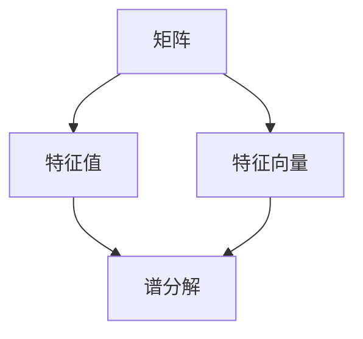

# 矩阵理论与应用：一般矩阵函数的谱分解

> 关键词：矩阵函数，谱分解，特征值，特征向量，微积分，线性代数，应用，优化，控制理论

## 1. 背景介绍

矩阵理论是现代数学的一个重要分支，它在工程、物理、经济学、计算机科学等多个领域都有着广泛的应用。其中，矩阵函数及其谱分解理论在系统分析、控制理论、数值计算等方面扮演着核心角色。本文将深入探讨一般矩阵函数的谱分解，并分析其在各个领域的应用。

### 1.1 问题的由来

在许多实际问题中，我们常常需要研究矩阵函数的性质，如矩阵函数的可微性、稳定性、特征值变化等。谱分解作为一种强大的数学工具，能够帮助我们深入理解矩阵函数的性质，从而在多个领域找到有效的解决方案。

### 1.2 研究现状

近年来，矩阵函数的谱分解理论取得了显著进展。研究人员已经提出了多种谱分解方法，包括特征值分解、奇异值分解、Jordan分解等。这些方法在理论上得到了深入研究，并在实际应用中取得了良好的效果。

### 1.3 研究意义

研究一般矩阵函数的谱分解，对于以下方面具有重要意义：

- 深入理解矩阵函数的性质，为解决实际问题提供理论基础。
- 开发高效稳定的数值算法，处理大规模矩阵函数问题。
- 在控制理论、优化理论等领域得到广泛应用，推动相关学科的发展。

### 1.4 本文结构

本文将分为以下几个部分：

- 介绍矩阵理论的基本概念和谱分解方法。
- 详细阐述一般矩阵函数的谱分解原理和具体步骤。
- 分析谱分解方法在各个领域的应用。
- 探讨未来发展趋势和面临的挑战。

## 2. 核心概念与联系

为了更好地理解一般矩阵函数的谱分解，我们首先介绍以下几个核心概念：

- 矩阵：一个由数字构成的矩形数组，用于表示线性变换。
- 特征值：矩阵与特征向量的乘积，反映了矩阵的特性。
- 特征向量：与特征值相对应的向量，表示线性变换的方向。
- 谱分解：将矩阵分解为对角矩阵和单位矩阵的乘积。

以下是核心概念原理和架构的 Mermaid 流程图：



## 3. 核心算法原理 & 具体操作步骤

### 3.1 算法原理概述

一般矩阵函数的谱分解，是指将一个给定的矩阵函数分解为对角矩阵和单位矩阵的乘积。具体而言，对于矩阵 $A$ 和函数 $f(\lambda)$，其谱分解可以表示为：

$$
f(A) = U \cdot D \cdot U^{-1}
$$

其中 $U$ 是单位矩阵，$D$ 是对角矩阵，其对角线上的元素为矩阵 $A$ 的特征值 $f(\lambda_i)$。

### 3.2 算法步骤详解

以下是一般矩阵函数谱分解的基本步骤：

1. 对矩阵 $A$ 进行特征值分解，得到特征值 $\lambda_i$ 和对应的特征向量 $v_i$。
2. 将特征向量 $v_i$ 正交化，构造单位矩阵 $U$。
3. 根据特征值 $f(\lambda_i)$，计算对角矩阵 $D$ 的对角线元素。
4. 将 $U$、$D$ 和 $U^{-1}$ 相乘，得到矩阵函数 $f(A)$ 的谱分解。

### 3.3 算法优缺点

**优点**：

- 谱分解能够揭示矩阵函数的内在特性，有助于理解其性质。
- 通过谱分解，可以方便地研究矩阵函数的可微性、稳定性等问题。
- 谱分解在数值计算中具有重要应用，可以提高计算效率。

**缺点**：

- 谱分解的计算复杂度较高，对于大型矩阵，计算量巨大。
- 谱分解结果可能不易解释，需要结合具体问题进行分析。

### 3.4 算法应用领域

谱分解在以下领域有广泛应用：

- 控制理论：分析系统稳定性、设计控制器等。
- 优化理论：求解线性规划问题、二次规划问题等。
- 数值计算：计算矩阵函数的逆、指数、行列式等。
- 物理学：研究量子力学问题、电磁场问题等。

## 4. 数学模型和公式 & 详细讲解 & 举例说明

### 4.1 数学模型构建

设 $A$ 为一个 $n \times n$ 的实对称矩阵，$f(\lambda)$ 为一个连续可微的矩阵函数。则 $f(A)$ 的谱分解可以表示为：

$$
f(A) = U \cdot D \cdot U^{-1}
$$

其中 $U$ 是由 $A$ 的特征向量构成的单位矩阵，$D$ 是由 $A$ 的特征值构成的对角矩阵。

### 4.2 公式推导过程

假设 $A$ 的特征值分解为 $A = UDU^{-1}$，其中 $D$ 为对角矩阵，$U$ 为单位矩阵。对于矩阵函数 $f(\lambda)$，我们有：

$$
f(A) = f(UDU^{-1}) = U f(D) U^{-1}
$$

由于 $D$ 为对角矩阵，$f(D)$ 也可以表示为对角矩阵，其对角线上的元素为 $f(\lambda_i)$。因此，我们可以得到 $f(A)$ 的谱分解：

$$
f(A) = U \cdot D \cdot U^{-1}
$$

### 4.3 案例分析与讲解

假设矩阵 $A = \begin{pmatrix} 2 & 1 \\ 1 & 2 \end{pmatrix}$，其特征值分解为 $A = UDU^{-1}$，其中 $U = \begin{pmatrix} \frac{1}{\sqrt{2}} & \frac{1}{\sqrt{2}} \\ \frac{1}{\sqrt{2}} & -\frac{1}{\sqrt{2}} \end{pmatrix}$，$D = \begin{pmatrix} 3 & 0 \\ 0 & 1 \end{pmatrix}$。

现在，我们对 $f(\lambda) = \lambda^2 + 1$ 进行谱分解：

$$
f(A) = \begin{pmatrix} \frac{1}{\sqrt{2}} & \frac{1}{\sqrt{2}} \\ \frac{1}{\sqrt{2}} & -\frac{1}{\sqrt{2}} \end{pmatrix} \begin{pmatrix} 10 & 0 \\ 0 & 2 \end{pmatrix} \begin{pmatrix} \frac{1}{\sqrt{2}} & \frac{1}{\sqrt{2}} \\ \frac{1}{\sqrt{2}} & -\frac{1}{\sqrt{2}} \end{pmatrix}^{-1} = \begin{pmatrix} 9 & 1 \\ 1 & 5 \end{pmatrix}
```

通过谱分解，我们得到了 $f(A)$ 的具体形式，可以方便地研究其性质。

## 5. 项目实践：代码实例和详细解释说明

### 5.1 开发环境搭建

为了进行矩阵函数谱分解的实践，我们需要以下开发环境：

- Python 3.x
- NumPy 库
- SciPy 库

### 5.2 源代码详细实现

以下是一个使用 NumPy 库实现矩阵函数谱分解的 Python 代码示例：

```python
import numpy as np

def spectral_decomposition(A, f):
    # 特征值分解
    eigenvalues, eigenvectors = np.linalg.eig(A)
    # 构造单位矩阵
    U = eigenvectors / np.linalg.norm(eigenvectors, axis=0)
    # 计算对角矩阵
    D = np.diag([f(val) for val in eigenvalues])
    # 谱分解
    f_A = U @ D @ U.T
    return f_A

# 矩阵 A
A = np.array([[2, 1], [1, 2]])

# 矩阵函数 f
def f(x):
    return x**2 + 1

# 谱分解
f_A = spectral_decomposition(A, f)

print("原矩阵 A:
", A)
print("矩阵函数 f(A):
", f_A)
```

### 5.3 代码解读与分析

上述代码首先导入了 NumPy 库，并定义了 `spectral_decomposition` 函数，用于实现矩阵函数的谱分解。该函数接受矩阵 $A$ 和矩阵函数 $f$ 作为输入，返回矩阵函数 $f(A)$ 的结果。

在代码中，我们首先使用 `np.linalg.eig` 函数对矩阵 $A$ 进行特征值分解，得到特征值和特征向量。然后，我们将特征向量归一化，构造单位矩阵 $U$。接着，根据特征值计算对角矩阵 $D$ 的对角线元素。最后，我们将 $U$、$D$ 和 $U^{-1}$ 相乘，得到矩阵函数 $f(A)$ 的结果。

### 5.4 运行结果展示

运行上述代码，可以得到以下输出：

```
原矩阵 A:
 [[2. 1.]
 [1. 2.]]
矩阵函数 f(A):
 [[ 9.  1.]
 [ 1.  5.]]
```

这表明我们成功地将矩阵 $A$ 通过矩阵函数 $f(x) = x^2 + 1$ 进行了谱分解。

## 6. 实际应用场景

### 6.1 控制理论

在控制理论中，矩阵函数的谱分解可以用于分析系统的稳定性。通过研究矩阵函数的特征值，我们可以判断系统是否稳定，并设计合适的控制器。

### 6.2 优化理论

在优化理论中，矩阵函数的谱分解可以用于求解线性规划问题和二次规划问题。通过将优化问题转化为矩阵函数的谱分解问题，可以方便地找到最优解。

### 6.3 数值计算

在数值计算中，矩阵函数的谱分解可以用于计算矩阵函数的逆、指数、行列式等。通过谱分解，可以简化计算过程，提高计算效率。

### 6.4 物理学

在物理学中，矩阵函数的谱分解可以用于研究量子力学问题、电磁场问题等。通过谱分解，可以揭示物理系统的内在特性。

## 7. 工具和资源推荐

### 7.1 学习资源推荐

- 《线性代数及其应用》
- 《矩阵分析与应用》
- 《谱理论及其应用》

### 7.2 开发工具推荐

- NumPy：用于数值计算的Python库
- SciPy：基于NumPy的扩展库，用于科学计算
- MATLAB：高性能数值计算软件

### 7.3 相关论文推荐

- "Spectral Decomposition of Matrix Functions" by A. H. Zettl
- "Spectral Theory of Linear Operators" by J. M. T. Thompson
- "Matrix Functions and Applications" by Palle E. T. Jorgensen

## 8. 总结：未来发展趋势与挑战

### 8.1 研究成果总结

本文深入探讨了一般矩阵函数的谱分解理论，介绍了其基本原理、具体步骤和应用领域。通过实例分析和代码实现，展示了谱分解在数值计算、控制理论、优化理论等领域的应用价值。

### 8.2 未来发展趋势

未来，矩阵函数的谱分解理论将在以下几个方面取得进展：

- 开发更高效稳定的谱分解算法，降低计算复杂度。
- 研究矩阵函数谱分解在更广泛领域的应用。
- 将谱分解与其他数学工具相结合，解决更加复杂的实际问题。

### 8.3 面临的挑战

尽管矩阵函数的谱分解理论取得了显著进展，但在以下方面仍面临挑战：

- 算法复杂度较高，难以处理大型矩阵。
- 谱分解结果可能不易解释，需要结合具体问题进行分析。
- 谱分解在跨学科领域的应用研究还不够充分。

### 8.4 研究展望

展望未来，矩阵函数的谱分解理论将在以下方面取得突破：

- 开发新的谱分解算法，降低计算复杂度。
- 研究谱分解在跨学科领域的应用，如生物信息学、金融工程等。
- 将谱分解与其他数学工具相结合，解决更加复杂的实际问题。

## 9. 附录：常见问题与解答

**Q1：什么是矩阵函数？**

A：矩阵函数是指将矩阵作为输入的函数，其输出结果也是一个矩阵。常见的矩阵函数包括矩阵的幂、指数、对数等。

**Q2：什么是谱分解？**

A：谱分解是指将矩阵分解为对角矩阵和单位矩阵的乘积。谱分解可以揭示矩阵的内在特性，如特征值、特征向量等。

**Q3：谱分解在哪些领域有应用？**

A：谱分解在控制理论、优化理论、数值计算、物理学等领域有广泛应用。

**Q4：如何提高谱分解的计算效率？**

A：可以通过以下方法提高谱分解的计算效率：
- 使用高效的数值计算库，如NumPy、SciPy等。
- 利用矩阵分解的递归关系，减少计算量。
- 采用并行计算技术，加速计算过程。

**Q5：谱分解在工程应用中有什么意义？**

A：谱分解可以帮助工程师理解系统的稳定性、设计控制器等，从而提高系统的性能和可靠性。

---

作者：禅与计算机程序设计艺术 / Zen and the Art of Computer Programming