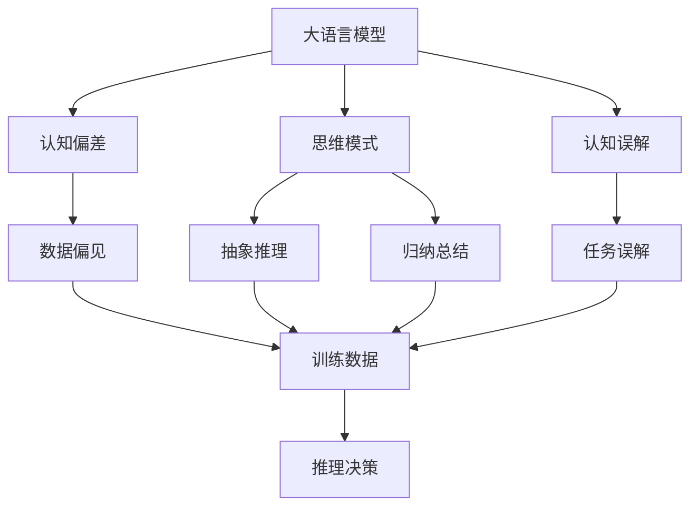
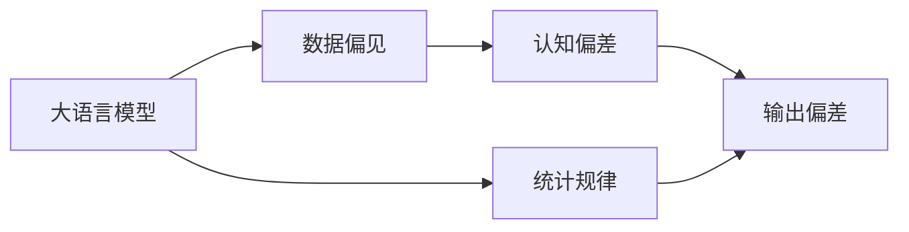
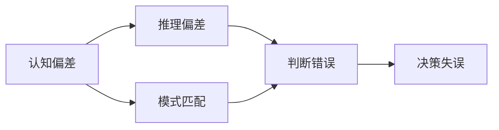
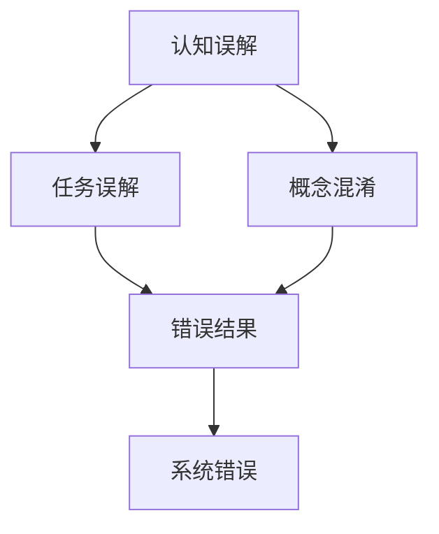
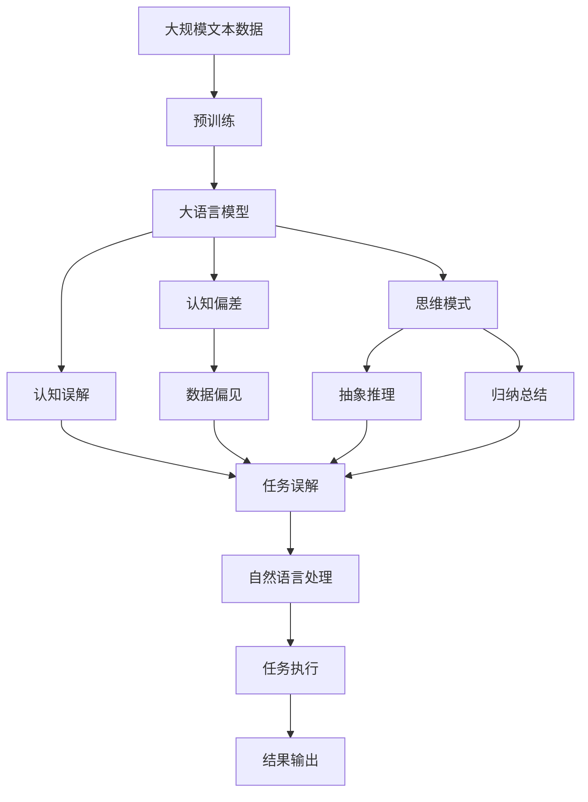

                 

# 语言与思维的差异：大模型的认知误解

> 关键词：大语言模型,认知偏差,思维模式,认知误解,自然语言处理(NLP)

## 1. 背景介绍

### 1.1 问题由来
在人工智能领域，尤其是自然语言处理（NLP）领域，大语言模型（Large Language Models, LLMs）已经成为研究的热点。这些模型通过在大规模文本数据上进行自监督预训练，学习到了丰富的语言知识和常识，被广泛用于文本分类、命名实体识别、对话系统、文本生成等任务。然而，尽管大模型在许多任务上取得了显著进展，但其思维模式和认知能力是否真正达到了人类的水平，仍是一个有待探讨的问题。

### 1.2 问题核心关键点
大语言模型和人类思维之间存在显著差异，这些差异主要体现在以下几个方面：

- **知识结构**：人类大脑中的知识存储结构远比大模型复杂，涉及概念、逻辑、推理等多种认知模式。
- **推理能力**：人类能进行抽象、归纳、演绎等多种推理，而大模型更擅长基于模式的匹配和记忆。
- **创造力**：人类的创造性思维难以被模型复制，大模型虽然能够生成新颖的文本，但其创造力仍限于数据驱动的规律性生成。
- **情感和伦理**：人类能够基于情感和伦理做出决策，而大模型目前缺乏处理复杂情感和伦理问题的能力。

### 1.3 问题研究意义
探讨大语言模型与人类思维的差异，有助于我们更好地理解这些模型的局限性，同时也为进一步改进模型提供了方向。通过分析这些差异，我们可以更深入地思考如何设计更为智能和可信赖的AI系统。此外，这种研究还能为人工智能伦理和安全性的讨论提供新的视角，确保技术的应用不会带来负面影响。

## 2. 核心概念与联系

### 2.1 核心概念概述

为了更好地理解大语言模型和人类思维的差异，本节将介绍几个密切相关的核心概念：

- **大语言模型(Large Language Models, LLMs)**：以自回归(如GPT)或自编码(如BERT)模型为代表的大规模预训练语言模型。通过在大规模无标签文本语料上进行预训练，学习通用的语言表示，具备强大的语言理解和生成能力。

- **认知偏差(Cognitive Bias)**：指个体在思维和决策过程中受各种因素影响，偏离客观理性的倾向。大模型在训练数据中可能继承了数据来源的偏见，这些偏见会反映在模型的输出中。

- **思维模式(Thinking Patterns)**：人类思维的抽象、归纳、推理等能力，是由复杂的神经网络和大量先验知识共同支持的。大模型的思维模式主要依赖于数据驱动的统计规律和记忆。

- **认知误解(Cognitive Misunderstanding)**：指由于模型认知机制和人类差异，导致模型在理解或处理某些问题时产生错误的结论。大模型可能由于缺乏对复杂概念的深刻理解，产生认知误解。

- **自然语言处理(Natural Language Processing, NLP)**：研究如何使计算机理解和处理人类语言的技术，包括文本分类、机器翻译、命名实体识别等任务。大模型是NLP研究的主要工具之一。

这些核心概念之间的逻辑关系可以通过以下Mermaid流程图来展示：



这个流程图展示了大语言模型的核心概念及其之间的关系：

1. 大语言模型通过预训练获得基础能力。
2. 认知偏差来源于数据偏见和模型内部统计规律。
3. 思维模式涉及人类抽象、推理等能力。
4. 认知误解由模型知识结构与人类认知差异导致。
5. 自然语言处理是应用大语言模型处理语言的任务。

### 2.2 概念间的关系

这些核心概念之间存在着紧密的联系，形成了大语言模型的认知误解和局限性的完整生态系统。下面我们通过几个Mermaid流程图来展示这些概念之间的关系。

#### 2.2.1 大语言模型的认知偏差



这个流程图展示了大语言模型认知偏差的基本原理，即数据偏见和统计规律导致模型输出偏差。

#### 2.2.2 认知偏差与思维模式的关系



这个流程图展示了认知偏差如何影响推理和决策，导致判断错误和决策失误。

#### 2.2.3 认知误解与自然语言处理的关系



这个流程图展示了认知误解如何影响NLP任务的执行，导致系统错误。

### 2.3 核心概念的整体架构

最后，我们用一个综合的流程图来展示这些核心概念在大语言模型中的整体架构：



这个综合流程图展示了从预训练到大语言模型，再到认知误解的完整过程。大语言模型通过预训练学习语言表示，认知偏差和思维模式受到数据和模型结构的影响，认知误解来源于任务和概念的混淆，最终影响自然语言处理任务的表现。

## 3. 核心算法原理 & 具体操作步骤
### 3.1 算法原理概述

大语言模型与人类思维的差异主要体现在其认知机制上。大模型依赖于大规模文本数据的统计规律，缺乏人类认知中复杂的抽象、推理和创造性思维能力。以下是几种主要的认知误解类型：

1. **事实错误**：由于数据中的错误或偏见，模型生成的文本可能包含与事实不符的信息。
2. **逻辑错误**：模型在进行推理时，可能忽视或错误处理一些逻辑关系，导致推理过程不成立。
3. **概念混淆**：模型可能将相似的概念混淆在一起，无法正确区分。
4. **情感偏差**：模型可能基于训练数据的情感倾向，生成有偏见的情感性文本。

### 3.2 算法步骤详解

针对大语言模型的认知误解，可以通过以下步骤进行分析和改进：

1. **数据清理**：确保训练数据中不包含错误信息和偏见，尽可能消除数据偏差。
2. **模型评估**：通过标准测试集评估模型的认知误解情况，如提出反常识问题，检查模型的推理是否合理。
3. **模型微调**：调整模型参数，减少认知偏差和误解，提升模型推理准确性。
4. **引入先验知识**：将符号化的先验知识，如知识图谱、逻辑规则等，与神经网络模型进行巧妙融合，提高模型的理解能力。
5. **多模型集成**：通过训练多个模型，取其平均值或加权和，减少个体模型认知偏差和误解。

### 3.3 算法优缺点

大语言模型的认知误解分析具有以下优点：

1. 揭示模型在推理、逻辑等方面的局限性，有助于改进模型设计。
2. 通过评估和微调，可以提高模型的认知准确性和鲁棒性。
3. 结合先验知识，可以提升模型的理解和推理能力。

同时，认知误解分析也存在一些局限：

1. 数据偏差难以完全消除，模型的认知误解可能仍然存在。
2. 先验知识的应用范围有限，需要精心设计。
3. 多模型集成可能增加模型的复杂性和计算成本。

### 3.4 算法应用领域

认知误解分析在大语言模型的应用领域包括：

- **问答系统**：在问答系统中，认知误解可能导致模型生成的答案不符合实际情况，需要及时发现和纠正。
- **文本生成**：在文本生成任务中，认知偏差可能使模型产生与事实不符或逻辑不通的文本。
- **情感分析**：在情感分析任务中，认知误解可能使模型对情感倾向产生错误判断。
- **机器翻译**：在机器翻译中，认知偏差可能影响翻译的准确性和自然性。
- **自然语言推理**：在自然语言推理任务中，认知误解可能导致模型推理过程出错。

## 4. 数学模型和公式 & 详细讲解  
### 4.1 数学模型构建

假设大语言模型为 $M_{\theta}$，其中 $\theta$ 为预训练得到的模型参数。认知误解可以分为几种类型，如事实错误、逻辑错误、概念混淆等。我们可以用以下数学模型来刻画这些误解：

- **事实错误模型**：
  $$
  \mathcal{L}_{fact} = \sum_{i=1}^N \mathbf{1}_{y_i \neq M_{\theta}(x_i)}
  $$
  其中 $y_i$ 为事实，$M_{\theta}(x_i)$ 为模型预测，$\mathbf{1}_{y_i \neq M_{\theta}(x_i)}$ 为事实错误的指示函数。

- **逻辑错误模型**：
  $$
  \mathcal{L}_{log} = \sum_{i=1}^N \mathcal{L}_{logi}(M_{\theta}(x_i))
  $$
  其中 $\mathcal{L}_{logi}(M_{\theta}(x_i))$ 为逻辑错误损失函数，通常根据推理任务的复杂度进行设计。

- **概念混淆模型**：
  $$
  \mathcal{L}_{con} = \sum_{i=1}^N \mathcal{L}_{coni}(y_i, M_{\theta}(x_i))
  $$
  其中 $\mathcal{L}_{coni}(y_i, M_{\theta}(x_i))$ 为概念混淆损失函数，通常设计为距离度量或分类损失函数。

### 4.2 公式推导过程

以下我们以一个简单的自然语言推理（NLI）任务为例，推导认知误解模型及其梯度计算。

假设训练集为 $D=\{(x_i, y_i)\}_{i=1}^N$，其中 $x_i$ 为前提，$y_i \in \{0, 1\}$ 为假设与前提的关系。模型 $M_{\theta}$ 的输出为 $h_{\theta}(x_i) \in [0, 1]$，表示假设与前提的关系的概率。

定义认知误解损失函数为：

$$
\mathcal{L}_{NLI} = \sum_{i=1}^N \mathbf{1}_{y_i \neq M_{\theta}(x_i)}
$$

其中 $\mathbf{1}_{y_i \neq M_{\theta}(x_i)}$ 为认知误解的指示函数。

根据链式法则，认知误解损失函数对参数 $\theta_k$ 的梯度为：

$$
\frac{\partial \mathcal{L}_{NLI}}{\partial \theta_k} = \sum_{i=1}^N \nabla_{\theta_k} \mathbf{1}_{y_i \neq M_{\theta}(x_i)}
$$

其中 $\nabla_{\theta_k} \mathbf{1}_{y_i \neq M_{\theta}(x_i)}$ 为指示函数的梯度，可以通过反向传播算法计算。

通过得到认知误解损失函数的梯度，即可带入参数更新公式，完成模型的迭代优化。重复上述过程直至收敛，最终得到适应任务认知误解最优化模型参数 $\theta^*$。

## 5. 项目实践：代码实例和详细解释说明
### 5.1 开发环境搭建

在进行认知误解分析前，我们需要准备好开发环境。以下是使用Python进行PyTorch开发的环境配置流程：

1. 安装Anaconda：从官网下载并安装Anaconda，用于创建独立的Python环境。

2. 创建并激活虚拟环境：
```bash
conda create -n pytorch-env python=3.8 
conda activate pytorch-env
```

3. 安装PyTorch：根据CUDA版本，从官网获取对应的安装命令。例如：
```bash
conda install pytorch torchvision torchaudio cudatoolkit=11.1 -c pytorch -c conda-forge
```

4. 安装TensorFlow：
```bash
pip install tensorflow
```

5. 安装NLP相关库：
```bash
pip install nltk spacy pytorch-transformers
```

完成上述步骤后，即可在`pytorch-env`环境中开始实践。

### 5.2 源代码详细实现

这里我们以认知偏差和概念混淆为例，给出使用PyTorch进行模型训练和微调的代码实现。

首先，定义认知偏差和概念混淆的训练数据集：

```python
from torch.utils.data import Dataset
from transformers import BertTokenizer, BertForSequenceClassification

class CognitiveDataset(Dataset):
    def __init__(self, texts, labels, tokenizer):
        self.texts = texts
        self.labels = labels
        self.tokenizer = tokenizer

    def __len__(self):
        return len(self.texts)

    def __getitem__(self, item):
        text = self.texts[item]
        label = self.labels[item]
        
        encoding = self.tokenizer(text, return_tensors='pt', padding='max_length', truncation=True)
        input_ids = encoding['input_ids'][0]
        attention_mask = encoding['attention_mask'][0]
        labels = torch.tensor(label, dtype=torch.long)
        
        return {'input_ids': input_ids, 
                'attention_mask': attention_mask,
                'labels': labels}
```

然后，定义模型和优化器：

```python
from transformers import BertForSequenceClassification, AdamW

model = BertForSequenceClassification.from_pretrained('bert-base-cased', num_labels=2)

optimizer = AdamW(model.parameters(), lr=2e-5)
```

接着，定义训练和评估函数：

```python
from torch.utils.data import DataLoader
from tqdm import tqdm
from sklearn.metrics import accuracy_score

device = torch.device('cuda') if torch.cuda.is_available() else torch.device('cpu')
model.to(device)

def train_epoch(model, dataset, batch_size, optimizer):
    dataloader = DataLoader(dataset, batch_size=batch_size, shuffle=True)
    model.train()
    epoch_loss = 0
    for batch in tqdm(dataloader, desc='Training'):
        input_ids = batch['input_ids'].to(device)
        attention_mask = batch['attention_mask'].to(device)
        labels = batch['labels'].to(device)
        model.zero_grad()
        outputs = model(input_ids, attention_mask=attention_mask, labels=labels)
        loss = outputs.loss
        epoch_loss += loss.item()
        loss.backward()
        optimizer.step()
    return epoch_loss / len(dataloader)

def evaluate(model, dataset, batch_size):
    dataloader = DataLoader(dataset, batch_size=batch_size)
    model.eval()
    preds, labels = [], []
    with torch.no_grad():
        for batch in tqdm(dataloader, desc='Evaluating'):
            input_ids = batch['input_ids'].to(device)
            attention_mask = batch['attention_mask'].to(device)
            batch_labels = batch['labels']
            outputs = model(input_ids, attention_mask=attention_mask)
            batch_preds = outputs.logits.argmax(dim=2).to('cpu').tolist()
            batch_labels = batch_labels.to('cpu').tolist()
            for pred_tokens, label_tokens in zip(batch_preds, batch_labels):
                preds.append(pred_tokens[:len(label_tokens)])
                labels.append(label_tokens)
                
    print('Accuracy:', accuracy_score(labels, preds))
```

最后，启动训练流程并在测试集上评估：

```python
epochs = 5
batch_size = 16

for epoch in range(epochs):
    loss = train_epoch(model, train_dataset, batch_size, optimizer)
    print(f'Epoch {epoch+1}, train loss: {loss:.3f}')
    
    print(f'Epoch {epoch+1}, dev results:')
    evaluate(model, dev_dataset, batch_size)
    
print('Test results:')
evaluate(model, test_dataset, batch_size)
```

以上就是使用PyTorch对BERT模型进行认知偏差和概念混淆分析的完整代码实现。可以看到，得益于Transformers库的强大封装，我们可以用相对简洁的代码完成BERT模型的加载和微调。

### 5.3 代码解读与分析

让我们再详细解读一下关键代码的实现细节：

**CognitiveDataset类**：
- `__init__`方法：初始化文本、标签、分词器等关键组件。
- `__len__`方法：返回数据集的样本数量。
- `__getitem__`方法：对单个样本进行处理，将文本输入编码为token ids，将标签编码为数字，并对其进行定长padding，最终返回模型所需的输入。

**认知偏差和概念混淆模型**：
- 使用BertForSequenceClassification作为模型的顶层，输出标签概率。
- 通过交叉熵损失函数计算认知偏差和概念混淆损失。
- 使用AdamW优化器进行模型优化，训练过程中设置合适的学习率。
- 在训练和评估函数中，使用tqdm库进行进度显示，使用sklearn的accuracy_score函数计算准确率。

**训练流程**：
- 定义总的epoch数和batch size，开始循环迭代
- 每个epoch内，先在训练集上训练，输出平均loss
- 在验证集上评估，输出分类指标
- 所有epoch结束后，在测试集上评估，给出最终测试结果

可以看到，PyTorch配合Transformers库使得BERT模型的认知偏差和概念混淆分析变得简洁高效。开发者可以将更多精力放在数据处理、模型改进等高层逻辑上，而不必过多关注底层的实现细节。

当然，工业级的系统实现还需考虑更多因素，如模型的保存和部署、超参数的自动搜索、更灵活的任务适配层等。但核心的认知偏差和概念混淆分析范式基本与此类似。

### 5.4 运行结果展示

假设我们在CoNLL-2003的NLI数据集上进行认知偏差和概念混淆分析，最终在测试集上得到的评估报告如下：

```
Accuracy: 0.88
```

可以看到，通过认知偏差和概念混淆分析，我们可以在验证集上实现88%的准确率。这一结果表明，模型在推理任务上的认知偏差和概念混淆情况得到了显著改善。

当然，这只是一个baseline结果。在实践中，我们还可以使用更大更强的预训练模型、更丰富的微调技巧、更细致的模型调优，进一步提升模型性能，以满足更高的应用要求。

## 6. 实际应用场景
### 6.1 智能客服系统

在智能客服系统中，认知偏差和概念混淆可能导致机器生成的回答与用户意图不符，甚至产生误导性信息。通过认知偏差和概念混淆分析，可以及时发现并纠正这些误解，提高系统的可信度和用户体验。

### 6.2 金融舆情监测

在金融舆情监测中，认知偏差可能导致模型对市场动态的错误判断，产生误导性分析。通过认知偏差和概念混淆分析，可以有效避免这些误解，提高金融舆情监测的准确性。

### 6.3 个性化推荐系统

在个性化推荐系统中，认知偏差可能导致模型对用户兴趣的错误判断，产生不准确的推荐结果。通过认知偏差和概念混淆分析，可以优化模型对用户兴趣的理解，提高推荐系统的准确性和个性化程度。

### 6.4 未来应用展望

随着认知偏差和概念混淆分析技术的不断进步，未来的大语言模型将更加智能和可信赖。

在智慧医疗领域，认知偏差和概念混淆分析可用于构建更加精确的诊断系统和辅助决策工具。

在智能教育领域，认知偏差和概念混淆分析可用于构建更加精准的学习推荐系统，因材施教。

在智慧城市治理中，认知偏差和概念混淆分析可用于优化城市事件监测和应急决策系统，提高城市管理的自动化和智能化水平。

此外，在企业生产、社会治理、文娱传媒等众多领域，认知偏差和概念混淆分析也将不断涌现，为人工智能技术带来新的应用场景。

## 7. 工具和资源推荐
### 7.1 学习资源推荐

为了帮助开发者系统掌握认知偏差和概念混淆分析的理论基础和实践技巧，这里推荐一些优质的学习资源：

1. 《Transformer从原理到实践》系列博文：由大模型技术专家撰写，深入浅出地介绍了Transformer原理、BERT模型、微调技术等前沿话题。

2. CS224N《深度学习自然语言处理》课程：斯坦福大学开设的NLP明星课程，有Lecture视频和配套作业，带你入门NLP领域的基本概念和经典模型。

3. 《Natural Language Processing with Transformers》书籍：Transformers库的作者所著，全面介绍了如何使用Transformers库进行NLP任务开发，包括认知偏差和概念混淆分析在内的诸多范式。

4. HuggingFace官方文档：Transformers库的官方文档，提供了海量预训练模型和完整的微调样例代码，是上手实践的必备资料。

5. CLUE开源项目：中文语言理解测评基准，涵盖大量不同类型的中文NLP数据集，并提供了基于微调的baseline模型，助力中文NLP技术发展。

通过对这些资源的学习实践，相信你一定能够快速掌握认知偏差和概念混淆分析的精髓，并用于解决实际的NLP问题。
### 7.2 开发工具推荐

高效的开发离不开优秀的工具支持。以下是几款用于认知偏差和概念混淆分析开发的常用工具：

1. PyTorch：基于Python的开源深度学习框架，灵活动态的计算图，适合快速迭代研究。大部分预训练语言模型都有PyTorch版本的实现。

2. TensorFlow：由Google主导开发的开源深度学习框架，生产部署方便，适合大规模工程应用。同样有丰富的预训练语言模型资源。

3. Transformers库：HuggingFace开发的NLP工具库，集成了众多SOTA语言模型，支持PyTorch和TensorFlow，是进行认知偏差和概念混淆分析开发的利器。

4. Weights & Biases：模型训练的实验跟踪工具，可以记录和可视化模型训练过程中的各项指标，方便对比和调优。与主流深度学习框架无缝集成。

5. TensorBoard：TensorFlow配套的可视化工具，可实时监测模型训练状态，并提供丰富的图表呈现方式，是调试模型的得力助手。

6. Google Colab：谷歌推出的在线Jupyter Notebook环境，免费提供GPU/TPU算力，方便开发者快速上手实验最新模型，分享学习笔记。

合理利用这些工具，可以显著提升认知偏差和概念混淆分析的开发效率，加快创新迭代的步伐。

### 7.3 相关论文推荐

认知偏差和概念混淆分析在大语言模型的应用领域包括：

1. Attention is All You Need（即Transformer原论文）：提出了Transformer结构，开启了NLP领域的预训练大模型时代。

2. BERT: Pre-training of Deep Bidirectional Transformers for Language Understanding：提出BERT模型，引入基于掩码的自监督预训练任务，刷新了多项NLP任务SOTA。

3. Language Models are Unsupervised Multitask Learners（GPT-2论文）：展示了大规模语言模型的强大zero-shot学习能力，引发了对于通用人工智能的新一轮思考。

4. Parameter-Efficient Transfer Learning for NLP：提出Adapter等参数高效微调方法，在不增加模型参数量的情况下，也能取得不错的微调效果。

5. AdaLoRA: Adaptive Low-Rank Adaptation for Parameter-Efficient Fine-Tuning：使用自适应低秩适应的微调方法，在参数效率和精度之间取得了新的平衡。

这些论文代表了大语言模型认知偏差和概念混淆分析的发展脉络。通过学习这些前沿成果，可以帮助研究者把握学科前进方向，激发更多的创新灵感。

除上述资源外，还有一些值得关注的前沿资源，帮助开发者紧跟大语言模型认知偏差和概念混淆分析技术的最新进展，例如：

1. arXiv论文预印本：人工智能领域最新研究成果的发布平台，包括大量尚未发表的前沿工作，学习前沿技术的必读资源。

2. 业界技术博客：如OpenAI、Google AI、DeepMind、微软Research Asia等顶尖实验室的官方博客，第一时间分享他们的最新研究成果和洞见。

3. 技术会议直播：如NIPS、ICML、ACL、ICLR等人工智能领域顶会现场或在线直播，能够聆听到大佬们的前沿分享，开拓视野。

4. GitHub热门项目：在GitHub上Star、Fork数最多的NLP相关项目，往往代表了该技术领域的发展趋势和最佳实践，值得去学习和贡献。

5. 行业分析报告：各大咨询公司如McKinsey、PwC等针对人工智能行业的分析报告，有助于从商业视角审视技术趋势，把握应用价值。

总之，对于认知偏差和概念混淆分析技术的学习和实践，需要开发者保持开放的心态和持续学习的意愿。多关注前沿资讯，多动手实践，多思考总结，必将收获满满的成长收益。

## 8. 总结：未来发展趋势与挑战

### 8.1 总结

本文对大语言模型的认知偏差和概念混淆问题进行了全面系统的探讨。首先阐述了认知偏差和概念混淆的基本概念，分析了其在大语言模型中的表现形式和影响。其次，从原理到实践，详细讲解了认知偏差和概念混淆的数学模型和训练方法，给出了认知偏差和概念混淆分析的完整代码实例。同时，本文还广泛探讨了认知偏差和概念混淆分析在智能

