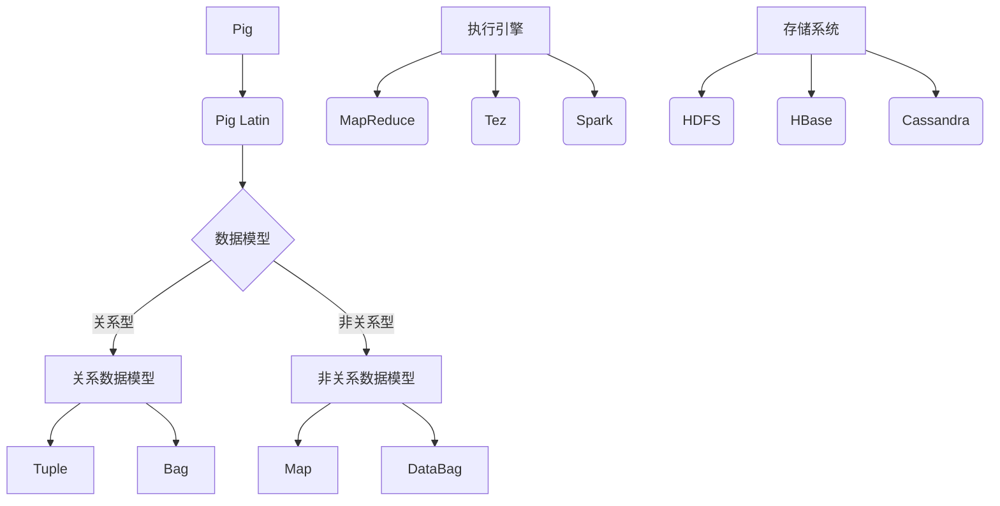

# Pig原理与代码实例讲解

## 1. 背景介绍

### 1.1 问题的由来

在大数据时代,海量的结构化和非结构化数据不断涌现,传统的数据处理方式已经无法满足现代数据分析的需求。针对这一问题,Apache Pig应运而生,它提供了一种高级数据流语言,使得程序员可以更加轻松地处理大规模数据集。

### 1.2 研究现状

Apache Pig是Apache软件基金会的一个开源项目,最初由Yahoo!研究院开发,后来加入了Apache软件基金会。Pig提供了一种名为Pig Latin的数据流语言,使得程序员可以用简洁的语句来描述复杂的数据处理流程,而不必直接编写MapReduce程序。

Pig Latin语言具有声明式的特点,程序员只需要描述想要完成的操作,而不必关心具体的实现细节。Pig会自动将Pig Latin语句转换为MapReduce作业,并在Hadoop集群上执行。

### 1.3 研究意义

学习Pig原理和代码实现对于以下几个方面具有重要意义:

1. **简化大数据处理**:Pig为程序员提供了一种高级抽象,使得他们可以专注于数据处理逻辑,而不必过多关注底层实现细节。这大大提高了大数据处理的效率和可维护性。

2. **优化查询性能**:Pig内置了多种优化策略,可以自动优化查询执行计划,提高查询性能。了解Pig的优化原理有助于编写高效的Pig Latin脚本。

3. **扩展Pig功能**:通过研究Pig的代码实现,可以更好地理解Pig的内部机制,从而方便对Pig进行定制化扩展,满足特定的业务需求。

4. **培养大数据思维**:学习Pig有助于培养大数据思维,理解如何将复杂的数据处理问题分解为一系列简单的数据转换操作。

### 1.4 本文结构

本文将从以下几个方面全面介绍Pig:

1. 核心概念与联系
2. 核心算法原理和具体操作步骤
3. 数学模型和公式详细讲解及案例分析
4. 项目实践:代码实例和详细解释说明
5. 实际应用场景和未来展望
6. 工具和资源推荐
7. 总结:未来发展趋势与挑战
8. 附录:常见问题与解答

## 2. 核心概念与联系



Pig的核心概念主要包括以下几个方面:

1. **Pig Latin**: Pig提供的数据流语言,用于描述数据处理流程。
2. **数据模型**: Pig支持关系型和非关系型两种数据模型,包括Tuple、Bag、Map和DataBag等数据结构。
3. **执行引擎**: Pig可以将Pig Latin脚本翻译为MapReduce、Tez或Spark作业在Hadoop集群上执行。
4. **存储系统**: Pig可以读写多种存储系统,如HDFS、HBase和Cassandra等。

Pig Latin是Pig的核心,它提供了一种声明式的语言,使得程序员可以专注于描述数据处理逻辑,而不必关心底层实现细节。Pig Latin脚本会被翻译为一系列MapReduce、Tez或Spark作业,并在Hadoop集群上执行。

Pig支持两种数据模型:关系型数据模型和非关系型数据模型。关系型数据模型包括Tuple和Bag两种数据结构,分别对应于关系数据库中的行和表。非关系型数据模型包括Map和DataBag两种数据结构,用于表示键值对和嵌套数据。

Pig可以读写多种存储系统,如HDFS、HBase和Cassandra等,使得程序员可以轻松地处理存储在不同系统中的数据。

## 3. 核心算法原理 & 具体操作步骤

### 3.1 算法原理概述

Pig的核心算法原理可以概括为以下几个步骤:

1. **解析Pig Latin脚本**:Pig首先将Pig Latin脚本解析为一个逻辑计划(Logical Plan)。
2. **逻辑计划优化**:Pig会对逻辑计划进行一系列优化,如投影剪裁、过滤推导等,以提高查询性能。
3. **逻辑计划转换**:优化后的逻辑计划会被转换为一个物理计划(Physical Plan),其中包含了具体的执行步骤。
4. **执行物理计划**:物理计划会被提交给执行引擎(如MapReduce、Tez或Spark)在Hadoop集群上执行。

### 3.2 算法步骤详解

1. **解析Pig Latin脚本**

   Pig使用ANTLR(Another Tool for Language Recognition)工具对Pig Latin脚本进行解析,生成一个抽象语法树(Abstract Syntax Tree, AST)。AST是一种树状数据结构,用于表示Pig Latin语句的语法结构。

   解析过程包括以下几个步骤:

   a. 词法分析(Lexical Analysis):将Pig Latin脚本分解为一系列的标记(Token)。
   b. 语法分析(Syntax Analysis):根据Pig Latin语言的语法规则,将标记序列构建成AST。
   c. 语义分析(Semantic Analysis):对AST进行语义检查,确保语句的正确性。

2. **逻辑计划优化**

   在生成逻辑计划之后,Pig会应用一系列优化规则对其进行优化,以提高查询性能。常见的优化规则包括:

   a. **投影剪裁(Project Pruning)**:去除不需要的字段,减少数据传输量。
   b. **过滤推导(Filter Pushdown)**:将过滤操作尽可能地推导到数据源,减少中间数据量。
   c. **合并连接(Join Merge)**:将多个连接操作合并为一个,减少中间数据量。
   d. **排序合并连接(Sort-Merge Join)**:对于较小的数据集,使用排序合并连接算法替代基于哈希的连接算法,减少内存开销。
   e. **MapSide处理(Map-Side Processing)**:将部分操作推导到Map端执行,减少Reduce端的工作量。

3. **逻辑计划转换**

   优化后的逻辑计划会被转换为一个物理计划,其中包含了具体的执行步骤。物理计划由一系列的MapReduce作业或Tez/Spark任务组成。

   Pig会根据输入数据的大小、存储位置以及查询的复杂性等因素,选择合适的执行策略。例如,对于较小的数据集,Pig可能会选择在单个节点上执行;对于较大的数据集,Pig会将计算分散到多个节点上并行执行。

4. **执行物理计划**

   最后,物理计划会被提交给执行引擎(如MapReduce、Tez或Spark)在Hadoop集群上执行。执行引擎会负责任务调度、容错处理和结果收集等工作。

   在执行过程中,Pig会根据需要动态地生成MapReduce作业或Tez/Spark任务,并将它们提交到集群上执行。执行引擎会自动处理任务之间的数据流动,确保数据可以在不同的任务之间顺利传递。

### 3.3 算法优缺点

Pig算法的优点包括:

1. **简化大数据处理**:Pig Latin语言提供了一种高级抽象,使得程序员可以专注于数据处理逻辑,而不必关注底层实现细节。
2. **自动优化查询**:Pig内置了多种优化策略,可以自动优化查询执行计划,提高查询性能。
3. **支持多种存储系统**:Pig可以读写多种存储系统,如HDFS、HBase和Cassandra等,使得程序员可以轻松地处理存储在不同系统中的数据。
4. **可扩展性强**:Pig的架构设计具有良好的可扩展性,允许用户定制和扩展Pig的功能。

Pig算法的缺点包括:

1. **延迟较高**:Pig需要先将Pig Latin脚本转换为MapReduce作业或Tez/Spark任务,然后再执行,这个过程会带来一定的延迟。
2. **不适合实时查询**:由于Pig的设计初衷是批处理,因此它不太适合实时查询场景。
3. **内存开销较大**:Pig在执行过程中需要将中间数据保存在内存中,对于较大的数据集,内存开销可能会成为瓶颈。
4. **调试困难**:由于Pig Latin脚本需要先转换为物理计划才能执行,因此调试过程可能会比较困难。

### 3.4 算法应用领域

Pig算法主要应用于以下几个领域:

1. **数据处理和分析**:Pig可以用于处理和分析海量的结构化和非结构化数据,如日志数据、网络数据和传感器数据等。
2. **数据转换和清理**:Pig可以用于数据转换和清理,如数据格式转换、数据去重、数据过滤等。
3. **数据集成**:Pig可以用于将来自不同源的数据集成到一起,进行进一步的处理和分析。
4. **机器学习和数据挖掘**:Pig可以用于数据预处理和特征工程,为机器学习和数据挖掘任务提供支持。

## 4. 数学模型和公式 & 详细讲解 & 举例说明

### 4.1 数学模型构建

在Pig中,数据处理可以被抽象为一系列的数据转换操作,每个操作都可以用一个数学函数来表示。我们可以将这些函数组合起来,构建一个数学模型来描述整个数据处理流程。

假设我们有一个输入数据集 $D$,需要经过 $n$ 个数据转换操作 $f_1, f_2, \dots, f_n$ 得到最终的输出数据集 $D'$,那么整个数据处理流程可以用下面的数学模型来表示:

$$D' = f_n \circ f_{n-1} \circ \dots \circ f_2 \circ f_1(D)$$

其中,符号 $\circ$ 表示函数组合操作。

每个数据转换操作 $f_i$ 可以进一步细化为一系列更小的操作,例如投影(Projection)、过滤(Filter)、连接(Join)等。这些操作可以用相应的数学函数来表示,例如:

- 投影操作 $\pi$: $\pi_{A_1, A_2, \dots, A_k}(R) = \{t[A_1, A_2, \dots, A_k] | t \in R\}$
- 过滤操作 $\sigma$: $\sigma_{\text{condition}}(R) = \{t | t \in R \text{ and } t \text{ satisfies condition}\}$
- 连接操作 $\bowtie$: $R \bowtie_{\text{condition}} S = \{(t_R, t_S) | t_R \in R, t_S \in S \text{ and } (t_R, t_S) \text{ satisfies condition}\}$

通过将这些基本操作组合起来,我们可以构建出复杂的数据处理流程。

### 4.2 公式推导过程

以下是一个简单的例子,展示如何将Pig Latin语句转换为数学模型。

假设我们有两个输入数据集 `users` 和 `orders`,它们的模式分别为:

- `users`: `(uid, name, age)`
- `orders`: `(oid, uid, amount)`

我们想要计算每个用户的总订单金额,可以使用以下Pig Latin语句:

```pig
users_orders = JOIN users BY uid, orders BY uid;
user_totals = GROUP users_orders BY users::uid;
result = FOREACH user_totals GENERATE
    group AS uid,
    SUM(users_orders.orders::amount) AS total_amount;
```

我们可以将这个Pig Latin脚本转换为以下数学模型:

1. 连接操作:

   $$\begin{aligned}
   users\_orders &= users \bowtie_{\text{users.uid = orders.uid}} orders \
                 &= \{(u, o) | u \in users, o \in orders, u.uid = o.uid\}
   \end{aligned}$$

2. 分