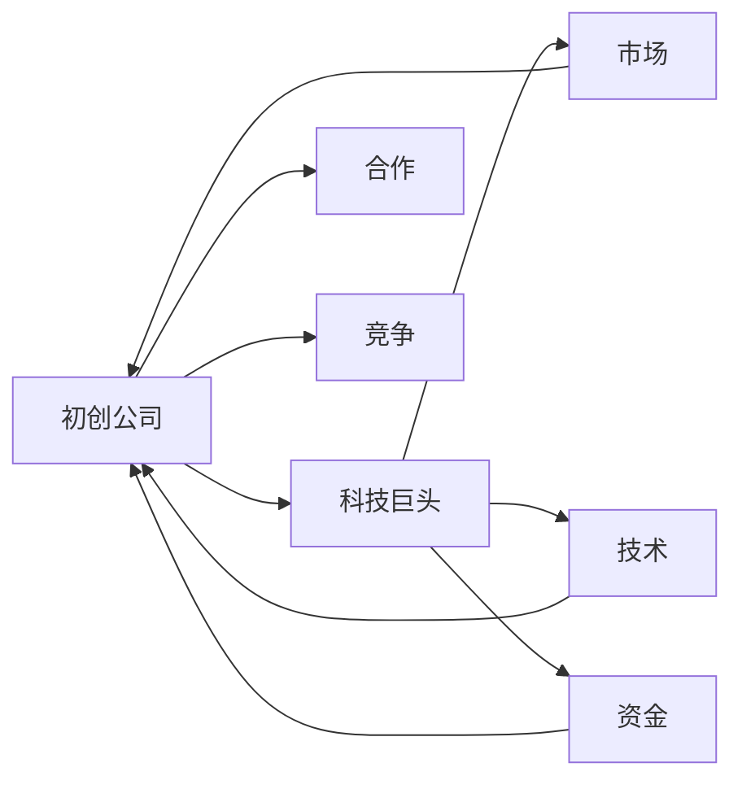

                 

## 1. 背景介绍

在科技领域，特别是人工智能(AI)领域，初创公司与科技巨头之间的竞争日趋激烈。科技巨头如Google、Amazon、Microsoft等，凭借雄厚的技术积累和巨大的财力资源，长期占据市场主导地位。然而，随着AI技术的不断进步和商业应用场景的不断丰富，初创公司凭借其灵活性、创新性以及快速迭代的能力，在某些细分领域中取得了突破性的进展。本文旨在探讨初创公司在AI领域与科技巨头竞争的策略和方法，为初创公司提供参考和借鉴。

## 2. 核心概念与联系

### 2.1 核心概念概述

要理解初创公司如何在AI领域与科技巨头竞争，首先需要明确以下几个核心概念：

- **初创公司**：通常指成立时间较短，规模较小，但拥有创新技术或商业模式的科技公司。
- **科技巨头**：指在特定科技领域具有主导地位的大公司，通常拥有强大的技术研发能力和丰富的市场资源。
- **AI领域**：包括机器学习、自然语言处理、计算机视觉、机器人等子领域，涉及数据的收集、处理、分析和应用。
- **竞争**：指不同企业之间在市场、技术、人才、资金等资源争夺中的较量。
- **合作**：指企业之间在某些领域或项目上的共同研发或市场布局，以实现互利共赢。

这些概念通过以下Mermaid流程图展示它们之间的关系：



### 2.2 概念间的关系

以上述核心概念为基础，我们可以构建一个初创公司与科技巨头在AI领域竞争的总体架构：

- **市场竞争**：初创公司通过提供独特的产品或服务，争夺科技巨头的市场份额。
- **技术合作**：初创公司与科技巨头在某些技术领域进行合作，共享研发成果或技术资源。
- **人才争夺**：初创公司通过提供更具吸引力的薪酬和职业发展机会，吸引科技巨头的人才。
- **资金竞争**：初创公司通过引入外部投资或众筹等方式，获取更多资金支持。

## 3. 核心算法原理 & 具体操作步骤

### 3.1 算法原理概述

初创公司在AI领域与科技巨头竞争的核心在于技术创新和快速迭代。竞争的胜利不仅依赖于技术的先进性，还依赖于产品的市场适应性和灵活性。在技术层面上，初创公司应专注于以下几个方面：

- **数据处理和模型训练**：构建高效的数据处理管道和高效的模型训练算法，缩短从数据到模型的转化时间。
- **算法优化**：针对特定应用场景，对现有算法进行优化，提升模型精度和速度。
- **模型部署和优化**：将模型高效部署到不同的平台和设备上，通过超参数调整和模型压缩等技术，提升模型性能和效率。

### 3.2 算法步骤详解

以下是初创公司在AI领域竞争的算法详细步骤：

1. **数据收集和预处理**：
    - 确定所需数据集和数据格式，确保数据的完整性和多样性。
    - 进行数据清洗和标注，去除噪声和异常值，确保数据质量。

2. **模型构建和训练**：
    - 选择合适的模型架构，如卷积神经网络(CNN)、循环神经网络(RNN)或变分自编码器(VAE)。
    - 设置合适的超参数，如学习率、批量大小、优化器等，进行模型训练。
    - 使用交叉验证等技术，评估模型性能，进行模型调优。

3. **模型优化和部署**：
    - 使用模型压缩和量化等技术，优化模型大小和计算速度。
    - 将模型部署到云平台、边缘设备等不同环境中，确保模型在实际应用中的性能。
    - 进行A/B测试等实验，评估模型在不同环境下的表现，并进行迭代优化。

### 3.3 算法优缺点

初创公司与科技巨头在AI领域竞争时，算法的优缺点如下：

- **优点**：
  - 灵活性高：初创公司规模小，决策迅速，可以快速适应市场变化和客户需求。
  - 创新能力强：初创公司拥有更多的自由度，可以大胆尝试新算法和新模型，推动技术前沿。
  - 成本控制：初创公司规模较小，开发和运营成本相对较低，可以投入更多资源用于研发。

- **缺点**：
  - 技术积累不足：初创公司缺乏长期积累的技术基础和资源，在面对复杂问题时可能力不从心。
  - 市场影响力有限：初创公司品牌知名度和市场份额较小，难以与科技巨头形成竞争优势。
  - 人才储备不足：初创公司规模较小，难以吸引和留住顶尖人才。

### 3.4 算法应用领域

初创公司在AI领域的应用主要集中在以下几个领域：

- **自然语言处理(NLP)**：包括机器翻译、情感分析、文本分类等。
- **计算机视觉(CV)**：包括图像识别、目标检测、人脸识别等。
- **机器人与自动化**：包括无人驾驶、智能家居、工业自动化等。
- **推荐系统**：包括个性化推荐、搜索排序等。
- **数据安全与隐私保护**：包括数据加密、数据脱敏、隐私计算等。

## 4. 数学模型和公式 & 详细讲解  
### 4.1 数学模型构建

初创公司在AI领域竞争时，通常需要构建以下数学模型：

- **数据集**：$D = \{(x_i, y_i)\}_{i=1}^N$，其中 $x_i$ 为输入数据，$y_i$ 为标签。
- **损失函数**：$L(\theta) = \frac{1}{N} \sum_{i=1}^N l(y_i, M_{\theta}(x_i))$，其中 $M_{\theta}$ 为模型，$l$ 为损失函数，通常为交叉熵损失。
- **优化器**：$G(\theta) = -\nabla_{\theta} L(\theta)$，其中 $\nabla$ 为梯度运算符。

### 4.2 公式推导过程

以分类任务为例，假设模型 $M_{\theta}$ 输出为 $P(y_i | x_i)$，真实标签为 $y_i$，则交叉熵损失函数为：

$$
L(\theta) = -\frac{1}{N} \sum_{i=1}^N \sum_{j=1}^K y_{i,j} \log P(y_j | x_i)
$$

其中 $K$ 为类别数，$y_{i,j}$ 为标签 $y_i$ 的one-hot编码。通过梯度下降算法，模型参数 $\theta$ 的更新公式为：

$$
\theta \leftarrow \theta - \eta \nabla_{\theta} L(\theta)
$$

其中 $\eta$ 为学习率。

### 4.3 案例分析与讲解

以图像分类任务为例，假设有100张猫和狗的图像数据，其中50张为猫，50张为狗。采用卷积神经网络(CNN)模型进行训练，损失函数为交叉熵。训练过程中，通过反向传播算法计算梯度，并使用SGD优化器更新模型参数，最终得到最优模型。

## 5. 项目实践：代码实例和详细解释说明

### 5.1 开发环境搭建

初创公司进行AI项目实践时，需要搭建相应的开发环境。以下是搭建环境的详细步骤：

1. **安装编程语言**：如Python，确保安装版本与项目要求一致。
2. **安装相关库**：如TensorFlow、PyTorch、Keras等，使用pip或conda安装。
3. **配置开发环境**：如使用Docker、Jupyter Notebook等工具，方便代码管理和协作。

### 5.2 源代码详细实现

以下是一个简单的卷积神经网络(CNN)模型的Python代码实现：

```python
import tensorflow as tf

# 定义模型
class CNNModel(tf.keras.Model):
    def __init__(self):
        super(CNNModel, self).__init__()
        self.conv1 = tf.keras.layers.Conv2D(32, 3, activation='relu')
        self.pool1 = tf.keras.layers.MaxPooling2D(2, 2)
        self.conv2 = tf.keras.layers.Conv2D(64, 3, activation='relu')
        self.pool2 = tf.keras.layers.MaxPooling2D(2, 2)
        self.flatten = tf.keras.layers.Flatten()
        self.dense1 = tf.keras.layers.Dense(64, activation='relu')
        self.dense2 = tf.keras.layers.Dense(10, activation='softmax')

    def call(self, x):
        x = self.conv1(x)
        x = self.pool1(x)
        x = self.conv2(x)
        x = self.pool2(x)
        x = self.flatten(x)
        x = self.dense1(x)
        x = self.dense2(x)
        return x

# 加载数据集
(x_train, y_train), (x_test, y_test) = tf.keras.datasets.cifar10.load_data()

# 数据预处理
x_train = x_train / 255.0
x_test = x_test / 255.0

# 构建模型
model = CNNModel()

# 编译模型
model.compile(optimizer='adam', loss='sparse_categorical_crossentropy', metrics=['accuracy'])

# 训练模型
model.fit(x_train, y_train, epochs=10, validation_data=(x_test, y_test))
```

### 5.3 代码解读与分析

上述代码实现了简单的CNN模型，用于图像分类任务。以下是代码关键部分的解释：

- **模型定义**：首先定义了卷积层、池化层、全连接层等基本组件。
- **数据加载**：使用CIFAR-10数据集，将其分为训练集和测试集。
- **数据预处理**：将图像像素值归一化到0-1之间，以保证模型训练的稳定性。
- **模型编译**：使用Adam优化器和交叉熵损失函数，进行模型编译。
- **模型训练**：使用fit函数进行模型训练，设置训练轮数和验证集。

### 5.4 运行结果展示

训练完成后，可以使用evaluate函数评估模型性能：

```python
# 评估模型
model.evaluate(x_test, y_test)
```

## 6. 实际应用场景

### 6.1 自然语言处理(NLP)

初创公司在NLP领域的应用主要集中在以下几个方面：

- **机器翻译**：如谷歌的DeepL翻译、Microsoft的Translatator等，利用神经机器翻译(NMT)技术进行多语言翻译。
- **情感分析**：如Salesforce的Einstein，通过文本分类技术分析用户情感。
- **文本生成**：如OpenAI的GPT-3，利用生成对抗网络(GAN)技术生成高质量文本。

### 6.2 计算机视觉(CV)

初创公司在CV领域的应用主要集中在以下几个方面：

- **图像识别**：如Google的Inception，利用深度神经网络进行图像分类。
- **目标检测**：如Amazon的Detectron，利用区域提议网络(RPN)进行目标检测。
- **人脸识别**：如微软的FaceNet，利用深度学习技术进行人脸识别。

### 6.3 推荐系统

初创公司在推荐系统领域的应用主要集中在以下几个方面：

- **个性化推荐**：如Netflix的推荐算法，利用协同过滤和内容推荐技术，提升用户体验。
- **搜索引擎优化(搜索引擎)**：如百度的搜索算法，利用深度学习技术进行搜索结果排序。

### 6.4 未来应用展望

未来，初创公司在AI领域的应用将更加广泛，涵盖更多的领域和场景。以下是一些未来应用展望：

- **自动驾驶**：利用计算机视觉和机器学习技术，实现无人驾驶汽车。
- **智能家居**：利用自然语言处理和计算机视觉技术，实现智能家居设备。
- **工业自动化**：利用机器人技术和机器学习技术，实现工业生产自动化。

## 7. 工具和资源推荐

### 7.1 学习资源推荐

初创公司可以通过以下学习资源，提升AI领域的技术能力：

- **在线课程**：如Coursera、edX等平台提供的数据科学和机器学习课程。
- **开源项目**：如GitHub上的TensorFlow、PyTorch等项目，提供丰富的代码示例和实践机会。
- **书籍**：如《深度学习》（Ian Goodfellow）、《机器学习实战》（Peter Harrington）等。

### 7.2 开发工具推荐

初创公司可以通过以下开发工具，提升AI项目开发效率：

- **IDE**：如PyCharm、Jupyter Notebook等，支持Python开发。
- **版本控制**：如Git、GitHub等，进行代码管理和版本控制。
- **数据处理**：如Pandas、NumPy等，进行数据处理和分析。

### 7.3 相关论文推荐

初创公司可以通过以下论文，了解AI领域的前沿技术和研究方向：

- **深度学习**：《深度学习》（Ian Goodfellow）、《神经网络与深度学习》（Michael Nielsen）等。
- **计算机视觉**：《计算机视觉：模型、学习和推理》（Simon J.D. Prince）、《神经网络与深度学习》（Michael Nielsen）等。
- **自然语言处理**：《自然语言处理综论》（Daniel Jurafsky、James H. Martin）、《深度学习与自然语言处理》（Yoshua Bengio、Ian Goodfellow）等。

## 8. 总结：未来发展趋势与挑战

### 8.1 研究成果总结

本文探讨了初创公司如何在AI领域与科技巨头竞争的策略和方法。主要结论如下：

- 初创公司应专注于技术创新和快速迭代，灵活应对市场变化和客户需求。
- 初创公司应利用数据处理和模型训练技术，提升模型精度和速度。
- 初创公司应关注模型部署和优化，确保模型在实际应用中的性能。

### 8.2 未来发展趋势

未来，初创公司在AI领域的发展趋势如下：

- **技术创新**：初创公司应持续进行技术创新，推动AI技术的突破。
- **市场拓展**：初创公司应积极拓展市场，提升品牌影响力和市场份额。
- **人才培养**：初创公司应吸引和留住顶尖人才，提升团队的技术实力。

### 8.3 面临的挑战

初创公司在AI领域的发展面临以下挑战：

- **技术壁垒**：初创公司需要突破现有的技术壁垒，提升技术实力。
- **资金压力**：初创公司需要获取足够的资金支持，进行持续研发。
- **市场竞争**：初创公司需要应对来自科技巨头的激烈竞争。

### 8.4 研究展望

未来，初创公司在AI领域的研究方向如下：

- **多模态学习**：结合图像、语音、文本等多种模态信息，提升AI系统的综合能力。
- **联邦学习**：在保护数据隐私的前提下，利用联邦学习技术进行模型训练。
- **边缘计算**：利用边缘计算技术，提升AI系统的实时性。

## 9. 附录：常见问题与解答

### Q1：初创公司如何进行市场调研？

A: 初创公司可以通过以下步骤进行市场调研：
1. 确定目标市场和客户需求。
2. 收集市场数据和竞争情报。
3. 分析市场趋势和机会。
4. 制定市场策略和计划。

### Q2：初创公司如何吸引投资？

A: 初创公司可以通过以下方式吸引投资：
1. 完善商业计划书，明确商业模式和市场潜力。
2. 寻找潜在的投资机构和天使投资人。
3. 参加创业大赛和展会，提升曝光率。
4. 利用众筹平台，进行资金募集。

### Q3：初创公司如何进行人才招聘？

A: 初创公司可以通过以下方式进行人才招聘：
1. 发布招聘广告，通过社交媒体和招聘网站吸引人才。
2. 参加招聘会和行业交流活动，扩大人才网络。
3. 提供有竞争力的薪酬和职业发展机会，吸引顶尖人才。
4. 建立人才发展机制，提供培训和晋升机会。

### Q4：初创公司如何进行产品迭代？

A: 初创公司可以通过以下方式进行产品迭代：
1. 收集用户反馈，了解产品不足和改进方向。
2. 进行A/B测试，验证改进效果。
3. 进行小规模试点，逐步推广改进功能。
4. 定期进行产品评估，进行持续改进。

---

作者：禅与计算机程序设计艺术 / Zen and the Art of Computer Programming

