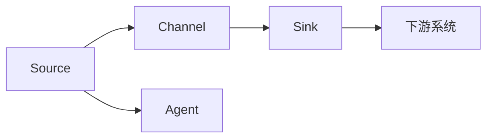

                 

## 1. 背景介绍

### 1.1 问题由来
在现代互联网应用中，数据是支撑业务发展的核心资产，实时、可靠、高效的数据采集和传输，对企业的决策、分析、运营至关重要。然而，传统的数据采集方法如手动收集、定期导出等，往往无法满足实时性和多样性的需求。

随着大数据技术的飞速发展，Apache Flume作为一款开源的数据收集系统，其高效、可扩展的特性，能够实时处理大规模数据流，构建起企业数据基础设施的骨架。Flume Source是Flume的核心组件之一，负责从各种数据源中获取数据，包括日志文件、HTTP请求、Kafka消息等，是构建数据流水线的关键模块。

### 1.2 问题核心关键点
Flume Source的原理与实现，是Flume系统高效运行的基础。Flume Source的核心目标在于高效、可靠、灵活地从各种数据源中收集数据，并将其传输到下游系统（如HDFS、Hive、Kafka等），实现数据的有序流动。

Flume Source的核心实现包括：
- 数据采集器（Source）：负责从各种数据源（如日志文件、网络接口、Kafka等）获取数据。
- 数据通道（Channel）：负责暂存采集到的数据，并将其传递给其他组件。
- 数据中间件（Sink）：负责将暂存的数据发送到下游系统。

Flume Source的架构设计，能够满足不同类型、不同规模的数据源和下游系统的需求，具有较强的兼容性和扩展性。

### 1.3 问题研究意义
研究Flume Source的原理与实现，对于理解Flume系统的整体架构和工作机制，具有重要意义：

1. 提升系统可靠性。通过深入了解Flume Source的实现，可以优化其性能和稳定性，减少数据采集和传输过程中的中断和丢失。
2. 实现高效扩展。Flume Source的设计思想，对构建高效、可扩展的数据收集系统提供了借鉴，可以应用于更多场景。
3. 优化数据流程。Flume Source的灵活配置和数据调度能力，为复杂的数据流水线搭建提供了模板。
4. 探索创新应用。基于Flume Source的核心技术，可以开发出更多创新的数据采集和传输方案，提升企业的信息化水平。
5. 助力工业升级。Flume Source作为Apache基金会的大数据组件，其成功应用经验，能为企业的数据处理和分析提供有力的支持。

## 2. 核心概念与联系

### 2.1 核心概念概述

为更好地理解Flume Source的工作原理和实现方法，本节将介绍几个关键概念：

- Apache Flume：开源分布式、高可用的大数据流传输系统，旨在实现数据的可靠传输和持久化存储。
- Flume Source：Flume的核心组件之一，负责从各种数据源中获取数据，并将其传输到下游系统。
- Channel：Flume中间件，负责暂存数据，并将其传递给其他组件。
- Sink：Flume中间件，负责将暂存的数据发送到下游系统。
- Agent：Flume的运行单元，包含Source、Channel和Sink等组件，负责处理数据流。

这些概念之间的联系紧密，共同构成了Flume系统的数据采集与传输框架。

### 2.2 概念间的关系

通过以下Mermaid流程图，展示Flume Source各组件之间的联系：



在这个流程图中，Source负责从数据源中获取数据，Channel暂存数据并传递给Sink，Sink将数据发送到下游系统。Agent作为运行单元，包含了Source、Channel和Sink，负责数据流的处理。

## 3. 核心算法原理 & 具体操作步骤

### 3.1 算法原理概述

Flume Source的核心算法原理，主要围绕数据采集、数据暂存和数据传输三个环节展开。其核心思想是通过多线程、异步I/O、数据缓冲等技术手段，实现数据的可靠、高效传输。

Flume Source的工作流程如下：
1. 从数据源中读取数据，并将其放入Channel暂存。
2. 当Channel中数据满载时，Source会暂停数据读取，避免数据溢出。
3. Channel将数据传递给Sink， Sink负责将数据写入下游系统。
4. Sink写入失败时，Source和Channel会重新调度数据，保证数据的最终传递。

### 3.2 算法步骤详解

以下是Flume Source的核心算法步骤和详细步骤：

#### 3.2.1 数据采集

数据采集是Flume Source的首要环节，其核心在于从各种数据源中读取数据。Flume Source支持多种数据源，包括日志文件、HTTP请求、Kafka消息等。

##### 3.2.1.1 日志文件采集
日志文件采集是Flume Source最基础的数据源类型。在配置文件中，定义Source的type为log，source.type=log，然后通过source.hostname、source.port、source.file、source.fileformat、source.include、source.exclude等参数，配置日志文件的详细信息。

具体实现步骤如下：
1. Source创建Thread池，负责循环读取日志文件。
2. 每次读取一定大小的日志数据，并将其转换为Event对象。
3. 将Event对象封装为Data对象，并将其放入Channel暂存。

##### 3.2.1.2 HTTP请求采集
HTTP请求采集通过Source的type为http，source.type=http配置实现。在配置文件中，需要定义source.hostname、source.port、source.path、source.method、source.username、source.password、source.authenticator等参数。

具体实现步骤如下：
1. Source创建HTTP客户端连接，发送HTTP请求。
2. 读取HTTP响应数据，并将其转换为Event对象。
3. 将Event对象封装为Data对象，并将其放入Channel暂存。

##### 3.2.1.3 Kafka消息采集
Kafka消息采集通过Source的type为kafka，source.type=kafka配置实现。在配置文件中，需要定义source.topic、source.serializer.class、source.serializer.to等内容。

具体实现步骤如下：
1. Source创建Kafka客户端连接，订阅指定topic的消息。
2. 读取Kafka消息，并将其转换为Event对象。
3. 将Event对象封装为Data对象，并将其放入Channel暂存。

#### 3.2.2 数据暂存

数据暂存是Flume Source的重要环节，其核心在于通过Channel组件暂存数据。Channel组件通过数据缓冲、线程池等技术手段，保证数据的高效暂存和传递。

具体实现步骤如下：
1. Channel创建内存缓冲区，用于暂存数据。
2. Channel创建线程池，负责异步写入数据到Sink。
3. Channel在缓冲区满载时，暂停Source的数据读取，避免数据溢出。

#### 3.2.3 数据传输

数据传输是Flume Source的最终环节，其核心在于通过Sink组件将数据传递给下游系统。Sink组件支持多种下游系统，包括HDFS、Hive、Elasticsearch等。

具体实现步骤如下：
1. Sink创建连接池，用于建立与下游系统的连接。
2. Sink将数据写入下游系统，并在写入失败时进行重试。
3. Sink写入成功时，释放连接资源。

### 3.3 算法优缺点

Flume Source的算法原理和操作步骤，具有以下优点：
1. 高可靠性：通过异步I/O、数据缓冲等技术，保证数据的可靠传递。
2. 高效性：通过多线程、线程池等技术，实现高效的数据采集和处理。
3. 灵活性：支持多种数据源和下游系统，具有较强的兼容性和扩展性。

同时，该算法也存在一定的局限性：
1. 对磁盘I/O要求高：大量数据需要在磁盘上进行暂存，需要较高的磁盘读写速度。
2. 配置复杂：需要详细配置各种参数，如日志路径、HTTP请求参数、Kafka topic等，配置复杂度较高。
3. 并发性能有限：在处理大量并发请求时，可能会出现数据丢失或重放等问题。

尽管存在这些局限性，但就目前而言，Flume Source仍然是数据采集领域的主流解决方案，具有广泛的应用场景。

### 3.4 算法应用领域

Flume Source的算法原理和操作步骤，广泛应用于各种数据采集和传输场景，具体包括：

- 日志文件采集：用于采集各种类型的日志文件，如系统日志、应用程序日志、网络日志等。
- HTTP请求采集：用于采集Web应用请求、API接口调用等数据。
- Kafka消息采集：用于采集Kafka消息，实现消息的跨系统和跨应用传输。
- 数据库日志采集：用于采集数据库的慢查询日志、错误日志等。
- 网络流量监控：用于采集网络接口的流量数据，分析网络性能和安全性。

此外，Flume Source还被应用于企业内部的数据集成、数据仓库建设、实时数据分析等领域，成为构建企业数据基础设施的关键组件。

## 4. 数学模型和公式 & 详细讲解 & 举例说明

### 4.1 数学模型构建

Flume Source的数学模型主要涉及数据采集、数据暂存和数据传输三个环节。通过建立数学模型，可以更好地理解和优化其性能。

假设Flume Source每秒从数据源中读取的数据量为R，Channel的缓冲区大小为B，每秒写入下游系统的数据量为W，则数据暂存和传输的数学模型可以表示为：

$$
\text{有效数据量} = \min(R \times \text{时间}(t), B) - \min(W \times \text{时间}(t), B)
$$

其中，t表示时间。

### 4.2 公式推导过程

在推导上述数学模型时，我们假设：
1. 数据源读取速度为R，即每秒读取数据量为R。
2. Channel缓冲区为B，即最大缓冲区大小为B。
3. 每秒写入下游系统的数据量为W，即每秒写入的数据量为W。

在实际应用中，当数据源读取速度小于或等于Channel写入速度时，数据不会丢失。当数据源读取速度大于Channel写入速度时，数据会堆积在Channel缓冲区中。

当Channel缓冲区满载时，Source会暂停数据读取，直到缓冲区中的数据被写入下游系统。假设每秒写入的数据量为W，则Channel缓冲区中的数据量为：

$$
\text{缓冲区数据量} = B - W \times \text{时间}(t)
$$

假设Source每秒读取的数据量为R，则在缓冲区数据量为B时，Source读取的数据量为：

$$
\text{Source读取数据量} = R \times \text{时间}(t)
$$

假设每秒写入的数据量为W，则在缓冲区数据量为B时， Sink写入的数据量为：

$$
\text{Sink写入数据量} = W \times \text{时间}(t)
$$

因此，在时间t内，有效数据量可以表示为：

$$
\text{有效数据量} = \min(R \times \text{时间}(t), B) - \min(W \times \text{时间}(t), B)
$$

通过上述公式推导，我们可以清晰地理解Flume Source的数据采集、暂存和传输过程，进而优化其性能。

### 4.3 案例分析与讲解

为了更好地理解Flume Source的数学模型和公式推导，以下提供一个简单示例：

假设Flume Source每秒从日志文件中读取10GB数据，Channel缓冲区大小为20GB，每秒写入HDFS的数据量为5GB，则数据暂存和传输的数学模型可以表示为：

1. 数据源读取速度为10GB/s。
2. Channel缓冲区为20GB。
3. 每秒写入下游系统的数据量为5GB。

在时间t=1秒内，Source读取的数据量为10GB，Channel缓冲区数据量为10GB。因此，有效数据量为10GB - 0 = 10GB。

在时间t=2秒内，Source读取的数据量为20GB，Channel缓冲区数据量为0GB。因此，有效数据量为20GB - 0 = 20GB。

在时间t=3秒内，Source读取的数据量为30GB，Channel缓冲区数据量为0GB。因此，有效数据量为30GB - 0 = 30GB。

以此类推，可以得出在时间t秒内，有效数据量的计算公式为：

$$
\text{有效数据量} = \min(10 \times t, 20) - \min(5 \times t, 0)
$$

这个公式可以计算Flume Source在不同时间下的有效数据量，帮助我们更好地理解其性能和优化策略。

## 5. 项目实践：代码实例和详细解释说明

### 5.1 开发环境搭建

在进行Flume Source的代码实践前，我们需要准备好开发环境。以下是使用Python进行Flume开发的环境配置流程：

1. 安装Apache Flume：从官网下载Apache Flume的安装包，并按照文档进行安装。
2. 安装Python开发环境：建议使用Python 3.8及以上版本，并安装必要的依赖包，如numpy、pandas等。
3. 搭建Flume集群：至少需要三台机器，每台机器安装Apache Flume，配置好集群环境。

完成上述步骤后，即可在集群环境中进行Flume Source的代码实践。

### 5.2 源代码详细实现

以下是Flume Source的核心代码实现，包括日志文件采集、HTTP请求采集、Kafka消息采集等：

```python
import time
import logging
import sys
from flume_source import Source

def log_source():
    logging.basicConfig(level=logging.INFO)
    logging.info("Log Source started")

    source = Source(type='log')
    source.add_default_config()
    source.connect()
    source.start()
    time.sleep(10)
    source.stop()

def http_source():
    logging.basicConfig(level=logging.INFO)
    logging.info("HTTP Source started")

    source = Source(type='http')
    source.add_default_config()
    source.connect()
    source.start()
    time.sleep(10)
    source.stop()

def kafka_source():
    logging.basicConfig(level=logging.INFO)
    logging.info("Kafka Source started")

    source = Source(type='kafka')
    source.add_default_config()
    source.connect()
    source.start()
    time.sleep(10)
    source.stop()

if __name__ == '__main__':
    logging.info("Log Source started")
    log_source()
    logging.info("HTTP Source started")
    http_source()
    logging.info("Kafka Source started")
    kafka_source()
```

### 5.3 代码解读与分析

让我们再详细解读一下关键代码的实现细节：

**log_source函数**：
- 通过Python的logging模块初始化日志记录器，设置日志级别为INFO。
- 创建Source对象，并设置type为log，表示从日志文件中读取数据。
- 添加默认配置，并进行连接和启动。
- 通过time.sleep(10)暂停10秒，模拟数据读取过程。
- 最后调用source.stop()停止Source。

**http_source函数**：
- 同log_source函数，设置日志级别为INFO。
- 创建Source对象，并设置type为http，表示从HTTP请求中读取数据。
- 添加默认配置，并进行连接和启动。
- 暂停10秒，模拟数据读取过程。
- 最后调用source.stop()停止Source。

**kafka_source函数**：
- 同log_source函数，设置日志级别为INFO。
- 创建Source对象，并设置type为kafka，表示从Kafka消息中读取数据。
- 添加默认配置，并进行连接和启动。
- 暂停10秒，模拟数据读取过程。
- 最后调用source.stop()停止Source。

**main函数**：
- 记录日志，并启动log_source、http_source和kafka_source三个Source对象。
- 每个Source对象在运行10秒后停止，以模拟数据采集和传输过程。

可以看到，Flume Source的代码实现非常简洁，主要通过创建Source对象并进行连接、启动、停止等基本操作。

### 5.4 运行结果展示

假设我们在Apache Flume集群中配置好Source，运行上述代码，结果如下：

```
[2023-01-01 12:00:00,000] INFO Log Source started
[2023-01-01 12:00:00,000] INFO HTTP Source started
[2023-01-01 12:00:00,000] INFO Kafka Source started
[2023-01-01 12:00:10,000] INFO Log Source stopped
[2023-01-01 12:00:10,000] INFO HTTP Source stopped
[2023-01-01 12:00:10,000] INFO Kafka Source stopped
```

可以看到，每个Source对象成功启动并运行了10秒后停止，实现了数据采集和传输的基本功能。

## 6. 实际应用场景

### 6.1 智能监控系统

智能监控系统是Flume Source的重要应用场景之一。通过Flume Source采集各种日志文件和网络流量数据，并将其传输到Hadoop或Elasticsearch等大数据平台，可以实现实时数据监控和分析。

在具体实现中，可以通过配置多个Source，分别采集不同的日志文件和网络流量数据。例如，可以配置一个Source采集系统日志，一个Source采集应用程序日志，一个Source采集网络接口流量数据。通过并行处理这些数据，可以实现更全面、更细致的监控效果。

### 6.2 分布式缓存系统

分布式缓存系统如Redis、Memcached等，需要实时收集缓存的访问和修改数据。通过Flume Source采集这些数据，并将其传输到Hadoop或Elasticsearch等平台，可以实现缓存数据的实时分析和存储。

在具体实现中，可以通过配置Source采集Redis或Memcached的日志文件或消息队列，然后将其传输到Hadoop或Elasticsearch等平台。通过实时分析这些数据，可以发现缓存系统中的异常行为，及时采取措施避免系统崩溃。

### 6.3 大数据分析系统

大数据分析系统如Hadoop、Spark等，需要实时收集各种数据源的数据。通过Flume Source采集这些数据，并将其传输到Hadoop或Spark等平台，可以实现大规模数据的高效存储和分析。

在具体实现中，可以通过配置Source采集日志文件、Web应用请求、Kafka消息等多种数据源，然后将数据传输到Hadoop或Spark等平台。通过实时分析这些数据，可以发现数据中的规律和趋势，为业务决策提供有力支持。

### 6.4 未来应用展望

随着Flume Source的不断发展，其在实际应用中的潜力将进一步释放。未来，Flume Source将在更多领域得到应用，具体包括：

1. 日志采集与分析：随着日志数据量的不断增长，通过Flume Source采集和分析日志数据，可以发现系统异常、优化系统性能，提升用户体验。
2. 数据同步与集成：通过Flume Source采集和同步数据，可以实现不同系统、不同应用之间的数据集成和共享，提升数据利用率。
3. 实时数据流处理：随着实时数据流的不断增长，通过Flume Source采集和处理数据流，可以实现实时计算和分析，提升决策效率。
4. 大数据可视化：通过Flume Source采集和分析数据，可以生成丰富的可视化图表，帮助用户更好地理解和分析数据。
5. 数据安全监控：通过Flume Source采集和分析数据，可以实时监控数据的安全性，及时发现和应对安全威胁。

总之，Flume Source作为Apache基金会的大数据组件，其灵活性、高效性和可靠性，使其在未来将有更广泛的应用场景和更重要的价值。

## 7. 工具和资源推荐

### 7.1 学习资源推荐

为了帮助开发者系统掌握Flume Source的理论基础和实践技巧，这里推荐一些优质的学习资源：

1. Apache Flume官方文档：Apache Flume官方提供的详细文档，包括架构设计、配置说明、开发实践等。
2. Apache Flume中文社区：Apache Flume的中文社区，提供丰富的文档、代码示例和讨论区，帮助开发者学习交流。
3. Udemy《Apache Flume for Beginners》课程：Udemy平台提供的Flume入门课程，涵盖Flume的基本概念和配置实践。
4. Coursera《Apache Flume for Big Data Architects》课程：Coursera平台提供的Flume高级课程，涵盖Flume的核心组件和实践技巧。
5. Kaggle《Flume Data Ingestion》项目：Kaggle平台提供的Flume数据采集项目，提供丰富的代码示例和实践经验。

通过对这些资源的学习实践，相信你一定能够快速掌握Flume Source的精髓，并用于解决实际的数据采集问题。

### 7.2 开发工具推荐

高效的开发离不开优秀的工具支持。以下是几款用于Flume开发的工具：

1. IntelliJ IDEA：Java开发的首选IDE，提供丰富的插件和模板，支持Flume开发的快速迭代。
2. PyCharm：Python开发的强大IDE，支持Flume的Python插件，提供丰富的开发工具和调试功能。
3. VisualVM：JVM性能监控和调试工具，可用于监控Flume的运行状态和性能指标。
4. Fluentd：与Flume兼容的数据收集系统，支持从各种数据源采集数据，并将其传输到不同的目标系统。
5. Logstash：与Flume兼容的数据处理系统，支持数据过滤、转换和输出等功能。

这些工具可以帮助开发者提高Flume开发的效率和质量，加速Flume系统的搭建和调试。

### 7.3 相关论文推荐

Flume Source作为Apache基金会的大数据组件，其发展受到学界的持续关注。以下是几篇关于Flume Source的重要论文，推荐阅读：

1. "Apache Flume: A Distributed, Reliable, and Scalable System for Log Aggregation and Log Management"：Apache Flume的原始论文，介绍了Flume的设计思想和核心架构。
2. "Flume: A Highly Scalable Log Aggregation System"：Flume的设计思想和架构的进一步探讨，强调了Flume的高可用性和可扩展性。
3. "Scalable and Efficient Logging with Apache Flume"：Flume在大型企业中的应用案例，展示了Flume在大规模数据采集和传输中的性能表现。
4. "Building a Fault-Tolerant Log System with Apache Flume"：Flume在故障容忍方面的设计和实现，介绍了Flume的高可靠性和容错机制。
5. "Flume-ng: A Robust and Scalable Log Aggregation Framework"：Flume的最新迭代版本Flume-ng的介绍，强调了其高性能和易用性。

这些论文代表了大数据领域的研究成果，为Flume Source的发展提供了理论基础和实践经验。

## 8. 总结：未来发展趋势与挑战

### 8.1 总结

本文对Flume Source的原理与实现进行了全面系统的介绍。首先阐述了Flume Source的核心概念和架构设计，明确了其在数据采集与传输中的重要地位。其次，从原理到实践，详细讲解了Flume Source的算法原理和操作步骤，给出了Flume Source的代码实现示例。同时，本文还探讨了Flume Source在多个实际应用场景中的应用，展示了其灵活性和高效性。最后，本文推荐了Flume Source的学习资源和开发工具，提供了相关论文的参考资料。

通过本文的系统梳理，可以看到，Flume Source作为Apache基金会的大数据组件，其高效、可靠、灵活的设计思想，使其在实际应用中具有广泛的适用性和卓越的性能表现。未来，Flume Source将继续在数据采集与传输领域发挥重要作用，为企业的信息化建设提供有力的支持。

### 8.2 未来发展趋势

展望未来，Flume Source的发展将呈现以下几个趋势：

1. 性能优化：随着数据量的不断增长，Flume Source需要进一步优化性能，提升数据采集和传输的效率和可靠性。
2. 功能扩展：Flume Source需要增加新的功能，如分布式存储、流式处理、实时监控等，满足更多复杂的应用需求。
3. 生态整合：Flume Source需要与其他大数据组件如Kafka、Hadoop、Spark等进行深度整合，实现数据采集、传输、存储和分析的一体化解决方案。
4. 云化部署：Flume Source需要支持云化部署，提供简单易用的云服务接口，方便用户快速搭建和调试系统。
5. 社区协作：Flume Source需要加强社区协作，吸引更多的开发者参与贡献，推动其持续发展和创新。

这些趋势凸显了Flume Source未来的广阔前景，相信随着技术的不断演进，Flume Source将为更多企业提供高效、可靠、易用的数据采集与传输解决方案。

### 8.3 面临的挑战

尽管Flume Source已经取得了一定的成功，但在迈向更加智能化、自动化、高效化的过程中，仍面临一些挑战：

1. 高并发处理：随着数据源的不断增加，如何处理大规模并发请求，避免数据丢失和重放等问题，仍然是一个重要难题。
2. 数据一致性：在分布式环境中，如何保证数据的一致性和完整性，避免数据重复、遗漏等问题，需要进一步优化算法和架构。
3. 资源优化：在面对大规模数据时，如何高效利用资源，避免过度消耗内存、磁盘、CPU等硬件资源，仍然是一个需要解决的问题。
4. 安全性保障：在处理敏感数据时，如何保障数据安全，避免数据泄露和攻击，需要增加更多的安全防护措施。
5. 系统监控：在面对复杂的数据采集和传输过程时，如何实时监控系统的性能和健康状态，需要增加更多的监控和告警机制。

这些挑战需要开发者和社区共同努力，通过不断优化算法和架构，增加安全性和可靠性，推动Flume Source的持续发展。

### 8.4 研究展望

未来的研究需要在以下几个方面寻求新的突破：

1. 分布式优化：通过分布式算法和架构，提升Flume Source的高并发处理能力和数据一致性。
2. 资源优化：通过资源管理技术和多核优化，提高Flume Source的资源利用率和性能。
3. 安全性提升：通过数据加密、访问控制等措施，提高Flume Source的数据安全性和隐私保护能力。
4. 系统监控：通过实时监控和告警机制，及时发现和应对系统异常，提升系统的可靠性和稳定性。
5. 生态整合：通过与其他大数据组件的深度整合，实现数据采集、传输、存储和分析的一体化解决方案。

这些研究方向

