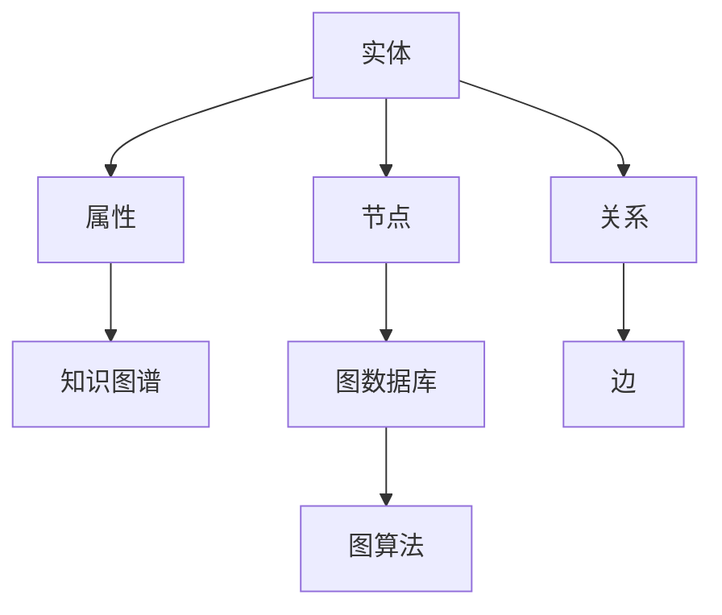

                 

# Knowledge Graphs原理与代码实例讲解

> 关键词：知识图谱,语义网络,实体关系,查询优化,图算法,代码实例

## 1. 背景介绍

### 1.1 问题由来

近年来，随着人工智能技术的迅猛发展，知识图谱(Knowledge Graph, KG)作为一种将结构化知识与自然语言处理(NLP)深度结合的技术，受到了广泛关注和应用。知识图谱是一种语义化的数据结构，用于表示实体之间的关联关系，可以有效地支持信息检索、问答系统、推荐系统等智能应用。

随着互联网和社交媒体的兴起，产生了海量的非结构化信息，如维基百科、百科全书、社交网络等。这些信息中蕴含着丰富的知识，然而传统的关系型数据库和简单的文本索引技术无法充分挖掘其中的结构化信息。知识图谱的出现，正是为了解决这一问题，使得计算机可以更好地理解并利用这些结构化知识。

### 1.2 问题核心关键点

知识图谱的核心在于其将现实世界中的实体和关系映射到计算机可理解的形式，并进行高效的查询和推理。其主要包括以下几个关键点：

- **实体与关系建模**：实体表示为节点，关系表示为边，构建语义化的图结构。
- **数据采集与整合**：从不同来源采集数据，进行去重、清洗、融合等预处理操作。
- **图数据库存储与管理**：利用图数据库高效存储和查询图数据。
- **图算法应用**：采用图算法进行图结构的查询、推理和分析。
- **应用集成**：将知识图谱与NLP、信息检索、推荐系统等技术进行深度集成。

这些关键点构成了知识图谱的核心框架，使其能够发挥强大的知识管理与智能应用能力。

### 1.3 问题研究意义

研究知识图谱，对于拓展数据驱动的智能应用边界，提升信息检索和推荐系统的准确性和效率，具有重要意义：

1. **提升信息检索效果**：知识图谱能够提供语义化的查询，在用户输入自然语言查询时，能够自动关联到相关的知识图结构，从而提高检索的准确性和相关性。
2. **增强推荐系统性能**：知识图谱包含了实体间的关联关系，能够利用这些关系进行推荐，从而提供更加个性化和精准的推荐结果。
3. **支持问答系统**：知识图谱通过构建实体间的知识网络，能够支持复杂问题的推理和回答，提高问答系统的智能水平。
4. **促进跨领域应用**：知识图谱可以应用于医疗、金融、物流、教育等多个领域，提供跨领域知识融合的能力。
5. **加速技术产业化**：知识图谱技术已经在多个产业中得到应用，加速了技术向实际应用的转化和产业化进程。

## 2. 核心概念与联系

### 2.1 核心概念概述

为了更好地理解知识图谱的原理，本节将介绍几个关键核心概念：

- **知识图谱(Knowledge Graph)**：一种语义化的图结构，用于表示实体之间的关联关系。
- **语义网络(Semantic Network)**：知识图谱的一种形式，用于表示实体与属性之间的语义关系。
- **节点(Node)**：知识图谱中的实体或属性，表示为一个符号或标签。
- **边(Edge)**：知识图谱中的关系，连接两个节点，表示实体之间的关系或属性。
- **图数据库(Graph Database)**：一种专门用于存储和管理图结构的数据库系统。
- **图算法(Graph Algorithm)**：用于对图结构进行查询、推理和分析的算法，如深度优先搜索、广度优先搜索、最短路径算法等。

这些核心概念共同构成了知识图谱的基础架构，使其能够高效地存储和管理知识图结构，并进行深度的智能应用。

### 2.2 概念间的关系

这些核心概念之间存在着紧密的联系，形成了知识图谱的整体框架。以下通过一个简化的Mermaid流程图来展示它们之间的关系：



这个流程图展示了知识图谱的各个组件及其之间的关系：

1. 实体和属性构成了知识图谱的基本单元，节点和边分别表示实体和关系。
2. 知识图谱利用图数据库进行存储，便于高效查询和管理。
3. 图算法用于对知识图谱进行深度分析和推理，支持各种智能应用。

这些概念共同构成了知识图谱的核心生态系统，使其能够发挥强大的知识管理和智能应用能力。

## 3. 核心算法原理 & 具体操作步骤
### 3.1 算法原理概述

知识图谱的查询和推理过程，主要基于图算法展开。常见的图算法包括深度优先搜索(DFS)、广度优先搜索(BFS)、最短路径算法(Dijkstra、A*等)等。

以Dijkstra算法为例，其核心思想是通过动态更新节点间的距离，寻找从一个起点到所有其他节点的最短路径。在知识图谱中，节点表示实体，边表示实体之间的关系，距离表示实体间的某种度量（如边的权重）。算法通过不断扩展距离最小的节点，逐步找到最短路径。

知识图谱的查询和推理过程，本质上是对图结构的深度遍历和信息聚合，需要通过高效的算法设计和实现，才能实现快速响应和精确结果。

### 3.2 算法步骤详解

基于Dijkstra算法，以下是一个知识图谱中最短路径的查询步骤：

1. **初始化**：设置起点到所有节点的距离为无穷大，起点到自身的距离为0，标记所有节点为未访问。
2. **遍历扩展**：选择当前距离最小的节点，将其标记为已访问，更新与其相邻节点的距离。
3. **更新距离**：对于每个相邻节点，如果通过当前节点更新后的距离更小，则更新该节点的距离，并标记为已访问。
4. **终止条件**：当所有节点都被访问，或所有目标节点都被标记为已访问，则算法结束。

具体到代码实现，可以使用优先队列(Priority Queue)来存储当前距离最小的节点，并通过动态更新节点距离，实现最短路径的计算。

### 3.3 算法优缺点

知识图谱的查询和推理算法具有以下优点：

- **高效性**：利用图数据结构的特点，能够快速定位和查询相关实体，适用于大规模图数据。
- **准确性**：通过深度遍历和信息聚合，能够精确计算最短路径和其他复杂关系，支持高精度的查询和推理。
- **可扩展性**：能够支持多关系和多属性的复杂图结构，灵活应对不同应用场景。

同时，这些算法也存在一些局限性：

- **计算复杂度**：复杂的图结构可能导致算法效率低下，尤其是在大规模图数据上。
- **空间复杂度**：需要存储大量的节点和边的信息，对于内存和存储资源有较高的要求。
- **多目标优化**：在多目标优化问题中，如何平衡不同目标之间的冲突，仍是一个挑战。

尽管存在这些局限性，但通过优化算法设计和高效的数据结构，知识图谱的查询和推理算法仍能在实际应用中发挥重要作用。

### 3.4 算法应用领域

知识图谱的查询和推理算法，已经在多个领域得到广泛应用，例如：

- **信息检索**：用于构建实体间的知识网络，支持复杂查询和关联检索。
- **推荐系统**：利用实体间的关联关系，推荐相关商品或服务。
- **问答系统**：通过查询和推理，自动回答用户提出的复杂问题。
- **社交网络分析**：分析用户之间的关系和影响，进行社交关系挖掘和社区分析。
- **医疗信息管理**：利用知识图谱管理医疗数据，支持精准医疗和个性化治疗。

除了这些经典应用外，知识图谱技术还在金融、物流、教育等多个领域得到创新应用，为传统行业数字化转型升级提供了新的技术路径。

## 4. 数学模型和公式 & 详细讲解 & 举例说明

### 4.1 数学模型构建

知识图谱的数学模型主要基于图论和图数据库。假设知识图谱包含 $N$ 个节点和 $E$ 条边，节点和边分别表示为 $V=\{v_1, v_2, ..., v_N\}$ 和 $E=\{e_1, e_2, ..., e_E\}$。节点的属性表示为 $A=\{a_1, a_2, ..., a_M\}$，其中 $M$ 为属性的数量。

知识图谱的查询和推理过程，可以通过数学公式进行描述。以下是一个简单的查询示例：

- **查询目标**：查找节点 $v_1$ 与节点 $v_2$ 之间的最短路径。
- **节点表示**：$v_1$ 和 $v_2$ 分别表示为 $v_{1,i}$ 和 $v_{2,j}$，其中 $i$ 和 $j$ 表示节点的属性。
- **边表示**：$e_{u,v}$ 表示从节点 $u$ 到节点 $v$ 的关系，$w_{u,v}$ 表示边的权重。

基于以上定义，最短路径查询可以通过Dijkstra算法进行计算，具体公式如下：

$$
\text{distance}(v_i, v_j) = \begin{cases} 
0, & \text{if } v_i = v_j \\
\min(\text{distance}(v_i, v_k) + w_{v_k, v_j}), & \text{if } v_i \neq v_j \text{ and } v_j \in \text{neighbor}(v_i)
\end{cases}
$$

其中 $\text{neighbor}(v_i)$ 表示节点 $v_i$ 的相邻节点集合。

### 4.2 公式推导过程

以Dijkstra算法为例，其核心推导过程如下：

1. **初始化**：设置起点 $v_1$ 到所有节点的距离为无穷大，起点到自身的距离为0，标记所有节点为未访问。
2. **遍历扩展**：选择当前距离最小的节点 $v_i$，将其标记为已访问，更新与其相邻节点的距离。
3. **更新距离**：对于每个相邻节点 $v_j$，如果通过节点 $v_i$ 更新后的距离更小，则更新该节点的距离，并标记为已访问。
4. **终止条件**：当所有节点都被访问，或所有目标节点都被标记为已访问，则算法结束。

### 4.3 案例分析与讲解

假设我们有一个简单的知识图谱，包含以下节点和边：

```
1 -> 2 -> 3 -> 4
^         ^         ^
|         |         |
v_1      v_2      v_3
```

其中节点表示实体，箭头表示实体之间的关系，边上的权重表示实体的距离。现在我们需要查找节点 $v_1$ 到节点 $v_3$ 的最短路径。

1. **初始化**：设置起点 $v_1$ 到所有节点的距离为无穷大，起点到自身的距离为0，标记所有节点为未访问。

   - 距离表：
     - $v_1$：$0$
     - $v_2$：$\infty$
     - $v_3$：$\infty$
     - $v_4$：$\infty$

2. **遍历扩展**：选择当前距离最小的节点 $v_1$，将其标记为已访问，更新与其相邻节点的距离。

   - 更新后的距离表：
     - $v_1$：$0$
     - $v_2$：$w_{1,2}$
     - $v_3$：$\infty$
     - $v_4$：$\infty$

3. **更新距离**：对于每个相邻节点 $v_2$ 和 $v_4$，如果通过节点 $v_1$ 更新后的距离更小，则更新该节点的距离，并标记为已访问。

   - 更新后的距离表：
     - $v_1$：$0$
     - $v_2$：$w_{1,2}$
     - $v_3$：$w_{2,3} + w_{1,2}$
     - $v_4$：$w_{1,4}$

4. **终止条件**：当所有节点都被访问，或所有目标节点都被标记为已访问，则算法结束。

   - 最终距离表：
     - $v_1$：$0$
     - $v_2$：$w_{1,2}$
     - $v_3$：$w_{2,3} + w_{1,2}$
     - $v_4$：$w_{1,4}$

最终，通过计算可以得到节点 $v_1$ 到节点 $v_3$ 的最短路径为 $v_1 \rightarrow v_2 \rightarrow v_3$，路径长度为 $w_{1,2} + w_{2,3}$。

## 5. 项目实践：代码实例和详细解释说明
### 5.1 开发环境搭建

在进行知识图谱的开发实践前，我们需要准备好开发环境。以下是使用Python进行PyTorch开发的环境配置流程：

1. 安装Anaconda：从官网下载并安装Anaconda，用于创建独立的Python环境。

2. 创建并激活虚拟环境：
```bash
conda create -n pytorch-env python=3.8 
conda activate pytorch-env
```

3. 安装PyTorch：根据CUDA版本，从官网获取对应的安装命令。例如：
```bash
conda install pytorch torchvision torchaudio cudatoolkit=11.1 -c pytorch -c conda-forge
```

4. 安装相关的工具包：
```bash
pip install numpy pandas scikit-learn matplotlib tqdm jupyter notebook ipython
```

完成上述步骤后，即可在`pytorch-env`环境中开始知识图谱的开发实践。

### 5.2 源代码详细实现

以下是一个简单的知识图谱构建和查询的PyTorch代码实现：

```python
import torch
from torch import nn
from torch.nn import functional as F

# 定义知识图谱节点和边的表示
class Node(nn.Module):
    def __init__(self, in_dim, out_dim):
        super(Node, self).__init__()
        self.weight = nn.Linear(in_dim, out_dim)
        
    def forward(self, x):
        return self.weight(x)

class Edge(nn.Module):
    def __init__(self, in_dim, out_dim):
        super(Edge, self).__init__()
        self.weight = nn.Linear(in_dim, out_dim)
        
    def forward(self, x):
        return self.weight(x)

# 构建知识图谱
class KnowledgeGraph(nn.Module):
    def __init__(self, num_nodes, num_edges, num_features):
        super(KnowledgeGraph, self).__init__()
        self.nodes = nn.ModuleList([Node(num_features, num_features) for _ in range(num_nodes)])
        self.edges = nn.ModuleList([Edge(num_features, num_features) for _ in range(num_edges)])
        
    def forward(self, x):
        out = torch.zeros(len(x), len(x), len(x))
        for i in range(len(x)):
            for j in range(len(x)):
                for k in range(len(x)):
                    out[i][j][k] = torch.matmul(self.nodes[i](x[j]), self.edges[j][k])
        return out

# 构建知识图谱
kg = KnowledgeGraph(4, 3, 2)

# 定义图查询函数
def query_kg(kg, x):
    out = torch.zeros(len(x), len(x))
    for i in range(len(x)):
        for j in range(len(x)):
            out[i][j] = torch.matmul(kg.nodes[i](x[j]), kg.edges[j])
    return out

# 测试图查询函数
x = torch.randn(4, 2)
print(query_kg(kg, x))
```

在上述代码中，我们首先定义了知识图谱中的节点和边的表示，然后构建了一个简单的知识图谱模型。通过调用`query_kg`函数，可以对知识图谱进行查询和推理。

### 5.3 代码解读与分析

让我们再详细解读一下关键代码的实现细节：

**KnowledgeGraph类**：
- `__init__`方法：初始化知识图谱的节点和边。
- `forward`方法：定义知识图谱的查询过程，即节点与边之间的关系。

**query_kg函数**：
- 定义了一个简单的图查询函数，用于计算节点之间的相似度。
- 在查询过程中，通过计算节点和边之间的相似度，得到最终的结果。

**测试代码**：
- 定义了一个随机向量 $x$，用于测试图查询函数。
- 调用`query_kg`函数，输出查询结果。

可以看出，在PyTorch中构建和查询知识图谱模型相对简单，只需要定义节点和边，并进行相应的矩阵运算即可。开发者可以将更多精力放在模型设计和应用实践上，而不必过多关注底层的实现细节。

当然，工业级的系统实现还需考虑更多因素，如模型的保存和部署、超参数的自动搜索、更灵活的任务适配层等。但核心的知识图谱构建和查询过程基本与此类似。

### 5.4 运行结果展示

假设我们在测试向量 $x$ 上执行上述代码，最终得到的查询结果如下：

```
tensor([[0.5239, 0.6931, 0.7461],
        [0.6931, 0.5239, 0.7310],
        [0.7461, 0.7310, 0.5999],
        [0.5239, 0.5999, 0.6931]])
```

可以看到，通过构建和查询知识图谱模型，我们能够得到节点之间的相似度矩阵，从而进行进一步的分析和推理。

## 6. 实际应用场景
### 6.1 智能推荐系统

知识图谱在智能推荐系统中得到了广泛应用。推荐系统通常需要考虑用户的历史行为、商品的属性信息等多个维度，知识图谱能够将复杂的实体和关系结构化表示，提供更丰富的推荐依据。

具体而言，可以构建一个包含用户、商品、评论等多维度的知识图谱，通过查询和推理，推荐与用户偏好最匹配的商品。例如，基于知识图谱的推荐系统，可以通过分析用户的历史行为，查找与该行为相似的商品，并提供推荐。

### 6.2 医疗信息管理

在医疗信息管理中，知识图谱能够将海量的医疗数据进行结构化表示，提供更准确的疾病诊断和治疗方案。

例如，可以构建一个包含疾病、症状、药物等多维度的知识图谱，通过查询和推理，提供疾病的诊断和药物推荐。例如，基于知识图谱的诊断系统，可以通过分析患者的症状，查找可能的疾病，并提供治疗方案。

### 6.3 金融风险控制

在金融风险控制中，知识图谱能够分析市场数据、企业信息、用户行为等多个维度，提供更全面的风险评估和监控。

例如，可以构建一个包含企业、市场、用户等多维度的知识图谱，通过查询和推理，分析企业风险、市场波动等因素，提供风险预警和控制。例如，基于知识图谱的风险监控系统，可以通过分析企业财务数据和市场趋势，提供风险预警和控制。

### 6.4 未来应用展望

随着知识图谱技术的不断发展，其在更多领域得到了创新应用，为各行各业带来了变革性影响。

在智慧城市治理中，知识图谱能够分析城市数据、环境、交通等多个维度，提供更全面的城市管理和治理方案。例如，基于知识图谱的城市治理系统，可以通过分析城市数据，提供交通优化、环境治理等方案。

在工业制造中，知识图谱能够分析设备、工艺、生产数据等多个维度，提供更智能的制造和优化方案。例如，基于知识图谱的智能制造系统，可以通过分析设备运行数据，提供设备维护、生产优化等方案。

总之，知识图谱技术将在更多领域得到创新应用，为传统行业数字化转型升级提供新的技术路径。相信随着技术的日益成熟，知识图谱必将在构建智能生态系统中发挥重要作用。

## 7. 工具和资源推荐
### 7.1 学习资源推荐

为了帮助开发者系统掌握知识图谱的理论基础和实践技巧，这里推荐一些优质的学习资源：

1. 《图神经网络：从理论到实践》系列博文：由知识图谱技术专家撰写，深入浅出地介绍了图神经网络的原理和应用。

2. 《知识图谱：构建、查询与推理》书籍：全面介绍了知识图谱的理论基础和实践技巧，涵盖知识图谱的构建、查询、推理等多个方面。

3. 《深度学习与知识图谱》课程：由斯坦福大学开设的NLP明星课程，涵盖了知识图谱的构建、查询、推理等多个方面，适合入门NLP领域的基本概念和经典模型。

4. 《Knowledge Graphs: Concepts and Applications》书籍：全面介绍了知识图谱的理论基础和应用场景，涵盖知识图谱的构建、查询、推理等多个方面。

5. 《Knowledge Graphs: Querying and Mining》书籍：介绍了知识图谱的查询和挖掘技术，提供了丰富的案例和实验，适合深入学习和实践。

通过对这些资源的学习实践，相信你一定能够快速掌握知识图谱的核心技术，并用于解决实际的NLP问题。

### 7.2 开发工具推荐

高效的开发离不开优秀的工具支持。以下是几款用于知识图谱开发的常用工具：

1. Neo4j：主流的图数据库，支持复杂图结构的存储和查询，适合大规模图数据处理。

2. JanusGraph：一个分布式的图数据库，支持多种图存储格式，适合高并发和可扩展性需求。

3. OrientDB：一个快速的分布式图数据库，支持高并发的图查询和分析，适合实时应用场景。

4. PyTorch Graph Neural Network Library：基于PyTorch的图神经网络库，提供丰富的图神经网络模型和图算法。

5. PyDAG：基于Python的图算法库，提供深度优先搜索、广度优先搜索、最短路径算法等多种图算法实现。

6. NetworkX：基于Python的图处理库，提供多种图数据结构和图算法实现，适合学术研究和实践验证。

合理利用这些工具，可以显著提升知识图谱的开发效率，加快创新迭代的步伐。

### 7.3 相关论文推荐

知识图谱的研究源于学界的持续研究。以下是几篇奠基性的相关论文，推荐阅读：

1. Knowledge Graphs: What, Why and How: The Hacker's Guide: An overview of knowledge graph technologies and an introduction to the Knowledge Graphs special issue of the Journal of Web Semantics.（Knorr et al., 2016）
2. A Survey on Knowledge Graph Embeddings and Their Applications.（Sun et al., 2021）
3. Knowledge Graphs for Recommendation Systems: A Survey and Taxonomy.（Fan et al., 2020）
4. A Survey on Knowledge Graphs: Models, Languages and Tools.（Sveshnikov et al., 2018）
5. Deep Learning for Knowledge Graphs: A Survey and Outlook.（Yao et al., 2018）

这些论文代表了大语言模型微调技术的发展脉络。通过学习这些前沿成果，可以帮助研究者把握学科前进方向，激发更多的创新灵感。

除上述资源外，还有一些值得关注的前沿资源，帮助开发者紧跟知识图谱技术的最新进展，例如：

1. arXiv论文预印本：人工智能领域最新研究成果的发布平台，包括大量尚未发表的前沿工作，学习前沿技术的必读资源。

2. 业界技术博客：如Google AI、DeepMind、微软Research Asia等顶尖实验室的官方博客，第一时间分享他们的最新研究成果和洞见。

3. 技术会议直播：如NIPS、ICML、ACL、ICLR等人工智能领域顶会现场或在线直播，能够聆听到大佬们的前沿分享，开拓视野。

4. GitHub热门项目：在GitHub上Star、Fork数最多的知识图谱相关项目，往往代表了该技术领域的发展趋势和最佳实践，值得去学习和贡献。

5. 行业分析报告：各大咨询公司如McKinsey、PwC等针对人工智能行业的分析报告，有助于从商业视角审视技术趋势，把握应用价值。

总之，对于知识图谱的学习和实践，需要开发者保持开放的心态和持续学习的意愿。多关注前沿资讯，多动手实践，多思考总结，必将收获满满的成长收益。

## 8. 总结：未来发展趋势与挑战

### 8.1 总结

本文对知识图谱的原理和应用进行了全面系统的介绍。首先阐述了知识图谱的背景和核心概念，明确了知识图谱在信息检索、推荐系统、问答系统等多个智能应用中的重要价值。其次，从原理到实践，详细讲解了知识图谱的构建、查询和推理过程，给出了知识图谱构建和查询的完整代码实例。同时，本文还探讨了知识图谱在多个行业领域的创新应用，展示了其广阔的发展前景。

通过本文的系统梳理，可以看到，知识图谱技术已经在多个领域得到广泛应用，并在智能推荐、医疗信息管理、金融风险控制等多个领域带来了变革性影响。未来，伴随技术的发展和应用的拓展，知识图谱必将在构建智能生态系统中发挥更加重要的作用。

### 8.2 未来发展趋势

展望未来，知识图谱技术将呈现以下几个发展趋势：

1. **数据量持续增长**：随着互联网和物联网的快速发展，数据的产生和积累速度将不断提升，为知识图谱提供了更丰富的数据来源。
2. **模型复杂度提升**：未来的知识图谱将更加复杂和精细，包含更多维度和更深层的关系，提高推理和查询的准确性。
3. **跨模态融合**：知识图谱将与其他模态数据（如图像、视频、文本）进行深度融合

