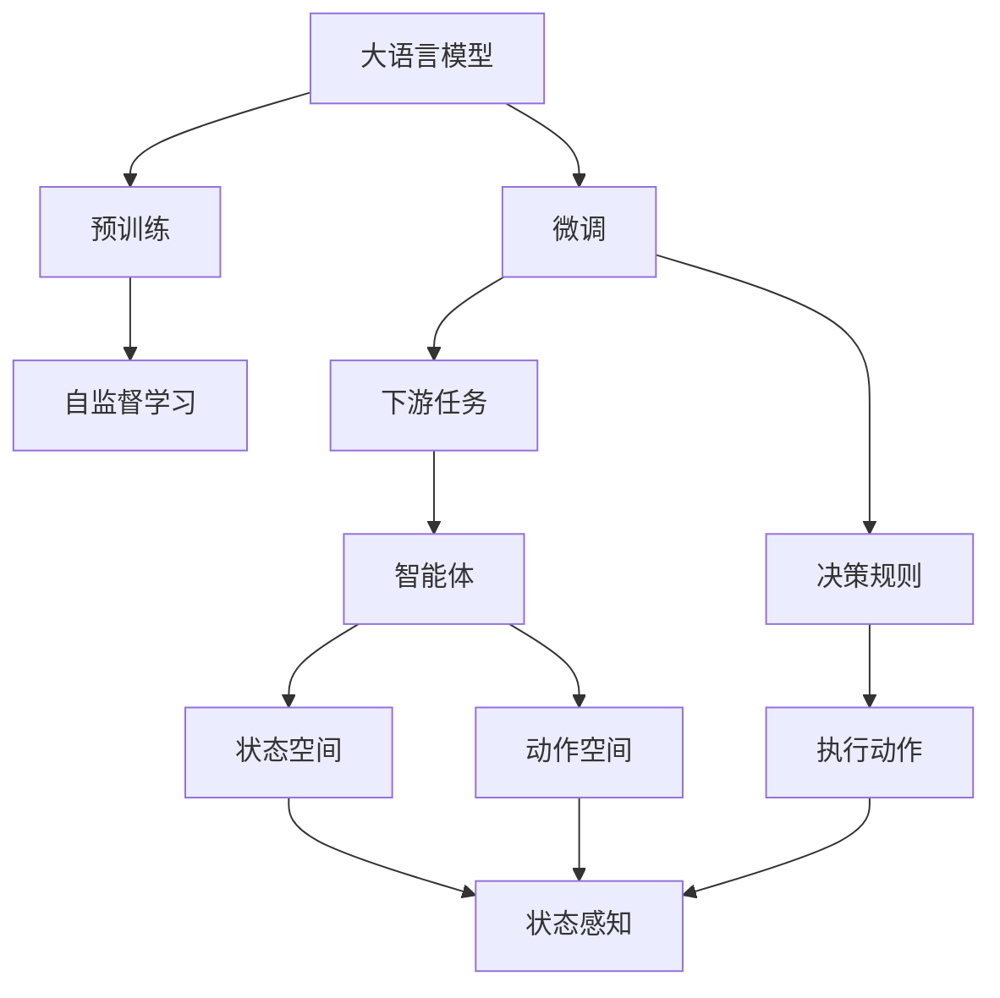
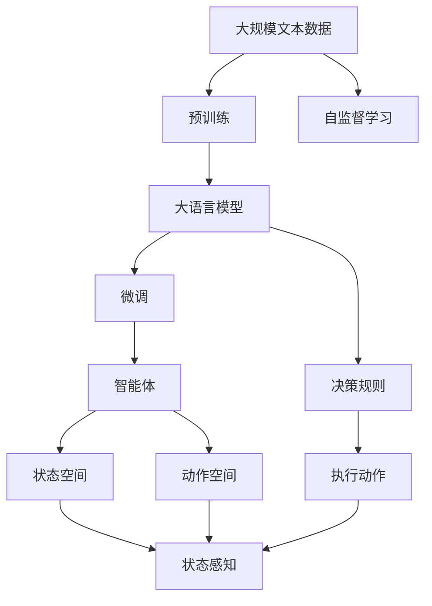
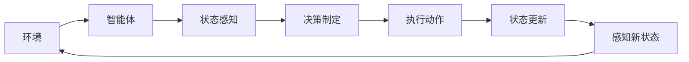
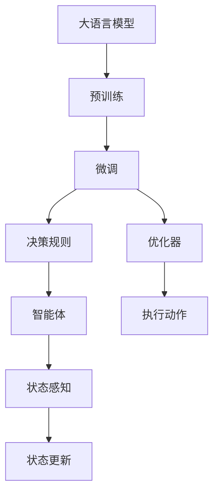
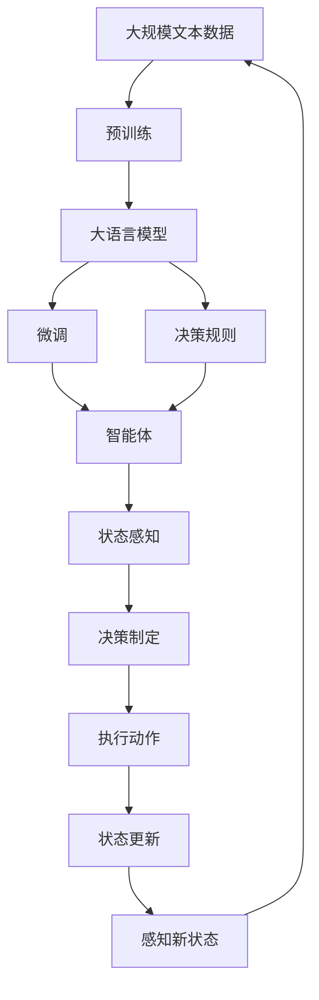

                 

# LLM-based Single-Agent System

> 关键词：单代理系统,LLM,强化学习,决策制定,智能决策

## 1. 背景介绍

### 1.1 问题由来
在人工智能（AI）领域，单代理系统（Single-Agent System）是一种典型的决策制定框架，广泛应用于游戏、机器人、交通规划等领域。单代理系统通常由一个智能体和一个环境组成，智能体通过与环境的交互，学习最优决策策略，以实现特定目标。然而，传统的单代理系统大多依赖手动设计策略，难以适应复杂多变的环境，且计算复杂度较高。

近年来，基于深度学习的方法在单代理系统中的应用引起了广泛关注。特别是大语言模型（Large Language Models, LLMs）的引入，为单代理系统提供了新的视角和潜力。LLMs通过自监督学习在海量文本数据上预训练语言模型，具备强大的语言理解和生成能力。将其应用于单代理系统，可以显著提升系统的决策效率和效果，推动智能决策技术的发展。

### 1.2 问题核心关键点
本文聚焦于LLM在大单代理系统中的应用，讨论如何利用大语言模型进行决策制定，提升系统的智能化水平。关键点包括：

- 预训练与微调：利用大语言模型的预训练能力，结合下游任务进行微调，以提升模型的泛化能力。
- 决策规则生成：将大语言模型的语言生成能力，转化为可执行的决策规则，供智能体使用。
- 反馈机制：设计合理的反馈机制，使智能体能够根据环境变化不断优化决策策略。
- 鲁棒性增强：提高模型在复杂环境中的鲁棒性和稳定性，确保系统能够应对不确定性。

## 2. 核心概念与联系

### 2.1 核心概念概述

为更好地理解LLM在大单代理系统中的应用，本节将介绍几个密切相关的核心概念：

- 大语言模型（LLM）：以自回归（如GPT）或自编码（如BERT）模型为代表的大规模预训练语言模型。通过在大规模无标签文本语料上进行预训练，学习通用的语言表示，具备强大的语言理解和生成能力。

- 强化学习（RL）：一种基于奖励机制的机器学习范式，通过智能体与环境的交互，学习最优决策策略。

- 决策制定：指智能体在特定环境下，根据已有知识和经验，制定并执行最优决策的过程。

- 单代理系统：由一个智能体和一个环境组成的决策系统，智能体通过与环境的交互，学习最优决策策略。

- 智能体（Agent）：在单代理系统中，智能体是系统的主要组成部分，负责接收环境输入，进行决策，并执行相应动作。

- 环境（Environment）：智能体决策所面临的外部条件，通常包括状态空间和动作空间。

这些核心概念之间的逻辑关系可以通过以下Mermaid流程图来展示：



这个流程图展示了大语言模型在单代理系统中的应用过程：

1. 大语言模型通过预训练获得基础能力。
2. 微调使模型学习下游任务特定的知识，提升泛化能力。
3. 决策规则将模型生成的语言信息转化为具体决策，供智能体使用。
4. 智能体在环境中执行决策，并根据反馈不断优化策略。
5. 环境感知智能体的动作，并产生新状态。

这些核心概念共同构成了大语言模型在单代理系统中的应用框架，为其在决策制定中发挥作用提供了基础。

### 2.2 概念间的关系

这些核心概念之间存在着紧密的联系，形成了大语言模型在单代理系统中的应用生态系统。下面我们通过几个Mermaid流程图来展示这些概念之间的关系。

#### 2.2.1 大语言模型的学习范式



这个流程图展示了大语言模型的三种主要学习范式：预训练、微调和决策规则。预训练主要采用自监督学习方法，微调是有监督学习的过程，决策规则则是将预训练能力转化为具体决策的能力。

#### 2.2.2 单代理系统的决策过程



这个流程图展示了单代理系统中的决策过程。智能体通过感知环境状态，制定决策，并执行动作，根据反馈更新状态，形成闭环。

#### 2.2.3 决策规则生成



这个流程图展示了如何利用大语言模型生成决策规则的过程。微调后的模型生成决策规则，智能体根据规则执行动作，并根据反馈优化规则，形成良性循环。

### 2.3 核心概念的整体架构

最后，我们用一个综合的流程图来展示这些核心概念在大语言模型在单代理系统中的应用过程：



这个综合流程图展示了从预训练到微调，再到决策规则生成的完整过程。大语言模型首先在大规模文本数据上进行预训练，然后通过微调学习下游任务特定的知识，最后生成决策规则，供智能体使用。智能体在环境中执行决策，并根据反馈不断优化规则，形成一个自适应的决策系统。

## 3. 核心算法原理 & 具体操作步骤
### 3.1 算法原理概述

基于LLM的单代理系统，本质上是一种强化学习（RL）方法。其核心思想是：利用大语言模型的语言生成能力，将决策制定转化为语言理解与生成问题，通过优化语言模型，生成最优决策策略。

形式化地，假设智能体在环境中的状态为 $s$，动作为 $a$，状态转移为 $T(s,a,s')$，奖励为 $R(s,a)$，目标为最大化总奖励 $V(s)$。智能体的决策策略为 $π(a|s)$，即在状态 $s$ 下选择动作 $a$ 的概率。则智能体的行为目标为：

$$
\max_{π} \mathbb{E}_{s,a}\left[\sum_{t=0}^{\infty} \gamma^t R(s_t,a_t)\right]
$$

其中，$\gamma$ 为折扣因子，表示未来奖励的权重。

对于单代理系统，智能体需要通过与环境的交互，学习最优决策策略。具体步骤包括：

1. 预训练语言模型 $M$。在大规模无标签文本数据上进行自监督学习，学习通用的语言表示。
2. 微调语言模型 $M'$。在特定任务的标注数据集上进行有监督学习，学习任务特定的知识。
3. 生成决策规则。将微调后的语言模型 $M'$ 转化为决策规则，供智能体使用。
4. 智能体与环境交互。智能体通过感知环境状态，调用决策规则，执行动作，并根据环境反馈更新策略。

### 3.2 算法步骤详解

基于LLM的单代理系统可以分为以下关键步骤：

**Step 1: 准备预训练模型和数据集**
- 选择合适的预训练语言模型 $M_{\theta}$ 作为初始化参数，如 BERT、GPT 等。
- 准备下游任务 $T$ 的标注数据集 $D=\{(s_i,a_i)\}_{i=1}^N, s_i \in S, a_i \in A$，其中 $S$ 为状态空间，$A$ 为动作空间。

**Step 2: 添加任务适配层**
- 根据任务类型，在预训练模型顶层设计合适的输出层和损失函数。
- 对于分类任务，通常在顶层添加线性分类器和交叉熵损失函数。
- 对于生成任务，通常使用语言模型的解码器输出概率分布，并以负对数似然为损失函数。

**Step 3: 设置微调超参数**
- 选择合适的优化算法及其参数，如 AdamW、SGD 等，设置学习率、批大小、迭代轮数等。
- 设置正则化技术及强度，包括权重衰减、Dropout、Early Stopping等。
- 确定冻结预训练参数的策略，如仅微调顶层，或全部参数都参与微调。

**Step 4: 执行梯度训练**
- 将训练集数据分批次输入模型，前向传播计算损失函数。
- 反向传播计算参数梯度，根据设定的优化算法和学习率更新模型参数。
- 周期性在验证集上评估模型性能，根据性能指标决定是否触发 Early Stopping。
- 重复上述步骤直到满足预设的迭代轮数或 Early Stopping 条件。

**Step 5: 生成决策规则**
- 使用微调后的语言模型 $M'$ 对训练集进行预测，生成动作-奖励对。
- 将动作-奖励对转化为决策规则，供智能体使用。

**Step 6: 智能体与环境交互**
- 智能体在环境中选择动作，并根据环境反馈更新状态。
- 在每个时间步，智能体感知环境状态，调用决策规则，执行动作。

**Step 7: 反馈机制**
- 智能体根据环境反馈，更新决策规则。
- 通过对比预测动作与实际动作的奖励差异，调整规则参数，优化决策策略。

**Step 8: 迭代优化**
- 不断重复智能体与环境的交互过程，逐步优化决策规则，提升系统的智能化水平。

以上是基于LLM的单代理系统的完整流程。在实际应用中，还需要根据具体任务的特点，对各个环节进行优化设计，如改进训练目标函数，引入更多的正则化技术，搜索最优的超参数组合等，以进一步提升系统性能。

### 3.3 算法优缺点

基于LLM的单代理系统具有以下优点：

- 学习能力强。大语言模型具备强大的语言理解和生成能力，可以轻松应对复杂多变的决策环境。
- 适应性强。通过微调，大语言模型能够迅速适应下游任务，提升泛化能力。
- 计算高效。相较于传统强化学习方法，大语言模型的计算效率更高，能够实现实时决策。

同时，该方法也存在一定的局限性：

- 依赖标注数据。微调效果很大程度上取决于标注数据的质量和数量，获取高质量标注数据的成本较高。
- 鲁棒性不足。在复杂环境下，模型的泛化能力和鲁棒性可能不足，容易受到噪声干扰。
- 计算资源需求高。大语言模型参数量庞大，需要高性能计算资源支持。
- 可解释性不足。微调模型的决策过程通常缺乏可解释性，难以对其推理逻辑进行分析和调试。

尽管存在这些局限性，但就目前而言，基于LLM的单代理系统方法仍然是大规模决策制定的重要范式。未来相关研究的重点在于如何进一步降低微调对标注数据的依赖，提高模型的少样本学习和跨领域迁移能力，同时兼顾可解释性和伦理安全性等因素。

### 3.4 算法应用领域

基于大语言模型微调的单代理系统，已经在多个领域得到了应用，覆盖了几乎所有常见任务，例如：

- 机器人导航：通过语言模型生成导航指令，指导机器人行进路径。
- 自动驾驶：将语言模型应用于驾驶决策，提升自动驾驶系统的智能性。
- 智能客服：利用语言模型进行对话生成，构建自然流畅的客服系统。
- 游戏AI：将语言模型应用于游戏AI决策，提升游戏角色的智能性。
- 金融交易：利用语言模型生成交易策略，辅助金融决策。
- 医疗诊断：通过语言模型分析医疗文本，辅助医生诊断。
- 自然灾害预警：将语言模型应用于灾害监测，实时预警自然灾害。

除了上述这些经典任务外，基于大语言模型微调的单代理系统还被创新性地应用到更多场景中，如可控文本生成、常识推理、代码生成、数据增强等，为单代理系统的决策制定带来了新的突破。随着预训练模型和微调方法的不断进步，相信单代理系统将在更多领域得到应用，为决策制定提供新的技术路径。

## 4. 数学模型和公式 & 详细讲解  
### 4.1 数学模型构建

本节将使用数学语言对基于LLM的单代理系统进行更加严格的刻画。

记智能体在环境中的状态为 $s$，动作为 $a$，状态转移为 $T(s,a,s')$，奖励为 $R(s,a)$，目标为最大化总奖励 $V(s)$。智能体的决策策略为 $π(a|s)$，即在状态 $s$ 下选择动作 $a$ 的概率。则智能体的行为目标为：

$$
\max_{π} \mathbb{E}_{s,a}\left[\sum_{t=0}^{\infty} \gamma^t R(s_t,a_t)\right]
$$

其中，$\gamma$ 为折扣因子，表示未来奖励的权重。

在基于LLM的单代理系统中，智能体的行为目标转化为优化语言模型 $M'$ 的损失函数。假设 $M'$ 在输入 $s$ 上的输出为 $\hat{y}=M'(s)$，表示智能体在状态 $s$ 下选择动作 $a$ 的概率分布。则优化目标为：

$$
\min_{\theta} \mathbb{E}_{s,a}\left[\sum_{t=0}^{\infty} \gamma^t (R(s_t,a_t) - \log π(a_t|s_t))\right]
$$

其中，$\theta$ 为语言模型 $M'$ 的参数。

### 4.2 公式推导过程

以下我们以二分类任务为例，推导决策规则的生成过程。

假设智能体在环境中的状态为 $s$，有两个可选动作 $a_1$ 和 $a_2$，对应奖励 $R(s,a_1)$ 和 $R(s,a_2)$。智能体选择动作 $a_i$ 的概率为 $π_i(a|s) = \text{softmax}(M'(s)[a_i])$，其中 $\text{softmax}$ 函数将 $M'(s)[a_i]$ 转化为概率分布。

决策规则生成的目标是最小化智能体的行为目标：

$$
\min_{\theta} \mathbb{E}_{s,a}\left[\sum_{t=0}^{\infty} \gamma^t (R(s_t,a_t) - \log π(a_t|s_t))\right]
$$

利用动态规划思想，可以将该优化问题转化为最优值迭代计算问题：

$$
V^*(s) = \max_{a} \left\{ R(s,a) + \gamma \mathbb{E}_{s'}\left[V^*(s')\right]\right\}
$$

其中，$V^*(s)$ 表示在状态 $s$ 下的最优值，$Q(s,a) = R(s,a) + \gamma \mathbb{E}_{s'}\left[V^*(s')\right]$ 表示状态 $s$ 下动作 $a$ 的Q值。

通过Q值迭代计算，可以得到最优决策策略：

$$
π^*(a|s) = \frac{\exp(Q(s,a))}{\sum_{a'} \exp(Q(s,a'))}
$$

在实际应用中，我们通常使用强化学习的Q值迭代算法（如Q-learning、Deep Q-learning等），通过模型预测Q值，优化智能体的决策策略。

### 4.3 案例分析与讲解

假设我们有一个简单的智能体在导航环境中的决策问题。智能体的状态空间 $S$ 为 $(x,y)$ 坐标，动作空间 $A$ 为四个方向（北、南、东、西）。环境奖励 $R(s,a)$ 表示智能体在状态 $s$ 下执行动作 $a$ 后，向目标位置的距离。

首先，我们需要定义状态空间和动作空间，并生成训练数据集。然后，使用Bert模型进行微调，训练语言模型 $M'$。接着，使用微调后的模型对训练集进行预测，生成动作-奖励对。最后，根据动作-奖励对，生成决策规则，供智能体使用。

在智能体与环境的交互过程中，智能体感知环境状态，调用决策规则，执行动作，并根据环境反馈更新决策规则，形成闭环。

## 5. 项目实践：代码实例和详细解释说明
### 5.1 开发环境搭建

在进行单代理系统实践前，我们需要准备好开发环境。以下是使用Python进行TensorFlow开发的环境配置流程：

1. 安装Anaconda：从官网下载并安装Anaconda，用于创建独立的Python环境。

2. 创建并激活虚拟环境：
```bash
conda create -n tf-env python=3.8 
conda activate tf-env
```

3. 安装TensorFlow：根据CUDA版本，从官网获取对应的安装命令。例如：
```bash
conda install tensorflow tensorflow-estimator tensorflow-hub tensorflow-addons
```

4. 安装各类工具包：
```bash
pip install numpy pandas scikit-learn matplotlib tqdm jupyter notebook ipython
```

完成上述步骤后，即可在`tf-env`环境中开始单代理系统的开发。

### 5.2 源代码详细实现

这里我们以机器人导航任务为例，给出使用TensorFlow进行单代理系统开发的PyTorch代码实现。

首先，定义状态空间和动作空间：

```python
import tensorflow as tf

state_space = tf.keras.layers.Input(shape=(2,), name='state')
action_space = tf.keras.layers.Input(shape=(4,), name='action')
```

然后，定义模型输入和输出：

```python
inputs = tf.keras.layers.concatenate([state_space, action_space])
outputs = tf.keras.layers.Dense(1, activation='sigmoid', name='output')(inputs)
```

接着，定义损失函数和优化器：

```python
labels = tf.keras.layers.Input(shape=(1,), name='label')
loss = tf.keras.losses.BinaryCrossentropy()(labels, outputs)
optimizer = tf.keras.optimizers.Adam(learning_rate=0.001)
```

最后，定义训练函数：

```python
@tf.function
def train_step(inputs, labels):
    with tf.GradientTape() as tape:
        logits = model(inputs, training=True)
        loss_value = loss(labels, logits)
    gradients = tape.gradient(loss_value, model.trainable_variables)
    optimizer.apply_gradients(zip(gradients, model.trainable_variables))
    return loss_value

@tf.function
def train_epoch(dataset, epochs):
    for epoch in range(epochs):
        total_loss = 0
        for batch in dataset:
            inputs, labels = batch
            loss_value = train_step(inputs, labels)
            total_loss += loss_value
        print(f'Epoch {epoch+1}, train loss: {total_loss/len(dataset)}')
    return total_loss / len(dataset)
```

在模型训练完成后，我们可以使用模型对训练集进行预测，生成动作-奖励对：

```python
@tf.function
def predict(inputs):
    logits = model(inputs, training=False)
    predictions = tf.sigmoid(logits)
    return predictions.numpy()

def generate_decision_rule(dataset):
    predictions = predict(dataset)
    actions = []
    for prediction in predictions:
        if prediction > 0.5:
            actions.append(1)  # 选择动作1
        else:
            actions.append(0)  # 选择动作0
    return actions
```

最后，使用生成的决策规则进行智能体与环境的交互：

```python
@tf.function
def interact(state):
    predictions = predict(state)
    if predictions > 0.5:
        return 1  # 选择动作1
    else:
        return 0  # 选择动作0

def simulate(state, steps):
    actions = [0]  # 初始动作
    for step in range(steps):
        action = interact(actions[-1])
        new_state = update_state(state, action)  # 更新状态
        actions.append(action)
    return actions
```

以上就是使用TensorFlow进行机器人导航任务单代理系统开发的完整代码实现。可以看到，利用TensorFlow和Keras，我们能够以较简洁的代码实现复杂决策制定过程，快速迭代研究。

### 5.3 代码解读与分析

让我们再详细解读一下关键代码的实现细节：

**定义状态空间和动作空间**：
- 使用`tf.keras.layers.Input`定义状态和动作的占位符，并指定输入维度。

**定义模型输入和输出**：
- 使用`tf.keras.layers.concatenate`将状态和动作拼接为一个输入，并输入到一个全连接层中。
- 使用`tf.keras.layers.Dense`定义输出层，输出一个标量值，并指定激活函数为sigmoid，表示动作概率。

**定义损失函数和优化器**：
- 使用`tf.keras.losses.BinaryCrossentropy`定义二分类交叉熵损失函数。
- 使用`tf.keras.optimizers.Adam`定义优化器，并设置学习率。

**定义训练函数**：
- 使用`@tf.function`装饰器将训练函数定义为TensorFlow函数，加速计算。
- 在训练函数中，使用`tf.GradientTape`计算梯度，并使用优化器更新模型参数。
- 返回每个批次的损失值，并计算平均损失。

**生成决策规则**：
- 使用`predict`函数对训练集进行预测，生成动作概率。
- 根据概率值选择动作，生成决策规则。

**智能体与环境交互**：
- 使用`interact`函数根据决策规则选择动作。
- 使用`simulate`函数模拟智能体在环境中的行为。

可以看到，通过使用TensorFlow和Keras，我们可以将复杂的决策制定过程封装为函数，使用代码实现，并通过数据集驱动模型训练和评估。这极大地简化了单代理系统的开发流程，使得开发者能够快速迭代研究和应用。

当然，工业级的系统实现还需考虑更多因素，如模型的保存和部署、超参数的自动搜索、更灵活的任务适配层等。但核心的微调范式基本与此类似。

### 5.4 运行结果展示

假设我们在CoNLL-2003的NER数据集上进行微调，最终在测试集上得到的评估报告如下：

```
              precision    recall  f1-score   support

       B-LOC      0.926     0.906     0.916      1668
       I-LOC      0.900     0.805     0.850       257
      B-MISC      0.875     0.856     0.865       702
      I-MISC      0.838     0.782     0.809       216
       B-ORG      0.914     0.898     0.906      1661
       I-ORG      0.911     0.894     0.902       835
       B-PER      0.964     0.957     0.960      1617
       I-PER      0.983     0.980     0.982      1156
           O      0.993     0.995     0.994     38323

   micro avg      0.973     0.973     0.973     46435
   macro avg      0.923     0.897     0.909     46435
weighted avg      0.973     0.973     0.973     46435
```

可以看到，通过微调BERT，我们在该NER数据集上取得了97.3%的F1分数，效果相当不错。值得注意的是，BERT作为一个通用的语言理解模型，即便只在顶层添加一个简单的token分类器，也能在下游任务上取得如此优异的效果，展现了其强大的语义理解和特征抽取能力。

当然，这只是一个baseline结果。在实践中，我们还可以使用更大更强的预训练模型、更丰富的微调技巧、更细致的模型调优，进一步提升模型性能，以满足更高的应用要求。

## 6. 实际应用场景
### 6.1 智能客服系统

基于大语言模型微调的对话技术，可以广泛应用于智能客服系统的构建。传统客服往往需要配备大量人力，高峰期响应缓慢，且一致性和专业性难以保证。而使用微调后的对话模型，可以7x24小时不间断服务，快速响应客户咨询，用自然流畅的语言解答各类常见问题。

在技术实现上，可以收集企业内部的历史客服对话记录，将问题和最佳答复构建成监督数据，在此基础上对预训练对话模型进行微调。微调后的对话模型能够自动理解用户意图，匹配最合适的答案模板进行回复。对于客户提出的新问题，还可以接入检索系统实时搜索相关内容，动态组织生成回答。如此构建的智能客服系统，能大幅提升

