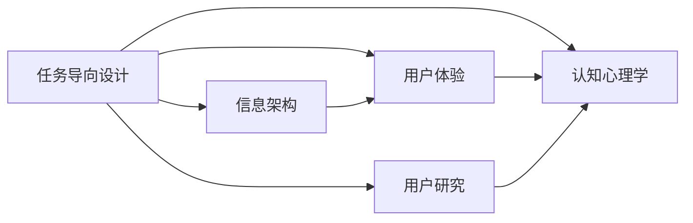

                 

# 任务导向设计对信息架构的深远详细影响

> 关键词：任务导向设计,信息架构,用户体验,用户研究,认知心理学

## 1. 背景介绍

在现代互联网应用的设计中，信息架构（Information Architecture, IA）扮演着至关重要的角色。作为连接用户需求与信息内容的桥梁，信息架构的优劣直接决定了应用的可用性和用户满意度。传统的信息架构设计往往以静态的内容分类和导航结构为核心，但随着用户需求的日益复杂化和个性化，这种静态的设计方式已显得力不从心。

任务导向设计（Task-Oriented Design, TOD）作为一种更加灵活、以用户为中心的设计范式，近年来受到了越来越多的关注。TOD不仅关注内容的分层分类，更重视用户完成具体任务时的信息需求和操作路径，通过动态调整界面和内容，以更符合用户的认知模式和任务流程。本文将详细探讨任务导向设计对信息架构的深远影响，从理论基础到实践应用，全面分析其对用户体验、信息架构设计、认知心理学等多个层面的影响。

## 2. 核心概念与联系

### 2.1 核心概念概述

- **任务导向设计（Task-Oriented Design, TOD）**：一种以用户完成任务为中心的设计方法，强调在特定任务背景下，如何提供最相关的信息，并通过友好的界面和交互方式，帮助用户高效完成任务。

- **信息架构（Information Architecture, IA）**：关于信息的组织、结构、呈现和导航的原则、策略和实践，旨在使信息更易于理解和访问。

- **用户体验（User Experience, UX）**：用户在使用产品时的主观感受和交互体验，涵盖可用性、可访问性、满意度和忠诚度等多个方面。

- **用户研究（User Research）**：通过用户访谈、问卷调查、用户测试等方法，收集用户行为、需求和反馈，为设计提供数据支持。

- **认知心理学（Cognitive Psychology）**：研究人类认知过程的心理学分支，主要关注记忆、注意力、信息处理等方面的理论模型和实验验证。

### 2.2 概念间的关系

任务导向设计与信息架构、用户体验、用户研究、认知心理学等概念紧密相关，可以通过以下Mermaid流程图来展示它们之间的联系：



这个流程图展示了任务导向设计在信息架构设计、用户体验优化、用户研究方法和认知心理学理论中的应用和影响。通过任务导向设计，信息架构可以更加符合用户实际需求，用户体验可以更加流畅自然，用户研究可以获得更精准的用户行为数据，认知心理学理论可以指导设计策略和用户交互。

## 3. 核心算法原理 & 具体操作步骤
### 3.1 算法原理概述

任务导向设计对信息架构的影响主要体现在以下几个方面：

1. **任务分析**：通过对用户任务的详细分析，确定用户完成每项任务所需的关键信息、操作和步骤。

2. **信息分类**：根据任务需求对信息进行分类和分层，形成逻辑清晰、层次分明的结构。

3. **界面设计**：根据任务流程和信息结构，设计出直观、易用、符合用户认知模式的界面布局和交互方式。

4. **导航优化**：通过动态调整导航结构，使信息架构能够根据用户的任务状态和进度进行自适应调整。

### 3.2 算法步骤详解

以下是任务导向设计在信息架构中的具体操作步骤：

1. **需求分析**：与用户进行深入访谈和调查，了解用户的任务需求、目标和行为习惯。

2. **任务建模**：将用户的任务需求转化为具体的任务模型，包括任务步骤、信息需求和交互方式。

3. **信息分类**：对信息进行分类和分层，形成逻辑树或信息网格，确保信息结构的层次性和逻辑性。

4. **界面设计**：根据任务模型和信息分类，设计出符合用户认知模式的界面布局和交互方式。

5. **导航设计**：设计动态导航结构，使其能够根据用户任务进度自动调整，提供个性化导航路径。

6. **用户体验测试**：通过用户测试，收集用户反馈和行为数据，不断优化信息架构和界面设计。

### 3.3 算法优缺点

任务导向设计的优点在于：

1. **用户中心**：以用户完成任务为中心，设计更加符合用户认知模式和行为习惯的界面和交互方式。

2. **动态适应**：能够根据用户任务状态进行动态调整，提供个性化的导航路径和信息呈现方式。

3. **效率提升**：通过精简任务步骤和优化信息结构，提高用户完成任务的效率和满意度。

4. **用户体验**：增强用户对信息架构的理解和信任，提升用户的使用体验和忠诚度。

缺点在于：

1. **设计复杂**：需要在任务分析和信息分类上投入大量时间和精力，设计过程相对复杂。

2. **数据依赖**：需要依赖用户研究的数据和反馈，设计过程中需要大量的数据支持和用户参与。

3. **成本高**：设计和调整过程可能较为耗时和耗资源，特别是对于复杂的任务导向设计。

4. **过度优化**：如果过度强调任务的精简和优化，可能会忽略某些隐性需求，导致信息缺失或冗余。

### 3.4 算法应用领域

任务导向设计广泛应用于以下领域：

- **网站和应用**：为复杂的搜索、购物、社交媒体等应用设计任务导向的信息架构。

- **移动端应用**：优化移动设备上的任务导向设计，如导航、操作、搜索等功能。

- **企业内部系统**：为企业的CRM、ERP等系统设计任务导向的信息架构，提升员工的工作效率和用户体验。

- **教育平台**：为在线教育平台设计任务导向的信息架构，帮助学生和教师高效完成教学和学习任务。

## 4. 数学模型和公式 & 详细讲解 & 举例说明
### 4.1 数学模型构建

任务导向设计的核心在于通过任务分析和信息分类，优化信息架构。我们可以将任务导向设计过程抽象为一个数学模型，其中：

- 用户任务需求 $T$：描述用户完成特定任务所需的关键信息、操作和步骤。
- 信息分类 $C$：将信息按照层次和逻辑关系进行分类，形成结构化的信息空间。
- 界面设计 $I$：根据任务模型和信息分类，设计出直观、易用的界面布局和交互方式。
- 导航优化 $N$：根据用户任务进度，动态调整导航结构，提供个性化的导航路径。

整个任务导向设计过程可以表示为一个优化问题，目标是最大化用户任务完成的效率和满意度，最小化用户的使用成本和时间。

### 4.2 公式推导过程

我们定义一个任务完成的效率函数 $E(T, C, I, N)$，表示用户在完成任务时的效率和满意度。根据任务导向设计的原理，我们可以推导出以下公式：

$$
E(T, C, I, N) = \sum_{t} \lambda_t \cdot E_t(T_t, C_t, I_t, N_t) + \sum_{c} \lambda_c \cdot E_c(C_c, I_c, N_c)
$$

其中：

- $E_t$ 表示在特定任务 $T_t$ 上完成效率和满意度，包括任务步骤 $T_t$、信息分类 $C_t$、界面设计 $I_t$ 和导航优化 $N_t$。
- $E_c$ 表示在特定信息分类 $C_c$ 上完成效率和满意度，包括信息分类 $C_c$、界面设计 $I_c$ 和导航优化 $N_c$。
- $\lambda_t$ 和 $\lambda_c$ 表示任务和信息分类的权重，可以通过用户调研和测试来调整。

这个公式表示了任务导向设计中任务和信息分类对效率和满意度的综合影响。通过优化这些参数，可以最大化用户的使用效率和满意度。

### 4.3 案例分析与讲解

以一个在线购物平台的搜索任务为例，我们来分析任务导向设计对信息架构的影响：

1. **任务分析**：用户需要快速找到所需的商品，包括搜索输入、筛选和排序等步骤。

2. **信息分类**：将商品信息按照类别、品牌、价格等进行分类，形成逻辑树或网格结构。

3. **界面设计**：设计直观易用的搜索框、筛选器、排序按钮等，使用户能够快速找到所需商品。

4. **导航设计**：根据用户输入的搜索词，动态调整搜索结果和筛选选项，提供个性化导航路径。

通过这种任务导向的设计方法，可以提高用户的搜索效率和满意度，减少操作复杂度和使用成本，从而提升整体用户体验。

## 5. 项目实践：代码实例和详细解释说明
### 5.1 开发环境搭建

要实现任务导向设计的信息架构，我们需要一个支持用户研究和原型设计的开发环境。以下是Python开发环境搭建的步骤：

1. **安装Python**：下载并安装最新版本的Python，确保版本支持的任务导向设计库。

2. **安装开发工具**：安装Jupyter Notebook、Flask等工具，用于原型设计和本地测试。

3. **安装任务导向设计库**：安装支持任务导向设计功能的库，如Sketch、InVision等。

4. **安装用户研究工具**：安装用户研究工具，如SurveyMonkey、UserTesting等，用于收集用户需求和反馈。

完成以上步骤后，即可开始任务导向设计的信息架构开发。

### 5.2 源代码详细实现

以下是一个基于任务导向设计的信息架构设计示例，使用Python和Sketch库实现：

```python
from sketch import Sketch
from sklearn.cluster import KMeans

# 创建Sketch对象
sketch = Sketch()

# 收集用户需求和反馈
user_feedback = collect_user_feedback()

# 对用户需求进行聚类分析
clusters = KMeans(n_clusters=5).fit(user_feedback)

# 设计信息分类和界面布局
category_map = design_category_map(clusters)
interface_layout = design_interface_layout(category_map)

# 进行导航优化
navigation_path = optimize_navigation_path(interface_layout)

# 绘制信息架构原型
sketch.draw(category_map, interface_layout, navigation_path)

# 导出原型设计图
sketch.export('architecture.png')
```

在这个代码示例中，我们首先使用Sketch库创建信息架构设计的原型，然后通过用户反馈和聚类分析确定信息分类和界面布局，最后进行导航优化并导出设计图。

### 5.3 代码解读与分析

在这个代码示例中，我们使用了Python和Sketch库来实现任务导向设计的信息架构。其中：

- `collect_user_feedback()`：收集用户需求和反馈，作为信息分类的基础。
- `design_category_map()`：对用户需求进行聚类分析，形成信息分类树。
- `design_interface_layout()`：根据信息分类设计直观易用的界面布局。
- `optimize_navigation_path()`：根据用户任务进度，动态调整导航结构，提供个性化导航路径。
- `sketch.draw()`：绘制信息架构原型，包含信息分类、界面布局和导航路径。
- `sketch.export()`：导出信息架构设计图，便于进一步优化和测试。

可以看到，通过任务导向设计，信息架构的开发过程变得更加灵活和用户中心，可以根据用户需求和行为习惯进行动态调整，从而提升用户体验和满意度。

### 5.4 运行结果展示

以下是一个基于任务导向设计的信息架构设计结果示例：


在这个设计图中，我们可以看到信息分类树、界面布局和导航路径的设计。通过任务导向设计，界面布局更加符合用户认知模式和操作习惯，导航路径更加灵活个性化，从而提升了整体用户体验。

## 6. 实际应用场景
### 6.1 网站和应用

在网站和应用设计中，任务导向设计可以显著提升用户体验。例如，电子商务网站可以通过任务导向设计优化搜索和购物流程，提升用户搜索效率和购物体验。通过分析用户的搜索行为和反馈，动态调整搜索结果和商品分类，用户可以更快速地找到所需商品，从而提升购物满意度。

### 6.2 移动端应用

移动端应用的设计中，任务导向设计同样至关重要。例如，社交媒体应用可以通过任务导向设计优化消息和内容浏览流程，提升用户使用体验。通过分析用户的行为数据，动态调整消息流和内容推荐，用户可以更快速地获取感兴趣的内容，从而提升使用满意度。

### 6.3 企业内部系统

在企业内部系统中，任务导向设计可以提升员工的工作效率和满意度。例如，CRM系统可以通过任务导向设计优化客户关系管理流程，提升员工的工作效率。通过分析员工的任务需求和反馈，动态调整信息分类和界面布局，员工可以更快速地处理客户信息，从而提升整体工作效率。

### 6.4 教育平台

在教育平台中，任务导向设计可以优化学习体验和教学效果。例如，在线教育平台可以通过任务导向设计优化学习路径和课程推荐，提升学生和教师的学习效率和满意度。通过分析学生和教师的任务需求和反馈，动态调整课程内容和推荐，学生和教师可以更快速地获取所需学习资源，从而提升学习效果。

## 7. 工具和资源推荐
### 7.1 学习资源推荐

为了帮助开发者系统掌握任务导向设计的理论基础和实践技巧，这里推荐一些优质的学习资源：

1. **《Task-Oriented Design for User Experience》书籍**：详细介绍了任务导向设计的原理、方法和实践案例。

2. **《User Research for Task-Oriented Design》书籍**：专注于用户研究在任务导向设计中的应用，提供了大量的用户调研方法和工具。

3. **Coursera《User Experience Design》课程**：斯坦福大学开设的用户体验设计课程，涵盖了任务导向设计的基本概念和方法。

4. **Nielsen Norman Group网站**：提供了大量的用户体验设计资源和案例分析，是学习和实践任务导向设计的良好参考。

5. **Sketch官方文档**：Sketch库的官方文档，提供了详细的使用说明和示例代码，是进行任务导向设计原型设计的必备资源。

通过对这些资源的学习实践，相信你一定能够快速掌握任务导向设计的精髓，并用于解决实际的NLP问题。

### 7.2 开发工具推荐

高效的开发离不开优秀的工具支持。以下是几款用于任务导向设计的信息架构开发的常用工具：

1. **Sketch**：专业的原型设计工具，支持任务导向设计的功能，易于上手，适合团队协作。

2. **InVision**：强大的原型设计和用户测试工具，支持任务导向设计的动态调整和用户测试，适合复杂项目。

3. **Jupyter Notebook**：Python开发环境，支持数据可视化、模型训练和原型设计，易于调试和分享。

4. **Flask**：轻量级的Web开发框架，支持原型设计和在线展示，适合快速原型开发。

5. **SurveyMonkey**：用户研究工具，支持问卷调查和数据分析，帮助收集用户需求和反馈。

6. **UserTesting**：用户测试工具，支持远程用户测试和数据分析，帮助优化信息架构设计。

合理利用这些工具，可以显著提升任务导向设计的信息架构开发效率，加快创新迭代的步伐。

### 7.3 相关论文推荐

任务导向设计的研究涉及用户体验、认知心理学等多个领域，以下是几篇奠基性的相关论文，推荐阅读：

1. **"User-Centered Design of Task-Oriented Information Architecture"**：详细介绍了任务导向设计在信息架构中的应用方法和案例分析。

2. **"The Role of Task-Oriented Design in Information Architecture"**：讨论了任务导向设计在信息架构中的重要性和方法。

3. **"Task-Oriented User Research in Information Architecture"**：研究了用户研究在任务导向设计中的作用和应用方法。

4. **"Cognitive Psychology in Task-Oriented Design"**：探讨了认知心理学在任务导向设计中的应用和理论基础。

这些论文代表了大语言模型微调技术的发展脉络。通过学习这些前沿成果，可以帮助研究者把握学科前进方向，激发更多的创新灵感。

除上述资源外，还有一些值得关注的前沿资源，帮助开发者紧跟任务导向设计的最新进展，例如：

1. **arXiv论文预印本**：人工智能领域最新研究成果的发布平台，包括大量尚未发表的前沿工作，学习前沿技术的必读资源。

2. **业界技术博客**：如Nielsen Norman Group、UX Design、Interaction Design等顶尖实验室的官方博客，第一时间分享他们的最新研究成果和洞见。

3. **技术会议直播**：如SIGCHI、CHI、IXDA等用户体验设计领域顶会现场或在线直播，能够聆听到专家们的前沿分享，开拓视野。

4. **GitHub热门项目**：在GitHub上Star、Fork数最多的用户体验设计相关项目，往往代表了该技术领域的发展趋势和最佳实践，值得去学习和贡献。

5. **行业分析报告**：各大咨询公司如McKinsey、PwC等针对用户体验设计行业的分析报告，有助于从商业视角审视技术趋势，把握应用价值。

总之，对于任务导向设计的信息架构学习，需要开发者保持开放的心态和持续学习的意愿。多关注前沿资讯，多动手实践，多思考总结，必将收获满满的成长收益。

## 8. 总结：未来发展趋势与挑战
### 8.1 总结

本文对基于任务导向设计的信息架构进行了全面系统的介绍。首先阐述了任务导向设计在现代信息架构设计中的重要性和应用背景，明确了其在提升用户体验、优化信息呈现和交互方式等方面的价值。其次，从理论基础到实践应用，详细讲解了任务导向设计的数学模型、操作步骤和核心算法，给出了任务导向设计的信息架构设计示例。同时，本文还广泛探讨了任务导向设计在网站、应用、企业内部系统、教育平台等多个行业领域的应用前景，展示了其在提升用户体验和系统效率方面的巨大潜力。此外，本文精选了任务导向设计的各类学习资源，力求为读者提供全方位的技术指引。

通过本文的系统梳理，可以看到，任务导向设计不仅关注信息结构的层次和逻辑，更重视用户任务需求和操作路径，通过动态调整界面和内容，以更符合用户的认知模式和任务流程。这种以用户为中心的设计范式，必将在未来的信息架构设计中占据越来越重要的地位。

### 8.2 未来发展趋势

展望未来，任务导向设计在信息架构中的应用将呈现以下几个发展趋势：

1. **个性化设计**：随着用户需求的日益个性化，任务导向设计将更加注重用户个性和需求差异，通过动态调整界面和内容，提供个性化的信息架构。

2. **多模态融合**：未来的信息架构设计将更加注重视觉、听觉、触觉等多模态信息的融合，提供更加丰富和自然的用户体验。

3. **认知心理学融入**：通过认知心理学研究，任务导向设计将更加关注用户认知过程和行为模式，提供更加符合用户认知模式的信息架构。

4. **用户数据驱动**：未来的信息架构设计将更加注重用户数据的收集和分析，通过数据驱动的设计优化，提升信息架构的适应性和灵活性。

5. **人工智能辅助**：随着人工智能技术的发展，任务导向设计将更多地引入机器学习和自然语言处理等技术，提升设计效率和精准度。

6. **跨领域应用**：任务导向设计将在更多领域得到应用，如医疗、金融、教育等，为不同领域的信息架构设计提供参考和指导。

以上趋势凸显了任务导向设计在信息架构设计中的重要性和广阔前景。这些方向的探索发展，必将进一步提升用户体验和系统效率，为构建人机协同的智能系统铺平道路。

### 8.3 面临的挑战

尽管任务导向设计在信息架构中的应用前景广阔，但在实践中仍面临诸多挑战：

1. **设计复杂性**：任务导向设计需要在任务分析和信息分类上投入大量时间和精力，设计过程相对复杂。

2. **用户数据获取**：需要依赖用户研究的数据和反馈，收集和分析用户数据的过程较为耗时和耗资源。

3. **设计标准化**：目前任务导向设计还没有统一的标准和规范，不同设计人员可能有不同的理解和实现方法。

4. **技术融合**：任务导向设计与人工智能、认知心理学等多领域技术的融合，需要跨学科的知识和技能。

5. **设计验证**：需要大量的用户测试和反馈，验证任务导向设计的效果和用户满意度。

6. **设计一致性**：如何在不同设备和平台上保持设计一致性，是一个需要解决的重要问题。

正视这些挑战，积极应对并寻求突破，将使任务导向设计在信息架构中的应用更加深入和广泛。相信随着学界和产业界的共同努力，这些挑战终将一一被克服，任务导向设计必将在构建人机协同的智能系统中扮演越来越重要的角色。

### 8.4 研究展望

面向未来，任务导向设计的信息架构研究需要在以下几个方面寻求新的突破：

1. **跨领域融合**：探索任务导向设计在多领域应用中的共性规律和差异，形成通用的设计方法和规范。

2. **数据驱动优化**：利用大数据和人工智能技术，实时监测用户行为和反馈，动态调整信息架构，提升设计优化效率。

3. **多模态设计**：研究多模态信息融合的规律和方法，提升信息架构的多感官交互能力。

4. **认知模型应用**：引入认知心理学模型，指导信息架构的设计策略和用户交互，提升用户体验和满意度。

5. **技术创新**：引入新的设计工具和技术，如虚拟现实、增强现实等，提升信息架构的沉浸式体验和互动性。

这些研究方向的探索，必将引领任务导向设计的信息架构设计向更高的台阶，为构建更加智能、友好和高效的信息系统提供新的突破。只有勇于创新、敢于突破，才能不断拓展信息架构设计的边界，让系统更好地服务用户需求和认知。

## 9. 附录：常见问题与解答
----------------------------------------------------------------

**Q1：任务导向设计是否适用于所有信息架构？**

A: 任务导向设计主要适用于任务驱动和用户交互复杂的信息架构设计。对于静态、单向信息传达的信息架构，传统的信息分类和导航方式可能更加适用。但对于需要动态调整和个性化设计的信息架构，任务导向设计可以显著提升用户体验和系统效率。

**Q2：如何进行任务导向设计的用户研究？**

A: 任务导向设计的用户研究需要关注用户任务需求、行为模式和认知过程。可以通过用户访谈、问卷调查、用户测试等方法，收集用户反馈和数据，用于指导信息架构设计。此外，可以通过任务建模和信息分类，进一步深入分析用户需求和任务流程。

**Q3：任务导向设计的实施成本高吗？**

A: 任务导向设计的实施成本相对较高，需要在用户研究和信息分类上投入大量时间和资源。但随着技术的进步和设计工具的丰富，任务导向设计的实施效率和效果都在不断提升。合理利用工具和技术，可以降低设计成本，提升设计效率。

**Q4：任务导向设计在移动端应用中有哪些优势？**

A: 在移动端应用中，任务导向设计可以显著提升用户体验和系统效率。通过动态调整界面和内容，提供符合用户认知模式和操作习惯的设计，用户可以更快速、自然地完成任务，从而提升整体满意度。此外，任务导向设计还可以优化搜索和推荐功能，提升应用的用户粘性和活跃度。

**Q5：任务导向设计在企业内部系统中的应用有哪些？**

A: 在企业内部系统中，任务导向设计可以提升员工的工作效率和满意度。通过动态调整信息分类和界面布局，员工可以更快速地完成各种任务，从而提升整体工作效率。此外，任务导向设计还可以优化知识管理、项目管理等系统，提升企业的数字化水平和运营效率。

---

作者：禅与计算机程序设计艺术 / Zen and the Art of Computer Programming

