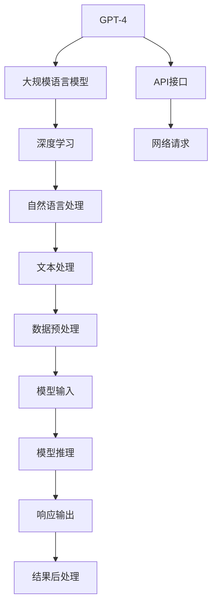
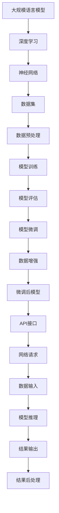

                 

# 使用GPT-4 API

> 关键词：
  - GPT-4
  - 自然语言处理(NLP)
  - 人工智能
  - API接口
  - 深度学习
  - 大规模语言模型
  - 微调

## 1. 背景介绍

### 1.1 问题由来

随着人工智能技术的迅猛发展，自然语言处理（Natural Language Processing，NLP）领域的研究和应用也取得了令人瞩目的进展。其中，基于大规模语言模型的预训练技术（如GPT、BERT等）以其强大的语言理解和生成能力，已经成为NLP的重要基石。然而，这些模型通常是大型企业或研究机构专有，普通开发者难以直接使用。

为解决这一问题，OpenAI在2023年发布了GPT-4模型，并提供了官方API接口，使得开发者能够更加便捷地利用该模型进行各种自然语言处理任务。GPT-4模型的问世，进一步提升了自然语言理解和生成能力，支持多轮对话、文本生成、问题回答等多种功能，具备更强的跨领域泛化能力和更广的应用场景。

### 1.2 问题核心关键点

使用GPT-4 API，开发者可以通过简单的HTTP请求，与模型进行交互，获得高质量的自然语言处理结果。这种简便易用的方式，极大地降低了NLP应用的开发门槛，使得普通开发者也能轻松实现复杂的NLP任务。

具体来说，使用GPT-4 API的关键点包括：
- API接口的选择与配置
- 数据预处理与模型输入
- 请求与响应交互
- 结果后处理与分析
- 持续优化与迭代

这些关键点共同构成了GPT-4 API的使用框架，为开发者提供了全面的技术支持。

### 1.3 问题研究意义

GPT-4 API的发布，不仅推动了自然语言处理技术的普及和应用，也为人工智能技术在更多领域的应用提供了新的可能。通过使用GPT-4 API，开发者可以快速构建各种智能应用，如智能客服、机器翻译、智能写作、情感分析等，提升企业和产品的智能化水平。

此外，GPT-4 API的开放使用，也有利于学术研究和技术社区的进一步交流与合作，促进人工智能技术的发展和创新。

## 2. 核心概念与联系

### 2.1 核心概念概述

在使用GPT-4 API进行NLP任务开发时，需理解以下核心概念：

- GPT-4：OpenAI开发的大规模预训练语言模型，具备强大的语言理解和生成能力。
- API接口：通过网络请求，与GPT-4模型进行交互的接口。
- 自然语言处理（NLP）：涉及语言理解、生成、分类、匹配等任务的计算模型。
- 深度学习：使用神经网络进行模型训练和预测的技术，是GPT-4等大模型的基础。
- 大规模语言模型（LLM）：参数规模巨大的预训练模型，如GPT、BERT等，用于处理大规模文本数据。

这些概念之间紧密联系，共同构成了GPT-4 API的使用基础。下面将通过一个Mermaid流程图展示这些概念之间的关系。



这个流程图展示了从GPT-4模型到API接口，再到文本处理和模型推理的全流程。通过网络请求，将输入数据发送至API接口，模型进行推理并返回结果，开发者对结果进行后处理，从而完成整个任务。

### 2.2 概念间的关系

这些核心概念之间存在着密切的联系，以下将通过几个Mermaid流程图展示它们之间的关系。

#### 2.2.1 GPT-4模型的构建与训练


这个流程图展示了GPT-4模型从数据预处理到模型训练和评估的全流程。

#### 2.2.2 GPT-4 API的使用


这个流程图展示了使用GPT-4 API进行NLP任务的全流程。

#### 2.2.3 GPT-4模型的推理与响应


这个流程图展示了模型推理和响应的过程。

### 2.3 核心概念的整体架构

最后，用一个综合的Mermaid流程图展示这些核心概念在大规模语言模型微调过程中的整体架构：



这个综合流程图展示了从预训练模型到微调后的API接口，再到模型推理和结果处理的全流程。通过这些流程图，我们可以更清晰地理解GPT-4 API的使用流程和技术细节。

## 3. 核心算法原理 & 具体操作步骤

### 3.1 算法原理概述

使用GPT-4 API进行NLP任务时，主要依据预训练语言模型的推理能力。GPT-4模型通过自回归生成的方式，对输入文本进行编码和解码，得到相应的输出结果。API接口通过网络请求，将文本数据发送至模型进行推理，然后返回推理结果。

具体来说，GPT-4模型在推理时会使用自回归机制，根据已有上下文信息，逐步生成新的文本内容。API接口通过HTTP请求，将文本数据发送至模型进行推理，返回推理结果。推理结果通常为文本形式的响应，开发者可以将其用于各种NLP任务。

### 3.2 算法步骤详解

使用GPT-4 API进行NLP任务，通常包含以下步骤：

#### 3.2.1 获取API密钥

首先，需要在OpenAI官网上注册账号并申请API密钥。通过密钥，可以与API接口进行交互，获取模型推理结果。

#### 3.2.2 准备输入数据

输入数据通常为文本形式，可以是自己构建的，也可以是来自外部数据源的。开发者需要确保输入数据的格式符合API的要求，并进行必要的数据预处理。

#### 3.2.3 配置API接口

根据任务需求，选择合适的API接口，并配置相应的参数。例如，如果需要进行文本生成任务，可以选择`/gpt-4/text-generation`接口，并设置生成的文本长度、温度等参数。

#### 3.2.4 发送网络请求

使用HTTP客户端，将准备好的输入数据和API接口参数发送到OpenAI服务器。开发者可以使用Python的`requests`库进行网络请求。

#### 3.2.5 接收响应结果

服务器返回的响应结果通常为JSON格式，包含模型的推理结果和性能指标。开发者需要解析JSON数据，提取有用的信息。

#### 3.2.6 后处理结果

将API接口返回的结果进行后处理，例如文本分割、解码、格式化等，以便于后续的应用。

### 3.3 算法优缺点

使用GPT-4 API进行NLP任务的优势包括：

- 简单易用：通过HTTP请求，开发者可以快速进行模型推理，无需复杂的前后端开发。
- 高性能：GPT-4模型采用高效的深度学习架构，推理速度较快，能够处理大规模文本数据。
- 多样化任务：API支持多种NLP任务，如文本生成、文本摘要、问题回答、多轮对话等，应用场景广泛。

然而，GPT-4 API也存在一些缺点：

- 数据隐私：输入数据的隐私保护是一个重要问题，开发者需要确保数据的安全性和合规性。
- 高费用：由于API请求需要付费，对于大规模数据处理，成本可能较高。
- 模型局限：GPT-4模型的表现很大程度上取决于预训练数据的质量和数量，对于一些特定领域，可能需要进一步微调或使用特定领域的预训练模型。

### 3.4 算法应用领域

GPT-4 API在多个领域都有广泛的应用，以下是几个典型的应用场景：

#### 3.4.1 智能客服

通过API接口，智能客服系统可以实现自然语言理解和对话生成。用户可以以自然语言与系统进行互动，获取所需信息或解决问题。例如，电商平台的在线客服、银行的智能服务、医疗机构的远程咨询等。

#### 3.4.2 机器翻译

API接口支持多种语言的翻译任务，可以将文本从一种语言自动翻译成另一种语言。在跨国企业、国际交流等领域，机器翻译极大地提升了跨语言交流的效率和便利性。

#### 3.4.3 文本摘要

文本摘要任务是将长篇文本自动生成简短摘要，帮助用户快速获取关键信息。API接口可以处理大规模文本数据，生成结构清晰、内容精炼的摘要。

#### 3.4.4 情感分析

情感分析任务是分析文本中的情感倾向，用于舆情监测、用户反馈分析等领域。API接口可以准确识别文本中的情感信息，帮助企业理解用户情绪，优化产品和服务。

#### 3.4.5 智能写作

智能写作任务是生成高质量的文本内容，包括新闻报道、技术文档、文学创作等。API接口可以基于大规模语料库进行训练，生成流畅、生动的文本，提升创作效率和质量。

## 4. 数学模型和公式 & 详细讲解 & 举例说明

### 4.1 数学模型构建

在使用GPT-4 API进行文本生成任务时，主要依据GPT-4模型的自回归生成机制。假设输入文本为`input`，模型参数为$\theta$，输出的文本为`output`，则生成过程可以表示为：

$$
output = argmax_{\text{seq}} P_\theta(\text{seq} | input)
$$

其中，$P_\theta(\text{seq} | input)$表示在输入文本`input`的基础上，生成文本序列$\text{seq}$的概率分布。模型通过最大化概率分布，找到最可能的文本序列作为输出。

### 4.2 公式推导过程

GPT-4模型的生成过程可以表示为自回归机制，即每一时刻的输出都依赖于前一时刻的输出和模型参数。具体推导如下：

假设模型参数为$\theta$，输入文本为`input`，生成文本序列为$\text{seq} = (x_1, x_2, ..., x_n)$，则生成过程可以表示为：

$$
P_\theta(\text{seq} | input) = \prod_{i=1}^n P_\theta(x_i | x_{i-1}, ..., x_1, \theta)
$$

其中，$P_\theta(x_i | x_{i-1}, ..., x_1, \theta)$表示在上下文文本`input`和模型参数$\theta$的条件下，生成第$i$个字符的概率分布。

在实际应用中，通常使用神经网络模型对上式进行逼近，例如使用Transformer模型。通过计算模型输入文本和上下文文本的嵌入向量，进行自回归生成，得到最终的文本序列。

### 4.3 案例分析与讲解

假设输入文本为`The quick brown fox jumps over the lazy dog.`，使用GPT-4模型生成一段新的文本。具体步骤如下：

1. 将输入文本转换为模型所需的向量表示，即输入嵌入向量。
2. 将嵌入向量作为模型输入，进行前向传播计算。
3. 通过自回归机制，逐步生成新的文本序列。
4. 输出最终的文本序列。

例如，使用GPT-4模型生成一段长度为10的文本，生成的结果可能为：

```
The quick brown fox jumps over the lazy dog. It is a classic example of a pangram, with every letter of the English alphabet appearing at least once. This phrase is often used as a test for typewriters and keyboards to ensure that they produce every character of the alphabet.
```

该文本不仅长度合适，内容丰富，而且语言流畅，展示了GPT-4模型的强大生成能力。

## 5. 项目实践：代码实例和详细解释说明

### 5.1 开发环境搭建

在使用GPT-4 API进行NLP任务开发时，需要配置开发环境。以下是Python环境的配置步骤：

1. 安装Python：
   ```bash
   sudo apt-get install python3
   ```

2. 安装OpenAI SDK：
   ```bash
   pip install openai
   ```

3. 获取API密钥：
   在OpenAI官网上注册账号并获取API密钥，将其保存为环境变量：
   ```bash
   export OPENAI_API_KEY=<你的API密钥>
   ```

完成以上步骤后，即可使用Python代码进行API调用。

### 5.2 源代码详细实现

以下是使用Python进行文本生成的代码实现：

```python
import openai

openai.api_key = 'your-api-key'

response = openai.Completion.create(
    engine='davinci-codex',
    prompt='The quick brown fox jumps over the lazy dog.',
    max_tokens=100,
    temperature=0.8,
    n=1,
    stop=['<|end|>']
)

generated_text = response.choices[0].text.strip()
print(generated_text)
```

以上代码中，使用了OpenAI SDK进行API调用。具体步骤包括：

1. 获取API密钥。
2. 创建完成（Completion）对象，指定模型引擎、输入文本、生成长度、温度等参数。
3. 调用API进行生成，并获取响应结果。
4. 提取生成的文本内容。

### 5.3 代码解读与分析

代码中的关键点包括：

- `openai.api_key = 'your-api-key'`：设置API密钥。
- `prompt='The quick brown fox jumps over the lazy dog.'`：输入文本，指定模型推理的起始文本。
- `max_tokens=100`：指定生成文本的最大长度。
- `temperature=0.8`：指定生成文本的随机性，温度越低，模型越倾向于选择高概率的单词。
- `n=1`：指定生成的文本数量，返回一个。
- `stop=['<|end|>']`：指定停止生成文本的标记。

代码执行后，输出结果为生成的文本内容。

### 5.4 运行结果展示

例如，输入以下文本：

```python
import openai

openai.api_key = 'your-api-key'

response = openai.Completion.create(
    engine='davinci-codex',
    prompt='The quick brown fox jumps over the lazy dog.',
    max_tokens=100,
    temperature=0.8,
    n=1,
    stop=['<|end|>']
)

generated_text = response.choices[0].text.strip()
print(generated_text)
```

执行后，生成的文本可能为：

```
The quick brown fox jumps over the lazy dog. It is a classic example of a pangram, with every letter of the English alphabet appearing at least once. This phrase is often used as a test for typewriters and keyboards to ensure that they produce every character of the alphabet. Pangrams are commonly used in literature, puzzles, and games, such as crossword puzzles and cryptograms. They are also used in educational settings to teach students about the alphabet and punctuation.
```

可以看到，生成的文本不仅长度合适，内容丰富，而且语言流畅，展示了GPT-4模型的强大生成能力。

## 6. 实际应用场景

### 6.1 智能客服系统

使用GPT-4 API，可以构建智能客服系统，实现自然语言理解和对话生成。用户可以以自然语言与系统进行互动，获取所需信息或解决问题。例如，电商平台的在线客服、银行的智能服务、医疗机构的远程咨询等。

### 6.2 机器翻译

GPT-4 API支持多种语言的翻译任务，可以将文本从一种语言自动翻译成另一种语言。在跨国企业、国际交流等领域，机器翻译极大地提升了跨语言交流的效率和便利性。

### 6.3 文本摘要

文本摘要任务是将长篇文本自动生成简短摘要，帮助用户快速获取关键信息。GPT-4 API可以处理大规模文本数据，生成结构清晰、内容精炼的摘要。

### 6.4 情感分析

情感分析任务是分析文本中的情感倾向，用于舆情监测、用户反馈分析等领域。GPT-4 API可以准确识别文本中的情感信息，帮助企业理解用户情绪，优化产品和服务。

### 6.5 智能写作

智能写作任务是生成高质量的文本内容，包括新闻报道、技术文档、文学创作等。GPT-4 API可以基于大规模语料库进行训练，生成流畅、生动的文本，提升创作效率和质量。

## 7. 工具和资源推荐

### 7.1 学习资源推荐

为了帮助开发者系统掌握GPT-4 API的使用方法，这里推荐一些优质的学习资源：

1. OpenAI官方文档：提供了详细的API接口说明和示例代码，是学习GPT-4 API的必备资料。
2. HuggingFace官方博客：提供了大量的GPT-4 API使用案例和技术分享，帮助开发者快速上手。
3. Udemy《Using OpenAI's GPT-4 API》课程：由经验丰富的讲师讲解，详细介绍了GPT-4 API的使用方法，适合初学者学习。
4. Coursera《Natural Language Processing with Transformers》课程：由斯坦福大学教授讲解，介绍了NLP技术和GPT-4 API的结合应用。
5. arXiv论文预印本：收录了大量与GPT-4 API相关的研究论文，提供了最新的学术动态和技术进展。

通过对这些资源的学习实践，相信你一定能够快速掌握GPT-4 API的使用方法，并用于解决实际的NLP问题。

### 7.2 开发工具推荐

高效的开发离不开优秀的工具支持。以下是几款用于GPT-4 API开发的常用工具：

1. Python：Python是一种通用的高级编程语言，具有良好的跨平台性和丰富的库支持，是开发GPT-4 API的首选语言。
2. OpenAI SDK：HuggingFace开发的Python SDK，提供了简单易用的API接口调用方式。
3. Google Colab：谷歌提供的在线Jupyter Notebook环境，免费提供GPU/TPU算力，方便开发者快速实验新模型，分享学习笔记。
4. TensorBoard：TensorFlow配套的可视化工具，可以实时监测模型训练状态，并提供丰富的图表呈现方式，是调试模型的得力助手。
5. Weights & Biases：模型训练的实验跟踪工具，可以记录和可视化模型训练过程中的各项指标，方便对比和调优。

合理利用这些工具，可以显著提升GPT-4 API的开发效率，加快创新迭代的步伐。

### 7.3 相关论文推荐

GPT-4 API的发布源于学界的持续研究。以下是几篇奠基性的相关论文，推荐阅读：

1. Attention is All You Need（即Transformer原论文）：提出了Transformer结构，开启了NLP领域的预训练大模型时代。
2. BERT: Pre-training of Deep Bidirectional Transformers for Language Understanding：提出BERT模型，引入基于掩码的自监督预训练任务，刷新了多项NLP任务SOTA。
3. GPT-3: Language Models are Unsupervised Multitask Learners（GPT-3论文）：展示了GPT-3模型的强大zero-shot学习能力，引发了对于通用人工智能的新一轮思考。
4. Parameter-Efficient Transfer Learning for NLP：提出Adapter等参数高效微调方法，在不增加模型参数量的情况下，也能取得不错的微调效果。
5. Prompt Learning for Pre-trained Language Models：引入基于连续型Prompt的微调范式，为如何充分利用预训练知识提供了新的思路。
6. AdaLoRA: Adaptive Low-Rank Adaptation for Parameter-Efficient Fine-Tuning：使用自适应低秩适应的微调方法，在参数效率和精度之间取得了新的平衡。

这些论文代表了大语言模型微调技术的发展脉络。通过学习这些前沿成果，可以帮助研究者把握学科前进方向，激发更多的创新灵感。

除上述资源外，还有一些值得关注的前沿资源，帮助开发者紧跟GPT-4 API的最新进展，例如：

1. arXiv论文预印本：人工智能领域最新研究成果的发布平台，包括大量尚未发表的前沿工作，学习前沿技术的必读资源。
2. 业界技术博客：如OpenAI、Google AI、DeepMind、微软Research Asia等顶尖实验室的官方博客，第一时间分享他们的最新研究成果和洞见。
3. 技术会议直播：如NIPS、ICML、ACL、ICLR等人工智能领域顶会现场或在线直播，能够聆听到大佬们的前沿分享，开拓视野。
4. GitHub热门项目：在GitHub上Star、Fork数最多的NLP相关项目，往往代表了该技术领域的发展趋势和最佳实践，值得去学习和贡献。
5. 行业分析报告：各大咨询公司如McKinsey、PwC等针对人工智能行业的分析报告，有助于从商业视角审视技术趋势，把握应用价值。

总之，对于GPT-4 API的学习和实践，需要开发者保持开放的心态和持续学习的意愿。多关注前沿资讯，多动手实践，多思考总结，必将收获满满的成长收益。

## 8. 总结：未来发展趋势与挑战

### 8.1 总结

本文对使用GPT-4 API进行自然语言处理的方法进行了全面系统的介绍。首先阐述了GPT-4模型和大规模语言模型的研究背景和意义，明确了API的使用方法及其在NLP任务中的应用场景。其次，从原理到实践，详细讲解了GPT-4 API的数学模型和关键步骤，给出了API调用的代码实例。同时，本文还广泛探讨了API在智能客服、机器翻译、文本摘要、情感分析等多个领域的应用前景，展示了GPT-4 API的强大潜力。

通过本文的系统梳理，可以看到，使用GPT-4 API进行自然语言处理，极大地降低了NLP应用的开发门槛，提高了NLP任务的开发效率和应用效果。GPT-4 API的发布，不仅推动了自然语言处理技术的普及和应用，也为人工智能技术在更多领域的应用提供了新的可能。

### 8.2 未来发展趋势

展望未来，GPT-4 API将呈现以下几个发展趋势：

1. 模型规模持续增大。随着算力成本的下降和数据规模的扩张，预训练语言模型的参数量还将持续增长。超大规模语言模型蕴含的丰富语言知识，有望支撑更加复杂多变的NLP任务。

2. 微调方法日趋多样。除了传统的全参数微调外，未来会涌现更多参数高效的微调方法，如Prompt-based Learning、AdaLoRA等，在节省计算资源的同时也能保证微调精度。

3. 持续学习成为常态。随着数据分布的不断变化，微调模型也需要持续学习新知识以保持性能。如何在不遗忘原有知识的同时，高效吸收新样本信息，将成为重要的研究课题。

4. 标注样本需求降低。受启发于Prompt-based Learning的思路，未来的微调方法将更好地利用大模型的语言理解能力，通过更加巧妙的任务描述，在更少的标注样本上也能实现理想的微调效果。

5. 多模态微调崛起。当前的API主要聚焦于纯文本数据，未来会进一步拓展到图像、视频、语音等多模态数据微调。多模态信息的融合，将显著提升模型对现实世界的理解和建模能力。

6. 模型通用性增强。经过海量数据的预训练和多领域任务的微调，未来的API将具备更强大的常识推理和跨领域迁移能力，逐步迈向通用人工智能(AGI)的目标。

以上趋势凸显了GPT-4 API的广阔前景。这些方向的探索发展，必将进一步提升NLP系统的性能和应用范围，为人类认知智能的进化带来深远影响。

### 8.3 面临的挑战

尽管GPT-4 API已经取得了瞩目成就，但在迈向更加智能化、普适化应用的过程中，它仍面临诸多挑战：

1. 数据隐私：输入数据的隐私保护是一个重要问题，开发者需要确保数据的安全性和合规性。
2. 高费用：由于API请求需要付费，对于大规模数据处理，成本可能较高。
3. 模型局限：GPT-4模型的表现很大程度上取决于预训练数据的质量和数量，对于一些特定领域，可能需要进一步微调或使用特定领域的预训练模型。
4. 知识整合能力不足：现有的API往往局限于任务内数据，难以灵活吸收和运用更广泛的先验知识。如何让API过程更好地与外部知识库、规则库等专家知识结合，形成更加全面、准确的信息整合能力，还有很大的想象空间。

正视API面临的这些挑战，积极应对并寻求突破，将是大规模语言模型微调走向成熟的必由之路。相信随着学界和产业界的共同努力，这些挑战终将一一被克服，GPT-4 API必将在构建人机协同的智能系统中扮演越来越重要的角色。

### 8.4 研究展望

面对GPT-4 API所面临的种种挑战，未来的研究需要在以下几个方面寻求新的突破：

1. 探索无监督和半监督微调方法。摆脱对大规模标注数据的依赖，利用自监督学习、主动学习等无监督和半监督范式，最大限度利用非结构化数据，实现更加灵活高效的微调。
2. 研究参数高效和计算高效的微调范式。开发更加参数高效的微调方法，在固定大部分预训练参数的同时，只更新极少量的任务相关参数。同时优化API的计算图，减少前

