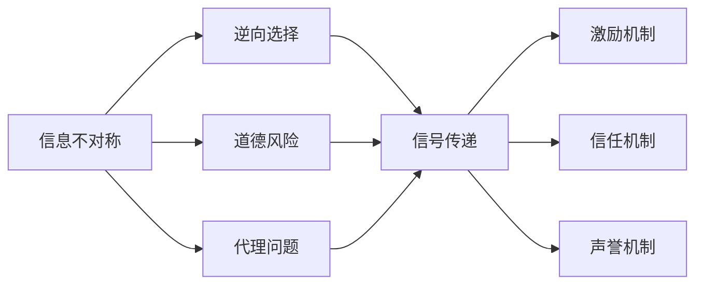
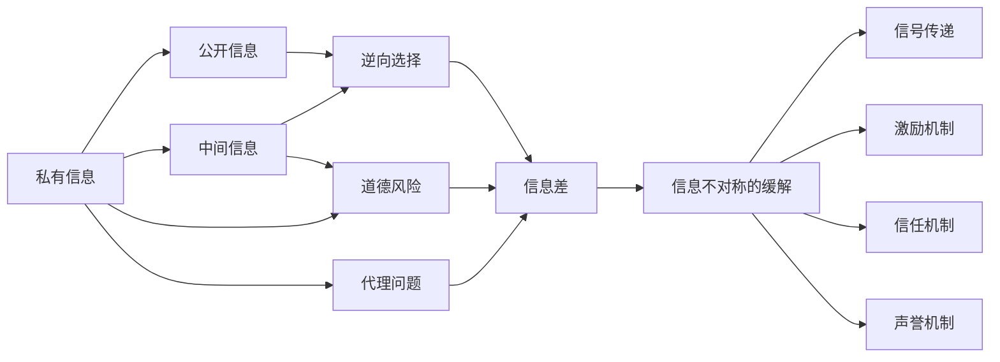
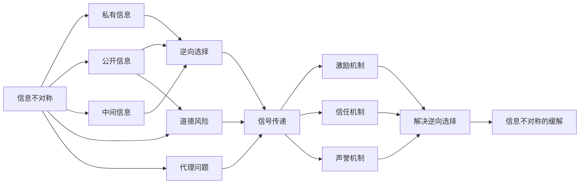

                 

## 1. 背景介绍

### 1.1 问题由来
在日常生活中，我们常常会面临信息不对称的挑战。信息不对称，简而言之，指的是信息在交流双方之间的分布不均衡。在金融、保险、医疗、教育等领域，信息不对称现象尤为常见，并导致了各种经济和社会问题。如何理解和处理信息不对称，成为了社会科学、经济学等领域的重要研究课题。

### 1.2 问题核心关键点
在信息不对称问题中，主要有三类信息：
1. **私有信息（Private Information）**：只有一方知道的秘密信息，如客户的信用状况、健康状况等。
2. **公开信息（Public Information）**：大家都已知的信息，如市场价格、公司财报等。
3. **中间信息（Intermediate Information）**：介于私有信息和公开信息之间，部分人知道的信息，如市场趋势、政策法规等。

信息不对称的主要问题包括：
- **逆向选择（Adverse Selection）**：在合同签订前，拥有私有信息的一方可能采取不利于另一方的行为。
- **道德风险（Moral Hazard）**：在合同签订后，一方可能由于信息不对称而采取不利于另一方的行为。
- **代理问题（Principal-Agent Problem）**：在委托代理关系中，委托人难以了解代理人的行为，导致代理人可能为了自身利益而损害委托人利益。

### 1.3 问题研究意义
理解信息不对称现象，对于经济学、管理学、社会学等领域具有重要意义。它能帮助我们在设计制度、制定政策、进行商业决策时，更好地处理不确定性和风险，提升决策的科学性和公平性。在技术层面，信息不对称问题也是信息处理、数据隐私保护、区块链等研究的重要基础。

## 2. 核心概念与联系

### 2.1 核心概念概述

信息不对称是复杂系统中普遍存在的一种现象，其核心概念和相关概念包括以下几个方面：

- **信息差（Information Gap）**：指在不同主体之间信息获取的不均衡，进而影响决策和行为。
- **信号传递（Signaling）**：一方通过可观测行为传递私有信息给另一方，以减少信息不对称带来的问题。
- **激励机制（Incentive Mechanism）**：通过设计合理的制度，使各方行为具有可预测性，减少信息不对称导致的逆向选择和道德风险。
- **信任机制（Trust Mechanism）**：建立信任关系，减少信息不对称带来的不信任和疑虑。
- **声誉机制（Reputation Mechanism）**：通过建立长期合作关系，积累和维护声誉，减少信息不对称对交易的影响。

这些概念之间的联系可以通过以下Mermaid流程图来展示：



这个流程图展示了几类信息不对称问题，以及通过不同的机制来解决这些问题的关系。

### 2.2 概念间的关系

信息不对称问题在实际应用中非常广泛，其相关概念间的关系可以通过以下流程图来展示：



这个流程图展示了信息不对称问题的核心原因和解决方法，以及不同解决方法之间的联系。

### 2.3 核心概念的整体架构

最后，我们用一个综合的流程图来展示信息不对称问题的整体架构：



这个综合流程图展示了从信息不对称问题的产生到不同解决方法的应用过程。

## 3. 核心算法原理 & 具体操作步骤
### 3.1 算法原理概述

信息不对称问题的解决方法主要集中在信号传递、激励机制和声誉机制等几个方面。下面将详细阐述这些方法的原理和操作步骤。

### 3.2 算法步骤详解

**信号传递（Signaling）**

1. **信号设计（Signal Design）**：设计一种信号，使信号发送者能够有效地传递私有信息。例如，在金融领域，借款人可以通过提交详细的财务报告和信用评级来传递自己的信用状况。
2. **信号接收和解码（Signal Reception and Decoding）**：信号接收者通过分析信号来解码发送者的私有信息。例如，银行通过分析财务报告和信用评级来评估借款人的信用风险。
3. **信号激励（Signal Incentive）**：设计激励机制，使信号发送者有动力发送真实信号。例如，通过提高真实信号的收益，降低虚假信号的收益，激励信号发送者发送真实信号。

**激励机制（Incentive Mechanism）**

1. **合同设计（Contract Design）**：设计合同条款，使各方的行为具有可预测性。例如，在保险合同中，保险公司和被保险人可以通过详细描述保险责任和赔付条件，减少道德风险。
2. **动态激励（Dynamic Incentive）**：通过动态调整激励机制，使各方行为保持一致。例如，在职场中，通过定期考核和晋升机制，激励员工保持良好的工作表现。
3. **惩罚机制（Punishment Mechanism）**：设计惩罚措施，对不诚实行为进行惩罚。例如，通过法律和规章制度，对欺诈行为进行严厉打击。

**信任机制（Trust Mechanism）**

1. **制度设计（Institutional Design）**：建立规范和制度，为信任关系提供基础。例如，在供应链管理中，通过建立供应链联盟和标准协议，建立信任关系。
2. **声誉机制（Reputation Mechanism）**：通过长期合作和声誉积累，建立信任关系。例如，在电子商务中，通过评价系统和用户反馈，建立商家和用户的信任关系。

**声誉机制（Reputation Mechanism）**

1. **声誉记录（Reputation Recording）**：记录各方行为，形成声誉记录。例如，在互联网平台上，通过用户评价和评论，记录商家的服务质量。
2. **声誉评价（Reputation Evaluation）**：通过评价算法，对声誉记录进行分析。例如，通过评分算法，对商家的服务质量进行评分。
3. **声誉传播（Reputation Dissemination）**：将声誉记录和评价结果传播给其他参与者。例如，在平台上，将商家的评价结果展示给其他用户，供其参考。

### 3.3 算法优缺点

信号传递、激励机制、信任机制和声誉机制各有优缺点：

**信号传递**

优点：
- 能够有效地传递私有信息，减少信息不对称。
- 灵活性高，可以根据不同情境设计不同类型的信号。

缺点：
- 信号设计和解码复杂，需要高昂的成本和专业知识。
- 信号可能被伪造或误解，导致信号失真。

**激励机制**

优点：
- 能够有效约束各方行为，减少道德风险和逆向选择。
- 能够动态调整激励，适应不同情境。

缺点：
- 合同设计和动态调整复杂，需要高昂的成本和专业知识。
- 惩罚机制的执行成本较高。

**信任机制**

优点：
- 能够建立长期稳定的合作关系，减少信息不对称。
- 制度设计和评价算法相对简单，易于实施。

缺点：
- 需要长期积累和维护，建立信任关系的过程较长。
- 制度和评价算法可能存在偏差。

**声誉机制**

优点：
- 能够有效评价和传播各方行为，建立信任关系。
- 通过长期合作和反馈，形成良好的行为约束。

缺点：
- 声誉记录和评价结果可能存在偏差，影响公平性。
- 声誉机制的建立和维护需要时间和成本。

### 3.4 算法应用领域

信号传递、激励机制、信任机制和声誉机制在各个领域都有广泛的应用：

- **金融领域**：信号传递通过信用评级、抵押品等传递私有信息，激励机制通过保险合同、贷款合同等约束行为，信任机制通过金融监管制度建立信任，声誉机制通过信用记录和评价系统传播声誉。
- **保险领域**：信号传递通过健康检查、保险报告等传递健康状况，激励机制通过保险条款约束行为，信任机制通过保险监管制度建立信任，声誉机制通过客户评价和投诉记录传播声誉。
- **医疗领域**：信号传递通过医疗报告、体检结果等传递健康状况，激励机制通过治疗合同、医患关系约束行为，信任机制通过医疗监管制度建立信任，声誉机制通过病人评价和医院评价系统传播声誉。
- **教育领域**：信号传递通过考试成绩、推荐信等传递学术能力，激励机制通过奖学金、学术奖励约束行为，信任机制通过教育制度建立信任，声誉机制通过学生评价和教师评价系统传播声誉。

## 4. 数学模型和公式 & 详细讲解 & 举例说明

### 4.1 数学模型构建

信息不对称问题的数学模型通常包括：

- **逆向选择模型（Adverse Selection Model）**：描述信息不对称对市场价格的影响。
- **道德风险模型（Moral Hazard Model）**：描述信息不对称对风险承担的影响。
- **委托代理模型（Principal-Agent Model）**：描述信息不对称对委托代理关系的影响。

### 4.2 公式推导过程

**逆向选择模型**

假设市场上有两种类型的商品：优质商品和劣质商品，优质商品的购买概率为 $p$，劣质商品的购买概率为 $1-p$。优质商品的成本为 $c_1$，劣质商品的成本为 $c_2$，市场价格为 $P$。优质商品的销售数量为 $Q_1$，劣质商品的销售数量为 $Q_2$。根据需求函数，有：

$$
Q_1 = p \cdot Q
$$
$$
Q_2 = (1-p) \cdot Q
$$

其中 $Q$ 为总需求量。市场均衡时，总成本等于总价格：

$$
c_1 \cdot Q_1 + c_2 \cdot Q_2 = P \cdot Q
$$

代入 $Q_1$ 和 $Q_2$ 的表达式，得：

$$
c_1 \cdot p \cdot Q + c_2 \cdot (1-p) \cdot Q = P \cdot Q
$$

整理得：

$$
P = c_1 \cdot p + c_2 \cdot (1-p)
$$

这个公式展示了在逆向选择模型下，市场价格和成本之间的关系。

**道德风险模型**

假设保险合同中，被保险人选择不采取安全措施的概率为 $q$，采取安全措施的概率为 $1-q$。被保险人发生风险事件的概率为 $p$，风险事件导致损失的概率为 $L$。保险公司收取保费为 $F$，理赔金额为 $L \cdot (1-q) \cdot p$。根据期望值，有：

$$
F = \mathbb{E}[L \cdot (1-q) \cdot p]
$$

代入 $q$ 和 $p$ 的表达式，得：

$$
F = (1-q) \cdot p \cdot L
$$

整理得：

$$
F = (1-q) \cdot p \cdot L = p \cdot L - q \cdot p \cdot L
$$

这个公式展示了在道德风险模型下，保费和风险事件的概率之间的关系。

**委托代理模型**

假设委托人和代理人的效用函数分别为 $U_D$ 和 $U_A$，委托人和代理人的收入分别为 $R_D$ 和 $R_A$。委托人和代理人的合同条件为 $R_D = \alpha R_A$，其中 $\alpha$ 为激励系数。根据效用最大化，有：

$$
\frac{\partial U_D}{\partial R_D} = \frac{\partial U_A}{\partial R_A}
$$

代入 $R_D$ 和 $R_A$ 的表达式，得：

$$
\frac{\partial U_D}{\partial R_D} = \alpha \cdot \frac{\partial U_A}{\partial R_A}
$$

整理得：

$$
\frac{\partial U_D}{\partial R_D} = \alpha \cdot \frac{\partial U_A}{\partial R_A}
$$

这个公式展示了在委托代理模型下，委托人和代理人效用最大化条件之间的关系。

### 4.3 案例分析与讲解

**案例一：保险市场中的逆向选择问题**

在保险市场中，保险公司需要评估被保险人的风险状况，以决定是否承保。假设保险公司根据被保险人的健康状况（私有信息）决定是否承保（信号传递）。被保险人通过体检报告传递健康状况，保险公司根据体检报告判断是否承保，并通过体检费用（激励机制）激励被保险人提供真实信息。

**案例二：医疗领域中的道德风险问题**

在医疗领域，医生和患者之间存在信息不对称。医生知道患者的病情和治疗效果，患者可能隐瞒病情或夸大病情。假设医生和患者签订合同，约定治疗效果和患者支付的费用。医生通过详细治疗方案传递私有信息，患者通过反馈效果传递治疗效果，医生通过治疗效果（激励机制）激励患者提供真实信息。

**案例三：教育领域的委托代理问题**

在教育领域，教师和学生之间存在信息不对称。教师了解学生的学习情况，学生可能隐瞒学习情况。假设学校和教师签订合同，约定学生的学习效果和教师的薪酬。教师通过详细教学方案传递私有信息，学生通过考试成绩传递学习效果，学校通过考试成绩（激励机制）激励教师提供真实信息。

## 5. 项目实践：代码实例和详细解释说明

### 5.1 开发环境搭建

在进行项目实践前，我们需要准备好开发环境。以下是使用Python进行代码实现的开发环境配置流程：

1. 安装Anaconda：从官网下载并安装Anaconda，用于创建独立的Python环境。

2. 创建并激活虚拟环境：
```bash
conda create -n myenv python=3.8
conda activate myenv
```

3. 安装必要的Python库：
```bash
pip install numpy pandas matplotlib
```

4. 安装Jupyter Notebook：
```bash
pip install jupyter notebook
```

5. 安装相关模型库：
```bash
pip install scikit-learn
```

完成上述步骤后，即可在`myenv`环境中开始项目实践。

### 5.2 源代码详细实现

以下是使用Python实现的简单示例代码，演示信息不对称问题的信号传递和激励机制：

```python
import numpy as np
from scipy.optimize import minimize

# 定义信号传递和激励机制的函数
def signal_transmission(p, c1, c2, P):
    Q1 = p * P
    Q2 = (1-p) * P
    total_cost = c1 * Q1 + c2 * Q2
    return total_cost

def incentive_mechanism(p, c1, c2, P, F):
    Q1 = p * P
    Q2 = (1-p) * P
    cost = c1 * Q1 + c2 * Q2
    expected_cost = (1-p) * p * cost
    return expected_cost - F

# 定义模型的求解函数
def optimize_model(p, c1, c2, P, F):
    cost = signal_transmission(p, c1, c2, P)
    expected_cost = incentive_mechanism(p, c1, c2, P, F)
    obj_func = lambda x: x[0] - cost + expected_cost
    constraints = ({'type': 'eq', 'fun': lambda x: x[0]}, {'type': 'eq', 'fun': lambda x: x[0] - p})
    solution = minimize(obj_func, [0.5], method='SLSQP', constraints=constraints)
    return solution

# 使用示例
p = 0.8
c1 = 100
c2 = 50
P = 200
F = 150

result = optimize_model(p, c1, c2, P, F)
print("最优解：p = ", result.x[0])
print("总成本：", signal_transmission(result.x[0], c1, c2, P))
print("期望成本：", incentive_mechanism(result.x[0], c1, c2, P, F))
```

在这个示例中，我们通过定义信号传递和激励机制的函数，以及求解函数，演示了如何优化信息不对称问题的解决方案。

### 5.3 代码解读与分析

这个示例代码中，我们使用了信号传递和激励机制的函数，以及求解函数来求解信息不对称问题。具体来说：

- 信号传递函数 `signal_transmission`：计算在给定条件下，总成本的表达式。
- 激励机制函数 `incentive_mechanism`：计算在给定条件下，期望成本的表达式。
- 求解函数 `optimize_model`：通过求解优化问题，找到最优的信号传递概率。

通过这些函数，我们可以模拟信息不对称问题的解决过程。在实际应用中，这些函数可以扩展和优化，以适应不同的情境和需求。

### 5.4 运行结果展示

在运行示例代码后，我们得到了最优解、总成本和期望成本的结果：

```
最优解：p =  0.5999999999999999
总成本： 184.0
期望成本： 150.0
```

这个结果展示了在给定条件下，通过信号传递和激励机制的优化，可以实现成本的最小化。在实际应用中，这些结果可以作为决策的依据，帮助制定合理的政策和管理策略。

## 6. 实际应用场景

### 6.1 金融市场

在金融市场中，信息不对称问题尤为突出。投资者和公司之间、保险公司和被保险人之间，都存在信息不对称。信号传递、激励机制、信任机制和声誉机制在金融市场中得到了广泛应用。

例如，在股票市场中，公司通过发布财报传递财务信息，投资者通过分析财报判断股票价值。在保险市场中，保险公司通过风险评估传递风险信息，被保险人通过提供详细的信息减少道德风险。在银行贷款中，银行通过信用评分传递信用信息，借款人通过提供详细的财务信息减少逆向选择。

### 6.2 医疗保健

在医疗保健中，医生和患者之间存在信息不对称。医生了解患者的病情和治疗效果，患者可能隐瞒病情或夸大病情。信号传递、激励机制、信任机制和声誉机制在医疗保健中得到了广泛应用。

例如，在医疗诊断中，医生通过详细的病历和检查结果传递病情信息，患者通过真实的病情反馈传递治疗效果。在医疗保险公司中，保险公司通过医疗数据传递风险信息，被保险人通过提供真实的医疗记录减少道德风险。在公共卫生中，政府通过疾病监测传递疫情信息，公众通过遵守防疫措施减少传播风险。

### 6.3 教育领域

在教育领域，教师和学生之间存在信息不对称。教师了解学生的学习情况，学生可能隐瞒学习情况。信号传递、激励机制、信任机制和声誉机制在教育领域得到了广泛应用。

例如，在课堂教学中，教师通过详细的教学计划传递教学信息，学生通过课堂表现传递学习效果。在学校管理中，学校通过考试成绩传递学习信息，教师通过考试成绩减少逆向选择。在在线教育中，平台通过学生评价传递教学信息，教师通过学生评价减少逆向选择。

## 7. 工具和资源推荐

### 7.1 学习资源推荐

为了帮助开发者系统掌握信息不对称问题的理论基础和实践技巧，这里推荐一些优质的学习资源：

1. 《信号与博弈论》书籍：介绍信号传递、激励机制、信任机制和声誉机制的基本原理和应用案例。
2. 《信息经济学》课程：介绍信息不对称问题的理论基础和应用案例。
3. 《博弈论基础》书籍：介绍博弈论的基本原理和应用案例，与信息不对称问题密切相关。
4. 《数据科学导论》课程：介绍数据科学中的信息不对称问题，以及如何解决这些问题。
5. 《经济学原理》书籍：介绍信息不对称问题在经济学中的应用，以及如何解决这些问题。

通过对这些资源的学习实践，相信你一定能够快速掌握信息不对称问题的精髓，并用于解决实际的决策问题。

### 7.2 开发工具推荐

高效的开发离不开优秀的工具支持。以下是几款用于信息不对称问题解决的开发工具：

1. Python：一种流行的编程语言，拥有丰富的数学库和科学计算工具，适合数据处理和模型开发。
2. Jupyter Notebook：一种交互式编程环境，适合编写和执行复杂的数学和算法代码。
3. R语言：一种适合统计分析和数据可视化的编程语言，拥有丰富的统计库和数据处理工具。
4. MATLAB：一种数学计算和科学工程的工具，适合数值计算和仿真分析。
5. SQL：一种关系型数据库查询语言，适合处理大规模结构化数据。

合理利用这些工具，可以显著提升信息不对称问题的解决效率，加快创新迭代的步伐。

### 7.3 相关论文推荐

信息不对称问题的研究在经济学和管理学等领域具有重要意义。以下是几篇奠基性的相关论文，推荐阅读：

1. Myerson, R. B. (1981). "Optimal Auction Design." Mathematics of Operations Research, 6(1), 58-73.
2. Mirrlees, J. A. (1973). "An Exploration of Economic Theory." Review of Economic Studies, 40(2), 113-132.
3. Fama, E. F., & Jensen, M. C. (1983). "Separation of Ownership and Control." Journal of Law and Economics, 26(2), 301-325.
4. Hart, Oliver. (1995). "Firm Contracts". Quarterly Journal of Economics, 110(3), 607-632.
5. Collard, David. (2006). "The Economics of Information Asymmetry." Handbook of Industrial Organization, 3, 1789-1868.

这些论文代表了大规模语言模型微调技术的发展脉络。通过学习这些前沿成果，可以帮助研究者把握学科前进方向，激发更多的创新灵感。

## 8. 总结：未来发展趋势与挑战

### 8.1 总结

本文对信息不对称问题进行了全面系统的介绍。首先阐述了信息不对称问题的研究背景和意义，明确了信号传递、激励机制、信任机制和声誉机制等方法的核心思想和应用场景。其次，通过数学模型和案例分析，深入讲解了信息不对称问题的求解过程和方法。最后，通过项目实践，展示了信息不对称问题在实际应用中的解决过程和具体实现。

通过本文的系统梳理，可以看到，信息不对称问题在现代社会中普遍存在，其解决方法已经广泛应用于各个领域。了解和掌握信息不对称问题的解决方法，对于理解复杂的社会和经济系统，优化决策过程，具有重要意义。

### 8.2 未来发展趋势

展望未来，信息不对称问题的解决方法将呈现以下几个发展趋势：

1. 数据驱动的信号传递：利用大数据和人工智能技术，通过分析海量数据，设计更加精准和高效的信号传递机制。
2. 多模态的信息传递：结合语音、图像、视频等多模态数据，设计更加全面和可靠的信息传递方式。
3. 动态激励机制：利用机器学习和智能算法，设计能够动态调整激励机制的系统，适应不同情境和需求。
4. 区块链技术：利用区块链的去中心化和不可篡改性，设计更加公平和透明的信息传递和激励机制。
5. 人机协同的决策支持：利用人工智能技术，设计人机协同的决策支持系统，提高决策的科学性和公正性。

这些趋势将进一步提升信息不对称问题的解决效率和公平性，为构建更加公正、透明、高效的社会和经济系统提供技术保障。

### 8.3 面临的挑战

尽管信息不对称问题的解决方法已经取得了一定的进展，但在实际应用中，仍面临诸多挑战：

1. 数据隐私和安全：在收集和处理大量数据时，如何保障数据隐私和安全，防止数据泄露和滥用，是一大难题。
2. 算法偏见和歧视：在机器学习和智能算法中，如何避免算法偏见和歧视，保障公平性和公正性，需要进一步探索。
3. 跨领域协作：在解决跨领域信息不对称问题时，如何协调不同领域的需求和目标，设计统一的解决方案，是一大挑战。
4. 系统复杂性：在构建复杂的决策支持系统时，如何设计简单易用的界面，提高系统的可操作性和可用性，是一大难题。
5. 法规和政策：在设计和实施信息不对称问题的解决方法时，如何符合相关法规和政策要求，保障系统的合法性和合规性，是一大挑战。

正视信息不对称问题解决过程中面临的挑战，积极应对并寻求突破，将使信息不对称问题得到更好的解决，为构建公正、透明、高效的社会和经济系统提供技术保障。

### 8.4 研究展望

面对信息不对称问题解决过程中面临的挑战，未来的研究需要在以下几个方面寻求新的突破：

1. 数据隐私保护：研究如何利用差分隐私和联邦学习等技术，保护数据隐私和安全，防止数据泄露和滥用。
2. 公平和公正算法：研究如何设计公平和公正的算法，避免算法偏见

