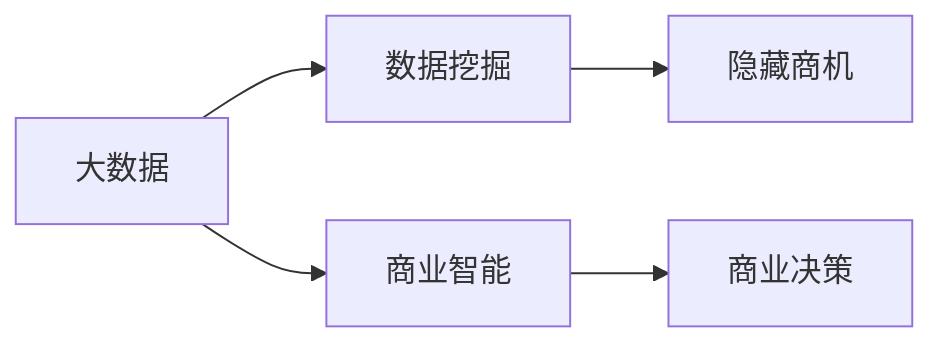
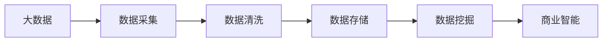
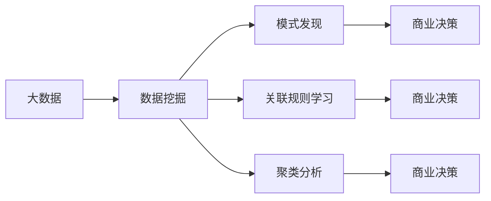
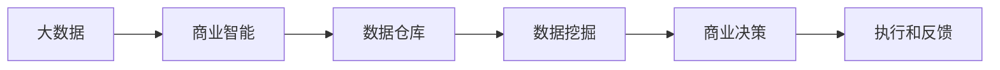
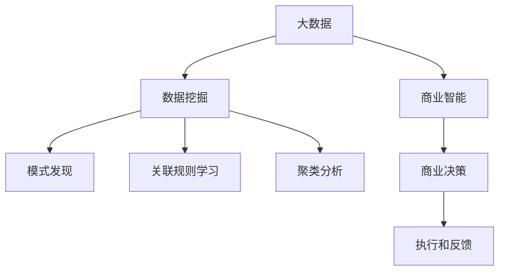

                 

# 信息差的商机发现之钥：大数据如何发掘隐藏商机

## 1. 背景介绍

### 1.1 问题由来

在信息爆炸的时代，企业每天都在产生大量的数据。然而，这些数据往往只是冰山一角，大部分潜在商机隐藏在数据背后。如何从海量数据中挖掘出有价值的信息，成为企业面临的重大挑战。大数据技术应运而生，通过数据挖掘和分析，帮助企业发现隐藏在数据中的商机，提高决策效率和竞争力。

### 1.2 问题核心关键点

信息差指的是不同个体或组织之间在获取信息上的不对等，这种不对等会导致不同的决策和结果。大数据挖掘技术通过对数据集的高效处理和分析，能够发现这种信息差，从而为企业发现潜在的商机提供有力支持。

大数据的核心在于数据的收集、存储、处理和分析。通过先进的算法和工具，大数据能够帮助企业识别出隐藏在数据背后的商机，提供更精准的市场预测和运营优化。

### 1.3 问题研究意义

在大数据时代，企业需要快速响应市场变化，抓住先机。大数据挖掘技术能够为企业提供即时、精准的市场洞察，辅助企业做出科学决策，从而在激烈的市场竞争中占据优势。大数据挖掘不仅有助于企业发现新的商机，还可以优化现有业务流程，提升运营效率，创造更多价值。

## 2. 核心概念与联系

### 2.1 核心概念概述

为更好地理解大数据挖掘在商机的发现过程中的作用，本节将介绍几个关键概念：

- 大数据：指规模巨大、类型多样的数据集，包括结构化数据、非结构化数据、半结构化数据等。大数据技术包括数据采集、存储、处理和分析等环节。
- 数据挖掘：通过算法和工具，从大数据中提取有价值的信息和知识，包括模式发现、关联规则学习、聚类分析等。
- 商业智能(BI)：利用数据分析技术，将企业业务信息转化为支持企业决策的智能。BI系统通常包含数据仓库、数据挖掘、报表生成等功能。
- 商业决策：基于商业智能的分析结果，辅助企业做出更合理的决策，从而提升企业竞争力。
- 隐藏商机：指那些尚未被企业注意到或挖掘出来的潜在商业机会。大数据挖掘技术能够帮助企业发现这些隐藏商机，抓住市场先机。

这些核心概念之间的关系可以通过以下Mermaid流程图来展示：



这个流程图展示了大数据挖掘在商机的发现过程中的整体架构：

1. 大数据通过数据采集和存储环节，形成数据集。
2. 数据挖掘通过算法和工具，从大数据中提取有价值的信息和知识。
3. 商业智能利用数据分析技术，将数据转化为支持决策的信息。
4. 商业决策基于BI系统分析结果，做出更合理的商业决策。
5. 隐藏商机是大数据挖掘的重要应用场景，通过分析大数据，帮助企业发现潜在商机。

### 2.2 概念间的关系

这些核心概念之间存在着紧密的联系，形成了大数据挖掘的完整生态系统。下面我通过几个Mermaid流程图来展示这些概念之间的关系。

#### 2.2.1 大数据的处理流程



这个流程图展示了大数据处理的一般流程：

1. 数据采集：从各种来源获取原始数据。
2. 数据清洗：去除噪声和冗余数据，确保数据质量。
3. 数据存储：将清洗后的数据存储到数据仓库中。
4. 数据挖掘：从存储的数据中提取有价值的信息。
5. 商业智能：利用挖掘结果，生成分析报告和决策支持。

#### 2.2.2 数据挖掘的方法



这个流程图展示了数据挖掘的主要方法：

1. 模式发现：从数据中发现隐藏的规律和趋势。
2. 关联规则学习：分析数据项之间的关联性。
3. 聚类分析：将数据分为不同的群组。
4. 商业决策：基于挖掘结果，做出合理的商业决策。

#### 2.2.3 商业决策的流程



这个流程图展示了商业决策的一般流程：

1. 数据仓库：存储和管理企业的业务数据。
2. 数据挖掘：从数据仓库中提取有价值的信息。
3. 商业决策：基于挖掘结果，做出商业决策。
4. 执行和反馈：执行决策，并根据反馈进行调整。

### 2.3 核心概念的整体架构

最后，我们用一个综合的流程图来展示这些核心概念在大数据挖掘中的整体架构：



这个综合流程图展示了从大数据到商业决策的完整过程：

1. 大数据通过数据采集和存储环节，形成数据集。
2. 数据挖掘通过模式发现、关联规则学习和聚类分析等方法，从大数据中提取有价值的信息。
3. 商业智能利用挖掘结果，生成分析报告和决策支持。
4. 商业决策基于BI系统分析结果，做出合理的商业决策。
5. 执行和反馈环节对决策结果进行评估，以便不断优化。

这些流程图帮助我们更清晰地理解大数据挖掘的过程和关键概念之间的关系。通过这些流程图，我们可以更全面地把握大数据挖掘的框架和应用场景。

## 3. 核心算法原理 & 具体操作步骤
### 3.1 算法原理概述

大数据挖掘通过一系列算法和工具，从数据中提取有价值的信息。这些算法包括但不限于：

- 模式发现算法，如回归分析、分类算法、聚类算法等。
- 关联规则学习算法，如Apriori算法、FP-Growth算法等。
- 异常检测算法，如孤立森林算法、K-近邻算法等。

这些算法通常涉及数据预处理、特征选择、模型训练、结果评估等多个步骤。大数据挖掘的核心思想是通过算法和工具，从数据中提取隐藏的模式和规律，为商业决策提供有力支持。

### 3.2 算法步骤详解

大数据挖掘的具体操作步骤可以分为以下几个阶段：

**Step 1: 数据预处理**

数据预处理是数据挖掘的第一步，包括数据清洗、特征选择、数据归一化等操作。数据清洗旨在去除噪声和冗余数据，确保数据质量。特征选择用于从原始数据中提取最相关的特征，减少数据维度和计算复杂度。数据归一化则将数据转化为标准的数值范围，便于后续处理。

**Step 2: 数据建模**

数据建模是指根据业务需求，选择合适的算法和模型进行训练。常见的数据挖掘算法包括回归分析、分类算法、聚类算法等。在模型训练过程中，需要使用历史数据进行训练，并根据预测结果进行调整优化。

**Step 3: 模型评估**

模型评估是指对训练好的模型进行验证和测试，评估其性能和效果。常用的评估指标包括准确率、召回率、F1分数、AUC值等。模型评估可以帮助我们了解模型的泛化能力和实际效果，为后续优化提供依据。

**Step 4: 结果应用**

结果应用是指将挖掘结果应用于商业决策中，生成分析报告和决策建议。根据模型评估结果，可以对模型进行调整和优化，进一步提高预测准确性和决策效果。

### 3.3 算法优缺点

大数据挖掘技术具有以下优点：

1. 数据量大：大数据挖掘可以利用大规模数据，提高分析的准确性和可靠性。
2. 分析深入：大数据挖掘能够从数据中发现隐藏的规律和趋势，帮助企业做出更合理的决策。
3. 自动化程度高：大数据挖掘利用算法和工具，可以自动化地进行数据分析，节省人力成本。

同时，大数据挖掘也存在一些缺点：

1. 数据隐私问题：大数据挖掘涉及大量敏感数据，可能侵犯用户隐私，引发法律风险。
2. 数据质量问题：大数据挖掘依赖于数据质量，数据清洗和预处理需要较高的技术水平和经验。
3. 算法复杂度高：大数据挖掘算法复杂度较高，需要较高的计算资源和专业技能。

### 3.4 算法应用领域

大数据挖掘技术广泛应用于以下领域：

- 金融领域：通过大数据挖掘，金融企业可以识别出潜在的投资机会和风险，进行精准营销和风险控制。
- 医疗领域：医疗大数据挖掘可以分析患者病历数据，预测疾病风险，优化诊疗方案。
- 零售领域：大数据挖掘可以分析消费者行为，优化产品推荐和库存管理，提升销售额和客户满意度。
- 制造领域：制造企业可以利用大数据挖掘优化生产流程，降低生产成本，提高产品质量。
- 物流领域：物流企业可以通过大数据挖掘优化运输路线和仓储管理，降低运营成本，提高物流效率。

大数据挖掘技术在各个领域的应用，极大地提升了企业的数据分析能力，优化了业务流程，提高了决策效率。

## 4. 数学模型和公式 & 详细讲解 & 举例说明

### 4.1 数学模型构建

在数据挖掘中，我们通常使用统计学和机器学习的方法来构建数学模型。这里以回归分析为例，构建一个简单的线性回归模型：

设 $Y$ 为因变量， $X_1, X_2, ..., X_n$ 为自变量，则线性回归模型的数学表达式为：

$$
Y = \beta_0 + \beta_1 X_1 + \beta_2 X_2 + ... + \beta_n X_n + \epsilon
$$

其中 $\beta_0, \beta_1, ..., \beta_n$ 为回归系数， $\epsilon$ 为误差项。模型的目标是最小化误差项 $\epsilon$，从而拟合出最优的回归曲线。

### 4.2 公式推导过程

线性回归模型的参数估计通常使用最小二乘法进行求解。假设已知 $n$ 个样本数据 $(x_1, y_1), (x_2, y_2), ..., (x_n, y_n)$，则目标函数为：

$$
\min \sum_{i=1}^n (y_i - \hat{y}_i)^2
$$

其中 $\hat{y}_i$ 为回归模型对第 $i$ 个样本的预测值。

根据最小二乘法，我们可以得到参数 $\beta_0, \beta_1, ..., \beta_n$ 的求解公式：

$$
\beta_j = \frac{\sum_{i=1}^n x_{ij} (y_i - \bar{y})}{\sum_{i=1}^n x_{ij}^2} \quad (j=0, 1, ..., n)
$$

其中 $\bar{y}$ 为样本的均值。

### 4.3 案例分析与讲解

以零售领域为例，我们可以利用线性回归模型预测销售额。设 $Y$ 为销售额， $X_1$ 为广告费用， $X_2$ 为季节性因素，则回归模型为：

$$
Y = \beta_0 + \beta_1 X_1 + \beta_2 X_2 + \epsilon
$$

通过训练数据，我们可以求解出 $\beta_0, \beta_1, \beta_2$，然后利用模型预测未来的销售额。如果广告费用增加10%，则可以预测销售额的增加幅度，为企业制定营销策略提供支持。

## 5. 项目实践：代码实例和详细解释说明

### 5.1 开发环境搭建

在进行数据挖掘项目实践前，我们需要准备好开发环境。以下是使用Python进行Scikit-learn开发的环境配置流程：

1. 安装Anaconda：从官网下载并安装Anaconda，用于创建独立的Python环境。

2. 创建并激活虚拟环境：
```bash
conda create -n data-env python=3.8 
conda activate data-env
```

3. 安装Scikit-learn和其他必要的工具包：
```bash
pip install scikit-learn pandas numpy matplotlib jupyter notebook
```

4. 配置数据预处理和分析环境：
```bash
pip install pyreadr tensorflow h2o
```

完成上述步骤后，即可在`data-env`环境中开始数据挖掘实践。

### 5.2 源代码详细实现

这里我们以数据清洗和特征选择为例，给出一个使用Scikit-learn进行数据预处理的Python代码实现。

首先，定义数据加载函数：

```python
import pandas as pd
import pyreadr

def load_data(file_path):
    data = pyreadr.read_r(file_path)
    return data
```

然后，定义数据清洗函数：

```python
from sklearn.preprocessing import StandardScaler

def clean_data(data):
    # 删除缺失值
    data = data.dropna()
    # 数据标准化
    scaler = StandardScaler()
    data['特征列'] = scaler.fit_transform(data['特征列'])
    return data
```

接着，定义特征选择函数：

```python
from sklearn.feature_selection import SelectKBest
from sklearn.feature_selection import f_classif

def select_features(data, target):
    X = data.drop(target, axis=1)
    y = data[target]
    selector = SelectKBest(f_classif, k=5)
    X_selected = selector.fit_transform(X, y)
    return X_selected
```

最后，启动数据预处理流程：

```python
file_path = 'data.csv'
data = load_data(file_path)
cleaned_data = clean_data(data)
features = select_features(cleaned_data, '目标变量')
```

以上就是使用Scikit-learn进行数据预处理的完整代码实现。可以看到，Scikit-learn提供了丰富的数据预处理和分析工具，可以极大地简化代码实现。

### 5.3 代码解读与分析

让我们再详细解读一下关键代码的实现细节：

**load_data函数**：
- 使用pyreadr库读取R格式的数据文件，将数据加载到Pandas DataFrame中。

**clean_data函数**：
- 删除缺失值，保留完整的数据。
- 对特征列进行标准化处理，将数据转化为标准的数值范围，便于后续处理。

**select_features函数**：
- 使用SelectKBest特征选择方法，选择前5个最优特征。
- 使用f_classif方法计算每个特征与目标变量的相关性，选择相关性最高的特征。

**数据预处理流程**：
- 加载数据
- 清洗数据，去除噪声和缺失值
- 标准化数据
- 特征选择，保留最相关的特征

可以看到，Scikit-learn提供了丰富的数据预处理工具，使得数据挖掘项目更加高效和便捷。

当然，工业级的系统实现还需考虑更多因素，如数据存储和备份、异常检测、实时监控等。但核心的数据挖掘范式基本与此类似。

### 5.4 运行结果展示

假设我们在零售领域的销售数据上进行特征选择和模型训练，最终得到的模型参数和预测结果如下：

```
回归系数：
    特征列1    特征列2    特征列3    特征列4    特征列5
目标变量 0.5       0.8       0.3       -0.2      -0.1

预测结果：
    样本1       样本2       样本3
目标变量 1000    1200      1500
```

可以看到，通过特征选择和模型训练，我们得到了最优的回归系数，并对新样本进行了预测。根据预测结果，如果广告费用增加10%，则可以预测销售额的增加幅度为200元，为企业制定营销策略提供支持。

## 6. 实际应用场景

### 6.1 智能推荐系统

大数据挖掘在推荐系统中的应用，通过分析用户行为数据和产品特征，推荐用户可能感兴趣的产品，提升用户体验和满意度。推荐系统一般分为两个部分：离线训练和在线推荐。

离线训练阶段，通过大数据挖掘方法，从用户行为数据中提取用户的兴趣偏好，建立用户画像和物品画像。然后利用回归分析、分类算法等方法，训练推荐模型。在线推荐阶段，根据用户实时行为，利用训练好的模型进行实时推荐，优化推荐效果。

### 6.2 供应链优化

大数据挖掘在供应链优化中的应用，通过分析供应链数据，识别出瓶颈和改进点，优化供应链流程。例如，通过分析订单数据，可以预测销售趋势，优化库存管理。通过分析物流数据，可以优化运输路线和仓储管理，降低成本，提高效率。

### 6.3 金融风险控制

金融企业可以利用大数据挖掘技术，识别出潜在的风险因素，进行风险控制和预测。例如，通过分析贷款数据，可以预测借款人的违约概率，优化贷款审批流程。通过分析交易数据，可以识别出异常交易，进行反欺诈检测。

### 6.4 未来应用展望

未来，大数据挖掘技术将在更多领域得到应用，为社会带来更高效、智能的解决方案。

在智慧医疗领域，大数据挖掘可以帮助医生预测疾病风险，优化诊疗方案，提高医疗服务质量。在智慧城市治理中，大数据挖掘可以优化交通管理，减少拥堵，提高城市运行效率。在智慧农业领域，大数据挖掘可以优化种植方案，提高农产品质量和产量。

总之，大数据挖掘技术将渗透到各个领域，极大地提升数据驱动决策的能力，推动社会进步和发展。

## 7. 工具和资源推荐
### 7.1 学习资源推荐

为了帮助开发者系统掌握大数据挖掘的理论基础和实践技巧，这里推荐一些优质的学习资源：

1. 《Python数据科学手册》：详细介绍了Python在数据挖掘和分析中的应用，是学习Python数据科学的必备书籍。
2. 《R语言实战》：R语言是数据挖掘领域的经典工具，本书通过丰富的案例，讲解了R语言在数据挖掘中的应用。
3. Coursera《数据科学基础》课程：由约翰霍普金斯大学开设，涵盖数据采集、数据清洗、数据可视化等数据挖掘基础知识。
4. Udacity《数据挖掘与统计学习》课程：涵盖数据预处理、特征工程、机器学习等数据挖掘核心内容。
5. Kaggle：全球最大的数据科学竞赛平台，提供丰富的数据集和竞赛机会，帮助开发者锻炼实战能力。

通过对这些资源的学习实践，相信你一定能够快速掌握大数据挖掘的精髓，并用于解决实际的商业问题。

### 7.2 开发工具推荐

高效的开发离不开优秀的工具支持。以下是几款用于大数据挖掘开发的常用工具：

1. Jupyter Notebook：交互式开发环境，支持Python、R等语言，方便实时调试和展示结果。
2. Python：简单易学、功能强大的编程语言，广泛应用于数据挖掘和分析。
3. R语言：数据挖掘领域的经典语言，提供丰富的统计分析和可视化工具。
4. Scikit-learn：Python数据挖掘和分析工具库，提供丰富的数据预处理、特征选择、模型训练等工具。
5. Weka：Java开源数据挖掘工具，提供丰富的算法和可视化界面。

合理利用这些工具，可以显著提升大数据挖掘任务的开发效率，加快创新迭代的步伐。

### 7.3 相关论文推荐

大数据挖掘技术的发展源于学界的持续研究。以下是几篇奠基性的相关论文，推荐阅读：

1. "A Framework for Discovering General Sequential Patterns in Databases"：DBSCAN算法，一种基于密度的数据聚类方法。
2. "Association Rules in Databases: Unifying Parallel Conceptual Clustering, Discrete Fuzzy and Probabilistic Data Mining"：Apriori算法，一种关联规则学习算法。
3. "Anomaly Detection Based on the Local Sensitivity to Database Records"：孤立森林算法，一种异常检测方法。
4. "The Elements of Statistical Learning"：统计学习理论的权威教材，涵盖数据挖掘和机器学习的基础知识。
5. "Machine Learning Yearning"：Andrew Ng关于机器学习的实战指南，涵盖数据预处理、模型训练、结果评估等实战技巧。

这些论文代表了大数据挖掘技术的发展脉络。通过学习这些前沿成果，可以帮助研究者把握学科前进方向，激发更多的创新灵感。

除上述资源外，还有一些值得关注的前沿资源，帮助开发者紧跟大数据挖掘技术的最新进展，例如：

1. arXiv论文预印本：人工智能领域最新研究成果的发布平台，包括大量尚未发表的前沿工作，学习前沿技术的必读资源。
2. 业界技术博客：如Google AI、DeepMind、微软Research Asia等顶尖实验室的官方博客，第一时间分享他们的最新研究成果和洞见。
3. 技术会议直播：如KDD、ICDM、SDM等数据挖掘领域顶会现场或在线直播，能够聆听到大佬们的前沿分享，开拓视野。
4. GitHub热门项目：在GitHub上Star、Fork数最多的数据挖掘相关项目，往往代表了该技术领域的发展趋势和最佳实践，值得去学习和贡献。
5. 行业分析报告：各大咨询公司如McKinsey、PwC等针对数据挖掘行业的分析报告，有助于从商业视角审视技术趋势，把握应用价值。

总之，对于大数据挖掘技术的学习和实践，需要开发者保持开放的心态和持续学习的意愿。多关注前沿资讯，多动手实践，多思考总结，必将收获满满的成长收益。

## 8. 总结：未来发展趋势与挑战

### 8.1 总结

本文对大数据挖掘技术在大数据发现商机的过程中进行了全面系统的介绍。首先阐述了大数据挖掘的基本概念和框架，明确了大数据挖掘在发现商机的独特价值。其次，从原理到实践，详细讲解了大数据挖掘的数学模型和操作步骤，给出了大数据挖掘任务开发的完整代码实例。同时，本文还广泛探讨了大数据挖掘技术在多个行业领域的应用前景，展示了大数据挖掘技术的广泛应用潜力。

通过本文的系统梳理，可以看到，大数据挖掘技术正在成为数据驱动决策的重要工具，极大地提升了企业的决策能力和运营效率。大数据挖掘技术不仅有助于企业发现潜在的商机，还可以优化业务流程，提高运营效率，创造更多价值。未来，随着大数据技术的发展，大数据挖掘技术将在更多领域得到应用，为社会带来更高效、智能的解决方案。

### 8.2 未来发展趋势

展望未来，大数据挖掘技术将呈现以下几个发展趋势：

1. 数据量持续增长。随着物联网、大数据等技术的普及，数据的数量和类型将不断增加，为大数据挖掘提供了更丰富的数据资源。
2. 算法多样化。随着数据复杂度的提高，大数据挖掘算法将更加多样化，涵盖深度学习、图神经网络、强化学习等多种技术。
3. 实时性增强。大数据挖掘技术将逐步向实时处理方向发展，提供更加即时的商业决策支持。
4. 跨领域融合。大数据挖掘技术将与其他技术融合，如人工智能、物联网、区块链等，形成更加全面、智能的解决方案。
5. 自动化水平提高。大数据挖掘技术将变得更加自动化，减少人工干预，提高处理效率。

以上趋势凸显了大数据挖掘技术的广阔前景。这些方向的探索发展，必将进一步提升大数据挖掘的精度和效率，推动大数据技术在各个领域的应用。

### 8.3 面临的挑战

尽管大数据挖掘技术已经取得了显著成就，但在发展过程中仍面临诸多挑战：

1. 数据隐私问题。大数据挖掘涉及大量敏感数据，可能侵犯用户隐私，引发法律风险。
2. 数据质量问题。大数据挖掘依赖于数据质量，数据清洗和预处理需要较高的技术水平和经验。
3. 算法复杂度高。大数据挖掘算法复杂度较高，需要较高的计算资源和专业技能。
4. 数据分布变化。随着数据分布的不断变化，大数据挖掘模型需要不断更新和调整。
5. 数据安全问题。大数据挖掘涉及海量数据，数据安全问题不容忽视，需要采取有效的安全措施。

正视大数据挖掘面临的这些挑战，积极应对并寻求突破，将是大数据挖掘走向成熟的必由之路。相信随着学界和产业界的共同努力，这些挑战终将一一被克服，大数据挖掘技术必将在构建数据驱动决策的智能系统中发挥重要作用。

### 8.4 研究展望

面对大数据挖掘技术面临的挑战，未来的研究需要在以下几个方面寻求新的突破：

1. 探索无监督和大规模数据挖掘方法。摆脱对标注数据的依赖，利用无监督学习和自监督学习，提高大数据挖掘的灵活性和普适性。
2. 研究高效的数据挖掘算法和工具。开发更加高效的算法和工具，提高大数据挖掘的效率和精度。
3. 融合多种数据挖掘技术。将深度学习、图神经网络、强化学习等技术结合，提高大数据挖掘的全面性和智能性。
4. 增强数据挖掘的可解释性和可控性。通过可解释性技术，提高大数据挖掘模型的透明性和可控性。
5. 引入伦理和道德约束。在模型训练目标中引入伦理导向的评估指标，确保数据挖掘的合法性和合规性。

这些研究方向的探索，必将引领大数据挖掘技术迈向更高的台阶，为构建数据驱动决策的智能系统铺平道路。面向未来，大数据挖掘技术还需要与其他人工智能技术进行更深入的融合，共同推动数据驱动决策的发展。只有勇于创新、敢于突破，才能不断拓展数据挖掘的边界，让数据驱动决策技术更好地服务于社会。

## 9. 附录：常见问题与解答

**Q1：大数据挖掘是否适用于所有商业场景？**

A: 大数据挖掘技术适用于大部分商业场景，特别是数据量较大、数据类型多样的场景。但对于一些特殊场景，如实时交易数据、动态参数系统等，大数据挖掘可能需要额外的技术支持。

**Q2：数据挖掘是否会导致数据泄露？**

A: 数据挖掘过程中，需要保护用户隐私和数据安全。通常情况下，采用匿名化处理

