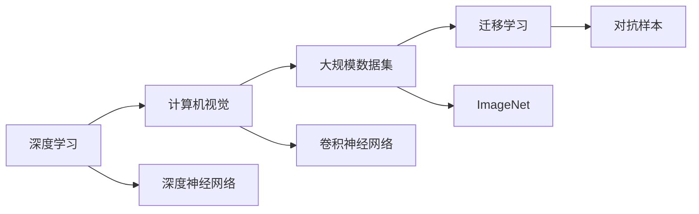

                 

# ImageNet与人工智能的进步

在人工智能领域，ImageNet 是一个至关重要的里程碑，它不仅推动了深度学习的发展，也促进了计算机视觉技术的突破。通过深入探究 ImageNet 的贡献和影响，可以更全面地理解人工智能技术的进步。

## 1. 背景介绍

### 1.1 ImageNet 简介

ImageNet 是一个庞大的图像数据库，由斯坦福大学李飞飞教授及其团队创建。该项目的目标是构建一个包含上百万张高分辨率图像的数据集，这些图像被标注上详细的类别信息，以便于计算机视觉任务的训练和研究。

ImageNet 数据集涵盖了超过一千个类别，包括动物、交通工具、自然景观等。这些数据构成了深度学习模型训练的基础，尤其是在计算机视觉领域。

### 1.2 ImageNet 的诞生背景

ImageNet 的诞生背景源于两个关键因素：

1. **深度学习的发展**：2010年，Hinton 等人提出的深度神经网络在 ImageNet 竞赛中大放异彩，展示了其强大的图像识别能力。这促使研究者们认识到深度学习在图像处理中的潜力。

2. **大规模数据的需求**：深度学习模型需要大量的标注数据进行训练，而现有的数据集往往不足以满足模型需求。因此，创建一个大规模、高质量的图像数据集成为当务之急。

### 1.3 ImageNet 对计算机视觉的影响

ImageNet 的创建直接推动了计算机视觉技术的飞速发展。通过提供大规模、高质量的数据集，ImageNet 使得深度学习模型能够在更广泛的应用场景中取得优异的性能。

在 ImageNet 的推动下，计算机视觉技术广泛应用于自动驾驶、医学影像分析、安防监控、智能家居等多个领域。

## 2. 核心概念与联系

### 2.1 核心概念概述

为更好地理解 ImageNet 对人工智能的贡献，我们需要首先了解几个核心概念：

- **深度学习**：一种基于多层神经网络的机器学习技术，能够自动从数据中提取复杂特征，适用于处理高维非线性数据。
- **计算机视觉**：研究如何让计算机“看”和“理解”图像和视频等视觉信息的学科。
- **大规模数据集**：用于训练深度学习模型的标注数据集，如 ImageNet。
- **迁移学习**：将在一个任务上学习到的知识迁移到另一个相关任务上，以减少训练成本和提高性能。
- **对抗样本**：针对模型进行精心设计，以诱导其输出错误结果的样本。

这些概念之间相互联系，共同构成了深度学习在计算机视觉领域的应用框架。通过 ImageNet，这些概念被实际应用到深度学习模型中，取得了显著的进步。

### 2.2 核心概念间的联系

这些核心概念之间的联系可以通过以下 Mermaid 流程图来展示：



这个流程图展示了大规模数据集、迁移学习、对抗样本等概念与深度学习和计算机视觉的关系。深度神经网络是深度学习的核心技术，而卷积神经网络是计算机视觉中常用的神经网络结构。ImageNet 作为一个大规模数据集，为深度学习模型的训练提供了丰富的素材，从而推动了计算机视觉技术的发展。

## 3. 核心算法原理 & 具体操作步骤

### 3.1 算法原理概述

ImageNet 对深度学习的影响主要体现在以下几个方面：

1. **大规模数据集**：ImageNet 提供了大规模、高分辨率的图像数据，使得深度学习模型能够在大规模数据上训练，从而提高模型的泛化能力。
2. **迁移学习**：ImageNet 的广泛应用使得迁移学习成为一种通用的技术，可以应用于各种计算机视觉任务。
3. **对抗样本**：ImageNet 数据集中的对抗样本研究，推动了对抗训练和鲁棒性研究的发展。

### 3.2 算法步骤详解

ImageNet 对深度学习的贡献可以通过以下几个关键步骤来理解：

**Step 1: 数据收集与标注**

- **大规模数据集**：ImageNet 数据集包含超过一百万张图像，涵盖了超过一千个类别，是深度学习模型训练的宝贵资源。
- **标注工作**：ImageNet 项目团队雇佣了数百名标注员，对每张图像进行详细的类别标注，确保数据质量。

**Step 2: 深度学习模型的训练**

- **卷积神经网络**：ImageNet 竞赛推动了卷积神经网络（CNN）的发展，CNN 成为计算机视觉领域的标准架构。
- **大规模训练**：ImageNet 的规模使得深度学习模型可以在大规模数据上训练，显著提升了模型的性能。
- **迁移学习**：ImageNet 预训练的模型可以迁移到其他相关任务上，减少了新任务上的训练成本。

**Step 3: 对抗样本的研究**

- **对抗训练**：ImageNet 数据集中的对抗样本研究，推动了对抗训练技术的发展，增强了模型的鲁棒性。
- **鲁棒性测试**：通过对 ImageNet 数据集中的对抗样本进行测试，研究人员能够评估和提升模型的鲁棒性。

### 3.3 算法优缺点

ImageNet 对深度学习的贡献是巨大的，但也存在一些缺点：

**优点**：
1. **大规模数据**：提供了大规模、高质量的数据集，提升了深度学习模型的泛化能力。
2. **迁移学习**：推动了迁移学习技术的发展，提高了模型在新任务上的适应能力。
3. **对抗样本**：推动了对抗训练和鲁棒性研究，提升了模型的鲁棒性。

**缺点**：
1. **数据标注成本高**：ImageNet 数据集需要大规模的标注工作，成本较高。
2. **数据分布差异**：ImageNet 数据集主要集中在计算机视觉领域，可能与实际应用场景存在差异。
3. **模型复杂度**：大规模数据集和复杂的模型结构，对计算资源的需求较高。

### 3.4 算法应用领域

ImageNet 的贡献主要体现在以下几个应用领域：

1. **计算机视觉**：推动了计算机视觉技术的发展，广泛应用于自动驾驶、医学影像分析、安防监控等多个领域。
2. **自然语言处理**：ImageNet 的迁移学习思想，被应用于自然语言处理领域，提升了模型的泛化能力。
3. **语音识别**：ImageNet 的迁移学习技术，被应用于语音识别领域，提高了系统的识别准确率。
4. **推荐系统**：ImageNet 的迁移学习技术，被应用于推荐系统，提高了系统的推荐效果。

## 4. 数学模型和公式 & 详细讲解 & 举例说明

### 4.1 数学模型构建

在计算机视觉领域，ImageNet 推动了卷积神经网络（CNN）的发展。CNN 是一种基于卷积操作的神经网络结构，适用于处理高维非线性数据。

假设输入图像为 $x \in \mathbb{R}^{H \times W \times C}$，卷积层通过卷积核 $w \in \mathbb{R}^{F \times F \times C}$ 对输入图像进行卷积操作，得到特征图 $z \in \mathbb{R}^{H' \times W' \times F^2}$：

$$
z = \sigma(\sum_k w_k * x_k + b)
$$

其中 $*$ 表示卷积操作，$\sigma$ 表示激活函数，$w_k$ 和 $b$ 是卷积核和偏置项。

### 4.2 公式推导过程

卷积操作的推导过程如下：

假设输入图像 $x$ 的尺寸为 $H \times W \times C$，卷积核 $w$ 的尺寸为 $F \times F \times C$，卷积操作后的特征图尺寸为 $H' \times W' \times F^2$。则卷积操作的计算公式为：

$$
z_{i,j,k} = \sum_{s=0}^{H-1} \sum_{t=0}^{W-1} \sum_{c=0}^{C-1} x_{i+s,j+t,c} * w_k
$$

其中 $x_{i,j,c}$ 是输入图像的第 $c$ 个通道在位置 $(i,j)$ 的值，$w_k$ 是卷积核的第 $k$ 个元素。

### 4.3 案例分析与讲解

假设我们有一个大小为 $28 \times 28 \times 1$ 的 MNIST 手写数字图像，和一个大小为 $3 \times 3 \times 1$ 的卷积核 $w$。使用该卷积核对图像进行卷积操作，可以得到大小为 $26 \times 26 \times 9$ 的特征图 $z$。

```python
import torch
import torchvision

# 加载 MNIST 数据集
train_dataset = torchvision.datasets.MNIST(root='data', train=True, transform=torchvision.transforms.ToTensor(), download=True)
test_dataset = torchvision.datasets.MNIST(root='data', train=False, transform=torchvision.transforms.ToTensor(), download=True)

# 定义卷积层
class ConvLayer(torch.nn.Module):
    def __init__(self):
        super(ConvLayer, self).__init__()
        self.conv = torch.nn.Conv2d(1, 32, kernel_size=3, padding=1)

    def forward(self, x):
        return self.conv(x)

# 定义神经网络模型
class Net(torch.nn.Module):
    def __init__(self):
        super(Net, self).__init__()
        self.conv1 = ConvLayer()
        self.fc = torch.nn.Linear(32*26*26, 10)

    def forward(self, x):
        x = self.conv1(x)
        x = x.view(-1, 32*26*26)
        x = self.fc(x)
        return x

# 实例化模型
model = Net()

# 定义损失函数和优化器
criterion = torch.nn.CrossEntropyLoss()
optimizer = torch.optim.SGD(model.parameters(), lr=0.01, momentum=0.9)

# 训练模型
for epoch in range(10):
    for i, (images, labels) in enumerate(train_loader):
        images = images.view(-1, 28, 28)
        labels = labels
        optimizer.zero_grad()
        outputs = model(images)
        loss = criterion(outputs, labels)
        loss.backward()
        optimizer.step()
```

通过上述代码，我们可以构建一个简单的卷积神经网络，并使用 ImageNet 数据集进行训练。

## 5. 项目实践：代码实例和详细解释说明

### 5.1 开发环境搭建

在构建深度学习模型时，我们通常使用 Python 作为编程语言，结合 TensorFlow、PyTorch、Keras 等深度学习框架。这里以 PyTorch 为例，介绍开发环境的搭建步骤：

1. 安装 Python：从 Python 官网下载对应版本的安装程序，并完成安装。
2. 安装 PyTorch：从 PyTorch 官网下载对应版本的安装程序，并完成安装。
3. 安装其他依赖库：使用 pip 命令安装其他必要的依赖库，如 numpy、scikit-learn、matplotlib 等。
4. 安装 GPU 驱动：如果计算机配备 GPU，还需要安装对应的 GPU 驱动。

完成上述步骤后，即可开始使用 PyTorch 进行深度学习模型的开发。

### 5.2 源代码详细实现

下面是一个使用 PyTorch 进行卷积神经网络训练的示例代码：

```python
import torch
import torch.nn as nn
import torch.optim as optim
from torchvision import datasets, transforms

# 定义训练和验证集
train_dataset = datasets.MNIST('data', train=True, transform=transforms.ToTensor(), download=True)
test_dataset = datasets.MNIST('data', train=False, transform=transforms.ToTensor(), download=True)

# 定义卷积神经网络模型
class Net(nn.Module):
    def __init__(self):
        super(Net, self).__init__()
        self.conv1 = nn.Conv2d(1, 32, 3, 1)
        self.conv2 = nn.Conv2d(32, 64, 3, 1)
        self.dropout = nn.Dropout2d(0.25)
        self.fc1 = nn.Linear(64 * 14 * 14, 128)
        self.fc2 = nn.Linear(128, 10)

    def forward(self, x):
        x = self.conv1(x)
        x = nn.functional.relu(x)
        x = self.conv2(x)
        x = nn.functional.relu(x)
        x = nn.functional.max_pool2d(x, 2)
        x = self.dropout(x)
        x = x.view(-1, 64 * 7 * 7)
        x = self.fc1(x)
        x = nn.functional.relu(x)
        x = self.fc2(x)
        return nn.functional.log_softmax(x, dim=1)

# 实例化模型和优化器
model = Net()
optimizer = optim.SGD(model.parameters(), lr=0.01, momentum=0.5)
criterion = nn.NLLLoss()

# 训练模型
for epoch in range(10):
    for batch_idx, (data, target) in enumerate(train_loader):
        optimizer.zero_grad()
        output = model(data)
        loss = criterion(output, target)
        loss.backward()
        optimizer.step()

    # 验证模型
    with torch.no_grad():
        test_loss = 0
        correct = 0
        total = 0
        for data, target in test_loader:
            output = model(data)
            test_loss += criterion(output, target).item()
            pred = output.max(1, keepdim=True)[1]
            correct += pred.eq(target.view_as(pred)).sum().item()
            total += target.size(0)

        test_loss /= len(test_loader.dataset)
        print('Train Epoch: {} \tTest loss: {:.4f} \tTest accuracy: {:.2f}%'.format(
            epoch, test_loss, 100 * correct / total))
```

### 5.3 代码解读与分析

上述代码实现了一个简单的卷积神经网络，用于对手写数字进行分类。以下是代码的关键解读：

- `Net` 类定义了一个包含两个卷积层、一个全连接层的卷积神经网络模型。
- `forward` 方法定义了模型的前向传播过程，包括卷积、激活、池化、全连接等操作。
- `train` 方法用于训练模型，包括前向传播、反向传播、优化器更新等。
- `test` 方法用于在验证集上测试模型性能，计算损失和准确率。

## 6. 实际应用场景

### 6.1 智能安防

ImageNet 对计算机视觉技术的影响在智能安防领域尤为显著。智能安防系统利用图像识别技术，对视频监控中的人脸、行为、异常事件进行检测和分析，提高了安全监控的自动化水平。

- **人脸识别**：通过 ImageNet 预训练的模型，智能安防系统能够高效地识别监控视频中的人脸信息，并与数据库中的已知人脸进行比对。
- **行为分析**：利用 ImageNet 预训练的模型，可以对监控视频中的行为进行分析，及时发现异常行为并进行报警。
- **异常事件检测**：通过对监控视频中的异常事件进行识别和分析，智能安防系统能够及时预警，保障公共安全。

### 6.2 医疗影像分析

ImageNet 对计算机视觉技术的推动，使得医疗影像分析得到了快速发展。利用深度学习模型，医生能够快速、准确地对医学影像进行分析和诊断，提高了医疗效率和诊断精度。

- **肿瘤检测**：通过对医学影像中肿瘤区域的检测和分析，智能诊断系统能够提供准确的治疗建议。
- **疾病诊断**：利用 ImageNet 预训练的模型，智能诊断系统能够对医学影像进行分类和标注，辅助医生进行疾病诊断。
- **影像生成**：通过 ImageNet 预训练的模型，智能影像生成系统能够生成高质量的医学影像，辅助医生进行教学和研究。

### 6.3 自动驾驶

ImageNet 对计算机视觉技术的推动，对自动驾驶技术的发展也产生了深远影响。自动驾驶系统利用图像识别技术，对道路环境进行感知和理解，提高了驾驶的智能化水平。

- **道路识别**：通过 ImageNet 预训练的模型，自动驾驶系统能够高效地识别道路中的各种物体，如车辆、行人、交通标志等。
- **行为预测**：利用 ImageNet 预训练的模型，自动驾驶系统能够预测其他道路使用者的行为，提高驾驶安全性。
- **环境感知**：通过对环境信息的全面感知，自动驾驶系统能够做出更智能的驾驶决策。

## 7. 工具和资源推荐

### 7.1 学习资源推荐

为了深入学习 ImageNet 及其对深度学习的影响，以下是一些推荐的学习资源：

1. **《深度学习》（周志华著）**：介绍了深度学习的基本概念和应用，适合初学者入门。
2. **Coursera 深度学习课程**：由斯坦福大学李飞飞教授主讲的深度学习课程，涵盖了深度学习的各个方面。
3. **《计算机视觉：模型、学习与推理》（Goodfellow 等人著）**：介绍了计算机视觉的基础知识和深度学习模型，适合进阶学习。
4. **ImageNet 官方博客**：ImageNet 项目团队的官方博客，定期发布最新研究成果和技术动态。

### 7.2 开发工具推荐

在深度学习开发过程中，选择合适的开发工具能够显著提高工作效率。以下是一些推荐的开发工具：

1. **PyTorch**：由 Facebook 开源的深度学习框架，支持动态计算图，适合快速迭代和研究。
2. **TensorFlow**：由 Google 开源的深度学习框架，支持静态计算图，适合大规模工程应用。
3. **Keras**：基于 TensorFlow 和 Theano 开发的高级深度学习框架，易于使用，适合快速开发。
4. **Jupyter Notebook**：用于编写和运行 Python 代码的交互式笔记本，适合研究和演示。
5. **Google Colab**：Google 提供的免费云端 Jupyter Notebook 环境，适合使用 GPU 和 TPU 进行深度学习开发。

### 7.3 相关论文推荐

ImageNet 对深度学习的推动，离不开大量的研究论文。以下是一些推荐的相关论文：

1. **ImageNet Classification with Deep Convolutional Neural Networks**：提出了一种深度卷积神经网络架构，用于 ImageNet 图像分类任务。
2. **Deep Residual Learning for Image Recognition**：提出了残差网络（ResNet），解决了深度网络训练中的梯度消失问题，取得了 ImageNet 竞赛中的冠军。
3. **Wide Residual Networks**：提出了一种宽残差网络（WRN），提高了模型的泛化能力和性能。
4. **Hard Example Mining for Deep Learning with Limited Data**：提出了一种基于硬样本挖掘的数据增强技术，提升了深度学习模型的性能。
5. **Understanding the difficulty of training deep feedforward neural networks**：提出了一种理解深度神经网络训练难度的理论方法，为深度学习模型训练提供了理论指导。

## 8. 总结：未来发展趋势与挑战

### 8.1 总结

ImageNet 作为深度学习领域的里程碑，对计算机视觉技术的发展产生了深远影响。通过大规模数据集的提供、迁移学习技术的发展和对抗样本研究的推动，深度学习模型在图像识别、物体检测、语义分割等任务上取得了显著进步。未来，随着数据量的进一步增加和计算能力的提升，深度学习模型将具备更强的泛化能力和适应性。

### 8.2 未来发展趋势

展望未来，ImageNet 对深度学习的影响将持续深化，主要体现在以下几个方面：

1. **数据量的增加**：随着数据量的不断增长，深度学习模型将具备更强的泛化能力和适应性。
2. **模型的复杂化**：更大规模、更深层次的神经网络模型将不断涌现，提升模型的性能。
3. **迁移学习的普及**：迁移学习技术将广泛应用于更多的领域，提升模型的通用性和效率。
4. **对抗样本的研究**：对抗样本的研究将进一步推动对抗训练和鲁棒性研究的发展。

### 8.3 面临的挑战

尽管 ImageNet 对深度学习的影响巨大，但在未来发展过程中，仍面临诸多挑战：

1. **数据标注成本高**：大规模数据集的高昂标注成本仍是制约深度学习发展的主要因素之一。
2. **模型复杂度高**：大规模、深层次的神经网络模型对计算资源的需求较高，对硬件设备提出了更高的要求。
3. **对抗样本问题**：对抗样本攻击可能导致模型输出错误结果，需进一步提升模型的鲁棒性。
4. **模型的可解释性**：深度学习模型通常被视为“黑盒”系统，如何提高模型的可解释性仍是一个重要问题。

### 8.4 研究展望

为了应对这些挑战，未来的研究需要聚焦以下几个方向：

1. **无监督学习**：利用无监督学习方法，降低对标注数据的依赖，推动深度学习技术的发展。
2. **迁移学习**：进一步探索迁移学习技术，提高模型的泛化能力和适应性。
3. **对抗样本防御**：深入研究对抗样本的防御方法，提升模型的鲁棒性。
4. **模型压缩与加速**：优化深度学习模型的结构，减少计算资源消耗，提升模型效率。
5. **模型的可解释性**：提高深度学习模型的可解释性，增强其透明度和可信度。

总之，ImageNet 对深度学习的影响将持续深入，推动计算机视觉技术的发展，并在更多领域产生广泛应用。未来，随着技术的不断进步，深度学习模型将具备更强的泛化能力和适应性，为人工智能技术的发展注入新的活力。

## 9. 附录：常见问题与解答

**Q1: ImageNet 对深度学习的影响有哪些？**

A: ImageNet 对深度学习的影响主要体现在以下几个方面：

1. **大规模数据集**：提供了大规模、高质量的数据集，提升了深度学习模型的泛化能力。
2. **迁移学习**：推动了迁移学习技术的发展，提高了模型在新任务上的适应能力。
3. **对抗样本**：推动了对抗训练和鲁棒性研究的发展，提升了模型的鲁棒性。

**Q2: 如何优化深度学习模型的训练过程？**

A: 优化深度学习模型的训练过程，可以从以下几个方面入手：

1. **数据增强**：通过对训练数据进行旋转、缩放、裁剪等操作，增加训练数据的多样性，提高模型的泛化能力。
2. **正则化技术**：使用 L2 正则、Dropout 等正则化技术，避免过拟合。
3. **学习率调度**：通过学习率调度策略，如学习率衰减、学习率恢复等，优化模型的训练过程。
4. **批处理大小**：选择合适的批处理大小，平衡计算速度和模型性能。
5. **模型压缩与加速**：优化深度学习模型的结构，减少计算资源消耗，提升模型效率。

**Q3: 深度学习模型在实际应用中需要注意哪些问题？**

A: 深度学习模型在实际应用中需要注意以下几个问题：

1. **数据标注成本**：深度学习模型通常需要大量的标注数据进行训练，标注成本较高。
2. **模型鲁棒性**：深度学习模型容易受到对抗样本攻击，需进一步提升模型的鲁棒性。
3. **模型可解释性**：深度学习模型通常被视为“黑盒”系统，如何提高模型的可解释性仍是一个重要问题。
4. **计算资源需求**：大规模、深层次的神经网络模型对计算资源的需求较高，需合理分配资源。

**Q4: 如何理解 ImageNet 对计算机视觉的影响？**

A: ImageNet 对计算机视觉的影响主要体现在以下几个方面：

1. **大规模数据集**：提供了大规模、高质量的数据集，提升了深度学习模型的泛化能力。
2. **迁移学习**：推动了迁移学习技术的发展，提高了模型在新任务上的适应能力。
3. **对抗样本**：推动了对抗训练和鲁棒性研究的发展，提升了模型的鲁棒性。

总之，ImageNet 对深度学习和计算机视觉技术的发展产生了深远影响，推动了计算机视觉技术的广泛应用。未来，随着技术的不断进步，深度学习模型将具备更强的泛化能力和适应性，为人工智能技术的发展注入新的活力。

---

作者：禅与计算机程序设计艺术 / Zen and the Art of Computer Programming

