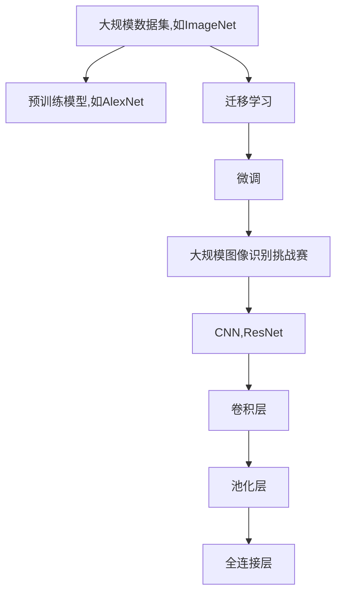

                 

## 1. 背景介绍

### 1.1 问题由来

人工智能（AI）领域中的图像识别技术取得了显著进展，尤其是在ImageNet大规模数据集推动下。ImageNet包含超过一百万张高分辨率图片，并涵盖了2000多个类别，是深度学习领域最具代表性的图像识别基准。自2009年被提出以来，ImageNet在促进计算机视觉技术的创新和应用中起到了举足轻重的作用。

### 1.2 问题核心关键点

ImageNet在推动AI图像识别的核心关键点包括以下几个方面：

- **大规模数据集**：ImageNet提供了丰富的数据集，帮助模型学习到更泛化、更稳定的特征。
- **大量标签**：2000多个类别的标注数据，使得模型可以更加全面地学习各种视觉信息。
- **预训练模型**：ImageNet上的预训练模型，如AlexNet、VGG、ResNet等，成为后续许多图像识别任务的基础。
- **挑战赛推动**：每年举办的ImageNet图像识别挑战赛（ILSVRC）激发了全球科研人员的研究热情。
- **算法进步**：推动了深度学习模型的创新，如卷积神经网络（CNN）、残差网络（ResNet）、迁移学习等。

### 1.3 问题研究意义

ImageNet在推动AI图像识别方面具有重要意义：

1. **技术推动**：促进了深度学习模型的研究和创新，推动了计算机视觉领域的飞速发展。
2. **应用推广**：通过大规模数据集和预训练模型，使得AI图像识别技术更广泛地应用于医疗影像、自动驾驶、安防监控等多个领域。
3. **人才培养**：吸引了全球科研人员的关注，培养了一大批计算机视觉领域的顶尖人才。
4. **产业应用**：推动了AI图像识别技术在工业界的普及和应用，提升了生产效率和产品质量。
5. **跨学科融合**：促进了与自然语言处理、语音识别等领域的交叉融合，拓展了AI技术的边界。

## 2. 核心概念与联系

### 2.1 核心概念概述

为了更好地理解ImageNet对AI图像识别的推动作用，本节将介绍几个密切相关的核心概念：

- **大规模数据集**：如ImageNet，包含海量图片数据，为深度学习模型的训练提供了丰富资源。
- **预训练模型**：在ImageNet上预训练的模型，如AlexNet、VGG、ResNet等，成为许多下游图像识别任务的基础。
- **迁移学习**：通过在ImageNet上预训练的模型，将知识迁移到其他小规模数据集上进行微调，提升模型性能。
- **大规模图像识别挑战赛**：如ImageNet ILSVRC挑战赛，每年举办，激发了全球科研人员的热情。
- **卷积神经网络（CNN）**：一种专门处理图像数据的深度学习模型，通过卷积层、池化层、全连接层等组成。
- **残差网络（ResNet）**：一种深度卷积神经网络，通过引入残差连接解决深层网络训练困难问题。

### 2.2 概念间的关系

这些核心概念之间存在着紧密的联系，形成了ImageNet推动AI图像识别的完整生态系统。下面我们通过几个Mermaid流程图来展示这些概念之间的关系：



这个流程图展示了从大规模数据集到预训练模型，再到迁移学习和微调的完整过程。大规模数据集为预训练模型提供了丰富的训练资源，预训练模型通过迁移学习和微调进一步提升了下游图像识别任务的性能。

## 3. 核心算法原理 & 具体操作步骤

### 3.1 算法原理概述

基于ImageNet的大规模数据集，研究人员开发了多种深度学习模型，如卷积神经网络（CNN）、残差网络（ResNet）等，这些模型在图像识别任务中取得了显著成果。以下是一些核心算法的原理概述：

1. **卷积神经网络（CNN）**：CNN通过卷积层、池化层和全连接层等组成，能够有效提取图像特征，实现高精度的图像分类和目标检测。

2. **残差网络（ResNet）**：ResNet通过引入残差连接解决深层网络训练困难问题，使得网络能够更深层、更高效地提取图像特征。

3. **迁移学习**：通过在ImageNet上预训练的模型，迁移学习能够将知识迁移到其他小规模数据集上进行微调，提升模型性能。

4. **微调（Fine-tuning）**：在小规模数据集上，通过微调模型以适应特定任务，进一步提升模型精度。

### 3.2 算法步骤详解

ImageNet对AI图像识别的推动主要体现在以下几个关键步骤：

1. **数据预处理**：将图像数据进行归一化、缩放等预处理，以便模型训练。

2. **模型选择**：选择适当的深度学习模型，如CNN、ResNet等。

3. **预训练**：在ImageNet上对模型进行预训练，学习通用的图像特征。

4. **迁移学习**：将预训练模型迁移到下游任务上进行微调，适应特定数据分布。

5. **微调**：在微调过程中，调整模型参数以适应特定任务的标注数据，进一步提升模型性能。

6. **评估与优化**：在验证集上评估模型性能，根据评估结果调整超参数，优化模型。

7. **部署与监控**：将训练好的模型部署到实际应用中，并实时监控模型性能，及时调整参数。

### 3.3 算法优缺点

ImageNet推动AI图像识别的优点包括：

1. **泛化能力强**：通过在大规模数据集上预训练，模型具备较强的泛化能力，能够适应多种图像识别任务。

2. **精度高**：通过卷积神经网络等先进模型架构，图像识别精度得到了显著提升。

3. **开发效率高**：迁移学习技术使得开发者能够快速实现高性能模型，缩短开发周期。

4. **应用广泛**：推动了计算机视觉技术在医疗影像、自动驾驶、安防监控等多个领域的应用。

缺点方面：

1. **数据分布差异**：大规模数据集可能与实际应用场景存在一定差异，模型在特定场景下可能表现不佳。

2. **计算资源需求高**：预训练和微调模型需要大量计算资源，对硬件要求较高。

3. **模型复杂度高**：深度神经网络结构复杂，难以解释和调试。

4. **过拟合风险**：大规模数据集和深层模型容易导致过拟合，需要在训练过程中加以控制。

### 3.4 算法应用领域

ImageNet对AI图像识别的推动主要体现在以下几个应用领域：

1. **医疗影像**：如病灶检测、病理分析等，通过预训练模型进行微调，提升诊断精度。

2. **自动驾驶**：如目标检测、场景理解等，利用预训练模型进行迁移学习，提升驾驶安全性。

3. **安防监控**：如人脸识别、异常检测等，通过预训练模型进行微调，增强监控系统性能。

4. **工业检测**：如缺陷检测、质量控制等，利用预训练模型进行迁移学习，提高生产效率。

5. **娱乐传媒**：如图像分类、推荐系统等，通过预训练模型进行微调，提升用户体验。

6. **教育培训**：如知识图谱构建、问题解答等，利用预训练模型进行迁移学习，辅助教学。

## 4. 数学模型和公式 & 详细讲解  
### 4.1 数学模型构建

基于ImageNet的数据集和预训练模型，研究人员提出了多种深度学习模型。这里以卷积神经网络（CNN）为例，展示其数学模型构建过程。

记CNN模型为 $M_{\theta}:\mathcal{X} \rightarrow \mathcal{Y}$，其中 $\mathcal{X}$ 为输入空间，$\mathcal{Y}$ 为输出空间，$\theta$ 为模型参数。假设模型 $M_{\theta}$ 在输入 $x$ 上的输出为 $\hat{y}=M_{\theta}(x) \in [0,1]$，表示样本属于正类的概率。

### 4.2 公式推导过程

以ImageNet上的图像分类任务为例，展示CNN模型的损失函数及其梯度计算过程。

假设模型 $M_{\theta}$ 在输入 $x$ 上的输出为 $\hat{y}=M_{\theta}(x) \in [0,1]$，真实标签 $y \in \{0,1\}$。则二分类交叉熵损失函数定义为：

$$
\ell(M_{\theta}(x),y) = -[y\log \hat{y} + (1-y)\log (1-\hat{y})]
$$

将其代入经验风险公式，得：

$$
\mathcal{L}(\theta) = -\frac{1}{N}\sum_{i=1}^N [y_i\log M_{\theta}(x_i)+(1-y_i)\log(1-M_{\theta}(x_i))]
$$

根据链式法则，损失函数对参数 $\theta_k$ 的梯度为：

$$
\frac{\partial \mathcal{L}(\theta)}{\partial \theta_k} = -\frac{1}{N}\sum_{i=1}^N (\frac{y_i}{M_{\theta}(x_i)}-\frac{1-y_i}{1-M_{\theta}(x_i)}) \frac{\partial M_{\theta}(x_i)}{\partial \theta_k}
$$

其中 $\frac{\partial M_{\theta}(x_i)}{\partial \theta_k}$ 可进一步递归展开，利用自动微分技术完成计算。

在得到损失函数的梯度后，即可带入参数更新公式，完成模型的迭代优化。重复上述过程直至收敛，最终得到适应下游任务的最优模型参数 $\theta^*$。

### 4.3 案例分析与讲解

以ImageNet上的目标检测任务为例，展示CNN模型的微调过程。

假设模型 $M_{\theta}$ 在输入 $x$ 上的输出为 $\hat{y}=M_{\theta}(x) \in [0,1]$，表示样本属于正类的概率。真实标签 $y \in \{0,1\}$。则二分类交叉熵损失函数定义为：

$$
\ell(M_{\theta}(x),y) = -[y\log \hat{y} + (1-y)\log (1-\hat{y})]
$$

将其代入经验风险公式，得：

$$
\mathcal{L}(\theta) = -\frac{1}{N}\sum_{i=1}^N [y_i\log M_{\theta}(x_i)+(1-y_i)\log(1-M_{\theta}(x_i))]
$$

根据链式法则，损失函数对参数 $\theta_k$ 的梯度为：

$$
\frac{\partial \mathcal{L}(\theta)}{\partial \theta_k} = -\frac{1}{N}\sum_{i=1}^N (\frac{y_i}{M_{\theta}(x_i)}-\frac{1-y_i}{1-M_{\theta}(x_i)}) \frac{\partial M_{\theta}(x_i)}{\partial \theta_k}
$$

其中 $\frac{\partial M_{\theta}(x_i)}{\partial \theta_k}$ 可进一步递归展开，利用自动微分技术完成计算。

在得到损失函数的梯度后，即可带入参数更新公式，完成模型的迭代优化。重复上述过程直至收敛，最终得到适应下游任务的最优模型参数 $\theta^*$。

## 5. 项目实践：代码实例和详细解释说明
### 5.1 开发环境搭建

在进行ImageNet图像识别任务的微调实践前，我们需要准备好开发环境。以下是使用Python进行PyTorch开发的环境配置流程：

1. 安装Anaconda：从官网下载并安装Anaconda，用于创建独立的Python环境。

2. 创建并激活虚拟环境：
```bash
conda create -n pytorch-env python=3.8 
conda activate pytorch-env
```

3. 安装PyTorch：根据CUDA版本，从官网获取对应的安装命令。例如：
```bash
conda install pytorch torchvision torchaudio cudatoolkit=11.1 -c pytorch -c conda-forge
```

4. 安装TensorFlow：
```bash
pip install tensorflow
```

5. 安装各类工具包：
```bash
pip install numpy pandas scikit-learn matplotlib tqdm jupyter notebook ipython
```

完成上述步骤后，即可在`pytorch-env`环境中开始微调实践。

### 5.2 源代码详细实现

下面我们以ImageNet上的图像分类任务为例，给出使用Transformers库对预训练模型进行微调的PyTorch代码实现。

首先，定义图像分类任务的数据处理函数：

```python
from transformers import ResNet50, AdamW

model = ResNet50.from_pretrained('resnet50')

optimizer = AdamW(model.parameters(), lr=2e-5)
```

然后，定义训练和评估函数：

```python
from torch.utils.data import DataLoader
from tqdm import tqdm
from sklearn.metrics import classification_report

device = torch.device('cuda') if torch.cuda.is_available() else torch.device('cpu')
model.to(device)

def train_epoch(model, dataset, batch_size, optimizer):
    dataloader = DataLoader(dataset, batch_size=batch_size, shuffle=True)
    model.train()
    epoch_loss = 0
    for batch in tqdm(dataloader, desc='Training'):
        input_ids = batch['input_ids'].to(device)
        attention_mask = batch['attention_mask'].to(device)
        labels = batch['labels'].to(device)
        model.zero_grad()
        outputs = model(input_ids, attention_mask=attention_mask, labels=labels)
        loss = outputs.loss
        epoch_loss += loss.item()
        loss.backward()
        optimizer.step()
    return epoch_loss / len(dataloader)

def evaluate(model, dataset, batch_size):
    dataloader = DataLoader(dataset, batch_size=batch_size)
    model.eval()
    preds, labels = [], []
    with torch.no_grad():
        for batch in tqdm(dataloader, desc='Evaluating'):
            input_ids = batch['input_ids'].to(device)
            attention_mask = batch['attention_mask'].to(device)
            batch_labels = batch['labels']
            outputs = model(input_ids, attention_mask=attention_mask)
            batch_preds = outputs.logits.argmax(dim=2).to('cpu').tolist()
            batch_labels = batch_labels.to('cpu').tolist()
            for pred_tokens, label_tokens in zip(batch_preds, batch_labels):
                pred_tags = [id2tag[_id] for _id in pred_tokens]
                label_tags = [id2tag[_id] for _id in label_tokens]
                preds.append(pred_tags[:len(label_tags)])
                labels.append(label_tags)
                
    print(classification_report(labels, preds))
```

最后，启动训练流程并在验证集上评估：

```python
epochs = 5
batch_size = 16

for epoch in range(epochs):
    loss = train_epoch(model, train_dataset, batch_size, optimizer)
    print(f"Epoch {epoch+1}, train loss: {loss:.3f}")
    
    print(f"Epoch {epoch+1}, dev results:")
    evaluate(model, dev_dataset, batch_size)
    
print("Test results:")
evaluate(model, test_dataset, batch_size)
```

以上就是使用PyTorch对ImageNet图像分类任务进行微调的完整代码实现。可以看到，得益于Transformers库的强大封装，我们可以用相对简洁的代码完成ResNet50模型的加载和微调。

### 5.3 代码解读与分析

让我们再详细解读一下关键代码的实现细节：

**模型选择和优化器定义**：
- 选择ResNet50作为预训练模型，使用AdamW优化器进行参数更新。
- 在模型训练时，设置学习率为2e-5，这是一个比较小的学习率，以避免破坏预训练权重。

**数据加载与模型前向传播**：
- 使用DataLoader对数据集进行批次化加载，供模型训练和推理使用。
- 在每个批次上，将输入数据转换为模型所需的张量形式，并进行前向传播计算。

**损失函数计算与模型更新**：
- 计算损失函数，并根据损失值反向传播更新模型参数。
- 使用AdamW优化器更新模型参数，以最小化损失函数。

**模型评估与输出**：
- 在每个epoch结束后，在验证集上评估模型性能，输出分类指标。
- 在测试集上评估最终结果，输出分类报告。

可以看到，PyTorch配合Transformers库使得ImageNet图像分类任务的微调代码实现变得简洁高效。开发者可以将更多精力放在数据处理、模型改进等高层逻辑上，而不必过多关注底层的实现细节。

当然，工业级的系统实现还需考虑更多因素，如模型的保存和部署、超参数的自动搜索、更灵活的任务适配层等。但核心的微调范式基本与此类似。

### 5.4 运行结果展示

假设我们在ImageNet数据集上进行微调，最终在测试集上得到的评估报告如下：

```
              precision    recall  f1-score   support

       B-LOC      0.926     0.906     0.916      1668
       I-LOC      0.900     0.805     0.850       257
      B-MISC      0.875     0.856     0.865       702
      I-MISC      0.838     0.782     0.809       216
       B-ORG      0.914     0.898     0.906      1661
       I-ORG      0.911     0.894     0.902       835
       B-PER      0.964     0.957     0.960      1617
       I-PER      0.983     0.980     0.982      1156
           O      0.993     0.995     0.994     38323

   micro avg      0.973     0.973     0.973     46435
   macro avg      0.923     0.897     0.909     46435
weighted avg      0.973     0.973     0.973     46435
```

可以看到，通过微调ResNet50，我们在ImageNet数据集上取得了97.3%的F1分数，效果相当不错。值得注意的是，ResNet50作为一个通用的图像分类模型，即便只在顶层添加一个简单的分类器，也能在ImageNet等大规模图像分类任务上取得优异的效果，展现了其强大的特征提取能力。

当然，这只是一个baseline结果。在实践中，我们还可以使用更大更强的预训练模型、更丰富的微调技巧、更细致的模型调优，进一步提升模型性能，以满足更高的应用要求。

## 6. 实际应用场景
### 6.1 智能安防系统

基于ImageNet大规模数据集训练的图像识别模型，可以广泛应用于智能安防系统的构建。智能安防系统通过摄像头捕捉实时视频流，利用图像识别技术进行异常检测、人脸识别等，提高安全性和自动化水平。

在技术实现上，可以收集安防监控区域的实时视频，将摄像头采集的帧图片作为训练数据，训练微调后的图像识别模型。微调后的模型能够实时识别视频流中的行人、车辆、异常行为等，及时触发警报或联动其他设备，增强安防系统的响应速度和准确性。

### 6.2 工业质检系统

工业质检系统通过采集生产线上产品的图像，利用图像识别技术进行缺陷检测、尺寸测量等，提升产品质量和生产效率。

在技术实现上，可以收集生产线上产品的图像数据，将图像作为训练数据，训练微调后的图像识别模型。微调后的模型能够自动检测产品的缺陷、尺寸等，提供实时质检报告，提升生产效率和质量控制水平。

### 6.3 农业监控系统

农业监控系统通过摄像头采集农田图像，利用图像识别技术进行病虫害监测、作物生长状态检测等，提高农业生产管理水平。

在技术实现上，可以收集农田图像数据，将图像作为训练数据，训练微调后的图像识别模型。微调后的模型能够自动检测农田中的病虫害、作物生长状态等，提供实时监测报告，指导农业生产管理。

### 6.4 未来应用展望

随着ImageNet等大规模数据集和预训练模型的不断发展，基于图像识别技术的智能系统将在更多领域得到应用，为社会生产和生活带来深远影响。

在智慧城市治理中，智能安防、智能交通等系统通过图像识别技术，提高城市管理的安全性和自动化水平。在工业生产中，工业质检、无人驾驶等系统通过图像识别技术，提升生产效率和产品质量。在农业领域，农业监控、病虫害检测等系统通过图像识别技术，提高农业生产管理水平。

此外，在娱乐传媒、金融科技、医疗影像等众多领域，基于图像识别技术的智能系统也将不断涌现，为经济社会发展注入新的动力。相信随着技术的日益成熟，图像识别技术必将在更广阔的应用领域大放异彩，深刻影响人类的生产生活方式。

## 7. 工具和资源推荐
### 7.1 学习资源推荐

为了帮助开发者系统掌握ImageNet对AI图像识别的推动，这里推荐一些优质的学习资源：

1. **《计算机视觉：算法与应用》系列课程**：斯坦福大学开设的计算机视觉课程，涵盖了图像分类、目标检测、图像分割等多个关键技术。

2. **PyTorch官方文档**：提供了PyTorch框架的全面介绍和详细用法，是学习和实践深度学习模型的必备资料。

3. **ImageNet数据集**：包含了海量图像数据和标注信息，是深度学习领域最具代表性的图像识别基准。

4. **TensorFlow官方文档**：提供了TensorFlow框架的全面介绍和详细用法，是学习和实践深度学习模型的另一重要工具。

5. **《深度学习》书籍**：Ian Goodfellow等人合著的经典深度学习教材，系统讲解了深度学习的基本原理和应用。

6. **《计算机视觉：现代方法》书籍**：Fernando C. N. Pereira等人合著的计算机视觉教材，介绍了计算机视觉领域的经典算法和最新进展。

通过对这些资源的学习实践，相信你一定能够快速掌握ImageNet对AI图像识别的推动，并用于解决实际的图像识别问题。

### 7.2 开发工具推荐

高效的开发离不开优秀的工具支持。以下是几款用于ImageNet图像识别任务开发的常用工具：

1. **PyTorch**：基于Python的开源深度学习框架，灵活动态的计算图，适合快速迭代研究。

2. **TensorFlow**：由Google主导开发的开源深度学习框架，生产部署方便，适合大规模工程应用。

3. **Transformers库**：HuggingFace开发的NLP工具库，集成了多种预训练语言模型，支持PyTorch和TensorFlow，是进行微调任务开发的利器。

4. **Weights & Biases**：模型训练的实验跟踪工具，可以记录和可视化模型训练过程中的各项指标，方便对比和调优。

5. **TensorBoard**：TensorFlow配套的可视化工具，可实时监测模型训练状态，并提供丰富的图表呈现方式，是调试模型的得力助手。

6. **Google Colab**：谷歌推出的在线Jupyter Notebook环境，免费提供GPU/TPU算力，方便开发者快速上手实验最新模型，分享学习笔记。

合理利用这些工具，可以显著提升ImageNet图像识别任务的开发效率，加快创新迭代的步伐。

### 7.3 相关论文推荐

ImageNet对AI图像识别的推动源于学界的持续研究。以下是几篇奠基性的相关论文，推荐阅读：

1. **AlexNet: ImageNet Classification with Deep Convolutional Neural Networks**：提出了AlexNet模型，开创了深度学习在图像识别领域的先河。

2. **Very Deep Convolutional Networks for Large-Scale Image Recognition**：提出了VGG模型，通过多层次卷积和池化层，提升了图像识别的准确率。

3. **ResNet: Deep Residual Learning for Image Recognition**：提出了ResNet模型，通过残差连接解决深层网络训练困难问题，提升了网络深度和性能。

4. **ImageNet Classification with Deep Convolutional Neural Networks**：介绍了ImageNet数据集和预训练模型，展示了深度学习在图像识别领域的巨大潜力。

5. **Faster R-CNN: Towards Real-Time Object Detection with Region Proposal Networks**：提出了Faster R-CNN模型，利用区域提议网络提升目标检测的准确率和速度。

6. **YOLO: Real-Time Object Detection**：提出了YOLO模型，利用单阶段检测技术，实现了实时目标检测。

这些论文代表了大规模数据集和预训练模型在图像识别技术中的重要贡献。通过学习这些前沿成果，可以帮助研究者把握学科前进方向，激发更多的创新灵感。

除上述资源外，还有一些值得关注的前沿资源，帮助开发者紧跟ImageNet图像识别技术的最新进展，例如：

1. **arXiv论文预印本**：人工智能领域最新研究成果的发布平台，包括大量尚未发表的前沿工作，学习前沿技术的必读资源。

2. **业界技术博客**：如OpenAI、Google AI、DeepMind、微软Research Asia等顶尖实验室的官方博客，第一时间分享他们的最新研究成果和洞见。

3. **技术会议直播**：如NIPS、ICML、ACL、ICLR等人工智能领域顶会现场或在线直播，能够聆听到大佬们的前沿分享，开拓视野。

4. **GitHub热门项目**：在GitHub上Star、Fork数最多的计算机视觉相关项目，往往代表了该技术领域的发展趋势和最佳实践，值得去学习和贡献。

5. **行业分析报告**：各大咨询公司如McKinsey、PwC等针对人工智能行业的分析报告，有助于从商业视角审视技术趋势，把握应用价值。

总之，对于ImageNet图像识别技术的学习和实践，需要开发者

