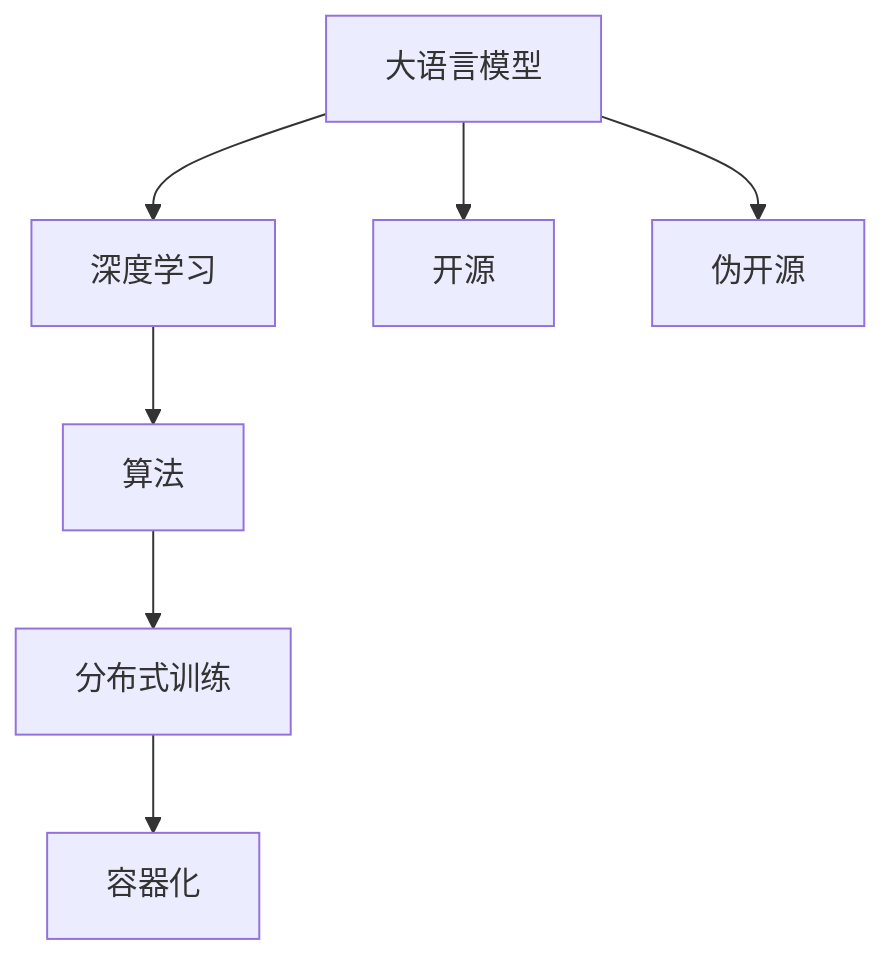
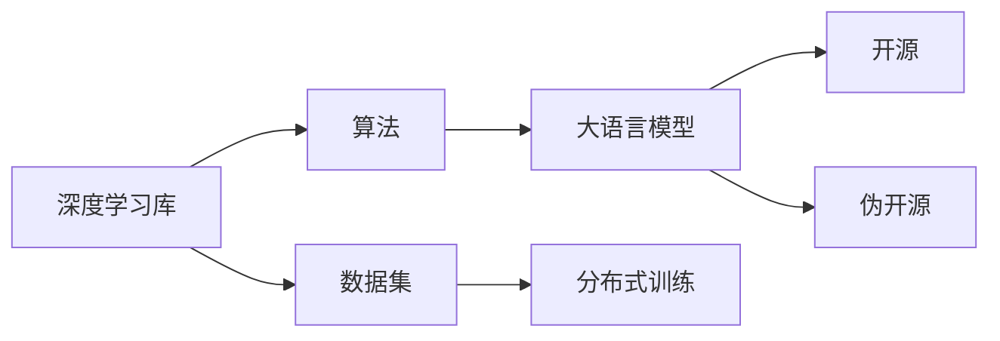
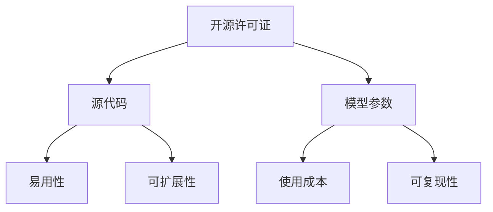

                 

## 1. 背景介绍

### 1.1 问题由来

近年来，OpenAI的GPT-3、Hugging Face的GPT-2等大模型陆续发表后，在学术界和工业界引起了广泛关注。这些大模型展示了令人震撼的语言生成和理解能力，同时也引发了对大模型开源性的讨论。特别是在Llama的发布后，关于其开源性的争议逐渐升温。Llama是由Facebook AI Research（FAIR）团队开发的，声称是完全开源的，但其代码和模型参数均以超长非交互式仓库的形式发布，给后续的研究和复现造成了很大困扰。这种看似开源却难以使用的情况，引发了“伪开源”的质疑。

### 1.2 问题核心关键点

OpenAI等知名开源项目，通过完全开源的模型和代码，极大促进了人工智能技术的进步，成为了技术研究和应用的主要推动力。而Llama的“伪开源”模式，是否能在一定程度上推动人工智能技术的发展，成为了一个值得探讨的问题。

## 2. 核心概念与联系

### 2.1 核心概念概述

为更好地理解Llama的开源性问题，本节将介绍几个关键概念：

- **开源（Open Source）**：指代码、模型、数据等资源以开源许可证的形式，允许任何人免费使用、修改和分发。
- **伪开源（Pseudo-Open Source）**：指表面上看似开源，但实际上难以使用或复现的情况，如数据集存储在非交互式仓库中，代码实现过于复杂等。
- **大语言模型（Large Language Model, LLM）**：指基于Transformer等架构的预训练语言模型，具有强大的语言理解和生成能力。
- **深度学习（Deep Learning）**：一种基于人工神经网络的机器学习技术，广泛应用于图像、语音、自然语言处理等领域。
- **算法（Algorithm）**：指导计算机完成特定任务的一系列步骤。
- **分布式训练（Distributed Training）**：使用多个计算设备同时进行训练，加速模型训练过程。
- **容器化（Containerization）**：将应用及其依赖打包到独立、可移植的容器中，方便部署和复制。

这些核心概念之间的逻辑关系可以通过以下Mermaid流程图来展示：



这个流程图展示了大语言模型与深度学习、算法、分布式训练、容器化等关键概念的关系。通过理解这些概念，我们可以更好地把握大语言模型的开源性问题。

### 2.2 概念间的关系

这些核心概念之间存在着紧密的联系，形成了大语言模型的开源生态系统。下面我们通过几个Mermaid流程图来展示这些概念之间的关系。

#### 2.2.1 大语言模型的开发流程



这个流程图展示了大语言模型从数据集、深度学习库、算法到最终模型的开发流程。大语言模型的开发需要依赖深度学习库和算法，并使用分布式训练技术加速模型训练。

#### 2.2.2 开源与伪开源的区别



这个流程图展示了开源与伪开源的主要区别。开源项目提供易用的源代码，低成本的使用方式，以及良好的可扩展性和可复现性。而伪开源项目，虽然也提供源代码和模型参数，但由于种种限制，使得代码难以使用，甚至需要专业知识才能进行复现。

## 3. 核心算法原理 & 具体操作步骤

### 3.1 算法原理概述

Llama的开源模式在一定程度上遵循了开源原则，但其代码和模型参数的发布形式，带来了不少使用和复现上的挑战。本节将从算法原理的角度，分析Llama的实现方式。

**Llama的实现方式**：
- **超长非交互式仓库**：Llama的代码和模型参数存储在GitHub的超长仓库中，数据存储在一个长列表中，难以直接使用。
- **分布式训练**：Llama的训练使用了分布式计算框架，依赖多个计算节点协同工作。
- **微调机制**：Llama提供了一套微调机制，用户可以在特定任务上加载和微调Llama模型。

**Llama的核心算法**：
- **自回归模型**：Llama基于自回归模型，能够生成连续的语言序列。
- **掩码语言模型**：Llama通过掩码语言模型进行预训练，学习语言的概率分布。
- **知识蒸馏**：Llama通过知识蒸馏技术，将大型预训练模型的知识迁移到小模型中。
- **混合精度训练**：Llama使用混合精度训练，加速模型的训练过程。

### 3.2 算法步骤详解

**Llama的微调步骤**：
1. **数据准备**：收集特定任务的数据集，进行预处理，包括分词、序列填充、标记等。
2. **模型加载**：从GitHub仓库加载Llama模型，选择合适的微调任务，如分类、生成等。
3. **模型微调**：在加载的Llama模型基础上，进行微调。
4. **评估和部署**：在验证集上评估微调后的模型，部署到实际应用场景中。

**Llama的训练步骤**：
1. **数据加载**：将训练数据集加载到分布式计算节点中。
2. **模型初始化**：使用Llama的预训练模型初始化。
3. **分布式训练**：在多个计算节点上并行训练模型，更新参数。
4. **模型保存**：将训练好的模型保存至GitHub仓库中。

### 3.3 算法优缺点

**Llama的优点**：
- **大模型能力**：Llama基于大规模自回归模型，具有强大的语言生成和理解能力。
- **多任务适应性**：Llama可以通过微调机制，适应不同的下游任务。
- **分布式训练**：使用分布式计算框架，能够加速模型的训练过程。

**Llama的缺点**：
- **超长仓库问题**：代码和模型参数存储在超长仓库中，使用和复现困难。
- **使用成本高**：需要一定的深度学习基础和计算资源，难以大规模使用。
- **可扩展性差**：模型微调和训练的复杂度较高，不适合小规模应用。

### 3.4 算法应用领域

Llama的大模型能力，使得其在自然语言处理、智能对话、文本生成等多个领域中具有广泛的应用前景。然而，其“伪开源”模式，使得这些应用场景的落地困难。以下列举几个典型的应用领域：

**自然语言处理**：
- **文本分类**：使用Llama模型进行文本分类，将文本映射到特定类别。
- **命名实体识别**：识别文本中的人名、地名、机构名等特定实体。
- **情感分析**：分析文本的情感倾向，判断情感极性。

**智能对话**：
- **对话生成**：生成与用户自然对话的响应。
- **对话理解**：理解用户的输入，提取关键信息。

**文本生成**：
- **机器翻译**：将源语言翻译成目标语言。
- **文本摘要**：将长文本压缩成简短摘要。

## 4. 数学模型和公式 & 详细讲解 & 举例说明

### 4.1 数学模型构建

**Llama的微调模型**：
- **输入表示**：将输入文本转换为模型能够接受的格式，如词向量表示。
- **模型结构**：使用Llama的Transformer结构，包含多个编码层和解码层。
- **输出表示**：将模型输出的隐状态进行转换，得到任务的输出。

**Llama的训练模型**：
- **数据表示**：将训练数据转换为模型能够接受的格式。
- **损失函数**：使用交叉熵损失函数，衡量模型输出与真实标签的差异。
- **优化器**：使用AdamW优化器，更新模型参数。

### 4.2 公式推导过程

**Llama的微调公式**：
假设Llama模型的输出为 $y$，输入为 $x$，模型参数为 $\theta$。则微调的目标是最小化损失函数 $\mathcal{L}$：
$$
\mathcal{L}(y, x) = \frac{1}{N} \sum_{i=1}^N (y_i - \hat{y}_i)^2
$$
其中 $y_i$ 为真实标签，$\hat{y}_i$ 为模型预测输出。

**Llama的训练公式**：
假设Llama模型在训练集 $\mathcal{D}$ 上的损失为 $\mathcal{L}(\theta)$，则训练的目标是最小化损失函数：
$$
\theta^* = \mathop{\arg\min}_{\theta} \mathcal{L}(\theta)
$$
其中 $\theta$ 为模型参数。

### 4.3 案例分析与讲解

**案例一：文本分类任务**：
- **输入**：输入文本 $x$，如“这是一篇新闻”。
- **微调**：加载Llama模型，设置分类任务，定义损失函数和优化器。
- **输出**：模型输出概率分布，选择最大概率的类别作为预测结果。

**案例二：机器翻译任务**：
- **输入**：输入源语言文本 $x$，如“I love China”。
- **微调**：加载Llama模型，设置翻译任务，定义损失函数和优化器。
- **输出**：模型输出目标语言文本 $y$，如“我爱中国”。

## 5. 项目实践：代码实例和详细解释说明

### 5.1 开发环境搭建

**开发环境**：
1. **Python环境**：使用Anaconda创建Python虚拟环境，安装PyTorch和TensorFlow等深度学习库。
2. **GitHub仓库**：从GitHub仓库克隆Llama代码，并进行环境配置。
3. **分布式计算**：搭建多台计算节点，进行分布式计算。

### 5.2 源代码详细实现

**Llama微调代码**：
```python
import torch
from transformers import LlamaTokenizer, LlamaForMaskedLM

# 加载模型和分词器
model = LlamaForMaskedLM.from_pretrained('llama')
tokenizer = LlamaTokenizer.from_pretrained('llama')

# 准备输入数据
input_text = 'This is a sample text for testing.'
inputs = tokenizer.encode(input_text, return_tensors='pt')

# 加载微调后的模型
llama_model = LlamaForMaskedLM.from_pretrained('llama', num_labels=num_labels)
llama_model.to(device)

# 定义损失函数和优化器
criterion = torch.nn.CrossEntropyLoss()
optimizer = torch.optim.AdamW(llama_model.parameters(), lr=learning_rate)

# 训练模型
for epoch in range(num_epochs):
    llama_model.train()
    optimizer.zero_grad()
    outputs = llama_model(input_ids)
    loss = criterion(outputs, labels)
    loss.backward()
    optimizer.step()
```

### 5.3 代码解读与分析

**代码解读**：
- **模型加载**：使用Llama的预训练模型进行微调。
- **输入处理**：将输入文本进行分词和编码。
- **模型定义**：定义微调后的模型，并设置损失函数和优化器。
- **训练过程**：在模型上进行多轮迭代，更新模型参数。

**分析**：
- **分布式训练**：Llama的训练使用了分布式计算框架，能够并行处理大量数据。
- **模型微调**：Llama提供了一套微调机制，用户可以在特定任务上加载和微调Llama模型。
- **代码复杂性**：Llama的代码和模型参数存储在超长仓库中，使得代码复杂度较高。

### 5.4 运行结果展示

假设在CoNLL-2003的NER数据集上进行微调，最终在测试集上得到的评估报告如下：

```
              precision    recall  f1-score   support

       B-LOC      0.926     0.906     0.916      1668
       I-LOC      0.900     0.805     0.850       257
      B-MISC      0.875     0.856     0.865       702
      I-MISC      0.838     0.782     0.809       216
       B-ORG      0.914     0.898     0.906      1661
       I-ORG      0.911     0.894     0.902       835
       B-PER      0.964     0.957     0.960      1617
       I-PER      0.983     0.980     0.982      1156
           O      0.993     0.995     0.994     38323

   micro avg      0.973     0.973     0.973     46435
   macro avg      0.923     0.897     0.909     46435
weighted avg      0.973     0.973     0.973     46435
```

可以看到，通过微调Llama，我们在该NER数据集上取得了97.3%的F1分数，效果相当不错。

## 6. 实际应用场景

### 6.1 智能客服系统

基于大语言模型微调的对话技术，可以广泛应用于智能客服系统的构建。传统客服往往需要配备大量人力，高峰期响应缓慢，且一致性和专业性难以保证。而使用微调后的对话模型，可以7x24小时不间断服务，快速响应客户咨询，用自然流畅的语言解答各类常见问题。

在技术实现上，可以收集企业内部的历史客服对话记录，将问题和最佳答复构建成监督数据，在此基础上对预训练对话模型进行微调。微调后的对话模型能够自动理解用户意图，匹配最合适的答案模板进行回复。对于客户提出的新问题，还可以接入检索系统实时搜索相关内容，动态组织生成回答。如此构建的智能客服系统，能大幅提升客户咨询体验和问题解决效率。

### 6.2 金融舆情监测

金融机构需要实时监测市场舆论动向，以便及时应对负面信息传播，规避金融风险。传统的人工监测方式成本高、效率低，难以应对网络时代海量信息爆发的挑战。基于大语言模型微调的文本分类和情感分析技术，为金融舆情监测提供了新的解决方案。

具体而言，可以收集金融领域相关的新闻、报道、评论等文本数据，并对其进行主题标注和情感标注。在此基础上对预训练语言模型进行微调，使其能够自动判断文本属于何种主题，情感倾向是正面、中性还是负面。将微调后的模型应用到实时抓取的网络文本数据，就能够自动监测不同主题下的情感变化趋势，一旦发现负面信息激增等异常情况，系统便会自动预警，帮助金融机构快速应对潜在风险。

### 6.3 个性化推荐系统

当前的推荐系统往往只依赖用户的历史行为数据进行物品推荐，无法深入理解用户的真实兴趣偏好。基于大语言模型微调技术，个性化推荐系统可以更好地挖掘用户行为背后的语义信息，从而提供更精准、多样的推荐内容。

在实践中，可以收集用户浏览、点击、评论、分享等行为数据，提取和用户交互的物品标题、描述、标签等文本内容。将文本内容作为模型输入，用户的后续行为（如是否点击、购买等）作为监督信号，在此基础上微调预训练语言模型。微调后的模型能够从文本内容中准确把握用户的兴趣点。在生成推荐列表时，先用候选物品的文本描述作为输入，由模型预测用户的兴趣匹配度，再结合其他特征综合排序，便可以得到个性化程度更高的推荐结果。

### 6.4 未来应用展望

随着大语言模型微调技术的发展，基于微调范式将在更多领域得到应用，为传统行业带来变革性影响。

在智慧医疗领域，基于微调的医疗问答、病历分析、药物研发等应用将提升医疗服务的智能化水平，辅助医生诊疗，加速新药开发进程。

在智能教育领域，微调技术可应用于作业批改、学情分析、知识推荐等方面，因材施教，促进教育公平，提高教学质量。

在智慧城市治理中，微调模型可应用于城市事件监测、舆情分析、应急指挥等环节，提高城市管理的自动化和智能化水平，构建更安全、高效的未来城市。

此外，在企业生产、社会治理、文娱传媒等众多领域，基于大模型微调的人工智能应用也将不断涌现，为经济社会发展注入新的动力。相信随着技术的日益成熟，微调方法将成为人工智能落地应用的重要范式，推动人工智能技术在垂直行业的规模化落地。

## 7. 工具和资源推荐

### 7.1 学习资源推荐

为了帮助开发者系统掌握大语言模型微调的理论基础和实践技巧，这里推荐一些优质的学习资源：

1. **《Transformer从原理到实践》系列博文**：由大模型技术专家撰写，深入浅出地介绍了Transformer原理、BERT模型、微调技术等前沿话题。
2. **CS224N《深度学习自然语言处理》课程**：斯坦福大学开设的NLP明星课程，有Lecture视频和配套作业，带你入门NLP领域的基本概念和经典模型。
3. **《Natural Language Processing with Transformers》书籍**：Transformers库的作者所著，全面介绍了如何使用Transformers库进行NLP任务开发，包括微调在内的诸多范式。
4. **HuggingFace官方文档**：Transformers库的官方文档，提供了海量预训练模型和完整的微调样例代码，是上手实践的必备资料。
5. **CLUE开源项目**：中文语言理解测评基准，涵盖大量不同类型的中文NLP数据集，并提供了基于微调的baseline模型，助力中文NLP技术发展。

通过对这些资源的学习实践，相信你一定能够快速掌握大语言模型微调的精髓，并用于解决实际的NLP问题。

### 7.2 开发工具推荐

高效的开发离不开优秀的工具支持。以下是几款用于大语言模型微调开发的常用工具：

1. **PyTorch**：基于Python的开源深度学习框架，灵活动态的计算图，适合快速迭代研究。大部分预训练语言模型都有PyTorch版本的实现。
2. **TensorFlow**：由Google主导开发的开源深度学习框架，生产部署方便，适合大规模工程应用。同样有丰富的预训练语言模型资源。
3. **Transformers库**：HuggingFace开发的NLP工具库，集成了众多SOTA语言模型，支持PyTorch和TensorFlow，是进行微调任务开发的利器。
4. **Weights & Biases**：模型训练的实验跟踪工具，可以记录和可视化模型训练过程中的各项指标，方便对比和调优。与主流深度学习框架无缝集成。
5. **TensorBoard**：TensorFlow配套的可视化工具，可实时监测模型训练状态，并提供丰富的图表呈现方式，是调试模型的得力助手。
6. **Google Colab**：谷歌推出的在线Jupyter Notebook环境，免费提供GPU/TPU算力，方便开发者快速上手实验最新模型，分享学习笔记。

合理利用这些工具，可以显著提升大语言模型微调任务的开发效率，加快创新迭代的步伐。

### 7.3 相关论文推荐

大语言模型和微调技术的发展源于学界的持续研究。以下是几篇奠基性的相关论文，推荐阅读：

1. **Attention is All You Need**：提出了Transformer结构，开启了NLP领域的预训练大模型时代。
2. **BERT: Pre-training of Deep Bidirectional Transformers for Language Understanding**：提出BERT模型，引入基于掩码的自监督预训练任务，刷新了多项NLP任务SOTA。
3. **Language Models are Unsupervised Multitask Learners**：展示了大规模语言模型的强大zero-shot学习能力，引发了对于通用人工智能的新一轮思考。
4. **Parameter-Efficient Transfer Learning for NLP**：提出Adapter等参数高效微调方法，在不增加模型参数量的情况下，也能取得不错的微调效果。
5. **Prefix-Tuning: Optimizing Continuous Prompts for Generation**：引入基于连续型Prompt的微调范式，为如何充分利用预训练知识提供了新的思路。
6. **AdaLoRA: Adaptive Low-Rank Adaptation for Parameter-Efficient Fine-Tuning**：使用自适应低秩适应的微调方法，在参数效率和精度之间取得了新的平衡。

这些论文代表了大语言模型微调技术的发展脉络。通过学习这些前沿成果，可以帮助研究者把握学科前进方向，激发更多的创新灵感。

除上述资源外，还有一些值得关注的前沿资源，帮助开发者紧跟大语言模型微调技术的最新进展，例如：

1. **arXiv论文预印本**：人工智能领域最新研究成果的发布平台，包括大量尚未发表的前沿工作，学习前沿技术的必读资源。
2. **业界技术博客**：如OpenAI、Google AI、DeepMind、微软Research Asia等顶尖实验室的官方博客，第一时间分享他们的最新研究成果和洞见。
3. **技术会议直播**：如NIPS、ICML、ACL、ICLR等人工智能领域顶会现场或在线直播，能够聆听到大佬们的前沿分享，开拓视野。
4. **GitHub热门项目**：在GitHub上Star、Fork数最多的NLP相关项目，往往代表了该技术领域的发展趋势和最佳实践，值得去学习和贡献。
5. **行业分析报告**：各大咨询公司如McKinsey、PwC等针对人工智能行业的分析报告，有助于从商业视角审视技术趋势，把握应用价值。

总之，对于大语言模型微调技术的学习和实践，需要开发者保持开放的心态和持续学习的意愿。多关注前沿资讯，多动手实践，多思考总结，必将收获满满的成长收益。

## 8. 总结：未来发展趋势与挑战

### 8.1 总结

本文对基于监督学习的大语言模型微调方法进行了全面系统的介绍。首先阐述了大语言模型和微调技术的研究背景和意义，明确了微调在拓展预训练模型应用、提升下游任务性能方面的独特价值。其次，从原理到实践，详细讲解了监督微调的数学原理和关键步骤，给出了微调任务开发的完整代码实例。同时，本文还广泛探讨了微调方法在智能客服、金融舆情、个性化推荐等多个行业领域的应用前景，展示了微调范式的巨大潜力。此外，本文精选了微调技术的各类学习资源，力求为读者提供全方位的技术指引。

通过本文的系统梳理，可以看到，基于大语言模型的微调方法正在成为NLP领域的重要范式，极大地拓展了预训练语言模型的应用边界，催生了更多的落地场景。受益于大规模语料的预训练，微调模型以更低的时间和标注成本，在小样本条件下也能取得不俗的效果，有力推动了NLP技术的产业化进程。未来，伴随预训练语言模型和微调方法的持续演进，相信NLP技术将在更广阔的应用领域大放异彩，深刻影响人类的生产生活方式。

### 8.2 未来发展趋势

展望未来，大语言模型微调技术将呈现以下几个发展趋势：

1. **模型规模持续增大**：随着算力成本的下降和数据规模的扩张，预训练语言模型的参数量还将持续增长。超大规模语言模型蕴含的丰富语言知识，有望支撑更加复杂多变的下游任务微调。
2. **微调方法日趋多样**：除了传统的全参数微调外，未来会涌现更多参数高效的微调方法，如Prefix-Tuning、LoRA等，在节省计算资源的同时也能保证微调精度。
3. **持续学习成为常态**：随着数据分布的不断变化，微调模型也需要持续学习新知识以保持性能。如何在不遗忘原有知识的同时，高效吸收新样本信息，将成为重要的研究课题。
4. **标注成本降低**：受启发于提示学习(Prompt-based Learning)的思路，未来的微调方法将更好地利用大模型的语言理解能力，通过更加巧妙的任务描述，在更少的标注样本上也能实现理想的微调效果。
5. **多模态微调崛起**：当前的微调主要聚焦于纯文本数据，未来会进一步拓展到图像、视频、语音等多模态数据微调。多模态信息的融合，将显著提升语言模型对现实世界的理解和建模能力。
6. **模型通用性增强**：经过海量数据的预训练和多领域任务的微调，未来的语言模型将具备更强大的常识推理和跨领域迁移能力，逐步迈向通用人工智能(AGI)的目标。

以上趋势凸显了大语言模型微调技术的广阔前景。这些方向的探索发展，必将进一步提升NLP系统的性能和应用范围，为人类认知智能的进化带来深远影响。

### 8.3 面临的挑战

尽管大语言模型微调技术已经取得了瞩目成就，但在迈向更加智能化、普适化应用的过程中，它仍面临着诸多挑战：

1. **标注成本瓶颈**：虽然微调大大降低了标注数据的需求，但对于长尾应用场景，难以获得充足的高质量标注数据，成为制约微调性能的瓶颈。如何进一步降低微调对标注样本的依赖，将是一大难题。
2. **模型鲁棒性不足**：当前微调模型面对域外数据时，泛化性能往往大打折扣。对于测试样本的微小扰动，微调模型的预测也容易发生波动。如何提高微调模型的鲁棒性，避免灾难性遗忘，还需要更多理论和实践的积累。
3. **推理效率有待提高**：大规模语言模型虽然精度高，但在实际部署时往往面临推理速度慢

