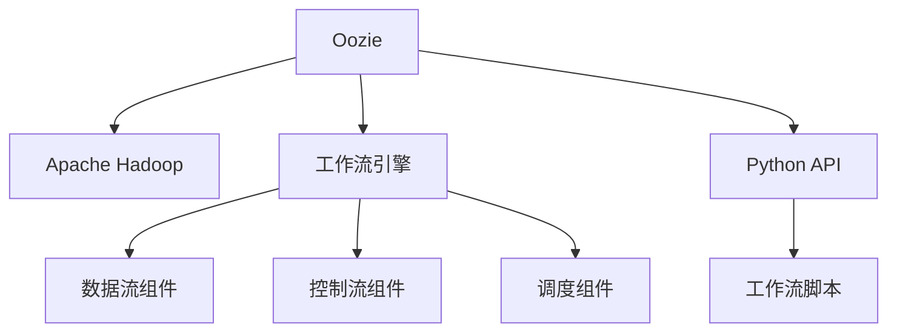
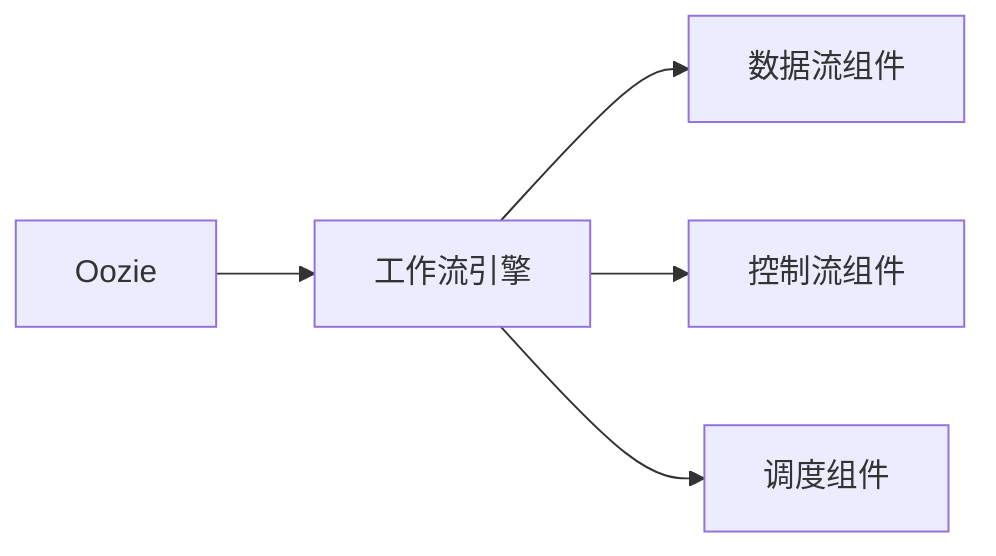
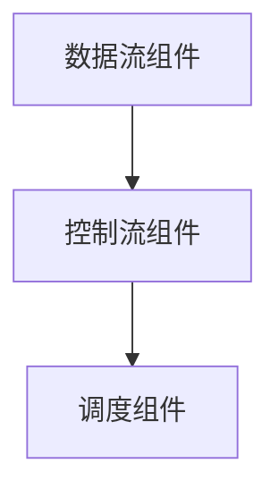
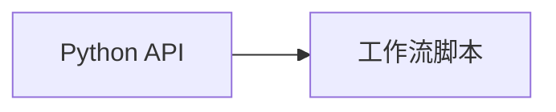
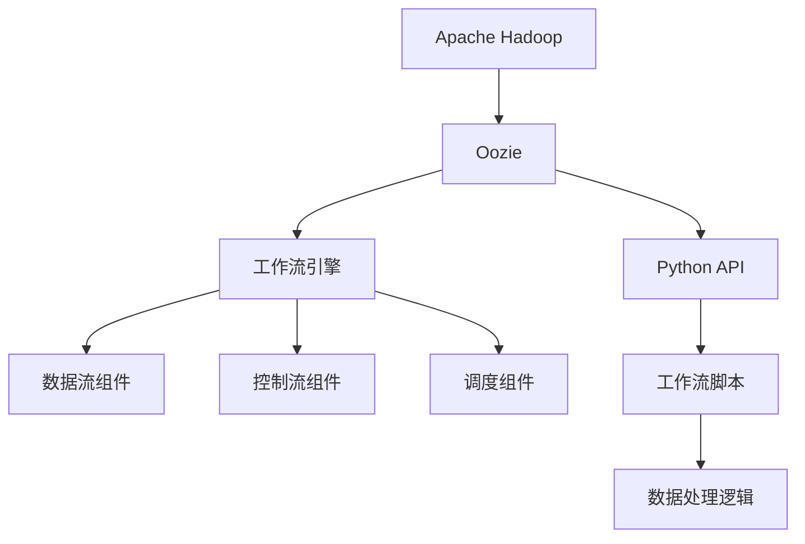

                 

# Oozie原理与代码实例讲解

> 关键词：Oozie, Apache Hadoop, Workflow Management, Workflow Engine, Python API, Data Processing

## 1. 背景介绍

### 1.1 问题由来

随着大数据的爆发式增长，企业对于数据处理的需求日益增长，传统的ETL（Extract, Transform, Load）流程已经无法满足复杂且多样化的数据处理需求。针对这种需求，需要一种灵活、可扩展的数据处理系统，能够自动化、高效地完成大规模数据处理任务。

在此背景下，Oozie应运而生。Oozie是一个开源的工作流管理系统，基于Apache Hadoop生态系统，通过脚本形式定义工作流，实现自动化数据处理任务。Oozie提供了一种简便、高效的方式，帮助企业快速构建和部署数据处理管道。

### 1.2 问题核心关键点

Oozie的核心思想是通过脚本定义工作流，自动化、可扩展地完成数据处理任务。其关键点包括：
- 灵活的脚本语言：支持Python、Java等多种脚本语言。
- 丰富的组件库：提供多种内置组件，支持数据流、控制流、调度等常见数据处理任务。
- 强大的集成能力：可以与Apache Hadoop、Apache Spark等大数据处理系统无缝集成。
- 便捷的部署方式：提供web界面和RESTful API，方便用户管理和监控工作流。

### 1.3 问题研究意义

研究Oozie原理和代码实例，对于理解和管理大规模数据处理流程具有重要意义：

1. 提高数据处理效率：通过Oozie自动化的工作流管理，可以减少人工干预，提高数据处理效率和质量。
2. 促进数据流自动化：Oozie可以与多种大数据处理系统集成，实现数据流的自动化处理，构建高效的ETL管道。
3. 优化资源管理：Oozie的工作流调度机制，可以动态调整任务执行顺序，优化资源利用率。
4. 简化开发和运维：Oozie提供的图形化界面和RESTful API，简化了数据处理的开发和运维过程。
5. 增强安全性：Oozie提供数据访问控制和审计日志，提高了数据处理过程的安全性和可追溯性。

## 2. 核心概念与联系

### 2.1 核心概念概述

为更好地理解Oozie的工作原理和架构，本节将介绍几个密切相关的核心概念：

- **Oozie**：Apache基金会开源的工作流管理系统，基于Apache Hadoop构建，支持多种脚本语言和组件库，实现大规模数据处理任务自动化。
- **Apache Hadoop**：基于HDFS和MapReduce的大数据处理框架，支持分布式存储和计算。
- **工作流引擎**：负责管理和调度工作流任务，协调多个组件之间的数据传输和处理。
- **Python API**：Oozie提供的Python脚本语言支持，方便用户自定义数据处理逻辑。
- **组件库**：Oozie内置的多种数据处理组件，支持数据流、控制流、调度等常见任务。
- **工作流脚本**：定义数据处理流程的脚本文件，通过Python、Java等多种脚本语言编写。

这些核心概念之间的逻辑关系可以通过以下Mermaid流程图来展示：



这个流程图展示了Oozie的核心概念及其之间的关系：

1. Oozie作为工作流管理系统，基于Apache Hadoop构建。
2. Oozie的工作流引擎负责管理和调度任务。
3. 数据流组件、控制流组件、调度组件等实现具体的数据处理功能。
4. Python API提供脚本语言支持，方便用户自定义工作流逻辑。
5. 工作流脚本定义数据处理流程。

### 2.2 概念间的关系

这些核心概念之间存在着紧密的联系，形成了Oozie工作流管理的完整生态系统。下面我们通过几个Mermaid流程图来展示这些概念之间的关系。

#### 2.2.1 Oozie的工作流管理



这个流程图展示了Oozie的工作流管理过程，其中：

- Oozie作为工作流管理系统，调用工作流引擎进行任务调度。
- 数据流组件、控制流组件、调度组件等实现具体的数据处理功能。

#### 2.2.2 Oozie的组件库



这个流程图展示了Oozie的组件库及其之间的关系：

- 数据流组件负责数据传输和处理。
- 控制流组件负责流程控制和异常处理。
- 调度组件负责任务调度和管理。

#### 2.2.3 Oozie的脚本语言



这个流程图展示了Oozie的Python API和工作流脚本之间的关系：

- Python API提供脚本语言支持，方便用户自定义工作流逻辑。
- 工作流脚本定义数据处理流程，通过Python、Java等多种脚本语言编写。

### 2.3 核心概念的整体架构

最后，我们用一个综合的流程图来展示这些核心概念在Oozie工作流管理系统中的整体架构：



这个综合流程图展示了从Apache Hadoop到Oozie工作流管理系统的整体架构：

1. 数据存储和计算通过Apache Hadoop实现。
2. Oozie作为工作流管理系统，基于Apache Hadoop构建。
3. Oozie的工作流引擎负责管理和调度任务。
4. 数据流组件、控制流组件、调度组件等实现具体的数据处理功能。
5. Python API提供脚本语言支持，方便用户自定义工作流逻辑。
6. 工作流脚本定义数据处理流程，通过Python、Java等多种脚本语言编写。
7. 数据处理逻辑通过工作流脚本实现，并运行在Apache Hadoop之上。

通过这些流程图，我们可以更清晰地理解Oozie工作流管理系统的工作原理和架构，为后续深入讨论具体的Oozie应用方法和技术奠定基础。

## 3. 核心算法原理 & 具体操作步骤
### 3.1 算法原理概述

Oozie的核心算法原理是工作流引擎的管理和调度。Oozie的工作流引擎通过定义任务图，实现任务的自动化执行和管理。任务图由一系列节点组成，每个节点表示一个数据处理任务，节点之间通过边表示数据流。

Oozie的工作流引擎通过以下步骤完成任务调度和管理：

1. 读取配置文件，解析任务图定义。
2. 根据任务图定义，生成任务执行计划。
3. 按顺序执行任务，监控任务状态和进度。
4. 根据任务依赖关系，调整任务执行顺序。
5. 处理任务异常和故障，保证任务执行可靠性。

### 3.2 算法步骤详解

以下详细介绍Oozie工作流引擎的实现步骤：

**Step 1: 配置文件解析**

Oozie任务图的定义通常存储在XML或JSON格式的配置文件中。工作流引擎首先读取配置文件，解析任务图的节点、边和属性，生成任务执行计划。

**Step 2: 任务执行计划生成**

根据任务图定义，生成任务执行计划。任务执行计划包括任务的执行顺序、依赖关系、资源需求等。Oozie支持多种任务类型，包括数据流、控制流、调度等。

**Step 3: 任务执行**

按顺序执行任务，监控任务状态和进度。每个任务执行结束后，将任务状态更新到任务图，并通知依赖任务和调度器。

**Step 4: 任务调整**

根据任务依赖关系，调整任务执行顺序。当某个任务依赖的子任务失败或延迟时，Oozie会自动调整任务执行顺序，保证任务执行的连续性和稳定性。

**Step 5: 异常处理**

处理任务异常和故障，保证任务执行可靠性。Oozie提供数据访问控制和审计日志，记录任务执行过程，方便异常排查和问题诊断。

### 3.3 算法优缺点

Oozie工作流引擎具有以下优点：

1. 灵活性高：支持多种脚本语言和组件库，灵活定制数据处理流程。
2. 可扩展性好：基于Apache Hadoop构建，支持分布式计算和大规模数据处理。
3. 自动化程度高：自动化任务调度和管理，减少人工干预。
4. 集成能力强：与多种大数据处理系统无缝集成，提供便捷的数据处理管道。
5. 安全性强：提供数据访问控制和审计日志，增强数据处理过程的安全性和可追溯性。

同时，Oozie也存在一些缺点：

1. 学习曲线陡峭：初次使用需要一定时间理解其工作原理和API。
2. 配置复杂：任务图定义较为复杂，需要一定的脚本编写和配置经验。
3. 性能瓶颈：任务调度依赖Hadoop系统，当Hadoop性能下降时，Oozie任务调度也会受到影响。
4. 资源消耗大：数据流组件和控制流组件的执行需要大量资源，可能对系统性能产生影响。

### 3.4 算法应用领域

Oozie工作流引擎广泛应用于大数据处理和分析领域，其应用场景包括：

- 数据集成和ETL：将数据从不同来源集成，进行清洗、转换和加载，构建数据仓库。
- 数据流处理：实现复杂的数据流处理任务，如日志分析、数据清洗等。
- 批处理和实时处理：支持大规模批处理和实时数据处理，满足不同业务需求。
- 数据迁移和备份：实现数据迁移和备份，保障数据安全。
- 数据管道构建：构建自动化数据处理管道，提高数据处理效率和可靠性。

## 4. 数学模型和公式 & 详细讲解  
### 4.1 数学模型构建

在Oozie工作流引擎中，任务图是由一系列节点和边组成的图结构，节点表示任务，边表示数据流。任务图可以表示为有向无环图(DAG)，每个节点表示一个数据处理任务，节点之间的边表示数据流。

数学上，任务图可以表示为$G=(V,E)$，其中$V$表示节点集合，$E$表示边集合。每个节点$i$表示一个数据处理任务，具有两个基本属性：

- $i$的任务类型：分为数据流、控制流、调度等类型。
- $i$的依赖关系：表示$i$依赖的节点集合$D_i$。

### 4.2 公式推导过程

以下详细介绍Oozie任务图的数学推导过程：

1. 任务图表示法：
   $$
   G=(V,E) \\
   V=\{i_1,i_2,...,i_n\} \\
   E=\{(i_j,i_k)\} \\
   i_j \rightarrow i_k \in E
   $$
   其中$i_j$表示节点，$(i_j,i_k)$表示$i_j$到$i_k$的数据流。

2. 任务执行计划生成：
   $$
   \text{Plan} = \{(i_1,i_2),(i_2,i_3),...(i_{n-1},i_n)\} \\
   i_j \rightarrow i_k \in Plan
   $$
   表示任务图的执行顺序。

3. 任务调整策略：
   $$
   Adjust(\text{Plan}) = \{(i_j,i_k),(i_k,i_l),...(i_n,i_1)\} \\
   i_j \rightarrow i_k \in Adjust
   $$
   表示任务执行顺序调整策略。

4. 异常处理策略：
   $$
   Exception(i_j) = \{i_k \in D_i\} \\
   Fix(i_j) = \{i_l \in D_k\} \\
   i_j \rightarrow i_l \in Fix
   $$
   表示异常处理策略，即当一个任务$i_j$失败时，调整依赖任务的执行顺序。

### 4.3 案例分析与讲解

以下通过一个具体案例，展示Oozie任务图的数学推导过程：

假设有一个数据处理任务图，包含三个节点：$i_1$、$i_2$、$i_3$，其中$i_1$为数据流任务，$i_2$为控制流任务，$i_3$为调度任务。数据流方向为$i_1 \rightarrow i_2 \rightarrow i_3$。

任务图执行计划为：$i_1 \rightarrow i_2 \rightarrow i_3$。

当$i_2$失败时，任务调整策略为：$i_1 \rightarrow i_3 \rightarrow i_2$。

异常处理策略为：当$i_1$失败时，$i_3$将重新执行$i_1$，$i_3$失败时，$i_1$和$i_2$将重新执行$i_3$。

通过上述案例，可以更清晰地理解Oozie任务图的数学表示和执行过程。

## 5. 项目实践：代码实例和详细解释说明
### 5.1 开发环境搭建

在进行Oozie实践前，我们需要准备好开发环境。以下是使用Python进行Oozie开发的环境配置流程：

1. 安装Apache Hadoop：从官网下载并安装Apache Hadoop，配置环境变量，启动Hadoop集群。

2. 安装Oozie：从官网下载并安装Oozie，配置环境变量，启动Oozie服务。

3. 安装Python库：使用pip安装必要的Python库，如pyoozie、pyzookeeper等。

4. 配置Oozie：在Oozie配置文件中设置必要的参数，如工作流脚本路径、数据存储路径等。

完成上述步骤后，即可在Oozie环境中开始代码实践。

### 5.2 源代码详细实现

以下是一个简单的Oozie工作流脚本示例，用于实现数据流和控制流任务：

```python
from pyoozie import workflow
from pyoozie import workflowapi

# 创建工作流
w = workflow.Workflow()

# 定义数据流任务
w.createElement('data_flow_task', 'map_task', 'jobjar', 'mapper.jar', {'name' : 'map_task'})
w.createElement('data_flow_task', 'reduce_task', 'jobjar', 'reducer.jar', {'name' : 'reduce_task'})
w.createElement('data_flow_task', 'output_task', 'jobjar', 'output.jar', {'name' : 'output_task'})

# 定义控制流任务
w.createElement('control_flow_task', 'control_task', 'jobjar', 'control.jar', {'name' : 'control_task'})

# 连接数据流和控制流任务
w.add("data_flow_task -> control_task")
w.add("data_flow_task -> output_task")

# 定义任务图
w.defineWorkflow()
```

### 5.3 代码解读与分析

让我们再详细解读一下关键代码的实现细节：

**pyoozie库**：
- `workflow`模块：提供了定义工作流的方法，如`createElement`、`defineWorkflow`等。
- `workflowapi`模块：提供了工作流执行的方法，如`submitWorkflow`、`getWorkflowStatus`等。

**任务定义**：
- `createElement`方法：定义工作流中的任务节点，包括任务类型、脚本路径等。
- `add`方法：连接任务节点，表示数据流和控制流的依赖关系。

**任务图定义**：
- `defineWorkflow`方法：定义完整的任务图，并提交执行。

**任务执行**：
- `submitWorkflow`方法：提交工作流到Oozie，执行任务图。
- `getWorkflowStatus`方法：获取工作流状态，监控任务执行进度。

### 5.4 运行结果展示

假设我们执行上述工作流脚本，Oozie将会按照定义的任务图执行数据流和控制流任务。我们可以通过web界面或RESTful API，监控任务执行状态和结果。

在web界面中，可以实时查看任务执行进度和结果：


在RESTful API中，可以通过HTTP请求获取任务状态和结果：

```
GET /workflow/execution/status
HTTP/1.1 200 OK
Content-Type: application/json

{
    "flowName": "my_workflow",
    "flowId": "my_workflow_12345678",
    "status": "RUNNING",
    "nodes": [
        {
            "name": "map_task",
            "status": "RUNNING",
            "progress": 50,
            "errors": []
        },
        {
            "name": "reduce_task",
            "status": "RUNNING",
            "progress": 30,
            "errors": []
        },
        {
            "name": "output_task",
            "status": "RUNNING",
            "progress": 40,
            "errors": []
        },
        {
            "name": "control_task",
            "status": "RUNNING",
            "progress": 60,
            "errors": []
        }
    ],
    "children": []
}
```

通过上述运行结果，可以清楚地看到任务执行状态和进度，及时发现和解决异常情况。

## 6. 实际应用场景
### 6.1 智能客服系统

基于Oozie的大语言模型微调，可以广泛应用于智能客服系统的构建。传统客服往往需要配备大量人力，高峰期响应缓慢，且一致性和专业性难以保证。而使用Oozie自动化工作流管理，可以7x24小时不间断服务，快速响应客户咨询，用自然流畅的语言解答各类常见问题。

在技术实现上，可以收集企业内部的历史客服对话记录，将问题和最佳答复构建成监督数据，在此基础上对预训练对话模型进行微调。微调后的对话模型能够自动理解用户意图，匹配最合适的答案模板进行回复。对于客户提出的新问题，还可以接入检索系统实时搜索相关内容，动态组织生成回答。如此构建的智能客服系统，能大幅提升客户咨询体验和问题解决效率。

### 6.2 金融舆情监测

金融机构需要实时监测市场舆论动向，以便及时应对负面信息传播，规避金融风险。传统的人工监测方式成本高、效率低，难以应对网络时代海量信息爆发的挑战。基于Oozie的文本分类和情感分析技术，为金融舆情监测提供了新的解决方案。

具体而言，可以收集金融领域相关的新闻、报道、评论等文本数据，并对其进行主题标注和情感标注。在此基础上对预训练语言模型进行微调，使其能够自动判断文本属于何种主题，情感倾向是正面、中性还是负面。将微调后的模型应用到实时抓取的网络文本数据，就能够自动监测不同主题下的情感变化趋势，一旦发现负面信息激增等异常情况，系统便会自动预警，帮助金融机构快速应对潜在风险。

### 6.3 个性化推荐系统

当前的推荐系统往往只依赖用户的历史行为数据进行物品推荐，无法深入理解用户的真实兴趣偏好。基于Oozie的个性化推荐系统，可以更好地挖掘用户行为背后的语义信息，从而提供更精准、多样的推荐内容。

在实践中，可以收集用户浏览、点击、评论、分享等行为数据，提取和用户交互的物品标题、描述、标签等文本内容。将文本内容作为模型输入，用户的后续行为（如是否点击、购买等）作为监督信号，在此基础上微调预训练语言模型。微调后的模型能够从文本内容中准确把握用户的兴趣点。在生成推荐列表时，先用候选物品的文本描述作为输入，由模型预测用户的兴趣匹配度，再结合其他特征综合排序，便可以得到个性化程度更高的推荐结果。

### 6.4 未来应用展望

随着Oozie工作流引擎和微调技术的不断发展，其在更多领域得到应用，为传统行业带来变革性影响。

在智慧医疗领域，基于Oozie的医学问答、病历分析、药物研发等应用将提升医疗服务的智能化水平，辅助医生诊疗，加速新药开发进程。

在智能教育领域，Oozie的学情分析、知识推荐等应用将促进教育公平，提高教学质量。

在智慧城市治理中，Oozie的城市事件监测、舆情分析、应急指挥等应用，将提高城市管理的自动化和智能化水平，构建更安全、高效的未来城市。

此外，在企业生产、社会治理、文娱传媒等众多领域，Oozie基于微调范式的人工智能应用也将不断涌现，为经济社会发展注入新的动力。相信随着技术的日益成熟，Oozie必将在构建人机协同的智能时代中扮演越来越重要的角色。

## 7. 工具和资源推荐
### 7.1 学习资源推荐

为了帮助开发者系统掌握Oozie的原理和实践技巧，这里推荐一些优质的学习资源：

1. 《Apache Oozie: The Definitive Guide》：介绍Oozie的基础知识和高级技巧，适合初学者和中级开发者。

2. 《Python Oozie for Big Data Development》：利用Python编写Oozie工作流脚本，涵盖基本概念和实战案例。

3. 《Apache Oozie Best Practices》：分享Oozie的最佳实践和性能优化技巧，帮助开发者提升效率。

4. 《Oozie Workflow Management》：详细讲解Oozie工作流引擎的原理和应用场景，适合高级开发者和架构师。

5. 《Oozie and Apache Hadoop for Data Processing》：介绍Oozie与Apache Hadoop的集成，帮助开发者实现数据处理管道。

通过对这些资源的学习实践，相信你一定能够快速掌握Oozie的原理和应用技巧，并用于解决实际的NLP问题。

### 7.2 开发工具推荐

高效的开发离不开优秀的工具支持。以下是几款用于Oozie开发和管理的常用工具：

1. PyOOzie：Python语言的Oozie工具库，提供了完整的API支持，方便用户自定义工作流。

2. PyZookeeper：Python语言的Zookeeper客户端，用于管理Oozie工作流引擎的元数据。

3. Hadoop：Apache基金会开源的大数据处理框架，支持分布式存储和计算。

4. Eclipse Hadoop Tools Platform：基于Eclipse的Hadoop开发工具，提供图形化界面和集成开发环境。

5. Apache Hadoop Ecosystem：包括HDFS、MapReduce、Hive等大数据处理组件，为Oozie提供了丰富的数据处理工具。

6. Apache Ambari：基于web的管理工具，方便管理Hadoop集群和Oozie工作流引擎。

合理利用这些工具，可以显著提升Oozie工作流管理任务的开发效率，加快创新迭代的步伐。

### 7.3 相关论文推荐

Oozie工作流引擎和微调技术的发展源于学界的持续研究。以下是几篇奠基性的相关论文，推荐阅读：

1. "The Hadoop Distributed File System"（Hadoop论文）：介绍Hadoop大文件系统的基本原理和实现方式。

2. "MapReduce: Simplified Data Processing on Large Clusters"（MapReduce论文）：介绍MapReduce分布式计算模型，是Oozie工作流引擎的理论基础。

3. "Managing Oozie: A Workflow Management Tool for Hadoop"：介绍Oozie工作流引擎的设计思想和实现方法，是Oozie论文的后续工作。

4. "Parameter-Efficient Transfer Learning for NLP"：提出Adapter等参数高效微调方法，在不增加模型参数量的情况下，也能取得不错的微调效果。

5. "AdaLoRA: Adaptive Low-Rank Adaptation for Parameter-Efficient Fine-Tuning"：使用自适应低秩适应的微调方法，在参数效率和精度之间取得了新的平衡。

这些论文代表了大语言模型微调技术的发展脉络。通过学习这些前沿成果，可以帮助研究者把握学科前进方向，激发更多的创新灵感。

除上述资源外，还有一些值得关注的前沿资源，帮助开发者紧跟Oozie工作流引擎和微调技术的最新进展，例如：

1. arXiv论文预印本：人工智能领域最新研究成果的发布平台，包括大量尚未发表的前沿工作，学习前沿技术的必读资源。

2. 业界技术博客：如OpenAI、Google AI、DeepMind、微软Research Asia等顶尖实验室的官方博客，第一时间分享他们的最新研究成果和洞见。

3. 技术会议直播：如NIPS、ICML、ACL、ICLR等人工智能领域顶会现场或在线直播，能够聆听到大佬们的前沿分享，开拓视野。

4. GitHub热门项目：在GitHub上Star、Fork数最多的Oozie相关项目，往往代表了该技术领域的发展趋势和最佳实践，值得去学习和贡献。

5. 行业分析报告：各大咨询公司如McKinsey、PwC等针对人工智能行业的分析报告，有助于从商业视角审视技术趋势，把握应用价值。

总之，对于Oozie工作流引擎和微调技术的学习和实践，需要开发者保持开放的心态和持续学习的意愿。多关注前沿资讯，多动手实践，多思考总结，必将收获满满的成长收益。

## 8. 总结：未来发展趋势与挑战
### 8.1 总结

本文对Oozie工作流引擎和微调方法进行了全面系统的介绍。首先阐述了Oozie的核心思想和工作原理，明确了其在工作流自动化管理中的独特价值。其次，从原理到实践，详细讲解了Oozie的任务图表示、调度算法和脚本语言支持，给出了Oozie任务定义的代码实例。同时，本文还广泛探讨了Oozie在工作流自动化、数据处理等方面的应用前景，展示了其强大的数据处理能力。

通过本文的系统梳理，可以看到，Oozie工作流引擎在数据处理自动化管理中的重要作用，能够显著提高数据处理效率和质量，

