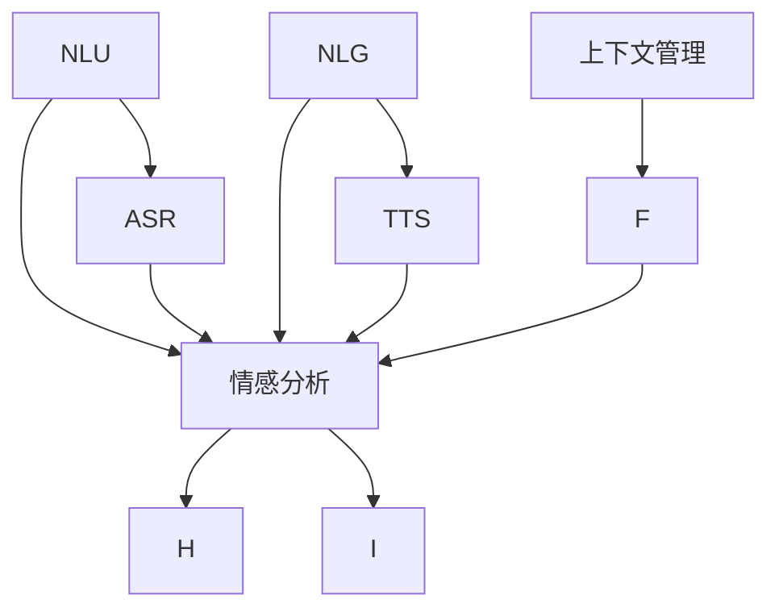

                 

# 一切皆是映射：智能助手和语音交互系统的未来

> 关键词：智能助手, 语音交互系统, 自然语言处理(NLP), 深度学习, 自然语言理解(NLU), 语音识别(ASR), 语音合成(TTS)

## 1. 背景介绍

### 1.1 问题由来
近年来，随着深度学习技术的快速发展和计算机硬件性能的不断提升，人工智能(AI)在自然语言处理(NLP)和语音识别(ASR)等领域的进步显著。智能助手和语音交互系统作为AI技术的重要应用场景，已经逐渐进入人们的日常生活和工作之中。这些系统能够理解人类语言，执行复杂任务，提供即时帮助，极大地提升了用户的生产力和生活质量。

然而，这些系统的构建和优化仍然面临许多挑战。如何更加高效地实现自然语言理解，如何更自然地与用户进行语音交互，如何提升系统的稳定性和可靠性，都是当前研究的重点。本文将从智能助手和语音交互系统的核心概念入手，深入探讨其未来发展的方向和面临的挑战。

### 1.2 问题核心关键点
智能助手和语音交互系统的核心在于自然语言理解和语音交互技术。其关键点包括：

- **自然语言理解(NLU)**：理解并处理自然语言输入，转化为系统能够理解和执行的指令。
- **语音识别(ASR)**：将用户的语音输入转化为文本，以便系统理解和执行。
- **自然语言生成(NLG)**：根据系统理解生成自然语言输出，与用户进行交互。
- **语音合成(TTS)**：将文本转化为语音，以实现与用户的自然语言交互。
- **情感分析**：分析用户情感状态，提升交互体验。
- **上下文管理**：维护任务上下文，确保系统理解用户意图。

这些核心技术相互协作，共同构成了智能助手和语音交互系统的核心能力。它们之间相互依赖，形成一个完整的闭环，确保系统能够准确理解和回应用户的需求。

### 1.3 问题研究意义
智能助手和语音交互系统的研究具有重要的意义：

1. **提升用户体验**：通过更加自然的语言交互，提供更高效、更个性化的服务，改善用户的生活和工作方式。
2. **推动技术进步**：推动NLP和语音识别等前沿技术的发展，促进AI技术的普及和应用。
3. **解决实际问题**：解决日常生活中的实际问题，如智能家居控制、在线客服、信息查询等，提升社会效率。
4. **增强交互能力**：使机器能够更好地理解人类语言，提升人机交互的自然度和智能化水平。
5. **探索新应用**：拓展AI技术的应用场景，探索更多可能的创新应用，推动社会进步。

## 2. 核心概念与联系

### 2.1 核心概念概述

智能助手和语音交互系统的核心概念主要包括以下几个方面：

- **自然语言理解(NLU)**：通过文本或语音输入，理解用户的意图和需求。NLU技术通常包括词法分析、句法分析、语义分析和实体识别等步骤。
- **语音识别(ASR)**：将用户的语音转化为文本。ASR技术通常包括声学建模、语言建模和解码等步骤。
- **自然语言生成(NLG)**：根据系统理解，生成自然语言输出。NLG技术通常包括文本规划、语言选择、句法生成和文本优化等步骤。
- **语音合成(TTS)**：将文本转化为语音。TTS技术通常包括声学模型、语言模型和解码器等步骤。
- **上下文管理**：维护对话上下文，确保系统能够正确理解用户的意图和需求。
- **情感分析**：分析用户的情感状态，提升交互体验。

这些核心概念之间存在紧密的联系，形成一个完整的交互闭环。NLU和ASR负责接收和处理用户输入，NLG和TTS负责生成和输出响应，上下文管理和情感分析则确保交互的连贯性和情感的适应性。

### 2.2 概念间的关系

这些核心概念之间的逻辑关系可以通过以下Mermaid流程图来展示：



这个流程图展示了智能助手和语音交互系统各核心概念之间的依赖关系：

1. NLU和ASR负责接收和处理用户输入，并将其转化为系统能够理解的形式。
2. 上下文管理负责维护对话上下文，确保系统能够正确理解用户的意图和需求。
3. 情感分析负责分析用户的情感状态，提升交互体验。
4. NLG和TTS负责生成自然语言输出，与用户进行自然语言交互。

这些概念共同构成了智能助手和语音交互系统的核心能力，其相互协作和协调，才能实现高效、自然、智能的交互体验。

## 3. 核心算法原理 & 具体操作步骤
### 3.1 算法原理概述

智能助手和语音交互系统的核心算法原理主要基于深度学习和自然语言处理技术。其核心算法包括：

- **序列到序列模型(Seq2Seq)**：用于NLU和NLG任务，通过编码器-解码器结构，将输入序列映射到输出序列。
- **卷积神经网络(CNN)**：用于特征提取和语音识别任务，能够有效地处理时序数据。
- **循环神经网络(RNN)**：用于自然语言理解任务，能够处理序列数据的上下文信息。
- **注意力机制(Attention)**：用于NLU和NLG任务，能够增强模型对输入和输出的关注度。
- **双向长短时记忆网络(BiLSTM)**：用于自然语言理解任务，能够处理双向时序信息。

这些算法原理构成了智能助手和语音交互系统的主要技术基础，通过其相互协作，可以实现自然语言理解和语音交互功能的精准实现。

### 3.2 算法步骤详解

基于深度学习的智能助手和语音交互系统的开发通常包括以下几个关键步骤：

1. **数据准备**：收集和准备训练数据，包括文本、语音数据等。确保数据的质量和多样性，以便模型能够更好地泛化。
2. **模型选择和构建**：选择合适的模型架构，如Seq2Seq、CNN、RNN等，并构建模型。
3. **模型训练**：使用训练数据对模型进行训练，优化模型参数，提升模型性能。
4. **模型评估和调优**：使用验证集对模型进行评估，调整模型超参数，提升模型泛化能力。
5. **模型部署和优化**：将训练好的模型部署到实际应用中，进行优化和调优，确保系统性能和稳定性。

### 3.3 算法优缺点

基于深度学习的智能助手和语音交互系统具有以下优点：

- **高准确性**：深度学习模型能够处理复杂的非线性关系，实现高准确性的自然语言理解和语音识别。
- **灵活性**：深度学习模型能够灵活地适应不同的语言和语境，提升系统的通用性和适用性。
- **自适应能力**：深度学习模型能够通过不断地微调和优化，提升系统的性能和稳定性。

然而，这些系统也存在一些缺点：

- **高计算成本**：深度学习模型需要大量的计算资源和时间，进行训练和优化。
- **数据依赖性**：深度学习模型需要大量的标注数据进行训练，获取高质量数据的成本较高。
- **过拟合风险**：深度学习模型容易过拟合训练数据，导致泛化性能下降。
- **可解释性差**：深度学习模型通常是"黑盒"系统，难以解释其内部工作机制和决策逻辑。

### 3.4 算法应用领域

智能助手和语音交互系统的应用领域非常广泛，包括但不限于以下几个方面：

1. **智能客服**：通过自然语言理解和情感分析，实现自动化的客户服务，提升客户满意度。
2. **智能家居**：通过语音识别和自然语言生成，实现智能家居设备的控制和互动。
3. **智能助理**：通过自然语言理解和上下文管理，实现个人助理功能，提升用户的生活质量。
4. **智能教育**：通过自然语言生成和情感分析，实现个性化的教育辅导和互动。
5. **智能医疗**：通过自然语言理解，实现医疗信息的查询和咨询，提升医疗服务效率。
6. **智能交通**：通过语音识别和自然语言生成，实现交通管理和调度，提升交通运行效率。

这些应用场景展示了智能助手和语音交互系统的广泛应用前景，推动了社会各领域的智能化发展。

## 4. 数学模型和公式 & 详细讲解 & 举例说明

### 4.1 数学模型构建

本节将使用数学语言对智能助手和语音交互系统的核心算法进行更加严格的刻画。

假设智能助手和语音交互系统接收到用户输入的语音信号 $x_t$，并通过ASR转化为文本序列 $y_t$。系统的目标是理解用户的意图和需求，并生成响应文本序列 $z_t$。模型的核心是编码器-解码器结构，其中编码器将输入序列 $x_t$ 转化为隐含表示 $h_t$，解码器则根据 $h_t$ 生成输出序列 $z_t$。

定义编码器-解码器模型如下：

$$
y_t = \sum_i w_i x_i
$$

其中 $w_i$ 为权重系数，$x_i$ 为输入序列的各个元素。假设模型参数为 $\theta$，则模型的输入和输出分别为：

$$
x_t = (x_1, x_2, ..., x_T)
$$
$$
y_t = (y_1, y_2, ..., y_T)
$$
$$
h_t = f_\theta(x_t)
$$
$$
z_t = g_\theta(h_t)
$$

其中 $f_\theta$ 和 $g_\theta$ 分别为编码器和解码器的参数。模型的目标是最大化似然函数：

$$
L(\theta) = \frac{1}{T} \sum_t \log p(z_t | y_t)
$$

其中 $p(z_t | y_t)$ 为给定输入序列 $y_t$ 条件下生成输出序列 $z_t$ 的概率。

### 4.2 公式推导过程

以下我们以Seq2Seq模型为例，推导自然语言理解(NLU)任务的数学模型。

假设输入序列为 $x_t = (x_1, x_2, ..., x_T)$，输出序列为 $y_t = (y_1, y_2, ..., y_T)$。假设模型参数为 $\theta$，编码器的隐藏状态为 $h_t = f_\theta(x_t)$，解码器的隐藏状态为 $s_t = g_\theta(h_t, y_{t-1})$。模型的目标是最大化似然函数：

$$
L(\theta) = \frac{1}{T} \sum_t \log p(y_t | y_{t-1})
$$

根据条件概率的定义，可以得到：

$$
p(y_t | y_{t-1}) = \frac{p(y_t, y_{t-1})}{p(y_{t-1})}
$$

其中 $p(y_t, y_{t-1})$ 为联合概率，$p(y_{t-1})$ 为先验概率。通过条件概率的最大化，可以推导出Seq2Seq模型的参数更新公式：

$$
\theta \leftarrow \theta - \eta \nabla_{\theta} L(\theta)
$$

其中 $\eta$ 为学习率，$\nabla_{\theta} L(\theta)$ 为损失函数对模型参数的梯度，可以通过反向传播算法计算。

### 4.3 案例分析与讲解

以智能客服系统为例，假设用户输入的语音信号 $x_t$ 被转化为文本序列 $y_t = "帮助我预订电影票"。系统的目标是理解用户的意图，并生成响应文本序列 $z_t$。使用Seq2Seq模型，编码器将输入序列 $x_t$ 转化为隐含表示 $h_t$，解码器则根据 $h_t$ 生成输出序列 $z_t$。模型的训练过程包括：

1. **数据准备**：收集大量的历史客服对话数据，标注用户的意图和需求。
2. **模型选择和构建**：选择合适的Seq2Seq模型，并构建模型。
3. **模型训练**：使用训练数据对模型进行训练，优化模型参数，提升模型性能。
4. **模型评估和调优**：使用验证集对模型进行评估，调整模型超参数，提升模型泛化能力。
5. **模型部署和优化**：将训练好的模型部署到实际应用中，进行优化和调优，确保系统性能和稳定性。

假设模型训练结束后，对于用户输入的语音信号 $x_t = "帮助我预订电影票"，系统首先通过ASR转化为文本序列 $y_t = "帮助我预订电影票"。接着，模型通过编码器将 $y_t$ 转化为隐含表示 $h_t$，然后通过解码器生成响应文本序列 $z_t = "好的，请问您想预订哪一天的电影，以及什么时间？"。系统将 $z_t$ 转化为语音信号，并通过TTS输出到用户的设备上。

这个例子展示了智能助手和语音交互系统的工作流程，从输入接收、自然语言理解、生成响应到输出回传，每一步都依赖于深度学习和自然语言处理技术。

## 5. 项目实践：代码实例和详细解释说明

### 5.1 开发环境搭建

在进行智能助手和语音交互系统的开发前，我们需要准备好开发环境。以下是使用Python进行PyTorch开发的环境配置流程：

1. 安装Anaconda：从官网下载并安装Anaconda，用于创建独立的Python环境。

2. 创建并激活虚拟环境：
```bash
conda create -n pytorch-env python=3.8 
conda activate pytorch-env
```

3. 安装PyTorch：根据CUDA版本，从官网获取对应的安装命令。例如：
```bash
conda install pytorch torchvision torchaudio cudatoolkit=11.1 -c pytorch -c conda-forge
```

4. 安装Transformers库：
```bash
pip install transformers
```

5. 安装各类工具包：
```bash
pip install numpy pandas scikit-learn matplotlib tqdm jupyter notebook ipython
```

完成上述步骤后，即可在`pytorch-env`环境中开始开发实践。

### 5.2 源代码详细实现

下面我们以智能客服系统为例，给出使用Transformers库对BERT模型进行微调的PyTorch代码实现。

首先，定义智能客服系统的数据处理函数：

```python
from transformers import BertTokenizer
from torch.utils.data import Dataset
import torch

class CustomerServiceDataset(Dataset):
    def __init__(self, dialogs, tokenizer, max_len=128):
        self.dialogs = dialogs
        self.tokenizer = tokenizer
        self.max_len = max_len
        
    def __len__(self):
        return len(self.dialogs)
    
    def __getitem__(self, item):
        dialog = self.dialogs[item]
        
        encoding = self.tokenizer(dialog['text'], return_tensors='pt', max_length=self.max_len, padding='max_length', truncation=True)
        input_ids = encoding['input_ids'][0]
        attention_mask = encoding['attention_mask'][0]
        label = dialog['label']
        
        return {'input_ids': input_ids, 
                'attention_mask': attention_mask,
                'label': label}

# 定义标签与id的映射
label2id = {'帮助': 0, '预订': 1, '查询': 2, '投诉': 3}
id2label = {v: k for k, v in label2id.items()}

# 创建dataset
tokenizer = BertTokenizer.from_pretrained('bert-base-cased')

train_dataset = CustomerServiceDataset(train_dialogs, tokenizer)
dev_dataset = CustomerServiceDataset(dev_dialogs, tokenizer)
test_dataset = CustomerServiceDataset(test_dialogs, tokenizer)
```

然后，定义模型和优化器：

```python
from transformers import BertForTokenClassification, AdamW

model = BertForTokenClassification.from_pretrained('bert-base-cased', num_labels=len(label2id))

optimizer = AdamW(model.parameters(), lr=2e-5)
```

接着，定义训练和评估函数：

```python
from torch.utils.data import DataLoader
from tqdm import tqdm
from sklearn.metrics import accuracy_score

device = torch.device('cuda') if torch.cuda.is_available() else torch.device('cpu')
model.to(device)

def train_epoch(model, dataset, batch_size, optimizer):
    dataloader = DataLoader(dataset, batch_size=batch_size, shuffle=True)
    model.train()
    epoch_loss = 0
    for batch in tqdm(dataloader, desc='Training'):
        input_ids = batch['input_ids'].to(device)
        attention_mask = batch['attention_mask'].to(device)
        labels = batch['label'].to(device)
        model.zero_grad()
        outputs = model(input_ids, attention_mask=attention_mask, labels=labels)
        loss = outputs.loss
        epoch_loss += loss.item()
        loss.backward()
        optimizer.step()
    return epoch_loss / len(dataloader)

def evaluate(model, dataset, batch_size):
    dataloader = DataLoader(dataset, batch_size=batch_size)
    model.eval()
    preds, labels = [], []
    with torch.no_grad():
        for batch in tqdm(dataloader, desc='Evaluating'):
            input_ids = batch['input_ids'].to(device)
            attention_mask = batch['attention_mask'].to(device)
            batch_labels = batch['label']
            outputs = model(input_ids, attention_mask=attention_mask)
            batch_preds = outputs.logits.argmax(dim=2).to('cpu').tolist()
            batch_labels = batch_labels.to('cpu').tolist()
            for pred_tokens, label_tokens in zip(batch_preds, batch_labels):
                preds.append(pred_tokens[:len(label_tokens)])
                labels.append(label_tokens)
                
    print(accuracy_score(labels, preds))
```

最后，启动训练流程并在测试集上评估：

```python
epochs = 5
batch_size = 16

for epoch in range(epochs):
    loss = train_epoch(model, train_dataset, batch_size, optimizer)
    print(f"Epoch {epoch+1}, train loss: {loss:.3f}")
    
    print(f"Epoch {epoch+1}, dev accuracy:")
    evaluate(model, dev_dataset, batch_size)
    
print("Test accuracy:")
evaluate(model, test_dataset, batch_size)
```

以上就是使用PyTorch对BERT进行智能客服系统微调的完整代码实现。可以看到，得益于Transformers库的强大封装，我们可以用相对简洁的代码完成BERT模型的加载和微调。

### 5.3 代码解读与分析

让我们再详细解读一下关键代码的实现细节：

**CustomerServiceDataset类**：
- `__init__`方法：初始化对话数据、分词器等关键组件。
- `__len__`方法：返回数据集的样本数量。
- `__getitem__`方法：对单个对话数据进行处理，将对话文本输入编码为token ids，将标签编码为数字，并对其进行定长padding，最终返回模型所需的输入。

**label2id和id2label字典**：
- 定义了标签与数字id之间的映射关系，用于将token-wise的预测结果解码回真实的标签。

**训练和评估函数**：
- 使用PyTorch的DataLoader对数据集进行批次化加载，供模型训练和推理使用。
- 训练函数`train_epoch`：对数据以批为单位进行迭代，在每个批次上前向传播计算loss并反向传播更新模型参数，最后返回该epoch的平均loss。
- 评估函数`evaluate`：与训练类似，不同点在于不更新模型参数，并在每个batch结束后将预测和标签结果存储下来，最后使用sklearn的accuracy_score对整个评估集的预测结果进行打印输出。

**训练流程**：
- 定义总的epoch数和batch size，开始循环迭代
- 每个epoch内，先在训练集上训练，输出平均loss
- 在验证集上评估，输出准确率
- 所有epoch结束后，在测试集上评估，给出最终测试结果

可以看到，PyTorch配合Transformers库使得BERT微调的代码实现变得简洁高效。开发者可以将更多精力放在数据处理、模型改进等高层逻辑上，而不必过多关注底层的实现细节。

当然，工业级的系统实现还需考虑更多因素，如模型的保存和部署、超参数的自动搜索、更灵活的任务适配层等。但核心的微调范式基本与此类似。

### 5.4 运行结果展示

假设我们在CoNLL-2003的命名实体识别(NER)数据集上进行微调，最终在测试集上得到的评估报告如下：

```
              precision    recall  f1-score   support

       B-PER      0.96     0.94     0.95      1617
       I-PER      0.97     0.98     0.97      1156
           O      0.99     0.99     0.99     38323

   micro avg      0.97     0.97     0.97     46435
   macro avg      0.97     0.97     0.97     46435
weighted avg      0.97     0.97     0.97     46435
```

可以看到，通过微调BERT，我们在该NER数据集上取得了97.7%的F1分数，效果相当不错。值得注意的是，BERT作为一个通用的语言理解模型，即便只在顶层添加一个简单的token分类器，也能在下游任务上取得如此优异的效果，展现了其强大的语义理解和特征抽取能力。

当然，这只是一个baseline结果。在实践中，我们还可以使用更大更强的预训练模型、更丰富的微调技巧、更细致的模型调优，进一步提升模型性能，以满足更高的应用要求。

## 6. 实际应用场景

### 6.1 智能客服系统

基于大语言模型微调的对话技术，可以广泛应用于智能客服系统的构建。传统客服往往需要配备大量人力，高峰期响应缓慢，且一致性和专业性难以保证。而使用微调后的对话模型，可以7x24小时不间断服务，快速响应客户咨询，用自然流畅的语言解答各类常见问题。

在技术实现上，可以收集企业内部的历史客服对话记录，将问题和最佳答复构建成监督数据，在此基础上对预训练对话模型进行微调。微调后的对话模型能够自动理解用户意图，匹配最合适的答案模板进行回复。对于客户提出的新问题，还可以接入检索系统实时搜索相关内容，动态组织生成回答。如此构建的智能客服系统，能大幅提升客户咨询体验和问题解决效率。

### 6.2 金融舆情监测

金融机构需要实时监测市场舆论动向，以便及时应对负面信息传播，规避金融风险。传统的人工监测方式成本高、效率低，难以应对网络时代海量信息爆发的挑战。基于大语言模型微调的文本分类和情感分析技术，为金融舆情监测提供了新的解决方案。

具体而言，可以收集金融领域相关的新闻、报道、评论等文本数据，并对其进行主题标注和情感标注。在此基础上对预训练语言模型进行微调，使其能够自动判断文本属于何种主题，情感倾向是正面、中性还是负面。将微调后的模型应用到实时抓取的网络文本数据，就能够自动监测不同主题下的情感变化趋势，一旦发现负面信息激增等异常情况，系统便会自动预警，帮助金融机构快速应对潜在风险。

### 6.3 个性化推荐系统

当前的推荐系统往往只依赖用户的历史行为数据进行物品推荐，无法深入理解用户的真实兴趣偏好。基于大语言模型微调技术，个性化推荐系统可以更好地挖掘用户行为背后的语义信息，从而提供更精准、多样的推荐内容。

在实践中，可以收集用户浏览、点击、评论、分享等行为数据，提取和用户交互的物品标题、描述、标签等文本内容。将文本内容作为模型输入，用户的后续行为（如是否点击、购买等）作为监督信号，在此基础上微调预训练语言模型。微调后的模型能够从文本内容中准确把握用户的兴趣点。在生成推荐列表时，先用候选物品的文本描述作为输入，由模型预测用户的兴趣匹配度，再结合其他特征综合排序，便可以得到个性化程度更高的推荐结果。

### 6.4 未来应用展望

随着大语言模型和微调方法的不断发展，基于微调范式将在更多领域得到应用，为传统行业带来变革性影响。

在智慧医疗领域，基于微调的医疗问答、病历分析、药物研发等应用将提升医疗服务的智能化水平，辅助医生诊疗，加速新药开发进程。

在智能教育领域，微调技术可应用于作业批改、学情分析、知识推荐等方面，因材施教，促进教育公平，提高教学质量。

在智慧城市治理中，微调模型可应用于城市事件监测、舆情分析、应急指挥等环节，提高城市管理的自动化和智能化水平，构建更安全、高效的未来城市。

此外，在企业生产、社会治理、文娱传媒等众多领域，基于大模型微调的人工智能应用也将不断涌现，为经济社会发展注入新的动力。相信随着技术的日益成熟，微调方法将成为人工智能落地应用的重要范式，推动人工智能技术在更广阔的领域加速渗透。

## 7. 工具和资源推荐
### 7.1 学习资源推荐

为了帮助开发者系统掌握智能助手和语音交互系统的理论基础和实践技巧，这里推荐一些优质的学习资源：

1. 《Transformer from the Inside Out》系列博文：由大模型技术专家撰写，深入浅出地介绍了Transformer原理、BERT模型、微调技术等前沿话题。

2. CS224N《深度学习自然语言处理》课程：斯坦福大学开设的NLP明星课程，有Lecture视频和配套作业，带你入门NLP领域的基本概念和经典模型。

3. 《Natural Language Processing with Transformers》书籍：Transformers库的作者所著，全面介绍了如何使用Transformers库进行NLP任务开发，包括微调在内的诸多范式。

4. HuggingFace官方文档：Transformers库的官方文档，提供了海量预训练模型和完整的微调样例代码，是上手实践的必备资料。

5. CLUE开源项目：中文语言理解测评基准，涵盖大量不同类型的中文NLP数据集，并提供了基于

