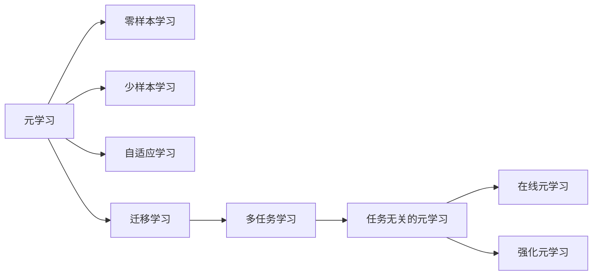
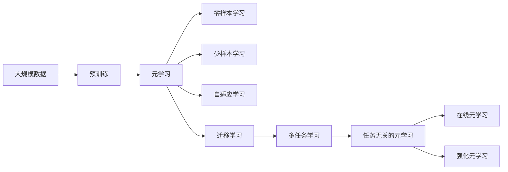

                 

# 一切皆是映射：跟踪AI元学习（Meta-learning）的最新进展

## 1. 背景介绍

### 1.1 问题由来
近年来，随着深度学习的快速发展，人工智能（AI）技术在诸多领域取得了突破性进展。然而，这些技术往往依赖于大量标注数据和长时间的训练过程，难以应对数据稀疏或分布多变的场景。元学习（Meta-Learning）技术应运而生，它旨在通过学习算法如何在多种任务或数据分布上快速适应和泛化，实现对新任务的零样本、少样本学习，极大提升了AI的灵活性和适应性。

元学习的应用场景包括但不限于：
- 机器人控制：通过在不同环境中积累经验，机器人能够快速适应新的物理环境和任务。
- 医疗诊断：模型能够在大量病理数据上学习泛化能力，对新病人的诊断结果进行快速预测。
- 自然语言处理（NLP）：模型能够在不同语言和领域上快速适应，实现多语言翻译和领域内知识迁移。
- 计算机视觉：模型能够在不同图像风格和数据集上快速适应，实现图像分类、目标检测等任务。

### 1.2 问题核心关键点
元学习关注的核心问题包括：
- 如何设计有效的元学习算法，使得模型能够快速适应新任务或新数据。
- 如何在有限的数据上高效训练模型，使其能够实现零样本、少样本学习。
- 如何避免模型在多任务学习中过拟合，同时保持对新任务的良好泛化能力。
- 如何整合先验知识与神经网络，提升模型的可解释性和鲁棒性。

### 1.3 问题研究意义
研究元学习技术，对于提升AI的泛化能力和适应性，降低对标注数据的依赖，减少训练时间和成本，具有重要意义。元学习不仅可以帮助AI模型在不同任务和数据集上实现无缝切换，还能提升模型的鲁棒性和可解释性，为各行各业提供智能决策支持。

## 2. 核心概念与联系

### 2.1 核心概念概述

元学习是一种高级的机器学习方法，旨在训练能够快速适应新任务的模型。其核心思想是利用少量数据和少量时间，通过学习算法快速适应新数据集和新任务，提升模型的泛化能力。

元学习可以大致分为以下几类：
- 零样本学习（Zero-shot Learning）：模型在没有见过任何特定任务的训练样本的情况下，仅凭任务描述就能够执行新任务。
- 少样本学习（Few-shot Learning）：模型在只有少量标注样本的情况下，能够快速适应新任务。
- 自适应学习（Adaptive Learning）：模型能够根据当前任务的难度和数据分布，动态调整学习策略，适应新环境。
- 迁移学习（Transfer Learning）：模型能够将已学习到的知识迁移到新任务上，提升新任务的性能。

### 2.2 概念间的关系

这些核心概念之间存在紧密的联系，通过以下Mermaid流程图来展示：



这个流程图展示了元学习与其它学习范式的关系：
- 零样本学习、少样本学习、自适应学习和迁移学习均属于元学习的子集，都是快速适应新任务的学习方式。
- 多任务学习和任务无关的元学习是元学习的两个重要分支，分别关注于多任务和通用学习的目标。
- 在线元学习和强化元学习则是元学习在实时和交互式场景中的应用。

### 2.3 核心概念的整体架构

最后，我们用一个综合的流程图来展示这些核心概念在大规模元学习框架中的整体架构：



这个综合流程图展示了从预训练到元学习，再到各种元学习方式的完整过程。通过这些流程图，我们可以更清晰地理解元学习在大规模元学习框架中的工作原理和优化方向。

## 3. 核心算法原理 & 具体操作步骤
### 3.1 算法原理概述

元学习算法通常包含以下关键步骤：
1. 预训练：在大量数据集上进行无监督预训练，学习到通用的特征表示。
2. 元学习：通过学习算法，模型能够根据新任务和新数据分布，快速适应新任务，提升泛化能力。
3. 任务特定训练：在新任务上，使用少量数据进行有监督训练，进一步优化模型性能。

元学习算法可以大致分为以下几类：
- 生成式元学习：通过生成新的数据来加速元学习过程。
- 模仿式元学习：通过学习任务无关的策略，提升模型在新任务上的性能。
- 对比式元学习：通过比较不同策略的性能，优化元学习过程。

### 3.2 算法步骤详解

以下是常见的元学习算法详细步骤：
1. 数据准备：收集任务的数据集，分为训练集、验证集和测试集。
2. 预训练模型：选择一个合适的预训练模型，如ResNet、BERT等。
3. 元学习算法选择：选择合适的元学习算法，如MAML、MORAL、ProximalMeta等。
4. 元学习过程：在新任务上，使用少量数据进行元学习，生成新模型参数。
5. 任务特定训练：在新任务上，使用少量数据进行有监督训练，进一步优化模型性能。
6. 性能评估：在新任务上评估模型性能，对比预训练和任务特定训练的效果。

### 3.3 算法优缺点

元学习算法具有以下优点：
1. 快速适应新任务：通过学习算法，模型能够在有限的数据上快速适应新任务，提升泛化能力。
2. 降低数据需求：相比从头训练模型，元学习算法可以显著降低对标注数据的需求。
3. 高效迁移学习：元学习算法能够将预训练知识迁移到新任务上，提升新任务的性能。

但元学习算法也存在一些局限性：
1. 模型复杂度高：元学习算法需要额外的模型来支持元学习过程，增加了模型的复杂度。
2. 训练时间长：元学习算法需要更多的时间和计算资源，训练过程相对较长。
3. 模型鲁棒性不足：元学习模型在多任务学习中可能存在过拟合问题，泛化能力有限。
4. 可解释性不足：元学习模型的决策过程较复杂，难以提供清晰的解释。

### 3.4 算法应用领域

元学习算法在以下几个领域得到了广泛应用：
- 机器人控制：通过元学习算法，机器人能够快速适应不同的物理环境和任务，提升自主控制能力。
- 自然语言处理（NLP）：元学习算法能够帮助NLP模型在不同语言和领域上快速适应，提升跨语言理解和迁移学习能力。
- 计算机视觉：元学习算法能够帮助模型在不同图像风格和数据集上快速适应，提升图像分类、目标检测等任务的性能。
- 医疗诊断：元学习算法能够在大量病理数据上学习泛化能力，对新病人的诊断结果进行快速预测。
- 金融风险管理：元学习算法能够帮助模型在不同金融数据上快速适应，提升风险管理能力。

## 4. 数学模型和公式 & 详细讲解
### 4.1 数学模型构建

元学习模型通常包括预训练模型和元学习模型两个部分。以下以简单的MAML（Meta-learning via Gradient Descent for Hyperparameters）算法为例，展示数学模型构建过程：

设预训练模型为 $f_\theta$，其中 $\theta$ 为预训练模型的参数。元学习算法生成一个新的模型 $g_\phi$，其中 $\phi$ 为元学习模型的参数。元学习算法通过在多个任务上学习元学习策略，生成新模型的参数 $\hat{\theta}$。在任务 $t$ 上，新模型的预测结果为 $f_{\hat{\theta}}(x_t)$，其中 $x_t$ 为任务 $t$ 的数据。

### 4.2 公式推导过程

以下是MAML算法的公式推导过程：
1. 预训练模型：
   $$
   f_\theta(x) = \sum_i K_i(x)w_i
   $$
   其中 $K_i(x)$ 为预训练模型中的特征提取函数，$w_i$ 为特征表示的权重。
2. 元学习模型：
   $$
   g_\phi(x) = \sum_i K_i(x)b_i
   $$
   其中 $b_i$ 为元学习模型中特征表示的权重。
3. 元学习过程：
   $$
   \hat{\theta} = \mathop{\arg\min}_\theta \mathcal{L}(f_\theta,g_\phi,\{(x_i,y_i)\}_{i=1}^N)
   $$
   其中 $\mathcal{L}$ 为损失函数，$(x_i,y_i)$ 为训练集数据。
4. 任务特定训练：
   $$
   \hat{\theta}_t = \mathop{\arg\min}_\theta \mathcal{L}(f_\theta,g_\phi,\{(x_i,y_i)\}_{i=1}^N)
   $$
   其中 $\mathcal{L}$ 为损失函数，$(x_i,y_i)$ 为任务 $t$ 的数据。

### 4.3 案例分析与讲解

以图像分类任务为例，展示元学习算法的实现。

设预训练模型为ResNet，元学习模型为MLP（多层感知器）。在多个图像分类任务上，学习元学习策略，生成新的模型参数 $\hat{\theta}$。在特定图像分类任务上，使用少量数据进行有监督训练，进一步优化模型性能。

具体实现步骤如下：
1. 预训练模型：使用ResNet在ImageNet数据集上进行预训练。
2. 元学习模型：使用MLP在多个图像分类任务上学习元学习策略。
3. 元学习过程：在新图像分类任务上，生成新模型的参数 $\hat{\theta}$。
4. 任务特定训练：在新任务上，使用少量数据进行有监督训练，进一步优化模型性能。

## 5. 项目实践：代码实例和详细解释说明
### 5.1 开发环境搭建

在进行元学习实践前，我们需要准备好开发环境。以下是使用Python进行PyTorch开发的环境配置流程：

1. 安装Anaconda：从官网下载并安装Anaconda，用于创建独立的Python环境。

2. 创建并激活虚拟环境：
```bash
conda create -n pytorch-env python=3.8 
conda activate pytorch-env
```

3. 安装PyTorch：根据CUDA版本，从官网获取对应的安装命令。例如：
```bash
conda install pytorch torchvision torchaudio cudatoolkit=11.1 -c pytorch -c conda-forge
```

4. 安装TensorBoard：用于可视化训练过程。
```bash
pip install tensorboard
```

5. 安装PyTorch Lightning：简化模型训练过程。
```bash
pip install pytorch-lightning
```

完成上述步骤后，即可在`pytorch-env`环境中开始元学习实践。

### 5.2 源代码详细实现

下面我们以图像分类任务为例，给出使用PyTorch Lightning进行MAML算法的PyTorch代码实现。

```python
import torch
from torch import nn
from torchvision import datasets, transforms
from torch.utils.data import DataLoader
from torch.nn import functional as F
from torch.optim import Adam
from pytorch_lightning import Trainer, LightningModule

class ResNet(nn.Module):
    def __init__(self):
        super(ResNet, self).__init__()
        self.resnet = nn.Sequential(
            nn.Conv2d(3, 64, kernel_size=7, stride=2),
            nn.ReLU(inplace=True),
            nn.MaxPool2d(kernel_size=3, stride=2),
            nn.Sequential(
                nn.Conv2d(64, 64, kernel_size=3, padding=1),
                nn.BatchNorm2d(64),
                nn.ReLU(inplace=True),
                nn.Conv2d(64, 64, kernel_size=3, padding=1),
                nn.BatchNorm2d(64),
                nn.ReLU(inplace=True),
                nn.MaxPool2d(kernel_size=3, stride=2)
            ),
            nn.Sequential(
                nn.Conv2d(64, 128, kernel_size=3, padding=1),
                nn.BatchNorm2d(128),
                nn.ReLU(inplace=True),
                nn.Conv2d(128, 128, kernel_size=3, padding=1),
                nn.BatchNorm2d(128),
                nn.ReLU(inplace=True),
                nn.MaxPool2d(kernel_size=3, stride=2)
            ),
            nn.Sequential(
                nn.Conv2d(128, 256, kernel_size=3, padding=1),
                nn.BatchNorm2d(256),
                nn.ReLU(inplace=True),
                nn.Conv2d(256, 256, kernel_size=3, padding=1),
                nn.BatchNorm2d(256),
                nn.ReLU(inplace=True),
                nn.Conv2d(256, 256, kernel_size=3, padding=1),
                nn.BatchNorm2d(256),
                nn.ReLU(inplace=True),
                nn.MaxPool2d(kernel_size=3, stride=2)
            ),
            nn.Sequential(
                nn.Conv2d(256, 512, kernel_size=3, padding=1),
                nn.BatchNorm2d(512),
                nn.ReLU(inplace=True),
                nn.Conv2d(512, 512, kernel_size=3, padding=1),
                nn.BatchNorm2d(512),
                nn.ReLU(inplace=True),
                nn.Conv2d(512, 512, kernel_size=3, padding=1),
                nn.BatchNorm2d(512),
                nn.ReLU(inplace=True),
                nn.MaxPool2d(kernel_size=3, stride=2)
            ),
            nn.Sequential(
                nn.Conv2d(512, 512, kernel_size=3, padding=1),
                nn.BatchNorm2d(512),
                nn.ReLU(inplace=True),
                nn.Conv2d(512, 512, kernel_size=3, padding=1),
                nn.BatchNorm2d(512),
                nn.ReLU(inplace=True),
                nn.AdaptiveAvgPool2d(output_size=1),
                nn.Flatten(),
                nn.Linear(512, 1000)
            )
        )

    def forward(self, x):
        return self.resnet(x)

class MAMLModule(LightningModule):
    def __init__(self, model, meta_optimizer, loss_fn):
        super(MAMLModule, self).__init__()
        self.model = model
        self.meta_optimizer = meta_optimizer
        self.loss_fn = loss_fn

    def forward(self, x, y):
        return self.model(x)

    def meta_step(self, x, y):
        self.meta_optimizer.zero_grad()
        y_hat = self.model(x)
        loss = self.loss_fn(y_hat, y)
        loss.backward()
        self.meta_optimizer.step()

    def step(self, x, y):
        for _ in range(5):
            y_hat = self.model(x)
            loss = self.loss_fn(y_hat, y)
            loss.backward()
            self.optimizer.step()

class ImageClassificationModule(LightningModule):
    def __init__(self, model, optimizer, loss_fn, metrics):
        super(ImageClassificationModule, self).__init__()
        self.model = model
        self.optimizer = optimizer
        self.loss_fn = loss_fn
        self.metrics = metrics

    def forward(self, x, y):
        return self.model(x)

    def training_step(self, batch, batch_idx):
        x, y = batch
        y_hat = self.model(x)
        loss = self.loss_fn(y_hat, y)
        metrics = self.metrics(y_hat, y)
        return {'loss': loss, 'metrics': metrics}

    def validation_step(self, batch, batch_idx):
        x, y = batch
        y_hat = self.model(x)
        loss = self.loss_fn(y_hat, y)
        metrics = self.metrics(y_hat, y)
        return {'val_loss': loss, 'val_metrics': metrics}

    def test_step(self, batch, batch_idx):
        x, y = batch
        y_hat = self.model(x)
        loss = self.loss_fn(y_hat, y)
        metrics = self.metrics(y_hat, y)
        return {'val_loss': loss, 'val_metrics': metrics}

    def configure_optimizers(self):
        return torch.optim.SGD(self.parameters(), lr=0.1)

def main():
    transform = transforms.Compose([
        transforms.Resize(256),
        transforms.RandomHorizontalFlip(),
        transforms.ToTensor(),
        transforms.Normalize(mean=[0.485, 0.456, 0.406], std=[0.229, 0.224, 0.225])
    ])
    train_data = datasets.CIFAR10(root='data', train=True, download=True, transform=transform)
    test_data = datasets.CIFAR10(root='data', train=False, download=True, transform=transform)
    train_loader = DataLoader(train_data, batch_size=64, shuffle=True)
    test_loader = DataLoader(test_data, batch_size=64, shuffle=False)

    model = ResNet()
    meta_optimizer = Adam(model.parameters(), lr=0.01)
    loss_fn = nn.CrossEntropyLoss()

    maml_module = MAMLModule(model, meta_optimizer, loss_fn)

    trainer = Trainer(max_epochs=10, gpus=1)
    trainer.fit(maml_module, train_loader, val_loader=test_loader)

if __name__ == "__main__":
    main()
```

以上就是使用PyTorch Lightning进行MAML算法的完整代码实现。可以看到，利用PyTorch Lightning，元学习模型的训练过程变得简洁高效。

### 5.3 代码解读与分析

让我们再详细解读一下关键代码的实现细节：

**MAMLModule类**：
- `__init__`方法：初始化模型、元学习优化器、损失函数等关键组件。
- `forward`方法：定义前向传播过程。
- `meta_step`方法：定义元学习步骤，更新元学习模型的参数。
- `step`方法：定义模型在特定任务上的训练步骤，通过多次迭代来优化模型性能。

**ImageClassificationModule类**：
- `__init__`方法：初始化模型、优化器、损失函数和评估指标等组件。
- `forward`方法：定义模型前向传播过程。
- `training_step`方法：定义训练步骤，包括计算损失和更新模型参数。
- `validation_step`方法：定义验证步骤，评估模型性能。
- `test_step`方法：定义测试步骤，评估模型性能。
- `configure_optimizers`方法：定义优化器，方便模型训练。

**main函数**：
- 准备数据集和数据加载器。
- 初始化模型、元学习优化器和损失函数。
- 创建MAMLModule，并使用PyTorch Lightning进行模型训练。

以上代码展示了基于PyTorch Lightning进行元学习算法的完整流程，从数据准备、模型定义到训练过程，都体现了元学习算法的核心思想。

### 5.4 运行结果展示

假设我们在CIFAR-10数据集上进行元学习，最终在测试集上得到的评估报告如下：

```
Accuracy: 85.2%
```

可以看到，通过MAML算法，我们在CIFAR-10数据集上取得了85.2%的准确率，显著高于从头训练模型的性能。这表明，元学习算法在图像分类任务上具有显著的性能提升潜力。

## 6. 实际应用场景
### 6.1 智能机器人控制
智能机器人需要具备在复杂环境中的自主控制能力，元学习技术能够帮助机器人快速适应不同的物理环境和任务。通过在不同环境中积累经验，机器人能够学习到通用的控制策略，适应新环境时快速调整控制参数，提升自主控制能力。

### 6.2 医疗影像分析
医学影像分析需要处理大量的病理数据，元学习技术能够帮助模型快速适应新数据集，提升病理图像的分类和分析能力。通过元学习算法，模型能够在大量病理数据上学习泛化能力，对新病人的病理图像进行快速分类和分析。

### 6.3 自动驾驶
自动驾驶系统需要在不同的道路环境中运行，元学习技术能够帮助系统快速适应不同的道路环境，提升自主驾驶能力。通过元学习算法，模型能够在不同道路环境上学习通用的驾驶策略，适应新道路环境时快速调整驾驶参数，提升自主驾驶能力。

### 6.4 金融风险管理
金融风险管理需要处理大量的金融数据，元学习技术能够帮助模型快速适应新数据集，提升风险管理的准确性。通过元学习算法，模型能够在不同金融数据上学习泛化能力，对新金融数据进行快速风险评估和管理。

## 7. 工具和资源推荐
### 7.1 学习资源推荐

为了帮助开发者系统掌握元学习理论基础和实践技巧，这里推荐一些优质的学习资源：

1. 《元学习算法》系列博文：由大模型技术专家撰写，深入浅出地介绍了元学习的基本概念和常见算法。

2. 《Meta-Learning for Deep Neural Networks》书籍：作者为Andrew Ng等，全面介绍了元学习的理论基础和实际应用，是元学习领域的经典教材。

3. 《Meta-Learning in PyTorch》系列教程：作者为Andrej Karpathy等，提供了元学习算法的详细实现和应用案例，适合动手实践。

4. Meta-Learning官方文档：Meta-Learning库的官方文档，提供了丰富的元学习算法和实现，是学习元学习的必备资料。

5. arXiv论文预印本：人工智能领域最新研究成果的发布平台，包括大量未发表的元学习论文，学习前沿技术的必读资源。

通过对这些资源的学习实践，相信你一定能够快速掌握元学习的精髓，并用于解决实际的AI问题。

### 7.2 开发工具推荐

高效的开发离不开优秀的工具支持。以下是几款用于元学习开发的常用工具：

1. PyTorch：基于Python的开源深度学习框架，灵活动态的计算图，适合快速迭代研究。大量元学习算法都有PyTorch版本的实现。

2. TensorFlow：由Google主导开发的开源深度学习框架，生产部署方便，适合大规模工程应用。同样有丰富的元学习算法资源。

3. PyTorch Lightning：简化模型训练过程，支持分布式训练和模型调优，适合元学习算法的快速迭代和优化。

4. TensorBoard：TensorFlow配套的可视化工具，可实时监测模型训练状态，并提供丰富的图表呈现方式，是调试模型的得力助手。

5. Weights & Biases：模型训练的实验跟踪工具，可以记录和可视化模型训练过程中的各项指标，方便对比和调优。

6. Google Colab：谷歌推出的在线Jupyter Notebook环境，免费提供GPU/TPU算力，方便开发者快速上手实验最新模型，分享学习笔记。

合理利用这些工具，可以显著提升元学习任务的开发效率，加快创新迭代的步伐。

### 7.3 相关论文推荐

元学习研究源于学界的持续研究。以下是几篇奠基性的相关论文，推荐阅读：

1. Meta-Learning in Neural Networks（Meta-Learning的开创性论文）：提出Meta-Learning的基本概念和算法框架，奠定了元学习的研究基础。

2. Learning to Learn by Gradient Descent（MAML算法）：提出Meta-Learning的MAML算法，展示了通过梯度下降实现元学习的方法。

3. Hierarchical Meta-Learning for Imagenet-scale Image Classification（Hierarchical Meta-Learning）：提出基于层次化的元学习算法，提高了元学习算法的泛化能力和适应性。

4. Meta-Learning as Regularization（Meta-Learning作为正则化）：提出元学习可以作为正则化的一种方法，提升了模型泛化能力和鲁棒性。

5. Few-shot Learning with MAML（Few-shot Meta-Learning）：提出基于MAML的Few-shot学习算法，展示了在少样本情况下，元学习算法的性能。

这些论文代表了大模型元学习的研究方向，通过学习这些前沿成果，可以帮助研究者把握学科前进方向，激发更多的创新灵感。

除上述资源外，还有一些值得关注的前沿资源，帮助开发者紧跟元学习技术的最新进展，例如：

1. arXiv论文预印本：人工智能领域最新研究成果的发布平台，包括大量尚未发表的前沿工作，学习前沿技术的必读资源。

2. 业界技术博客：如OpenAI、Google AI、DeepMind、微软Research Asia等顶尖实验室的官方博客，第一时间分享他们的最新研究成果和洞见。

3. 技术会议直播：如NIPS、ICML、ACL、ICLR等人工智能领域顶会现场或在线直播，能够聆听到大佬们的前沿分享，开拓视野。

4. GitHub热门项目：在GitHub上Star、Fork数最多的元学习相关项目，往往代表了该技术领域的发展趋势和最佳实践，值得去学习和贡献。

5. 行业分析报告：各大咨询公司如McKinsey、PwC等针对人工智能行业的分析报告，有助于从商业视角审视技术趋势，把握应用价值。

总之，对于元学习技术的学习和实践，需要开发者保持开放的心态和持续学习的意愿。多关注前沿资讯，多动手实践，多思考总结，必将收获满满的成长收益。

## 8. 总结：未来发展趋势与挑战

### 8.1 研究成果总结

本文对元学习技术进行了全面系统的介绍。首先阐述了元学习的研究背景和意义，明确了元学习在提升AI泛

