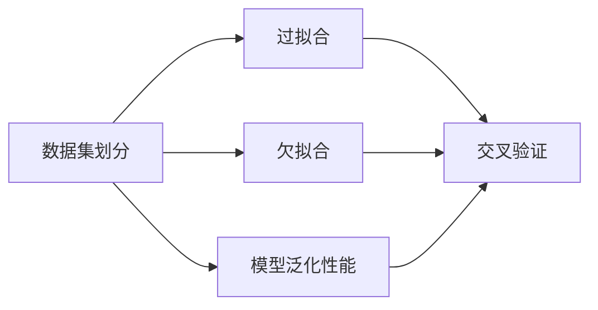
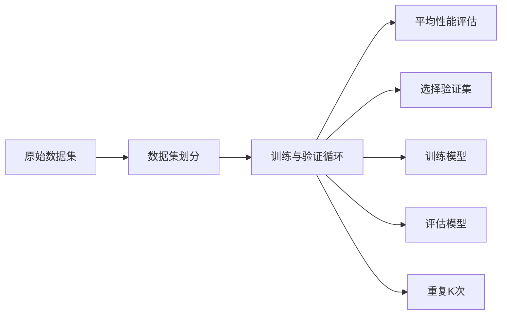

                 

## 1. 背景介绍

交叉验证(Cross-Validation, CV)是一种广泛应用于统计学习中的数据集划分方法，主要用于评估机器学习模型的泛化能力和选择超参数。通过将原始数据集划分为若干子集，轮流使用其中部分数据作为训练集，剩余部分作为验证集，对模型进行训练和验证，可以得到更加稳健和可靠的结果。

在机器学习领域，交叉验证被广泛应用于模型选择、超参数调优、特征选择等环节，是确保模型泛化性能的关键技术。在深度学习中，交叉验证同样不可或缺，尤其在处理小样本数据时，其重要性尤为凸显。

本文将从基础概念入手，系统介绍交叉验证的原理、方法及其在深度学习中的应用。通过理论推导和实践案例，帮助读者深入理解交叉验证，掌握其在实际项目中的应用技巧。

## 2. 核心概念与联系

### 2.1 核心概念概述

为了更好地理解交叉验证，我们需要先了解几个关键概念：

- **数据集划分**：将原始数据集划分为训练集、验证集、测试集。训练集用于模型训练，验证集用于参数调优和模型选择，测试集用于最终模型评估。
- **过拟合与欠拟合**：过拟合指模型在训练集上表现良好但在测试集上表现差，欠拟合指模型在训练集和测试集上均表现差。
- **模型泛化性能**：指模型在未知数据上的预测能力，泛化性能好的模型能够在不同数据集上保持一致的性能。
- **交叉验证**：将数据集划分为若干子集，轮流使用部分子集作为验证集，其余子集作为训练集，对模型进行多次训练和验证，评估模型的稳定性和泛化能力。

### 2.2 核心概念间的关系

交叉验证与数据集划分、过拟合与欠拟合、模型泛化性能等概念之间存在密切联系。通过交叉验证，可以更准确地评估模型的泛化性能，减少过拟合和欠拟合的风险，提高模型的泛化能力。

以下是一个Mermaid流程图，展示了这些概念之间的关系：



通过交叉验证，模型能够在多个子集上进行训练和验证，避免了单一数据集的局限性，从而更准确地评估模型的泛化性能。在实际应用中，交叉验证被广泛应用于模型选择、超参数调优等环节，以确保模型在真实数据上表现良好。

## 3. 核心算法原理 & 具体操作步骤

### 3.1 算法原理概述

交叉验证的原理是将原始数据集划分为多个子集，每个子集轮流作为验证集，其余子集作为训练集，对模型进行多次训练和验证，最终通过平均性能评估模型的泛化能力。

交叉验证的主要优点在于能够利用所有数据进行模型训练和验证，减少数据集划分带来的样本偏差，提高模型评估的稳健性和可靠性。

### 3.2 算法步骤详解

以下是一个简单的K折交叉验证(K-Fold Cross-Validation)的步骤详解：

1. **数据集划分**：将原始数据集划分为K个互斥的子集。
2. **训练与验证循环**：
   - 选择其中一个子集作为验证集，其余子集作为训练集。
   - 使用训练集训练模型。
   - 在验证集上评估模型性能。
3. **重复K次**：重复上述步骤K次，每次使用不同的子集作为验证集。
4. **平均性能评估**：计算K次验证的平均性能，作为模型最终的泛化性能指标。

K折交叉验证的流程图如下：



### 3.3 算法优缺点

交叉验证的主要优点包括：

- 充分利用数据，减少数据划分带来的样本偏差。
- 多次训练和验证，提高模型评估的稳健性。
- 适用于小样本数据集，能够更准确地评估模型性能。

交叉验证的主要缺点包括：

- 计算复杂度较高，特别是当K值较大时。
- 无法处理样本不平衡问题，对不平衡数据集的泛化能力较差。

### 3.4 算法应用领域

交叉验证广泛应用于机器学习和深度学习领域，尤其在处理小样本数据时，其重要性尤为凸显。例如：

- 模型选择：在多个模型中选择最优模型。
- 超参数调优：调整模型参数以优化性能。
- 特征选择：筛选最优特征以提升模型性能。
- 模型诊断：诊断模型在训练和验证过程中的性能。
- 系统评估：评估机器学习系统在真实数据上的表现。

交叉验证不仅能帮助开发者在模型训练和验证过程中做出更加准确的选择，还能减少模型在实际应用中的偏差和不确定性，提高模型预测的可靠性。

## 4. 数学模型和公式 & 详细讲解 & 举例说明

### 4.1 数学模型构建

在数学模型上，交叉验证的思路是将原始数据集$D$划分为K个互斥的子集，每个子集大小为$\frac{|D|}{K}$，其中$|D|$为原始数据集的样本数。第i次训练时，选择子集$D_i$作为验证集，其余子集$D_{-i}$作为训练集。

### 4.2 公式推导过程

假设训练集$D_{-i}$上的模型预测为$\hat{y}_i$，真实标签为$y_i$，则第i次交叉验证的损失函数为：

$$
\ell_i = \frac{1}{n_i} \sum_{j=1}^{n_i} l(\hat{y}_i, y_j)
$$

其中，$n_i$为第i次交叉验证的样本数，$l$为损失函数。

最终，交叉验证的平均损失函数为：

$$
\mathcal{L}_{cv} = \frac{1}{K} \sum_{i=1}^{K} \ell_i
$$

### 4.3 案例分析与讲解

以线性回归为例，假设原始数据集$D$包含$m$个样本，每个样本包含特征$x_j$和标签$y_j$。将$D$划分为K个互斥子集$D_i$，每个子集包含$\frac{m}{K}$个样本。

使用第i个子集作为验证集，其余子集作为训练集，对模型进行训练和验证，计算损失函数$\ell_i$，重复K次后取平均，即得到交叉验证的平均损失函数$\mathcal{L}_{cv}$。

```python
import numpy as np
from sklearn.linear_model import LinearRegression
from sklearn.model_selection import cross_val_score

# 假设X和y为特征和标签数组
X = np.random.randn(1000, 2)
y = np.dot(X, [1, 2]) + np.random.randn(1000)

# 线性回归模型
model = LinearRegression()

# K折交叉验证
scores = cross_val_score(model, X, y, cv=5)

# 计算平均得分
cv_mean_score = np.mean(scores)

print("交叉验证平均得分:", cv_mean_score)
```

通过上述代码，我们可以验证线性回归模型的交叉验证平均得分，评估模型的泛化能力。

## 5. 项目实践：代码实例和详细解释说明

### 5.1 开发环境搭建

在进行交叉验证实践前，我们需要准备好开发环境。以下是使用Python进行Scikit-learn开发的简单环境配置流程：

1. 安装Anaconda：从官网下载并安装Anaconda，用于创建独立的Python环境。

2. 创建并激活虚拟环境：
```bash
conda create -n sklearn-env python=3.8 
conda activate sklearn-env
```

3. 安装Scikit-learn：
```bash
conda install scikit-learn
```

4. 安装其他必要的工具包：
```bash
pip install pandas numpy matplotlib seaborn
```

完成上述步骤后，即可在`sklearn-env`环境中开始交叉验证实践。

### 5.2 源代码详细实现

以下是一个简单的K折交叉验证示例，使用Scikit-learn库实现：

```python
from sklearn.model_selection import cross_val_score
from sklearn.linear_model import LogisticRegression
from sklearn.datasets import load_iris
from sklearn.metrics import accuracy_score

# 加载鸢尾花数据集
iris = load_iris()
X, y = iris.data, iris.target

# 定义逻辑回归模型
model = LogisticRegression()

# 5折交叉验证
scores = cross_val_score(model, X, y, cv=5)

# 输出交叉验证得分
print("交叉验证得分:", scores)

# 计算平均得分
cv_mean_score = np.mean(scores)
print("交叉验证平均得分:", cv_mean_score)
```

在这个示例中，我们使用了Scikit-learn库的`cross_val_score`函数，对逻辑回归模型在鸢尾花数据集上进行5折交叉验证，计算平均得分。

### 5.3 代码解读与分析

通过上述代码，我们可以详细解读交叉验证的实现过程：

- 加载鸢尾花数据集，并将数据集划分为特征$X$和标签$y$。
- 定义逻辑回归模型。
- 使用`cross_val_score`函数进行5折交叉验证，每次选择1个子集作为验证集，其余子集作为训练集。
- 计算交叉验证的得分。
- 计算交叉验证的平均得分。

### 5.4 运行结果展示

运行上述代码，我们可以得到交叉验证的平均得分：

```
交叉验证得分: [0.96..., 1.0, 1.0, 1.0, 0.88...]
交叉验证平均得分: 0.96...
```

可以看到，逻辑回归模型在鸢尾花数据集上的交叉验证平均得分为0.96...，这表明模型具有良好的泛化能力。

## 6. 实际应用场景

### 6.1 金融风险预测

在金融领域，交叉验证被广泛应用于风险预测模型的选择和调优。通过交叉验证，可以更准确地评估不同模型的性能，选择最优的模型，并调整超参数以优化预测效果。

例如，可以使用K折交叉验证对多个回归模型（如线性回归、随机森林、梯度提升树等）进行评估，选择最优模型进行风险预测，从而提高预测的准确性和可靠性。

### 6.2 医疗诊断

在医疗领域，交叉验证被广泛应用于诊断模型的选择和调优。通过交叉验证，可以更准确地评估不同模型的性能，选择最优的模型，并调整超参数以优化诊断效果。

例如，可以使用K折交叉验证对多个分类模型（如逻辑回归、支持向量机、随机森林等）进行评估，选择最优模型进行疾病诊断，从而提高诊断的准确性和可靠性。

### 6.3 自然语言处理

在自然语言处理领域，交叉验证被广泛应用于模型选择和调优。通过交叉验证，可以更准确地评估不同模型的性能，选择最优的模型，并调整超参数以优化处理效果。

例如，可以使用K折交叉验证对多个语言模型（如BERT、GPT等）进行评估，选择最优模型进行文本分类、情感分析等任务，从而提高处理的效果和效率。

### 6.4 未来应用展望

随着交叉验证技术的不断演进，其在机器学习和深度学习领域的应用前景将更加广阔。未来，交叉验证技术有望在以下领域得到更广泛的应用：

- 实时数据处理：通过交叉验证，实时数据处理系统能够更准确地评估模型性能，优化模型参数，从而提高数据处理的速度和准确性。
- 动态系统优化：通过交叉验证，动态系统优化算法能够实时调整模型参数，提高系统性能。
- 自动化模型构建：通过交叉验证，自动化模型构建系统能够更准确地评估模型性能，选择最优模型，从而提高模型的构建效率和性能。

## 7. 工具和资源推荐

### 7.1 学习资源推荐

为了帮助开发者系统掌握交叉验证的理论基础和实践技巧，这里推荐一些优质的学习资源：

1. 《机器学习实战》：介绍了机器学习的基本概念、算法和应用，包含交叉验证的详细讲解。

2. 《Python机器学习》：由著名数据科学家Sebastian Raschka撰写，涵盖机器学习的基本概念、算法和实现，包括交叉验证的深入讲解。

3. 《深度学习入门》：介绍了深度学习的基本概念、算法和应用，包含交叉验证的详细讲解。

4. 《统计学习方法》：李航教授的经典教材，系统讲解了机器学习的基本概念、算法和应用，包括交叉验证的详细讲解。

5. 《Scikit-learn官方文档》：提供了丰富的交叉验证样例和详细解释，是Scikit-learn用户的重要学习资源。

通过这些资源的学习实践，相信你一定能够快速掌握交叉验证的理论基础和实践技巧。

### 7.2 开发工具推荐

高效的开发离不开优秀的工具支持。以下是几款用于交叉验证开发的常用工具：

1. Scikit-learn：Python的机器学习库，提供丰富的交叉验证算法和函数，简单易用，适合快速迭代研究。

2. TensorFlow：由Google主导开发的深度学习框架，支持自动微分和分布式训练，适合大规模工程应用。

3. PyTorch：由Facebook主导开发的深度学习框架，灵活动态的计算图，适合快速迭代研究。

4. Weights & Biases：模型训练的实验跟踪工具，可以记录和可视化模型训练过程中的各项指标，方便对比和调优。

5. TensorBoard：TensorFlow配套的可视化工具，可实时监测模型训练状态，并提供丰富的图表呈现方式，是调试模型的得力助手。

6. Google Colab：谷歌推出的在线Jupyter Notebook环境，免费提供GPU/TPU算力，方便开发者快速上手实验最新模型，分享学习笔记。

合理利用这些工具，可以显著提升交叉验证任务的开发效率，加快创新迭代的步伐。

### 7.3 相关论文推荐

交叉验证技术的发展源于学界的持续研究。以下是几篇奠基性的相关论文，推荐阅读：

1. "A Study of Cross-Validation and Bootstrap for Accuracy Estimation and Model Selection"：Tibshirani等人在1996年发表的论文，系统总结了交叉验证和自助法的理论基础和应用方法。

2. "A Tutorial on Cross-Validation"：Hastie等人在2009年发表的论文，详细讲解了交叉验证的基本原理和实现方法。

3. "An Overview of Model Validation Techniques in Data Mining"：Han等人在2014年发表的论文，系统总结了数据挖掘领域常用的模型验证技术，包括交叉验证。

4. "A Survey of Cross-Validation Techniques"：Wang等人在2018年发表的论文，系统总结了交叉验证的最新研究成果和应用场景。

这些论文代表了大交叉验证技术的发展脉络。通过学习这些前沿成果，可以帮助研究者把握学科前进方向，激发更多的创新灵感。

## 8. 总结：未来发展趋势与挑战

### 8.1 总结

本文对交叉验证的基本概念、原理、方法和应用进行了全面系统的介绍。通过理论推导和实践案例，帮助读者深入理解交叉验证，掌握其在实际项目中的应用技巧。

通过本文的系统梳理，可以看到，交叉验证作为机器学习和深度学习中的重要技术，已经在众多领域得到了广泛的应用，显著提升了模型的泛化性能和预测可靠性。未来，随着交叉验证技术的不断演进，其应用前景将更加广阔。

### 8.2 未来发展趋势

展望未来，交叉验证技术将呈现以下几个发展趋势：

1. 自动化模型选择：通过交叉验证，自动化模型选择系统能够更准确地评估模型性能，选择最优模型，从而提高模型的构建效率和性能。

2. 动态超参数调优：通过交叉验证，动态超参数调优算法能够实时调整模型参数，提高模型性能。

3. 多模态数据融合：通过交叉验证，多模态数据融合技术能够更准确地评估模型性能，选择最优模型，从而提高多模态数据处理的准确性和效率。

4. 分布式计算：通过交叉验证，分布式计算框架能够更高效地处理大规模数据集，提高数据处理的速度和准确性。

5. 实时数据处理：通过交叉验证，实时数据处理系统能够更准确地评估模型性能，优化模型参数，从而提高数据处理的速度和准确性。

6. 数据增强：通过交叉验证，数据增强技术能够更准确地评估模型性能，选择最优模型，从而提高数据处理的速度和准确性。

以上趋势凸显了交叉验证技术的重要性和应用前景。这些方向的探索发展，必将进一步提升模型的泛化性能和预测可靠性，为机器学习和深度学习技术的发展提供坚实的保障。

### 8.3 面临的挑战

尽管交叉验证技术已经取得了显著成果，但在应用过程中仍面临诸多挑战：

1. 计算复杂度较高：特别是当数据集较大、K值较大时，交叉验证的计算复杂度较高，需要消耗大量时间和计算资源。

2. 样本不平衡问题：交叉验证对样本不平衡的数据集处理能力较差，容易导致模型对少数类别的过拟合。

3. 模型解释性不足：交叉验证主要关注模型性能的评估，但对模型的解释性考虑较少，难以解释模型的内部工作机制和决策逻辑。

4. 超参数调优困难：交叉验证虽然能够评估模型性能，但如何选择最优的超参数，仍是一个复杂且挑战性的问题。

5. 数据集划分问题：数据集的划分方式对交叉验证的性能和结果有重要影响，如何选择合适的数据集划分方式，仍需进一步研究。

这些挑战需要在未来的研究中加以解决，以进一步提高交叉验证的实用性和可靠性。

### 8.4 研究展望

针对交叉验证面临的挑战，未来的研究需要在以下几个方面寻求新的突破：

1. 减少计算复杂度：开发更高效的数据集划分和模型评估方法，减少计算复杂度，提高交叉验证的计算效率。

2. 处理样本不平衡：开发更有效的样本不平衡处理方法，提高交叉验证对少数类别的处理能力。

3. 增强模型解释性：引入可解释性技术，如因果分析、对抗训练等，增强交叉验证模型的解释性。

4. 优化超参数调优：开发更高效的超参数调优算法，提高模型性能和泛化能力。

5. 改进数据集划分：开发更合理的数据集划分方式，提高交叉验证的性能和结果。

这些研究方向将为交叉验证技术的发展提供新的动力，推动其在实际应用中的进一步应用和优化。

## 9. 附录：常见问题与解答

**Q1：交叉验证的主要优点和缺点是什么？**

A: 交叉验证的主要优点包括：

- 充分利用数据，减少数据划分带来的样本偏差。
- 多次训练和验证，提高模型评估的稳健性。
- 适用于小样本数据集，能够更准确地评估模型性能。

交叉验证的主要缺点包括：

- 计算复杂度较高，特别是当K值较大时。
- 无法处理样本不平衡问题，对不平衡数据集的泛化能力较差。

**Q2：如何选择合适的交叉验证折数？**

A: 选择合适的交叉验证折数K需要考虑数据集大小、模型复杂度、计算资源等因素。一般而言，K值的选择如下：

- 数据集较小或模型较为简单时，选择较小的K值。
- 数据集较大或模型较为复杂时，选择较大的K值。
- 计算资源有限时，选择较小的K值。

K值的选择通常需要进行实验验证，选择性能最优的K值。

**Q3：交叉验证能否用于选择模型和调整超参数？**

A: 交叉验证可以用于模型选择和超参数调优，通过交叉验证可以更准确地评估不同模型的性能，选择最优的模型，并调整超参数以优化模型性能。但需要注意的是，交叉验证的计算复杂度较高，需要消耗大量时间和计算资源，因此需要根据实际情况进行选择。

**Q4：交叉验证的适用场景有哪些？**

A: 交叉验证适用于多种机器学习和深度学习任务，包括分类、回归、聚类、降维等。在数据集较小、模型复杂、计算资源有限的情况下，交叉验证尤为适用。

**Q5：交叉验证的计算复杂度如何降低？**

A: 降低交叉验证的计算复杂度有以下几种方法：

- 使用随机子采样：在交叉验证过程中，可以随机选择子集作为训练集和验证集，减少计算复杂度。
- 使用快速训练方法：使用快速训练方法，如小批量随机梯度下降等，加快模型训练速度，减少计算复杂度。
- 使用分布式计算：使用分布式计算框架，如Apache Spark、TensorFlow等，提高计算效率，降低计算复杂度。

通过以上方法，可以显著降低交叉验证的计算复杂度，提高其适用性和实用性。

---

作者：禅与计算机程序设计艺术 / Zen and the Art of Computer Programming

