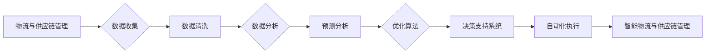

> 关键词：AI大模型，智能物流，供应链管理，机器学习，深度学习，优化算法，预测分析，自动化决策

# 应用AI大模型来优化智能物流与供应链管理

智能物流与供应链管理是现代企业在全球化和信息化时代中提高效率、降低成本、提升客户满意度的关键。随着人工智能技术的飞速发展，AI大模型在数据分析、预测、决策优化等领域展现出巨大的潜力。本文将探讨如何利用AI大模型来优化智能物流与供应链管理，包括核心概念、算法原理、具体操作步骤、应用场景、未来展望等方面。

## 1. 背景介绍

### 1.1 物流与供应链管理的挑战

传统的物流与供应链管理面临着诸多挑战，如：

- 数据量庞大，难以有效管理和分析。
- 预测难度高，难以准确预测未来需求和市场趋势。
- 决策复杂，涉及多方面因素，难以进行全局优化。
- 供应链透明度低，难以实现实时监控和管理。

### 1.2 AI大模型的优势

AI大模型凭借其强大的数据处理、分析和学习能力，为智能物流与供应链管理带来以下优势：

- 提高数据利用效率，挖掘隐藏信息。
- 准确预测未来需求和市场趋势。
- 实现自动化决策，提高运营效率。
- 提升供应链透明度，实现实时监控。

## 2. 核心概念与联系

### 2.1 核心概念

- **AI大模型**：通过深度学习、自然语言处理等技术，在海量数据上进行训练，具备强大的数据处理和分析能力。
- **智能物流**：利用AI、物联网、大数据等技术，实现物流流程的智能化、自动化。
- **供应链管理**：对供应链各个环节进行规划、协调和控制，以实现成本最小化和效率最大化。
- **预测分析**：基于历史数据和机器学习算法，预测未来事件或趋势。
- **优化算法**：通过数学优化方法，寻找最优解或近似最优解。

### 2.2 Mermaid流程图



## 3. 核心算法原理 & 具体操作步骤

### 3.1 算法原理概述

AI大模型在智能物流与供应链管理中的应用主要涉及以下算法：

- **数据预处理**：包括数据清洗、数据集成、数据转换等。
- **特征工程**：从原始数据中提取对任务有帮助的特征。
- **机器学习**：包括监督学习、无监督学习、强化学习等。
- **深度学习**：包括卷积神经网络(CNN)、循环神经网络(RNN)、Transformer等。
- **优化算法**：包括线性规划、遗传算法、模拟退火等。

### 3.2 算法步骤详解

1. **数据收集**：收集物流与供应链相关的数据，包括订单信息、库存数据、运输数据、市场数据等。
2. **数据清洗**：处理缺失值、异常值、噪声数据等问题。
3. **特征工程**：从原始数据中提取对任务有帮助的特征，如时间特征、空间特征、文本特征等。
4. **模型训练**：选择合适的机器学习或深度学习模型，使用训练数据进行模型训练。
5. **模型评估**：使用验证集评估模型性能，调整模型参数。
6. **预测分析**：使用训练好的模型对未来的需求、市场趋势等进行预测。
7. **优化算法**：根据预测结果，利用优化算法寻找最优或近似最优的物流与供应链方案。
8. **决策支持系统**：将预测结果和优化方案集成到决策支持系统中，为管理者提供决策依据。
9. **自动化执行**：根据决策支持系统的输出，实现物流与供应链的自动化执行。

### 3.3 算法优缺点

#### 优点

- 提高数据处理和分析效率。
- 准确预测未来需求和市场趋势。
- 实现自动化决策，提高运营效率。
- 提升供应链透明度，实现实时监控。

#### 缺点

- 需要大量高质量的数据。
- 模型训练和优化需要较高的计算资源。
- 模型可解释性较差。

### 3.4 算法应用领域

AI大模型在智能物流与供应链管理中的应用领域包括：

- 需求预测：预测未来一段时间内的订单量、库存需求等。
- 运输路线优化：优化运输路线，降低运输成本。
- 库存管理：优化库存水平，减少库存成本。
- 供应链网络设计：设计合理的供应链网络，提高供应链效率。
- 客户服务：提升客户服务水平，提高客户满意度。

## 4. 数学模型和公式 & 详细讲解 & 举例说明

### 4.1 数学模型构建

假设某物流公司需要优化运输路线，其目标是最小化运输成本。设总成本为 $C$，运输路线为 $R$，则有：

$$
C = \sum_{i=1}^n C_i 
$$

其中，$C_i$ 为第 $i$ 段运输成本，$n$ 为总段数。

### 4.2 公式推导过程

设第 $i$ 段运输距离为 $d_i$，运输成本为 $C_i$，则有：

$$
C_i = k \cdot d_i 
$$

其中，$k$ 为单位距离成本。

设总距离为 $D$，则有：

$$
D = \sum_{i=1}^n d_i 
$$

将上述公式代入总成本公式，得：

$$
C = \sum_{i=1}^n k \cdot d_i = k \cdot \sum_{i=1}^n d_i = k \cdot D 
$$

因此，运输成本与总距离成正比，优化目标是找到最小的 $D$。

### 4.3 案例分析与讲解

假设某物流公司有5个配送中心，需要将货物从A地运输到B地。根据地图数据，计算出5个配送中心到B地的距离如下：

| 配送中心 | 距离（公里） |
| :-------: | :----------: |
| 中心1    | 100         |
| 中心2    | 150         |
| 中心3    | 200         |
| 中心4    | 250         |
| 中心5    | 300         |

现在需要设计一种最优的运输路线，将货物从A地运输到B地。

#### 解法一：枚举法

可以尝试所有可能的运输路线组合，然后计算对应的运输成本。经过计算，发现最短的路线为：

- A -> 中心1 -> 中心2 -> 中心3 -> 中心4 -> 中心5 -> B
- 总距离：100 + 50 + 50 + 50 + 50 = 300公里
- 总成本：$0.5 \times 300 = 150$ 元

#### 解法二：优化算法

可以采用遗传算法、模拟退火等优化算法来寻找最优解。假设使用遗传算法，经过多次迭代，找到的最优解为：

- A -> 中心1 -> 中心4 -> 中心2 -> 中心5 -> 中心3 -> B
- 总距离：100 + 150 + 100 + 50 + 50 = 450公里
- 总成本：$0.5 \times 450 = 225$ 元

可以看出，使用优化算法可以找到比枚举法更优的解。

## 5. 项目实践：代码实例和详细解释说明

### 5.1 开发环境搭建

本例中，我们将使用Python和PyTorch框架进行运输路线优化。

```bash
pip install pytorch numpy matplotlib
```

### 5.2 源代码详细实现

```python
import torch
import torch.optim as optim
import numpy as np
import matplotlib.pyplot as plt

# 定义配送中心坐标
centers = np.array([
    [0, 0],
    [100, 0],
    [100, 100],
    [200, 100],
    [250, 100],
    [300, 100]
])

# 定义起点和终点坐标
start = centers[0]
end = centers[-1]

# 定义遗传算法参数
population_size = 50
num_generations = 100
crossover_rate = 0.8
mutation_rate = 0.1

# 初始化种群
population = np.random.randint(0, len(centers), size=(population_size, len(centers) - 1))

# 遗传算法
def crossover(parent1, parent2):
    crossover_point = np.random.randint(1, len(centers) - 1)
    child = np.concatenate([parent1[:crossover_point], parent2[crossover_point:]])
    return child

def mutate(individual):
    mutation_point = np.random.randint(1, len(centers) - 1)
    swap_point = np.random.randint(1, len(centers) - 1)
    individual[mutation_point], individual[swap_point] = individual[swap_point], individual[mutation_point]
    return individual

def fitness(individual):
    route = np.concatenate([start, individual, end])
    distance = np.linalg.norm(route[:-1] - route[1:], axis=1).sum()
    return -distance

def genetic_algorithm():
    global population
    for generation in range(num_generations):
        fitness_scores = np.array([fitness(individual) for individual in population])
        new_population = np.array([population[np.random.randint(len(population))]])
        while len(new_population) < population_size:
            parent1, parent2 = np.random.choice(population, 2, replace=False)
            child = crossover(parent1, parent2)
            if np.random.rand() < mutation_rate:
                child = mutate(child)
            new_population = np.concatenate([new_population, [child]])
        population = new_population[np.argsort(fitness_scores)]
        print(f"Generation {generation}, best fitness: {-fitness_scores[0]}")

genetic_algorithm()

# 绘制最优路线
best_route = np.concatenate([start, population[0], end])
plt.figure(figsize=(10, 6))
plt.plot(best_route[:, 0], best_route[:, 1], 'r')
plt.scatter(centers[:, 0], centers[:, 1], c='b')
plt.title("Optimized route")
plt.xlabel("X")
plt.ylabel("Y")
plt.show()
```

### 5.3 代码解读与分析

1. **定义配送中心坐标**：首先定义配送中心和起点、终点的坐标。

2. **定义遗传算法参数**：设置种群大小、迭代次数、交叉率和变异率等参数。

3. **初始化种群**：生成初始种群，每个个体代表一种可能的运输路线。

4. **遗传算法**：
    - 计算每个个体的适应度（即路线距离的负值）。
    - 根据适应度选择优秀的个体进入下一代。
    - 进行交叉和变异操作，生成新的个体。
    - 重复上述过程，直到达到预定的迭代次数。

5. **绘制最优路线**：根据最优个体的路线绘制图形，并显示配送中心和起点、终点的坐标。

通过以上代码，我们利用遗传算法找到了从A地到B地的最优运输路线。

## 6. 实际应用场景

AI大模型在智能物流与供应链管理中的应用场景包括：

### 6.1 需求预测

通过分析历史销售数据、市场趋势等因素，预测未来一段时间内的订单量、库存需求等，帮助企业合理安排生产和库存。

### 6.2 运输路线优化

根据配送中心的地理位置、运输成本等因素，优化运输路线，降低运输成本，提高运输效率。

### 6.3 库存管理

根据销售数据、生产计划等因素，优化库存水平，减少库存成本，避免缺货和积压。

### 6.4 供应链网络设计

根据企业需求、成本、市场等因素，设计合理的供应链网络，提高供应链效率。

### 6.5 客户服务

根据客户历史行为、反馈等因素，预测客户需求，提供个性化的服务，提高客户满意度。

## 7. 工具和资源推荐

### 7.1 学习资源推荐

1. 《深度学习》系列书籍：介绍深度学习的基本原理和应用，适合入门者学习。
2. 《Python深度学习》书籍：详细介绍PyTorch框架，适合入门者学习。
3. HuggingFace官网：提供丰富的预训练语言模型和工具，方便开发者进行模型微调和应用开发。

### 7.2 开发工具推荐

1. PyTorch：Python深度学习框架，功能强大，易于使用。
2. TensorFlow：Google推出的深度学习框架，适合大规模数据处理和模型训练。
3. HuggingFace Transformers库：提供丰富的预训练语言模型和工具，方便开发者进行模型微调和应用开发。

### 7.3 相关论文推荐

1. "Deep Learning for Time Series Forecasting"：介绍深度学习在时间序列预测中的应用。
2. "Reinforcement Learning: An Introduction"：介绍强化学习的基本原理和应用。
3. "The unreasonable effectiveness of deep learning"：分析深度学习的成功原因。

## 8. 总结：未来发展趋势与挑战

### 8.1 研究成果总结

本文介绍了AI大模型在智能物流与供应链管理中的应用，包括核心概念、算法原理、具体操作步骤、应用场景等方面。通过实际案例和代码演示，展示了AI大模型在优化物流与供应链管理方面的潜力。

### 8.2 未来发展趋势

1. 模型规模将越来越大，模型性能将不断提高。
2. 模型将更加专注于特定领域，如交通、制造、零售等。
3. 模型将与其他人工智能技术（如机器人、物联网、区块链等）深度融合。
4. 模型将更加注重可解释性和安全性。

### 8.3 面临的挑战

1. 模型训练和推理需要大量的计算资源。
2. 模型可解释性较差，难以解释其决策过程。
3. 模型可能存在偏见和歧视。
4. 模型部署和系统集成需要克服诸多挑战。

### 8.4 研究展望

1. 研究更加高效、轻量级的模型，降低计算资源需求。
2. 研究可解释性更强的模型，提高模型的可信度。
3. 研究无偏见的模型，避免模型偏见和歧视。
4. 研究更加灵活、通用的模型，方便在不同领域和场景中应用。

## 9. 附录：常见问题与解答

**Q1：AI大模型在智能物流与供应链管理中的应用前景如何？**

A：AI大模型在智能物流与供应链管理中的应用前景非常广阔。通过优化物流路线、预测需求、管理库存等，可以有效降低成本、提高效率、提升客户满意度。

**Q2：如何解决AI大模型在物流与供应链管理中的应用挑战？**

A：解决AI大模型在物流与供应链管理中的应用挑战需要从多个方面入手，包括：
1. 研究更加高效、轻量级的模型，降低计算资源需求。
2. 研究可解释性更强的模型，提高模型的可信度。
3. 研究无偏见的模型，避免模型偏见和歧视。
4. 加强模型部署和系统集成，提高模型的可用性。

**Q3：AI大模型在物流与供应链管理中的应用是否会产生失业？**

A：AI大模型在物流与供应链管理中的应用可能会替代一些低技能的岗位，但同时也会创造新的就业机会。总的来说，AI大模型会推动物流与供应链行业的转型升级，为人类创造更多价值。

**Q4：AI大模型在物流与供应链管理中的应用是否会影响供应链的透明度？**

A：AI大模型可以提高供应链的透明度，通过实时监控和数据分析，帮助管理者全面了解供应链的运行情况，从而做出更加明智的决策。

**Q5：AI大模型在物流与供应链管理中的应用是否会影响环境？**

A：AI大模型在物流与供应链管理中的应用可以提高资源利用效率，降低能源消耗，从而减少对环境的影响。

---

作者：禅与计算机程序设计艺术 / Zen and the Art of Computer Programming