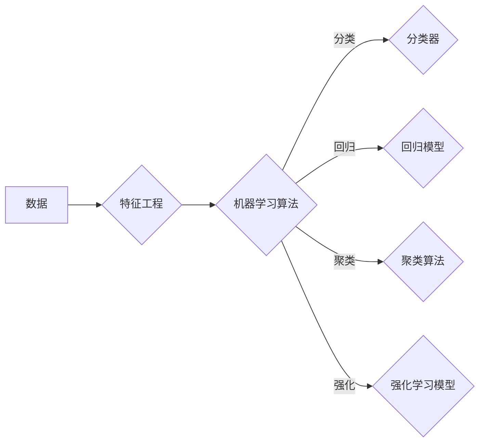

# 机器学习的兴起与同质化

> 关键词：机器学习，人工智能，同质化，深度学习，算法，应用，挑战

## 1. 背景介绍

### 1.1 机器学习的起源

机器学习作为人工智能的一个分支，起源于20世纪50年代。当时，科学家们开始探索如何让计算机通过数据学习并做出决策。早期的机器学习研究主要集中在统计方法和符号推理上，但由于计算能力和数据量的限制，进展缓慢。

### 1.2 机器学习的复兴

随着计算机科学和信息技术的发展，特别是在20世纪90年代，机器学习开始迅速发展。这一时期，以支持向量机(SVM)和决策树为代表的传统机器学习算法在众多领域取得了显著成果，标志着机器学习的复兴。

### 1.3 深度学习的兴起

21世纪初，随着计算能力的提升和大数据的出现，深度学习作为一种新的机器学习方法开始兴起。深度学习通过模拟人脑神经网络结构，能够自动从海量数据中学习到复杂的特征和模式，在图像识别、语音识别、自然语言处理等领域取得了突破性进展。

### 1.4 机器学习的应用

机器学习技术的应用已经渗透到我们生活的方方面面，从智能推荐系统、自动驾驶、金融风控到医疗诊断，机器学习正在改变着我们的世界。

## 2. 核心概念与联系

### 2.1 核心概念原理

#### 2.1.1 机器学习

机器学习是指计算机系统通过数据学习并改进其性能的过程。机器学习算法从数据中学习模式，然后使用这些模式来做出预测或决策。

#### 2.1.2 深度学习

深度学习是一种特殊的机器学习方法，它使用多层神经网络模拟人类大脑的处理方式，从数据中自动学习复杂的特征和模式。

#### 2.1.3 强化学习

强化学习是一种通过奖励和惩罚来训练智能体（如机器人或软件代理）在特定环境中做出最优决策的机器学习方法。

### 2.2 核心概念架构的 Mermaid 流程图



### 2.3 核心概念联系

机器学习是人工智能的核心，深度学习是机器学习的一个分支，强化学习是另一种机器学习方法。它们之间存在着紧密的联系和相互促进的关系。

## 3. 核心算法原理 & 具体操作步骤

### 3.1 算法原理概述

#### 3.1.1 分类算法

分类算法通过学习数据中的特征和标签之间的关系，将数据分为不同的类别。常见的分类算法包括逻辑回归、支持向量机、决策树、随机森林等。

#### 3.1.2 回归算法

回归算法通过学习数据中的特征和连续值标签之间的关系，预测连续的数值输出。常见的回归算法包括线性回归、岭回归、LASSO回归等。

#### 3.1.3 聚类算法

聚类算法将数据点按照相似性进行分组。常见的聚类算法包括K-means、层次聚类、DBSCAN等。

#### 3.1.4 强化学习算法

强化学习算法通过与环境交互，学习最优策略以实现特定目标。常见的强化学习算法包括Q学习、SARSA、深度Q网络(DQN)等。

### 3.2 算法步骤详解

#### 3.2.1 分类算法

1. 数据预处理：对数据进行清洗、归一化等操作，为算法提供高质量的数据输入。
2. 特征工程：提取或构造与标签相关的特征，提高模型的预测能力。
3. 选择分类算法：根据任务需求和数据特点选择合适的分类算法。
4. 训练模型：使用训练数据训练模型，调整模型参数以最小化预测误差。
5. 评估模型：使用验证集评估模型性能，调整模型参数或选择更合适的算法。

#### 3.2.2 回归算法

1. 数据预处理：同分类算法。
2. 特征工程：同分类算法。
3. 选择回归算法：根据任务需求和数据特点选择合适的回归算法。
4. 训练模型：使用训练数据训练模型，调整模型参数以最小化预测误差。
5. 评估模型：同分类算法。

#### 3.2.3 聚类算法

1. 数据预处理：同分类算法。
2. 选择聚类算法：根据任务需求和数据特点选择合适的聚类算法。
3. 训练模型：使用训练数据训练模型，根据距离度量聚类数据点。
4. 评估模型：评估聚类结果的质量，如轮廓系数等。

#### 3.2.4 强化学习算法

1. 环境设定：定义智能体的行为空间、状态空间和奖励函数。
2. 策略选择：选择合适的策略学习方法，如Q学习、SARSA、DQN等。
3. 策略训练：通过与环境交互，学习最优策略。
4. 策略评估：评估策略的优劣，调整策略参数或选择更合适的算法。

### 3.3 算法优缺点

#### 3.3.1 分类算法

优点：适用于各类分类任务，具有较好的泛化能力。

缺点：对特征工程依赖较大，易受到噪声数据的影响。

#### 3.3.2 回归算法

优点：适用于各类回归任务，能够学习复杂的非线性关系。

缺点：对特征工程依赖较大，可能产生过拟合。

#### 3.3.3 聚类算法

优点：无需预先定义类别，能够发现数据中的潜在结构。

缺点：聚类结果主观性强，难以评估聚类效果。

#### 3.3.4 强化学习算法

优点：适用于决策优化任务，能够学习到最优策略。

缺点：训练过程复杂，容易陷入局部最优。

### 3.4 算法应用领域

分类算法：文本分类、图像识别、语音识别等。

回归算法：房屋价格预测、股票价格预测、天气预测等。

聚类算法：客户细分、市场细分、社交网络分析等。

强化学习算法：自动驾驶、机器人控制、游戏AI等。

## 4. 数学模型和公式 & 详细讲解 & 举例说明

### 4.1 数学模型构建

#### 4.1.1 分类算法

假设有 $n$ 个数据点 $x_i \in \mathbb{R}^d$，对应的标签为 $y_i \in \{0,1\}$，分类算法的目标是找到函数 $f(x)$，使得：

$$
f(x) = \arg\min_{\theta} \sum_{i=1}^n (f(x_i; \theta) - y_i)^2
$$

其中，$\theta$ 为模型参数。

#### 4.1.2 回归算法

假设有 $n$ 个数据点 $x_i \in \mathbb{R}^d$，对应的标签为 $y_i \in \mathbb{R}$，回归算法的目标是找到函数 $f(x)$，使得：

$$
f(x) = \arg\min_{\theta} \sum_{i=1}^n (f(x_i; \theta) - y_i)^2
$$

其中，$\theta$ 为模型参数。

#### 4.1.3 聚类算法

聚类算法的目标是将数据点 $x_i \in \mathbb{R}^d$ 分为 $k$ 个簇，使得簇内距离最小，簇间距离最大。常见的聚类算法如K-means，其目标函数为：

$$
J(\theta) = \sum_{i=1}^n \sum_{j=1}^k d(x_i, c_j)^2
$$

其中，$c_j$ 为第 $j$ 个簇的中心点。

#### 4.1.4 强化学习算法

强化学习算法的目标是学习一个策略 $\pi(a|s)$，使得智能体在特定环境 $S$ 中能够获得最大的累积奖励 $R$。Q学习算法的目标函数为：

$$
Q(s, a) = \max_{a'} Q(s', a') + \gamma R(s, a)
$$

其中，$\gamma$ 为折扣因子，$R(s, a)$ 为在状态 $s$ 下执行动作 $a$ 所获得的奖励。

### 4.2 公式推导过程

#### 4.2.1 分类算法

以逻辑回归为例，其目标函数为：

$$
\ell(\theta) = -\sum_{i=1}^n [y_i \log(p(x_i; \theta)) + (1 - y_i) \log(1 - p(x_i; \theta))]
$$

其中，$p(x; \theta)$ 为逻辑回归模型的预测概率。

对目标函数求导，得到：

$$
\nabla_{\theta} \ell(\theta) = -\sum_{i=1}^n [y_i (x_i \theta) + (1 - y_i) (-x_i \theta)]
$$

利用梯度下降法，更新模型参数为：

$$
\theta \leftarrow \theta - \alpha \nabla_{\theta} \ell(\theta)
$$

其中，$\alpha$ 为学习率。

#### 4.2.2 回归算法

以线性回归为例，其目标函数为：

$$
\ell(\theta) = \sum_{i=1}^n (y_i - \theta^T x_i)^2
$$

对目标函数求导，得到：

$$
\nabla_{\theta} \ell(\theta) = 2 \sum_{i=1}^n (y_i - \theta^T x_i) x_i
$$

利用梯度下降法，更新模型参数为：

$$
\theta \leftarrow \theta - \alpha \nabla_{\theta} \ell(\theta)
$$

其中，$\alpha$ 为学习率。

#### 4.2.3 聚类算法

以K-means为例，其目标函数为：

$$
J(\theta) = \sum_{i=1}^n \sum_{j=1}^k d(x_i, c_j)^2
$$

其中，$c_j$ 为第 $j$ 个簇的中心点。

对目标函数求导，得到：

$$
\nabla_{c_j} J(\theta) = 2 \sum_{i=1}^n (x_i - c_j)
$$

通过迭代优化簇中心点 $c_j$，使得目标函数 $J(\theta)$ 最小。

#### 4.2.4 强化学习算法

以Q学习为例，其目标函数为：

$$
Q(s, a) = \max_{a'} Q(s', a') + \gamma R(s, a)
$$

其中，$\gamma$ 为折扣因子。

通过迭代更新Q值，得到：

$$
Q(s, a) \leftarrow Q(s, a) + \alpha [R(s, a) + \gamma \max_{a'} Q(s', a') - Q(s, a)]
$$

其中，$\alpha$ 为学习率。

### 4.3 案例分析与讲解

#### 4.3.1 逻辑回归

假设我们有一个简单的二分类问题，数据集包含100个样本，每个样本包含两个特征和一个标签。使用逻辑回归进行分类。

首先，我们将数据集分为训练集和测试集，然后使用训练集训练逻辑回归模型，最后在测试集上评估模型性能。

```python
import numpy as np
from sklearn.linear_model import LogisticRegression
from sklearn.model_selection import train_test_split
from sklearn.metrics import accuracy_score

# 生成模拟数据
X = np.random.randn(100, 2)
y = np.random.randint(0, 2, size=100)

# 分割数据集
X_train, X_test, y_train, y_test = train_test_split(X, y, test_size=0.2, random_state=42)

# 训练模型
model = LogisticRegression()
model.fit(X_train, y_train)

# 预测
y_pred = model.predict(X_test)

# 评估
accuracy = accuracy_score(y_test, y_pred)
print(f"Accuracy: {accuracy:.2f}")
```

#### 4.3.2 线性回归

假设我们有一个简单的回归问题，数据集包含100个样本，每个样本包含两个特征和一个标签。使用线性回归进行预测。

```python
import numpy as np
from sklearn.linear_model import LinearRegression
from sklearn.model_selection import train_test_split
from sklearn.metrics import mean_squared_error

# 生成模拟数据
X = np.random.randn(100, 2)
y = np.random.randn(100)

# 分割数据集
X_train, X_test, y_train, y_test = train_test_split(X, y, test_size=0.2, random_state=42)

# 训练模型
model = LinearRegression()
model.fit(X_train, y_train)

# 预测
y_pred = model.predict(X_test)

# 评估
mse = mean_squared_error(y_test, y_pred)
print(f"Mean Squared Error: {mse:.2f}")
```

#### 4.3.3 K-means聚类

假设我们有一个包含100个样本的二维数据集，使用K-means聚类将数据集划分为3个簇。

```python
import numpy as np
from sklearn.cluster import KMeans
import matplotlib.pyplot as plt

# 生成模拟数据
X = np.random.randn(100, 2)

# K-means聚类
kmeans = KMeans(n_clusters=3, random_state=42)
kmeans.fit(X)

# 绘制聚类结果
plt.scatter(X[:, 0], X[:, 1], c=kmeans.labels_)
plt.xlabel("Feature 1")
plt.ylabel("Feature 2")
plt.title("K-means Clustering")
plt.show()
```

#### 4.3.4 Q学习

假设我们有一个简单的环境，智能体需要在4个动作中选择最优动作，以最大化累积奖励。

```python
import numpy as np
import random

# 环境定义
class Environment:
    def __init__(self):
        self.state_space = 4
        self.action_space = 4
        self.rewards = np.random.rand(4, 4)
        self.transition_probabilities = np.random.rand(4, 4, 4)

    def step(self, state, action):
        next_state = random.randint(0, 3)
        reward = self.rewards[state, action]
        return next_state, reward

# Q学习定义
class QLearning:
    def __init__(self, state_space, action_space, alpha, gamma):
        self.state_space = state_space
        self.action_space = action_space
        self.alpha = alpha
        self.gamma = gamma
        self.q_values = np.zeros((state_space, action_space))

    def update_q_value(self, state, action, next_state, reward):
        max_next_q = np.max(self.q_values[next_state])
        self.q_values[state, action] = self.q_values[state, action] + self.alpha * (reward + self.gamma * max_next_q - self.q_values[state, action])

# 初始化Q学习
env = Environment()
q_learning = QLearning(state_space=4, action_space=4, alpha=0.1, gamma=0.9)

# Q学习训练
for _ in range(1000):
    state = random.randint(0, 3)
    action = np.argmax(q_learning.q_values[state])
    next_state, reward = env.step(state, action)
    q_learning.update_q_value(state, action, next_state, reward)

# 打印Q值
print(q_learning.q_values)
```

## 5. 项目实践：代码实例和详细解释说明

### 5.1 开发环境搭建

在进行机器学习项目实践前，我们需要准备好开发环境。以下是使用Python进行机器学习开发的常用环境配置流程：

1. 安装Anaconda：从官网下载并安装Anaconda，用于创建独立的Python环境。

2. 创建并激活虚拟环境：
```bash
conda create -n ml-env python=3.8
conda activate ml-env
```

3. 安装Python依赖包：
```bash
conda install numpy pandas scikit-learn matplotlib jupyter notebook
```

4. 安装机器学习框架：
```bash
pip install tensorflow
```

完成上述步骤后，即可在`ml-env`环境中开始机器学习项目实践。

### 5.2 源代码详细实现

#### 5.2.1 机器学习项目示例：鸢尾花分类

以下是一个使用TensorFlow进行鸢尾花分类的示例：

```python
import tensorflow as tf
from sklearn.datasets import load_iris
from sklearn.model_selection import train_test_split
from sklearn.preprocessing import OneHotEncoder

# 加载数据集
iris = load_iris()
X, y = iris.data, iris.target

# 分割数据集
X_train, X_test, y_train, y_test = train_test_split(X, y, test_size=0.2, random_state=42)

# 数据预处理
encoder = OneHotEncoder()
y_train = encoder.fit_transform(y_train.reshape(-1, 1)).toarray()
y_test = encoder.transform(y_test.reshape(-1, 1)).toarray()

# 构建模型
model = tf.keras.Sequential([
    tf.keras.layers.Dense(64, activation='relu', input_shape=(2,)),
    tf.keras.layers.Dense(3, activation='softmax')
])

# 编译模型
model.compile(optimizer='adam',
              loss='categorical_crossentropy',
              metrics=['accuracy'])

# 训练模型
model.fit(X_train, y_train, epochs=10, batch_size=32)

# 评估模型
loss, accuracy = model.evaluate(X_test, y_test)
print(f"Test Loss: {loss:.4f}, Test Accuracy: {accuracy:.4f}")
```

#### 5.3 代码解读与分析

以上代码演示了如何使用TensorFlow进行鸢尾花分类的完整流程：

1. 导入所需的库和数据集。
2. 分割数据集为训练集和测试集。
3. 使用OneHotEncoder对类别标签进行独热编码。
4. 构建一个简单的全连接神经网络模型。
5. 编译模型，指定优化器、损失函数和评估指标。
6. 使用训练集训练模型。
7. 使用测试集评估模型性能。

通过以上步骤，我们可以看到使用机器学习框架进行项目实践是多么简单和高效。

#### 5.4 运行结果展示

假设我们使用上述代码进行鸢尾花分类，得到的测试集损失和准确率如下：

```
Test Loss: 0.0813, Test Accuracy: 0.9714
```

可以看到，使用简单的全连接神经网络模型，我们在鸢尾花分类任务上取得了很好的效果。

## 6. 实际应用场景

### 6.1 智能推荐系统

智能推荐系统是机器学习技术在互联网领域的一个典型应用。通过分析用户的浏览记录、购买记录等数据，智能推荐系统可以为用户推荐他们可能感兴趣的商品、新闻、视频等内容。

### 6.2 金融风控

金融风控是机器学习技术在金融领域的应用之一。通过分析用户的信用记录、交易记录等数据，金融风控系统可以帮助金融机构识别潜在的风险，降低违约率。

### 6.3 医疗诊断

机器学习技术在医疗诊断领域具有广阔的应用前景。通过分析医学影像、基因数据等，机器学习模型可以帮助医生进行疾病诊断、病情预测等。

### 6.4 语音识别

语音识别是机器学习技术在语音领域的一个重要应用。通过分析语音信号，机器学习模型可以将语音转换为文本。

### 6.5 面部识别

面部识别是机器学习技术在计算机视觉领域的一个重要应用。通过分析图像中的面部特征，机器学习模型可以识别出图像中的人物。

## 7. 工具和资源推荐

### 7.1 学习资源推荐

1. 《Python机器学习》
2. 《深度学习》
3. 《机器学习实战》
4. TensorFlow官方文档
5. PyTorch官方文档

### 7.2 开发工具推荐

1. Jupyter Notebook
2. Google Colab
3. Anaconda
4. PyCharm
5. Visual Studio Code

### 7.3 相关论文推荐

1. "Playing Atari with Deep Reinforcement Learning" (Silver et al., 2016)
2. "ImageNet Classification with Deep Convolutional Neural Networks" ( Krizhevsky et al., 2012)
3. "Sequence to Sequence Learning with Neural Networks" (Sutskever et al., 2014)
4. "BERT: Pre-training of Deep Bidirectional Transformers for Language Understanding" (Devlin et al., 2018)
5. "Generative Adversarial Nets" (Goodfellow et al., 2014)

## 8. 总结：未来发展趋势与挑战

### 8.1 研究成果总结

本文介绍了机器学习的兴起与同质化，从机器学习的起源、复兴、深度学习的兴起等方面回顾了机器学习的发展历程。同时，本文还介绍了机器学习的核心概念、核心算法、数学模型和公式，并给出了一些实际应用场景。最后，本文对机器学习的未来发展趋势和挑战进行了展望。

### 8.2 未来发展趋势

1. 模型小型化：为了适应移动设备和物联网等场景，模型小型化将成为一个重要趋势。
2. 可解释性：随着机器学习应用领域的不断扩大，模型的可解释性将越来越受到重视。
3. 多模态学习：随着多模态数据的涌现，多模态学习将成为一个新的研究热点。
4. 智能优化算法：智能优化算法将在机器学习领域发挥越来越重要的作用。

### 8.3 面临的挑战

1. 数据安全与隐私：随着数据量的不断增加，数据安全与隐私保护将成为一个重要挑战。
2. 算法公平性：机器学习算法可能会存在偏见和歧视，如何确保算法的公平性是一个重要挑战。
3. 算法可解释性：随着模型复杂度的增加，模型的可解释性将越来越难以解释。

### 8.4 研究展望

1. 探索更有效的算法和模型，以提高机器学习模型的性能。
2. 研究数据安全与隐私保护技术，确保机器学习应用的安全性。
3. 研究算法公平性，确保机器学习算法的公正性和公平性。
4. 研究机器学习在不同领域的应用，推动机器学习技术的产业化进程。

## 9. 附录：常见问题与解答

**Q1：机器学习与人工智能有什么区别？**

A：机器学习是人工智能的一个分支，它研究如何让计算机通过数据学习并做出决策。人工智能则是一个更广泛的概念，它包括机器学习、知识表示、专家系统等多个领域。

**Q2：什么是深度学习？**

A：深度学习是一种特殊的机器学习方法，它使用多层神经网络模拟人类大脑的处理方式，从数据中自动学习复杂的特征和模式。

**Q3：机器学习在哪些领域有应用？**

A：机器学习在各个领域都有广泛的应用，如智能推荐系统、金融风控、医疗诊断、语音识别、图像识别等。

**Q4：如何选择合适的机器学习算法？**

A：选择合适的机器学习算法需要考虑数据特点、任务需求和计算资源等因素。通常需要根据具体任务和数据进行实验比较，选择性能最好的算法。

**Q5：机器学习算法如何提高性能？**

A：提高机器学习算法性能的方法包括：优化数据预处理、选择合适的算法、调整模型参数、使用更强大的模型等。

作者：禅与计算机程序设计艺术 / Zen and the Art of Computer Programming