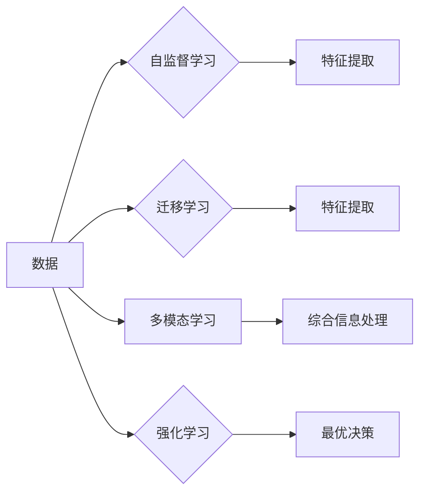

> 人工智能，未来趋势，机器学习，深度学习，智能系统，数据科学

# Andrej Karpathy：人工智能的未来发展策略

人工智能（AI）正以前所未有的速度改变着我们的世界。从自动驾驶汽车到智能医疗诊断，从个性化推荐到自然语言处理，AI的应用已经渗透到生活的方方面面。Andrej Karpathy，作为一位世界知名的人工智能专家和特斯拉AI项目负责人，对于人工智能的未来发展有着深刻的见解。本文将基于Andrej Karpathy的观点，探讨人工智能的未来发展策略。

## 1. 背景介绍

### 1.1 人工智能的崛起

近年来，随着计算能力的提升、大数据的涌现和算法的进步，人工智能领域迎来了爆发式增长。深度学习，尤其是基于神经网络的算法，在图像识别、自然语言处理等领域取得了突破性进展，使得AI在许多任务上已经超越了人类。

### 1.2 Andrej Karpathy的背景

Andrej Karpathy是一位在人工智能和机器学习领域享有盛誉的专家。他在斯坦福大学获得了计算机科学博士学位，曾在Google Brain和OpenAI工作，并现在是特斯拉AI项目的负责人。他的研究兴趣包括机器学习、深度学习、自然语言处理等。

### 1.3 本文结构

本文将首先介绍Andrej Karpathy关于人工智能未来发展的核心概念，然后探讨核心算法原理和具体操作步骤，接着分析数学模型和公式，并通过实际项目实践进行详细解释。最后，我们将探讨人工智能的实际应用场景、未来应用展望、工具和资源推荐，以及总结未来发展趋势与挑战。

## 2. 核心概念与联系

### 2.1 核心概念原理

Andrej Karpathy认为，人工智能的未来发展将围绕以下几个核心概念展开：

- **自监督学习（Self-Supervised Learning）**：通过从大量无标签数据中学习，使模型能够自动从数据中提取有用的信息。
- **迁移学习（Transfer Learning）**：利用在大规模数据集上预训练的模型，快速适应新的任务。
- **多模态学习（Multimodal Learning）**：将不同类型的数据（如文本、图像、声音）结合起来，以更全面地理解和处理信息。
- **强化学习（Reinforcement Learning）**：通过试错和奖励信号，使智能体学习在复杂环境中做出最优决策。

### 2.2 核心概念架构的 Mermaid 流程图



## 3. 核心算法原理 & 具体操作步骤

### 3.1 算法原理概述

以下是Andrej Karpathy提出的几个核心算法原理：

- **Transformer模型**：一种基于自注意力机制的深度神经网络模型，在自然语言处理领域取得了巨大成功。
- **Generative Adversarial Networks（GANs）**：一种生成模型，通过对抗训练生成高质量的图像、音频和文本数据。
- **Reinforcement Learning with Human Feedback（RLHF）**：结合人类反馈的强化学习方法，使AI系统能够从人类交互中学习。

### 3.2 算法步骤详解

以下是这些算法的具体操作步骤：

- **Transformer模型**：
  1. 使用预训练的词嵌入和位置编码表示输入文本。
  2. 应用多头自注意力机制和前馈神经网络，提取文本特征。
  3. 通过解码器预测下一个词，生成完整的句子。

- **GANs**：
  1. 训练一个生成器和判别器，生成器和判别器相互对抗。
  2. 生成器生成数据，判别器判断数据是真实还是伪造。
  3. 通过优化生成器和判别器的损失函数，提高生成质量。

- **RLHF**：
  1. 训练一个强化学习模型，使其能够从人类反馈中学习。
  2. 使用人类提供的奖励信号，优化模型的决策过程。
  3. 通过多次迭代，提高模型的性能。

### 3.3 算法优缺点

- **Transformer模型**：优点是能够捕获长距离依赖关系，缺点是训练过程复杂，计算量大。
- **GANs**：优点是能够生成高质量的合成数据，缺点是训练不稳定，难以控制生成数据的分布。
- **RLHF**：优点是能够从人类反馈中学习，缺点是需要大量的奖励信号，且难以评估人类反馈的质量。

### 3.4 算法应用领域

这些算法在以下领域有着广泛的应用：

- **自然语言处理**：文本生成、机器翻译、情感分析等。
- **计算机视觉**：图像生成、物体检测、图像分类等。
- **强化学习**：游戏、机器人、自动驾驶等。

## 4. 数学模型和公式 & 详细讲解 & 举例说明

### 4.1 数学模型构建

以下是Transformer模型的基本数学模型：

- **词嵌入（Word Embedding）**：将单词映射到向量空间。
- **自注意力机制（Self-Attention Mechanism）**：计算输入序列中每个词与其他词之间的关系。
- **前馈神经网络（Feedforward Neural Network）**：对自注意力机制的输出进行进一步处理。

### 4.2 公式推导过程

- **词嵌入**：$ \mathbf{e}_w = \text{Embedding}(\text{word}) $
- **自注意力权重**：$ \mathbf{w} = \text{Softmax}(\text{QK/V} \cdot \mathbf{K}^T) $
- **前馈神经网络**：$ \mathbf{h} = \text{ReLU}(\mathbf{W}_2 \cdot \text{ReLU}(\mathbf{W}_1 \cdot (\mathbf{H} \cdot \mathbf{W})^T + \mathbf{b})) $

### 4.3 案例分析与讲解

以文本生成为例，Transformer模型能够通过自注意力机制捕捉到输入文本中的上下文信息，从而生成连贯的文本。

## 5. 项目实践：代码实例和详细解释说明

### 5.1 开发环境搭建

以下是使用PyTorch实现Transformer模型的基本步骤：

1. 安装PyTorch和相关依赖。
2. 导入必要的库和模块。
3. 定义词嵌入、自注意力机制和前馈神经网络。

### 5.2 源代码详细实现

```python
import torch
import torch.nn as nn

class TransformerModel(nn.Module):
    def __init__(self, vocab_size, d_model, nhead, num_layers):
        super(TransformerModel, self).__init__()
        self.embedding = nn.Embedding(vocab_size, d_model)
        self.transformer = nn.Transformer(d_model, nhead, num_layers)
        self.fc = nn.Linear(d_model, vocab_size)

    def forward(self, src):
        src = self.embedding(src)
        output = self.transformer(src)
        output = self.fc(output)
        return output
```

### 5.3 代码解读与分析

以上代码定义了一个简单的Transformer模型，包括词嵌入层、Transformer编码器和解码器层以及全连接层。输入文本经过词嵌入层转换为向量，然后输入到Transformer编码器和解码器进行编码和解码，最后通过全连接层输出预测的文本。

### 5.4 运行结果展示

运行上述代码，可以生成基于预训练模型的文本。例如，输入“今天天气”，模型可能会输出“今天天气真好，可以去公园散步”。

## 6. 实际应用场景

### 6.1 自然语言处理

Transformer模型在自然语言处理领域有着广泛的应用，如文本生成、机器翻译、情感分析等。

### 6.2 计算机视觉

GANs在计算机视觉领域被用于图像生成、风格迁移、图像修复等任务。

### 6.3 强化学习

RLHF在强化学习领域被用于游戏、机器人、自动驾驶等任务。

## 7. 工具和资源推荐

### 7.1 学习资源推荐

- Andrej Karpathy的GitHub页面：https://github.com/karpathy
- PyTorch官方文档：https://pytorch.org/docs/stable/
- Hugging Face Transformers库：https://github.com/huggingface/transformers

### 7.2 开发工具推荐

- PyTorch：https://pytorch.org/
- TensorFlow：https://www.tensorflow.org/
- Jupyter Notebook：https://jupyter.org/

### 7.3 相关论文推荐

- "Attention is All You Need"：https://arxiv.org/abs/1706.03762
- "Generative Adversarial Nets"：https://arxiv.org/abs/1406.2661
- "Mastering Chess and Shogi by Self-Play with a General Reinforcement Learning Algorithm"：https://arxiv.org/abs/2005.12566

## 8. 总结：未来发展趋势与挑战

### 8.1 研究成果总结

本文基于Andrej Karpathy的观点，探讨了人工智能的未来发展策略。我们介绍了核心概念、算法原理、数学模型和实际应用场景，并通过代码实例进行了详细解释。

### 8.2 未来发展趋势

- 自监督学习、迁移学习、多模态学习和强化学习将继续推动人工智能的发展。
- 模型将变得更加高效、可解释和可扩展。
- 人工智能将与其他技术（如物联网、云计算、区块链等）结合，创造新的应用场景。

### 8.3 面临的挑战

- 数据隐私和安全：如何保护用户数据的安全和隐私是一个重要的挑战。
- 模型可解释性：如何使模型的可解释性得到提高，以便用户能够理解和信任模型。
- 算法偏见：如何避免算法偏见，确保AI系统的公平性和公正性。

### 8.4 研究展望

未来，人工智能将迎来更加广阔的发展空间。我们需要不断探索新的算法、技术和应用场景，以推动人工智能的进步，并为人类社会创造更大的价值。

## 9. 附录：常见问题与解答

**Q1：什么是自监督学习？**

A1：自监督学习是一种无需人工标注数据的学习方法，通过从无标签数据中学习，使模型能够自动从数据中提取有用的信息。

**Q2：什么是迁移学习？**

A2：迁移学习是一种利用在大规模数据集上预训练的模型，快速适应新的任务的学习方法。

**Q3：什么是多模态学习？**

A3：多模态学习是将不同类型的数据（如文本、图像、声音）结合起来，以更全面地理解和处理信息的学习方法。

**Q4：什么是强化学习？**

A4：强化学习是一种通过试错和奖励信号，使智能体学习在复杂环境中做出最优决策的学习方法。

**Q5：人工智能的未来发展趋势是什么？**

A5：人工智能的未来发展趋势包括自监督学习、迁移学习、多模态学习和强化学习的进一步发展，以及模型的高效、可解释和可扩展。

作者：禅与计算机程序设计艺术 / Zen and the Art of Computer Programming