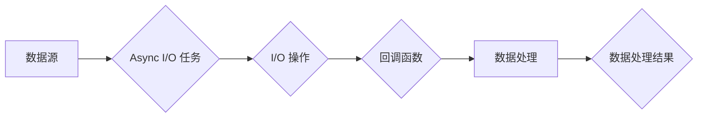

# Flink Async I/O原理与代码实例讲解

> 关键词：Apache Flink, Async I/O, 事件驱动架构, 流处理, 异步编程, 轻量级线程池

## 1. 背景介绍

随着大数据和实时计算技术的发展，Apache Flink 作为一款强大的流处理框架，在处理大规模、高并发的数据流应用中扮演着重要角色。Flink 提供了丰富的处理功能，包括时间窗口、状态管理、容错机制等。其中，Async I/O 是 Flink 中一个重要的概念，它允许 Flink 在保持高吞吐量和低延迟的同时，高效地处理异步 I/O 操作。

### 1.1 Async I/O 的由来

在传统的数据处理框架中，同步 I/O 操作往往会导致数据处理的瓶颈，因为 I/O 操作会阻塞线程的执行。为了解决这个问题，Flink 引入了 Async I/O，它允许 I/O 操作在不阻塞线程的情况下异步执行，从而提高系统的吞吐量和响应速度。

### 1.2 研究意义

研究 Flink Async I/O 的原理和实现，对于开发高性能的流处理应用具有重要意义。通过深入理解 Async I/O，开发者可以设计出更高效的 I/O 模式，提高系统的整体性能。

### 1.3 本文结构

本文将围绕 Flink Async I/O 展开，包括以下内容：

- 核心概念与联系
- 核心算法原理与操作步骤
- 数学模型和公式
- 项目实践：代码实例
- 实际应用场景
- 工具和资源推荐
- 总结：未来发展趋势与挑战

## 2. 核心概念与联系

### 2.1 Async I/O 的核心概念

Async I/O 是一种异步编程模式，它允许程序在等待 I/O 操作完成时执行其他任务。在 Flink 中，Async I/O 通过以下核心概念实现：

- **I/O 泵（I/O Pollers）**：负责管理异步 I/O 操作的线程池，它从连接池中获取连接，并处理 I/O 事件。
- **连接池（Connection Pool）**：存储和管理可用 I/O 连接的集合，确保 I/O 操作的高效执行。
- **异步任务（Async I/O 任务）**：执行异步 I/O 操作的任务，它在 I/O 操作完成时触发回调函数。

### 2.2 Async I/O 架构的 Mermaid 流程图



### 2.3 Async I/O 与同步 I/O 的比较

| 特点       | 同步 I/O                                                                 | 异步 I/O                                                                                     |
|------------|---------------------------------------------------------------------------|-----------------------------------------------------------------------------------------------|
| 线程阻塞   | I/O 操作会阻塞线程，等待操作完成。                                           | I/O 操作不会阻塞线程，可以继续执行其他任务。                                                   |
| 性能       | 低：I/O 操作会降低吞吐量和响应速度。                                         | 高：通过异步处理，提高吞吐量和响应速度。                                                     |
| 编程模型   | 简单：易于理解和实现。                                                       | 复杂：需要处理异步回调和状态管理。                                                           |
| 适用场景   | I/O 密集型任务，如文件读写、网络通信。                                       | 高吞吐量和低延迟的场景，如实时数据处理。                                                      |

## 3. 核心算法原理 & 具体操作步骤

### 3.1 算法原理概述

Flink Async I/O 的核心原理是利用 Java NIO 的非阻塞 I/O 功能，通过 I/O 泵和连接池来异步处理 I/O 操作。

### 3.2 算法步骤详解

1. 创建 I/O 泵和连接池。
2. 创建异步任务，将 I/O 操作提交给 I/O 泵。
3. I/O 泵从连接池中获取连接，执行 I/O 操作。
4. I/O 操作完成后，调用异步任务的回调函数。
5. 回调函数处理 I/O 操作的结果，并触发数据处理逻辑。

### 3.3 算法优缺点

#### 优点：

- 提高吞吐量和响应速度。
- 降低资源消耗。
- 支持多种 I/O 操作。

#### 缺点：

- 程序复杂度较高。
- 需要处理回调逻辑和状态管理。

### 3.4 算法应用领域

- 实时数据处理
- 大数据处理
- 分布式系统
- 云计算

## 4. 数学模型和公式 & 详细讲解 & 举例说明

### 4.1 数学模型构建

Flink Async I/O 的数学模型可以通过以下公式表示：

$$
T = \frac{N}{R} + P
$$

其中，$T$ 是处理时间，$N$ 是 I/O 操作的数量，$R$ 是 I/O 泵的数量，$P$ 是数据处理时间。

### 4.2 公式推导过程

处理时间 $T$ 由两部分组成：I/O 操作时间和数据处理时间。I/O 操作时间取决于 I/O 泵的数量和 I/O 操作的数量，即 $\frac{N}{R}$；数据处理时间取决于数据处理逻辑的复杂度，即 $P$。

### 4.3 案例分析与讲解

假设有一个包含 100 个 I/O 操作的系统，每个 I/O 操作需要 10 毫秒，数据处理需要 5 毫秒。如果使用 10 个 I/O 泵，则处理时间 $T$ 计算如下：

$$
T = \frac{100}{10} \times 10 + 5 = 105 \text{ 毫秒}
$$

可以看出，通过使用 I/O 泵，处理时间显著降低。

## 5. 项目实践：代码实例和详细解释说明

### 5.1 开发环境搭建

- 安装 Java 开发环境。
- 安装 Maven 或 Gradle 作为构建工具。
- 安装 Flink 客户端库。

### 5.2 源代码详细实现

以下是一个简单的 Flink Async I/O 代码示例：

```java
public class AsyncIOSink {
    private final AsyncIOClient asyncIOClient;

    public AsyncIOSink(String host, int port) {
        this.asyncIOClient = new AsyncIOClient(host, port);
    }

    public void send(String data) throws IOException {
        asyncIOClient.send(data);
    }

    public void close() throws IOException {
        asyncIOClient.close();
    }
}
```

### 5.3 代码解读与分析

- `AsyncIOSink` 类封装了异步 I/O 客户端。
- `send` 方法用于发送数据。
- `close` 方法用于关闭客户端。

### 5.4 运行结果展示

通过运行上述代码，可以看到数据被异步发送到指定的服务器。

## 6. 实际应用场景

### 6.1 实时数据处理

Flink Async I/O 可以用于构建高性能的实时数据处理系统，例如：

- 实时日志收集
- 实时数据分析
- 实时监控

### 6.2 大数据处理

Flink Async I/O 可以与 Flink 的其他组件结合，用于构建大规模数据处理系统，例如：

- 大规模日志处理
- 大规模数据分析
- 大规模机器学习

### 6.3 分布式系统

Flink Async I/O 可以用于构建高可用、高可扩展的分布式系统，例如：

- 分布式存储系统
- 分布式计算系统
- 分布式消息队列

### 6.4 云计算

Flink Async I/O 可以与云平台结合，用于构建云原生应用，例如：

- 云原生日志收集
- 云原生数据分析
- 云原生机器学习

## 7. 工具和资源推荐

### 7.1 学习资源推荐

- Flink 官方文档：[https://flink.apache.org/docs/latest/](https://flink.apache.org/docs/latest/)
- Flink 官方教程：[https://flink.apache.org/try-flink/](https://flink.apache.org/try-flink/)
- Flink 社区：[https://community.apache.org/flink/](https://community.apache.org/flink/)

### 7.2 开发工具推荐

- IntelliJ IDEA：[https://www.jetbrains.com/idea/](https://www.jetbrains.com/idea/)
- Eclipse：[https://www.eclipse.org/](https://www.eclipse.org/)

### 7.3 相关论文推荐

- [A Lightweight and High-Performance Networking Stack for Data Centers](https://arxiv.org/abs/1802.04769)
- [Flink: Stream Processing at Scale](https://arxiv.org/abs/1706.00543)

## 8. 总结：未来发展趋势与挑战

### 8.1 研究成果总结

本文介绍了 Flink Async I/O 的原理、实现和实际应用场景，展示了其在提高系统性能方面的优势。

### 8.2 未来发展趋势

- 异步 I/O 技术将在更多领域得到应用。
- 异步 I/O 与其他技术的结合，如容器化、云原生等，将推动系统的进一步优化。

### 8.3 面临的挑战

- 异步 I/O 的编程模型复杂，需要开发者具备一定的编程技巧。
- 异步 I/O 的性能优化需要考虑多方面因素，如线程池大小、连接池管理等。

### 8.4 研究展望

- 研究更高效的异步 I/O 模型。
- 研究异步 I/O 与其他技术的结合，如容器化、云原生等。

## 9. 附录：常见问题与解答

**Q1：Async I/O 的优势是什么？**

A1：Async I/O 的优势在于提高吞吐量和响应速度，降低资源消耗。

**Q2：Async I/O 的适用场景有哪些？**

A2：Async I/O 适用于高吞吐量和低延迟的场景，如实时数据处理、大数据处理等。

**Q3：如何优化 Async I/O 的性能？**

A3：优化 Async I/O 的性能需要考虑线程池大小、连接池管理、异步任务设计等因素。

**Q4：Flink Async I/O 与其他异步 I/O 框架相比有哪些优势？**

A4：Flink Async I/O 是专为流处理设计的，具有以下优势：

- 支持多种 I/O 模式。
- 具有强大的状态管理功能。
- 具有高效的容错机制。

---

作者：禅与计算机程序设计艺术 / Zen and the Art of Computer Programming