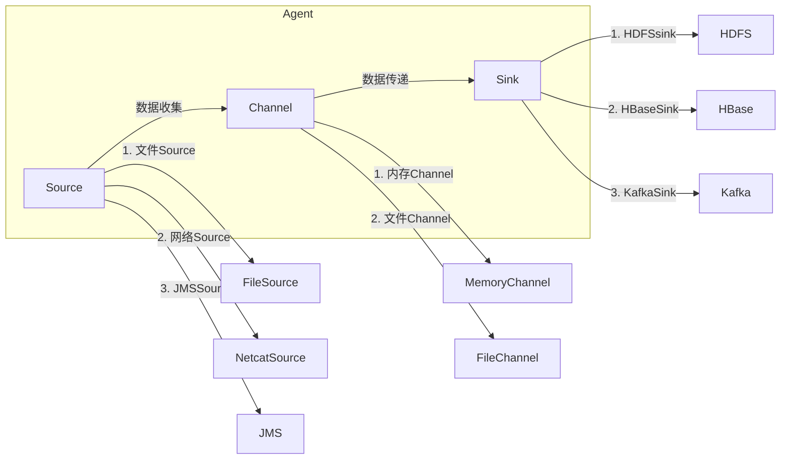

# Flume原理与代码实例讲解

> 关键词：Flume，数据采集，分布式系统，Hadoop，数据流，数据集成，消息队列

## 1. 背景介绍

随着互联网和大数据技术的飞速发展，企业对于数据采集和整合的需求日益增长。数据采集作为大数据生态系统中的基础环节，负责从各种来源收集原始数据，并将其传输到后续的数据处理和分析平台。Apache Flume是一个开源的分布式系统，用于高效可靠地在多个数据源之间移动数据，广泛应用于日志采集、系统监控、实时分析等场景。

本文将深入探讨Flume的原理，并通过代码实例讲解其具体应用。

## 2. 核心概念与联系

### 2.1 Flume的核心概念

Flume的核心概念包括：

- **Agent**: Flume的工作单元，包含Source、Channel和Sink等组件。
- **Source**: 负责从数据源（如文件、网络、JMS等）收集数据。
- **Channel**: 作为数据缓冲区，在Source和Sink之间传递数据。
- **Sink**: 负责将数据发送到目标系统（如HDFS、HBase、Kafka等）。

### 2.2 Flume架构的Mermaid流程图



### 2.3 Flume与其他组件的联系

Flume通常与Hadoop生态系统中的其他组件配合使用，例如：

- **HDFS**: 用于存储大量数据。
- **HBase**: 用于存储大规模结构化数据。
- **Kafka**: 用于构建高吞吐量的数据流处理平台。
- **Spark**: 用于实时数据分析和处理。

## 3. 核心算法原理 & 具体操作步骤

### 3.1 算法原理概述

Flume的工作原理可以概括为：

1. 数据从Source组件被收集到Channel。
2. 当Channel中的数据达到一定量或者达到指定的时间间隔时，数据被传递到Sink。
3. Sink将数据发送到目标系统。

### 3.2 算法步骤详解

1. **启动Flume Agent**：配置好Flume Agent，包括Source、Channel和Sink。
2. **数据采集**：Source从数据源采集数据。
3. **数据存储**：数据存储在Channel中。
4. **数据传输**：Channel将数据传递到Sink。
5. **数据存储/处理**：Sink将数据发送到目标系统。

### 3.3 算法优缺点

**优点**：

- **高可靠性**：Flume提供了数据传输的可靠保证。
- **易用性**：Flume的配置较为简单，易于上手。
- **灵活性**：Flume支持多种数据源和目标系统。

**缺点**：

- **数据处理的灵活性有限**：Flume主要用于数据采集和传输，对于数据处理的灵活性有限。
- **资源消耗较大**：Flume需要消耗一定的系统资源。

### 3.4 算法应用领域

Flume广泛应用于以下领域：

- **日志采集**：从服务器、应用程序等收集日志数据。
- **系统监控**：实时监控系统性能数据。
- **实时分析**：实时分析数据，如股票市场数据、社交网络数据等。

## 4. 数学模型和公式 & 详细讲解 & 举例说明

### 4.1 数学模型构建

Flume的数学模型可以看作是一个数据流模型。数据流模型通常包括以下元素：

- **数据流**：表示数据的流动过程。
- **数据元素**：表示数据流中的单个数据点。
- **数据源**：表示数据流的起点。
- **数据处理单元**：表示对数据进行处理的单元。

### 4.2 公式推导过程

Flume的数据流模型可以表示为以下公式：

$$
D = S + P_1 + P_2 + \cdots + P_n
$$

其中，$D$ 表示最终的数据流，$S$ 表示数据源，$P_i$ 表示第 $i$ 个数据处理单元。

### 4.3 案例分析与讲解

以下是一个Flume的简单示例：

- 数据源：一个文件，包含日志数据。
- 数据处理单元：将日志数据解析为JSON格式。
- 目标系统：HDFS，用于存储解析后的日志数据。

配置文件如下：

```xml
<configuration>
  <agent>
    <name>log_collector</name>
    <sources>
      <source>
        <type>exec</type>
        <command>cat /var/log/syslog</command>
        <channels>
          <channel>
            <type>memory</type>
            <capacity>10000</capacity>
            <transactionCapacity>1000</transactionCapacity>
          </channel>
        </channels>
      </source>
    </sources>
    <sinks>
      <sink>
        <type>hdfs</type>
        <channel>channel1</channel>
        <hdfsConfig>
          <writeFormat>json</writeFormat>
          <filePrefix>/logs/syslog/</filePrefix>
          <fileSuffix>.json</fileSuffix>
          <fileType>SequenceFile</fileType>
          <罗拉</罗拉>
          <罗拉>
          </罗拉>
        </hdfsConfig>
      </sink>
    </sinks>
    <channels>
      <channel>
        <type>memory</type>
        <name>channel1</name>
        <capacity>10000</capacity>
        <transactionCapacity>1000</transactionCapacity>
      </channel>
    </channels>
  </agent>
</configuration>
```

在这个例子中，Flume从日志文件中采集数据，将其解析为JSON格式，并存储到HDFS中。

## 5. 项目实践：代码实例和详细解释说明

### 5.1 开发环境搭建

1. 安装Java环境。
2. 下载Flume安装包。
3. 解压安装包并配置环境变量。

### 5.2 源代码详细实现

以下是一个简单的Flume Agent配置示例：

```xml
<configuration>
  <agent>
    <name>log_agent</name>
    <sources>
      <source>
        <type>exec</type>
        <command>tail -F /var/log/syslog</command>
        <channels>
          <channel>
            <type>memory</type>
            <name>channel1</name>
            <capacity>10000</capacity>
            <transactionCapacity>1000</transactionCapacity>
          </channel>
        </channels>
      </source>
    </sources>
    <sinks>
      <sink>
        <type>logger</type>
        <channel>channel1</channel>
      </sink>
    </sinks>
    <channels>
      <channel>
        <type>memory</type>
        <name>channel1</name>
        <capacity>10000</capacity>
        <transactionCapacity>1000</transactionCapacity>
      </channel>
    </channels>
  </agent>
</configuration>
```

在这个示例中，Flume从日志文件中采集数据，并将其输出到控制台。

### 5.3 代码解读与分析

- `agent`：定义了Flume Agent的名称。
- `sources`：定义了数据源和对应的Channel。
- `channels`：定义了Channel的配置。
- `sinks`：定义了数据的目标系统。

### 5.4 运行结果展示

启动Flume Agent后，可以从控制台看到日志数据的实时输出。

## 6. 实际应用场景

### 6.1 日志采集

Flume可以用于采集各种日志数据，如服务器日志、应用程序日志等。

### 6.2 系统监控

Flume可以用于实时监控系统性能数据，如CPU使用率、内存使用率等。

### 6.3 实时分析

Flume可以用于实时分析数据，如股票市场数据、社交网络数据等。

## 7. 工具和资源推荐

### 7.1 学习资源推荐

- Apache Flume官方文档：[https://flume.apache.org/](https://flume.apache.org/)
- Flume教程：[https://www.cnblogs.com/sunyang199904/p/9558026.html](https://www.cnblogs.com/sunyang199904/p/9558026.html)

### 7.2 开发工具推荐

- IntelliJ IDEA：一款功能强大的Java集成开发环境。
- Eclipse：一款开源的Java集成开发环境。

### 7.3 相关论文推荐

- Flume: A Distributed Data Collection Service for Hadoop [https://www.usenix.org/system/files/conference/hadoopme13/hadoop13-papers/hadoop13-final108.pdf](https://www.usenix.org/system/files/conference/hadoopme13/hadoop13-papers/hadoop13-final108.pdf)

## 8. 总结：未来发展趋势与挑战

### 8.1 研究成果总结

本文对Flume的原理和代码实例进行了详细的讲解，介绍了Flume的应用场景和发展趋势。

### 8.2 未来发展趋势

- Flume将会与更多的数据源和目标系统集成。
- Flume将会支持更多的数据处理功能，如数据清洗、数据转换等。
- Flume将会更加高效和易于使用。

### 8.3 面临的挑战

- Flume需要更好地支持实时数据处理。
- Flume需要更好地支持多租户环境。
- Flume需要更好地支持分布式存储系统。

### 8.4 研究展望

Flume作为一种强大的数据采集工具，将在未来数据采集领域发挥越来越重要的作用。随着技术的不断进步，Flume将会变得更加完善和易用。

## 9. 附录：常见问题与解答

**Q1：Flume与Kafka有何区别？**

A: Flume和Kafka都是用于数据采集的工具，但它们的应用场景有所不同。Flume更适合于批处理场景，而Kafka更适合于实时处理场景。

**Q2：Flume如何处理大量数据？**

A: Flume可以通过并行处理、分布式部署等方式来处理大量数据。

**Q3：Flume如何与Hadoop集成？**

A: Flume可以通过HDFS作为数据目标系统与Hadoop集成。

**Q4：Flume如何保证数据传输的可靠性？**

A: Flume通过事务机制保证数据传输的可靠性。

作者：禅与计算机程序设计艺术 / Zen and the Art of Computer Programming