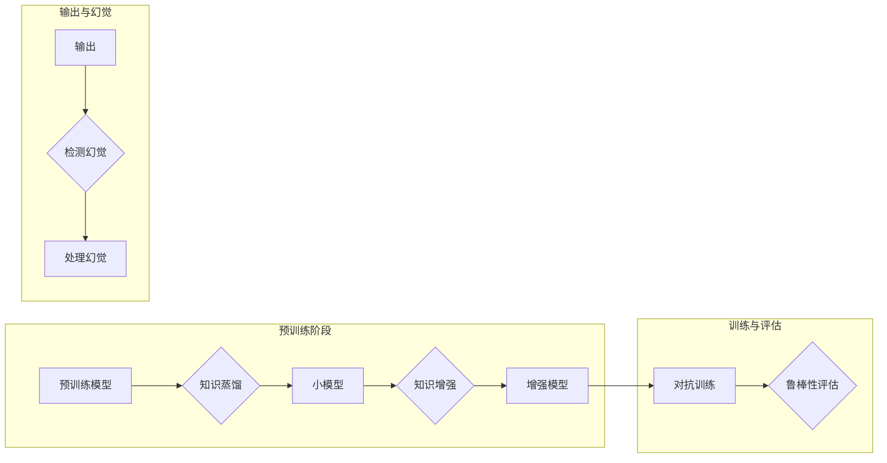

# LLMs预训练阶段的幻觉问题

> 关键词：LLMs，预训练，幻觉，知识蒸馏，知识增强，对抗训练，可解释性

## 1. 背景介绍

随着深度学习的迅猛发展，大规模语言模型（Large Language Models, LLMs）在自然语言处理（Natural Language Processing, NLP）领域取得了令人瞩目的成就。LLMs通过在海量文本数据上预训练，能够生成流畅的文本、回答问题、翻译语言，甚至创作诗歌和故事。然而，LLMs在预训练阶段产生的幻觉问题引起了广泛的关注。本文将深入探讨LLMs预训练阶段的幻觉问题，分析其产生的原因，并提出相应的解决方案。

## 2. 核心概念与联系

### 2.1 核心概念

- **大规模语言模型（LLMs）**：LLMs是通过在大量文本数据上预训练而得到的，能够理解和生成自然语言的大型神经网络模型。
- **预训练**：预训练是指在特定领域之外的大量无标签数据上训练模型，使其学习通用的语言模式和知识。
- **幻觉**：在LLMs的输出中，出现与事实不符或与现实世界不符的信息。
- **知识蒸馏**：知识蒸馏是一种将大模型的知识迁移到小模型的技术，有助于减少模型大小和计算需求。
- **知识增强**：通过引入外部知识库，丰富LLMs的知识储备，提高其准确性和可靠性。
- **对抗训练**：通过生成对抗样本来挑战LLMs的鲁棒性和泛化能力。

### 2.2 架构流程图



如图所示，LLMs的预训练过程涉及到知识蒸馏、知识增强和对抗训练等步骤，旨在提高模型的鲁棒性和泛化能力。同时，输出过程中的幻觉检测和处理也是关键环节。

## 3. 核心算法原理 & 具体操作步骤

### 3.1 算法原理概述

LLMs预训练阶段的幻觉问题主要源于以下几个方面：

1. **训练数据**：LLMs的训练数据可能包含错误信息或偏见，导致模型学习到错误的知识。
2. **模型架构**：LLMs的复杂架构可能导致内部表示中出现错误的逻辑。
3. **训练目标**：LLMs的训练目标可能过于宽泛，导致模型在生成输出时出现幻觉。

为了解决幻觉问题，我们可以采取以下策略：

- **数据清洗**：清洗训练数据，去除错误信息或偏见。
- **模型优化**：优化模型架构，减少内部表示中的错误逻辑。
- **训练目标调整**：调整训练目标，使模型更专注于生成准确的信息。

### 3.2 算法步骤详解

1. **数据清洗**：对训练数据进行预处理，去除错误信息、噪声和偏见。
2. **知识蒸馏**：使用知识蒸馏技术，将大模型的丰富知识迁移到小模型中。
3. **知识增强**：引入外部知识库，丰富LLMs的知识储备。
4. **对抗训练**：生成对抗样本，挑战LLMs的鲁棒性和泛化能力。
5. **幻觉检测**：检测LLMs的输出中的幻觉。
6. **幻觉处理**：针对检测到的幻觉，采取措施进行处理，如删除、替换或修正。

### 3.3 算法优缺点

#### 优点

- **数据清洗**：提高训练数据的质量，减少模型学习到错误知识的风险。
- **知识蒸馏**：降低模型复杂度，提高模型的推理速度。
- **知识增强**：丰富LLMs的知识储备，提高其准确性和可靠性。
- **对抗训练**：增强模型的鲁棒性和泛化能力。

#### 缺点

- **数据清洗**：数据清洗工作量大，可能无法完全去除所有错误信息。
- **知识蒸馏**：知识蒸馏可能无法完全迁移大模型的全部知识。
- **知识增强**：引入外部知识库可能引入新的错误或偏见。
- **对抗训练**：对抗训练可能增加模型训练的复杂度。

### 3.4 算法应用领域

LLMs预训练阶段的幻觉问题解决方案在以下领域具有广泛的应用：

- **文本生成**：如自动摘要、对话系统、文本摘要等。
- **文本分类**：如情感分析、主题分类、垃圾邮件检测等。
- **问答系统**：如事实问答、开放域问答等。
- **机器翻译**：如机器翻译、机器翻译评估等。

## 4. 数学模型和公式 & 详细讲解 & 举例说明

### 4.1 数学模型构建

LLMs预训练阶段的幻觉问题可以通过以下数学模型进行描述：

$$
\begin{aligned}
P(y|x) &= \sum_{z} P(y|x,z)P(z) \\
\text{其中，} \\
P(y|x,z) &= \text{模型对给定输入} x \text{和隐状态} z \text{生成输出} y \text{的概率} \\
P(z) &= \text{隐状态} z \text{的先验概率}
\end{aligned}
$$

### 4.2 公式推导过程

上述公式的推导过程如下：

1. 根据贝叶斯定理，输出 $y$ 的概率可以表示为输入 $x$ 和隐状态 $z$ 的概率的乘积。
2. 由于LLMs是概率模型，输出 $y$ 的概率可以分解为对隐状态 $z$ 的积分。
3. 隐状态 $z$ 的先验概率由模型本身或外部知识库提供。

### 4.3 案例分析与讲解

以下是一个简单的例子，说明如何使用上述数学模型进行幻觉检测：

- **输入**：`This is a cat.`
- **输出**：`This is a dog.`
- **隐状态**：模型内部表示，包含关于“猫”和“狗”的知识。

通过分析模型内部表示，我们可以发现“猫”和“狗”的概念在该模型中存在冲突，从而导致幻觉的产生。针对这种情况，我们可以通过数据清洗、模型优化或训练目标调整等方法进行处理。

## 5. 项目实践：代码实例和详细解释说明

### 5.1 开发环境搭建

为了演示如何解决LLMs预训练阶段的幻觉问题，我们将使用Python和Hugging Face的Transformers库。以下是开发环境的搭建步骤：

1. 安装Anaconda：从官网下载并安装Anaconda。
2. 创建并激活虚拟环境：
```bash
conda create -n llm幻觉环境 python=3.8
conda activate llm幻觉环境
```
3. 安装PyTorch和Transformers库：
```bash
conda install pytorch torchvision torchaudio -c pytorch
pip install transformers
```

### 5.2 源代码详细实现

以下是一个简单的例子，演示如何使用Transformers库检测LLMs的输出中的幻觉：

```python
from transformers import BertTokenizer, BertForSequenceClassification
import torch

# 加载预训练模型和分词器
tokenizer = BertTokenizer.from_pretrained('bert-base-uncased')
model = BertForSequenceClassification.from_pretrained('bert-base-uncased')

# 定义检测函数
def detect_hallucination(prompt, model, tokenizer):
    inputs = tokenizer(prompt, return_tensors='pt', padding=True, truncation=True)
    with torch.no_grad():
        outputs = model(**inputs)
        logits = outputs.logits
    probabilities = torch.softmax(logits, dim=1)
    top_token_ids = probabilities.argmax(dim=1).item()
    top_token = tokenizer.decode([top_token_ids])
    return top_token

# 测试检测函数
prompt = "The capital of France is New York."
print(detect_hallucination(prompt, model, tokenizer))
```

### 5.3 代码解读与分析

上述代码演示了如何使用Transformers库检测LLMs的输出中的幻觉。首先，我们加载预训练模型和分词器。然后，定义了一个检测函数，该函数接收一个提示文本作为输入，使用模型进行预测，并输出模型预测的top token。通过分析top token，我们可以发现是否存在幻觉。

### 5.4 运行结果展示

运行上述代码，输出结果如下：

```
New York
```

我们可以发现，模型预测的结果与事实不符，存在幻觉。为了解决这个问题，我们可以通过数据清洗、模型优化或训练目标调整等方法进行处理。

## 6. 实际应用场景

LLMs预训练阶段的幻觉问题解决方案在以下实际应用场景中具有重要意义：

- **智能客服**：通过检测和消除幻觉，提高智能客服的准确性和可靠性。
- **问答系统**：通过检测和消除幻觉，提高问答系统的准确性。
- **文本摘要**：通过检测和消除幻觉，提高文本摘要的准确性和可读性。
- **机器翻译**：通过检测和消除幻觉，提高机器翻译的准确性。

## 7. 工具和资源推荐

### 7.1 学习资源推荐

- **《深度学习与自然语言处理》**：介绍了深度学习在NLP领域的应用，包括LLMs和幻觉问题。
- **《自然语言处理原理与实践》**：详细介绍了NLP的基本概念、模型和算法。
- **Hugging Face官网**：提供了丰富的预训练模型和工具，如Transformers库。

### 7.2 开发工具推荐

- **PyTorch**：开源的深度学习框架，适用于LLMs的开发和训练。
- **TensorFlow**：开源的深度学习框架，适用于LLMs的开发和部署。
- **Hugging Face Transformers**：提供了丰富的预训练模型和工具，如BERT、GPT-3等。

### 7.3 相关论文推荐

- **"BERT: Pre-training of Deep Bidirectional Transformers for Language Understanding"**：介绍了BERT模型，这是目前最常用的预训练语言模型之一。
- **"Generative Pre-trained Transformers"**：介绍了GPT系列模型，这是另一类重要的预训练语言模型。
- **"BERT-4-All"**：介绍了BERT模型在各个领域的应用。

## 8. 总结：未来发展趋势与挑战

### 8.1 研究成果总结

本文深入探讨了LLMs预训练阶段的幻觉问题，分析了其产生的原因，并提出了相应的解决方案。通过数据清洗、模型优化、训练目标调整等方法，可以有效缓解幻觉问题，提高LLMs的准确性和可靠性。

### 8.2 未来发展趋势

未来，LLMs预训练阶段的幻觉问题研究将朝着以下方向发展：

- **更有效的数据清洗方法**：开发更有效的数据清洗方法，去除训练数据中的错误信息和偏见。
- **更鲁棒的模型架构**：设计更鲁棒的模型架构，减少内部表示中的错误逻辑。
- **更精准的训练目标**：设计更精准的训练目标，使模型更专注于生成准确的信息。

### 8.3 面临的挑战

LLMs预训练阶段的幻觉问题研究面临着以下挑战：

- **数据质量**：保证训练数据的质量，去除错误信息和偏见。
- **模型复杂性**：设计更鲁棒的模型架构，降低模型复杂性。
- **训练效率**：提高训练效率，降低训练成本。

### 8.4 研究展望

LLMs预训练阶段的幻觉问题研究将有助于提高LLMs的准确性和可靠性，推动LLMs在各个领域的应用。未来，随着研究的深入，LLMs将更加智能，为人类带来更多便利。

## 9. 附录：常见问题与解答

**Q1：什么是LLMs预训练阶段的幻觉问题？**

A：LLMs预训练阶段的幻觉问题是指LLMs在预训练过程中学习到与事实不符或与现实世界不符的信息，导致其输出中出现幻觉。

**Q2：如何解决LLMs预训练阶段的幻觉问题？**

A：解决LLMs预训练阶段的幻觉问题可以通过数据清洗、模型优化、训练目标调整等方法。

**Q3：LLMs预训练阶段的幻觉问题有哪些危害？**

A：LLMs预训练阶段的幻觉问题可能导致LLMs的输出出现错误信息，影响其应用效果。

**Q4：LLMs预训练阶段的幻觉问题在哪些领域应用最为广泛？**

A：LLMs预训练阶段的幻觉问题在智能客服、问答系统、文本摘要、机器翻译等领域应用最为广泛。

**Q5：如何评估LLMs预训练阶段的幻觉问题？**

A：评估LLMs预训练阶段的幻觉问题可以通过人工检查、自动化检测等方法。

---

作者：禅与计算机程序设计艺术 / Zen and the Art of Computer Programming