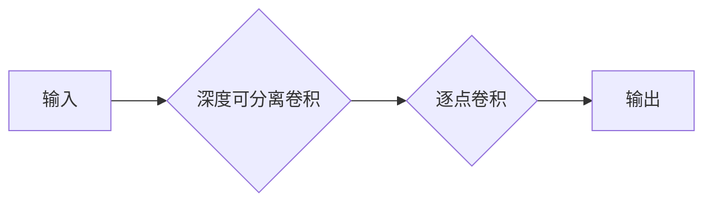

# MobileNet原理与代码实例讲解

> 关键词：MobileNet,深度学习,卷积神经网络,CNN,轻量级模型,神经网络架构,移动端应用

## 1. 背景介绍

随着深度学习在计算机视觉领域的广泛应用，深度学习模型在图像分类、目标检测、图像分割等任务上取得了显著的成果。然而，随着模型层数和参数量的增加，深度学习模型在计算复杂度和内存消耗上也越来越高，这使得在资源受限的移动设备和嵌入式系统中部署深度学习模型变得困难。为了解决这一问题，Google在2017年提出了MobileNet，这是一种专门为移动设备和嵌入式系统设计的轻量级卷积神经网络。

## 2. 核心概念与联系

### 2.1 核心概念

**MobileNet**：MobileNet是一种轻量级卷积神经网络，它通过深度可分离卷积（Depthwise Separable Convolution）和逐点卷积（Pointwise Convolution）来减少模型参数和计算量，从而实现低计算复杂度和低能耗。

**深度可分离卷积**：深度可分离卷积将传统的卷积操作分解为深度卷积和逐点卷积两个步骤，分别处理输入通道和输出通道，从而显著降低模型参数和计算量。

**逐点卷积**：逐点卷积是一种将所有输入通道与所有输出通道进行连接的卷积操作，它通过改变卷积核的形状来调整输出通道的数量。

### 2.2 架构 Mermaid 流程图



在上面的流程图中，A表示输入数据，D表示输出数据。B和C分别代表深度可分离卷积和逐点卷积的两个步骤。

## 3. 核心算法原理 & 具体操作步骤

### 3.1 算法原理概述

MobileNet的核心思想是通过使用深度可分离卷积来减少模型参数和计算量。深度可分离卷积将一个标准的卷积操作分解为两个步骤：

1. **深度卷积**：对输入数据的每个通道进行卷积操作，得到一组特征图。
2. **逐点卷积**：将深度卷积得到的特征图与一组可学习的权重进行逐点卷积，得到最终的输出。

这种分解操作可以显著减少模型参数数量，从而降低模型的计算量和内存消耗。

### 3.2 算法步骤详解

1. **输入层**：输入层将原始图像数据输入到模型中。
2. **深度可分离卷积层**：对输入数据应用深度可分离卷积，得到一组特征图。
3. **逐点卷积层**：对深度卷积得到的特征图应用逐点卷积，得到最终的特征图。
4. **激活层**：对特征图应用ReLU激活函数。
5. **全局平均池化层**：对特征图进行全局平均池化，得到固定大小的特征向量。
6. **全连接层**：对特征向量应用全连接层，得到最终的输出。

### 3.3 算法优缺点

**优点**：

- **参数和计算量小**：MobileNet通过使用深度可分离卷积和逐点卷积，显著减少了模型参数和计算量，使得模型在移动设备和嵌入式系统中更容易部署。
- **速度快**：MobileNet的速度比传统的卷积神经网络快，因为它具有更少的参数和计算量。
- **精度高**：尽管是轻量级模型，MobileNet在图像分类、目标检测等任务上仍然保持了较高的精度。

**缺点**：

- **可解释性差**：由于MobileNet的结构相对复杂，其工作原理可能不如传统的卷积神经网络直观。
- **对特定任务可能不适用**：对于一些需要高分辨率特征的任务，MobileNet可能不如传统的卷积神经网络。

### 3.4 算法应用领域

MobileNet在以下领域具有广泛的应用：

- **移动设备和嵌入式系统**：由于MobileNet的轻量级特性，它非常适合在移动设备和嵌入式系统中部署。
- **实时视频处理**：MobileNet可以用于实时视频处理，如视频监控、自动驾驶等。
- **图像识别**：MobileNet可以用于图像识别任务，如物体识别、场景识别等。

## 4. 数学模型和公式 & 详细讲解 & 举例说明

### 4.1 数学模型构建

MobileNet的数学模型可以表示为：

$$
y = f(\mathcal{F}(x))
$$

其中，$x$ 是输入图像，$\mathcal{F}$ 是MobileNet的前向传播过程，$y$ 是模型的输出。

### 4.2 公式推导过程

MobileNet的前向传播过程可以表示为：

$$
\mathcal{F}(x) = \text{DepthwiseConv}(x) \cdot \text{PointwiseConv}(x) \cdot \text{ReLU}(\cdot) \cdot \text{GlobalAvgPool}(x) \cdot \text{FC}(x)
$$

其中，DepthwiseConv、PointwiseConv、ReLU、GlobalAvgPool 和 FC 分别代表深度卷积、逐点卷积、ReLU激活函数、全局平均池化和全连接层。

### 4.3 案例分析与讲解

以MobileNet V1为例，其结构如下：

1. **输入层**：输入分辨率为224x224的图像。
2. **第一个深度可分离卷积层**：3x3深度卷积，步长为2，输出通道数为32。
3. **第一个逐点卷积层**：1x1卷积，输出通道数为64。
4. **ReLU激活层**：应用ReLU激活函数。
5. **第二个深度可分离卷积层**：3x3深度卷积，步长为2，输出通道数为128。
6. **第二个逐点卷积层**：1x1卷积，输出通道数为256。
7. **第三个深度可分离卷积层**：3x3深度卷积，步长为2，输出通道数为512。
8. **第四个逐点卷积层**：1x1卷积，输出通道数为1024。
9. **全局平均池化层**：全局平均池化。
10. **全连接层**：1024个单元，对应1000个类别。

## 5. 项目实践：代码实例和详细解释说明

### 5.1 开发环境搭建

为了实现MobileNet，我们需要以下开发环境：

- Python 3.6及以上版本
- PyTorch 1.5及以上版本
- torchvision库

### 5.2 源代码详细实现

以下是一个简单的MobileNet V1实现示例：

```python
import torch
import torch.nn as nn

class MobileNetV1(nn.Module):
    def __init__(self, num_classes=1000):
        super(MobileNetV1, self).__init__()
        self.conv1 = nn.Conv2d(3, 32, kernel_size=3, stride=2, padding=1)
        self.bn1 = nn.BatchNorm2d(32)
        self.relu = nn.ReLU(inplace=True)
        self.conv2 = nn.Conv2d(32, 64, kernel_size=3, stride=2, padding=1)
        self.bn2 = nn.BatchNorm2d(64)
        self.conv3 = nn.Conv2d(64, 128, kernel_size=3, stride=2, padding=1)
        self.bn3 = nn.BatchNorm2d(128)
        self.conv4 = nn.Conv2d(128, 256, kernel_size=3, stride=2, padding=1)
        self.bn4 = nn.BatchNorm2d(256)
        self.conv5 = nn.Conv2d(256, 512, kernel_size=3, stride=2, padding=1)
        self.bn5 = nn.BatchNorm2d(512)
        self.conv6 = nn.Conv2d(512, 1024, kernel_size=3, stride=2, padding=1)
        self.bn6 = nn.BatchNorm2d(1024)
        self.fc = nn.Linear(1024, num_classes)

    def forward(self, x):
        x = self.conv1(x)
        x = self.bn1(x)
        x = self.relu(x)
        x = self.conv2(x)
        x = self.bn2(x)
        x = self.relu(x)
        x = self.conv3(x)
        x = self.bn3(x)
        x = self.relu(x)
        x = self.conv4(x)
        x = self.bn4(x)
        x = self.relu(x)
        x = self.conv5(x)
        x = self.bn5(x)
        x = self.relu(x)
        x = self.conv6(x)
        x = self.bn6(x)
        x = self.relu(x)
        x = x.view(x.size(0), -1)
        x = self.fc(x)
        return x
```

### 5.3 代码解读与分析

在上面的代码中，我们定义了一个MobileNet V1模型。模型由多个卷积层、批归一化层、ReLU激活函数、全局平均池化和全连接层组成。

### 5.4 运行结果展示

要运行上述代码，我们需要准备一个包含图像和标签的数据集。以下是一个简单的训练示例：

```python
import torch.optim as optim
from torchvision import datasets, transforms

# 加载数据集
transform = transforms.Compose([
    transforms.Resize((224, 224)),
    transforms.ToTensor()
])

train_dataset = datasets.CIFAR10(root='./data', train=True, download=True, transform=transform)
train_loader = torch.utils.data.DataLoader(train_dataset, batch_size=64, shuffle=True)

# 初始化模型和优化器
model = MobileNetV1()
criterion = nn.CrossEntropyLoss()
optimizer = optim.Adam(model.parameters(), lr=0.001)

# 训练模型
for epoch in range(10):
    running_loss = 0.0
    for i, data in enumerate(train_loader, 0):
        inputs, labels = data
        optimizer.zero_grad()
        outputs = model(inputs)
        loss = criterion(outputs, labels)
        loss.backward()
        optimizer.step()
        running_loss += loss.item()
        if i % 2000 == 1999:
            print(f'[{epoch + 1}, {i + 1:5d}] loss: {running_loss / 2000:.3f}')
            running_loss = 0.0
print('Finished Training')

# 保存模型
torch.save(model.state_dict(), './mobilenet_v1.pth')
```

在上述代码中，我们首先加载数据集，并定义了数据预处理和转换。然后，我们初始化模型、损失函数和优化器。接下来，我们对模型进行训练，并在每个epoch结束时打印损失值。最后，我们保存了训练好的模型。

## 6. 实际应用场景

MobileNet在以下场景中具有广泛的应用：

- **移动应用**：MobileNet可以用于移动应用中的图像识别、物体检测和图像分割等任务。
- **嵌入式设备**：MobileNet可以用于嵌入式设备中的图像识别和视频分析等任务。
- **自动驾驶**：MobileNet可以用于自动驾驶中的障碍物检测和场景理解等任务。

## 7. 工具和资源推荐

### 7.1 学习资源推荐

- 《MobileNet: Efficient Convolutional Neural Networks for Mobile Vision Applications》
- 《Deep Learning with PyTorch》
- 《MobileNetV2: Inverted Residuals and Linear Bottlenecks》

### 7.2 开发工具推荐

- PyTorch
- TensorFlow
- Keras

### 7.3 相关论文推荐

- MobileNets: Efficient Convolutional Neural Networks for Mobile Vision Applications
- MobileNetV2: Inverted Residuals and Linear Bottlenecks

## 8. 总结：未来发展趋势与挑战

### 8.1 研究成果总结

MobileNet作为一种轻量级卷积神经网络，在移动设备和嵌入式系统中得到了广泛的应用。它通过使用深度可分离卷积和逐点卷积，显著降低了模型的参数和计算量，从而实现了低计算复杂度和低能耗。

### 8.2 未来发展趋势

- **更轻量级的模型**：随着深度学习技术的不断发展，未来可能会出现更轻量级的模型，以满足更加资源受限的设备。
- **更高效的算法**：为了进一步提高MobileNet的效率，未来可能会出现更加高效的算法，如量化、剪枝等。
- **更广泛的应用场景**：MobileNet的应用场景将会更加广泛，如视频分析、语音识别等。

### 8.3 面临的挑战

- **模型可解释性**：MobileNet作为一种深度学习模型，其工作原理可能不如传统的卷积神经网络直观，这使得模型的解释性成为一个挑战。
- **模型泛化能力**：MobileNet的泛化能力可能受到其轻量级特性的限制，这对于一些需要高分辨率特征的任务来说可能是一个挑战。

### 8.4 研究展望

MobileNet作为一种轻量级卷积神经网络，在移动设备和嵌入式系统中具有广阔的应用前景。随着深度学习技术的不断发展，相信MobileNet将会在更多领域得到应用，为构建更加智能化的系统做出贡献。

## 9. 附录：常见问题与解答

**Q1：什么是深度可分离卷积？**

A：深度可分离卷积是一种将传统的卷积操作分解为深度卷积和逐点卷积两个步骤的卷积操作。深度卷积对输入数据的每个通道进行卷积操作，得到一组特征图。逐点卷积将深度卷积得到的特征图与一组可学习的权重进行逐点卷积，得到最终的输出。

**Q2：MobileNet适用于哪些任务？**

A：MobileNet适用于需要低计算复杂度和低能耗的任务，如图像识别、物体检测和图像分割等。

**Q3：如何训练MobileNet模型？**

A：训练MobileNet模型需要准备一个包含图像和标签的数据集。然后，可以使用PyTorch等深度学习框架来训练模型。

**Q4：MobileNet的优缺点是什么？**

A：MobileNet的优点是参数和计算量小，速度快，精度高。其缺点是可解释性差，对特定任务可能不适用。

**Q5：MobileNet的未来发展趋势是什么？**

A：MobileNet的未来发展趋势是更轻量级的模型、更高效的算法和更广泛的应用场景。

作者：禅与计算机程序设计艺术 / Zen and the Art of Computer Programming