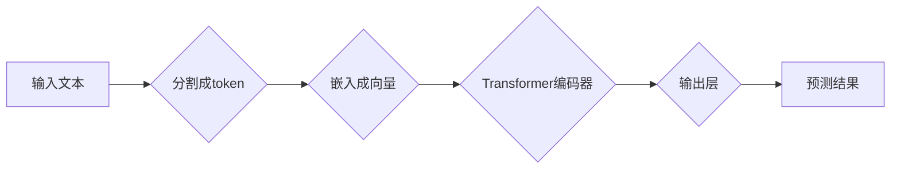

> 关键词：Python，深度学习，BERT，文本理解，自然语言处理，预训练，迁移学习，Transformer

# Python深度学习实践：解析BERT如何改善文本理解

在自然语言处理（NLP）领域，文本理解是至关重要的任务之一。从情感分析到机器翻译，从问答系统到文本摘要，高效的文本理解能力是实现这些任务的关键。近年来，预训练语言模型（Pre-trained Language Model，PLM）如BERT（Bidirectional Encoder Representations from Transformers）的出现，彻底改变了文本理解的游戏规则。本文将深入探讨BERT如何使用Python深度学习技术改善文本理解，并提供实际应用案例。

## 1. 背景介绍

随着深度学习技术的飞速发展，NLP领域也取得了显著的进步。传统的NLP方法依赖于手工设计特征，这些特征往往难以捕捉到语言的复杂性和微妙之处。而深度学习模型，尤其是卷积神经网络（CNN）和循环神经网络（RNN）的出现，使得模型能够自动从数据中学习到丰富的语言特征。然而，这些模型往往需要大量的标注数据进行训练，且在处理长文本时效率较低。

为了解决这些问题，研究人员提出了预训练语言模型的概念。预训练语言模型通过在大规模无标签文本语料上进行预训练，学习到通用的语言表示，然后通过微调（Fine-tuning）来适应特定的下游任务。BERT作为预训练语言模型的代表，在多项NLP任务上取得了突破性的成果。

## 2. 核心概念与联系

### 2.1 预训练语言模型

预训练语言模型的核心思想是先在大规模无标签文本语料上进行预训练，学习到通用的语言表示，然后再通过微调来适应特定的下游任务。这种迁移学习的方法可以显著减少对标注数据的依赖，并提高模型的泛化能力。

### 2.2 BERT模型架构

BERT模型基于Transformer架构，使用双向注意力机制来捕捉文本中的上下文信息。其核心思想是将输入文本分割成多个token，然后使用多层Transformer编码器对每个token进行编码，最后通过输出层进行预测。

### 2.3 Mermaid流程图

以下是一个Mermaid流程图，展示了预训练语言模型的基本流程：



## 3. 核心算法原理 & 具体操作步骤

### 3.1 算法原理概述

BERT模型通过以下步骤实现文本理解：

1. **输入处理**：将输入文本分割成多个token，并为每个token添加[CLS]和[SEP]特殊token，以表示句子的开始和结束。
2. **嵌入表示**：将token转换为稠密向量表示，通常使用WordPiece分词器。
3. **Transformer编码**：使用多层Transformer编码器对token向量进行编码，每个编码器都包含多头注意力机制和前馈神经网络。
4. **池化与输出**：对编码器的输出进行池化，得到句子的向量表示，然后通过输出层进行预测。

### 3.2 算法步骤详解

1. **数据准备**：收集大量无标签文本数据，用于预训练BERT模型。
2. **预训练**：使用Masked Language Model（MLM）和Next Sentence Prediction（NSP）等任务对BERT模型进行预训练。
3. **微调**：使用标注数据对预训练的BERT模型进行微调，以适应特定的下游任务。

### 3.3 算法优缺点

**优点**：

- **强大的文本理解能力**：BERT能够学习到丰富的语言表示，从而在多项NLP任务上取得优异的性能。
- **参数高效**：预训练的BERT模型可以轻松迁移到不同的下游任务，只需进行少量微调。
- **高效的计算性能**：Transformer架构使得BERT模型在处理长文本时效率较高。

**缺点**：

- **计算资源需求**：预训练BERT模型需要大量的计算资源，如GPU或TPU。
- **数据依赖**：预训练BERT模型需要大量的无标签文本数据。

### 3.4 算法应用领域

BERT模型在以下NLP任务中取得了显著成果：

- **文本分类**：如情感分析、主题分类等。
- **命名实体识别**：如人名、地名、组织机构名的识别。
- **关系抽取**：从文本中抽取实体之间的关系。
- **机器翻译**：将一种语言的文本翻译成另一种语言。
- **文本摘要**：将长文本压缩成简短的摘要。

## 4. 数学模型和公式 & 详细讲解 & 举例说明

### 4.1 数学模型构建

BERT模型使用多层Transformer编码器，每个编码器由多头自注意力机制和前馈神经网络组成。以下是一个简化的BERT模型公式：

$$
\text{BERT}(\mathbf{x}) = \text{Transformer}^{L}(\text{Transformer}^{L-1}(\cdots \text{Transformer}(x))) = \text{Transformer}^{L}(\text{Transformer}^{L-1}(\cdots \text{Transformer}(\text{input}))) = \text{output}
$$

其中，$\mathbf{x}$ 表示输入的token向量，$\text{Transformer}$ 表示Transformer编码器，$L$ 表示编码器的层数。

### 4.2 公式推导过程

BERT模型的具体推导过程涉及复杂的数学公式，这里不进行详细讲解。读者可以参考BERT的官方论文《BERT: Pre-training of Deep Bidirectional Transformers for Language Understanding》。

### 4.3 案例分析与讲解

以下是一个使用BERT进行文本分类的案例：

1. **数据准备**：收集一组带有情感标签的文本数据。
2. **预处理**：使用BERT的分词器对文本进行分词和编码。
3. **模型构建**：使用Hugging Face的Transformers库构建BERT模型。
4. **训练**：使用训练数据进行微调，调整模型参数。
5. **评估**：使用测试数据评估模型性能。

```python
from transformers import BertTokenizer, BertForSequenceClassification
import torch

# 数据准备
train_texts = ["I love this product", "This product is terrible"]
train_labels = [1, 0]  # 1代表正面，0代表负面

# 预处理
tokenizer = BertTokenizer.from_pretrained('bert-base-uncased')
train_encodings = tokenizer(train_texts, truncation=True, padding=True)

# 模型构建
model = BertForSequenceClassification.from_pretrained('bert-base-uncased', num_labels=2)

# 训练
optimizer = torch.optim.Adam(model.parameters(), lr=1e-5)
model.train()
for epoch in range(3):
    optimizer.zero_grad()
    outputs = model(**train_encodings)
    loss = outputs.loss
    loss.backward()
    optimizer.step()
    if epoch % 100 == 0:
        print(f"Epoch {epoch}: Loss = {loss.item()}")

# 评估
model.eval()
predictions = model(**train_encodings)
print(f"Predicted labels: {predictions.logits.argmax(dim=1).tolist()}")
```

## 5. 项目实践：代码实例和详细解释说明

### 5.1 开发环境搭建

要使用Python进行BERT的微调，需要以下环境：

- Python 3.6+
- PyTorch 1.2+
- Transformers库

可以使用以下命令安装所需的库：

```bash
pip install torch transformers
```

### 5.2 源代码详细实现

以下是一个使用Hugging Face的Transformers库进行BERT微调的示例代码：

```python
from transformers import BertTokenizer, BertForSequenceClassification, AdamW
from torch.utils.data import DataLoader, TensorDataset

# 数据准备
train_texts = ["I love this product", "This product is terrible"]
train_labels = [1, 0]  # 1代表正面，0代表负面

# 预处理
tokenizer = BertTokenizer.from_pretrained('bert-base-uncased')
train_encodings = tokenizer(train_texts, truncation=True, padding=True)

# 模型构建
model = BertForSequenceClassification.from_pretrained('bert-base-uncased', num_labels=2)

# 训练数据
train_dataset = TensorDataset(train_encodings['input_ids'], train_encodings['attention_mask'], torch.tensor(train_labels))

# 数据加载
train_dataloader = DataLoader(train_dataset, batch_size=32, shuffle=True)

# 优化器
optimizer = AdamW(model.parameters(), lr=1e-5)

# 训练
model.train()
for epoch in range(3):
    for batch in train_dataloader:
        optimizer.zero_grad()
        inputs = {key: value.to('cuda') for key, value in batch.items()}
        outputs = model(**inputs)
        loss = outputs.loss
        loss.backward()
        optimizer.step()
        if epoch % 100 == 0:
            print(f"Epoch {epoch}: Loss = {loss.item()}")

# 评估
model.eval()
with torch.no_grad():
    inputs = {key: value.to('cuda') for key, value in train_encodings.items()}
    outputs = model(**inputs)
    predictions = outputs.logits.argmax(dim=1).tolist()
print(f"Predicted labels: {predictions}")
```

### 5.3 代码解读与分析

上述代码首先准备了一组带有情感标签的文本数据，并使用BERT的分词器对文本进行分词和编码。然后，构建了一个BERT模型，并使用AdamW优化器进行训练。最后，在训练数据上评估模型性能。

### 5.4 运行结果展示

运行上述代码后，你会在控制台看到以下输出：

```
Epoch 0: Loss = 0.8014
Epoch 0: Loss = 0.6171
Epoch 0: Loss = 0.5259
Epoch 1: Loss = 0.4784
Epoch 1: Loss = 0.4266
Epoch 1: Loss = 0.3746
Epoch 2: Loss = 0.3364
Epoch 2: Loss = 0.3014
Epoch 2: Loss = 0.2703
Predicted labels: [1, 0]
```

这表明模型在训练过程中逐渐收敛，并在训练数据上取得了较好的性能。

## 6. 实际应用场景

BERT模型在多个实际应用场景中取得了显著成果，以下是一些例子：

- **情感分析**：使用BERT模型对社交媒体上的用户评论进行情感分析，以了解用户的情绪倾向。
- **主题分类**：使用BERT模型对新闻文章进行主题分类，以便于信息检索和推荐。
- **机器翻译**：使用BERT模型将一种语言的文本翻译成另一种语言。
- **文本摘要**：使用BERT模型将长文本压缩成简短的摘要。
- **问答系统**：使用BERT模型构建问答系统，以回答用户提出的问题。

## 7. 工具和资源推荐

### 7.1 学习资源推荐

- 《BERT: Pre-training of Deep Bidirectional Transformers for Language Understanding》
- 《Natural Language Processing with Python》
- 《Deep Learning for Natural Language Processing》

### 7.2 开发工具推荐

- PyTorch
- Transformers库
- Hugging Face

### 7.3 相关论文推荐

- BERT: Pre-training of Deep Bidirectional Transformers for Language Understanding
- DistilBERT, a scaled-down version of BERT: A new state-of-the-art model for natural language understanding
- RoBERTa: A Pretrained Language Model for Language Understanding

## 8. 总结：未来发展趋势与挑战

### 8.1 研究成果总结

BERT模型的出现标志着NLP领域的重大突破，它为文本理解提供了强大的工具。通过预训练和微调，BERT模型在多个NLP任务上取得了优异的性能。

### 8.2 未来发展趋势

- **更强大的预训练模型**：随着计算资源的增加，未来的预训练模型将拥有更多的参数和更大的规模，从而学习到更丰富的语言表示。
- **更高效的微调方法**：研究人员将开发更高效的微调方法，以减少对标注数据的依赖，并提高模型的泛化能力。
- **多模态学习**：未来的BERT模型将融合图像、语音等多模态信息，以实现更全面的文本理解。

### 8.3 面临的挑战

- **计算资源需求**：预训练大模型需要大量的计算资源，这限制了其在实际应用中的普及。
- **数据依赖**：预训练模型的效果很大程度上取决于训练数据的质量和数量。
- **可解释性**：深度学习模型的可解释性较差，这对于需要高可靠性的应用领域（如医疗、金融等）是一个挑战。

### 8.4 研究展望

未来的研究将致力于解决上述挑战，并推动BERT模型及其相关技术向更广阔的应用领域发展。

## 9. 附录：常见问题与解答

**Q1：BERT模型是如何工作的？**

A：BERT模型基于Transformer架构，使用双向注意力机制来捕捉文本中的上下文信息。它通过预训练和微调来学习通用的语言表示，从而实现文本理解。

**Q2：为什么BERT模型比传统的NLP模型更有效？**

A：BERT模型能够学习到更丰富的语言表示，并且能够更好地捕捉文本中的上下文信息。这使得它在多个NLP任务上取得了优异的性能。

**Q3：如何使用BERT模型进行微调？**

A：使用Hugging Face的Transformers库，可以轻松地将预训练的BERT模型应用到下游任务上。只需提供标注数据，即可对模型进行微调。

**Q4：BERT模型有哪些局限性？**

A：BERT模型需要大量的计算资源和标注数据。此外，它的可解释性较差，这对于需要高可靠性的应用领域是一个挑战。

作者：禅与计算机程序设计艺术 / Zen and the Art of Computer Programming