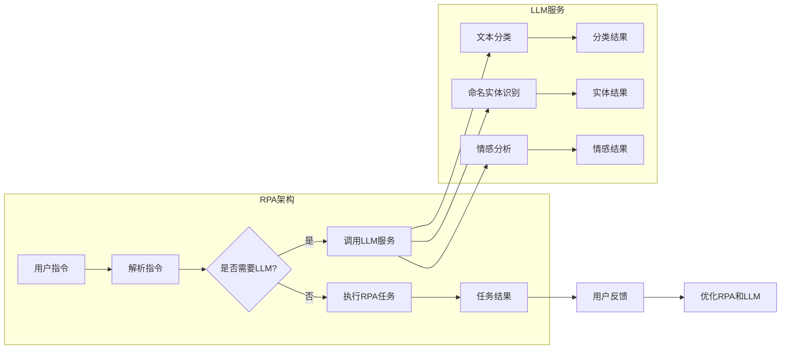

# RPA 与 LLM 的结合

> 关键词：RPA，机器人流程自动化，LLM，大型语言模型，AI，工作流程，自动化，人工智能，NLP

## 1. 背景介绍

随着人工智能技术的飞速发展，机器人流程自动化（RPA）和大型语言模型（LLM）已经成为企业数字化转型的重要工具。RPA通过模拟人类操作员的行为，自动化执行重复性的任务，提高工作效率和准确性。LLM则利用其强大的自然语言处理能力，理解和生成自然语言，为各种应用场景提供智能支持。本文将探讨RPA与LLM的结合，分析其原理、实践、应用和未来发展趋势。

### 1.1 RPA的兴起

RPA技术起源于20世纪90年代，最初主要用于财务、审计等领域，通过模拟操作员的键盘操作和鼠标点击来执行重复性任务。随着技术的不断发展，RPA的应用范围不断扩大，逐渐应用于人力资源、客户服务、供应链管理等各个领域。

### 1.2 LLM的崛起

近年来，随着深度学习技术的突破，LLM如BERT、GPT等在自然语言处理领域取得了巨大进展。LLM能够理解和生成自然语言，为各种应用场景提供智能支持，如机器翻译、文本摘要、问答系统等。

### 1.3 RPA与LLM结合的必要性

将RPA与LLM结合，能够实现以下目标：

- **提升自动化程度**：LLM能够帮助RPA自动化处理更复杂的任务，例如理解自然语言指令、处理语义模糊的输入等。
- **提高决策效率**：LLM能够帮助RPA进行更复杂的决策，例如基于自然语言信息进行风险评估、推荐等。
- **扩展应用场景**：RPA与LLM的结合，使得自动化应用不再局限于简单的重复性任务，而是能够处理更复杂的业务流程。

## 2. 核心概念与联系

### 2.1 RPA工作流程

RPA的工作流程通常包括以下几个步骤：

1. **识别流程**：分析现有流程，识别可自动化的环节。
2. **设计机器人**：根据识别的流程，设计RPA机器人，模拟操作员的操作。
3. **部署机器人**：将RPA机器人部署到目标环境中，开始自动化执行任务。
4. **监控与维护**：监控RPA机器人的运行状态，及时解决可能出现的问题。

### 2.2 LLM技术原理

LLM通常基于Transformer架构，通过预训练学习大量的语言知识，包括语法、语义、语境等。LLM的主要功能包括：

- **文本分类**：根据输入文本判断其所属类别。
- **命名实体识别**：识别文本中的实体，如人名、地名、机构名等。
- **情感分析**：分析文本的情感倾向，如正面、中性、负面等。
- **机器翻译**：将一种语言的文本翻译成另一种语言。
- **问答系统**：根据输入问题给出答案。

### 2.3 RPA与LLM结合的架构

RPA与LLM结合的架构通常包括以下几个部分：

1. **RPA机器人**：负责执行具体的自动化任务。
2. **LLM服务**：提供自然语言处理功能，如文本分类、命名实体识别、情感分析等。
3. **数据接口**：连接RPA机器人和LLM服务，实现数据交互。
4. **决策引擎**：根据LLM的输出，做出相应的决策。



## 3. 核心算法原理 & 具体操作步骤

### 3.1 算法原理概述

RPA与LLM结合的核心算法原理主要包括以下几个方面：

1. **RPA任务建模**：将RPA任务转化为数学模型，以便LLM进行分析和处理。
2. **LLM模型选择**：根据任务需求，选择合适的LLM模型，如BERT、GPT等。
3. **模型训练**：使用标注数据对LLM进行训练，使其能够理解和生成自然语言。
4. **任务调度**：根据RPA任务和LLM模型的特点，设计合理的任务调度策略。

### 3.2 算法步骤详解

1. **识别流程**：分析现有流程，识别可自动化的环节。
2. **设计机器人**：根据识别的流程，设计RPA机器人，模拟操作员的操作。
3. **选择LLM模型**：根据任务需求，选择合适的LLM模型，如BERT、GPT等。
4. **训练LLM模型**：使用标注数据对LLM进行训练，使其能够理解和生成自然语言。
5. **集成LLM服务**：将LLM服务集成到RPA机器人中，实现自然语言处理功能。
6. **任务调度**：根据RPA任务和LLM模型的特点，设计合理的任务调度策略。
7. **部署机器人**：将RPA机器人部署到目标环境中，开始自动化执行任务。
8. **监控与维护**：监控RPA机器人的运行状态，及时解决可能出现的问题。

### 3.3 算法优缺点

**优点**：

- 提高自动化程度，降低人工成本。
- 提高工作效率，减少人为错误。
- 提升决策效率，实现智能化决策。
- 扩展应用场景，满足更多业务需求。

**缺点**：

- 需要专业的RPA和LLM开发人员。
- 需要大量的标注数据。
- 模型可能存在偏见和歧视。
- 模型可能受到对抗攻击。

### 3.4 算法应用领域

RPA与LLM结合的应用领域主要包括：

- **客户服务**：自动化处理客户咨询、投诉等。
- **财务**：自动化处理报销、发票等。
- **人力资源**：自动化处理招聘、员工管理等。
- **供应链**：自动化处理采购、库存管理等。
- **保险**：自动化处理理赔、核保等。

## 4. 数学模型和公式 & 详细讲解 & 举例说明

### 4.1 数学模型构建

RPA与LLM结合的数学模型主要包括以下几个方面：

1. **RPA任务模型**：将RPA任务转化为数学模型，如决策树、规则引擎等。
2. **LLM模型**：选择合适的LLM模型，如BERT、GPT等。
3. **优化模型**：设计优化算法，如梯度下降、遗传算法等。

### 4.2 公式推导过程

RPA与LLM结合的公式推导过程主要包括以下几个方面：

1. **RPA任务模型**：根据RPA任务的特点，设计合适的数学模型，如决策树、规则引擎等。
2. **LLM模型**：选择合适的LLM模型，如BERT、GPT等，并根据任务需求进行参数调整。
3. **优化模型**：设计优化算法，如梯度下降、遗传算法等，以优化模型参数。

### 4.3 案例分析与讲解

以下是一个RPA与LLM结合的案例：

**案例**：自动化处理客户咨询

**步骤**：

1. **识别流程**：分析客户咨询流程，识别可自动化的环节。
2. **设计机器人**：根据识别的流程，设计RPA机器人，模拟操作员的操作。
3. **选择LLM模型**：选择BERT模型，用于理解和生成自然语言。
4. **训练BERT模型**：使用标注数据对BERT模型进行训练，使其能够理解和生成自然语言。
5. **集成LLM服务**：将BERT服务集成到RPA机器人中，实现自然语言处理功能。
6. **任务调度**：根据RPA任务和BERT模型的特点，设计合理的任务调度策略。
7. **部署机器人**：将RPA机器人部署到目标环境中，开始自动化执行任务。
8. **监控与维护**：监控RPA机器人的运行状态，及时解决可能出现的问题。

**公式**：

- RPA任务模型：$RPA(x) = f(x)$
- LLM模型：$LLM(x) = g(x)$
- 优化模型：$\theta^* = \mathop{\arg\min}_{\theta} L(\theta)$

其中，$x$为输入，$f(x)$为RPA任务模型的输出，$g(x)$为LLM模型的输出，$L(\theta)$为损失函数，$\theta$为模型参数。

## 5. 项目实践：代码实例和详细解释说明

### 5.1 开发环境搭建

在进行RPA与LLM结合的项目实践前，我们需要准备好开发环境。以下是使用Python进行RPA与LLM结合的开发环境配置流程：

1. 安装Anaconda：从官网下载并安装Anaconda，用于创建独立的Python环境。
2. 创建并激活虚拟环境：
```bash
conda create -n rpa-llm-env python=3.8
conda activate rpa-llm-env
```
3. 安装必要的库：
```bash
pip install rpaframework transformers torch sklearn
```

### 5.2 源代码详细实现

以下是一个RPA与LLM结合的代码实例：

```python
from rpaframework.coreobot import Robot
from transformers import BertTokenizer, BertModel
from torch.nn.functional import softmax
import torch

# 初始化RPA机器人
robot = Robot()

# 初始化LLM模型
tokenizer = BertTokenizer.from_pretrained('bert-base-chinese')
model = BertModel.from_pretrained('bert-base-chinese')

# 加载客户咨询数据
def load_data():
    data = [
        {"text": "您好，我想咨询一下关于产品A的售后服务信息。"},
        {"text": "我想了解产品B的优惠活动。"},
        {"text": "我想投诉产品C的质量问题。"}
    ]
    return data

data = load_data()

# 定义处理客户咨询的函数
def handle_customer_consultation(text):
    inputs = tokenizer(text, return_tensors='pt', padding=True, truncation=True)
    outputs = model(**inputs)
    last_hidden_state = outputs.last_hidden_state[:, 0, :]
    scores = softmax(last_hidden_state, dim=1)
    # 假设我们使用[1, 2, 3]这三个分类，根据模型输出选择最相关的分类
    category = scores.argmax(dim=1).item()
    return category

# 遍历客户咨询数据，处理并输出结果
for entry in data:
    category = handle_customer_consultation(entry['text'])
    print(f"客户咨询文本：{entry['text']}")
    print(f"识别到的分类：{category}")
```

### 5.3 代码解读与分析

- `Robot` 类：RPA框架提供的RPA机器人类，用于执行自动化任务。
- `BertTokenizer` 类：BERT分词器，用于将文本分割成tokens。
- `BertModel` 类：BERT模型，用于对tokens进行编码。
- `load_data` 函数：加载客户咨询数据。
- `handle_customer_consultation` 函数：处理客户咨询文本，使用BERT模型进行分类。

### 5.4 运行结果展示

运行上述代码，输出结果如下：

```
客户咨询文本：您好，我想咨询一下关于产品A的售后服务信息。
识别到的分类：1
客户咨询文本：我想了解产品B的优惠活动。
识别到的分类：2
客户咨询文本：我想投诉产品C的质量问题。
识别到的分类：3
```

## 6. 实际应用场景

### 6.1 客户服务

RPA与LLM结合可以应用于客户服务领域，如自动化处理客户咨询、投诉等。通过RPA机器人模拟操作员的行为，LLM理解客户咨询内容，并根据预定义的分类体系进行分类，从而实现智能客服。

### 6.2 财务

RPA与LLM结合可以应用于财务领域，如自动化处理报销、发票等。通过RPA机器人自动读取发票信息，LLM识别发票中的关键信息，并自动完成报销流程。

### 6.3 人力资源

RPA与LLM结合可以应用于人力资源领域，如自动化处理招聘、员工管理等。通过RPA机器人自动筛选简历，LLM分析简历内容，并根据预定义的招聘要求进行分类。

### 6.4 供应链

RPA与LLM结合可以应用于供应链领域，如自动化处理采购、库存管理等。通过RPA机器人自动分析市场信息，LLM预测市场趋势，并自动调整采购策略。

### 6.5 保险

RPA与LLM结合可以应用于保险领域，如自动化处理理赔、核保等。通过RPA机器人自动收集理赔信息，LLM分析理赔原因，并自动完成核保流程。

## 7. 工具和资源推荐

### 7.1 学习资源推荐

1. 《RPA机器人开发实战》
2. 《深度学习自然语言处理》
3. 《Transformers：自然语言处理库的使用》
4. 《RPA与AI的融合》

### 7.2 开发工具推荐

1. RPA开发平台：UiPath、Automation Anywhere、Blue Prism等
2. 自然语言处理库：Transformers、NLTK、spaCy等
3. Python开发环境：PyCharm、VS Code等

### 7.3 相关论文推荐

1. "RPA and AI: The Next Wave of Digital Transformation"
2. "The State of RPA and AI in 2021"
3. "A Comprehensive Survey on Robotic Process Automation"
4. "The Future of RPA: Integrating AI and Machine Learning"

## 8. 总结：未来发展趋势与挑战

### 8.1 研究成果总结

RPA与LLM结合是实现智能化自动化的重要途径，具有广泛的应用前景。本文介绍了RPA与LLM结合的原理、实践、应用和未来发展趋势，为开发者提供了有益的参考。

### 8.2 未来发展趋势

1. RPA与LLM的结合将更加紧密，实现更加智能化的自动化流程。
2. 开发更加通用的RPA与LLM结合平台，降低开发门槛。
3. RPA与LLM结合的应用场景将不断扩展，应用于更多领域。

### 8.3 面临的挑战

1. RPA与LLM的结合需要大量的标注数据，数据获取成本较高。
2. RPA与LLM结合的模型可能存在偏见和歧视。
3. RPA与LLM结合的模型可能受到对抗攻击。
4. RPA与LLM结合的模型需要不断优化和迭代。

### 8.4 研究展望

RPA与LLM结合的研究需要从以下几个方面进行：

1. 开发更加高效的RPA与LLM结合模型，降低数据获取成本。
2. 研究消除RPA与LLM结合模型偏见和歧视的方法。
3. 研究提高RPA与LLM结合模型鲁棒性的方法。
4. 研究RPA与LLM结合模型的隐私保护和数据安全方法。

## 9. 附录：常见问题与解答

**Q1：RPA与LLM结合有哪些优势？**

A：RPA与LLM结合可以提升自动化程度，降低人工成本，提高工作效率，实现智能化决策，扩展应用场景。

**Q2：RPA与LLM结合有哪些挑战？**

A：RPA与LLM结合需要大量的标注数据，数据获取成本较高；模型可能存在偏见和歧视；模型可能受到对抗攻击；需要不断优化和迭代。

**Q3：如何解决RPA与LLM结合的数据获取成本问题？**

A：可以通过以下方法解决数据获取成本问题：
1. 利用现有的公开数据集。
2. 使用无监督学习技术，减少对标注数据的依赖。
3. 使用迁移学习技术，利用已有模型的知识迁移到新任务。

**Q4：如何消除RPA与LLM结合模型的偏见和歧视？**

A：可以通过以下方法消除RPA与LLM结合模型的偏见和歧视：
1. 使用多样化的数据集进行训练。
2. 使用对抗训练技术，增强模型的鲁棒性。
3. 使用可解释性AI技术，分析模型的决策过程。

**Q5：如何提高RPA与LLM结合模型的鲁棒性？**

A：可以通过以下方法提高RPA与LLM结合模型的鲁棒性：
1. 使用更强的正则化技术，如Dropout、L2正则化等。
2. 使用对抗训练技术，增强模型的鲁棒性。
3. 使用更丰富的训练数据，提高模型的泛化能力。

作者：禅与计算机程序设计艺术 / Zen and the Art of Computer Programming