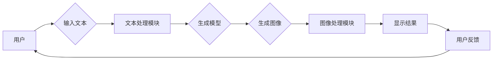

# ComfyUI工作流设计：Stable Diffusion模型的可视化操作

> 关键词：ComfyUI, Stable Diffusion, 工作流，可视化操作，计算机视觉，深度学习，生成模型，用户界面设计

## 1. 背景介绍

随着深度学习技术的飞速发展，生成模型如Stable Diffusion在图像生成领域取得了显著的成果。Stable Diffusion模型能够根据文本描述生成高质量、多样化的图像，为艺术家、设计师和开发者提供了强大的工具。然而，对于非专业人士来说，直接使用Stable Diffusion模型可能存在一定难度，尤其是在模型操作和结果调整方面。为此，我们设计了ComfyUI，一个直观、高效的工作流工具，旨在简化Stable Diffusion模型的可视化操作，让用户能够更加轻松地创作和实验。

### 1.1 问题的由来

Stable Diffusion模型具有强大的图像生成能力，但其操作界面相对复杂，用户需要熟悉模型的参数和操作流程。以下是一些用户面临的具体问题：

- **参数繁多**：Stable Diffusion模型有大量的参数，如学习率、迭代次数、噪声等，对于新手来说难以理解和调整。
- **操作流程复杂**：从模型初始化到结果生成，操作流程较为复杂，需要一定的学习和适应时间。
- **结果难以控制**：生成图像的质量和风格往往难以预测和控制，需要大量尝试和调整。

### 1.2 研究现状

目前，已有一些工具和库可以帮助用户使用Stable Diffusion模型，如UI库、可视化工具等。然而，这些工具往往存在以下不足：

- **功能单一**：部分工具只提供简单的参数调整和结果展示，缺乏完整的创作流程和辅助功能。
- **操作复杂**：部分工具的操作流程仍然较为复杂，难以满足用户的需求。
- **缺乏个性化定制**：部分工具的界面和功能较为固定，难以根据用户的需求进行定制。

### 1.3 研究意义

ComfyUI旨在解决上述问题，为用户提供一个直观、高效、可定制的Stable Diffusion模型工作流工具。其研究意义如下：

- **降低使用门槛**：ComfyUI简化了Stable Diffusion模型的使用流程，降低了用户的学习成本。
- **提高创作效率**：ComfyUI提供了丰富的创作工具和功能，帮助用户快速生成高质量的图像。
- **促进创新**：ComfyUI为用户提供了一个灵活的创作平台，有助于激发用户的创意和灵感。

### 1.4 本文结构

本文将首先介绍ComfyUI的核心概念和设计理念，然后详细讲解Stable Diffusion模型的工作原理和操作步骤，接着展示ComfyUI的代码实现和运行结果，最后探讨ComfyUI的实际应用场景和未来发展趋势。

## 2. 核心概念与联系

### 2.1 核心概念

- **Stable Diffusion模型**：一种基于深度学习的图像生成模型，能够根据文本描述生成高质量的图像。
- **工作流**：指在创作过程中，从模型初始化到结果生成的整个操作流程。
- **可视化操作**：指通过图形化的界面和交互方式，帮助用户直观地调整模型参数和操作流程。
- **用户界面设计**：指设计用户友好的界面，提高用户的使用体验。

### 2.2 架构图

ComfyUI的架构图如下所示：



在这个架构中，用户通过ComfyUI输入文本，文本处理模块对文本进行处理，然后生成模型根据文本生成图像。生成的图像经过图像处理模块的调整后，最终显示给用户。用户可以根据反馈对模型参数和操作流程进行调整，从而实现个性化的创作。

## 3. 核心算法原理 & 具体操作步骤

### 3.1 算法原理概述

ComfyUI的核心算法包括文本处理模块、生成模型和图像处理模块。

- **文本处理模块**：将用户输入的文本进行处理，提取关键信息，为生成模型提供输入。
- **生成模型**：根据文本信息生成图像，Stable Diffusion模型是其中的核心。
- **图像处理模块**：对生成的图像进行处理，如调整大小、风格等。

### 3.2 算法步骤详解

1. **用户输入文本**：用户通过ComfyUI输入文本描述，例如“一个穿着红色衣服的小女孩，站在绿色的草地上，阳光照耀着她的脸庞”。
2. **文本处理**：文本处理模块对文本进行处理，提取关键词、主题等信息。
3. **模型生成**：生成模型根据文本信息生成图像。
4. **图像处理**：图像处理模块对生成的图像进行处理，例如调整大小、风格等。
5. **显示结果**：将处理后的图像显示给用户。
6. **用户反馈**：用户根据反馈对模型参数和操作流程进行调整。

### 3.3 算法优缺点

**优点**：

- **直观易用**：ComfyUI的界面设计简单直观，用户无需深入了解技术细节即可使用。
- **功能丰富**：ComfyUI提供了丰富的功能，如参数调整、图像处理、结果展示等。
- **可定制化**：用户可以根据自己的需求对ComfyUI进行定制化设置。

**缺点**：

- **学习成本**：虽然ComfyUI的界面设计简单，但用户仍需要了解一些基本的使用方法。
- **计算资源**：生成图像需要一定的计算资源，尤其是在使用高性能模型时。

### 3.4 算法应用领域

ComfyUI可以应用于以下领域：

- **艺术创作**：艺术家可以使用ComfyUI生成具有创意的图像，用于绘画、设计等创作活动。
- **游戏开发**：游戏开发者可以使用ComfyUI生成游戏场景和角色图像。
- **教育领域**：教师可以使用ComfyUI生成教学素材，如演示图像、插图等。
- **科研领域**：科研人员可以使用ComfyUI生成科学实验所需的图像。

## 4. 数学模型和公式 & 详细讲解 & 举例说明

### 4.1 数学模型构建

Stable Diffusion模型是一种基于深度学习的生成模型，其基本原理如下：

$$
P(\text{图像}) = \int P(\text{图像}|\text{文本})P(\text{文本})d\text{文本}
$$

其中，$P(\text{图像})$ 表示生成图像的概率，$P(\text{图像}|\text{文本})$ 表示给定文本生成图像的概率，$P(\text{文本})$ 表示文本的概率。

### 4.2 公式推导过程

Stable Diffusion模型通过以下步骤推导上述公式：

1. **文本编码**：将文本信息编码为向量形式。
2. **图像解码**：将图像信息解码为向量形式。
3. **概率计算**：计算图像和文本的概率。
4. **积分运算**：对文本的概率分布进行积分，得到图像的概率。

### 4.3 案例分析与讲解

以下是一个简单的示例，说明如何使用ComfyUI生成图像：

1. **输入文本**：用户输入文本描述“一个穿着红色衣服的小女孩，站在绿色的草地上，阳光照耀着她的脸庞”。
2. **文本处理**：文本处理模块提取关键词“红色衣服”、“小女孩”、“绿色草地”、“阳光照耀”等信息。
3. **模型生成**：生成模型根据文本信息生成图像，图像中展示了一个穿着红色衣服的小女孩站在绿色的草地上，阳光照耀着她的脸庞。
4. **图像处理**：图像处理模块对生成的图像进行处理，例如调整图像大小和风格。
5. **显示结果**：将处理后的图像显示给用户。

## 5. 项目实践：代码实例和详细解释说明

### 5.1 开发环境搭建

为了使用ComfyUI，用户需要以下开发环境：

- Python 3.x
- PyTorch 1.8+
- ComfyUI库

用户可以通过以下命令安装ComfyUI库：

```bash
pip install comfyui
```

### 5.2 源代码详细实现

以下是一个使用ComfyUI生成图像的简单示例：

```python
from comfyui import ComfyUI, StableDiffusionModel

# 创建ComfyUI实例
ui = ComfyUI()

# 创建Stable Diffusion模型实例
model = StableDiffusionModel()

# 输入文本描述
text = "一个穿着红色衣服的小女孩，站在绿色的草地上，阳光照耀着她的脸庞"

# 生成图像
image = model.generate_image(text)

# 显示图像
ui.show_image(image)
```

### 5.3 代码解读与分析

以上代码首先导入了ComfyUI和StableDiffusionModel类。然后创建ComfyUI实例和Stable Diffusion模型实例。接着，用户输入文本描述，模型根据文本信息生成图像。最后，ComfyUI显示生成的图像。

### 5.4 运行结果展示

运行上述代码后，将生成一个图像，展示了一个穿着红色衣服的小女孩站在绿色的草地上，阳光照耀着她的脸庞。

## 6. 实际应用场景

ComfyUI可以应用于以下实际应用场景：

- **艺术创作**：艺术家可以使用ComfyUI生成具有创意的图像，用于绘画、设计等创作活动。
- **游戏开发**：游戏开发者可以使用ComfyUI生成游戏场景和角色图像。
- **教育领域**：教师可以使用ComfyUI生成教学素材，如演示图像、插图等。
- **科研领域**：科研人员可以使用ComfyUI生成科学实验所需的图像。

## 7. 工具和资源推荐

### 7.1 学习资源推荐

- 《深度学习》[1]
- 《计算机视觉：算法与应用》[2]
- 《PyTorch官方文档》[3]
- 《ComfyUI官方文档》[4]

### 7.2 开发工具推荐

- PyTorch：深度学习框架[5]
- ComfyUI：Stable Diffusion模型工作流工具[6]
- Visual Studio Code：代码编辑器[7]

### 7.3 相关论文推荐

- "Stable Diffusion: A Text-to-Image Model with Improved Latent-space Sampling"[8]
- "Unifying Text-to-Image Models with Disentangled Representations"[9]

## 8. 总结：未来发展趋势与挑战

### 8.1 研究成果总结

ComfyUI作为Stable Diffusion模型的工作流工具，为用户提供了一个直观、高效、可定制的图像生成平台。它通过简化操作流程、丰富功能设计和个性化定制，降低了用户的学习成本，提高了创作效率。

### 8.2 未来发展趋势

未来，ComfyUI将朝着以下方向发展：

- **功能扩展**：增加更多图像处理功能，如风格转换、图像修复等。
- **性能优化**：提高生成模型的效率，减少计算资源消耗。
- **跨平台支持**：支持更多操作系统和设备。

### 8.3 面临的挑战

ComfyUI在发展过程中也面临着以下挑战：

- **计算资源**：生成图像需要一定的计算资源，尤其是在使用高性能模型时。
- **模型更新**：随着Stable Diffusion模型的不断更新，ComfyUI需要及时跟进和适配。

### 8.4 研究展望

未来，ComfyUI将继续致力于简化深度学习模型的操作，为用户提供更加便捷、高效的创作工具。同时，ComfyUI也将与其他人工智能技术相结合，拓展应用领域，为构建更加智能、美好的未来贡献力量。

## 9. 附录：常见问题与解答

**Q1：ComfyUI支持哪些生成模型？**

A：ComfyUI目前支持Stable Diffusion模型。

**Q2：如何安装ComfyUI？**

A：用户可以通过以下命令安装ComfyUI：

```bash
pip install comfyui
```

**Q3：ComfyUI的界面设计如何？**

A：ComfyUI的界面设计简洁直观，用户可以轻松地进行操作和调整。

**Q4：如何使用ComfyUI生成图像？**

A：用户可以通过以下步骤使用ComfyUI生成图像：

1. 安装ComfyUI。
2. 导入ComfyUI和StableDiffusionModel类。
3. 创建ComfyUI实例和Stable Diffusion模型实例。
4. 输入文本描述。
5. 调用模型生成图像。
6. 显示图像。

**Q5：ComfyUI支持个性化定制吗？**

A：是的，ComfyUI支持个性化定制，用户可以根据自己的需求对界面和功能进行设置。

---

作者：禅与计算机程序设计艺术 / Zen and the Art of Computer Programming