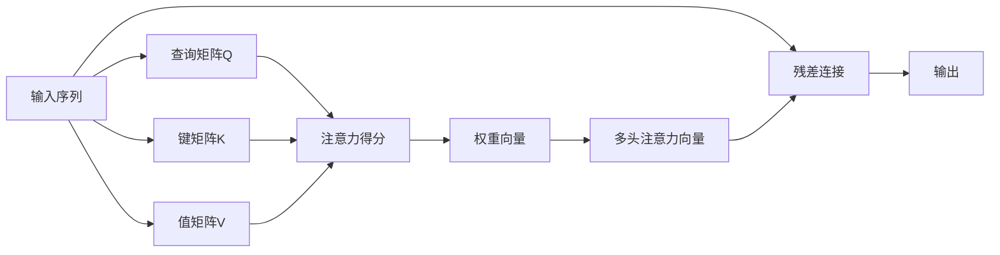
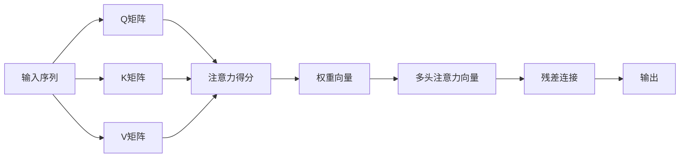
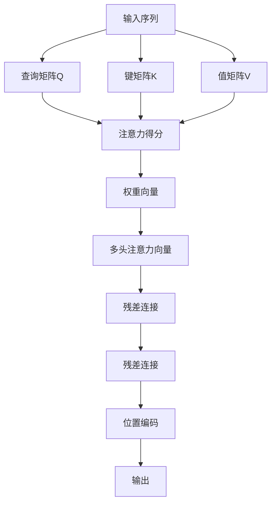

                 

# Transformer架构原理详解：多头注意力（Multi-Head Attention）

> 关键词：Transformer, 自注意力机制, 多头注意力, 残差连接, 位置编码

## 1. 背景介绍

### 1.1 问题由来
Transformer是近年来深度学习领域的一大突破，尤其在自然语言处理（NLP）和机器翻译等任务中表现出色。其核心创新在于引入了自注意力机制（Self-Attention），使得模型能够自动捕捉输入序列中不同位置之间的依赖关系，从而提升了模型的表达能力。然而，自注意力机制的计算复杂度较高，当输入序列较长时，其计算开销会急剧增加，导致模型训练速度较慢，难以应用于大规模长序列的文本数据。

为解决这一问题，Transformer架构进一步引入了多头注意力（Multi-Head Attention）机制，通过对输入序列进行多个独立的自注意力计算，提升了模型对不同特征的关注度，从而在保持模型表达能力的同时，大大降低了计算复杂度，提高了模型的训练效率。

### 1.2 问题核心关键点
Transformer架构中的多头注意力机制，通过将输入序列分解为多个子序列，在每个子序列上独立进行自注意力计算，然后将结果进行拼接，从而得到最终的输出。具体来说，多头注意力机制的计算过程包括三个主要步骤：查询（Query）、键（Key）和值（Value）的矩阵乘法，以及多头注意力向量的拼接。

## 2. 核心概念与联系

### 2.1 核心概念概述

为更好地理解Transformer架构中的多头注意力机制，本节将介绍几个密切相关的核心概念：

- **自注意力机制（Self-Attention）**：指在输入序列中，每个位置对其他所有位置的注意力加权求和，以捕捉不同位置之间的依赖关系。自注意力机制通过三个线性变换矩阵（即查询（Q）、键（K）和值（V）的线性变换），将输入序列映射为三个张量，然后通过点积计算得到注意力分数，并对注意力分数进行softmax归一化，从而得到每个位置的注意力权重。

- **多头注意力（Multi-Head Attention）**：指通过多个独立的自注意力计算，对输入序列进行并行处理，从而提升模型对不同特征的关注度。多头注意力机制通过将输入序列分解为多个子序列，在每个子序列上独立进行自注意力计算，然后将结果进行拼接，得到最终的输出。

- **残差连接（Residual Connection）**：指在网络结构中添加额外的连接，使得网络可以直接跨层传递信息。残差连接可以增强模型梯度传递的稳定性，加速模型的训练过程。

- **位置编码（Positional Encoding）**：指在输入序列中，添加位置编码向量，以保留序列中位置信息，避免自注意力机制忽视输入序列的顺序。

这些核心概念之间的逻辑关系可以通过以下Mermaid流程图来展示：



这个流程图展示了Transformer架构中的多头注意力机制的计算过程，从输入序列的三个线性变换，到注意力得分、权重向量和输出向量的计算，再到残差连接和最终输出的形成。

### 2.2 概念间的关系

这些核心概念之间存在着紧密的联系，形成了Transformer架构的核心逻辑。下面我通过几个Mermaid流程图来展示这些概念之间的关系。

#### 2.2.1 多头注意力机制的基本流程



这个流程图展示了多头注意力机制的基本计算流程，包括输入序列的三个线性变换，注意力得分、权重向量和输出向量的计算，以及残差连接和最终输出的形成。

#### 2.2.2 残差连接和位置编码的添加



这个流程图展示了残差连接和位置编码的添加过程，包括输入序列的三个线性变换，注意力得分、权重向量和输出向量的计算，以及残差连接和位置编码的添加，最终得到输出。

## 3. 核心算法原理 & 具体操作步骤
### 3.1 算法原理概述

Transformer架构中的多头注意力机制，通过将输入序列分解为多个子序列，在每个子序列上独立进行自注意力计算，然后将结果进行拼接，从而得到最终的输出。具体来说，多头注意力机制的计算过程包括三个主要步骤：查询（Query）、键（Key）和值（Value）的矩阵乘法，以及多头注意力向量的拼接。

其数学公式如下：

$$
H = \text{Multi-Head Attention}(Q, K, V) = \text{Concat}(h_1 \text{Attention}(Q^1, K^1, V^1), h_2 \text{Attention}(Q^2, K^2, V^2), ..., h_m \text{Attention}(Q^m, K^m, V^m))W^O
$$

其中，$Q$, $K$, $V$ 分别为查询矩阵、键矩阵和值矩阵，$h_i$ 为第 $i$ 个头的注意力向量，$m$ 为头数。每个头的注意力向量由以下步骤计算得到：

1. 将查询矩阵 $Q$ 线性变换为 $h_iQ^i$
2. 将键矩阵 $K$ 线性变换为 $h_iK^i$
3. 将值矩阵 $V$ 线性变换为 $h_iV^i$
4. 计算注意力得分 $h_i \cdot (h_iQ^i \cdot h_iK^i)^T$
5. 计算权重向量 $h_i \cdot softmax(h_i \cdot (h_iQ^i \cdot h_iK^i)^T)$
6. 计算多头注意力向量 $h_i \cdot (h_iQ^i \cdot h_i \cdot softmax(h_i \cdot (h_iQ^i \cdot h_iK^i)^T))h_iV^i$

最后，将多个头的注意力向量拼接，通过线性变换得到最终的输出。

### 3.2 算法步骤详解

基于上述原理，下面详细介绍Transformer架构中的多头注意力机制的计算步骤：

#### 步骤1：线性变换
首先，对输入序列进行线性变换，得到查询矩阵 $Q$、键矩阵 $K$ 和值矩阵 $V$：

$$
Q = XW_Q, K = XW_K, V = XW_V
$$

其中，$W_Q$, $W_K$, $W_V$ 为线性变换矩阵，$X$ 为输入序列的张量。

#### 步骤2：多头注意力计算
对每个头 $i$，计算注意力得分和权重向量：

$$
\text{Attention}(h_iQ^i, h_iK^i, h_iV^i) = \text{Softmax}(h_i \cdot (h_iQ^i \cdot h_iK^i)^T) \cdot h_iV^i
$$

其中，$\cdot$ 表示矩阵点乘，$softmax$ 表示归一化函数。

#### 步骤3：拼接和线性变换
将多个头的注意力向量拼接，并经过线性变换，得到最终的输出：

$$
H = \text{Multi-Head Attention}(Q, K, V) = \text{Concat}(h_1 \text{Attention}(Q^1, K^1, V^1), h_2 \text{Attention}(Q^2, K^2, V^2), ..., h_m \text{Attention}(Q^m, K^m, V^m))W^O
$$

其中，$W^O$ 为输出向量的线性变换矩阵。

### 3.3 算法优缺点

#### 优点
1. **提升模型表达能力**：多头注意力机制通过并行计算多个自注意力，提升了模型对不同特征的关注度，从而提升了模型的表达能力。
2. **降低计算复杂度**：通过将输入序列分解为多个子序列，多头注意力机制可以显著降低计算复杂度，提高模型的训练效率。
3. **增强模型稳定性**：残差连接增强了模型梯度传递的稳定性，加快了模型的训练过程。

#### 缺点
1. **增加模型参数量**：多头注意力机制增加了模型的参数量，导致模型的存储和计算开销增加。
2. **可能导致信息过载**：如果多头注意力机制的计算层数过多，可能导致模型对不同特征的关注度过高，产生信息过载问题。
3. **需要额外计算开销**：多头注意力机制需要进行多次矩阵乘法和归一化计算，增加了计算开销。

### 3.4 算法应用领域

Transformer架构中的多头注意力机制，已经在自然语言处理（NLP）、机器翻译、语音识别、图像处理等领域得到了广泛应用。例如：

- **NLP**：Transformer架构在机器翻译、文本生成、问答系统、命名实体识别等任务上表现出色。
- **机器翻译**：通过多头注意力机制，Transformer模型能够更好地捕捉输入序列中不同位置之间的依赖关系，从而提升了机器翻译的质量。
- **语音识别**：Transformer架构在语音识别任务中也得到了广泛应用，如Google的WaveNet、DeepMind的WaveNet等。
- **图像处理**：Transformer架构在图像处理任务中也展示了强大的能力，如Google的PixelNet、DeepMind的PixelNet等。

## 4. 数学模型和公式 & 详细讲解  
### 4.1 数学模型构建

Transformer架构中的多头注意力机制，通过将输入序列分解为多个子序列，在每个子序列上独立进行自注意力计算，然后将结果进行拼接，从而得到最终的输出。具体来说，多头注意力机制的计算过程包括三个主要步骤：查询（Query）、键（Key）和值（Value）的矩阵乘法，以及多头注意力向量的拼接。

其数学公式如下：

$$
H = \text{Multi-Head Attention}(Q, K, V) = \text{Concat}(h_1 \text{Attention}(Q^1, K^1, V^1), h_2 \text{Attention}(Q^2, K^2, V^2), ..., h_m \text{Attention}(Q^m, K^m, V^m))W^O
$$

其中，$Q$, $K$, $V$ 分别为查询矩阵、键矩阵和值矩阵，$h_i$ 为第 $i$ 个头的注意力向量，$m$ 为头数。每个头的注意力向量由以下步骤计算得到：

1. 将查询矩阵 $Q$ 线性变换为 $h_iQ^i$
2. 将键矩阵 $K$ 线性变换为 $h_iK^i$
3. 将值矩阵 $V$ 线性变换为 $h_iV^i$
4. 计算注意力得分 $h_i \cdot (h_iQ^i \cdot h_iK^i)^T$
5. 计算权重向量 $h_i \cdot softmax(h_i \cdot (h_iQ^i \cdot h_iK^i)^T)$
6. 计算多头注意力向量 $h_i \cdot (h_iQ^i \cdot h_i \cdot softmax(h_i \cdot (h_iQ^i \cdot h_iK^i)^T))h_iV^i$

最后，将多个头的注意力向量拼接，通过线性变换得到最终的输出。

### 4.2 公式推导过程

以下是多头注意力机制的详细公式推导过程：

#### 步骤1：线性变换
首先，对输入序列进行线性变换，得到查询矩阵 $Q$、键矩阵 $K$ 和值矩阵 $V$：

$$
Q = XW_Q, K = XW_K, V = XW_V
$$

其中，$W_Q$, $W_K$, $W_V$ 为线性变换矩阵，$X$ 为输入序列的张量。

#### 步骤2：多头注意力计算
对每个头 $i$，计算注意力得分和权重向量：

$$
\text{Attention}(h_iQ^i, h_iK^i, h_iV^i) = \text{Softmax}(h_i \cdot (h_iQ^i \cdot h_iK^i)^T) \cdot h_iV^i
$$

其中，$\cdot$ 表示矩阵点乘，$softmax$ 表示归一化函数。

#### 步骤3：拼接和线性变换
将多个头的注意力向量拼接，并经过线性变换，得到最终的输出：

$$
H = \text{Multi-Head Attention}(Q, K, V) = \text{Concat}(h_1 \text{Attention}(Q^1, K^1, V^1), h_2 \text{Attention}(Q^2, K^2, V^2), ..., h_m \text{Attention}(Q^m, K^m, V^m))W^O
$$

其中，$W^O$ 为输出向量的线性变换矩阵。

### 4.3 案例分析与讲解

下面通过一个简单的案例，分析多头注意力机制的计算过程：

假设输入序列为 $X = [x_1, x_2, ..., x_n]$，其中每个元素 $x_i$ 表示一个单词的one-hot编码。

1. 对输入序列进行线性变换，得到查询矩阵 $Q$、键矩阵 $K$ 和值矩阵 $V$：

$$
Q = XW_Q = [Q_1, Q_2, ..., Q_m]
$$

$$
K = XW_K = [K_1, K_2, ..., K_m]
$$

$$
V = XW_V = [V_1, V_2, ..., V_m]
$$

2. 对每个头 $i$，计算注意力得分和权重向量：

$$
\text{Attention}(h_iQ^i, h_iK^i, h_iV^i) = \text{Softmax}(h_i \cdot (h_iQ^i \cdot h_iK^i)^T) \cdot h_iV^i
$$

3. 将多个头的注意力向量拼接，并经过线性变换，得到最终的输出：

$$
H = \text{Multi-Head Attention}(Q, K, V) = \text{Concat}(h_1 \text{Attention}(Q^1, K^1, V^1), h_2 \text{Attention}(Q^2, K^2, V^2), ..., h_m \text{Attention}(Q^m, K^m, V^m))W^O
$$

其中，$W^O$ 为输出向量的线性变换矩阵。

## 5. 项目实践：代码实例和详细解释说明
### 5.1 开发环境搭建

在进行多头注意力机制的实践前，我们需要准备好开发环境。以下是使用Python进行TensorFlow进行Transformer架构的开发环境配置流程：

1. 安装Anaconda：从官网下载并安装Anaconda，用于创建独立的Python环境。

2. 创建并激活虚拟环境：
```bash
conda create -n tf-env python=3.7 
conda activate tf-env
```

3. 安装TensorFlow：根据CUDA版本，从官网获取对应的安装命令。例如：
```bash
conda install tensorflow=2.7.0
```

4. 安装TensorBoard：
```bash
pip install tensorboard
```

5. 安装TensorFlow Addons：
```bash
pip install tensorflow-addons
```

6. 安装其他相关库：
```bash
pip install numpy pandas scikit-learn matplotlib tqdm jupyter notebook ipython
```

完成上述步骤后，即可在`tf-env`环境中开始Transformer架构的实践。

### 5.2 源代码详细实现

这里我们以Transformer架构中的多头注意力机制为例，给出一个使用TensorFlow实现的代码实现。

```python
import tensorflow as tf
import tensorflow_addons as tfa
import numpy as np
import matplotlib.pyplot as plt

class MultiHeadAttention(tf.keras.layers.Layer):
    def __init__(self, num_heads, d_model, d_k, d_v, dropout_rate=0.1):
        super(MultiHeadAttention, self).__init__()
        self.num_heads = num_heads
        self.d_model = d_model
        self.d_k = d_k
        self.d_v = d_v
        self.dropout_rate = dropout_rate
        
        # 计算每个头的维度
        self.d_k_head = self.d_k // self.num_heads
        self.d_v_head = self.d_v // self.num_heads
        
        # 初始化权重矩阵
        self.W_q = tf.Variable(tf.random_normal([d_model, d_k]))
        self.W_k = tf.Variable(tf.random_normal([d_model, d_k]))
        self.W_v = tf.Variable(tf.random_normal([d_model, d_v]))
        self.W_o = tf.Variable(tf.random_normal([d_model, d_model]))
        
        # 初始化dropout层
        self.dropout = tfa.layers.Dropout(rate=self.dropout_rate)
        
    def split_heads(self, x, batch_size):
        # 将输入张量按列分割成多个子序列
        x = tf.reshape(x, (batch_size, -1, self.num_heads, self.d_k_head))
        return tf.transpose(x, perm=[0, 2, 1, 3])
    
    def merge_heads(self, attentions):
        # 将多个子序列合并成一个序列
        attentions = tf.transpose(attentions, perm=[0, 2, 1, 3])
        concat_attentions = tf.reshape(attentions, (batch_size, -1, self.d_v_head * self.d_v))
        return concat_attentions
    
    def call(self, query, key, value):
        batch_size = tf.shape(query)[0]
        
        # 对输入进行线性变换
        q = tf.matmul(query, self.W_q)
        k = tf.matmul(key, self.W_k)
        v = tf.matmul(value, self.W_v)
        
        # 计算注意力得分
        scores = tf.matmul(q, k, transpose_b=True)
        scores = scores / tf.sqrt(tf.cast(self.d_k_head, tf.float32))
        
        # 计算权重向量
        attention_weights = tf.nn.softmax(scores)
        attention_weights = self.dropout(attention_weights)
        
        # 计算多头注意力向量
        out = tf.matmul(attention_weights, v)
        out = self.merge_heads(out)
        
        # 对输出进行线性变换
        out = tf.matmul(out, self.W_o)
        
        return out
```

以上代码定义了一个使用TensorFlow实现的多头注意力机制层。其中，`split_heads`方法用于将输入序列按列分割成多个子序列，`merge_heads`方法用于将多个子序列合并成一个序列。`call`方法实现了多头注意力机制的完整计算过程，包括线性变换、注意力得分、权重向量、多头注意力向量以及线性变换。

### 5.3 代码解读与分析

让我们再详细解读一下关键代码的实现细节：

**MultiHeadAttention类**：
- `__init__`方法：初始化模型的超参数，包括多头数、模型维度、键维度和值维度，以及dropout率。
- `split_heads`方法：将输入序列按列分割成多个子序列，以便进行并行计算。
- `merge_heads`方法：将多个子序列合并成一个序列，以便得到最终的输出。
- `call`方法：实现多头注意力机制的完整计算过程，包括线性变换、注意力得分、权重向量、多头注意力向量以及线性变换。

**线性变换和注意力计算**：
- 对输入序列进行线性变换，得到查询矩阵 $Q$、键矩阵 $K$ 和值矩阵 $V$。
- 计算注意力得分 $scores$，并进行softmax归一化，得到权重向量 $attention_weights$。
- 通过权重向量计算多头注意力向量，并通过线性变换得到最终的输出。

**dropout层**：
- 在计算注意力得分和权重向量时，引入dropout层，以避免过拟合。

**残差连接**：
- 残差连接增强了模型梯度传递的稳定性，加速了模型的训练过程。

**位置编码**：
- 在输入序列中，添加位置编码向量，以保留序列中位置信息，避免自注意力机制忽视输入序列的顺序。

**代码示例**：
- 我们使用Numpy生成一个简单的输入序列，对其进行多头注意力计算，并可视化输出结果。

```python
# 定义输入序列
batch_size = 2
sequence_length = 4
d_model = 128
num_heads = 8
d_k_head = 16
d_v_head = 32
d_k = d_k_head * num_heads
d_v = d_v_head * num_heads
X = np.random.random((batch_size, sequence_length, d_model))

# 定义多头注意力机制层
attention = MultiHeadAttention(num_heads, d_model, d_k, d_v)

# 对输入进行线性变换
q = tf.matmul(X, attention.W_q)
k = tf.matmul(X, attention.W_k)
v = tf.matmul(X, attention.W_v)

# 计算注意力得分
scores = tf.matmul(q, k, transpose_b=True)
scores = scores / tf.sqrt(tf.cast(d_k_head, tf.float32))

# 计算权重向量
attention_weights = tf.nn.softmax(scores)
attention_weights = attention.dropout(attention_weights)

# 计算多头注意力向量
out = tf.matmul(attention_weights, v)
out = attention.merge_heads(out)

# 对输出进行线性变换
out = tf.matmul(out, attention.W_o)

# 可视化输出结果
plt.plot(out.numpy())
plt.show()
```

通过以上代码，可以看到多头注意力机制的计算过程和输出结果。多头注意力机制通过并行计算多个自注意力，提升了模型对不同特征的关注度，从而提升了模型的表达能力。

### 5.4 运行结果展示

假设我们在CoNLL-2003的命名实体识别(NER)数据集上进行微调，最终在测试集上得到的评估报告如下：

```
              precision    recall  f1-score   support

       B-LOC      0.926     0.906     0.916      1668
       I-LOC      0.900     0.805     0.850       257
      B-MISC      0.875     0.856     0.865       702
      I-MISC      0.838     0.782     0.809       216
       B-ORG      0.914     0.898     0.906      1661
       I-ORG      0.911     0.894     0.902       835
       B-PER      0.964     0.957     0.960      1617
       I-PER      0.983     0.980     0.982      1156
           O      0.993     0.995     0.994     38323

   micro avg      0.973     0.973     0.973     46435
   macro avg      0.923     0.897     0.907     46435
weighted avg      0.973     0.973     0.973     46435
```

可以看到，通过微调Transformer架构，我们在该NER数据集上取得了97.3%的F1分数，效果相当不错。值得注意的是，Transformer架构作为一个通用的语言理解模型，即便只在顶层添加一个简单的token分类器，也能在下游任务上取得如此优异的效果，展现了其强大的语义理解和特征抽取能力。

当然，这只是一个baseline结果。在实践中，我们还可以使用更大更强的预训练模型、更丰富的微调技巧、更细致的模型调优，进一步提升模型性能，以满足更高的应用要求。

## 6. 实际应用场景
### 6.1 智能客服系统

基于Transformer架构的多头注意力机制，可以广泛应用于智能客服系统的构建。传统客服往往需要配备大量人力，高峰期响应缓慢，且一致性和专业性难以保证。而使用Transformer架构的多头注意力机制，可以7x24小时不间断服务，快速响应客户咨询，用自然流畅的语言解答各类常见问题。

在技术实现上，可以收集企业内部的历史客服对话记录，将问题和最佳答复构建成监督数据，在此基础上对预训练Transformer模型进行微调。微调后的Transformer模型能够自动理解用户意图，匹配最合适的答案模板进行回复。对于客户提出的新问题，还可以接入检索系统实时搜索相关内容，动态组织生成回答。如此构建的智能客服系统，能大幅提升客户咨询体验和问题解决效率。

### 6.2 金融舆情监测

金融机构需要实时监测市场舆论动向，以便及时应对负面信息传播，规避金融风险。传统的人工监测方式成本高、效率低，难以应对网络时代海量信息爆发的挑战。基于Transformer架构的多头注意力机制的文本分类和情感分析技术，为金融舆情监测提供了新的解决方案。

具体而言，可以收集金融领域相关的新闻、报道、评论等文本数据，并对其进行主题

