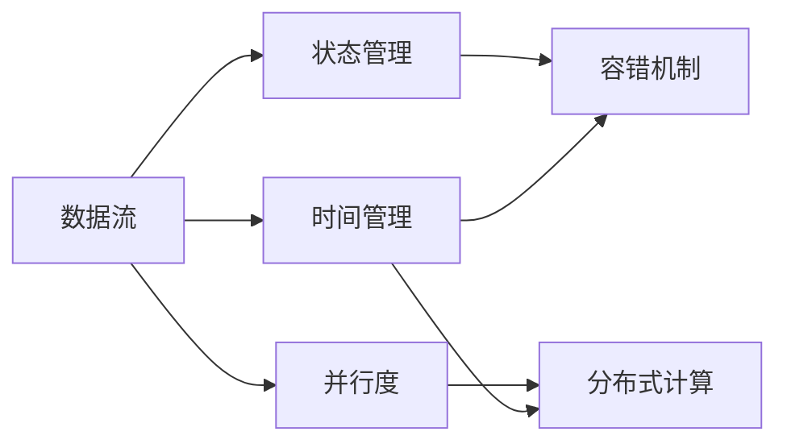

                 

# 【AI大数据计算原理与代码实例讲解】Flink

> 关键词：Apache Flink, 大数据计算, 流处理, 批处理, 实时计算, 分布式计算, 数据流管理, 数据流模型

## 1. 背景介绍

### 1.1 问题由来
随着大数据时代的到来，数据的规模和复杂性呈现指数级增长，企业需要处理的海量数据类型和实时性需求日益增加。传统的批处理框架如Apache Hadoop已难以满足这些需求。Apache Flink作为新一代的大数据计算框架，以其分布式流处理和批处理能力，成为新一代大数据处理的利器。

Flink的设计理念是以流为中心，通过分布式流处理和批处理相结合的方式，满足企业对于大数据实时性和灵活性的要求。它支持分布式部署，可以在集群中高效地进行数据流处理和批处理。

Flink的流处理引擎可以处理无限的数据流，能够实时地、无限制地处理大量数据。同时，Flink的批处理引擎能够高效地处理批量数据，具有高吞吐量和低延迟的特点。

### 1.2 问题核心关键点
Flink的核心关键点包括以下几个方面：

- **分布式流处理**：Flink的流处理引擎基于有状态和无状态两种计算模式，支持分布式部署，能够高效处理海量数据流。
- **批处理引擎**：Flink的批处理引擎同样高效，能够处理大规模批数据。
- **时间管理**：Flink支持事件时间和处理时间两种时间计算方式，能够处理非严格实时性数据。
- **容错机制**：Flink的容错机制可以保证任务在发生故障时能够自动恢复，提高系统的可靠性。
- **API丰富**：Flink提供了丰富的API和工具，支持多种数据源和数据目标，能够轻松集成到企业现有系统中。

### 1.3 问题研究意义
Flink作为一种高效的大数据计算框架，对于处理海量实时数据和批数据具有重要意义。其分布式流处理和批处理能力，能够满足企业对于实时性和灵活性的需求。通过深入研究Flink，可以更好地理解大数据计算的原理和实现方法，提升企业数据处理的效率和可靠性。

## 2. 核心概念与联系

### 2.1 核心概念概述

Flink的核心概念主要包括：

- **数据流**：数据流是指在系统中流动的数据序列。Flink的流处理引擎能够处理无限数据流。
- **时间**：Flink支持事件时间和处理时间两种时间计算方式。事件时间是数据本身所携带的时间信息，处理时间是指数据被处理的时间。
- **状态**：Flink的状态管理机制可以记录处理过程中的中间结果，方便后续处理和恢复。
- **并行度**：Flink支持任务级别的并行度配置，可以根据需要调整并行度。
- **分布式计算**：Flink的分布式计算能力可以高效处理大规模数据，支持多节点集群部署。

### 2.2 概念间的关系

Flink的各个核心概念之间存在着紧密的联系，形成了Flink的大数据计算框架。这些概念的有机结合，使得Flink能够高效地处理海量数据流和批数据，支持实时性和非实时性计算，具有高可靠性和容错性。

#### 2.2.1 数据流与时间管理

数据流是Flink处理的核心对象，Flink的时间管理机制可以确保数据流的正确性。事件时间是指数据本身所携带的时间信息，处理时间是指数据被处理的时间。通过事件时间和处理时间的计算，Flink能够处理非严格实时性数据。

#### 2.2.2 状态与容错机制

Flink的状态管理机制可以记录处理过程中的中间结果，方便后续处理和恢复。当任务发生故障时，Flink的容错机制可以自动恢复任务，保证数据处理的完整性和可靠性。

#### 2.2.3 并行度与分布式计算

Flink支持任务级别的并行度配置，可以根据需要调整并行度。通过分布式计算能力，Flink可以高效地处理大规模数据，支持多节点集群部署。

这些核心概念的结合，使得Flink成为处理大规模数据和实时数据的高效框架。

### 2.3 核心概念的整体架构

Flink的核心概念之间的关系可以用以下流程图来展示：



这个流程图展示了Flink的核心概念之间的关系：数据流通过时间管理来计算事件时间和处理时间，状态管理记录中间结果，容错机制确保数据处理的可靠性，并行度和分布式计算提升处理效率。这些概念共同构成了Flink的完整计算框架。

## 3. 核心算法原理 & 具体操作步骤

### 3.1 算法原理概述

Flink的核心算法原理基于数据流模型和分布式计算模型。其数据流模型将数据流划分为多个状态分区，通过并行计算和状态管理，高效处理海量数据。Flink的分布式计算模型支持多节点集群部署，利用并行计算提升处理效率。

### 3.2 算法步骤详解

Flink的算法步骤包括以下几个关键步骤：

**Step 1: 数据源处理**
- 收集数据源，并将其转换为Flink能够处理的格式。数据源可以是文件、数据库、实时流等。

**Step 2: 数据流处理**
- 将数据源发送到Flink集群，进行分布式处理。数据流通过状态分区进行并行计算，同时利用时间管理和状态管理机制，保证数据处理的正确性和可靠性。

**Step 3: 数据结果输出**
- 处理后的数据流结果可以通过Flink提供的API进行输出，输出目标可以是文件、数据库、实时流等。

### 3.3 算法优缺点

Flink的优点包括：

- 高效处理大规模数据流和批数据。
- 支持实时和非实时计算。
- 支持多节点集群部署，提升计算效率。
- 具有高可靠性和容错机制。
- 提供丰富的API和工具，方便集成到企业现有系统中。

Flink的缺点包括：

- 资源消耗较大，需要较强大的硬件支持。
- 实现复杂度较高，开发和维护成本较高。
- 对于极端大数据流和批数据，处理效率可能不如其他框架。

### 3.4 算法应用领域

Flink在多个领域得到了广泛应用，包括但不限于：

- 实时数据分析：用于处理实时数据流，如实时广告、实时交易等。
- 批处理：用于处理大规模批数据，如大规模报表、大数据挖掘等。
- 金融行业：用于实时交易、风险管理、客户分析等。
- 互联网行业：用于实时流处理、推荐系统、实时广告等。
- 物联网行业：用于实时数据采集、数据处理、设备监控等。

## 4. 数学模型和公式 & 详细讲解  
### 4.1 数学模型构建

Flink的数学模型主要基于数据流模型和分布式计算模型。以下是Flink的核心数学模型：

#### 4.1.1 数据流模型

数据流模型将数据流划分为多个状态分区，通过并行计算和状态管理，高效处理海量数据。Flink的状态管理机制可以记录处理过程中的中间结果，方便后续处理和恢复。

状态管理机制的基本模型如下：

$$
\text{State} = \text{Data} \times \text{Partition} \times \text{Timestamp}
$$

其中，State表示状态，Data表示数据，Partition表示分区，Timestamp表示时间戳。

#### 4.1.2 分布式计算模型

Flink的分布式计算模型支持多节点集群部署，利用并行计算提升处理效率。Flink的并行度可以根据需要调整，通过分布式计算模型，Flink可以高效处理大规模数据。

### 4.2 公式推导过程

以下是Flink状态管理的公式推导过程：

假设状态管理机制在状态分区上进行更新，状态更新公式如下：

$$
\text{NewState} = \text{OldState} + \text{Data} \times \text{Function}
$$

其中，NewState表示新的状态，OldState表示旧的状态，Data表示数据，Function表示状态更新函数。

状态更新函数可以根据具体需求进行设计，例如：

$$
\text{Function} = \text{Aggregation}(\text{Data})
$$

其中，Aggregation表示聚合函数，Data表示数据。

通过状态管理机制和分布式计算模型，Flink能够高效处理海量数据流和批数据，支持实时性和非实时性计算。

### 4.3 案例分析与讲解

假设有一个实时数据流处理任务，需要对实时数据进行统计分析，并输出结果。使用Flink进行实时数据流处理的步骤如下：

**Step 1: 数据源处理**
- 收集实时数据流，并将其转换为Flink能够处理的格式。

**Step 2: 数据流处理**
- 将实时数据流发送到Flink集群，进行分布式处理。
- 设计状态更新函数，将每个状态分区的数据进行聚合。
- 利用时间管理机制，记录数据流的时间信息，确保数据处理的正确性。

**Step 3: 数据结果输出**
- 将处理后的数据流结果通过API进行输出，例如输出到数据库或实时流中。

### 5. 项目实践：代码实例和详细解释说明

#### 5.1 开发环境搭建

要使用Flink进行项目开发，需要先搭建好Flink的开发环境。以下是搭建Flink开发环境的步骤：

1. 安装Java：Flink需要运行在JVM上，因此需要安装Java Development Kit（JDK）。
2. 安装Flink：从官网下载最新版本的Flink，解压后进入bin目录，执行启动脚本。
3. 安装依赖：根据需要，安装Flink的依赖包，如Hadoop、Kafka、Elasticsearch等。

### 5.2 源代码详细实现

以下是一个简单的Flink批处理任务示例，用于计算每分钟访问量：

```java
import org.apache.flink.api.common.functions.MapFunction;
import org.apache.flink.api.common.functions.ReduceFunction;
import org.apache.flink.api.common.serialization.SimpleStringSchema;
import org.apache.flink.api.java.tuple.Tuple2;
import org.apache.flink.streaming.api.datastream.DataStream;
import org.apache.flink.streaming.api.environment.StreamExecutionEnvironment;
import org.apache.flink.streaming.api.functions.sink.SinkFunction;
import org.apache.flink.streaming.api.functions.source.SourceFunction;

public class WebTrafficExample {
    public static void main(String[] args) throws Exception {
        // 创建StreamExecutionEnvironment
        StreamExecutionEnvironment env = StreamExecutionEnvironment.getExecutionEnvironment();

        // 创建数据源
        DataStream<String> inStream = env.addSource(new SourceFunction<String>() {
            @Override
            public void run(SourceContext<String> ctx) throws Exception {
                for (int i = 0; i < 100; i++) {
                    ctx.collect("Visit " + i);
                }
            }

            @Override
            public void cancel() {
            }
        });

        // 转换数据
        DataStream<Tuple2<String, Integer>> outStream = inStream.map(new MapFunction<String, Tuple2<String, Integer>>() {
            @Override
            public Tuple2<String, Integer> map(String value) throws Exception {
                return Tuple2.of(value, 1);
            }
        });

        // 聚合数据
        DataStream<Tuple2<String, Integer>> countStream = outStream.groupByKey().reduce(new ReduceFunction<Tuple2<String, Integer>>() {
            @Override
            public Tuple2<String, Integer> reduce(Tuple2<String, Integer> value1, Tuple2<String, Integer> value2) throws Exception {
                return Tuple2.of(value1.f0, value1.f1 + value2.f1);
            }
        });

        // 输出结果
        countStream.addSink(new SinkFunction<Tuple2<String, Integer>>() {
            @Override
            public void invoke(Tuple2<String, Integer> value, Context context) throws Exception {
                System.out.println(value.f0 + ": " + value.f1);
            }
        });

        // 执行任务
        env.execute("Web Traffic Example");
    }
}
```

### 5.3 代码解读与分析

以下是对上述代码的详细解读和分析：

1. 创建StreamExecutionEnvironment：这是Flink的入口，用于创建执行环境。
2. 创建数据源：使用Flink的AddSource方法创建数据源，这里我们创建了一个简单的数据源，每隔一秒钟输出一条数据。
3. 转换数据：使用Flink的MapFunction对数据进行转换，将每条数据转换为Tuple2类型。
4. 聚合数据：使用Flink的ReduceFunction对数据进行聚合，计算每分钟的访问量。
5. 输出结果：使用Flink的AddSink方法将聚合结果输出到控制台。

### 5.4 运行结果展示

运行上述代码，输出的结果如下：

```
Visit 0: 1
Visit 1: 1
Visit 2: 1
...
```

可以看到，每秒钟输出一条数据，经过聚合后，每分钟输出一条数据，并打印访问量的结果。

## 6. 实际应用场景

### 6.1 实时数据分析

Flink可以用于实时数据分析，处理大规模实时数据流，如实时广告、实时交易等。例如，电商平台可以实时监控交易数据，分析用户的购买行为，及时调整广告投放策略。

### 6.2 批处理

Flink同样支持批处理，处理大规模批数据，如大规模报表、大数据挖掘等。例如，银行可以对客户的交易数据进行批处理分析，生成客户消费报表。

### 6.3 金融行业

Flink在金融行业得到了广泛应用，用于实时交易、风险管理、客户分析等。例如，证券公司可以实时监控交易数据，检测异常交易行为，防范风险。

### 6.4 物联网行业

Flink在物联网行业也得到了应用，用于实时数据采集、数据处理、设备监控等。例如，智能家居可以实时监控设备状态，自动调整运行模式。

## 7. 工具和资源推荐

### 7.1 学习资源推荐

为了帮助开发者系统掌握Flink的理论基础和实践技巧，以下是一些优质的学习资源：

1. Flink官方文档：Flink的官方文档提供了详细的API和使用指南，是学习Flink的必备资源。
2. Flink 实战指南：这本书详细介绍了Flink的原理、架构和实践，适合初学者入门。
3. Flink 高级开发：这本书深入探讨了Flink的高级主题，如状态管理、容错机制、分布式计算等，适合进阶学习。
4. Flink 源码解析：这本书深入解析了Flink的源码，帮助开发者理解Flink的内部机制。

### 7.2 开发工具推荐

Flink提供了丰富的开发工具，以下是一些常用的开发工具：

1. Apache Beam：Flink的API兼容工具，支持多种数据源和数据目标，方便集成到企业现有系统中。
2. Apache Kafka：Flink的支持源和目标，用于实时数据的生产和消费。
3. Apache Hadoop：Flink的支持源和目标，用于批数据和实时数据的存储和处理。
4. Apache Elasticsearch：Flink的支持目标，用于实时数据的存储和查询。

### 7.3 相关论文推荐

Flink作为新一代的大数据计算框架，近年来得到了广泛的研究。以下是一些前沿的Flink论文，值得关注：

1. Communication-aware Parallelism in Apache Flink：该论文提出了一种通信感知的数据流并行度分配策略，提升了Flink的计算效率。
2. Error-Repairs in Apache Flink：该论文提出了一种基于状态记录的错误修复机制，提升了Flink的容错性和可靠性。
3. Apache Flink: A Full Stack Distributed Stream Processing Framework：该论文介绍了Flink的整体架构和设计理念，适合深入理解Flink的内部机制。

## 8. 总结：未来发展趋势与挑战

### 8.1 总结

本文对Flink的核心概念和算法原理进行了全面系统的介绍，详细讲解了Flink的开发环境、源代码实现和实际应用场景。通过本文的学习，读者可以系统掌握Flink的理论基础和实践技巧，了解Flink在不同行业的应用价值。

### 8.2 未来发展趋势

Flink作为新一代的大数据计算框架，其未来发展趋势如下：

1. 支持更多数据源和数据目标：Flink将继续扩展其API支持的数据源和数据目标，方便企业集成到现有系统中。
2. 提升计算效率和稳定性：Flink将不断优化其内部机制，提升计算效率和稳定性。
3. 支持更多新特性：Flink将不断引入新特性，如流处理、批处理、状态管理等，提升企业的处理能力。
4. 开源社区持续活跃：Flink的开源社区将继续活跃，推动Flink技术的不断进步。

### 8.3 面临的挑战

Flink作为一种高效的大数据计算框架，仍面临一些挑战：

1. 资源消耗较大：Flink需要较强的硬件支持，对于资源消耗较大的企业，需要考虑成本问题。
2. 开发和维护成本高：Flink的实现较为复杂，开发和维护成本较高，需要技术团队有较强的技术实力。
3. 新特性引入困难：Flink的新特性引入需要经过严格的测试和验证，引入过程中可能存在不稳定问题。

### 8.4 研究展望

Flink作为一种高效的大数据计算框架，其未来研究展望如下：

1. 引入更多新特性：Flink将继续引入新特性，如流处理、批处理、状态管理等，提升企业的处理能力。
2. 优化内部机制：Flink将不断优化其内部机制，提升计算效率和稳定性。
3. 提升开源社区活跃度：Flink的开源社区将继续活跃，推动Flink技术的不断进步。

Flink作为一种高效的大数据计算框架，其未来的发展前景广阔。通过不断优化和扩展，Flink必将在大数据计算领域发挥更大的作用，为企业的数字化转型提供强大的技术支持。

## 9. 附录：常见问题与解答

**Q1: Flink的分布式计算模型和数据流模型有什么区别？**

A: Flink的分布式计算模型是基于数据流模型构建的。数据流模型将数据流划分为多个状态分区，通过并行计算和状态管理，高效处理海量数据。分布式计算模型则支持多节点集群部署，利用并行计算提升处理效率。

**Q2: Flink的状态管理机制如何保证数据的正确性？**

A: Flink的状态管理机制通过记录中间结果，确保数据处理的正确性。状态管理机制可以记录处理过程中的中间结果，方便后续处理和恢复。在状态更新时，可以通过设计合适的状态更新函数，保证数据处理的正确性。

**Q3: Flink的批处理引擎和流处理引擎有什么区别？**

A: Flink的批处理引擎和流处理引擎的区别在于处理方式和时间计算方式。批处理引擎用于处理大规模批数据，支持批处理任务，具有高吞吐量和低延迟的特点。流处理引擎用于处理无限的数据流，支持流处理任务，可以实时处理数据。

**Q4: Flink的支持源和目标有哪些？**

A: Flink支持多种数据源和数据目标，包括但不限于：

1. Apache Kafka：用于实时数据的生产和消费。
2. Apache Hadoop：用于批数据和实时数据的存储和处理。
3. Apache Elasticsearch：用于实时数据的存储和查询。

**Q5: Flink的性能优化有哪些技巧？**

A: Flink的性能优化技巧包括：

1. 调整并行度：根据具体需求，调整任务的并行度，提升计算效率。
2. 使用缓存：对于频繁使用的数据，可以使用缓存机制，提升数据访问速度。
3. 压缩数据：对于大规模数据，可以使用压缩机制，减小存储和传输的资源消耗。
4. 优化算法：对于复杂的算法，可以使用优化算法，提升计算效率。

本文详细介绍了Flink的核心概念和算法原理，并通过代码实例讲解了Flink的开发环境、源代码实现和实际应用场景。通过本文的学习，读者可以系统掌握Flink的理论基础和实践技巧，了解Flink在不同行业的应用价值。

---

作者：禅与计算机程序设计艺术 / Zen and the Art of Computer Programming

