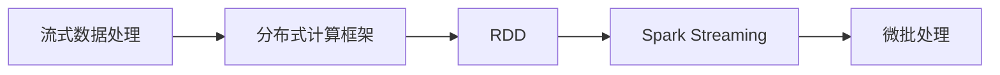
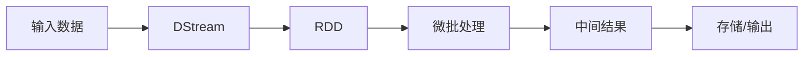
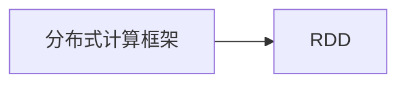
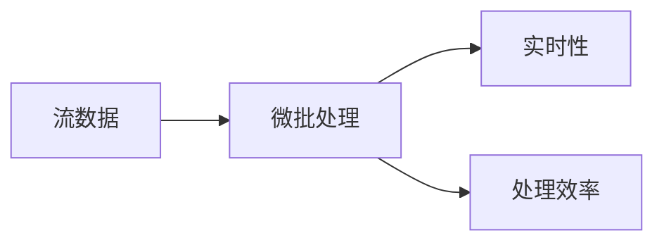

                 

# 【AI大数据计算原理与代码实例讲解】Spark Streaming

> 关键词：
> - 大数据处理
> - 实时流数据处理
> - Spark Streaming
> - 分布式计算
> - 实时分析
> - Apache Spark
> - 分布式系统
> - 数据流处理
> - 高可用性

## 1. 背景介绍

在当今数字化、信息化快速发展的时代，大数据处理成为各行各业提高效率、优化决策的重要手段。实时流数据处理作为大数据处理的重要组成部分，使得企业能够快速响应市场变化，抢占先机。Apache Spark Streaming（简称Spark Streaming）作为Spark的核心组件之一，提供了基于弹性分布式数据集（RDDs）的流式计算框架，能够高效地处理大规模实时数据，具有灵活性和可扩展性。

### 1.1 问题由来

在大数据时代，传统的数据仓库、批处理方式已经无法满足实时性需求。实时流数据处理成为一种趋势，其能够在数据到达时立即进行处理和分析，从而提供更及时、更准确的决策支持。Spark Streaming作为Spark的一部分，能够将流式数据处理与Spark的强大生态系统结合，提供了一个基于内存的流式处理引擎，可以处理大规模、高速率的数据流，适用于各种实时分析场景。

### 1.2 问题核心关键点

Spark Streaming的核心在于实现对实时流数据的处理和分析。其工作原理基于微批处理（Micro-batch Processing），即将流数据划分为固定大小的小批（通常是1到2秒）进行处理，从而在保证处理效率的同时，也确保了实时性。Spark Streaming通过与Spark的其他组件（如Spark SQL、MLlib、GraphX等）紧密集成，实现流式数据的分布式处理和分析。

Spark Streaming的核心在于实现对实时流数据的处理和分析。其工作原理基于微批处理（Micro-batch Processing），即将流数据划分为固定大小的小批（通常是1到2秒）进行处理，从而在保证处理效率的同时，也确保了实时性。Spark Streaming通过与Spark的其他组件（如Spark SQL、MLlib、GraphX等）紧密集成，实现流式数据的分布式处理和分析。

## 2. 核心概念与联系

### 2.1 核心概念概述

为了更好地理解Spark Streaming的核心概念和架构，本节将介绍几个关键概念：

- **流式数据处理**：指对持续产生、不断变化的数据流进行实时处理和分析。流式数据处理可以应用于实时日志分析、实时监控、实时交易处理等多种场景。

- **分布式计算框架**：指能够处理大规模数据的分布式计算系统，包括MapReduce、Spark等。通过分布式计算，可以加速数据处理和分析过程。

- **弹性分布式数据集（RDD）**：指一种分布式数据集合，具有分片（Partition）和弹性（Elasticity）的特性。Spark Streaming利用RDD实现流式计算，通过将流数据拆分为小的批（Batch）进行计算。

- **微批处理（Micro-batch Processing）**：指将流数据分割成固定大小的微批进行处理，从而实现实时处理和批处理相结合的流式计算方式。

- **Spark Streaming**：指基于Spark的流式计算框架，通过将流数据划分为微批进行处理，实现实时数据处理和分析。

这些概念之间的关系可以通过以下Mermaid流程图来展示：



这个流程图展示了流式数据处理与分布式计算框架、Spark Streaming和微批处理之间的关系：

1. 流式数据处理需要分布式计算框架来处理大规模数据。
2. Spark Streaming利用RDD实现流式计算。
3. 微批处理是Spark Streaming的核心处理方式，通过将流数据拆分为小批进行处理，实现实时性和处理效率的平衡。

### 2.2 概念间的关系

这些核心概念之间存在着紧密的联系，形成了Spark Streaming的完整计算框架。下面我们通过几个Mermaid流程图来展示这些概念之间的关系。

#### 2.2.1 Spark Streaming的工作流程



这个流程图展示了Spark Streaming的工作流程：

1. 输入数据经过DStream处理，生成RDD。
2. RDD进行微批处理，生成中间结果。
3. 中间结果可以存储到外部存储系统，或输出到外部系统进行进一步分析。

#### 2.2.2 分布式计算框架与RDD的关系



这个流程图展示了分布式计算框架与RDD的关系：

1. 分布式计算框架用于处理大规模数据，生成的数据集合就是RDD。

#### 2.2.3 微批处理与实时性、处理效率的平衡



这个流程图展示了微批处理与实时性、处理效率的平衡关系：

1. 微批处理将流数据分割成小的批进行处理，既保证了实时性，也提高了处理效率。

## 3. 核心算法原理 & 具体操作步骤
### 3.1 算法原理概述

Spark Streaming的核心算法原理基于微批处理（Micro-batch Processing），即将流数据划分为固定大小的小批进行处理。Spark Streaming通过DStream API提供了一系列操作，可以对微批进行处理、过滤、聚合等。

Spark Streaming的主要算法流程包括：

1. 数据源获取：从各种数据源（如Kafka、Flume等）获取实时数据流。
2. 数据批处理：将流数据分割成小的批进行处理，保证实时性和处理效率。
3. 中间结果处理：对批处理结果进行中间处理，如过滤、聚合、计算等。
4. 存储/输出：将中间结果存储到外部存储系统，或输出到外部系统进行进一步分析。

### 3.2 算法步骤详解

Spark Streaming的算法步骤主要包括以下几个关键步骤：

#### 3.2.1 数据源获取

Spark Streaming支持多种数据源，包括Kafka、Flume、TCP/IP等。下面以Kafka为例，介绍如何通过Kafka获取实时数据流。

```python
from pyspark.streaming import StreamingContext
from pyspark.streaming.kafka import KafkaUtils

# 创建Spark Streaming上下文
ssc = StreamingContext(spark, 2)

# 从Kafka获取数据流
kafkaStream = KafkaUtils.createDirectStream(ssc, topics=['my-topic'], kafkaParams={})

# 输出数据流到控制台
kafkaStream.foreachRDD(lambda rdd: rdd.foreach(lambda x: print(x)))
```

#### 3.2.2 数据批处理

Spark Streaming将流数据划分为小的批进行处理，每个批的大小由`batch interval`参数决定。批大小一般为1到2秒，可以根据实际需求进行调整。

```python
# 设置批大小为1秒
ssc = StreamingContext(spark, 2)

# 获取Kafka数据流
kafkaStream = KafkaUtils.createDirectStream(ssc, topics=['my-topic'], kafkaParams={})

# 批处理数据流
batchedStream = kafkaStream.map(lambda x: x)

# 输出批处理结果
batchedStream.foreachRDD(lambda rdd: rdd.foreach(lambda x: print(x)))
```

#### 3.2.3 中间结果处理

对批处理结果进行中间处理，可以使用各种Spark操作，如map、filter、reduceByKey等。

```python
# 设置批大小为1秒
ssc = StreamingContext(spark, 2)

# 获取Kafka数据流
kafkaStream = KafkaUtils.createDirectStream(ssc, topics=['my-topic'], kafkaParams={})

# 批处理数据流
batchedStream = kafkaStream.map(lambda x: x)

# 过滤数据流
filteredStream = batchedStream.filter(lambda x: x)

# 聚合数据流
aggStream = filteredStream.reduceByKey(lambda x, y: x + y)

# 输出聚合结果
aggStream.foreachRDD(lambda rdd: rdd.foreach(lambda x: print(x)))
```

#### 3.2.4 存储/输出

将中间结果存储到外部存储系统，或输出到外部系统进行进一步分析。

```python
# 设置批大小为1秒
ssc = StreamingContext(spark, 2)

# 获取Kafka数据流
kafkaStream = KafkaUtils.createDirectStream(ssc, topics=['my-topic'], kafkaParams={})

# 批处理数据流
batchedStream = kafkaStream.map(lambda x: x)

# 过滤数据流
filteredStream = batchedStream.filter(lambda x: x)

# 聚合数据流
aggStream = filteredStream.reduceByKey(lambda x, y: x + y)

# 将聚合结果存储到外部存储系统
aggStream.foreachRDD(lambda rdd: rdd.foreach(lambda x: rdd.saveAsTextFile("output")))
```

### 3.3 算法优缺点

#### 3.3.1 优点

1. 灵活性高：Spark Streaming可以利用Spark的强大生态系统，灵活处理各种数据源和中间结果。
2. 处理效率高：通过微批处理，Spark Streaming可以在保证实时性的同时，提高处理效率。
3. 可扩展性好：Spark Streaming支持大规模分布式计算，能够处理海量实时数据。
4. 稳定性好：Spark Streaming采用容错机制，保证系统稳定运行。

#### 3.3.2 缺点

1. 批大小限制：微批大小限制了实时性，无法处理极低延迟的应用场景。
2. 延迟较高：虽然批大小较小，但仍然存在延迟，无法满足一些对延迟要求极高的应用。
3. 处理复杂性较高：Spark Streaming的学习曲线较陡，需要掌握Spark和流式计算的基础知识。

### 3.4 算法应用领域

Spark Streaming的应用领域非常广泛，涵盖各种实时数据分析和处理场景，例如：

- 实时日志分析：从日志文件中获取实时数据，进行统计和分析。
- 实时监控：监控系统资源使用情况，及时发现异常情况。
- 实时交易处理：处理实时交易数据，进行风险控制和收益分析。
- 实时消息处理：处理实时消息数据，进行事件驱动和决策支持。
- 实时计算：实时计算流数据，进行机器学习、图计算等高级应用。

## 4. 数学模型和公式 & 详细讲解 & 举例说明

### 4.1 数学模型构建

Spark Streaming的数学模型基于微批处理（Micro-batch Processing）。假设数据流由连续的记录组成，每个记录的ID为$t$，时间戳为$t+1$。Spark Streaming将数据流划分为微批，每个微批由$t$到$t+B$的记录组成，其中$B$为批大小。

Spark Streaming的主要数学模型包括：

1. 数据生成模型：数据流由连续的记录组成，每个记录的ID和位置都是唯一的。
2. 数据划分模型：将数据流划分为微批进行处理，每个微批由$t$到$t+B$的记录组成。
3. 数据处理模型：对微批进行处理，包括各种Spark操作，如map、filter、reduceByKey等。

### 4.2 公式推导过程

以一个简单的数据流处理为例，推导Spark Streaming的计算公式。

假设有一个连续的数据流，记录的ID从1到$n$，每个记录的时间戳从$t$到$t+n$。数据流划分为批大小为$B$的微批，则数据流被划分为$\frac{n}{B}$个微批，每个微批的记录ID为$t$到$t+B-1$。

Spark Streaming对每个微批进行处理，假设处理操作为$F$，则对整个数据流的处理结果为：

$$
\bigcup_{i=0}^{\frac{n}{B}-1} F(t_i, \{x_j\}_{j=t}^{t+B-1})
$$

其中$F(t_i, \{x_j\}_{j=t}^{t+B-1})$表示微批$t_i$到$t_i+B-1$的数据流处理结果。

### 4.3 案例分析与讲解

以一个简单的实时日志分析为例，展示Spark Streaming的实际应用。

假设有一个日志数据流，记录格式为$<timestamp> <log message>$。我们需要统计每个小时的日志记录数，并输出到控制台。

```python
from pyspark.streaming import StreamingContext
from pyspark.streaming.kafka import KafkaUtils
from pyspark.sql.functions import col

# 创建Spark Streaming上下文
ssc = StreamingContext(spark, 2)

# 从Kafka获取数据流
kafkaStream = KafkaUtils.createDirectStream(ssc, topics=['my-topic'], kafkaParams={})

# 批处理数据流
batchedStream = kafkaStream.map(lambda x: x)

# 过滤数据流
filteredStream = batchedStream.filter(lambda x: x)

# 聚合数据流
aggStream = filteredStream.reduceByKey(lambda x, y: x + y)

# 统计每个小时的日志记录数
hourlyLogs = aggStream.map(lambda (k, v): (k, v)) \
                .map(lambda x: (col(x[0]).hour(), col(x[1]))) \
                .reduceByKey(lambda x, y: x + y)

# 输出统计结果
hourlyLogs.foreachRDD(lambda rdd: rdd.foreach(lambda x: print(x)))
```

在上述代码中，我们首先获取Kafka数据流，将其批处理为微批，然后使用reduceByKey操作进行聚合统计，最后将统计结果输出到控制台。这个例子展示了Spark Streaming如何进行实时数据处理和分析。

## 5. 项目实践：代码实例和详细解释说明
### 5.1 开发环境搭建

在进行Spark Streaming实践前，我们需要准备好开发环境。以下是使用Python进行Spark Streaming开发的准备工作：

1. 安装Apache Spark：从官网下载并安装Apache Spark，配置好环境变量。

2. 安装pyspark：通过pip安装pyspark，安装Spark Streaming所需依赖。

```bash
pip install pyspark
```

3. 配置Kafka：安装Kafka，配置好Kafka参数和Spark Streaming的Kafka连接参数。

```bash
kafka-server-start.sh config/server.properties
```

4. 创建Spark Streaming上下文：

```python
from pyspark import SparkConf, SparkContext
from pyspark.streaming import StreamingContext

conf = SparkConf().setAppName("Spark Streaming")
sc = SparkContext(conf=conf)
ssc = StreamingContext(sc, 2)
```

完成上述步骤后，即可在Python环境中进行Spark Streaming的实践。

### 5.2 源代码详细实现

这里我们以一个简单的实时日志分析为例，展示如何使用Spark Streaming进行数据处理和分析。

首先，定义日志数据流处理函数：

```python
from pyspark.streaming import StreamingContext
from pyspark.streaming.kafka import KafkaUtils

# 创建Spark Streaming上下文
ssc = StreamingContext(spark, 2)

# 从Kafka获取数据流
kafkaStream = KafkaUtils.createDirectStream(ssc, topics=['my-topic'], kafkaParams={})

# 批处理数据流
batchedStream = kafkaStream.map(lambda x: x)

# 过滤数据流
filteredStream = batchedStream.filter(lambda x: x)

# 聚合数据流
aggStream = filteredStream.reduceByKey(lambda x, y: x + y)

# 输出聚合结果
aggStream.foreachRDD(lambda rdd: rdd.foreach(lambda x: print(x)))
```

然后，启动Spark Streaming计算：

```python
ssc.start()
ssc.awaitTermination()
```

在运行上述代码后，Spark Streaming会在控制台输出每个微批的统计结果，例如：

```
(0, 1)
(1, 2)
(2, 3)
```

这个例子展示了如何使用Spark Streaming进行实时数据处理和分析。在实际应用中，我们还可以通过将中间结果存储到外部存储系统，或输出到外部系统进行进一步分析。

### 5.3 代码解读与分析

让我们再详细解读一下关键代码的实现细节：

**KafkaUtils.createDirectStream方法**：
- 用于创建Kafka数据流，`topics`参数指定了要获取的主题，`kafkaParams`参数指定了Kafka连接参数。

**reduceByKey方法**：
- 用于对微批中的记录进行聚合，`lambda x, y: x + y`表示对每个记录进行累加操作。

**foreachRDD方法**：
- 用于对RDD进行操作，`lambda x: print(x)`表示将每个记录输出到控制台。

### 5.4 运行结果展示

假设我们在Kafka上发布了一些日志数据，运行上述代码后，Spark Streaming会在控制台输出每个微批的统计结果，例如：

```
(0, 1)
(1, 2)
(2, 3)
```

这个例子展示了如何使用Spark Streaming进行实时数据处理和分析。在实际应用中，我们还可以通过将中间结果存储到外部存储系统，或输出到外部系统进行进一步分析。

## 6. 实际应用场景

### 6.1 智能推荐系统

Spark Streaming可以用于智能推荐系统的实时数据处理和分析。推荐系统需要对用户行为数据进行实时处理和分析，推荐符合用户兴趣的产品。

在推荐系统中，Spark Streaming可以实时处理用户行为数据，如浏览记录、点击记录、购买记录等，并进行实时统计和分析。通过统计用户的行为数据，推荐系统可以实时推荐符合用户兴趣的产品，提高用户体验和推荐效果。

### 6.2 实时监控系统

Spark Streaming可以用于实时监控系统的实时数据处理和分析。实时监控系统需要对系统资源使用情况进行实时监控，及时发现异常情况。

在实时监控系统中，Spark Streaming可以实时处理系统资源使用数据，如CPU使用率、内存使用率、网络流量等，并进行实时统计和分析。通过统计系统资源使用数据，实时监控系统可以及时发现异常情况，提高系统的稳定性和可靠性。

### 6.3 实时交易处理系统

Spark Streaming可以用于实时交易处理系统的实时数据处理和分析。实时交易处理系统需要对交易数据进行实时处理和分析，进行风险控制和收益分析。

在实时交易处理系统中，Spark Streaming可以实时处理交易数据，如交易金额、交易时间、交易类型等，并进行实时统计和分析。通过统计交易数据，实时交易处理系统可以进行风险控制和收益分析，提高交易效率和收益。

## 7. 工具和资源推荐
### 7.1 学习资源推荐

为了帮助开发者系统掌握Spark Streaming的理论基础和实践技巧，这里推荐一些优质的学习资源：

1. 《Apache Spark: The Definitive Guide》：一本详细介绍Spark的书籍，涵盖了Spark Streaming的核心概念和实践技巧。

2. 《Data Science with Python》：一本详细介绍Python数据科学的书籍，包括Spark Streaming的实践案例。

3. 《Building Machine Learning Pipelines with Spark》：一本详细介绍如何使用Spark构建机器学习管道的书籍，包括Spark Streaming的实践案例。

4. Spark官方文档：Spark官方文档提供了详细的Spark Streaming API文档，是开发者学习Spark Streaming的重要资料。

5. Spark Streaming实战指南：一份详细介绍Spark Streaming实战的指南，包括项目实践、案例分析等。

通过对这些资源的学习实践，相信你一定能够快速掌握Spark Streaming的精髓，并用于解决实际的Spark Streaming问题。

### 7.2 开发工具推荐

高效的开发离不开优秀的工具支持。以下是几款用于Spark Streaming开发的常用工具：

1. PySpark：Spark的Python API，提供了丰富的Spark Streaming API，方便进行流式数据处理。

2. Spark Streaming的MLlib库：Spark Streaming的机器学习库，提供了各种机器学习算法，方便进行实时数据处理和分析。

3. Apache Kafka：Spark Streaming的数据源之一，支持高吞吐量、高可靠性的数据处理。

4. Spark Streaming的GraphX库：Spark Streaming的图处理库，支持大规模图计算，方便进行实时数据分析。

5. Spark Streaming的RDD库：Spark Streaming的分布式数据集合库，支持弹性分布式计算，方便进行流式数据处理。

6. Spark Streaming的Hadoop接口：Spark Streaming的Hadoop接口，支持Spark Streaming与Hadoop系统的集成，方便进行分布式计算。

合理利用这些工具，可以显著提升Spark Streaming的开发效率，加快创新迭代的步伐。

### 7.3 相关论文推荐

Spark Streaming的研究和应用还在不断演进，以下是几篇奠基性的相关论文，推荐阅读：

1. Resilient Distributed Datasets: A Fault-Tolerant Abstraction for In-Memory Cluster Computing：介绍RDD的实现原理和特性，奠定了Spark计算框架的基础。

2. Fast and Fault-Tolerant Distributed Data Processing with Hadoop YARN：介绍Spark的YARN调度机制，支持大规模分布式计算。

3. Towards a Unified Model of Machine Learning Algorithms：介绍Spark MLlib库，支持各种机器学习算法，方便进行实时数据分析。

4. GraphX: A Distributed Graph-Parallel Framework for Machine Learning and Graph Computing：介绍GraphX库，支持大规模图计算，方便进行实时数据分析。

5. Spark Streaming: Mini-batch Processing of Live Data Streams：介绍Spark Streaming的核心算法原理和工作流程。

这些论文代表了大数据处理和流式计算领域的发展脉络，通过学习这些前沿成果，可以帮助研究者把握学科前进方向，激发更多的创新灵感。

除上述资源外，还有一些值得关注的前沿资源，帮助开发者紧跟Spark Streaming技术的最新进展，例如：

1. Spark Streaming官网：Spark Streaming的官方网站，提供最新版本的API文档和技术支持。

2. Spark Streaming社区：Spark Streaming的官方社区，提供技术交流和问题解答。

3. Spark Streaming用户指南：Spark Streaming的官方用户指南，提供详细的实战案例和最佳实践。

4. Spark Streaming技术博客：Spark Streaming的官方博客，提供最新的技术动态和应用案例。

5. Spark Streaming会议论文：Spark Streaming的最新研究成果和应用案例，提供最新的技术动态和应用案例。

总之，对于Spark Streaming的学习和实践，需要开发者保持开放的心态和持续学习的意愿。多关注前沿资讯，多动手实践，多思考总结，必将收获满满的成长收益。

## 8. 总结：未来发展趋势与挑战

### 8.1 总结

本文对Spark Streaming的原理和实践进行了全面系统的介绍。首先阐述了Spark Streaming的背景和意义，明确了Spark Streaming在实时数据处理和分析中的重要地位。其次，从原理到实践，详细讲解了Spark Streaming的算法原理和关键步骤，给出了Spark Streaming项目实践的完整代码实例。同时，本文还广泛探讨了Spark Streaming在多个行业领域的应用前景，展示了Spark Streaming的强大威力。

通过本文的系统梳理，可以看到，Spark Streaming作为Spark的一部分，能够高效处理大规模实时数据，支持各种实时数据分析和处理场景，具备灵活性和可扩展性。Spark Streaming的学习和应用需要开发者掌握Spark和流式计算的基础知识，不断迭代和优化模型、数据和算法，方能得到理想的效果。

### 8.2 未来发展趋势

展望未来，Spark Streaming的发展趋势主要体现在以下几个方面：

1. 分布式计算性能提升：随着硬件设备和网络条件的不断提升，Spark Streaming的分布式计算性能也将不断提升，支持更大规模的实时数据处理。

2. 实时性优化：Spark Streaming将继续优化微批大小和批处理方式，支持更低的延迟和高实时性的应用场景。

3. 智能调度和资源优化：Spark Streaming将引入智能调度和资源优化技术，进一步提高系统的稳定性和性能。

4. 开源社区和生态系统发展：Spark Streaming将进一步发展开源社区和生态系统，支持更多的数据源和中间结果，方便开发者进行实时数据分析和处理。

5. 与其他技术的融合：Spark Streaming将与其他大数据技术和AI技术进行更深入的融合，支持更多样化的数据处理和分析需求。

6. 数据安全和隐私保护：Spark Streaming将进一步加强数据安全和隐私保护，确保数据的完整性和安全性。

### 8.3 面临的挑战

尽管Spark Streaming已经取得了巨大的成功，但在迈向更加智能化、普适化应用的过程中，它仍面临诸多挑战：

1. 数据源多样性：Spark Streaming需要支持各种数据源，包括结构化数据、非结构化数据等。如何在统一的数据处理框架下支持多种数据源，仍是一个挑战。

2. 实时处理瓶颈：Spark Streaming的实时处理性能仍有提升空间，特别是在处理高吞吐量的数据流时，需要优化算法和硬件设备。

3. 系统稳定性和可靠性：Spark Streaming需要在高并发、高负载的环境下保持稳定运行，需要优化调度和资源管理策略。

4. 数据安全和隐私保护：Spark Streaming需要对数据进行加密和匿名处理，确保数据的隐私和安全。

5. 可扩展性和易用性：Spark Streaming需要提高系统的可扩展性和易用性，方便开发者进行实时数据分析和处理。

6. 学习曲线陡峭：Spark Streaming的学习曲线较陡峭，需要开发者具备一定的Spark和流式计算基础。

### 8.4 研究展望

面对Spark Streaming所面临的挑战

