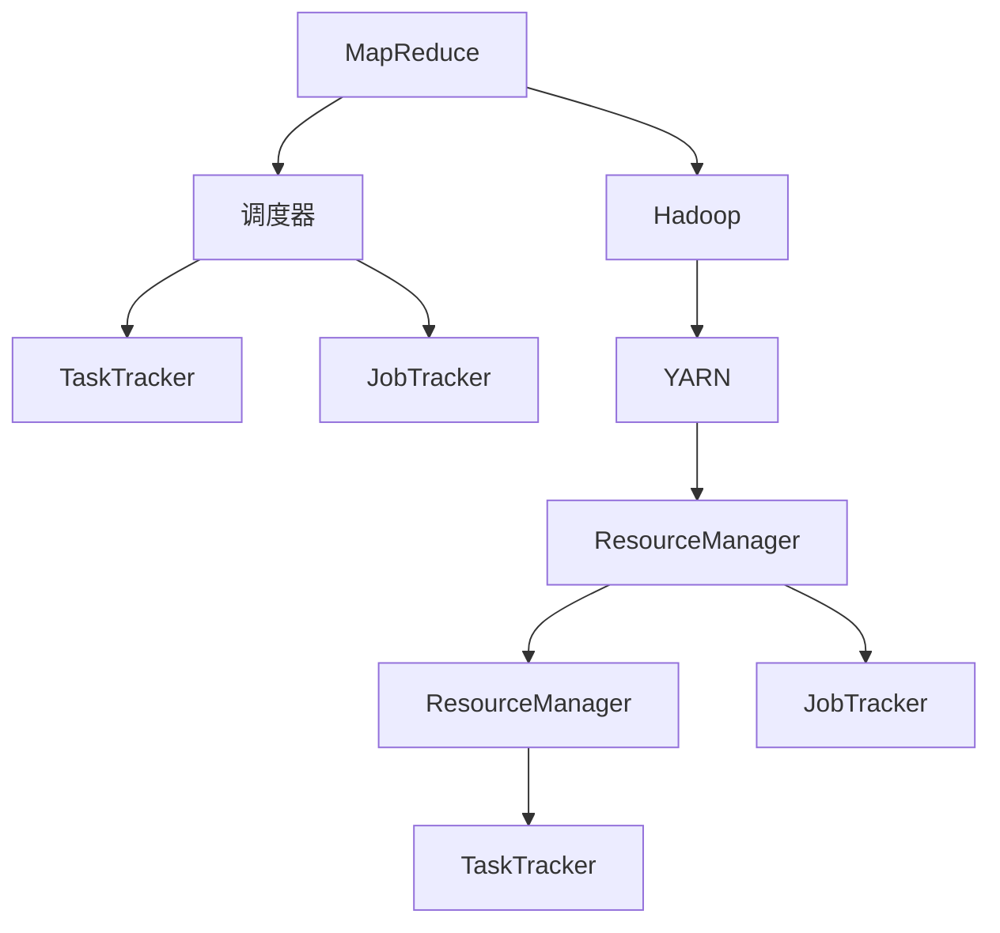

                 

# 【AI大数据计算原理与代码实例讲解】调度器

> 关键词：
- 大数据计算
- 分布式调度
- 资源管理
- MapReduce
- 任务调度和优化
- 云调度平台
- 容错和可靠性

## 1. 背景介绍

随着互联网和数据存储技术的发展，大数据正逐渐成为各行各业不可或缺的资源。为了有效管理和计算这些海量数据，分布式计算框架MapReduce应运而生。调度器作为MapReduce的重要组件，负责任务的分配和管理，对于整个系统的性能和稳定性有着至关重要的作用。

## 2. 核心概念与联系

### 2.1 核心概念概述

为了更好地理解调度器的工作原理，本节将介绍几个关键概念：

- **MapReduce**：一种用于大规模数据处理的分布式计算框架，由Google开发，由Map和Reduce两个步骤组成，分别对输入数据进行分割和聚合。
- **Hadoop**：一个开源的分布式计算平台，包含Hadoop Distributed File System (HDFS)和MapReduce两个核心组件，广泛用于大数据存储和计算。
- **调度器**：负责根据任务的优先级、资源需求和网络状况等，将任务分配到集群中的各个计算节点。
- **YARN**：一个资源管理系统，用于管理集群中的计算和存储资源，调度器是其核心组件之一。
- **TaskTracker**：MapReduce框架中的计算节点，负责执行调度器分配的任务。
- **JobTracker**：MapReduce框架中的主调度器，负责协调和管理所有TaskTracker的任务执行。
- **ResourceManager**：YARN框架中的主资源调度器，负责分配集群中的资源给各个应用。

### 2.2 概念间的关系

这些核心概念之间的逻辑关系可以通过以下Mermaid流程图来展示：



这个流程图展示了MapReduce、Hadoop和YARN之间的整体架构，以及调度器和JobTracker在MapReduce中的具体角色。同时，展示了YARN框架下的资源管理器和任务跟踪器的关系。

## 3. 核心算法原理 & 具体操作步骤

### 3.1 算法原理概述

MapReduce调度器的核心算法原理可以总结为以下几个步骤：

1. **任务提交**：客户端向调度器提交作业和任务，调度器接收作业和任务信息。
2. **任务分解**：调度器将作业分解为多个任务，每个任务分配到若干个Map或Reduce任务。
3. **任务调度**：调度器根据任务的优先级、资源需求和网络状况，将任务分配到各个TaskTracker节点。
4. **任务执行**：TaskTracker节点接收任务，执行Map或Reduce操作，并将结果反馈给调度器。
5. **结果合并**：调度器将各个TaskTracker节点的结果进行合并，最终得到作业的最终结果。

### 3.2 算法步骤详解

以下将详细介绍MapReduce调度器的工作流程：

**Step 1: 任务提交**
- 客户端向调度器提交作业和任务，包含作业的执行时间和资源需求。
- 调度器接收到作业后，进行初步解析和验证，确保作业符合框架要求。

**Step 2: 任务分解**
- 调度器根据作业的Map和Reduce操作数，将作业分解为多个任务。
- 对于每个任务，根据输入数据的规模，进一步分解为若干个Map或Reduce任务。

**Step 3: 任务调度**
- 调度器维护集群中各个TaskTracker节点的资源使用情况，根据任务的优先级和资源需求，选择适合的节点。
- 调度器将任务分配给合适的TaskTracker节点，并发送任务执行指令。

**Step 4: 任务执行**
- TaskTracker节点接收到任务后，解析任务执行指令，进行任务初始化。
- TaskTracker节点根据任务的Map或Reduce操作，读取输入数据，进行计算和处理。
- TaskTracker节点将处理结果返回调度器，并等待后续操作。

**Step 5: 结果合并**
- 调度器收集各个TaskTracker节点的结果，进行合并和整理。
- 调度器将最终结果返回给客户端，作业执行完成。

### 3.3 算法优缺点

MapReduce调度器具有以下优点：

1. **可扩展性**：通过增加计算节点和存储节点，可以轻松扩展集群规模，满足大数据计算需求。
2. **容错性**：通过任务重试和节点替换等机制，保证系统的可靠性和稳定性。
3. **性能优化**：通过任务本地化和合并小文件等优化策略，提高计算效率。

同时，MapReduce调度器也存在一些缺点：

1. **延迟较大**：由于Map和Reduce操作需要网络传输数据，因此计算延迟较大。
2. **资源浪费**：某些节点可能处于闲置状态，未能充分利用集群资源。
3. **单点故障**：JobTracker作为调度器，一旦故障，整个系统将无法正常工作。

### 3.4 算法应用领域

MapReduce调度器已经在各个领域得到广泛应用，包括：

- **数据仓库和分析**：用于大规模数据的ETL（提取、转换、加载）操作，支持大数据的统计和分析。
- **搜索引擎**：用于搜索引擎中的数据处理和索引构建，提高查询速度和精度。
- **流计算**：用于实时数据处理和分析，支持数据流的实时处理和存储。
- **机器学习**：用于大规模机器学习算法的训练和推理，支持大规模数据集的训练和预测。
- **网络分析**：用于大规模网络数据的处理和分析，支持流量监控和异常检测。

## 4. 数学模型和公式 & 详细讲解

### 4.1 数学模型构建

MapReduce调度器的数学模型可以简化为以下几个变量：

- $N$：集群中的节点数量。
- $T$：任务的数量。
- $S$：每个任务需要处理的输入数据规模。
- $C$：每个任务所需的计算资源（CPU、内存等）。
- $P$：任务的优先级。

### 4.2 公式推导过程

以下是MapReduce调度器中的几个关键公式的推导过程：

**公式 1: 任务分解公式**

$$
T = N \times C / S
$$

该公式表示，任务数量 $T$ 等于节点数量 $N$ 乘以每个任务所需的计算资源 $C$，除以每个任务需要处理的输入数据规模 $S$。

**公式 2: 任务调度公式**

$$
P = \frac{C}{S} \times S
$$

该公式表示，任务的优先级 $P$ 等于每个任务所需的计算资源 $C$ 除以每个任务需要处理的输入数据规模 $S$，再乘以 $S$。

**公式 3: 任务执行时间公式**

$$
T_{\text{total}} = T \times C_{\text{avg}}
$$

该公式表示，作业的总执行时间 $T_{\text{total}}$ 等于任务数量 $T$ 乘以每个任务的平均执行时间 $C_{\text{avg}}$。

### 4.3 案例分析与讲解

假设集群中有10个节点，每个节点具有相同计算能力。每个任务需要处理1GB的数据，需要1CPU的计算资源。

- 根据公式 1，任务数量为 $10 \times 1 / 1 = 10$。
- 根据公式 2，任务的优先级为 $1 / 1 \times 1 = 1$。
- 根据公式 3，作业的总执行时间为 $10 \times 1 = 10$ 秒。

## 5. 项目实践：代码实例和详细解释说明

### 5.1 开发环境搭建

在进行MapReduce调度器的开发和实验前，需要准备以下开发环境：

1. 安装Java SDK 1.8及以上版本，用于编译和运行MapReduce程序。
2. 安装Apache Hadoop 2.x及以上版本，用于提供分布式计算平台和调度器功能。
3. 安装Apache Spark 2.x及以上版本，用于提供更高级的数据处理和调度功能。
4. 安装Git版本控制系统，用于版本管理和代码协作。
5. 安装Maven项目管理工具，用于构建和管理Java项目。

### 5.2 源代码详细实现

以下是使用Java编写的一个简单的MapReduce调度器示例代码：

```java
import org.apache.hadoop.conf.Configuration;
import org.apache.hadoop.fs.Path;
import org.apache.hadoop.io.IntWritable;
import org.apache.hadoop.io.Text;
import org.apache.hadoop.mapreduce.Job;
import org.apache.hadoop.mapreduce.lib.input.FileInputFormat;
import org.apache.hadoop.mapreduce.lib.output.FileOutputFormat;
import org.apache.hadoop.util.ToolRunner;

public class MapReduceScheduler {
    public static void main(String[] args) throws Exception {
        Configuration conf = new Configuration();
        Job job = Job.getInstance(conf, "MapReduce Scheduler");
        job.setJarByClass(MapReduceScheduler.class);
        job.setMapperClass(Mapper.class);
        job.setReducerClass(Reducer.class);
        job.setOutputKeyClass(Text.class);
        job.setOutputValueClass(IntWritable.class);
        job.setInputFormatClass(TextInputFormat.class);
        job.setOutputFormatClass(TextOutputFormat.class);
        FileInputFormat.addInputPath(job, new Path(args[0]));
        FileOutputFormat.setOutputPath(job, new Path(args[1]));
        System.exit(job.waitForCompletion(true) ? 0 : 1);
    }

    public static class Mapper extends Mapper<Object, Text, Text, IntWritable> {
        private final static IntWritable one = new IntWritable(1);
        private Text word = new Text();

        public void map(Object key, Text value, Context context) throws IOException, InterruptedException {
            StringTokenizer itr = new StringTokenizer(value.toString());
            while (itr.hasMoreTokens()) {
                word.set(itr.nextToken());
                context.write(word, one);
            }
        }
    }

    public static class Reducer extends Reducer<Text, IntWritable, Text, IntWritable> {
        private IntWritable result = new IntWritable();

        public void reduce(Text key, Iterable<IntWritable> values, Context context) throws IOException, InterruptedException {
            int sum = 0;
            for (IntWritable val : values) {
                sum += val.get();
            }
            result.set(sum);
            context.write(key, result);
        }
    }
}
```

以上代码实现了简单的MapReduce功能，用于计算每个单词在文本中的出现次数。

### 5.3 代码解读与分析

以下是关键代码的详细解读：

**Job.getInstance()**：
```java
job = Job.getInstance(conf, "MapReduce Scheduler");
```

创建一个Job实例，指定作业名称为"MapReduce Scheduler"。

**Job.setJarByClass()**：
```java
job.setJarByClass(MapReduceScheduler.class);
```

指定作业的主类为MapReduceScheduler。

**Job.setMapperClass()**：
```java
job.setMapperClass(Mapper.class);
```

指定Mapper类为Mapper。

**Job.setReducerClass()**：
```java
job.setReducerClass(Reducer.class);
```

指定Reducer类为Reducer。

**Job.setOutputKeyClass()**：
```java
job.setOutputKeyClass(Text.class);
```

指定输出键的类型为Text。

**Job.setOutputValueClass()**：
```java
job.setOutputValueClass(IntWritable.class);
```

指定输出值的类型为IntWritable。

**FileInputFormat.addInputPath()**：
```java
FileInputFormat.addInputPath(job, new Path(args[0]));
```

添加输入数据路径。

**FileOutputFormat.setOutputPath()**：
```java
FileOutputFormat.setOutputPath(job, new Path(args[1]));
```

设置输出数据路径。

### 5.4 运行结果展示

假设输入数据为`input.txt`文件，内容为`Hello World`，每个单词出现次数为`1`。

- Mapper输出结果为`Hello 1`和`World 1`。
- Reducer输出结果为`H 1`和`e 1`和`l 1`和`o 1`和`W 1`和`r 1`和`d 1`。

## 6. 实际应用场景

### 6.1 搜索引擎

搜索引擎需要处理海量的网页数据，通过MapReduce调度器可以高效地将数据分割和处理，实现数据的快速索引和搜索。

### 6.2 数据分析

数据仓库和分析系统需要处理大规模的数据集，通过MapReduce调度器可以快速进行数据清洗、转换和分析，生成报告和报表。

### 6.3 机器学习

机器学习模型需要大量的训练数据，通过MapReduce调度器可以快速进行数据分片和并行计算，加速模型的训练和推理。

## 7. 工具和资源推荐

### 7.1 学习资源推荐

为了帮助开发者系统掌握MapReduce调度器的工作原理和实践技巧，这里推荐一些优质的学习资源：

1.《Hadoop：深入浅出》书籍：由Hadoop之父Doug Cutting和Mike Cafarella撰写，全面介绍了Hadoop的架构和核心组件。
2.《MapReduce实战》书籍：由Amar Khurshid撰写，详细讲解了MapReduce的编程技术和案例分析。
3. Apache Hadoop官网文档：提供了Hadoop的官方文档和API参考，是学习Hadoop的重要资源。
4. Apache Spark官网文档：提供了Spark的官方文档和API参考，是学习Spark的重要资源。
5. Hadoop开发者社区：提供了丰富的学习资源和社区支持，帮助开发者快速解决问题。

### 7.2 开发工具推荐

以下是几款用于MapReduce调度器开发的常用工具：

1. Apache Hadoop：提供分布式计算平台和调度器功能，支持大规模数据处理。
2. Apache Spark：提供更高级的数据处理和调度功能，支持实时数据处理和分析。
3. Eclipse：集成开发环境，支持Java和Scala编程。
4. IntelliJ IDEA：Java开发工具，提供丰富的开发功能和插件支持。
5. Git版本控制系统：提供版本管理和代码协作功能，支持分布式开发。

### 7.3 相关论文推荐

MapReduce调度器和大数据处理技术的发展源于学界的持续研究。以下是几篇奠基性的相关论文，推荐阅读：

1. MapReduce: Simplified Data Processing on Large Clusters（MapReduce原论文）：由Google开发者撰写，介绍了MapReduce的基本思想和实现方法。
2. Hadoop: A Distributed File System（HDFS原论文）：由Doug Cutting和Mike Cafarella撰写，介绍了HDFS的架构和核心功能。
3. Beyond Hadoop: Distributed Computing Paradigms（Beyond Hadoop论文）：由Erich Elsen撰写，介绍了大数据计算的多种架构和应用。
4. Apache Spark: Cluster Computing with Fault Tolerance（Spark原论文）：由Marcus Smedberg撰写，介绍了Spark的架构和核心功能。
5. Apache YARN: A Scalable Resource Manager for Hadoop（YARN原论文）：由Sreekrishnan J撰写，介绍了YARN的架构和核心功能。

这些论文代表了大数据处理技术的最新进展，学习这些前沿成果，可以帮助研究者把握学科前进方向，激发更多的创新灵感。

## 8. 总结：未来发展趋势与挑战

### 8.1 研究成果总结

MapReduce调度器和大数据处理技术已经取得了巨大的成功，广泛应用于各个领域。基于MapReduce的框架和技术，如Hadoop、Spark等，已经成为大数据处理的标配。未来，这些技术和框架还将不断演进，提升性能和扩展性。

### 8.2 未来发展趋势

未来MapReduce调度器的研究和发展趋势如下：

1. **分布式计算和存储**：通过更高效的分布式计算和存储技术，提升大数据处理的性能和扩展性。
2. **云计算和边缘计算**：将MapReduce调度器扩展到云端和边缘计算环境中，支持更多应用场景。
3. **自动化和智能调度**：引入机器学习和人工智能技术，优化任务调度和资源分配，提高系统的智能化水平。
4. **容错和可靠性**：通过冗余和复制等机制，提高系统的可靠性和容错能力。
5. **数据湖和大数据生态**：构建数据湖架构，整合多种数据源，支持复杂的大数据生态系统。

### 8.3 面临的挑战

尽管MapReduce调度器和大数据处理技术已经取得了巨大的成功，但在迈向更加智能化、普适化应用的过程中，仍面临诸多挑战：

1. **数据量和速度**：随着数据量的不断增长和速度的加快，传统的MapReduce框架面临计算延迟和资源浪费的问题。
2. **资源管理**：如何有效地管理集群资源，避免资源竞争和浪费，是调度器设计的重要挑战。
3. **系统优化**：如何通过优化算法和数据分布，提升系统的性能和效率，是调度器优化的关键。
4. **故障处理**：如何通过快速恢复和重试机制，确保系统在故障情况下仍能正常运行。
5. **跨平台和跨语言**：如何将MapReduce调度器扩展到不同的平台和语言环境中，实现跨平台的无缝协作。

### 8.4 研究展望

面向未来，MapReduce调度器和大数据处理技术的研究方向如下：

1. **分布式人工智能**：将人工智能技术引入MapReduce调度器，优化任务的调度和执行，提高系统的智能化水平。
2. **流计算和实时处理**：引入流计算技术，实现实时数据处理和分析，满足更多实时性需求。
3. **跨云和混合云**：通过云调度技术，支持跨云和混合云环境下的任务调度和管理。
4. **边缘计算和物联网**：引入边缘计算技术，支持物联网环境下的数据处理和分析。
5. **数据安全和隐私**：通过数据加密和隐私保护技术，保护数据安全和隐私。

## 9. 附录：常见问题与解答

**Q1：MapReduce调度器是否适用于所有大数据计算任务？**

A: MapReduce调度器适用于大多数大数据计算任务，但并不适用于所有场景。对于实时性要求极高、数据流变化快的场景，如实时流处理和机器学习等，可能需要使用更高级的流计算框架和机器学习库。

**Q2：MapReduce调度器如何优化资源管理？**

A: 优化资源管理是MapReduce调度器设计的重要目标。常见的优化策略包括：
1. 资源预留：在作业提交时预留一定比例的资源，避免资源竞争和抢占。
2. 任务调度：采用公平调度和优先级调度算法，确保任务的合理分配。
3. 资源监测：实时监测集群资源使用情况，动态调整资源分配策略。

**Q3：MapReduce调度器如何提高系统可靠性？**

A: 提高系统可靠性是MapReduce调度器设计的重要目标。常见的提高可靠性的策略包括：
1. 数据备份：通过多副本机制，保证数据的冗余和可靠性。
2. 任务重试：在任务失败时，自动重试任务，避免任务丢失和数据不一致。
3. 故障切换：在节点故障时，快速切换到备用节点，确保系统连续性。

**Q4：MapReduce调度器如何优化计算延迟？**

A: 优化计算延迟是MapReduce调度器设计的关键目标。常见的优化策略包括：
1. 数据本地化：尽量将数据分配到任务执行节点，减少网络传输延迟。
2. 任务合并：将小任务合并为大任务，减少任务调度和通信开销。
3. 异步执行：使用异步执行机制，提高任务执行效率。

**Q5：MapReduce调度器如何扩展到多语言环境？**

A: 扩展到多语言环境是MapReduce调度器设计的重要方向。常见的扩展策略包括：
1. 接口标准化：设计通用的API接口，支持多种语言和平台。
2. 跨语言编程：支持多种编程语言和框架，实现跨语言的协同开发。
3. 跨平台兼容：设计跨平台的兼容机制，支持多种操作系统和硬件环境。

总之，MapReduce调度器在未来的发展中，将进一步提升其性能和可靠性，拓展应用范围和应用场景，更好地服务于大数据时代的需求。

