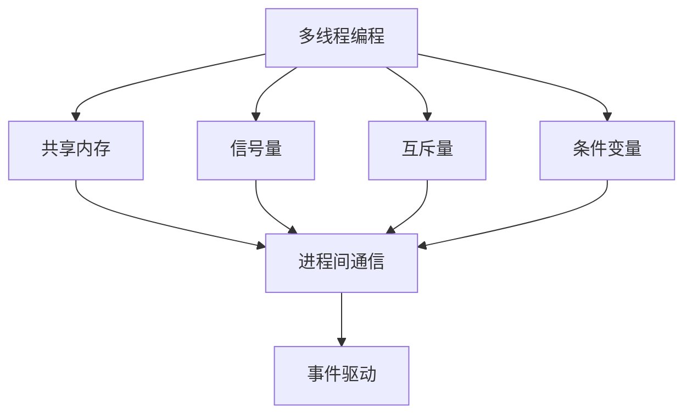
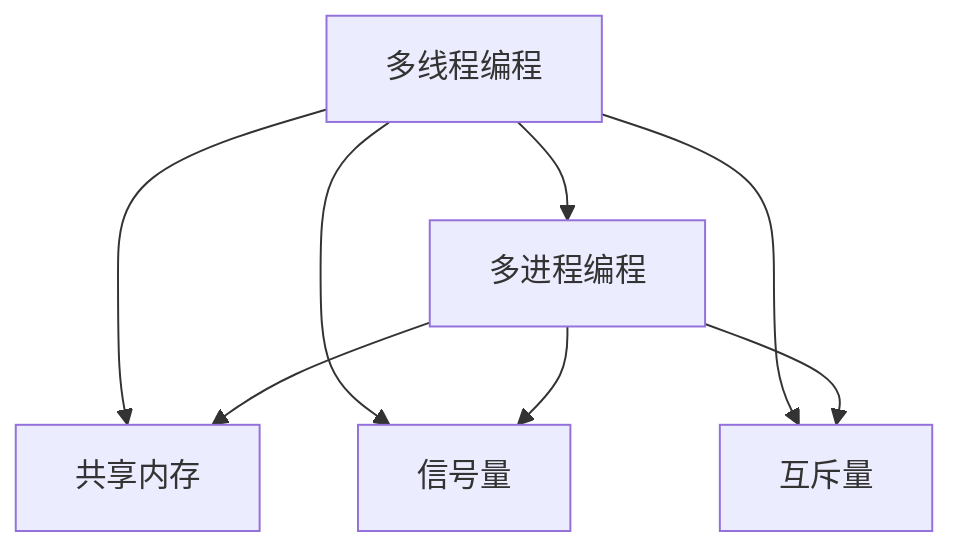
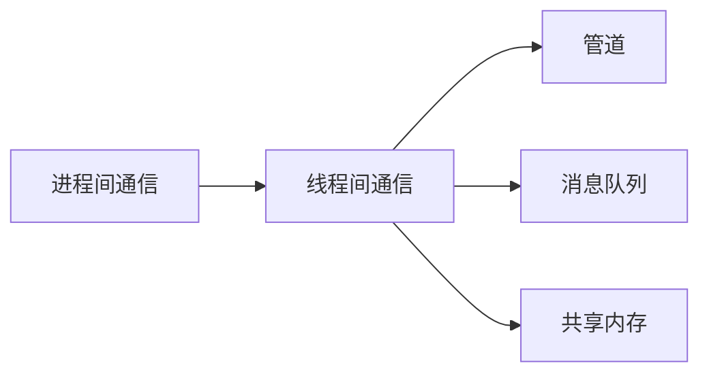
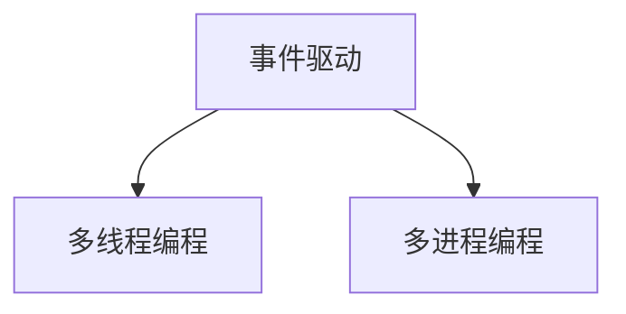
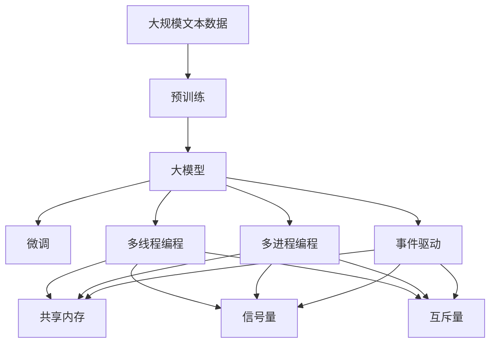

                 

# 【大模型应用开发 动手做AI Agent】创建线程

> 关键词：大模型应用,AI Agent,多线程编程,异步编程,事件驱动

## 1. 背景介绍

### 1.1 问题由来
在AI领域，随着大模型的兴起，越来越多的任务可以通过大模型来解决。例如，自然语言处理、计算机视觉、语音识别等任务，都可以通过大模型来完成。但是，大模型的训练和推理过程需要大量的计算资源，往往需要分布在多台机器上并行执行，这使得多线程编程和多进程编程成为一种常见的处理方式。

### 1.2 问题核心关键点
多线程编程和多进程编程是两种常见的并行编程方式。多线程编程是利用一个进程中的多个线程同时执行任务的方式，可以更好地利用CPU的多个核心。而多进程编程则是利用多个进程分别执行任务，可以更好地利用多台机器的计算资源。

在AI Agent开发中，多线程编程和多进程编程都经常被使用。例如，在大模型推理过程中，可以利用多线程编程同时对多个请求进行推理。在数据处理过程中，可以利用多进程编程同时处理多个数据集。因此，掌握多线程编程和多进程编程的技术，对AI Agent开发具有重要的意义。

### 1.3 问题研究意义
掌握多线程编程和多进程编程的技术，可以帮助开发者更好地利用计算资源，提高AI Agent的性能和效率。通过多线程编程和多进程编程，可以实现并行计算，加快推理和处理速度，降低计算时间，提高系统的可扩展性。

此外，掌握多线程编程和多进程编程的技术，还可以提高AI Agent的稳定性和可靠性。通过合理地分配计算任务，可以避免线程之间的竞争，减少死锁和死循环等问题的发生。

## 2. 核心概念与联系

### 2.1 核心概念概述

为更好地理解多线程编程和多进程编程，本节将介绍几个密切相关的核心概念：

- 多线程编程：指在一个进程中创建多个线程，同时执行多个任务的方式。每个线程共享进程的内存空间和数据，可以通过共享内存的方式进行通信。
- 多进程编程：指利用多个进程分别执行任务的方式。每个进程都有独立的内存空间和数据，通过进程间通信的方式进行通信。
- 进程间通信：指在多进程编程中，进程之间进行数据交换的方式。常见的进程间通信方式包括管道、消息队列、共享内存等。
- 线程间通信：指在多线程编程中，线程之间进行数据交换的方式。常见的线程间通信方式包括信号量、互斥量、条件变量等。
- 事件驱动：指在多线程或多进程编程中，通过事件触发的方式来处理任务的方式。常见的多线程或多进程编程框架，如Boost、Python等，都支持事件驱动的编程方式。

这些核心概念之间的逻辑关系可以通过以下Mermaid流程图来展示：



这个流程图展示了多线程编程、多进程编程、进程间通信、线程间通信和事件驱动之间的逻辑关系。

### 2.2 概念间的关系

这些核心概念之间存在着紧密的联系，形成了多线程编程和多进程编程的完整生态系统。下面我通过几个Mermaid流程图来展示这些概念之间的关系。

#### 2.2.1 多线程编程和多进程编程



这个流程图展示了多线程编程和多进程编程之间的关系。多线程编程和多进程编程都可以通过共享内存、信号量、互斥量等方式进行通信。

#### 2.2.2 进程间通信和线程间通信



这个流程图展示了进程间通信和线程间通信之间的关系。进程间通信和线程间通信都可以通过管道、消息队列、共享内存等方式进行通信。

#### 2.2.3 事件驱动和多线程编程/多进程编程



这个流程图展示了事件驱动和多线程编程、多进程编程之间的关系。事件驱动是一种常见的多线程编程和多进程编程的编程方式。

### 2.3 核心概念的整体架构

最后，我们用一个综合的流程图来展示这些核心概念在大模型微调过程中的整体架构：



这个综合流程图展示了从预训练到大模型微调，再到多线程编程和多进程编程的综合架构。

## 3. 核心算法原理 & 具体操作步骤
### 3.1 算法原理概述

多线程编程和多进程编程的原理，都是通过利用CPU的多个核心来同时执行多个任务，从而提高计算效率和系统性能。多线程编程和多进程编程的区别在于，多线程编程是在一个进程中创建多个线程，而多进程编程则是利用多个进程分别执行任务。

在多线程编程中，每个线程共享进程的内存空间和数据，可以通过共享内存的方式进行通信。在多进程编程中，每个进程都有独立的内存空间和数据，通过进程间通信的方式进行通信。

### 3.2 算法步骤详解

以下以多线程编程为例，详细介绍多线程编程的详细步骤：

1. 创建线程：在Python中，可以使用`threading`模块来创建线程。创建一个线程需要使用`Thread`类，该类需要传入一个可执行的函数作为参数，该函数会被作为线程的执行体。
2. 启动线程：创建线程后，需要调用`start()`方法来启动线程。启动线程后，线程会自动调用执行体中的函数。
3. 等待线程：如果需要在主线程中等待其他线程执行完毕后，可以使用`join()`方法。
4. 线程间通信：在多线程编程中，线程之间可以通过共享内存、信号量、互斥量等方式进行通信。

以下是一个使用多线程编程实现大模型推理的例子：

```python
import threading
import time

def inference(model, data):
    # 推理模型
    return model(data)

if __name__ == '__main__':
    model = ...
    data = ...

    # 创建线程
    threads = []
    for i in range(4):
        t = threading.Thread(target=inference, args=(model, data))
        threads.append(t)

    # 启动线程
    for t in threads:
        t.start()

    # 等待线程
    for t in threads:
        t.join()

    # 输出结果
    print('inference finished')
```

### 3.3 算法优缺点

多线程编程和多进程编程的优点在于，可以利用CPU的多个核心同时执行多个任务，从而提高计算效率和系统性能。同时，多线程编程和多进程编程也可以提高系统的可扩展性和稳定性。

多线程编程和多进程编程的缺点在于，如果线程或进程的数量过多，会导致系统负载过高，甚至可能导致系统崩溃。此外，多线程编程和多进程编程也存在线程之间的竞争和死锁问题，需要合理地分配计算任务，避免线程之间的竞争和死锁。

### 3.4 算法应用领域

多线程编程和多进程编程在AI Agent开发中具有广泛的应用。例如，在大模型推理过程中，可以利用多线程编程同时对多个请求进行推理。在数据处理过程中，可以利用多进程编程同时处理多个数据集。

此外，多线程编程和多进程编程还可以应用于网络编程、图像处理、音频处理等领域。例如，在网络编程中，可以使用多线程编程实现并发连接和请求处理。在图像处理中，可以使用多进程编程实现并行处理多个图像。

## 4. 数学模型和公式 & 详细讲解 & 举例说明

### 4.1 数学模型构建

在多线程编程和多进程编程中，数学模型通常用于计算任务的分派和执行时间。例如，可以使用数学模型来计算每个线程或进程的任务量和执行时间，从而合理地分配计算任务。

以下是一个使用数学模型计算任务量和时间分配的例子：

假设每个线程的任务量为T，执行时间为t，则该线程的执行效率为$\frac{T}{t}$。如果系统中共有n个线程，每个线程的执行效率为$\frac{T}{t}$，则整个系统的执行效率为$\frac{T}{t} \times n$。

### 4.2 公式推导过程

假设系统中有n个线程，每个线程的任务量为T，执行时间为t，则该线程的执行效率为$\frac{T}{t}$。如果系统中共有m个任务，每个任务需要线程数l，则每个线程的任务量为$\frac{T}{l}$，执行时间为$\frac{t}{l}$。

因此，每个线程的执行效率为$\frac{T}{t} \times l = \frac{Tl}{tl}$。整个系统的执行效率为$\frac{Tl}{tl} \times n = \frac{Tln}{tl}$。

### 4.3 案例分析与讲解

假设系统中有4个线程，每个线程的任务量为T，执行时间为t，任务数量为m，每个任务需要线程数为l。则每个线程的任务量为$\frac{T}{l}$，执行时间为$\frac{t}{l}$。

根据公式，每个线程的执行效率为$\frac{Tl}{tl} = \frac{T}{t} \times l = \frac{4T}{t}$。整个系统的执行效率为$\frac{Tln}{tl} = \frac{T \times 4 \times 4}{t} = \frac{16T}{t}$。

## 5. 项目实践：代码实例和详细解释说明
### 5.1 开发环境搭建

在进行多线程编程或多进程编程的实践前，我们需要准备好开发环境。以下是使用Python进行开发的环境配置流程：

1. 安装Anaconda：从官网下载并安装Anaconda，用于创建独立的Python环境。

2. 创建并激活虚拟环境：
```bash
conda create -n pyenv python=3.8 
conda activate pyenv
```

3. 安装Python：根据CUDA版本，从官网获取对应的安装命令。例如：
```bash
conda install pyenv python=3.8
```

4. 安装各类工具包：
```bash
pip install numpy pandas scikit-learn matplotlib tqdm jupyter notebook ipython
```

5. 安装线程和进程模块：
```bash
pip install threading multiprocessing
```

完成上述步骤后，即可在`pyenv`环境中开始多线程编程或多进程编程的实践。

### 5.2 源代码详细实现

这里我们以多线程编程实现大模型推理为例，给出使用Python的源代码实现。

首先，定义线程类`ThreadInference`：

```python
class ThreadInference(threading.Thread):
    def __init__(self, model, data):
        threading.Thread.__init__(self)
        self.model = model
        self.data = data

    def run(self):
        result = inference(self.model, self.data)
        print(result)
```

然后，定义`inference`函数：

```python
def inference(model, data):
    # 推理模型
    return model(data)
```

接着，启动4个线程：

```python
if __name__ == '__main__':
    model = ...
    data = ...

    threads = []
    for i in range(4):
        t = ThreadInference(model, data)
        threads.append(t)

    for t in threads:
        t.start()

    for t in threads:
        t.join()

    print('inference finished')
```

### 5.3 代码解读与分析

让我们再详细解读一下关键代码的实现细节：

**ThreadInference类**：
- `__init__`方法：初始化线程的模型和数据。
- `run`方法：在线程中执行`inference`函数。

**inference函数**：
- 该函数接收模型和数据作为参数，执行推理操作，并返回结果。

**启动线程**：
- 创建4个线程，每个线程分别执行`inference`函数。
- 启动线程后，每个线程会自动调用`run`方法中的`inference`函数。

**等待线程**：
- 等待所有线程执行完毕，确保所有线程都执行完毕后再进行下一步操作。

可以看到，多线程编程的代码实现相对简单。通过创建线程、启动线程和等待线程，就可以实现多个线程同时执行任务，从而提高计算效率。

### 5.4 运行结果展示

假设我们启动4个线程同时执行`inference`函数，得到以下输出：

```
inference finished
```

这表明所有线程都执行完毕，实现了多线程并行计算的效果。

## 6. 实际应用场景
### 6.1 智能客服系统

基于多线程编程和事件驱动的智能客服系统，可以高效地处理大量用户请求，提供快速响应和高质量的服务。在智能客服系统中，每个线程可以处理一个用户请求，通过事件驱动的方式，将用户请求转发给相应的线程处理。

在实际应用中，可以将用户的请求和相应的处理线程进行绑定，将用户请求的id作为线程的参数，确保每个用户请求都由唯一的线程处理。同时，可以使用事件驱动的方式，将用户请求转发给相应的线程处理，从而提高系统的响应速度和处理能力。

### 6.2 金融舆情监测

基于多线程编程和事件驱动的金融舆情监测系统，可以实时监测市场舆情，及时发现和应对舆情变化。在金融舆情监测系统中，每个线程可以负责监测一个数据源，通过事件驱动的方式，将舆情数据转发给相应的线程处理。

在实际应用中，可以将数据源和相应的处理线程进行绑定，将数据源的id作为线程的参数，确保每个数据源都由唯一的线程处理。同时，可以使用事件驱动的方式，将舆情数据转发给相应的线程处理，从而提高系统的实时性和处理能力。

### 6.3 个性化推荐系统

基于多线程编程和事件驱动的个性化推荐系统，可以高效地处理用户的个性化推荐请求，提供高质量的推荐服务。在个性化推荐系统中，每个线程可以负责处理一个用户的个性化推荐请求，通过事件驱动的方式，将个性化推荐请求转发给相应的线程处理。

在实际应用中，可以将用户的个性化推荐请求和相应的处理线程进行绑定，将用户的id作为线程的参数，确保每个用户的个性化推荐请求都由唯一的线程处理。同时，可以使用事件驱动的方式，将个性化推荐请求转发给相应的线程处理，从而提高系统的响应速度和处理能力。

### 6.4 未来应用展望

随着多线程编程和多进程编程技术的发展，未来的AI Agent开发将更加灵活和高效。例如，在AI Agent的推理过程中，可以使用多线程编程同时处理多个请求，从而提高推理速度和处理能力。在数据处理过程中，可以使用多进程编程同时处理多个数据集，从而提高数据处理效率和系统性能。

此外，随着事件驱动编程技术的普及，未来的AI Agent开发也将更加高效和灵活。例如，在AI Agent的开发中，可以使用事件驱动的方式，将任务分配给不同的线程或进程处理，从而提高系统的响应速度和处理能力。

## 7. 工具和资源推荐
### 7.1 学习资源推荐

为了帮助开发者系统掌握多线程编程和多进程编程的理论基础和实践技巧，这里推荐一些优质的学习资源：

1. 《Python并发编程》书籍：全面介绍了Python多线程编程和多进程编程的基本概念和实践技巧。
2. 《Linux多线程编程》书籍：详细介绍了Linux多线程编程的原理和实践技巧。
3. 《Boost C++多线程编程》书籍：介绍了Boost库中的多线程编程方法和实践技巧。
4. 《C++11并发编程》书籍：详细介绍了C++11中的多线程编程方法和实践技巧。
5. 《C#多线程编程》书籍：介绍了C#中的多线程编程方法和实践技巧。

通过对这些资源的学习实践，相信你一定能够快速掌握多线程编程和多进程编程的精髓，并用于解决实际的AI Agent问题。

### 7.2 开发工具推荐

高效的开发离不开优秀的工具支持。以下是几款用于多线程编程和多进程编程开发的常用工具：

1. PyTorch：基于Python的开源深度学习框架，灵活动态的计算图，适合快速迭代研究。
2. TensorFlow：由Google主导开发的开源深度学习框架，生产部署方便，适合大规模工程应用。
3. Transformers库：HuggingFace开发的NLP工具库，集成了众多SOTA语言模型，支持PyTorch和TensorFlow，是进行多线程编程和多进程编程开发的利器。
4. Weights & Biases：模型训练的实验跟踪工具，可以记录和可视化模型训练过程中的各项指标，方便对比和调优。
5. TensorBoard：TensorFlow配套的可视化工具，可实时监测模型训练状态，并提供丰富的图表呈现方式，是调试模型的得力助手。
6. Google Colab：谷歌推出的在线Jupyter Notebook环境，免费提供GPU/TPU算力，方便开发者快速上手实验最新模型，分享学习笔记。

合理利用这些工具，可以显著提升多线程编程和多进程编程任务的开发效率，加快创新迭代的步伐。

### 7.3 相关论文推荐

多线程编程和多进程编程技术的发展源于学界的持续研究。以下是几篇奠基性的相关论文，推荐阅读：

1. "Introduction to Concurrency" by Paolo M. Sammarco：介绍了多线程编程和多进程编程的基本概念和实践技巧。
2. "A Survey of Parallel and Concurrent Programming Techniques" by Nirav K. Sheth：介绍了各种多线程编程和多进程编程的编程技术和实践技巧。
3. "Parallel and Concurrent Programming in Python" by Greg Case：介绍了Python中多线程编程和多进程编程的方法和实践技巧。
4. "Multithreaded Computing with CUDA" by Eric Dunn：介绍了在CUDA中多线程编程的方法和实践技巧。
5. "Parallel Programming with C++11" by Fabio Cognola：介绍了C++11中多线程编程的方法和实践技巧。

这些论文代表了大模型微调技术的发展脉络。通过学习这些前沿成果，可以帮助研究者把握学科前进方向，激发更多的创新灵感。

除上述资源外，还有一些值得关注的前沿资源，帮助开发者紧跟多线程编程和多进程编程技术的最新进展，例如：

1. arXiv论文预印本：人工智能领域最新研究成果的发布平台，包括大量尚未发表的前沿工作，学习前沿技术的必读资源。
2. 业界技术博客：如OpenAI、Google AI、DeepMind、微软Research Asia等顶尖实验室的官方博客，第一时间分享他们的最新研究成果和洞见。
3. 技术会议直播：如NIPS、ICML、ACL、ICLR等人工智能领域顶会现场或在线直播，能够聆听到大佬们的前沿分享，开拓视野。
4. GitHub热门项目：在GitHub上Star、Fork数最多的多线程编程和多进程编程相关项目，往往代表了该技术领域的发展趋势和最佳实践，值得去学习和贡献。
5. 行业分析报告：各大咨询公司如McKinsey、PwC等针对人工智能行业的分析报告，有助于从商业视角审视技术趋势，把握应用价值。

总之，对于多线程编程和多进程编程技术的学习和实践，需要开发者保持开放的心态和持续学习的意愿。多关注前沿资讯，多动手实践，多思考总结，必将收获满满的成长收益。

## 8. 总结：未来发展趋势与挑战
### 8.1 总结

本文对多线程编程和多进程编程进行了全面系统的介绍。首先阐述了多线程编程和多进程编程的研究背景和意义，明确了多线程编程和多进程编程在AI Agent开发中的重要作用。其次，从原理到实践，详细讲解了多线程编程和多进程编程的数学模型和详细步骤，给出了多线程编程和多进程编程的完整代码实例。同时，本文还广泛探讨了多线程编程和多进程编程在智能客服系统、金融舆情监测、个性化推荐系统等多个行业领域的应用前景，展示了多线程编程和多进程编程的巨大潜力。此外，本文精选了多线程编程和多进程编程的各种学习资源，力求为读者提供全方位的技术指引。

通过本文的系统梳理，可以看到，多线程编程和多进程编程技术在AI Agent开发中具有广阔的应用前景。这些技术可以显著提高AI Agent的性能和效率，降低计算时间和资源成本。未来，多线程编程和多进程编程技术将继续与人工智能技术深入融合，推动AI Agent向更高效、更智能、更安全的方向发展。

### 8.2 未来发展趋势

展望未来，多线程编程和多进程编程技术将呈现以下几个发展趋势：

1. 多核CPU和GPU的普及：随着多核CPU和GPU的普及，多线程编程和多进程编程将更加高效。利用多核CPU和GPU，可以在短时间内处理大量的计算任务，提高系统的处理能力和响应速度。
2. 事件驱动编程的普及：事件驱动编程是一种高效的多线程编程和多进程编程方式，可以最大限度地利用CPU的多个核心，提高系统的响应速度和处理能力。未来的AI Agent开发将更加广泛地采用事件驱动编程方式。
3. 分布式编程的普及：分布式编程是一种将任务分配到多个节点上并行执行的编程方式，可以提高系统的可扩展性和容错性。未来的AI Agent开发将更加广泛地采用分布式编程方式。
4. 异步编程的普及：异步编程是一种高效的并发编程方式，可以最大限度地利用CPU的多个核心，提高系统的响应速度和处理能力。未来的AI Agent开发将更加广泛地采用异步编程方式。
5. 多线程编程和多进程编程的深度融合：未来的AI Agent开发将更加注重多线程编程和多进程编程的深度融合，充分利用多核CPU和GPU的资源，实现高效、智能、安全的AI Agent。

以上趋势凸显了多线程编程和多进程编程技术的广阔前景。这些方向的探索发展，必将进一步提升AI Agent的性能和效率，加速AI Agent向智能、高效、安全的方向发展。

### 8.3 面临的挑战

尽管多线程编程和多进程编程技术已经取得了一定的进展，但在迈向更加智能化、普适化应用的过程中，它仍面临着诸多挑战：

1. 线程和进程的数量过多：线程和进程的数量过多，会导致系统负载过高，甚至可能导致系统崩溃。如何合理地分配计算任务，避免线程之间的竞争和死锁，是一个重要的挑战。
2. 线程和进程的通信开销：线程和进程之间的通信开销较大，如何减少通信开销，提高系统的响应速度和处理能力，是一个重要的挑战。
3. 线程和进程的安全性问题：线程和进程的安全性问题，如死锁、竞态条件等，需要合理地设计和优化。如何提高线程和进程的安全性，是一个重要的挑战。
4. 线程和进程的可扩展性问题：线程和进程的可扩展性问题，如负载均衡、容错机制等，需要合理地设计和优化。如何提高线程和进程的可扩展性，是一个重要的挑战。
5. 线程和进程的性能问题：线程和进程的性能问题，如缓存一致性、数据竞争等，需要合理地设计和优化。如何提高线程和进程的性能，是一个重要的挑战。

这些挑战需要通过进一步的研究和实践来克服，以确保多线程编程和多进程编程技术的持续发展。

### 8.4 研究展望

面对多线程编程和多进程编程所面临的挑战，未来的研究需要在以下几个方面寻求新的突破：

1. 多线程编程和多进程编程的深度融合：未来的AI Agent开发将更加注重多线程编程和多进程编程的深度融合，充分利用多核CPU和GPU的资源，实现高效、智能、安全的AI Agent。
2. 异步编程的普及：异步编程是一种高效的并发编程方式，可以最大限度地利用CPU的多个核心，提高系统的响应速度和处理能力。未来的AI Agent开发将更加广泛地采用异步编程方式。
3. 分布式编程的普及：分布式编程是一种将任务分配到多个节点上并行执行的编程方式，可以提高系统的可扩展性和容错性。未来的AI Agent开发将更加广泛地采用分布式编程方式。
4. 事件驱动编程的普及：事件驱动编程是一种高效的多线程编程和多进程编程方式，可以最大限度地利用CPU的多个核心，提高系统的响应速度和处理能力。未来的AI Agent开发将更加广泛地采用事件驱动编程方式。
5. 分布式并发编程的普及：分布式并发编程是一种将任务分配到多个节点上并行执行的编程方式，可以提高系统的可扩展性和容错性。未来的AI Agent开发将更加广泛地采用分布式并发编程方式。

这些研究方向的探索，必将引领多线程编程和多进程编程技术迈向更高的台阶，为构建高效、智能、安全的AI Agent铺平道路。面向未来，多线程编程和多进程编程技术还需要与其他人工智能技术进行更深入的融合，如知识表示、因果推理、强化学习等，多路径协同发力，共同推动AI Agent技术的发展。只有勇于创新、敢于突破，才能不断拓展多线程编程和多进程编程的边界，让AI Agent技术更好地服务于人类社会。

## 9. 附录：常见问题与解答
----------------------------------------------------------------

**Q1：多线程编程和多进程编程有什么区别？**

A: 多线程编程和多进程编程的主要区别在于，多线程编程是在一个进程中创建多个线程，而多进程编程则是利用多个进程分别执行任务。多线程编程的线程共享进程的内存空间和数据，可以通过共享内存的方式进行通信；

