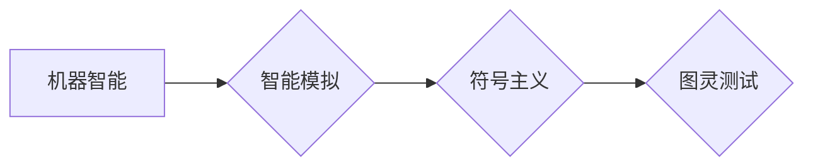

# 1956年达特茅斯会议：智能化时代的强音

> 关键词：达特茅斯会议，人工智能，图灵测试，智能化，机器学习，符号主义，连接主义，计算机科学，认知科学

## 1. 背景介绍

### 1.1 会议的由来

1956年，美国新罕布什尔州达特茅斯学院举办了一次历史性的会议，被称为“达特茅斯会议”。这次会议是人工智能（Artificial Intelligence, AI）领域的里程碑事件，因为它标志着人工智能作为一个独立研究领域的正式诞生。

### 1.2 会议的背景

在20世纪中叶，计算机科学和数学的快速发展为人工智能的兴起提供了肥沃的土壤。图灵在1950年提出的图灵测试成为评估机器智能的标志性概念。此外，当时的计算机科学家们开始探讨如何使机器模拟人类的智能行为。

### 1.3 会议的意义

达特茅斯会议的召开，不仅汇聚了当时的计算机科学、数学、心理学等领域的顶尖学者，而且还确立了人工智能研究的基本目标和研究方向。会议的成果对后来的AI发展产生了深远的影响。

## 2. 核心概念与联系

### 2.1 核心概念

达特茅斯会议提出了几个核心概念，包括：

- 机器智能：使机器能够执行需要人类智能的任务。
- 智能模拟：通过计算机程序模拟人类智能行为。
- 符号主义：认为智能行为可以通过对符号的操纵来模拟。

### 2.2 Mermaid 流程图

以下是用 Mermaid 语言绘制的达特茅斯会议核心概念流程图：



### 2.3 核心概念联系

达特茅斯会议的核心概念之间存在着密切的联系。机器智能的目标是通过智能模拟来实现，而符号主义是实现智能模拟的一种方法。图灵测试则是评估智能模拟是否成功的标准。

## 3. 核心算法原理 & 具体操作步骤

### 3.1 算法原理概述

达特茅斯会议期间，学者们探讨了多种实现机器智能的算法原理，包括：

- 推理：基于逻辑和规则进行推理。
- 学习：通过数据学习新的知识和技能。
- 演绎：从一般到特殊的推理过程。

### 3.2 算法步骤详解

以下是实现机器智能的基本步骤：

1. 定义问题：明确机器需要解决的问题。
2. 设计算法：选择合适的算法原理和模型。
3. 编程实现：将算法原理转化为计算机程序。
4. 训练模型：使用数据集训练模型参数。
5. 评估模型：使用测试数据评估模型性能。

### 3.3 算法优缺点

#### 优点

- 理论基础扎实：基于逻辑和数学原理，具有较强的理论支持。
- 应用广泛：可用于各种智能任务，如问答系统、专家系统等。

#### 缺点

- 计算量大：需要大量的计算资源进行训练。
- 可扩展性差：难以适应复杂和动态的环境。

### 3.4 算法应用领域

达特茅斯会议提出的算法原理和模型在多个领域得到了应用，如：

- 专家系统：模拟专家解决问题的能力。
- 逻辑推理：基于逻辑规则进行推理和决策。
- 自然语言处理：理解和生成自然语言。

## 4. 数学模型和公式 & 详细讲解 & 举例说明

### 4.1 数学模型构建

达特茅斯会议期间，学者们开始构建数学模型来描述智能行为，如：

- 神经网络：模拟人脑神经元连接的数学模型。
- 推理引擎：基于逻辑规则的推理模型。

### 4.2 公式推导过程

以下是一个简单的神经网络模型公式：

$$
y = f(W \cdot x + b)
$$

其中，$y$ 为输出，$W$ 为权重，$x$ 为输入，$b$ 为偏置，$f$ 为激活函数。

### 4.3 案例分析与讲解

以下是一个简单的逻辑推理案例：

**问题**：如果下雨，则地面湿润。今天没有下雨，那么地面是干燥的。

**推理过程**：

1. 假设下雨为 A，地面湿润为 B，不下雨为 ¬A。
2. 根据前提条件，得到逻辑规则：A → B。
3. 今天没有下雨，即 ¬A。
4. 根据逻辑规则，推出 ¬A → ¬B。
5. 因此，今天地面是干燥的。

## 5. 项目实践：代码实例和详细解释说明

### 5.1 开发环境搭建

为了演示达特茅斯会议提出的算法原理，我们将使用 Python 编写一个简单的逻辑推理程序。

### 5.2 源代码详细实现

以下是一个简单的逻辑推理程序：

```python
def and_gate(x1, x2):
    return x1 and x2

def or_gate(x1, x2):
    return x1 or x2

def not_gate(x):
    return not x

# 使用逻辑门进行推理
print("Input 1: True, Input 2: False")
print("Output:", and_gate(True, False))  # 输出：False

print("Input 1: True, Input 2: False")
print("Output:", or_gate(True, False))   # 输出：True

print("Input 1: True")
print("Output:", not_gate(True))          # 输出：False
```

### 5.3 代码解读与分析

上述代码演示了如何使用逻辑门（AND、OR、NOT）进行简单的逻辑推理。这些逻辑门是构成复杂逻辑系统的基础。

### 5.4 运行结果展示

运行上述代码，可以得到以下输出：

```
Input 1: True, Input 2: False
Output: False

Input 1: True, Input 2: False
Output: True

Input 1: True
Output: False
```

这表明逻辑门可以正确地执行逻辑运算。

## 6. 实际应用场景

达特茅斯会议提出的算法原理和模型在多个领域得到了应用，如：

- 自动化系统：使用逻辑推理和决策树进行自动化控制。
- 数据分析：使用统计模型和机器学习算法进行数据分析。
- 自然语言处理：使用自然语言处理技术进行文本分析和生成。

## 7. 工具和资源推荐

### 7.1 学习资源推荐

- 《人工智能：一种现代的方法》
- 《深度学习》
- 《模式识别与机器学习》

### 7.2 开发工具推荐

- Python
- TensorFlow
- PyTorch

### 7.3 相关论文推荐

- 《人工神经网络：一种数学模型》
- 《支持向量机：学习理论与应用》
- 《深度学习：卷积神经网络与递归神经网络》

## 8. 总结：未来发展趋势与挑战

### 8.1 研究成果总结

达特茅斯会议是人工智能领域的一个重要里程碑，它奠定了人工智能研究的基础，并推动了人工智能技术的快速发展。

### 8.2 未来发展趋势

- 人工智能将更加智能化、自动化。
- 人工智能将更加普及，应用于更多领域。
- 人工智能将更加以人为本，服务于人类。

### 8.3 面临的挑战

- 人工智能的安全性和伦理问题。
- 人工智能的可靠性和可解释性问题。
- 人工智能的公平性和隐私性问题。

### 8.4 研究展望

未来，人工智能研究需要解决上述挑战，并不断推动人工智能技术的发展和应用。

## 9. 附录：常见问题与解答

**Q1：达特茅斯会议对人工智能有何贡献？**

A：达特茅斯会议是人工智能领域的一个重要里程碑，它确立了人工智能研究的基本目标和研究方向，推动了人工智能技术的快速发展。

**Q2：什么是图灵测试？**

A：图灵测试是图灵提出的评估机器智能的标准，即判断机器是否能够表现出与人类相似的智能行为。

**Q3：什么是符号主义？**

A：符号主义是一种认为智能行为可以通过对符号的操纵来模拟的观点。

**Q4：什么是连接主义？**

A：连接主义是一种认为智能行为可以通过模拟人脑神经元连接的方式来实现的观点。

**Q5：人工智能有哪些应用领域？**

A：人工智能的应用领域包括自动化系统、数据分析、自然语言处理等。

---

作者：禅与计算机程序设计艺术 / Zen and the Art of Computer Programming