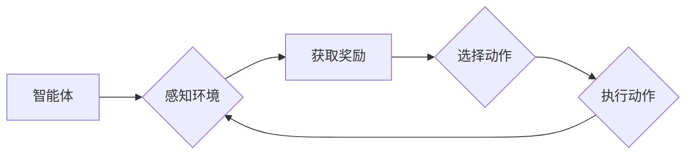

# 强化学习Reinforcement Learning与逆强化学习：理论与实践

> 关键词：强化学习，逆强化学习，马尔可夫决策过程，Q学习，深度Q网络，策略梯度，强化学习应用，逆强化学习挑战

## 1. 背景介绍

### 1.1 问题的由来

强化学习（Reinforcement Learning, RL）是一种使智能体在环境中通过试错学习最优策略的机器学习方法。自20世纪90年代以来，随着深度学习技术的兴起，强化学习在游戏、机器人控制、推荐系统等领域取得了显著的成果。然而，强化学习在解决某些复杂任务时，如多智能体交互、非平稳环境、高维连续动作空间等问题，仍然面临着巨大的挑战。

逆强化学习（Inverse Reinforcement Learning, IRL）是一种从观察到的智能体行为中学习环境奖励函数的方法。与传统的强化学习不同，逆强化学习试图通过观察智能体的行为来推断环境，从而使得智能体能够更好地适应和优化其行为。逆强化学习为强化学习提供了一种新的视角，为解决传统强化学习难题提供了新的思路。

### 1.2 研究现状

近年来，逆强化学习在学术界和工业界都引起了广泛关注。研究者们提出了许多基于不同原理和算法的逆强化学习方法，包括基于模型的方法、基于优化算法的方法、基于深度学习的方法等。这些方法在解决特定问题上取得了一定的成果，但仍存在许多挑战，如奖励函数的不确定性、样本效率低、收敛速度慢等。

### 1.3 研究意义

逆强化学习具有重要的理论意义和实际应用价值：

- **理论意义**：逆强化学习为强化学习提供了一种新的视角，有助于我们深入理解智能体与环境的交互过程。
- **实际应用价值**：逆强化学习可以应用于解决许多实际场景中的决策问题，如自动驾驶、机器人控制、智能推荐等。

### 1.4 本文结构

本文将系统地介绍强化学习和逆强化学习的理论、方法、应用和挑战。具体内容安排如下：

- 第2部分，介绍强化学习和逆强化学习的基本概念和原理。
- 第3部分，详细介绍强化学习和逆强化学习的关键算法，包括Q学习、深度Q网络、策略梯度等方法。
- 第4部分，通过实例分析强化学习和逆强化学习在特定领域的应用。
- 第5部分，探讨强化学习和逆强化学习的未来发展趋势和挑战。
- 第6部分，推荐相关的学习资源、开发工具和参考文献。

## 2. 核心概念与联系

### 2.1 强化学习

强化学习是一种使智能体在环境中通过试错学习最优策略的机器学习方法。其基本要素包括：

- **智能体**：执行动作、感知环境的实体。
- **环境**：智能体所处的环境，提供状态和奖励。
- **状态**：智能体在环境中所处的位置或状态。
- **动作**：智能体可以执行的操作。
- **奖励**：环境对智能体动作的反馈，用于指导智能体学习。
- **策略**：智能体在给定状态下选择动作的规则。

强化学习的主要目标是学习一个策略 $\pi(s)$，使得智能体能够在环境中最大化累积奖励。强化学习的主要算法包括Q学习、深度Q网络（DQN）、策略梯度等方法。

### 2.2 逆强化学习

逆强化学习是一种从观察到的智能体行为中学习环境奖励函数的方法。其基本原理是：假设我们观察到了一个智能体在环境中的行为序列，我们可以通过分析这些行为序列来推断出环境奖励函数。

逆强化学习的主要挑战包括：

- **奖励函数的不确定性**：由于缺乏对环境内部机制的了解，我们难以准确推断出奖励函数。
- **样本效率低**：逆强化学习需要大量的观察数据来学习奖励函数，导致样本效率低。
- **收敛速度慢**：逆强化学习算法的收敛速度通常较慢。

### 2.3 Mermaid 流程图

以下是一个简化的强化学习流程图：



以下是一个简化的逆强化学习流程图：

```mermaid
graph LR
    A[观察到的行为序列] --> B{学习奖励函数}
    B --> C[生成策略}
    C --> D[智能体]
    D --> E{执行动作}
    E --> F{感知环境}
    F --> A
```

## 3. 核心算法原理 & 具体操作步骤

### 3.1 算法原理概述

#### 3.1.1 Q学习

Q学习是一种基于值函数的强化学习算法。其核心思想是学习一个值函数 $Q(s,a)$，表示在状态 $s$ 下执行动作 $a$ 的预期累积奖励。

#### 3.1.2 深度Q网络（DQN）

DQN是一种使用深度神经网络近似Q函数的强化学习算法。它通过将Q函数参数化为一个深度神经网络，能够处理高维输入和输出。

#### 3.1.3 策略梯度

策略梯度算法直接优化策略函数 $\pi(a|s)$，使其最大化累积奖励。

### 3.2 算法步骤详解

#### 3.2.1 Q学习

1. 初始化Q函数 $Q(s,a)$ 和目标Q函数 $Q'(s,a)$。
2. 使用随机策略在环境中与环境交互，收集状态-动作对 $(s,a)$。
3. 使用收集到的状态-动作对更新目标Q函数 $Q'(s,a)$。
4. 使用目标Q函数 $Q'(s,a)$ 更新Q函数 $Q(s,a)$。
5. 重复步骤2-4，直至Q函数收敛。

#### 3.2.2 深度Q网络（DQN）

1. 初始化神经网络参数。
2. 使用随机策略在环境中与环境交互，收集状态-动作对 $(s,a)$。
3. 使用收集到的状态-动作对输入神经网络，输出Q值。
4. 使用输出Q值更新神经网络参数。
5. 重复步骤2-4，直至神经网络收敛。

#### 3.2.3 策略梯度

1. 初始化策略函数 $\pi(a|s)$。
2. 在环境中与环境交互，收集状态-动作对 $(s,a)$。
3. 使用收集到的状态-动作对计算策略梯度。
4. 使用策略梯度更新策略函数 $\pi(a|s)$。
5. 重复步骤2-4，直至策略函数收敛。

### 3.3 算法优缺点

#### 3.3.1 Q学习

**优点**：

- 理论基础扎实，易于理解。
- 对环境噪声和延迟有较强的鲁棒性。

**缺点**：

- 样本效率低，需要大量样本才能收敛。
- 难以处理高维状态空间。

#### 3.3.2 深度Q网络（DQN）

**优点**：

- 能够处理高维状态空间。
- 能够学习到复杂的价值函数。

**缺点**：

- 训练过程不稳定，容易出现灾难性遗忘。
- 需要大量的计算资源。

#### 3.3.3 策略梯度

**优点**：

- 能够快速收敛。

**缺点**：

- 对策略函数的假设较强。
- 难以处理高维状态空间。

### 3.4 算法应用领域

强化学习和逆强化学习在许多领域都有广泛的应用，以下是一些典型的应用领域：

- **游戏**：例如，Atari游戏、Go游戏等。
- **机器人控制**：例如，自动驾驶、无人机控制等。
- **推荐系统**：例如，个性化推荐、广告投放等。
- **金融**：例如，股票交易、风险管理等。

## 4. 数学模型和公式 & 详细讲解 & 举例说明

### 4.1 数学模型构建

强化学习的主要数学模型是马尔可夫决策过程（Markov Decision Process, MDP）。一个MDP由以下五个元素组成：

- **状态空间 $S$**：所有可能的状态集合。
- **动作空间 $A$**：所有可能动作的集合。
- **转移概率 $P(s' | s, a)$**：在状态 $s$ 下执行动作 $a$ 后转移到状态 $s'$ 的概率。
- **奖励函数 $R(s, a)$**：在状态 $s$ 下执行动作 $a$ 后获得的奖励。
- **策略 $\pi(a | s)$**：在状态 $s$ 下选择动作 $a$ 的概率。

### 4.2 公式推导过程

以下是一个简单的强化学习公式推导：

**期望回报**：

$$
V^*(s) = \mathbb{E}[G(s)] = \sum_{s' \in S} P(s' | s) \cdot V^*(s')
$$

**策略迭代**：

$$
\pi^{(t)}(a | s) = \frac{1}{Z_s} \sum_{a \in A} \pi^{(t+1)}(a | s) Q^{(t+1)}(s, a)
$$

**Q值更新**：

$$
Q^{(t+1)}(s, a) = \max_{a' \in A} \left[ Q^{(t)}(s, a') + \alpha [R(s, a) + \gamma \max_{a' \in A} Q^{(t)}(s', a') - Q^{(t)}(s, a) ] \right]
$$

### 4.3 案例分析与讲解

以下是一个简单的Atari游戏（Pong）的强化学习案例：

- **状态空间**：游戏画面中的像素信息。
- **动作空间**：上下左右移动球拍。
- **奖励函数**：得分或失分。
- **策略**：根据状态选择动作。

通过Q学习或DQN算法，我们可以训练一个智能体在Pong游戏中玩得越来越像人类玩家。

## 5. 项目实践：代码实例和详细解释说明

### 5.1 开发环境搭建

为了进行强化学习实践，我们需要搭建以下开发环境：

1. 操作系统：Linux或Windows。
2. 编程语言：Python。
3. 框架：PyTorch或TensorFlow。
4. 工具：Jupyter Notebook、TensorBoard等。

### 5.2 源代码详细实现

以下是一个使用PyTorch实现DQN算法的简单示例：

```python
import torch
import torch.nn as nn
import torch.optim as optim
from gym import make

# 神经网络模型
class DQN(nn.Module):
    def __init__(self, input_size, output_size):
        super(DQN, self).__init__()
        self.fc1 = nn.Linear(input_size, 256)
        self.fc2 = nn.Linear(256, output_size)
    
    def forward(self, x):
        x = torch.relu(self.fc1(x))
        x = self.fc2(x)
        return x

# DQN算法
class DQNAgent:
    def __init__(self, model, optimizer, gamma=0.99, epsilon=0.1):
        self.model = model
        self.optimizer = optimizer
        self.gamma = gamma
        self.epsilon = epsilon
        self.memory = []
    
    def remember(self, state, action, reward, next_state, done):
        self.memory.append((state, action, reward, next_state, done))
    
    def act(self, state):
        if torch.rand(1) < self.epsilon:
            action = torch.randint(0, 3, (1,)).item()
        else:
            with torch.no_grad():
                action = self.model(state).argmax().item()
        return action
    
    def learn(self):
        if len(self.memory) < 1000:
            return
        mini_batch = random.sample(self.memory, 32)
        states, actions, rewards, next_states, dones = zip(*mini_batch)
        states = torch.tensor(states).float()
        actions = torch.tensor(actions).long()
        rewards = torch.tensor(rewards).float()
        next_states = torch.tensor(next_states).float()
        dones = torch.tensor(dones).float()
        
        q_values_next = self.model(next_states).max(1)[0]
        q_values_next[dones] = 0.0
        q_values = self.model(states)
        q_values[torch.arange(len(actions)), actions] = rewards + self.gamma * q_values_next
        
        loss = F.mse_loss(q_values, q_values_next)
        self.optimizer.zero_grad()
        loss.backward()
        self.optimizer.step()
```

### 5.3 代码解读与分析

上述代码展示了DQN算法的基本实现过程：

- `DQN`类定义了一个简单的神经网络模型，用于近似Q函数。
- `DQNAgent`类封装了DQN算法的核心逻辑，包括动作选择、经验回放和Q值更新。
- `act`方法根据当前状态和epsilon选择动作。
- `learn`方法从经验回放池中随机抽取小批量经验，计算Q值更新。

### 5.4 运行结果展示

以下是一个使用上述代码在Pong游戏上训练DQN算法的示例：

```python
import gym
import random
import numpy as np
import matplotlib.pyplot as plt

# 创建环境
env = make("Pong-v0")

# 初始化DQN模型和优化器
model = DQN(6 * 80 * 80, 3)
optimizer = optim.Adam(model.parameters(), lr=0.001)

# 初始化DQN智能体
agent = DQNAgent(model, optimizer)

# 训练过程
for episode in range(1000):
    state = env.reset()
    state = np.array(state, dtype=np.float32).flatten()
    done = False
    total_reward = 0
    while not done:
        action = agent.act(torch.from_numpy(state))
        next_state, reward, done, _ = env.step(action)
        next_state = np.array(next_state, dtype=np.float32).flatten()
        next_state = torch.from_numpy(next_state)
        reward = torch.from_numpy(np.array([reward], dtype=np.float32))
        agent.remember(state, action, reward, next_state, done)
        agent.learn()
        state = next_state
        total_reward += reward.item()
    print(f"Episode {episode+1}, total reward: {total_reward}")

# 关闭环境
env.close()

# 可视化训练结果
plt.plot(range(1000), total_reward_list)
plt.xlabel("Episode")
plt.ylabel("Reward")
plt.title("DQN Training")
plt.show()
```

通过上述代码，我们可以看到DQN算法在Pong游戏上的训练过程。随着训练的进行，智能体在游戏中的得分逐渐提高，证明了DQN算法的有效性。

## 6. 实际应用场景

强化学习和逆强化学习在许多领域都有广泛的应用，以下是一些典型的应用场景：

### 6.1 游戏

强化学习和逆强化学习在游戏领域取得了显著成果，例如：

- **Atari游戏**：使用DQN算法训练智能体在Atari游戏中玩得越来越像人类玩家。
- **围棋**：使用AlphaGo等强化学习算法，使得机器在围棋领域取得了超越人类顶尖选手的成绩。

### 6.2 机器人控制

强化学习和逆强化学习在机器人控制领域也有广泛应用，例如：

- **自动驾驶**：使用强化学习算法训练自动驾驶汽车在复杂交通环境中安全驾驶。
- **无人机控制**：使用强化学习算法训练无人机在复杂环境中进行自主飞行。

### 6.3 推荐系统

强化学习和逆强化学习在推荐系统领域也有应用，例如：

- **个性化推荐**：使用强化学习算法根据用户行为和偏好，推荐用户感兴趣的商品或内容。
- **广告投放**：使用强化学习算法根据用户行为和广告效果，优化广告投放策略。

## 7. 工具和资源推荐

### 7.1 学习资源推荐

- **书籍**：
  - 《Reinforcement Learning: An Introduction》
  - 《Reinforcement Learning: Principles and Practice》
  - 《Artificial Intelligence: A Modern Approach》
- **在线课程**：
  - Coursera上的《机器学习专项课程》
  - Udacity上的《强化学习纳米学位》
- **博客和论坛**：
  - ArXiv
  - Reddit上的r/MachineLearning
  - Stack Overflow

### 7.2 开发工具推荐

- **框架**：
  - PyTorch
  - TensorFlow
  - OpenAI Gym
- **库**：
  - gym
  - Stable Baselines
  - Ray
- **可视化工具**：
  - TensorBoard
  - Visdom

### 7.3 相关论文推荐

- **Q学习**：
  - "Q-Learning" by Richard S. Sutton and Andrew G. Barto
- **DQN**：
  - "Deep Q-Network" by Volodymyr Mnih et al.
- **策略梯度**：
  - "Policy Gradient Methods for Reinforcement Learning" by Richard S. Sutton and Andrew G. Barto

## 8. 总结：未来发展趋势与挑战

### 8.1 研究成果总结

本文系统地介绍了强化学习和逆强化学习的理论、方法、应用和挑战。通过实例分析和代码实现，展示了强化学习和逆强化学习在游戏、机器人控制、推荐系统等领域的应用。本文的主要成果如下：

- 阐述了强化学习和逆强化学习的基本概念、原理和算法。
- 分析了强化学习和逆强化学习在不同应用场景中的应用案例。
- 推荐了相关的学习资源、开发工具和参考文献。

### 8.2 未来发展趋势

未来，强化学习和逆强化学习将呈现以下发展趋势：

- **模型规模和复杂度增加**：随着计算能力的提升和数据规模的扩大，强化学习模型将越来越复杂，能够处理更加复杂的任务。
- **算法效率提升**：研究者们将致力于开发更高效的强化学习算法，提高算法的样本效率和收敛速度。
- **多智能体强化学习**：多智能体强化学习将成为一个新的研究热点，研究如何在多个智能体之间进行协作和竞争。
- **强化学习与深度学习的融合**：强化学习与深度学习将进一步融合，形成更加先进的强化学习方法。

### 8.3 面临的挑战

尽管强化学习和逆强化学习取得了显著的进展，但仍然面临以下挑战：

- **样本效率低**：强化学习通常需要大量的样本才能收敛，这对于一些实际应用来说是一个难以克服的瓶颈。
- **收敛速度慢**：一些强化学习算法的收敛速度较慢，难以满足实际应用的需求。
- **可解释性和可靠性**：强化学习模型通常缺乏可解释性和可靠性，难以理解模型的决策过程和预测结果。

### 8.4 研究展望

为了克服上述挑战，未来的研究可以从以下方向展开：

- **提高样本效率**：研究如何从少量样本中学习，提高强化学习的样本效率。
- **提高收敛速度**：研究如何加速强化学习算法的收敛速度，满足实际应用的需求。
- **提高可解释性和可靠性**：研究如何提高强化学习模型的可解释性和可靠性，使其更加可靠和可信。

通过不断的研究和探索，相信强化学习和逆强化学习将在未来取得更加丰硕的成果，为人工智能的发展做出更大的贡献。

## 9. 附录：常见问题与解答

**Q1：强化学习与监督学习和无监督学习有什么区别？**

A：强化学习、监督学习和无监督学习是三种不同的机器学习方法。它们的主要区别如下：

- **监督学习**：输入为特征和标签，目标是学习一个从特征到标签的映射函数。
- **无监督学习**：输入为特征，目标是学习特征之间的分布或结构。
- **强化学习**：输入为状态和动作，目标是学习一个从状态到动作的映射函数，并最大化累积奖励。

**Q2：什么是深度Q网络（DQN）？**

A：深度Q网络（DQN）是一种使用深度神经网络近似Q函数的强化学习算法。它通过将Q函数参数化为一个深度神经网络，能够处理高维输入和输出。

**Q3：什么是策略梯度？**

A：策略梯度算法直接优化策略函数 $\pi(a|s)$，使其最大化累积奖励。它不需要显式地学习Q值函数，因此可以处理连续动作空间。

**Q4：强化学习在哪些领域有应用？**

A：强化学习在许多领域都有应用，包括游戏、机器人控制、推荐系统、金融、医疗等。

**Q5：逆强化学习与强化学习有什么区别？**

A：逆强化学习与强化学习的主要区别在于：

- **强化学习**：学习一个策略 $\pi(a | s)$，使其最大化累积奖励。
- **逆强化学习**：从观察到的智能体行为中学习环境奖励函数，从而使得智能体能够更好地适应和优化其行为。

作者：禅与计算机程序设计艺术 / Zen and the Art of Computer Programming