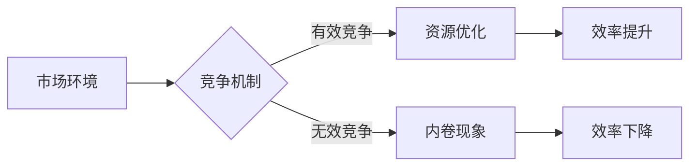

# 微观主体间竞争与内卷增多

> 关键词：微观竞争，内卷，市场机制，资源分配，效率，均衡，演化博弈，复杂系统

## 1. 背景介绍

在信息技术飞速发展的今天，市场竞争日益激烈，特别是在互联网和数字经济的浪潮下，微观主体间的竞争呈现出了新的特点。一个值得关注的现象是“内卷”的增多，即竞争者之间为了有限的资源而进行的过度竞争，导致整体效率降低，甚至出现“零和游戏”的局面。本文将深入探讨微观主体间竞争与内卷增多的现象，分析其背后的原因和影响，并提出可能的应对策略。

## 2. 核心概念与联系

### 2.1 微观竞争

微观竞争是指市场上单个或少数几个主体为了争夺市场份额、客户资源或其他资源而进行的竞争。在经济学中，微观竞争是理解市场机制和资源配置的重要概念。

### 2.2 内卷

内卷（Involution）一词原本用于描述农业社会的一种现象，指的是在一个封闭系统中，为了争夺有限的资源，个体或群体会不断加大投入，导致单位产出的边际效益递减。在当代社会，内卷现象被广泛应用于描述教育、职场、互联网等多个领域的过度竞争。

### 2.3 竞争与内卷的关系

微观竞争是市场经济的核心特征之一，是推动技术进步和社会发展的重要动力。然而，当竞争过度，特别是形成内卷现象时，它就会成为一种负面的力量，阻碍效率提升和资源配置优化。

### 2.4 Mermaid 流程图



## 3. 核心算法原理 & 具体操作步骤

### 3.1 算法原理概述

微观竞争的内卷现象可以通过演化博弈理论来分析。演化博弈是一种研究具有适应性的个体在策略选择上的动态过程，它考虑了个体之间的互动和策略的演化。

### 3.2 算法步骤详解

1. **定义竞争场景**：明确竞争的参与者、竞争资源和竞争规则。
2. **建立策略空间**：定义每个参与者的策略选择范围。
3. **设计支付矩阵**：根据策略组合定义每个参与者的收益。
4. **模拟演化过程**：根据支付矩阵模拟个体之间的互动和策略选择。
5. **分析均衡状态**：找出演化过程中稳定的策略组合。
6. **评估内卷程度**：分析均衡状态下整体效率的变化。

### 3.3 算法优缺点

**优点**：
- 演化博弈能够模拟复杂竞争场景，分析策略的动态演化过程。
- 可以帮助理解内卷现象的成因和影响。

**缺点**：
- 模拟过程可能过于复杂，难以处理大规模参与者。
- 简化的模型可能无法完全反映现实世界的复杂性。

### 3.4 算法应用领域

- **市场竞争分析**：帮助企业了解市场竞争态势和内卷现象。
- **政策制定**：为政府提供政策制定的依据，避免内卷现象的产生。
- **社会问题研究**：研究教育、职场等领域的内卷现象。

## 4. 数学模型和公式 & 详细讲解 & 举例说明

### 4.1 数学模型构建

演化博弈的数学模型通常使用支付矩阵来表示。假设有两个参与者A和B，他们的策略空间分别为$\Sigma_A$和$\Sigma_B$，支付矩阵$U_A(U_B)$定义了在所有可能策略组合下，参与者A(B)的收益。

### 4.2 公式推导过程

设参与者A的策略为$a \in \Sigma_A$，参与者B的策略为$b \in \Sigma_B$，则参与者A在策略组合$(a,b)$下的收益为$U_A(a,b)$。

### 4.3 案例分析与讲解

假设有两个公司A和B，它们可以选择投入研发（R）或投入营销（M）。如果两家公司都投入研发，它们都将获得收益$R$；如果一家投入研发，另一家投入营销，投入研发的公司将获得收益$2M$，投入营销的公司将获得收益$M$；如果两家公司都投入营销，它们都将获得收益$0$。则支付矩阵如下：

$$
\begin{array}{c|cc}
 & M & R \\
\hline
M & 0,0 & 2M,0 \\
R & 0,2M & R,2R \\
\end{array}
$$

在这个模型中，如果两家公司都选择投入研发，可能会导致研发投入过剩，出现内卷现象。

## 5. 项目实践：代码实例和详细解释说明

### 5.1 开发环境搭建

由于演化博弈的模拟需要编写较为复杂的代码，以下以Python为例，展示如何使用NumPy库进行简单的演化博弈模拟。

### 5.2 源代码详细实现

```python
import numpy as np

# 定义策略空间
def strategies(A, B):
    return np.random.choice(['R', 'M'], p=[0.5, 0.5])

# 定义支付矩阵
def payoffs(A, B):
    if A == 'R' and B == 'R':
        return 1, 1
    elif A == 'R' and B == 'M':
        return 2, 0
    elif A == 'M' and B == 'R':
        return 0, 2
    else:
        return 0, 0

# 模拟演化过程
def simulate_evolution(num_steps):
    A, B = 'R', 'R'
    history = [A, B]
    for _ in range(num_steps):
        A = strategies(A, B)
        B = strategies(A, B)
        history.extend([A, B])
    return history

# 运行模拟
num_steps = 100
history = simulate_evolution(num_steps)
```

### 5.3 代码解读与分析

- `strategies` 函数随机选择A和B的策略。
- `payoffs` 函数根据策略组合计算收益。
- `simulate_evolution` 函数模拟演化过程，记录策略变化。
- 运行模拟可以观察到策略的演化趋势。

### 5.4 运行结果展示

通过运行模拟，可以观察到策略的演化过程。在某些情况下，可能会出现内卷现象，即两家公司都选择投入营销，导致收益降低。

## 6. 实际应用场景

### 6.1 市场竞争分析

通过演化博弈模型，企业可以分析市场竞争态势，预测竞争对手的策略选择，制定相应的竞争策略。

### 6.2 政策制定

政府可以通过演化博弈模型分析市场中的内卷现象，制定相关政策，引导企业健康发展。

### 6.3 社会问题研究

演化博弈模型可以帮助研究教育、职场等领域的内卷现象，为解决这些问题提供理论依据。

## 7. 工具和资源推荐

### 7.1 学习资源推荐

- 《演化博弈论及其应用》
- 《复杂性科学导论》
- 《网络经济学》

### 7.2 开发工具推荐

- Python
- NumPy
- Matplotlib

### 7.3 相关论文推荐

- 《演化博弈论》
- 《复杂性科学：从混沌到智能》
- 《网络经济学原理》

## 8. 总结：未来发展趋势与挑战

### 8.1 研究成果总结

本文通过对微观主体间竞争与内卷增多的分析，揭示了竞争机制、市场环境和资源分配等因素对内卷现象的影响。演化博弈模型为理解和应对内卷现象提供了理论工具。

### 8.2 未来发展趋势

- 演化博弈模型将进一步应用于更广泛的领域，如社会、经济、生态等。
- 跨学科研究将成为主流，将演化博弈与其他学科相结合，如经济学、社会学、生态学等。

### 8.3 面临的挑战

- 演化博弈模型的复杂性可能导致应用难度增加。
- 模型与现实世界的复杂度存在差异，需要进一步改进和优化。

### 8.4 研究展望

未来研究应着重于以下方向：

- 开发更加精确的演化博弈模型，以更好地反映现实世界的复杂性。
- 研究如何通过政策干预和制度设计来缓解内卷现象。
- 探索跨学科研究方法，将演化博弈与其他学科相结合。

## 9. 附录：常见问题与解答

**Q1：什么是内卷？**

A：内卷是指在一个封闭系统中，为了争夺有限的资源，个体或群体会不断加大投入，导致单位产出的边际效益递减。

**Q2：演化博弈模型如何帮助我们理解内卷现象？**

A：演化博弈模型可以模拟个体之间的互动和策略选择，帮助我们理解内卷现象的成因和影响。

**Q3：如何缓解内卷现象？**

A：可以通过政策干预、制度设计等方式来缓解内卷现象，例如，调整市场机制、优化资源配置、引导企业健康发展等。

作者：禅与计算机程序设计艺术 / Zen and the Art of Computer Programming