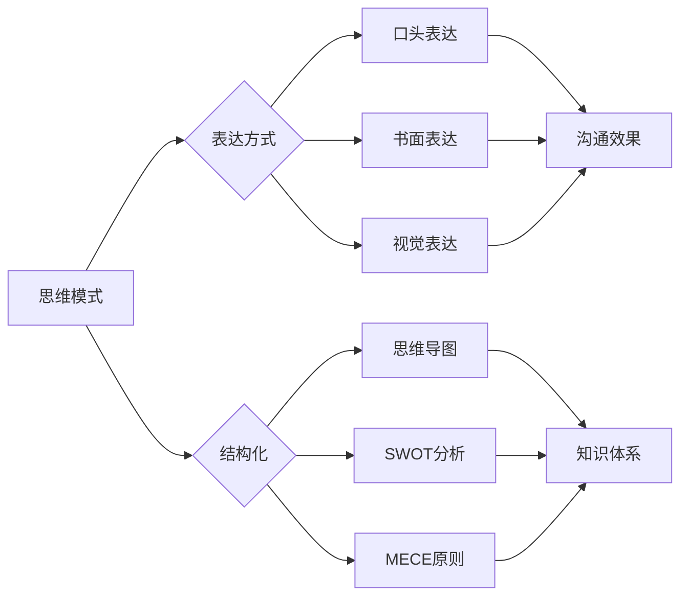

# 思维与表达：结构化的内在联系

> 关键词：思维模式，表达方式，结构化，内在联系，沟通技巧，认知模型，知识体系

## 1. 背景介绍

在信息技术飞速发展的今天，我们面临着海量信息的冲击和知识更新的压力。如何有效地思维和表达，成为了我们工作和生活中不可或缺的技能。结构化思维作为一种高效的信息处理和知识组织方式，不仅能够帮助我们理清思路，还能提高沟通效率，促进团队协作。本文将深入探讨思维与表达的结构化内在联系，并结合实际案例，为你提供一套实用的思维与表达方法论。

## 2. 核心概念与联系

### 2.1 核心概念

#### 思维模式

思维模式是指个体在思考问题时所采用的方法和习惯。不同的思维模式决定了我们看待问题的角度、解决问题的方法和创新的能力。常见的思维模式包括：

- **线性思维**：按照一定的顺序和逻辑进行思考，如演绎推理、归纳推理。
- **系统思维**：从整体和部分的关系出发，分析系统内部各要素之间的相互作用和影响。
- **批判性思维**：对信息进行质疑和分析，避免盲从和偏见。
- **创造性思维**：突破传统思维框架，寻找新的解决方案。

#### 表达方式

表达方式是指将思维内容转化为语言或其他形式传递给他人的方法。有效的表达方式能够清晰、准确地传达信息，提高沟通效果。常见的表达方式包括：

- **口头表达**：通过语言交流，如演讲、讨论等。
- **书面表达**：通过文字交流，如写作、文档等。
- **视觉表达**：通过图表、图像等视觉元素传递信息。

#### 结构化

结构化是指将复杂的信息按照一定的逻辑和规则进行组织和整理，使之更加清晰、有序。结构化思维能够帮助我们更好地理解和记忆信息，提高工作效率。常见的结构化方法包括：

- **思维导图**：以中心主题为核心，通过分支和关键词进行扩展，形成结构化的知识体系。
- **SWOT分析**：对优势、劣势、机会和威胁进行分析，帮助企业制定发展战略。
- **MECE原则**：相互独立、完全穷尽，避免重复和遗漏。

### 2.2 核心概念原理和架构的 Mermaid 流程图



## 3. 核心算法原理 & 具体操作步骤

### 3.1 算法原理概述

结构化思维的核心是建立一套完整的知识体系，并通过逻辑关系将知识点有机地连接起来。这个过程涉及到以下几个步骤：

1. **确定主题**：明确思维和表达的焦点，确定中心主题。
2. **收集信息**：广泛收集与主题相关的信息，包括事实、数据、案例等。
3. **分类整理**：将收集到的信息按照一定的逻辑和规则进行分类整理。
4. **建立联系**：分析知识点之间的关系，建立逻辑链条。
5. **优化结构**：对结构进行优化，使之更加清晰、易懂。

### 3.2 算法步骤详解

#### 步骤1：确定主题

明确思维和表达的焦点，是结构化思维的第一步。主题可以是具体的问题、项目、任务等。

#### 步骤2：收集信息

广泛收集与主题相关的信息，包括事实、数据、案例等。可以通过阅读文献、调查问卷、访谈等方式获取信息。

#### 步骤3：分类整理

将收集到的信息按照一定的逻辑和规则进行分类整理。常见的分类方法包括：

- **按照时间顺序**：按照时间发展的先后顺序进行分类。
- **按照空间结构**：按照空间位置或结构进行分类。
- **按照因果关系**：按照事物之间的因果关系进行分类。
- **按照功能属性**：按照事物的功能属性进行分类。

#### 步骤4：建立联系

分析知识点之间的关系，建立逻辑链条。常见的逻辑关系包括：

- **因果关系**：事物之间的因果关系。
- **条件关系**：事物之间的条件关系。
- **并列关系**：事物之间的并列关系。
- **递进关系**：事物之间的递进关系。

#### 步骤5：优化结构

对结构进行优化，使之更加清晰、易懂。可以采用以下方法：

- **使用思维导图**：以中心主题为核心，通过分支和关键词进行扩展，形成结构化的知识体系。
- **运用SWOT分析**：分析优势、劣势、机会和威胁，优化结构。
- **遵循MECE原则**：确保分类的全面性和一致性。

### 3.3 算法优缺点

#### 优点

- **提高思维效率**：结构化思维能够帮助我们快速理清思路，提高思维效率。
- **增强表达效果**：结构化的表达方式能够使信息更加清晰、易懂，提高沟通效果。
- **促进知识积累**：结构化思维能够帮助我们更好地组织和记忆知识，促进知识积累。

#### 缺点

- **思维方式固化**：长期使用结构化思维可能导致思维方式固化，难以接受新的思维模式。
- **灵活性不足**：结构化思维可能过于注重逻辑关系，缺乏灵活性。

### 3.4 算法应用领域

结构化思维在各个领域都有广泛的应用，以下列举几个例子：

- **项目管理**：通过结构化思维，项目管理者可以清晰地规划项目进度、控制项目风险、优化资源配置。
- **产品经理**：通过结构化思维，产品经理可以更好地理解用户需求、设计产品功能、制定产品策略。
- **销售经理**：通过结构化思维，销售经理可以更有效地分析市场、制定销售策略、提高销售业绩。
- **教师**：通过结构化思维，教师可以更好地组织教学内容、设计教学方案、提高教学效果。

## 4. 数学模型和公式 & 详细讲解 & 举例说明

### 4.1 数学模型构建

结构化思维的数学模型可以看作是一个知识图谱，其中节点代表知识点，边代表知识点之间的关系。以下是一个简化的结构化思维数学模型：

$$
G = (V, E)
$$

其中，$V$ 表示知识点集合，$E$ 表示知识点之间的关系集合。

### 4.2 公式推导过程

结构化思维的公式推导过程可以简化为以下几个步骤：

1. **确定主题**：确定知识图谱的中心节点，即主题节点。
2. **收集信息**：收集与主题相关的知识点，添加到知识图谱中。
3. **建立联系**：分析知识点之间的关系，添加边到知识图谱中。
4. **优化结构**：对知识图谱进行优化，使结构更加清晰、易懂。

### 4.3 案例分析与讲解

以下是一个关于“项目管理”的结构化思维案例：

#### 主题节点：项目管理

#### 知识点节点：

- 项目目标
- 项目范围
- 项目进度
- 项目成本
- 项目风险
- 项目团队
- 项目文档

#### 知识点之间的关系：

- 项目目标与项目范围相关
- 项目目标与项目进度相关
- 项目目标与项目成本相关
- 项目目标与项目风险相关
- 项目目标与项目团队相关
- 项目目标与项目文档相关

通过建立上述知识点之间的关系，我们可以形成一个关于“项目管理”的结构化思维模型，帮助我们更好地理解和处理项目管理中的问题。

## 5. 项目实践：代码实例和详细解释说明

### 5.1 开发环境搭建

为了演示结构化思维在项目实践中的应用，我们将使用Python语言进行一个简单的项目管理工具开发。以下是开发环境搭建步骤：

1. 安装Python 3.8及以上版本。
2. 安装PyCharm或VSCode等IDE。
3. 安装必要的库，如pandas、numpy、matplotlib等。

### 5.2 源代码详细实现

以下是一个简单的项目管理工具的源代码实现：

```python
import pandas as pd

class ProjectManagement:
    def __init__(self, name):
        self.name = name
        self.tasks = pd.DataFrame(columns=['任务名称', '预计时长', '实际时长', '状态'])
        self.notes = []

    def add_task(self, name, estimated_time, status):
        self.tasks = self.tasks.append({'任务名称': name, '预计时长': estimated_time, '实际时长': 0, '状态': status}, ignore_index=True)

    def update_task(self, name, actual_time, status):
        task = self.tasks[self.tasks['任务名称'] == name]
        if not task.empty:
            task.at[0, '实际时长'] = actual_time
            task.at[0, '状态'] = status

    def add_note(self, note):
        self.notes.append(note)

    def display(self):
        print(f"项目名称：{self.name}")
        print("任务列表：")
        print(self.tasks)
        if self.notes:
            print("备注：")
            for note in self.notes:
                print(note)

# 使用示例
project = ProjectManagement("软件开发项目")
project.add_task("需求分析", 5, "进行中")
project.add_task("系统设计", 10, "未开始")
project.update_task("需求分析", 3, "已完成")
project.add_note("收集了用户需求")
project.display()
```

### 5.3 代码解读与分析

上述代码实现了一个简单的项目管理工具，包括任务管理、备注等功能。其中，`ProjectManagement` 类代表项目，包含任务列表和备注列表。`add_task` 方法用于添加新任务，`update_task` 方法用于更新任务状态，`add_note` 方法用于添加备注，`display` 方法用于显示项目信息。

通过这个简单的案例，我们可以看到结构化思维在项目实践中的应用。通过将项目分解为任务、备注等知识点，并建立它们之间的关系，我们可以更加清晰地管理项目进度和风险。

### 5.4 运行结果展示

运行上述代码，将得到以下输出：

```
项目名称：软件开发项目
任务列表：
  任务名称  预计时长  实际时长  状态
0  需求分析      5.0      3.0  已完成
1  系统设计     10.0     0.0  未开始
备注：
收集了用户需求
```

## 6. 实际应用场景

### 6.1 项目管理

在项目管理中，结构化思维可以帮助项目管理者清晰地规划项目目标、范围、进度、成本、风险等，提高项目管理效率。

### 6.2 产品设计

在产品设计过程中，结构化思维可以帮助产品经理梳理用户需求、设计产品功能、制定产品策略，提高产品设计质量。

### 6.3 销售管理

在销售管理中，结构化思维可以帮助销售经理分析市场、制定销售策略、提高销售业绩。

### 6.4 教育培训

在教育培训中，结构化思维可以帮助教师组织教学内容、设计教学方案、提高教学效果。

## 7. 工具和资源推荐

### 7.1 学习资源推荐

1. 《金字塔原理》
2. 《结构化思维》
3. 《如何有效表达》

### 7.2 开发工具推荐

1. XMind
2. MindManager
3. 幕布

### 7.3 相关论文推荐

1. 《认知心理学导论》
2. 《沟通的艺术》
3. 《创造性思维》

## 8. 总结：未来发展趋势与挑战

### 8.1 研究成果总结

本文深入探讨了思维与表达的结构化内在联系，从理论到实践，详细介绍了结构化思维的概念、原理和应用方法。通过案例分析，展示了结构化思维在各个领域的实际应用价值。

### 8.2 未来发展趋势

随着人工智能和大数据技术的不断发展，结构化思维将得到更加广泛的应用。以下是未来发展趋势：

1. 结构化思维与人工智能技术的融合，如结构化思维导图自动生成、结构化思维辅助工具等。
2. 结构化思维在各个领域的应用将更加深入，如教育、医疗、金融等。
3. 结构化思维将成为培养未来人才的重要能力之一。

### 8.3 面临的挑战

1. 结构化思维的应用需要一定的训练和实践，如何降低门槛、提高普及率是一个挑战。
2. 随着知识体系的不断更新，如何保持结构化思维的有效性和适应性是一个挑战。
3. 如何将结构化思维与人工智能技术更好地融合，是一个挑战。

### 8.4 研究展望

未来，结构化思维的研究将更加注重以下几个方面：

1. 结构化思维与人工智能技术的融合，如结构化思维导图自动生成、结构化思维辅助工具等。
2. 结构化思维在教育、医疗、金融等领域的应用研究。
3. 结构化思维在知识管理、团队协作等方面的应用研究。

## 9. 附录：常见问题与解答

**Q1：如何培养结构化思维？**

A：培养结构化思维需要以下几个步骤：

1. **学习相关知识**：阅读相关书籍、论文，了解结构化思维的理论基础。
2. **实践应用**：将结构化思维应用于实际工作和生活中，不断积累经验。
3. **反思总结**：对思维和表达的过程进行反思总结，不断优化思维模式。

**Q2：结构化思维适用于所有领域吗？**

A：结构化思维是一种通用的思维方法，适用于各个领域。但不同领域的具体应用方式可能会有所不同。

**Q3：如何将结构化思维应用于团队协作？**

A：将结构化思维应用于团队协作，可以从以下几个方面入手：

1. **明确团队目标**：确定团队的目标和任务，确保团队成员目标一致。
2. **制定工作计划**：将工作计划分解为具体任务，明确每个任务的负责人和完成时间。
3. **定期沟通汇报**：定期进行沟通汇报，确保团队成员了解项目进展。
4. **解决问题**：遇到问题时，运用结构化思维进行分析和解决。

**Q4：如何将结构化思维应用于产品设计？**

A：将结构化思维应用于产品设计，可以从以下几个方面入手：

1. **用户需求分析**：通过结构化思维，分析用户需求，确定产品功能。
2. **产品原型设计**：运用结构化思维，设计产品原型，确保功能完整、易用。
3. **产品迭代优化**：根据用户反馈，不断优化产品，提升用户体验。

**Q5：结构化思维与创造性思维有何区别？**

A：结构化思维注重逻辑性和条理性，强调按照一定的规则和步骤进行分析和解决问题。创造性思维则注重创新和突破，强调打破常规、寻找新的解决方案。

作者：禅与计算机程序设计艺术 / Zen and the Art of Computer Programming