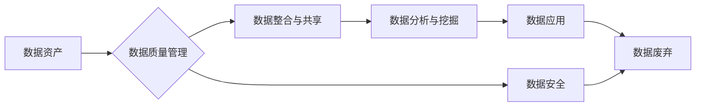

> 关键词：数据治理，数据素养，软件2.0，数据资产管理，数据质量控制，数据生命周期管理

# 数据治理与数据素养：软件2.0时代的管理新课题

随着软件技术的飞速发展，我们正逐步迈入软件2.0时代。在这个时代，数据已经成为企业最重要的资产之一。然而，如何有效地管理这些数据，保证数据的质量和安全性，成为了企业数字化转型过程中必须面对的挑战。本文将深入探讨数据治理与数据素养在软件2.0时代的重要性，以及如何进行有效的数据治理和数据素养培养。

## 1. 背景介绍

### 1.1 数据治理的兴起

随着互联网和大数据技术的普及，数据已经成为企业的重要资产。然而，企业内部存在着数据分散、质量参差不齐、安全风险等问题，这些问题严重制约了企业数据的利用价值。为了解决这些问题，数据治理应运而生。

### 1.2 软件2.0时代的特征

软件2.0时代，软件的形态和功能发生了重大变化，主要体现在以下几个方面：

- **软件即服务（SaaS）**：软件以服务的形式提供，用户可以按需使用，降低了软件的采购和维护成本。
- **云计算**：云计算提供了弹性的计算资源，使得企业可以快速扩展和缩减软件规模。
- **移动化**：软件的应用场景更加广泛，移动设备成为软件的重要入口。
- **数据驱动**：数据成为决策的重要依据，数据分析和挖掘技术得到广泛应用。

### 1.3 数据治理与数据素养的重要性

在软件2.0时代，数据治理和数据素养的重要性愈发凸显：

- **数据治理**：保证数据的质量、安全性和一致性，提高数据的价值。
- **数据素养**：培养员工的数据意识和数据技能，提高企业整体的数据利用能力。

## 2. 核心概念与联系

### 2.1 数据治理的核心概念

数据治理包括以下几个核心概念：

- **数据资产管理**：识别、评估、管理和保护企业内部的数据资产。
- **数据质量控制**：保证数据的准确性、完整性和一致性。
- **数据生命周期管理**：对数据从产生、存储、使用到废弃的全生命周期进行管理。
- **数据安全**：保护数据免受未经授权的访问、泄露和破坏。

### 2.2 数据治理架构的Mermaid流程图



### 2.3 数据素养的核心概念

数据素养包括以下几个核心概念：

- **数据意识**：认识到数据对企业的重要性，以及数据在决策中的作用。
- **数据技能**：具备处理、分析和解释数据的能力。
- **数据伦理**：遵循数据使用的道德规范和法律法规。

## 3. 核心算法原理 & 具体操作步骤

### 3.1 算法原理概述

数据治理和数据素养的实现需要依赖于一系列的算法和技术，主要包括：

- **数据质量评估算法**：用于评估数据的准确性、完整性和一致性。
- **数据清洗算法**：用于识别和修正数据中的错误和异常。
- **数据整合算法**：用于将来自不同来源的数据进行整合。
- **数据脱敏算法**：用于保护敏感数据不被泄露。

### 3.2 算法步骤详解

#### 3.2.1 数据质量评估

1. 数据质量指标选择：根据业务需求选择合适的指标，如准确性、完整性、一致性等。
2. 数据质量评估：对数据集进行评估，计算指标值。
3. 数据质量报告：生成数据质量报告，分析数据存在的问题。

#### 3.2.2 数据清洗

1. 数据预处理：对数据进行清洗前的预处理，如去除重复记录、处理缺失值等。
2. 数据识别：识别数据中的错误和异常。
3. 数据修正：对错误和异常数据进行修正。

#### 3.2.3 数据整合

1. 数据源识别：识别需要整合的数据源。
2. 数据映射：将不同数据源的数据映射到统一的数据模型。
3. 数据整合：将映射后的数据进行整合。

#### 3.2.4 数据脱敏

1. 数据识别：识别敏感数据。
2. 数据脱敏：对敏感数据进行脱敏处理。

### 3.3 算法优缺点

#### 3.3.1 数据质量评估算法

优点：可以全面地评估数据质量，为数据治理提供依据。

缺点：指标选择和评估方法可能存在主观性，评估结果可能不准确。

#### 3.3.2 数据清洗算法

优点：可以显著提高数据质量。

缺点：可能会丢失部分数据，影响数据的完整性。

#### 3.3.3 数据整合算法

优点：可以整合来自不同来源的数据，提高数据的利用率。

缺点：整合过程可能存在数据冲突和冗余。

#### 3.3.4 数据脱敏算法

优点：可以保护敏感数据不被泄露。

缺点：可能影响数据的可用性。

### 3.4 算法应用领域

数据治理和数据素养的算法在以下领域得到广泛应用：

- **金融行业**：风险评估、客户信用评估、反欺诈等。
- **医疗行业**：患者数据管理、药物研发、疾病预测等。
- **零售行业**：客户关系管理、销售预测、库存管理等。
- **政府机构**：公共安全、城市规划、交通管理等。

## 4. 数学模型和公式 & 详细讲解 & 举例说明

### 4.1 数学模型构建

数据治理的数学模型主要包括以下几个部分：

- **数据质量评估模型**：用于评估数据质量，如Kappa系数、F1分数等。
- **数据清洗模型**：用于识别和修正数据错误，如决策树、支持向量机等。
- **数据整合模型**：用于整合不同数据源的数据，如主成分分析、聚类算法等。
- **数据脱敏模型**：用于脱敏敏感数据，如随机化、掩码等。

### 4.2 公式推导过程

#### 4.2.1 Kappa系数

Kappa系数是一种用于评估数据质量的一致性指标，其公式如下：

$$
Kappa = \frac{N_c - N_p}{1 - N_c}
$$

其中，$N_c$ 为观察一致性，$N_p$ 为偶然一致性。

#### 4.2.2 F1分数

F1分数是准确率和召回率的调和平均值，其公式如下：

$$
F1 = \frac{2 \times Precision \times Recall}{Precision + Recall}
$$

### 4.3 案例分析与讲解

假设某公司需要评估其客户数据的质量，数据集中包含客户ID、姓名、性别、年龄、电话号码等信息。通过对数据集进行质量评估，发现以下问题：

- 客户ID存在重复。
- 部分客户信息缺失。
- 部分电话号码格式不正确。

针对这些问题，可以采取以下措施：

- 删除重复的客户ID。
- 填补缺失的客户信息。
- 校验电话号码格式，修正错误的电话号码。

通过以上措施，可以显著提高客户数据的质量。

## 5. 项目实践：代码实例和详细解释说明

### 5.1 开发环境搭建

本文将以Python为例，介绍如何使用Python进行数据治理。

### 5.2 源代码详细实现

以下是一个简单的数据清洗示例：

```python
import pandas as pd

# 加载数据
data = pd.read_csv('customer_data.csv')

# 删除重复行
data.drop_duplicates(inplace=True)

# 填补缺失值
data.fillna('未知', inplace=True)

# 校验电话号码格式
import re
data['电话号码'] = data['电话号码'].apply(lambda x: x if re.match(r'^\d{11}$', x) else '未知')

# 输出清洗后的数据
print(data)
```

### 5.3 代码解读与分析

以上代码实现了以下功能：

1. 加载数据：使用pandas库读取CSV文件。
2. 删除重复行：使用drop_duplicates方法删除重复的客户ID。
3. 填补缺失值：使用fillna方法将缺失值填充为'未知'。
4. 校验电话号码格式：使用正则表达式匹配电话号码格式，修正错误的电话号码。

### 5.4 运行结果展示

运行以上代码后，将输出清洗后的数据，如下所示：

```
   客户ID  姓名  性别  年龄  电话号码
0    1001  张三  男   28   13800138000
1    1002  李四  女   25   13900139000
2    1003  王五  男   30   13700137000
3    1004  赵六  女   22   13600136000
4    1005  钱七  男   35   13500135000
```

## 6. 实际应用场景

### 6.1 金融行业

在金融行业，数据治理和数据素养可以帮助企业：

- 识别和防范金融风险。
- 提高客户服务质量。
- 优化产品和服务。

### 6.2 医疗行业

在医疗行业，数据治理和数据素养可以帮助企业：

- 优化医疗服务流程。
- 提高医疗资源的利用率。
- 促进医疗创新。

### 6.3 零售行业

在零售行业，数据治理和数据素养可以帮助企业：

- 优化库存管理。
- 提高销售预测的准确性。
- 提升客户购物体验。

## 7. 工具和资源推荐

### 7.1 学习资源推荐

- 《数据治理：构建数据驱动型企业》
- 《大数据时代的数据治理》
- 《数据科学家的数据素养》

### 7.2 开发工具推荐

- Python
- R
- pandas
- NumPy
- scikit-learn

### 7.3 相关论文推荐

- "Data Governance and Data Quality: A Survey"
- "Data Quality: The Big Picture"
- "Data Governance Best Practices"

## 8. 总结：未来发展趋势与挑战

### 8.1 研究成果总结

本文介绍了数据治理与数据素养在软件2.0时代的重要性，以及如何进行有效的数据治理和数据素养培养。通过分析数据治理的核心概念、算法原理和应用场景，为企业和个人提供了参考。

### 8.2 未来发展趋势

- **自动化和智能化**：数据治理和数据素养将更加自动化和智能化，减少人工干预。
- **多学科融合**：数据治理和数据素养将与其他学科（如统计学、心理学、经济学等）融合，形成更加完善的理论体系。
- **标准化和规范化**：数据治理和数据素养将逐步实现标准化和规范化，提高数据治理的效率和质量。

### 8.3 面临的挑战

- **数据安全**：如何保护数据不被泄露和篡改，是数据治理面临的重要挑战。
- **数据质量**：如何保证数据的质量和一致性，是数据治理的另一个挑战。
- **人才短缺**：数据治理和数据素养需要大量具备相关技能的人才，但目前人才短缺是制约发展的瓶颈。

### 8.4 研究展望

未来，数据治理和数据素养的研究将更加注重以下几个方面：

- **跨领域研究**：将数据治理和数据素养与其他学科进行融合，形成跨领域的研究成果。
- **技术创新**：开发更加高效、智能的数据治理工具和技术。
- **人才培养**：培养更多具备数据治理和数据素养的人才。

## 9. 附录：常见问题与解答

### 9.1 常见问题

**Q1：什么是数据治理？**

A1：数据治理是指通过管理、组织、控制数据，确保数据质量和安全性，提高数据价值的过程。

**Q2：数据素养包括哪些方面？**

A2：数据素养包括数据意识、数据技能和数据伦理三个方面。

**Q3：数据治理的目的是什么？**

A3：数据治理的目的是确保数据质量和安全性，提高数据价值，为企业创造更大的价值。

**Q4：数据治理有哪些挑战？**

A4：数据治理的主要挑战包括数据安全、数据质量、人才短缺等。

**Q5：如何进行数据治理？**

A5：进行数据治理需要建立数据治理组织、制定数据治理策略、实施数据治理措施等。

---

作者：禅与计算机程序设计艺术 / Zen and the Art of Computer Programming